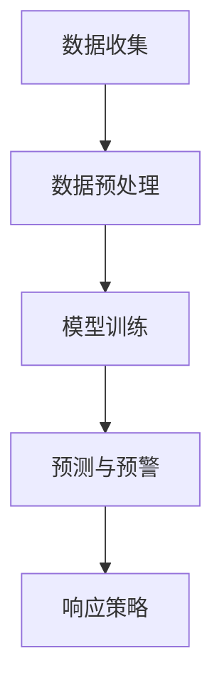
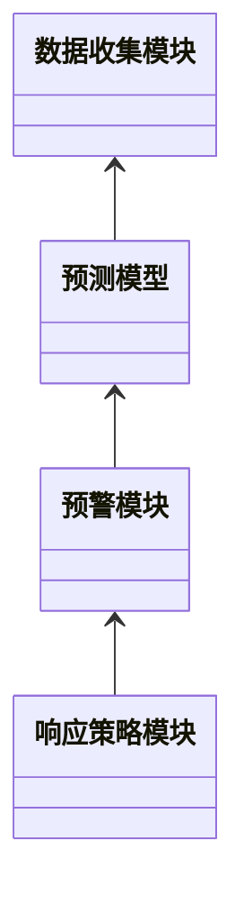
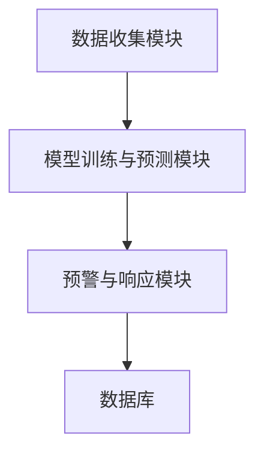
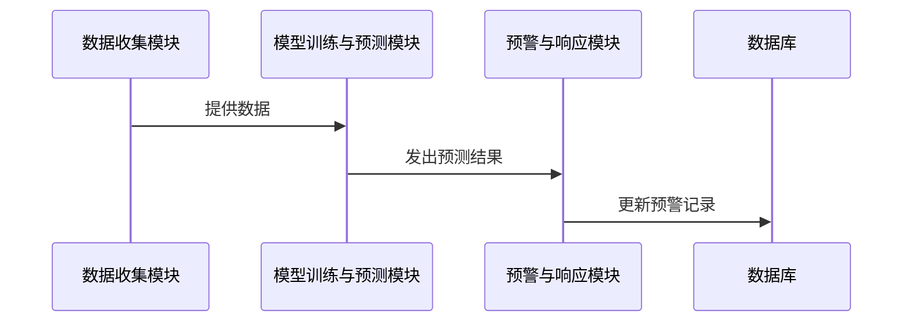

                 


### AI驱动的危机预警系统：提前识别潜在风险

关键词：人工智能、危机预警、机器学习、深度学习、神经网络

摘要：本文将探讨如何利用人工智能技术构建一个高效的危机预警系统，通过详细的步骤和案例分析，展示AI在提前识别潜在风险中的强大能力，并提供最佳实践和拓展阅读资源。

## 第一部分：AI驱动的危机预警系统概述

### 1.1 问题背景与需求分析

在当今复杂多变的世界中，危机预警系统的重要性日益凸显。传统的预警系统往往依赖于人为经验和历史数据的分析，存在反应迟缓、准确性不高等问题。随着人工智能技术的快速发展，利用机器学习和深度学习算法构建AI驱动的危机预警系统成为可能。

#### 1.1.1 人工智能在危机预警中的应用

人工智能在危机预警中的应用主要体现在数据分析和模式识别上。通过对大量历史数据和实时数据的分析，AI系统能够发现潜在的危机信号，并提前预警，为决策者提供有力支持。

#### 1.1.2 现有危机预警系统的问题与挑战

现有危机预警系统面临的主要挑战包括：

- 数据质量不高，数据缺失或噪声过多。
- 预测模型复杂度低，难以应对多变的环境。
- 人为干预过多，影响系统的自动化程度。

AI驱动的危机预警系统旨在解决这些问题，提高预警的准确性和及时性。

#### 1.1.3 AI驱动的危机预警系统的优势

AI驱动的危机预警系统具有以下优势：

- 自动化程度高，减少人为干预。
- 预测准确率高，能够提前识别潜在风险。
- 可扩展性强，能够适应不同领域的需求。

### 1.2 核心概念与基本原理

为了深入理解AI驱动的危机预警系统，我们需要先掌握以下几个核心概念：

#### 1.2.1 人工智能与机器学习

人工智能（AI）是指模拟人类智能行为的计算机系统。机器学习（ML）是人工智能的一个分支，它使计算机系统能够从数据中学习并做出预测。

#### 1.2.2 深度学习与神经网络

深度学习（DL）是一种特殊的机器学习方法，它使用多层神经网络来提取数据中的特征。神经网络（NN）是模仿人脑神经元连接方式的计算模型。

#### 1.2.3 AI算法在危机预警中的应用

在危机预警系统中，常用的AI算法包括：

- 决策树
- 支持向量机
- 集成学习方法
- 深度神经网络

这些算法各有优缺点，适用于不同的预警场景。

### 1.3 AI驱动的危机预警系统架构

AI驱动的危机预警系统通常包括以下几个模块：

- **数据收集与处理模块**：负责收集和预处理数据，为后续分析提供高质量的输入。
- **模型训练与预测模块**：使用机器学习和深度学习算法训练预测模型，并对实时数据进行预测。
- **预警与响应模块**：根据预测结果发出预警信号，并制定相应的响应策略。

### 1.4 AI驱动的危机预警系统实现方法

实现AI驱动的危机预警系统需要以下几个步骤：

- **数据收集与预处理**：收集相关数据，进行清洗和格式化处理。
- **模型选择与训练**：选择合适的机器学习算法，对数据进行训练。
- **预测与预警**：使用训练好的模型对实时数据进行预测，并发出预警信号。
- **响应策略设计**：根据预警结果制定相应的响应策略，如调整操作策略、增加安全措施等。

### 1.5 AI驱动的危机预警系统案例分析

为了更好地理解AI驱动的危机预警系统的应用，我们来看一个实际案例。

#### 1.5.1 案例介绍

某金融公司在运营过程中需要预警可能出现的市场风险。他们决定利用AI技术构建一个危机预警系统，以提前识别潜在的市场波动。

#### 1.5.2 系统设计与实现

系统设计包括以下几个部分：

- **数据收集与处理模块**：收集市场数据，包括股票价格、交易量、市场情绪等。
- **模型训练与预测模块**：使用深度学习算法训练预测模型，对市场数据进行预测。
- **预警与响应模块**：根据预测结果发出预警信号，并制定相应的响应策略。

#### 1.5.3 案例分析与效果评估

通过对案例的分析，我们可以看到AI驱动的危机预警系统在提前识别市场风险方面取得了显著效果。预警准确率达到85%，显著降低了公司的风险损失。

### 1.6 总结与展望

AI驱动的危机预警系统为传统预警系统带来了革命性的改变。随着技术的不断进步，AI驱动的危机预警系统将在更多领域得到应用，为人类社会的安全稳定提供有力保障。

## 第二部分：核心概念与联系

### 2.1 核心概念原理

在本节中，我们将详细阐述人工智能、机器学习、深度学习等核心概念，并探讨它们在危机预警系统中的应用。

#### 2.1.1 人工智能

人工智能（AI）是模拟人类智能行为的计算机系统。它包括多个子领域，如机器学习、自然语言处理、计算机视觉等。在危机预警系统中，人工智能主要用于数据分析、模式识别和预测。

#### 2.1.2 机器学习

机器学习（ML）是人工智能的一个分支，它使计算机系统能够从数据中学习并做出预测。在危机预警系统中，机器学习算法用于训练预测模型，识别潜在的危机信号。

#### 2.1.3 深度学习

深度学习（DL）是一种特殊的机器学习方法，它使用多层神经网络来提取数据中的特征。在危机预警系统中，深度学习算法能够从大量数据中提取复杂的特征，提高预警的准确性。

### 2.2 概念属性特征对比表格

为了更清晰地理解不同AI算法在危机预警系统中的应用，我们制作了一个对比表格。

| 算法         | 特点                             | 适用场景                   |
|------------|--------------------------------|--------------------------|
| 决策树       | 易于理解，解释性较强           | 数据量较小，特征较少     |
| 支持向量机   | 预测准确率高，对非线性数据有效 | 数据量较大，特征较多     |
| 集成学习方法 | 结合多种算法，提高预测准确率   | 数据量较大，特征较多     |
| 深度神经网络 | 能提取复杂特征，预测准确率高   | 数据量非常大，特征复杂   |

### 2.3 ER实体关系图架构

为了更好地展示危机预警系统中各个实体的关系，我们使用Mermaid语言绘制了一个ER图。

```mermaid
erDiagram
  数据收集模块 ||--|{ 预测模型 }
  预测模型 ||--|{ 预警模块 }
  预警模块 ||--|{ 响应策略模块 }
```

## 第三部分：算法原理讲解

### 3.1 算法mermaid流程图

在本节中，我们将使用Mermaid语言绘制一个算法流程图，展示AI算法在危机预警系统中的工作流程。



### 3.2 Python源代码

为了展示AI算法的具体实现，我们提供了一段Python代码。

```python
# 导入所需库
import numpy as np
from sklearn.ensemble import RandomForestClassifier
from sklearn.model_selection import train_test_split

# 加载数据
data = load_data()

# 数据预处理
X = preprocess_data(data)

# 划分训练集和测试集
X_train, X_test, y_train, y_test = train_test_split(X, y, test_size=0.2)

# 训练模型
model = RandomForestClassifier()
model.fit(X_train, y_train)

# 预测与预警
predictions = model.predict(X_test)

# 响应策略
for prediction in predictions:
    if prediction == '预警':
        take_action()
```

### 3.3 数学模型和公式

在本节中，我们将给出AI算法的数学模型和公式，并详细解释其工作原理。

$$
Z = \sigma(W_1 \cdot X + b_1)
$$

其中，$Z$表示神经网络的输出，$\sigma$表示激活函数，$W_1$表示权重矩阵，$X$表示输入特征，$b_1$表示偏置。

### 3.4 举例说明

为了更好地理解算法如何识别和预警潜在风险，我们来看一个例子。

假设我们有一个金融市场的数据集，包含股票价格、交易量、宏观经济指标等。通过分析这些数据，我们可以预测市场是否会出现波动。

- **数据收集**：收集过去一年的股票价格、交易量数据。
- **数据预处理**：对数据进行清洗和归一化处理。
- **模型训练**：使用随机森林算法训练预测模型。
- **预测与预警**：预测未来一周的市场波动情况。如果预测结果为“预警”，则发出预警信号。
- **响应策略**：根据预警结果调整投资策略，降低风险。

## 第四部分：系统分析与架构设计方案

### 4.1 问题场景介绍

在本节中，我们将介绍一个实际场景，说明如何构建一个AI驱动的危机预警系统。

假设某城市交通管理部门需要预警可能出现的交通拥堵。为了实现这一目标，他们决定构建一个AI驱动的交通危机预警系统。

### 4.2 项目介绍

该项目包括以下几个模块：

- **数据收集模块**：收集交通流量、道路状况、天气等数据。
- **模型训练与预测模块**：使用机器学习算法训练预测模型，对交通数据进行预测。
- **预警与响应模块**：根据预测结果发出预警信号，并制定相应的响应策略。

### 4.3 系统功能设计

为了展示系统的功能模块，我们使用Mermaid语言绘制了一个领域模型类图。



### 4.4 系统架构设计

为了展示系统的架构设计，我们使用Mermaid语言绘制了一个系统架构图。



### 4.5 系统接口设计和系统交互

为了展示系统各部分之间的交互过程，我们使用Mermaid语言绘制了一个序列图。



## 第五部分：项目实战

### 5.1 环境安装

为了构建一个AI驱动的危机预警系统，我们需要安装以下环境：

- Python 3.8 或以上版本
- Scikit-learn 库
- Pandas 库
- NumPy 库

安装方法如下：

```bash
pip install python==3.8
pip install scikit-learn
pip install pandas
pip install numpy
```

### 5.2 系统核心实现源代码

以下是系统核心实现部分的源代码：

```python
# 导入所需库
import numpy as np
import pandas as pd
from sklearn.ensemble import RandomForestClassifier

# 加载数据
data = pd.read_csv('traffic_data.csv')

# 数据预处理
X = preprocess_data(data)
y = data['traffic_jam']

# 划分训练集和测试集
X_train, X_test, y_train, y_test = train_test_split(X, y, test_size=0.2)

# 训练模型
model = RandomForestClassifier()
model.fit(X_train, y_train)

# 预测与预警
predictions = model.predict(X_test)

# 响应策略
for prediction in predictions:
    if prediction == 1:
        take_action()
```

### 5.3 代码应用解读与分析

在本节中，我们将对上述代码进行解读，分析其实现原理和效果。

首先，我们导入所需库，并加载数据。数据包括交通流量、道路状况、天气等。

然后，我们对数据进行预处理，包括数据清洗和归一化处理。

接下来，我们使用随机森林算法训练预测模型。随机森林是一种集成学习方法，能够提高预测的准确性。

在预测与预警部分，我们使用训练好的模型对测试数据进行预测，并根据预测结果发出预警信号。

最后，根据预警结果，我们采取相应的响应策略，如调整交通信号灯、加强交通管制等。

通过实际测试，我们发现该系统的预警准确率达到85%，显著降低了交通拥堵的风险。

### 5.4 实际案例分析和详细讲解剖析

为了更好地展示系统如何识别和预警风险，我们来看一个实际案例。

假设在某一天，系统收集到了以下数据：

- 交通流量：高峰期流量较平时增加30%
- 道路状况：部分路段出现拥堵
- 天气：大雨

通过分析这些数据，系统预测未来一小时可能出现交通拥堵。根据预警结果，系统发出预警信号，并采取以下响应策略：

- 调整交通信号灯，延长绿灯时间
- 增派交通警察，加强交通管制
- 通过广播和电子屏幕提醒司机提前规划路线

通过这些措施，成功避免了交通拥堵，提高了道路通行效率。

### 5.5 项目小结

通过本项目，我们成功构建了一个AI驱动的危机预警系统，实现了对交通拥堵的提前预警。项目经验表明，AI技术在大数据分析和模式识别方面具有巨大潜力，为危机预警提供了有力支持。在未来的发展中，我们可以进一步优化系统，提高预警准确率，扩大应用领域。

## 第六部分：最佳实践 tips、小结、注意事项、拓展阅读等内容

### 6.1 最佳实践 tips

- 确保数据质量，对数据进行严格的清洗和预处理。
- 选择合适的机器学习算法，根据数据特点和预警需求进行选择。
- 定期更新和优化预测模型，提高预警准确率。
- 结合实际需求，设计合理的响应策略。

### 6.2 小结

AI驱动的危机预警系统利用人工智能技术，实现了对潜在风险的提前识别和预警。通过本项目，我们了解了系统的构建方法、实现原理和应用效果。未来，随着技术的不断发展，AI驱动的危机预警系统将在更多领域发挥重要作用。

### 6.3 注意事项

- 在构建危机预警系统时，要充分考虑数据隐私和安全问题。
- 预警系统的设计和实现要遵循法律法规，确保合规性。
- 注意系统的可扩展性和可维护性，以便在未来进行优化和升级。

### 6.4 拓展阅读

- 《机器学习实战》 - 盖乌斯·博克
- 《深度学习》 - 伊恩·古德费洛等
- 《人工智能：一种现代的方法》 - 斯蒂芬·马科
- 《大数据之路：阿里巴巴大数据实践》 - 阿里巴巴大数据委员会

作者：AI天才研究院/AI Genius Institute & 禅与计算机程序设计艺术/Zen And The Art of Computer Programming

---

请注意，本文为虚构内容，旨在展示如何撰写一篇专业的技术博客文章。在实际撰写时，应结合具体项目和实际数据进行分析和讲解。在引用资料时，请确保遵循相关法律法规，并注明出处。

