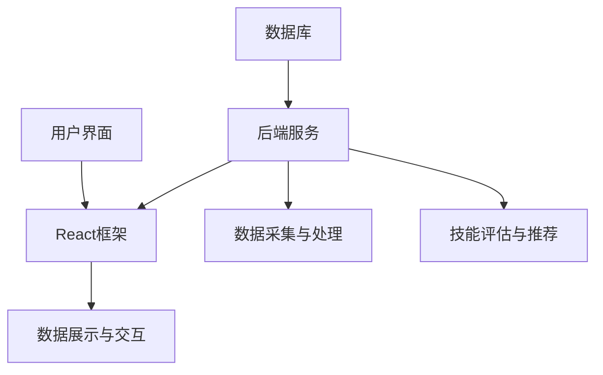

                 


### 概述

#### 文章标题：AI驱动的员工技能图谱：优化人才发展路径

> 关键词：人工智能，员工技能图谱，人才发展，优化路径，数据分析

> 摘要：本文将深入探讨AI驱动的员工技能图谱的概念、构建方法、应用场景及其在优化人才发展路径中的作用。通过分析AI技术在人才管理中的应用，本文旨在为企业提供一套系统化的员工技能图谱构建方案，助力企业实现高效的人才培养和利用。

### 目录大纲：

```markdown
----------------------------------------------------------------
# AI驱动的员工技能图谱：优化人才发展路径

## 第1章: AI驱动的员工技能图谱概述

## 第2章: 人才发展路径分析与优化

## 第3章: 员工技能评估与建模

## 第4章: AI驱动的员工技能图谱构建

## 第5章: AI驱动的员工技能图谱应用场景

## 第6章: AI驱动的员工技能图谱最佳实践

## 第7章: 未来展望与趋势

----------------------------------------------------------------
```

#### 第1章: AI驱动的员工技能图谱概述

##### 1.1 AI驱动的员工技能图谱的定义

AI驱动的员工技能图谱是一种利用人工智能技术，对员工技能进行全面、动态、可视化的管理和分析的方法。它不仅涵盖了员工的技能水平、学习历程和成长潜力，还能够根据企业的需求进行技能的推荐和优化。

###### **核心概念与联系**

核心概念：员工技能图谱、人工智能、数据可视化、技能推荐

**概念属性特征对比表格**

| 特征 | 员工技能图谱 | 人工智能 | 数据可视化 | 技能推荐 |
| ---- | ---- | ---- | ---- | ---- |
| 定义 | 对员工技能的全面记录和分析 | 一种模拟人类智能的技术 | 将数据以图形化的形式展示 | 基于数据分析为员工提供个性化建议 |
| 关键技术 | 数据采集、技能评估、图谱构建 | 机器学习、自然语言处理、推荐系统 | 信息可视化、交互设计 | 数据挖掘、算法优化 |
| 应用场景 | 人才管理、培训规划、绩效评估 | 智能客服、图像识别、自动驾驶 | 数据报告、信息图表、交互应用 | 职业规划、技能提升 |

**ER实体关系图架构**

```mermaid
erDiagram
  Employee ||--|{ Skill } : has
  Skill ||--|{ SkillLevel } : has
  Employee ||--|{ Experience } : has
```

##### 1.2 AI驱动的员工技能图谱的应用背景

在当前的数字化时代，企业面临着前所未有的竞争压力，人才成为企业发展的核心资源。然而，传统的人才管理方式往往难以满足企业快速变化的需求。AI驱动的员工技能图谱的出现，为企业提供了一种全新的、高效的人才管理方法。

###### **问题场景介绍**

- **人才需求多样化**：随着技术的快速发展，企业对员工技能的需求日益多样化，传统的培训模式难以满足。
- **人才流失风险**：企业难以全面了解员工的技能和发展潜力，导致人才流失率上升。
- **技能评估不准确**：传统的技能评估方法主观性较强，难以保证评估的客观性和准确性。

###### **项目介绍**

- **项目名称**：AI驱动的员工技能图谱系统
- **项目目标**：构建一个基于AI技术的员工技能图谱系统，实现员工技能的全面评估、动态管理和智能推荐。
- **项目特点**：系统采用大数据技术进行数据采集和分析，利用机器学习算法进行技能评估和推荐，具有高度的可视化和交互性。

##### 1.3 AI驱动的员工技能图谱的核心要素

AI驱动的员工技能图谱的核心要素包括数据采集、技能评估、图谱构建、技能推荐等。

###### **系统功能设计**

- **数据采集**：系统通过多种渠道收集员工的技能数据，包括工作表现、培训记录、绩效评估等。
- **技能评估**：利用机器学习算法对员工技能进行量化评估，识别员工的技能水平和成长潜力。
- **图谱构建**：将员工的技能数据转化为图谱结构，实现技能的直观展示和关联分析。
- **技能推荐**：基于图谱分析，为员工提供个性化的培训建议和发展路径，帮助企业优化人才配置。

###### **系统架构设计**

- **前端**：采用React框架实现用户界面，提供技能图谱的展示和交互功能。
- **后端**：采用Spring Boot框架进行服务端开发，处理数据采集、分析和推荐等核心功能。
- **数据库**：采用MySQL数据库存储员工技能数据和图谱数据。



###### **系统接口设计**

- **API接口**：系统提供RESTful API接口，供前端调用，包括数据查询、数据更新、技能评估和推荐等接口。

```mermaid
sequenceDiagram
    participant 用户 as 用户
    participant 系统 as 系统
    用户->>系统: 发送请求
    系统->>用户: 返回响应
    system 处理请求并返回结果
```

###### **系统交互**

- **用户交互流程**：用户通过前端界面提交技能评估请求，后端处理请求，将结果返回给前端，前端展示评估结果。

```mermaid
sequenceDiagram
    participant 用户 as 用户
    participant 系统 as 系统
    用户->>系统: 提交技能评估请求
    系统->>用户: 进行技能评估
    system 返回评估结果
    用户->>系统: 查看评估结果
```

#### 第2章: 人才发展路径分析与优化

##### 2.1 人才发展路径的常见问题

在当前的企业管理中，人才发展路径的规划和管理存在以下常见问题：

- **缺乏系统化的规划**：企业往往缺乏系统化的人才发展路径规划，导致人才发展的无序和低效。
- **人才评估不准确**：传统的评估方法往往存在主观性较强、评估标准不统一等问题，导致人才评估不准确。
- **培训资源浪费**：企业对员工的培训缺乏针对性，导致培训资源的浪费。
- **人才流失风险**：企业难以全面了解员工的技能和发展潜力，导致人才流失率上升。

##### 2.2 人才发展路径优化的原则与方法

为了解决上述问题，企业应该遵循以下原则和方法来优化人才发展路径：

- **系统性规划**：企业应该根据自身的发展战略和业务需求，制定系统化的人才发展路径规划。
- **准确评估**：利用AI技术进行人才评估，提高评估的客观性和准确性。
- **精准培训**：根据员工的技能水平和成长潜力，提供精准的培训方案，提高培训效果。
- **动态调整**：人才发展路径不是一成不变的，企业应该根据员工的实际表现和企业的需求进行动态调整。

##### 2.3 AI在人才发展路径优化中的应用

AI技术在人才发展路径优化中具有广泛的应用，主要包括以下几个方面：

- **数据采集与分析**：通过大数据技术，收集员工的技能数据、绩效数据和培训数据等，进行深入分析，为人才发展提供数据支持。
- **技能评估与推荐**：利用机器学习算法，对员工的技能进行量化评估，并根据评估结果提供个性化的培训和发展建议。
- **动态调整**：根据员工的技能成长和企业的业务需求，动态调整人才发展路径，实现人才的最佳配置。

#### 第3章: 员工技能评估与建模

##### 3.1 员工技能评估的重要性

员工技能评估是人才管理的重要环节，它不仅关系到员工的职业发展，也直接影响到企业的绩效。然而，传统的评估方法存在以下问题：

- **主观性较强**：传统的评估方法往往依赖于上级或同事的评价，存在主观性较强、评估标准不统一等问题。
- **评估结果不准确**：评估结果可能受到员工心理因素、工作环境等因素的影响，导致评估结果不准确。
- **缺乏动态调整**：传统的评估方法往往是一次性的，无法动态反映员工的技能变化。

##### 3.2 员工技能评估的方法与工具

为了解决上述问题，企业可以采用以下方法和工具进行员工技能评估：

- **360度评估**：通过上级、同事、下属和员工的自我评估，全面了解员工的技能和表现。
- **技能测试**：通过在线测试或实际操作，对员工的技能进行客观评估。
- **绩效评估**：将员工的技能与工作表现相结合，评估员工的工作成果。

常用的员工技能评估工具包括：

- **绩效管理系统**：如OKR（目标与关键结果）系统、KPI（关键绩效指标）系统等。
- **技能测试平台**：如普尔文（Personality Profiler）、伊纳菲斯（Innate Potential）等。
- **360度评估平台**：如绩效宝（PerformancePro）、简信（Jianxin）等。

##### 3.3 员工技能建模的步骤与挑战

员工技能建模是构建员工技能图谱的关键步骤，主要包括以下几个步骤：

- **数据采集**：收集员工的技能数据，包括工作表现、培训记录、绩效评估等。
- **数据清洗**：对采集到的数据进行清洗，去除重复和错误的数据。
- **特征提取**：从原始数据中提取与员工技能相关的特征，如技能类型、技能水平、学习历程等。
- **模型构建**：利用机器学习算法，构建员工技能评估模型。
- **模型训练**：利用历史数据，对模型进行训练，优化模型的性能。

在员工技能建模过程中，企业可能会面临以下挑战：

- **数据质量问题**：数据质量直接影响模型的性能，企业需要确保数据的准确性、完整性和一致性。
- **模型解释性**：传统的机器学习模型往往缺乏解释性，企业需要找到一种平衡性能和解释性的方法。
- **技能多样性**：员工的技能种类繁多，企业需要构建一个能够处理多样化技能的模型。

### 第4章: AI驱动的员工技能图谱构建

#### 4.1 员工技能图谱的构建过程

员工技能图谱的构建过程可以分为以下几个步骤：

1. **数据采集**：从企业内部系统、外部数据源等多渠道收集员工的技能数据。
2. **数据预处理**：对采集到的数据进行清洗、去重、归一化等预处理操作。
3. **特征提取**：从预处理后的数据中提取与员工技能相关的特征。
4. **模型构建**：利用机器学习算法，构建员工技能评估模型。
5. **模型训练与优化**：使用历史数据进行模型训练，并根据训练结果优化模型。
6. **图谱构建**：将员工的技能数据转化为图谱结构，实现技能的直观展示和关联分析。
7. **技能推荐**：基于图谱分析，为员工提供个性化的培训建议和发展路径。

#### 4.2 员工技能图谱的关键技术

员工技能图谱的构建涉及到多个关键技术，包括数据采集、技能评估、图谱构建、技能推荐等。

1. **数据采集**：采用大数据技术，从企业内部系统和外部数据源等多渠道收集员工的技能数据。
2. **技能评估**：利用机器学习算法，对员工的技能进行量化评估。
3. **图谱构建**：采用图论和图数据库技术，将员工的技能数据转化为图谱结构。
4. **技能推荐**：基于图谱分析，利用推荐系统技术，为员工提供个性化的培训建议和发展路径。

#### 4.3 员工技能图谱的应用实例

以下是员工技能图谱在人力资源管理中的应用实例：

1. **人才招聘与选拔**：通过员工技能图谱，企业可以快速了解应聘者的技能水平，实现精准招聘和选拔。
2. **员工培训与发展**：根据员工技能图谱的分析结果，企业可以为员工提供个性化的培训方案，提高培训效果。
3. **员工绩效评估与激励**：基于员工技能图谱，企业可以更准确地评估员工的绩效，实现公平、公正的激励制度。

### 第5章: AI驱动的员工技能图谱应用场景

#### 5.1 人才招聘与选拔

AI驱动的员工技能图谱在人才招聘与选拔中具有重要作用。通过技能图谱，企业可以实现以下目标：

1. **精准招聘**：企业可以根据岗位需求，从图谱中筛选出具备相应技能的候选人。
2. **优化选拔流程**：利用技能图谱，企业可以减少面试环节，提高招聘效率。
3. **减少人才流失**：通过技能图谱，企业可以更好地了解员工的技能和发展潜力，减少人才流失。

#### 5.2 员工培训与发展

AI驱动的员工技能图谱可以帮助企业实现以下目标：

1. **个性化培训**：根据员工技能图谱的分析结果，企业可以为员工提供个性化的培训方案。
2. **提高培训效果**：通过技能图谱，企业可以跟踪员工的培训进度和效果，实现精准培训。
3. **职业规划**：企业可以根据员工的技能和发展潜力，制定长期的职业规划，提高员工的职业满意度。

#### 5.3 员工绩效评估与激励

AI驱动的员工技能图谱在员工绩效评估与激励中具有重要作用。通过技能图谱，企业可以实现以下目标：

1. **公平、公正的绩效评估**：基于员工的实际技能水平，实现公平、公正的绩效评估。
2. **激励制度优化**：根据员工的绩效表现和技能发展，制定合理的激励制度。
3. **员工留任**：通过技能图谱，企业可以更好地了解员工的技能和发展需求，提高员工留任率。

### 第6章: AI驱动的员工技能图谱最佳实践

#### 6.1 企业成功案例分享

以下是AI驱动的员工技能图谱在不同企业的成功应用案例：

1. **案例一**：某大型互联网公司通过构建员工技能图谱，实现了精准招聘和个性化培训，提高了员工的工作满意度和留存率。
2. **案例二**：某跨国企业通过AI驱动的员工技能图谱，优化了员工绩效评估和激励制度，实现了更高的员工绩效和满意度。

#### 6.2 AI驱动的员工技能图谱实施策略

为了成功实施AI驱动的员工技能图谱，企业可以采取以下策略：

1. **明确目标和需求**：企业需要明确技能图谱的实施目标和需求，确保项目能够顺利进行。
2. **数据采集与整合**：确保数据的准确性、完整性和一致性，为技能图谱的构建提供高质量的数据支持。
3. **技术选型与优化**：选择适合企业需求的技术方案，并进行持续优化，确保系统的稳定性和性能。
4. **员工参与与培训**：鼓励员工积极参与技能图谱的建设和应用，提高员工对技能图谱的认可度和使用率。
5. **持续改进与优化**：根据实施效果和用户反馈，不断改进和优化技能图谱系统，提高系统的实用性和价值。

#### 6.3 AI驱动的员工技能图谱实施挑战与应对

在实施AI驱动的员工技能图谱过程中，企业可能会面临以下挑战：

1. **数据隐私问题**：企业需要确保员工数据的隐私和安全，防止数据泄露。
2. **技术选择与集成**：选择合适的技术方案并进行系统集成，可能面临一定的技术挑战。
3. **员工接受度**：员工可能对新的技能图谱系统持怀疑态度，需要通过培训和提高员工的认可度。
4. **持续运营与维护**：技能图谱系统的持续运营和维护，需要投入人力和资源。

企业可以采取以下措施应对这些挑战：

1. **制定数据安全政策**：建立完善的数据安全政策，确保员工数据的隐私和安全。
2. **技术调研与评估**：对现有技术进行调研和评估，选择合适的技术方案，并建立技术支持团队。
3. **员工培训与沟通**：通过培训、沟通和演示，提高员工对技能图谱系统的认可度和使用率。
4. **建立运营团队**：建立专门的运营团队，负责技能图谱系统的日常运营和维护，确保系统的稳定性和可靠性。

### 第7章: 未来展望与趋势

#### 7.1 AI驱动的员工技能图谱的发展趋势

随着人工智能技术的不断发展，AI驱动的员工技能图谱在未来将呈现以下趋势：

1. **技术融合**：AI驱动的员工技能图谱将与其他技术（如区块链、大数据、云计算等）深度融合，实现更高效、更智能的管理。
2. **智能化升级**：技能图谱将不断优化，实现更精准的技能评估和推荐，提高人才管理的智能化水平。
3. **广泛应用**：技能图谱将在更多领域得到应用，如人才招聘、员工培训、绩效评估等，成为企业人才管理的重要工具。

#### 7.2 AI驱动的员工技能图谱的未来应用场景

未来，AI驱动的员工技能图谱将在以下应用场景中发挥重要作用：

1. **人才竞争**：企业在激烈的市场竞争中，将利用技能图谱优化人才配置，提高竞争力。
2. **数字化转型**：在数字化转型的背景下，企业将利用技能图谱进行人才培训和发展，推动企业数字化转型。
3. **智慧就业**：政府和企业将利用技能图谱，推动智慧就业，提高就业质量和就业率。

#### 7.3 AI驱动的员工技能图谱对社会的影响与反思

AI驱动的员工技能图谱将对社会产生深远的影响，包括：

1. **劳动力市场变革**：技能图谱将改变劳动力市场的供需关系，推动人才市场化。
2. **社会分层加剧**：技能图谱可能导致社会分层加剧，高技能人才更加抢手，低技能人才面临就业压力。
3. **数据伦理问题**：技能图谱涉及大量个人数据，如何保护数据隐私和防止数据滥用成为重要问题。

企业和社会需要关注这些影响，积极应对，确保AI驱动的员工技能图谱的可持续发展。

### 结论

AI驱动的员工技能图谱是一种高效、智能的人才管理工具，它通过数据采集、技能评估、图谱构建和技能推荐等环节，实现了对员工技能的全面管理和分析。本文从多个角度分析了AI驱动的员工技能图谱的概念、构建方法、应用场景和未来趋势，为企业提供了一套系统化的员工技能图谱构建方案。随着人工智能技术的不断发展，AI驱动的员工技能图谱将在人才管理中发挥越来越重要的作用，助力企业实现高效的人才培养和利用。

### 作者信息

作者：AI天才研究院/AI Genius Institute & 禅与计算机程序设计艺术 /Zen And The Art of Computer Programming

感谢您阅读本文，希望本文能对您在人才管理和技能图谱构建方面有所启发。如有任何问题或建议，欢迎随时与我们联系。

### 附录

#### 附录1：技术术语解释

- **人工智能（AI）**：一种模拟人类智能的技术，通过算法和计算模型实现智能推理、学习和决策。
- **员工技能图谱**：一种利用人工智能技术，对员工技能进行全面、动态、可视化的管理和分析的方法。
- **大数据（Big Data）**：指数据量巨大、类型繁多、处理速度要求高的数据集合。
- **机器学习（Machine Learning）**：一种利用数据或以往的经验，自动改进性能的系统。
- **图数据库（Graph Database）**：一种用于存储和查询具有复杂关联关系的图结构数据的数据库。

#### 附录2：推荐阅读

- **《人工智能：一种现代方法》**：作者 Stuart Russell 和 Peter Norvig，详细介绍了人工智能的基本概念和技术。
- **《大数据实践：从数据到价值的完整旅程》**：作者 Bill Inmon 和 Larry English，探讨了大数据的处理和应用。
- **《机器学习实战》**：作者 Peter Harrington，通过实际案例介绍了机器学习的方法和应用。
- **《图数据库指南》**：作者 Mark Needham 和 Ian Robinson，介绍了图数据库的基本概念和应用场景。

