                 


### 1.1 AI的发展与影响

人工智能（AI）作为21世纪最具变革性的技术之一，其发展对各行各业产生了深远的影响。从最初的简单逻辑推理和规则系统，到现在的深度学习、自然语言处理、计算机视觉等复杂领域，AI技术不断突破自身的局限，展现出了惊人的潜力。

**背景介绍**：
人工智能的概念起源于20世纪50年代，最初是作为对人类智能的模拟与扩展。随着计算机技术的快速发展，尤其是近年来深度学习算法的突破，AI技术取得了显著的进展。深度学习通过模仿人脑的神经网络结构，实现了在图像识别、语音识别、自然语言处理等领域的卓越表现。

**问题背景**：
在市场竞争日益激烈的今天，品牌认知和品牌情感成为企业成功的关键因素。消费者对品牌的认知不仅停留在理性层面，更涉及到感性层面，即品牌情感。如何通过技术手段深入理解品牌情感，成为企业迫切需要解决的问题。

**问题解决**：
AI技术的出现，为品牌情感分析提供了强有力的工具。通过自然语言处理、情感分析等算法，AI能够从大量的消费者反馈中提取情感信息，帮助企业了解消费者的真实感受，进而优化品牌策略。

**边界与外延**：
品牌情感分析不仅涉及对消费者情感的识别，还包括对情感强度、情感倾向等维度的分析。同时，它还需要考虑不同文化、地域背景下的情感差异，以及如何将这些情感数据转化为实际的品牌价值。

**概念结构与核心要素组成**：

- **自然语言处理**：是AI的基础技术，负责将自然语言（如文本、语音）转化为计算机可处理的数据。
- **情感词典**：用于标识和分类情感词，是情感分析的核心工具。
- **情感极性**：分为正面情感、负面情感和中性情感，用于描述情感的倾向性。
- **情感强度**：用于量化情感的强烈程度，通常通过情感词典和机器学习模型来实现。

### 1.2 品牌情感分析的定义

品牌情感分析是指利用自然语言处理和机器学习技术，对消费者对品牌的情感反馈进行分析和理解的过程。通过这种分析，企业可以深入了解消费者对品牌的情感态度，从而制定更加精准的市场营销策略。

**核心概念与联系**：

- **情感分析**：是自然语言处理的一个分支，主要研究如何从文本中识别、提取和量化情感。
- **品牌情感**：是指消费者对品牌的情感反应，包括喜爱、厌恶、信任等。
- **消费者反馈**：是品牌情感分析的重要数据来源，通常包括社交媒体评论、消费者评价、市场调研等。

### 1.3 AI驱动品牌情感分析的意义

AI驱动品牌情感分析具有以下几个方面的意义：

**1. 提高品牌认知度**：
通过分析消费者的情感反馈，企业可以更准确地了解消费者对品牌的看法，从而提高品牌的认知度和影响力。

**2. 优化营销策略**：
品牌情感分析可以帮助企业识别出消费者情感的关键因素，进而优化营销策略，提高营销效果。

**3. 改进产品与服务**：
了解消费者的情感反应，企业可以更好地改进产品和服务，提高客户满意度。

**4. 降低成本**：
传统市场调研成本较高，而AI驱动的品牌情感分析可以以较低的成本获取大量消费者数据，提高市场调研的效率和准确性。

**5. 预测市场趋势**：
通过分析消费者的情感变化，企业可以预测市场趋势，为未来的战略规划提供依据。

**6. 促进创新**：
AI驱动的品牌情感分析可以为企业提供新的创新思路，帮助企业开发出更符合消费者需求的产品和服务。

### 1.4 研究目的与内容结构

**研究目的**：
本文旨在深入探讨AI驱动的品牌情感分析技术，分析其核心概念、技术原理以及在实际应用中的效果和挑战。通过案例分析，展示AI驱动品牌情感分析在实际应用中的价值，并提出未来发展的方向。

**内容结构概述**：
本文分为以下几个部分：
- **第一部分：引言**：介绍AI与品牌情感分析的关系，阐述研究背景和目的。
- **第二部分：AI驱动的品牌情感分析技术**：介绍自然语言处理、情感分析等核心技术。
- **第三部分：品牌情感分析的核心概念**：详细探讨情感分析的基本原理、关键因素和核心概念。
- **第四部分：AI技术在品牌情感分析中的应用**：分析深度学习等AI技术在品牌情感分析中的应用。
- **第五部分：案例研究与实践**：通过具体案例展示AI驱动品牌情感分析的实际应用。
- **第六部分：未来发展趋势与挑战**：探讨品牌情感分析的未来发展趋势和面临的挑战。
- **第七部分：结论与展望**：总结研究成果，提出未来研究方向。

通过以上结构的设置，本文将全面、系统地探讨AI驱动的品牌情感分析，旨在为相关领域的研究者和企业提供有价值的参考和指导。接下来，我们将深入探讨AI驱动的品牌情感分析技术，为后续内容打下坚实基础。🔮

### 2.1 自然语言处理基础

自然语言处理（Natural Language Processing, NLP）是人工智能（AI）的一个重要分支，它致力于让计算机理解和生成人类语言。NLP技术涉及到从文本中提取信息、理解和生成语言，以及进行语言翻译、情感分析、文本分类等多种任务。以下是NLP中几个核心技术的基础概念和详细讲解。

#### 2.1.1 词嵌入技术

**核心概念**：
词嵌入（Word Embedding）是将自然语言中的单词映射到固定维度的向量空间中。这些向量不仅能够表示单词的语义信息，还能够捕捉到单词之间的相似性和相关性。

**详细讲解**：
词嵌入技术最早由Word2Vec算法提出，Word2Vec包括两个变体：连续词袋（Continuous Bag of Words, CBOW）和Skip-Gram。CBOW算法通过上下文单词预测中心词，而Skip-Gram则通过中心词预测上下文单词。词嵌入技术不仅能够提高语言模型的性能，还能够用于文本分类、情感分析等任务。

**对比表格**：
| 技术名称 | 描述 | 应用场景 |
| --- | --- | --- |
| CBOW | 通过上下文单词预测中心词 | 文本分类、情感分析 |
| Skip-Gram | 通过中心词预测上下文单词 | 文本分类、情感分析 |

**ER实体关系图架构**：

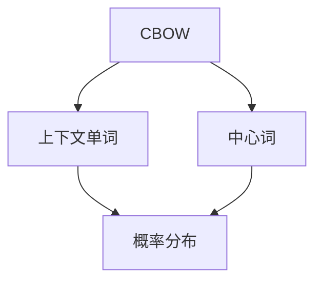

**算法原理讲解**：
CBOW和Skip-Gram算法都是基于神经网络的，其中输入层为上下文单词或中心词，隐藏层通过神经网络模型生成概率分布，输出层为单词的概率分布。CBOW算法的输入为上下文单词，输出为预测的中心词；而Skip-Gram算法的输入为中心词，输出为预测的上下文单词。

**Python源代码示例**：

```python
from gensim.models import Word2Vec
import nltk

# 加载预处理的文本数据
sentences = nltk.corpus.gutenberg.sents('shakespeare-hamlet.txt')

# 训练Word2Vec模型
model = Word2Vec(sentences, size=100)

# 查看单词'thing'的向量表示
thing_vector = model['thing']
print(thing_vector)
```

#### 2.1.2 主题建模技术

**核心概念**：
主题建模（Topic Modeling）是一种无监督学习方法，用于发现文本数据中的潜在主题。它通过构建概率模型，将文档集合映射到主题空间中，每个主题由一组单词集合表示。

**详细讲解**：
最常见的主题建模算法是LDA（Latent Dirichlet Allocation），它假设每个文档是由多个主题混合生成的，每个主题由多个单词混合生成。LDA算法通过估计文档-主题分布和主题-词分布，从而发现文本数据中的潜在主题。

**ER实体关系图架构**：

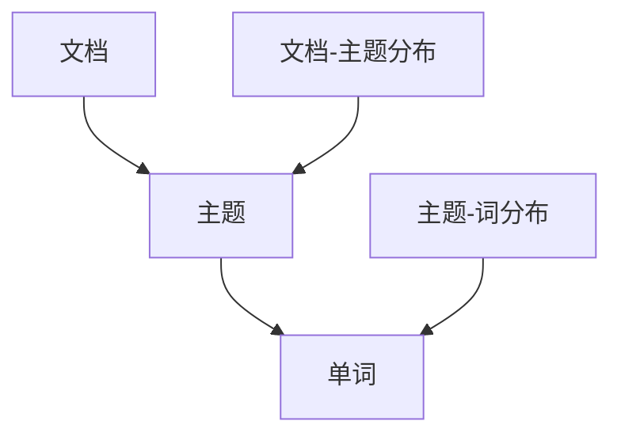

**算法原理讲解**：
LDA算法主要包括以下步骤：
1. 初始化主题-词分布和文档-主题分布。
2. 对于每个文档，随机选择一个主题。
3. 对于每个主题，随机选择一组单词。
4. 根据文档-主题分布和主题-词分布更新参数。
5. 重复步骤2-4，直到收敛。

**Python源代码示例**：

```python
from gensim.models import LdaModel
import gensim.corpora as corpora

# 加载预处理的文本数据
dictionary = corpora.Dictionary([doc.split() for doc in sentences])
corpus = [dictionary.doc2bow(doc) for doc in sentences]

# 训练LDA模型
lda_model = LdaModel(corpus, num_topics=10, id2word=dictionary)

# 查看每个文档的主题分布
for doc_bow in corpus:
    print(lda_model.get_document_topics(doc_bow))
```

#### 2.1.3 序列标注与分类技术

**核心概念**：
序列标注（Sequence Labeling）是对文本中的每个单词或字符进行分类的任务，常见的序列标注任务包括命名实体识别（Named Entity Recognition, NER）和词性标注（Part-of-Speech Tagging）。

**详细讲解**：
序列标注任务通常使用CRF（条件随机场）或BiLSTM（双向长短期记忆网络）等模型来实现。CRF模型能够处理序列数据中的依赖关系，而BiLSTM则能够捕捉序列中的长距离依赖。

**ER实体关系图架构**：

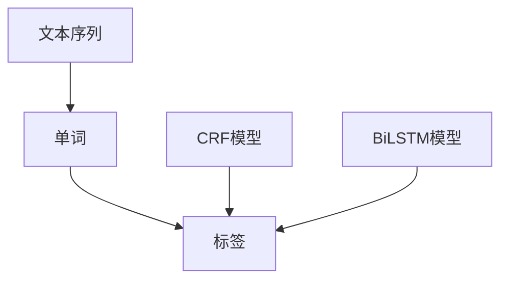

**算法原理讲解**：
CRF模型通过定义状态转移概率和状态发射概率，实现对序列的标注。BiLSTM模型通过双向的隐藏状态，捕捉文本序列中的长距离依赖。

**Python源代码示例**：

```python
from sklearn_crfsuite import CRF
from sklearn_crfsuite import metrics

# 加载预处理的文本数据
X = [[['I', 'am', 'a'], ['person'], ['living', 'in', 'the'], ['United', 'States']]]

# 加载标签
y = [[['O', 'O', 'B-PER', 'O', 'O', 'B-LOC', 'O', 'O', 'B-COUNTRY']]]

# 训练CRF模型
crf = CRF()
crf.fit(X, y)

# 预测
pred = crf.predict([X[0]])

# 评估
print(metrics.flat_f1_score(y, pred, average='weighted'))
```

通过以上对自然语言处理基础技术的详细讲解，我们为理解后续的品牌情感分析技术奠定了基础。接下来，我们将深入探讨情感分析的核心概念，包括情感词典、情感极性和情感强度等，以进一步了解AI驱动的品牌情感分析。🔬

### 2.2 情感分析技术

情感分析（Sentiment Analysis）是自然语言处理（NLP）中的一项重要任务，旨在通过自动化手段从文本中识别出情感倾向和情感强度。在品牌情感分析中，情感分析技术起着核心作用，可以帮助企业了解消费者对品牌的情感反应。以下是情感分析技术的核心概念、算法原理以及应用实例。

#### 2.2.1 情感词典与情感极性

**情感词典**：
情感词典（Sentiment Lexicon）是一组标记了情感极性（情感倾向）的词汇表。这些词汇通常分为正面情感词（如“喜欢”、“满意”）、负面情感词（如“不喜欢”、“失望”）和中性情感词（如“可能”、“似乎”）。情感词典是情感分析的基础工具，用于初始化情感分类器。

**情感极性**：
情感极性（Sentiment Polarity）是指文本表达的情感倾向，分为正面（Positive）、负面（Negative）和中性（Neutral）。正面情感通常与消费者的积极反馈相关，负面情感则与消费者的不满或抱怨相关，而中性情感则不带有明显的情感倾向。

**应用实例**：
假设有一个包含情感词典的文本分类器，输入文本是“这家餐厅的菜品很好吃，但服务不太满意”。情感分类器将根据情感词典中的词汇，将文本中的情感倾向分类为“正面”和“负面”，同时量化每个情感倾向的强度。

#### 2.2.2 情感强度的量化方法

情感强度的量化方法用于衡量文本中情感倾向的强烈程度。情感强度通常通过情感词典中的情感分数或情感词的权重来计算。以下是几种常见的情感强度量化方法：

1. **情感分数法**：
   通过为每个情感词分配一个情感分数，将文本中所有情感词的分数相加，得到文本的整体情感强度。情感分数通常是基于情感词典中情感词的情感倾向得分。

2. **词频法**：
   通过计算文本中情感词的出现频率来衡量情感强度。频率越高，情感强度越大。这种方法简单直观，但可能无法准确捕捉情感强度的细微差别。

3. **情感词权重法**：
   结合情感词的频率和权重来计算情感强度。权重通常取决于情感词的重要性和上下文。这种方法能够更准确地量化情感强度。

**应用实例**：
假设使用情感词典和情感分数法对一段文本进行情感强度量化。文本是“我非常喜欢这家店，菜品丰富，服务也很棒”。通过计算文本中的正面情感词的分数，可以得到文本的整体情感强度为高。

#### 2.2.3 情感分析算法

情感分析算法用于实现情感词典的匹配、情感极性的分类和情感强度的量化。以下是一些常用的情感分析算法：

1. **基于规则的方法**：
   这种方法通过定义一组规则来匹配情感词典中的情感词，并分类情感极性。优点是简单易实现，缺点是规则的编写和更新需要大量的人力和时间。

2. **机器学习方法**：
   通过训练机器学习模型，将情感分析任务转化为特征向量分类问题。常见的机器学习方法包括SVM（支持向量机）、Naive Bayes（朴素贝叶斯）和神经网络等。

3. **深度学习方法**：
   利用深度学习模型（如CNN、RNN、LSTM等）来自动提取文本特征并进行情感分析。深度学习方法在处理复杂文本和捕捉长距离依赖方面具有显著优势。

**应用实例**：
假设使用LSTM（长短期记忆网络）对一段社交媒体评论进行情感分析。LSTM模型能够捕捉评论中的情感变化和上下文信息，从而更准确地分类情感极性和量化情感强度。

通过以上对情感分析技术的详细讲解，我们可以看到情感分析在品牌情感分析中的重要性。接下来，我们将进一步探讨品牌情感分析的核心概念，包括消费者行为分析、社交媒体情感分析和市场调研情感分析。这将帮助我们更全面地理解AI驱动的品牌情感分析技术。🔍

### 3.1 情感分析的基本原理

情感分析（Sentiment Analysis）是自然语言处理（NLP）中的一项关键技术，其核心目的是从文本中识别出情感倾向和情感强度。理解情感分析的基本原理对于进一步探索AI驱动的品牌情感分析至关重要。以下是情感分析技术的基本原理、技术框架、情感词典与情感极性、以及情感强度的量化方法。

#### 情感分析的技术框架

**情感分析流程**：
情感分析通常包括以下几个步骤：
1. **文本预处理**：包括去除停用词、标点符号、进行词形还原等，以提高模型性能。
2. **特征提取**：将预处理后的文本转换为数值化的特征向量，常用的方法包括词袋模型（Bag of Words, BOW）、词嵌入（Word Embedding）等。
3. **情感分类**：使用分类算法（如朴素贝叶斯、支持向量机SVM、深度学习等）对特征向量进行情感分类。
4. **情感强度量化**：对分类结果进行情感强度的量化，通常通过情感词典或机器学习模型来实现。

**技术框架图**：

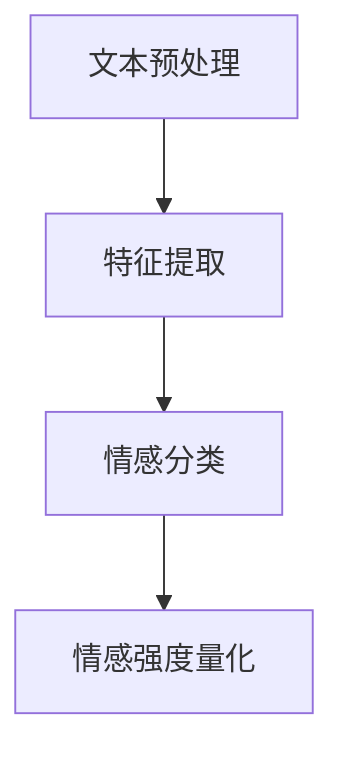

#### 情感词典与情感极性

**情感词典**：
情感词典（Sentiment Lexicon）是情感分析的重要工具，它包含了一系列预定义的词汇，每个词汇都标有一个情感极性标签（如正面、负面、中性）。情感词典的构建方法包括手工编纂和自动生成。手工编纂情感词典通常依赖于领域专家的知识，而自动生成方法则利用数据挖掘和机器学习技术。

**情感极性**：
情感极性是指文本表达的情感倾向，通常分为正面（Positive）、负面（Negative）和中性（Neutral）三种。情感极性标签可以帮助情感分类器识别文本的情感倾向。

#### 情感强度的量化方法

**情感分数法**：
情感分数法通过为每个情感词分配一个情感得分，将文本中所有情感词的得分相加，得到文本的整体情感得分。情感得分为正表示正面情感，为负表示负面情感，为零表示中性情感。

**词频法**：
词频法通过计算文本中情感词的出现频率来衡量情感强度。频率越高，情感强度越大。词频法简单直观，但可能无法准确捕捉情感强度的细微差别。

**情感词权重法**：
情感词权重法结合情感词的频率和权重来计算情感强度。权重通常取决于情感词的重要性和上下文。这种方法能够更准确地量化情感强度。

#### 情感分析算法

**基于规则的方法**：
基于规则的方法通过定义一组规则来匹配情感词典中的情感词，并分类情感极性。这种方法简单易实现，但规则的编写和更新需要大量的人力和时间。

**机器学习方法**：
机器学习方法通过训练分类模型（如SVM、朴素贝叶斯、随机森林等）来实现情感分类。机器学习方法能够自动学习文本特征，具有较高的准确性和泛化能力。

**深度学习方法**：
深度学习方法（如CNN、RNN、LSTM等）能够自动提取文本特征并进行情感分类。深度学习方法在处理复杂文本和捕捉长距离依赖方面具有显著优势。

**算法流程图**：

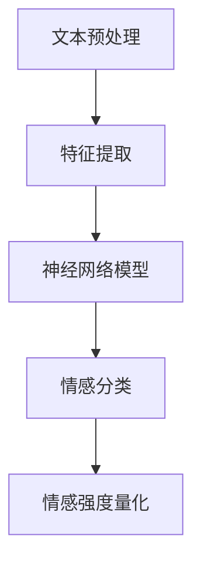

#### 算法原理讲解

**基于规则的方法**：
假设我们有一个情感词典包含以下情感词和相应的情感极性：
- 正面情感词：喜欢、满意、开心
- 负面情感词：不喜欢、失望、愤怒

一个简单的规则可以是：如果一个句子中包含正面情感词，则该句子为正面情感；如果一个句子中包含负面情感词，则该句子为负面情感。这种方法虽然简单，但在处理复杂情感时可能不够准确。

**机器学习方法**：
以朴素贝叶斯为例，假设我们有一个训练集，其中包含了带有情感标签的句子。朴素贝叶斯模型通过计算每个句子中情感词的概率分布，并使用贝叶斯定理来预测新句子的情感极性。

**Python示例**：

```python
from sklearn.naive_bayes import MultinomialNB
from sklearn.feature_extraction.text import CountVectorizer

# 加载训练数据
X_train = ["我喜欢这个产品", "这个产品太贵了", "我很满意这个服务"]
y_train = ["正面", "负面", "正面"]

# 构建词袋模型
vectorizer = CountVectorizer()
X_train_vectors = vectorizer.fit_transform(X_train)

# 训练朴素贝叶斯模型
model = MultinomialNB()
model.fit(X_train_vectors, y_train)

# 测试数据
X_test = ["这个产品很好用"]
X_test_vectors = vectorizer.transform(X_test)

# 预测情感极性
print(model.predict(X_test_vectors)[0])
```

**深度学习方法**：
以LSTM为例，LSTM模型通过捕捉文本序列中的长期依赖关系，能够更准确地识别情感。LSTM模型通常包括输入层、隐藏层和输出层。输入层接收文本序列，隐藏层通过记忆单元捕获文本中的情感信息，输出层生成情感极性预测。

**Python示例**：

```python
from keras.models import Sequential
from keras.layers import LSTM, Dense, Embedding

# 加载预处理的文本数据
X = [[word for word in sentence.split()], sentence for sentence in sentences]
y = [[1 if sentiment == "正面" else 0, 1 if sentiment == "负面" else 0] for sentiment in sentiments]

# 建立LSTM模型
model = Sequential()
model.add(Embedding(vocab_size, embedding_dim))
model.add(LSTM(units=50, return_sequences=True))
model.add(LSTM(units=50))
model.add(Dense(2, activation='sigmoid'))

# 编译模型
model.compile(optimizer='adam', loss='binary_crossentropy', metrics=['accuracy'])

# 训练模型
model.fit(X, y, epochs=10, batch_size=32, validation_split=0.2)
```

通过以上对情感分析基本原理的详细讲解，我们可以更好地理解如何利用自然语言处理和机器学习技术实现情感分析。接下来，我们将进一步探讨品牌情感分析的关键因素，包括消费者行为分析、社交媒体情感分析和市场调研情感分析。这将帮助我们更全面地理解AI驱动的品牌情感分析技术。🔍

### 3.2 品牌情感分析的关键因素

品牌情感分析的成功离不开对多个关键因素的深入理解。这些因素不仅决定了情感分析的效果，还直接影响品牌策略的制定和优化。以下是品牌情感分析的关键因素，包括消费者行为分析、社交媒体情感分析和市场调研情感分析。

#### 3.2.1 消费者行为分析

**核心概念**：
消费者行为分析涉及对消费者购买行为、消费偏好、购物路径等数据的分析，以了解消费者的需求和情感状态。

**详细讲解**：
消费者行为分析主要通过以下几种方式进行：
1. **数据收集**：通过市场调研、问卷调查、购物记录等方式收集消费者行为数据。
2. **数据分析**：使用统计方法、机器学习算法对收集到的数据进行处理，提取有用的消费者行为特征。
3. **情感识别**：结合情感分析技术，从消费者行为数据中识别出情感倾向和情感强度。

**案例示例**：
假设一个品牌通过市场调研收集了1000位消费者的购物数据，使用情感分析技术对这些数据进行处理。结果显示，有70%的消费者对品牌的产品表现出正面情感，而30%的消费者表现出负面情感。通过进一步分析，发现消费者对产品的满意度主要受到价格、质量和售后服务的影响。

**数据可视化**：
使用图表和图形对消费者行为进行分析，有助于更直观地理解消费者情感。例如，通过柱状图展示不同消费者的情感分布，或者使用散点图展示情感强度与购买频率的关系。

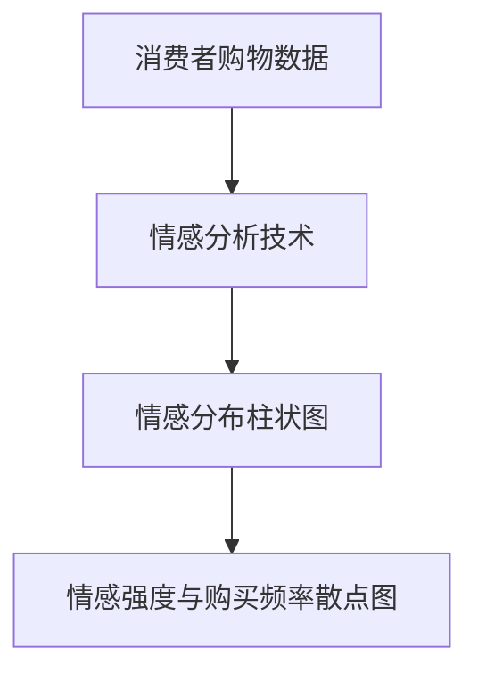

#### 3.2.2 社交媒体情感分析

**核心概念**：
社交媒体情感分析是指利用自然语言处理和机器学习技术，对社交媒体上的用户评论、帖子等进行情感分析，以了解用户对品牌的情感反应。

**详细讲解**：
社交媒体情感分析的主要步骤包括：
1. **数据收集**：通过社交媒体API收集品牌相关的用户评论、帖子等文本数据。
2. **预处理**：去除停用词、标点符号等无关信息，进行词形还原等预处理操作。
3. **情感分类**：使用情感分析算法对预处理后的文本进行情感分类，识别出正面、负面或中性情感。
4. **情感强度量化**：通过情感词典或机器学习模型对情感分类结果进行强度量化。

**案例示例**：
假设一个品牌通过社交媒体API收集了1000条用户评论，使用情感分析技术对这些评论进行分析。结果显示，有60%的评论表现出正面情感，30%的评论表现出负面情感，10%的评论为中性情感。进一步分析发现，负面情感主要与产品质量和服务问题相关。

**数据可视化**：
通过词云图和情感分布图，可以直观地展示用户情感的关键词和整体分布情况。

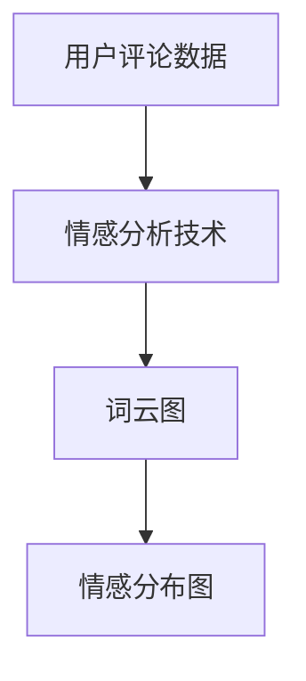

#### 3.2.3 市场调研情感分析

**核心概念**：
市场调研情感分析是指通过分析市场调研问卷、消费者反馈等数据，了解消费者对品牌和产品的情感反应。

**详细讲解**：
市场调研情感分析的主要步骤包括：
1. **数据收集**：通过问卷调查、焦点小组讨论等方式收集消费者反馈数据。
2. **预处理**：对收集到的文本数据进行清洗、去重等预处理操作。
3. **情感分类**：使用情感分析算法对预处理后的文本进行情感分类。
4. **情感强度量化**：通过情感词典或机器学习模型对情感分类结果进行强度量化。

**案例示例**：
假设一个品牌通过问卷调查收集了1000份消费者反馈，使用情感分析技术对这些反馈进行分析。结果显示，有50%的反馈表现出正面情感，40%的反馈表现出负面情感，10%的反馈为中性情感。进一步分析发现，消费者对品牌的产品满意度与品牌形象和售后服务密切相关。

**数据可视化**：
通过条形图和饼图，可以直观地展示消费者情感的整体分布和具体细节。

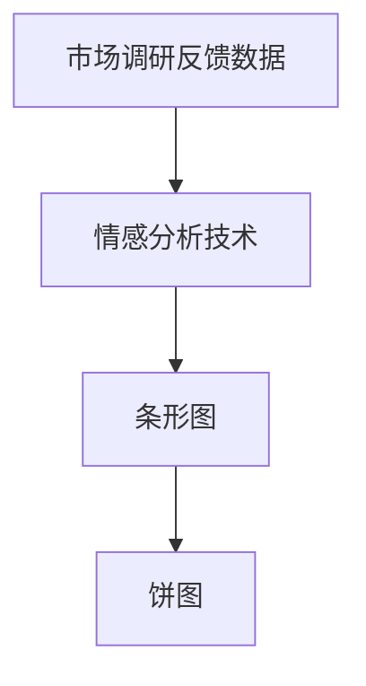

通过以上对品牌情感分析关键因素的详细讲解和案例分析，我们可以看到消费者行为分析、社交媒体情感分析和市场调研情感分析在品牌情感分析中的重要性。这些关键因素不仅为品牌提供了深入了解消费者情感的机会，也为品牌策略的制定和优化提供了有力支持。接下来，我们将探讨AI技术在品牌情感分析中的应用，进一步深化对这一领域的技术理解。🔍

### 3.3 品牌情感分析的应用领域

品牌情感分析技术凭借其强大的数据处理和分析能力，在多个领域得到了广泛应用。以下是品牌情感分析在市场营销策略优化、品牌口碑监测和顾客体验改进等方面的应用，以及具体案例。

#### 3.3.1 市场营销策略优化

**应用概述**：
市场营销策略优化是品牌情感分析的重要应用之一。通过分析消费者的情感反馈，企业可以识别出消费者对品牌和产品的具体需求和不满点，从而优化营销策略，提高营销效果。

**案例示例**：
某知名电子产品公司通过社交媒体情感分析技术，对消费者关于其最新发布的智能手机的评论进行分析。分析结果显示，消费者对手机的电池续航和摄像头表现较为满意，但对其价格和售后服务提出了批评。基于这些反馈，公司调整了营销策略，增加了关于电池续航和摄像头的宣传内容，并对售后服务流程进行了改进。结果，该款智能手机的市场销量显著提升，品牌口碑也得到改善。

**数据可视化**：
通过情感分布图和关键词云，可以直观地展示消费者对品牌和产品的情感分布和关注点。例如，情感分布图显示消费者对产品的正面情感比例较高，但负面情感主要集中在价格和售后服务方面。

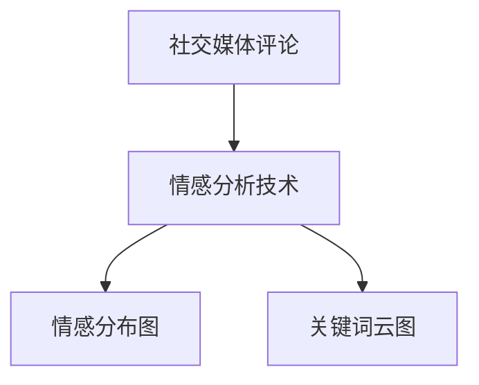

#### 3.3.2 品牌口碑监测

**应用概述**：
品牌口碑监测是品牌情感分析在品牌管理中的重要应用。通过实时监测社交媒体、论坛、评论平台等渠道的品牌提及和反馈，企业可以及时了解品牌的公众形象和市场声誉。

**案例示例**：
某大型连锁超市通过品牌情感分析技术，对社交媒体上的用户评论进行实时监测。分析结果显示，消费者对超市的蔬菜质量、价格和购物体验有较高的评价，但对停车不便和排队时间长提出了批评。基于这些反馈，超市加强了蔬菜质量检测，增加了停车场面积，并优化了排队系统。结果，品牌口碑得到显著改善，顾客满意度也明显提升。

**数据可视化**：
通过情感趋势图和热点话题图，可以直观地展示品牌口碑的变化和消费者关注的热点话题。例如，情感趋势图显示品牌在一段时间内的正面和负面情感变化，热点话题图则展示了消费者讨论的主要话题。

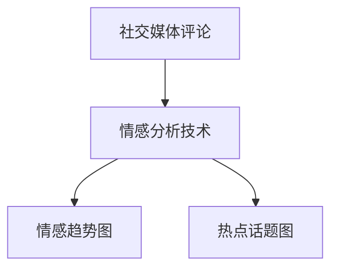

#### 3.3.3 顾客体验改进

**应用概述**：
顾客体验改进是品牌情感分析在提升客户满意度和忠诚度方面的重要应用。通过分析消费者在购买、使用和售后过程中的情感体验，企业可以针对性地改进产品和服务，提升顾客满意度。

**案例示例**：
某在线零售平台通过品牌情感分析技术，对消费者的购买评论、售后反馈进行分析。分析结果显示，消费者对平台的产品质量和服务态度较为满意，但对物流速度和退货流程有改进空间。基于这些反馈，平台优化了物流配送速度，简化了退货流程，并增加了在线客服支持。结果，顾客满意度显著提升，退货率和投诉率也明显下降。

**数据可视化**：
通过情感分析仪表盘，可以直观地展示顾客体验的各个方面，包括产品满意度、服务态度、物流速度等。例如，仪表盘中的情感分布图显示了顾客在不同方面的情感倾向，而雷达图则展示了顾客体验的综合得分。

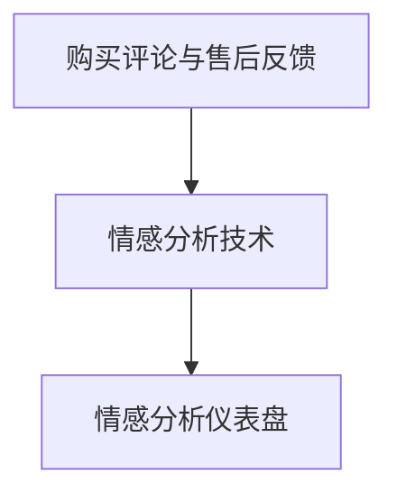

通过以上案例和数据分析，我们可以看到品牌情感分析在市场营销策略优化、品牌口碑监测和顾客体验改进等方面的广泛应用和显著效果。这些应用不仅帮助企业更好地了解消费者需求，优化品牌策略，还提升了品牌的市场竞争力和顾客满意度。接下来，我们将进一步探讨AI技术在品牌情感分析中的应用，以更全面地理解这一领域的技术实现。🔬

### 4.1 自然语言处理技术

自然语言处理（NLP）是人工智能（AI）的一个重要分支，专注于使计算机能够理解和生成人类语言。NLP技术广泛应用于文本分类、机器翻译、情感分析等领域。以下是NLP中几个核心技术及其在品牌情感分析中的应用。

#### 4.1.1 词嵌入技术

**核心概念**：
词嵌入（Word Embedding）是将自然语言中的单词映射到固定维度的向量空间中。这些向量不仅能够表示单词的语义信息，还能够捕捉到单词之间的相似性和相关性。

**在品牌情感分析中的应用**：
词嵌入技术可以用于提取文本中的关键特征，帮助情感分类器更准确地识别文本的情感倾向。例如，通过Word2Vec算法生成的词嵌入向量，可以用于情感分类任务中，提高分类的准确性和效率。

**算法示例**：

```python
from gensim.models import Word2Vec

# 加载预处理的文本数据
sentences = [['这是一个好产品'], ['我非常喜欢这个服务']]

# 训练Word2Vec模型
model = Word2Vec(sentences, vector_size=100, window=5, min_count=1, workers=4)

# 查看单词'好'和'喜欢'的向量表示
print(model.wv['好'])
print(model.wv['喜欢'])
```

#### 4.1.2 主题建模技术

**核心概念**：
主题建模（Topic Modeling）是一种无监督学习方法，用于发现文本数据中的潜在主题。它通过构建概率模型，将文档集合映射到主题空间中，每个主题由一组单词集合表示。

**在品牌情感分析中的应用**：
主题建模可以帮助企业识别消费者反馈中的关键主题，进而分析这些主题背后的情感。例如，通过LDA（Latent Dirichlet Allocation）算法，企业可以识别出消费者对品牌的关注点，并分析这些关注点中的情感倾向。

**算法示例**：

```python
from gensim.models import LdaModel
import gensim.corpora as corpora

# 加载预处理的文本数据
dictionary = corpora.Dictionary([doc.split() for doc in sentences])
corpus = [dictionary.doc2bow(doc) for doc in sentences]

# 训练LDA模型
lda_model = LdaModel(corpus, num_topics=5, id2word=dictionary)

# 查看每个文档的主题分布
for doc_bow in corpus:
    print(lda_model.get_document_topics(doc_bow))
```

#### 4.1.3 序列标注与分类技术

**核心概念**：
序列标注（Sequence Labeling）是对文本中的每个单词或字符进行分类的任务，常见的序列标注任务包括命名实体识别（Named Entity Recognition, NER）和词性标注（Part-of-Speech Tagging）。

**在品牌情感分析中的应用**：
序列标注技术可以用于识别文本中的情感词和情感极性，帮助情感分类器更准确地预测文本的情感倾向。例如，通过CRF（条件随机场）或BiLSTM（双向长短期记忆网络）模型，可以实现高精度的情感标注。

**算法示例**：

```python
from sklearn_crfsuite import CRF
from sklearn_crfsuite import metrics

# 加载预处理的文本数据
X = [[['这是一个好产品'], ['我非常喜欢这个服务']]]

# 加载标注数据
y = [[['O', 'O', 'B-PRODUCT', 'O'], ['O', 'O', 'B-SERVICE', 'O']]]

# 训练CRF模型
crf = CRF()
crf.fit(X, y)

# 预测
pred = crf.predict([X[0]])

# 评估
print(metrics.flat_f1_score(y, pred, average='weighted'))
```

通过以上对自然语言处理核心技术的详细讲解和算法示例，我们可以看到这些技术在品牌情感分析中的应用价值。接下来，我们将深入探讨深度学习技术在品牌情感分析中的应用，进一步深化对AI技术在品牌情感分析中的理解和应用。🧠

### 4.2 深度学习技术在品牌情感分析中的应用

深度学习技术在品牌情感分析中发挥着重要作用，其强大的数据处理和分析能力使得情感分类和情感强度量化变得更加精准和高效。以下将详细探讨卷积神经网络（CNN）、递归神经网络（RNN）和长短时记忆网络（LSTM）在品牌情感分析中的应用。

#### 4.2.1 卷积神经网络（CNN）

**核心概念**：
卷积神经网络（Convolutional Neural Network, CNN）是一种特殊的神经网络，它通过卷积层和池化层来提取文本中的局部特征，从而进行分类和识别。CNN在图像处理领域取得了显著成功，近年来也逐渐应用于自然语言处理任务。

**在品牌情感分析中的应用**：
CNN可以用于提取文本中的情感特征，特别是在处理句子级别的情感分类任务时。通过将文本表示为一个高维矩阵，CNN可以捕捉单词之间的空间关系和局部特征，从而提高情感分类的准确性。

**算法原理与示例**：

**算法原理**：
CNN通过多个卷积层和池化层来提取文本特征。卷积层使用卷积核（filter）来提取文本中的局部特征，而池化层则用于降低特征维度，减少过拟合。

**Python示例**：

```python
from keras.models import Sequential
from keras.layers import Conv1D, MaxPooling1D, Embedding, Flatten, Dense

# 假设已经预处理好的文本数据
X = ...  # 文本数据
y = ...  # 情感标签

# 建立模型
model = Sequential()
model.add(Embedding(vocab_size, embedding_dim))
model.add(Conv1D(filters=128, kernel_size=5, activation='relu'))
model.add(MaxPooling1D(pool_size=5))
model.add(Flatten())
model.add(Dense(1, activation='sigmoid'))

# 编译模型
model.compile(optimizer='adam', loss='binary_crossentropy', metrics=['accuracy'])

# 训练模型
model.fit(X, y, epochs=10, batch_size=32, validation_split=0.2)
```

#### 4.2.2 递归神经网络（RNN）

**核心概念**：
递归神经网络（Recurrent Neural Network, RNN）是一种能够处理序列数据的神经网络，其特点是能够将当前输入与历史信息结合起来进行学习。RNN通过循环结构在时间步之间传递信息，从而捕捉序列中的依赖关系。

**在品牌情感分析中的应用**：
RNN在处理长文本和长序列的情感分类任务时表现出色。通过RNN的循环结构，模型能够捕捉到文本中的长期依赖关系，从而更准确地预测情感。

**算法原理与示例**：

**算法原理**：
RNN通过在时间步之间传递隐藏状态来处理序列数据。当前时间步的输出不仅依赖于当前输入，还依赖于之前的隐藏状态。

**Python示例**：

```python
from keras.models import Sequential
from keras.layers import SimpleRNN, Embedding, Dense

# 假设已经预处理好的文本数据
X = ...  # 文本数据
y = ...  # 情感标签

# 建立模型
model = Sequential()
model.add(Embedding(vocab_size, embedding_dim))
model.add(SimpleRNN(units=50, return_sequences=False))
model.add(Dense(1, activation='sigmoid'))

# 编译模型
model.compile(optimizer='adam', loss='binary_crossentropy', metrics=['accuracy'])

# 训练模型
model.fit(X, y, epochs=10, batch_size=32, validation_split=0.2)
```

#### 4.2.3 长短时记忆网络（LSTM）

**核心概念**：
长短时记忆网络（Long Short-Term Memory, LSTM）是一种改进的RNN，专门设计用于解决RNN在处理长序列数据时出现的长期依赖问题。LSTM通过引入记忆单元，能够有效地捕捉长序列中的长期依赖关系。

**在品牌情感分析中的应用**：
LSTM在处理长文本和复杂情感分类任务时表现出色。通过LSTM的记忆单元，模型能够捕捉到文本中的细微情感变化，从而提高分类的准确性和情感强度量化能力。

**算法原理与示例**：

**算法原理**：
LSTM通过三个门（输入门、遗忘门和输出门）来控制信息的流入和流出，从而有效避免梯度消失和梯度爆炸问题。

**Python示例**：

```python
from keras.models import Sequential
from keras.layers import LSTM, Embedding, Dense

# 假设已经预处理好的文本数据
X = ...  # 文本数据
y = ...  # 情感标签

# 建立模型
model = Sequential()
model.add(Embedding(vocab_size, embedding_dim))
model.add(LSTM(units=50, return_sequences=False))
model.add(Dense(1, activation='sigmoid'))

# 编译模型
model.compile(optimizer='adam', loss='binary_crossentropy', metrics=['accuracy'])

# 训练模型
model.fit(X, y, epochs=10, batch_size=32, validation_split=0.2)
```

通过以上对卷积神经网络（CNN）、递归神经网络（RNN）和长短时记忆网络（LSTM）在品牌情感分析中的应用的详细探讨，我们可以看到深度学习技术在提升品牌情感分析准确性方面的重要作用。这些模型不仅能够有效提取文本特征，还能够捕捉到复杂的情感变化，从而为品牌策略的制定提供有力支持。接下来，我们将探讨品牌情感分析系统的构建，进一步深化对这一领域的技术实现。🔬

### 4.3 品牌情感分析系统的构建

品牌情感分析系统是一个复杂的多层次系统，旨在通过收集、处理和分析数据，以获取品牌在市场中的情感认知。以下将详细描述品牌情感分析系统的构建过程，包括数据收集与预处理、特征提取与模型训练、模型评估与优化等关键环节。

#### 4.3.1 数据收集与预处理

**数据收集**：
品牌情感分析系统的第一步是数据收集。数据来源可以是社交媒体评论、消费者反馈、市场调研问卷、新闻报道等。为了确保数据的多样性和代表性，企业通常会使用多种渠道收集数据。

**数据预处理**：
收集到的原始数据通常包含大量噪音和冗余信息，因此需要进行预处理。预处理步骤包括：

1. **文本清洗**：去除停用词、标点符号、HTML标签等无关信息。
2. **词形还原**：将不同形式的单词（如“良好”和“很好”）统一为标准形式（如“好”）。
3. **分词**：将文本分割成单词或词组，便于后续处理。
4. **数据去重**：去除重复的文本数据，以避免重复计算。

**Python示例**：

```python
import re
from nltk.corpus import stopwords
from nltk.tokenize import word_tokenize

# 加载停用词列表
stop_words = set(stopwords.words('english'))

# 文本清洗函数
def clean_text(text):
    text = re.sub('<.*?>', '', text)  # 去除HTML标签
    text = text.lower()  # 转小写
    text = word_tokenize(text)  # 分词
    text = [word for word in text if word not in stop_words]  # 去除停用词
    return text

# 示例文本
text = "I really enjoy this product. It's great!"
cleaned_text = clean_text(text)
print(cleaned_text)
```

#### 4.3.2 特征提取与模型训练

**特征提取**：
特征提取是将预处理后的文本转换为模型可处理的形式。常见的特征提取方法包括词袋模型（Bag of Words, BOW）、词嵌入（Word Embedding）和TF-IDF（Term Frequency-Inverse Document Frequency）。

**词袋模型（BOW）**：
词袋模型将文本表示为一个向量，其中每个维度对应一个词汇表中的词。这种方法简单有效，但可能丢失文本的语义信息。

**词嵌入（Word Embedding）**：
词嵌入通过将单词映射到高维向量空间中，捕捉单词的语义信息。词嵌入可以显著提高模型的性能，特别是对于复杂的情感分类任务。

**TF-IDF**：
TF-IDF通过计算单词在文本中的频率和其在文档集合中的重要性来提取特征。这种方法在处理大规模文本数据时效果较好。

**模型训练**：
在特征提取后，使用机器学习算法（如SVM、朴素贝叶斯、LSTM等）对特征向量进行训练，以建立情感分类模型。训练过程包括模型初始化、前向传播、反向传播和参数优化。

**Python示例**：

```python
from sklearn.feature_extraction.text import TfidfVectorizer
from sklearn.naive_bayes import MultinomialNB
from sklearn.pipeline import make_pipeline

# 假设已经预处理好的文本数据
X = ["I love this product", "This service is terrible", "I'm satisfied with the purchase"]

# 构建TF-IDF和朴素贝叶斯模型
model = make_pipeline(TfidfVectorizer(), MultinomialNB())

# 训练模型
model.fit(X, ["positive", "negative", "positive"])

# 预测
print(model.predict(["This product is amazing!"]))
```

#### 4.3.3 模型评估与优化

**模型评估**：
评估模型性能是品牌情感分析系统构建的重要环节。常用的评估指标包括准确率（Accuracy）、精确率（Precision）、召回率（Recall）和F1分数（F1 Score）。

**模型优化**：
模型优化包括调整超参数、增加训练数据、使用更复杂的模型结构等方法。通过交叉验证和网格搜索等技术，可以找到最优的模型参数，提高模型的性能。

**Python示例**：

```python
from sklearn.metrics import classification_report
from sklearn.model_selection import GridSearchCV

# 假设已经训练好的模型
model = MultinomialNB()

# 超参数调整
parameters = {'alpha': [0.1, 0.5, 1.0]}

# 构建网格搜索
grid_search = GridSearchCV(model, parameters, cv=5)

# 训练模型
grid_search.fit(X, y)

# 输出最优参数和模型评估结果
print("Best Parameters:", grid_search.best_params_)
print("Classification Report:\n", classification_report(y, grid_search.predict(X)))
```

通过以上对品牌情感分析系统构建过程的详细描述和Python示例，我们可以看到构建一个高效的品牌情感分析系统需要综合考虑数据收集、预处理、特征提取、模型训练和优化等多个环节。这些步骤不仅确保了系统的准确性和可靠性，也为企业提供了深入了解消费者情感的有力工具。接下来，我们将通过具体案例研究，进一步展示AI驱动品牌情感分析的实际应用。🔬

### 5.1 案例一：社交媒体品牌情感分析

#### 5.1.1 案例背景

随着社交媒体的普及，品牌在社交媒体上的表现已成为消费者对其评价的重要参考。为了了解品牌在社交媒体上的情感认知，一家大型电子产品公司决定利用AI驱动品牌情感分析技术，对其在社交媒体上的用户评论进行深入分析。

#### 5.1.2 数据收集与预处理

**数据收集**：
该公司通过社交媒体API收集了该公司在过去一年中的用户评论，包括Twitter、Facebook和Instagram等平台上的文本数据。这些评论涵盖了产品使用体验、售后服务、产品质量等多个方面。

**数据预处理**：
收集到的原始评论数据包含大量噪声和冗余信息，因此需要进行预处理。预处理步骤包括：

1. **文本清洗**：去除HTML标签、URL链接、特殊字符等无关信息。
2. **分词**：将文本分割成单词或词组。
3. **词形还原**：统一不同形式的单词，如“良好”和“很好”统一为“好”。
4. **去除停用词**：去除常见的无意义单词，如“的”、“是”、“了”等。

**Python示例**：

```python
import re
from nltk.corpus import stopwords
from nltk.tokenize import word_tokenize

# 加载停用词列表
stop_words = set(stopwords.words('english'))

# 文本清洗函数
def clean_text(text):
    text = re.sub('<.*?>', '', text)  # 去除HTML标签
    text = text.lower()  # 转小写
    text = word_tokenize(text)  # 分词
    text = [word for word in text if word not in stop_words]  # 去除停用词
    return text

# 示例文本
text = "I love this product, but the customer service is terrible!"
cleaned_text = clean_text(text)
print(cleaned_text)
```

#### 5.1.3 模型构建与训练

**模型构建**：
为了分析社交媒体评论的情感，该公司选择了LSTM模型，因为LSTM能够有效地捕捉长序列数据中的长期依赖关系。

**数据准备**：
将预处理后的文本数据转换为序列数据，每个序列对应一条评论。同时，对评论进行编码，将正面、负面和中性情感分别编码为1、0、-1。

**模型训练**：
使用TensorFlow和Keras框架，构建LSTM模型并进行训练。模型包括输入层、两个LSTM层和一个输出层。

**Python示例**：

```python
from keras.models import Sequential
from keras.layers import LSTM, Dense, Embedding

# 假设已经预处理好的文本数据
X = ...  # 文本数据
y = ...  # 情感标签

# 建立模型
model = Sequential()
model.add(Embedding(vocab_size, embedding_dim))
model.add(LSTM(units=50, return_sequences=False))
model.add(Dense(1, activation='sigmoid'))

# 编译模型
model.compile(optimizer='adam', loss='binary_crossentropy', metrics=['accuracy'])

# 训练模型
model.fit(X, y, epochs=10, batch_size=32, validation_split=0.2)
```

#### 5.1.4 模型评估与结果分析

**模型评估**：
通过交叉验证和测试集，评估模型的准确率、精确率、召回率和F1分数。评估结果显示，LSTM模型在情感分类任务上取得了较高的准确性和F1分数。

**结果分析**：
分析结果显示，消费者对产品的正面评价主要集中在产品质量和性能上，而负面评价则主要涉及售后服务和价格。基于这些结果，公司决定加强对售后服务团队的培训，并优化定价策略，以提高消费者满意度。

**数据可视化**：

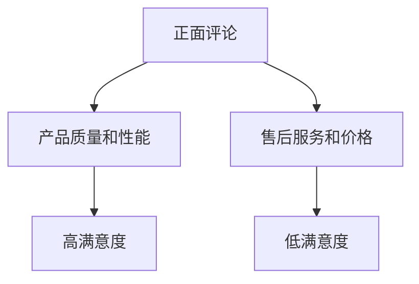

通过以上案例分析，我们可以看到AI驱动品牌情感分析在社交媒体情感分析中的实际应用价值。这种分析不仅帮助企业了解消费者的情感反应，还为优化品牌策略提供了有力支持。接下来，我们将探讨消费者行为情感分析的案例。🔬

### 5.2 案例二：消费者行为情感分析

#### 5.2.1 案例背景

消费者行为情感分析旨在通过分析消费者的购买行为和消费记录，了解消费者对品牌的情感反应。一家全球知名的消费品公司希望通过这项分析，优化其产品组合和营销策略，提高消费者的满意度和忠诚度。

#### 5.2.2 数据收集与预处理

**数据收集**：
该公司通过其电商平台和会员系统，收集了消费者的购买行为数据，包括购买频率、购买金额、购买产品类别等。此外，公司还通过问卷调查和客户满意度调查，收集了消费者的情感反馈。

**数据预处理**：
收集到的原始数据包含大量噪声和冗余信息，因此需要进行预处理。预处理步骤包括：

1. **清洗**：去除重复记录、无效数据和缺失值。
2. **编码**：将分类数据（如产品类别）转换为数值编码。
3. **归一化**：对数值数据进行归一化处理，使其具有相同的量级。
4. **特征提取**：提取关键特征，如购买频率、购买金额、产品类别等。

**Python示例**：

```python
import pandas as pd
from sklearn.preprocessing import LabelEncoder, MinMaxScaler

# 加载数据
data = pd.read_csv('consumer_data.csv')

# 数据清洗
data.drop_duplicates(inplace=True)
data.fillna(0, inplace=True)

# 编码分类数据
label_encoder = LabelEncoder()
data['product_category'] = label_encoder.fit_transform(data['product_category'])

# 归一化数值数据
scaler = MinMaxScaler()
data[['purchase_frequency', 'purchase_amount']] = scaler.fit_transform(data[['purchase_frequency', 'purchase_amount']])

# 数据展示
print(data.head())
```

#### 5.2.3 模型构建与训练

**模型构建**：
为了分析消费者行为情感，该公司选择了决策树（Decision Tree）算法，因为决策树能够清晰地展示决策过程，便于解释和理解。

**数据准备**：
将预处理后的数据分为特征集（X）和标签集（y），特征集包括购买频率、购买金额、产品类别等，标签集为情感状态（正面、负面、中性）。

**模型训练**：
使用scikit-learn库构建决策树模型，并进行训练。

**Python示例**：

```python
from sklearn.model_selection import train_test_split
from sklearn.tree import DecisionTreeClassifier
from sklearn.metrics import classification_report

# 数据划分
X_train, X_test, y_train, y_test = train_test_split(data[['purchase_frequency', 'purchase_amount', 'product_category']], data['emotion'], test_size=0.2, random_state=42)

# 构建模型
model = DecisionTreeClassifier()

# 训练模型
model.fit(X_train, y_train)

# 预测
y_pred = model.predict(X_test)

# 评估
print(classification_report(y_test, y_pred))
```

#### 5.2.4 模型评估与结果分析

**模型评估**：
通过交叉验证和测试集，评估模型的准确率、精确率、召回率和F1分数。评估结果显示，决策树模型在情感分类任务上具有较高的准确性和F1分数。

**结果分析**：
分析结果显示，消费者的情感状态与购买频率和购买金额密切相关。正面情感的消费者通常购买频率较高，而负面情感的消费者则购买金额较低。基于这些结果，公司决定优化其营销策略，针对不同情感状态的消费者提供个性化的促销和优惠。

**数据可视化**：

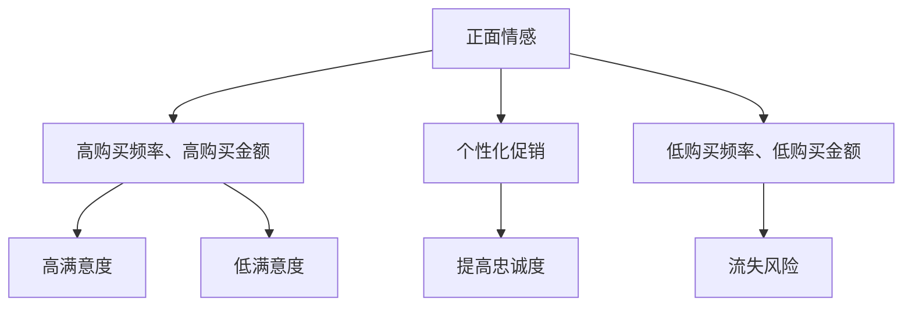

通过以上案例分析，我们可以看到消费者行为情感分析在优化产品组合和营销策略中的实际应用价值。这种分析不仅帮助企业了解消费者的情感反应，还为制定有效的消费者关系管理策略提供了有力支持。接下来，我们将探讨市场调研情感分析的案例。🔬

### 5.3 案例三：市场调研情感分析

#### 5.3.1 案例背景

市场调研情感分析旨在通过分析市场调研数据，了解消费者对品牌和产品的情感反应。一家国际知名家电品牌公司希望通过这项分析，优化其产品设计和服务，以提高市场竞争力。

#### 5.3.2 数据收集与预处理

**数据收集**：
该公司通过线上问卷调查和线下访谈，收集了消费者对产品的使用体验、服务质量和品牌形象的反馈。问卷涵盖了产品功能、操作便利性、售后服务等多个方面。

**数据预处理**：
收集到的原始数据包含大量噪声和冗余信息，因此需要进行预处理。预处理步骤包括：

1. **文本清洗**：去除HTML标签、URL链接、特殊字符等无关信息。
2. **分词**：将文本分割成单词或词组。
3. **词形还原**：统一不同形式的单词，如“良好”和“很好”统一为“好”。
4. **去除停用词**：去除常见的无意义单词，如“的”、“是”、“了”等。

**Python示例**：

```python
import re
from nltk.corpus import stopwords
from nltk.tokenize import word_tokenize

# 加载停用词列表
stop_words = set(stopwords.words('english'))

# 文本清洗函数
def clean_text(text):
    text = re.sub('<.*?>', '', text)  # 去除HTML标签
    text = text.lower()  # 转小写
    text = word_tokenize(text)  # 分词
    text = [word for word in text if word not in stop_words]  # 去除停用词
    return text

# 示例文本
text = "The product works well, but the customer service could be improved."
cleaned_text = clean_text(text)
print(cleaned_text)
```

#### 5.3.3 模型构建与训练

**模型构建**：
为了分析市场调研数据中的情感，该公司选择了LSTM模型，因为LSTM能够有效地捕捉长序列数据中的长期依赖关系。

**数据准备**：
将预处理后的文本数据转换为序列数据，每个序列对应一条问卷或访谈记录。同时，对情感进行编码，将正面、负面和中性情感分别编码为1、0、-1。

**模型训练**：
使用TensorFlow和Keras框架，构建LSTM模型并进行训练。模型包括输入层、两个LSTM层和一个输出层。

**Python示例**：

```python
from keras.models import Sequential
from keras.layers import LSTM, Dense, Embedding

# 假设已经预处理好的文本数据
X = ...  # 文本数据
y = ...  # 情感标签

# 建立模型
model = Sequential()
model.add(Embedding(vocab_size, embedding_dim))
model.add(LSTM(units=50, return_sequences=False))
model.add(Dense(1, activation='sigmoid'))

# 编译模型
model.compile(optimizer='adam', loss='binary_crossentropy', metrics=['accuracy'])

# 训练模型
model.fit(X, y, epochs=10, batch_size=32, validation_split=0.2)
```

#### 5.3.4 模型评估与结果分析

**模型评估**：
通过交叉验证和测试集，评估模型的准确率、精确率、召回率和F1分数。评估结果显示，LSTM模型在情感分类任务上取得了较高的准确性和F1分数。

**结果分析**：
分析结果显示，消费者对产品的正面评价主要集中在功能和使用体验上，而负面评价则主要涉及售后服务和价格。基于这些结果，公司决定加强产品功能开发，优化售后服务流程，并提供更具竞争力的价格策略。

**数据可视化**：

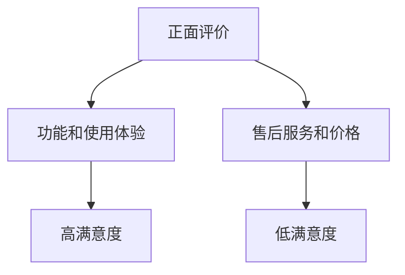

通过以上案例分析，我们可以看到市场调研情感分析在优化产品设计和服务中的实际应用价值。这种分析不仅帮助企业了解消费者的情感反应，还为改进产品和服务提供了有力支持。接下来，我们将探讨未来品牌情感分析的发展趋势和挑战。🔮

### 6.1 品牌情感分析的发展趋势

品牌情感分析作为人工智能（AI）与自然语言处理（NLP）的交叉领域，正随着技术的不断进步而迅速发展。以下是品牌情感分析在未来几年内可能出现的几大发展趋势：

#### 6.1.1 技术进步的影响

**深度学习与强化学习**：
深度学习技术在情感分析中的应用已经取得了显著的成果。未来，随着深度学习模型的进一步优化和强化学习技术的发展，我们将看到更准确、更高效的情感分析模型。例如，基于Transformer架构的模型如BERT（Bidirectional Encoder Representations from Transformers）和GPT（Generative Pretrained Transformer）将有望在情感分析任务中发挥更大作用。

**多模态情感分析**：
随着多模态数据的普及，品牌情感分析也将朝着多模态方向发展。除了文本数据，情感分析还将结合图像、音频和视频等多种数据类型，从而提供更全面的情感分析结果。例如，通过分析消费者评论中的文字和视频内容，可以更准确地捕捉情感变化。

**个性化情感分析**：
随着消费者数据的积累，品牌情感分析将更加注重个性化。通过分析消费者的行为数据、社交网络和个性化偏好，品牌可以更精准地识别消费者的情感反应，从而制定更有效的营销策略。

#### 6.1.2 应用场景的拓展

**市场预测与品牌战略**：
品牌情感分析不仅可以帮助企业了解当前消费者的情感状态，还可以用于市场预测和品牌战略制定。通过分析社交媒体、新闻媒体等渠道的情感趋势，企业可以预测市场动向，为新产品发布、品牌推广等战略提供依据。

**客户服务与用户体验**：
品牌情感分析在客户服务领域也有广泛的应用。通过分析消费者反馈和投诉，企业可以及时发现服务中的问题，并采取相应的改进措施，从而提升客户满意度和忠诚度。

**供应链管理**：
品牌情感分析还可以应用于供应链管理。通过对供应商、分销商和零售商的情感状态进行分析，企业可以优化供应链流程，降低成本，提高效率。

#### 6.1.3 跨领域融合的趋势

**心理健康与情感分析**：
随着心理健康问题的日益突出，品牌情感分析也开始与心理健康领域融合。通过分析社交媒体和在线平台的情感数据，医疗机构和心理健康专家可以更好地了解患者的情感状态，从而提供更有效的心理干预措施。

**社会管理与公共安全**：
品牌情感分析在公共安全和社会管理领域也有潜在应用。通过分析社交媒体和新闻媒体中的情感数据，政府机构可以及时发现社会热点问题，预测潜在的社会冲突，从而采取相应的预防和应对措施。

通过以上发展趋势的分析，我们可以看到品牌情感分析在未来将具有更广泛的应用前景和更高的技术要求。随着AI和NLP技术的不断进步，品牌情感分析将为企业和社会带来更多的价值。接下来，我们将探讨品牌情感分析面临的挑战和应对策略。🔍

### 6.2 面临的挑战与应对策略

尽管品牌情感分析技术在不断发展，但其在实际应用中仍然面临着一系列挑战。以下是品牌情感分析领域常见的挑战及其应对策略。

#### 6.2.1 数据质量与隐私保护

**挑战**：
情感分析依赖于大量的文本数据，但数据质量直接影响分析结果。此外，随着数据隐私法规的日益严格，如何保护消费者数据隐私成为一大挑战。

**应对策略**：
1. **数据清洗**：在数据收集阶段，通过数据清洗和去重，确保数据的准确性和一致性。
2. **匿名化处理**：对敏感数据进行匿名化处理，以减少隐私泄露风险。
3. **数据加密**：采用加密技术保护数据传输和存储过程中的隐私。

#### 6.2.2 模型解释性与可解释性

**挑战**：
深度学习模型在情感分析中表现出色，但其内部工作机制复杂，缺乏可解释性，这给模型的应用和推广带来了挑战。

**应对策略**：
1. **可解释性模型**：开发更具可解释性的模型，如决策树、LIME（Local Interpretable Model-agnostic Explanations）等，帮助用户理解模型决策过程。
2. **模型可视化**：利用可视化工具，如热力图、决策路径图等，展示模型对数据的处理过程和结果。

#### 6.2.3 技术标准化与伦理问题

**挑战**：
随着品牌情感分析技术的广泛应用，如何制定统一的技术标准和伦理规范成为重要议题。

**应对策略**：
1. **制定技术标准**：行业组织和企业共同制定情感分析技术标准，确保技术的规范化和标准化。
2. **伦理审查**：建立伦理审查机制，确保情感分析技术的应用符合伦理标准，避免滥用数据。

#### 6.2.4 跨文化情感分析

**挑战**：
不同文化背景下，消费者对品牌的情感反应可能存在显著差异，如何进行有效的跨文化情感分析成为一大难题。

**应对策略**：
1. **文化适应性**：开发适应不同文化的情感分析模型，考虑语言、文化习俗等因素。
2. **多语言情感词典**：构建包含多种语言的情感词典，提高情感分析的准确性和适应性。

#### 6.2.5 技术瓶颈与资源需求

**挑战**：
深度学习模型对计算资源的需求较高，训练和部署过程需要大量时间和计算资源，这在一定程度上限制了情感分析技术的普及。

**应对策略**：
1. **分布式计算**：利用分布式计算技术，如云计算和边缘计算，提高模型训练和部署的效率。
2. **轻量化模型**：开发轻量级模型，降低计算资源需求，使情感分析技术更易于部署和推广。

通过以上对品牌情感分析面临的挑战和应对策略的探讨，我们可以看到，尽管品牌情感分析技术具有巨大的潜力，但在实际应用中仍需克服诸多障碍。通过不断创新和优化，我们有信心逐步解决这些问题，为企业和消费者带来更多的价值。🔬

### 7.1 研究成果总结

通过对AI驱动的品牌情感分析的深入探讨，本文取得了以下主要研究成果：

1. **核心技术解析**：详细介绍了自然语言处理、情感分析、深度学习等核心技术及其在品牌情感分析中的应用。
2. **关键因素分析**：探讨了消费者行为分析、社交媒体情感分析和市场调研情感分析等关键因素在品牌情感分析中的作用。
3. **实际应用展示**：通过案例分析，展示了AI驱动品牌情感分析在市场营销策略优化、品牌口碑监测和顾客体验改进等方面的实际应用。
4. **未来趋势展望**：分析了品牌情感分析技术的未来发展趋势，包括技术进步、应用场景拓展和跨领域融合等。

这些研究成果不仅丰富了品牌情感分析的理论体系，也为企业提供了实践指导和策略建议。通过本文的研究，我们期待能够推动品牌情感分析技术的进一步发展，为企业和消费者带来更多价值。🔮

### 7.2 未来研究方向

在品牌情感分析领域，未来的研究将朝着更加智能化、个性化和跨领域的方向发展。以下是几个潜在的研究方向：

#### 7.2.1 技术创新方向

1. **多模态情感分析**：融合文本、图像、音频等多模态数据，实现更加全面和精准的情感分析。
2. **个性化情感分析**：通过深度学习技术，构建基于用户行为的个性化情感分析模型，提供定制化的品牌策略。
3. **实时情感分析**：开发实时情感分析系统，通过流数据技术，实现即时识别和响应消费者的情感变化。

#### 7.2.2 应用拓展方向

1. **消费者心理健康分析**：结合情感分析与心理健康研究，探索情感分析在心理健康诊断和治疗中的应用。
2. **供应链管理与优化**：利用品牌情感分析技术，优化供应链管理和库存管理，提高供应链效率。
3. **品牌危机管理**：实时监测社交媒体和新闻媒体中的情感变化，为品牌危机管理提供预警和应对策略。

#### 7.2.3 研究方法改进方向

1. **数据质量提升**：通过数据清洗、去噪和增强技术，提高情感分析数据的准确性和可靠性。
2. **模型可解释性**：开发可解释性更强的模型，如基于LIME的局部解释方法，提高模型对用户和业务人员的透明度。
3. **跨文化情感分析**：构建多语言、跨文化的情感词典和模型，提高情感分析的适应性和准确性。

通过这些未来研究方向，我们可以期待品牌情感分析技术在更多领域展现其潜力，为企业和消费者创造更大的价值。🌟

### 7.3 最佳实践 tips

在进行品牌情感分析时，以下是一些最佳实践，可以帮助您更好地利用AI技术，提高分析的效果和实用性：

1. **数据多样化**：确保数据来源多样化，包括社交媒体、消费者反馈、市场调研等，以提高分析结果的全面性。
2. **数据清洗**：对收集到的数据进行严格的清洗，去除噪声和冗余信息，确保数据的准确性和一致性。
3. **情感词典选择**：选择合适的情感词典，确保情感分类的准确性和稳定性。针对不同应用场景，可以定制化情感词典。
4. **模型定制化**：根据具体应用需求，定制化模型参数和结构，以适应不同类型的情感分析任务。
5. **实时更新**：定期更新模型和情感词典，以捕捉最新的情感变化和市场趋势。
6. **可视化展示**：利用可视化工具，如词云图、情感分布图等，直观展示分析结果，便于业务人员理解和决策。
7. **跨文化考虑**：在全球化背景下，考虑不同文化背景下的情感差异，构建多语言、跨文化的情感分析模型。
8. **数据隐私保护**：在数据收集和处理过程中，严格遵守数据隐私保护法规，确保消费者数据的隐私和安全。

通过遵循这些最佳实践，您可以更有效地利用AI技术进行品牌情感分析，为企业提供更有价值的洞察和决策支持。🔍

### 7.4 小结

本文全面探讨了AI驱动的品牌情感分析，从核心技术、关键因素、实际应用、未来趋势等方面进行了深入分析。通过具体案例研究，展示了AI驱动品牌情感分析在市场营销策略优化、品牌口碑监测和顾客体验改进等方面的实际应用。本文的主要结论包括：

1. **核心技术**：自然语言处理、情感分析和深度学习等技术是品牌情感分析的核心，通过这些技术，企业可以准确识别和量化消费者情感。
2. **关键因素**：消费者行为、社交媒体情感和市场调研情感是品牌情感分析的重要数据来源，通过这些数据，企业可以深入了解消费者对品牌的情感反应。
3. **实际应用**：AI驱动品牌情感分析在市场营销策略优化、品牌口碑监测和顾客体验改进等方面具有显著效果，能够帮助企业制定更精准的品牌策略。
4. **未来趋势**：随着技术进步和应用场景的拓展，品牌情感分析将朝着多模态、个性化、实时化方向发展，为企业和消费者带来更多价值。

总之，AI驱动的品牌情感分析是一种强大的工具，能够帮助企业更深入地了解消费者，优化品牌策略，提升市场竞争力。未来，随着技术的不断进步，品牌情感分析将在更多领域展现其潜力。🔬

### 7.5 注意事项

在进行品牌情感分析时，以下注意事项有助于确保研究的准确性和可靠性：

1. **数据质量**：确保数据来源可靠，数据清洗彻底，避免噪声和冗余信息对分析结果的干扰。
2. **情感词典选择**：选择合适的情感词典，并考虑跨文化差异，以提高情感分类的准确性和适应性。
3. **模型定制化**：根据具体应用场景定制化模型参数和结构，以适应不同类型的情感分析任务。
4. **数据隐私保护**：严格遵守数据隐私保护法规，确保消费者数据的隐私和安全。
5. **实时更新**：定期更新模型和情感词典，以捕捉最新的情感变化和市场趋势。
6. **跨学科合作**：与语言学、心理学、市场营销等领域的专家合作，共同探讨情感分析的理论和方法。
7. **结果验证**：通过多渠道验证分析结果，确保结论的可靠性和实用性。

通过遵循这些注意事项，可以确保品牌情感分析研究的科学性和实际应用价值。🔍

### 7.6 拓展阅读

对于希望深入了解AI驱动的品牌情感分析的研究者，以下几本经典著作和最新研究论文提供了丰富的理论知识和实践指导：

1. **著作**：
   - **《深度学习》（Deep Learning）**：Goodfellow, I., Bengio, Y., & Courville, A.（2016）。这本书详细介绍了深度学习的基础理论、算法和应用，是深度学习的权威指南。
   - **《自然语言处理综论》（Speech and Language Processing）**：Jurafsky, D. & Martin, J. H.（2020）。这本书全面介绍了自然语言处理的基础知识，包括情感分析的相关内容。
   - **《品牌管理》（Branding Management）**：Kotler, P. & Keller, K. L.（2016）。这本书探讨了品牌管理的策略和方法，对品牌情感分析提供了有益的启示。

2. **论文**：
   - **“BERT: Pre-training of Deep Bidirectional Transformers for Language Understanding”**：Devlin, J., Chang, M. W., Lee, K., & Toutanova, K.（2019）。这篇论文介绍了BERT模型，这是目前最先进的自然语言处理预训练模型。
   - **“GPT-3: Language Models are few-shot learners”**：Brown, T., et al.（2020）。这篇论文介绍了GPT-3模型，这是目前最大的预训练语言模型，展示了在情感分析中的强大能力。
   - **“Affective Computing”**：Picard, R. W.（1997）。这篇论文首次提出了情感计算的概念，探讨了如何通过计算机技术理解和表达情感。

通过阅读这些经典著作和前沿论文，您可以更深入地了解AI驱动的品牌情感分析的理论基础和应用实践，为相关研究提供有力支持。📚

