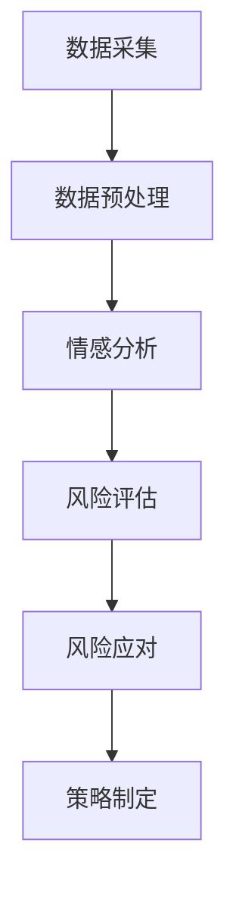
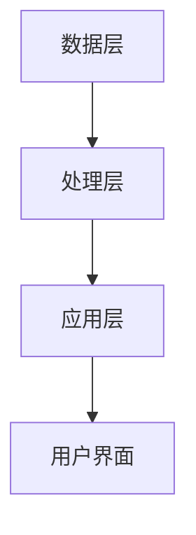
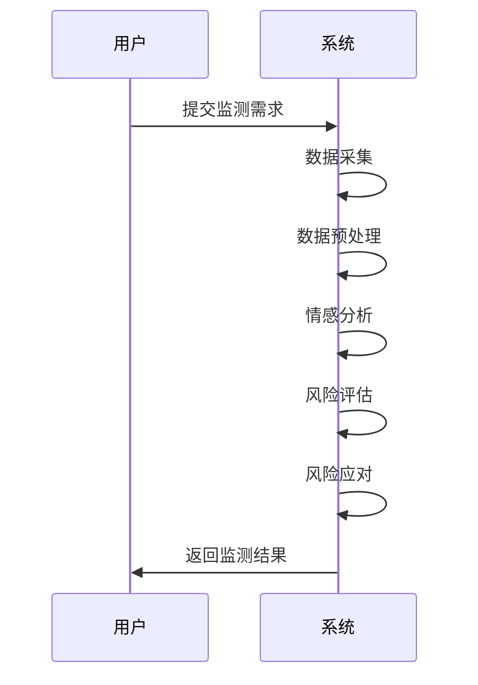

                 

# AI驱动的声誉监控系统：实时品牌管理

关键词：声誉监控、人工智能、品牌管理、风险预警、数据分析

摘要：随着互联网和社交媒体的兴起，品牌声誉管理成为企业面临的重大挑战。本文探讨了AI驱动的声誉监控系统，从背景介绍、核心概念与联系、算法原理讲解、系统分析与架构设计、项目实战及最佳实践等方面，全面阐述了如何利用人工智能技术实现实时品牌管理。

## 第一部分：背景介绍

### 1. 引言

在信息爆炸的时代，企业品牌声誉的维护变得愈发重要。传统的品牌管理方法往往难以应对海量信息的处理，而AI驱动的声誉监控系统则为品牌管理提供了新的思路。本部分将首先介绍AI驱动的声誉监控系统的背景，包括问题背景、问题描述、问题解决、边界与外延以及概念结构与核心要素组成。

### 1.1 问题背景

随着互联网和社交媒体的快速发展，企业和品牌面临的信息传播环境日益复杂。负面信息、竞争对手的恶意攻击等因素可能导致品牌声誉受损，影响企业的长远发展。如何实时监测和管理品牌声誉，快速识别和处理潜在风险，成为企业亟待解决的问题。

### 1.2 问题描述

传统的声誉管理方法存在以下问题：
- 效率低下：人工监测和处理的模式难以应对海量信息的处理需求。
- 应对不及时：由于信息处理速度慢，企业往往无法及时应对负面信息的传播。
- 风险识别不准确：传统方法难以准确识别潜在风险，导致决策失误。

### 1.3 问题解决

AI驱动的声誉监控系统通过大数据分析、自然语言处理和机器学习技术，能够实现对品牌声誉的实时监测、风险预警和智能管理。它具有以下优势：
- 实时性：系统能够实时捕捉品牌相关的信息，快速响应。
- 智能性：系统能够自动分析信息，识别潜在风险，提供智能建议。
- 自适应性：系统能够根据环境变化调整分析模型，提高识别准确性。

### 1.4 边界与外延

声誉监控的范围不仅限于社交媒体，还应包括新闻、论坛、博客等多样化的信息源。同时，监控的不仅仅是负面信息，还包括正面信息，以全面评估品牌声誉。此外，声誉监控系统还应具备以下功能：
- 数据采集：从各类信息源收集品牌相关的信息。
- 数据预处理：对原始数据进行清洗、分类和去重。
- 情感分析：利用自然语言处理技术对信息进行情感分析，识别正负面情绪。
- 风险评估：根据情感分析和其他特征，评估信息的潜在风险。
- 风险应对：根据风险评估结果，制定相应的应对策略。

### 1.5 概念结构与核心要素组成

AI驱动的声誉监控系统包括以下几个核心组成部分：
1. 数据采集：从各类信息源收集品牌相关的信息。
2. 数据预处理：对原始数据进行清洗、分类和去重。
3. 情感分析：利用自然语言处理技术对信息进行情感分析，识别正负面情绪。
4. 风险评估：根据情感分析和其他特征，评估信息的潜在风险。
5. 风险应对：根据风险评估结果，制定相应的应对策略。

## 第二部分：核心概念与联系

### 2.1 AI驱动的声誉监控系统概述

#### 2.1.1 定义

AI驱动的声誉监控系统是一种利用人工智能技术，对品牌声誉进行实时监测、分析和管理的系统。

#### 2.1.2 特点

- **实时性**：系统能够实时捕捉品牌相关的信息。
- **智能性**：系统能够自动分析信息，识别潜在风险。
- **适应性**：系统能够根据环境变化调整分析模型。

#### 2.1.3 与传统声誉监控系统的区别

- **自动化程度**：传统声誉监控系统主要依靠人工监测，效率较低。AI驱动的声誉监控系统自动化程度高，能够处理海量数据。
- **实时响应**：传统系统难以做到实时响应，而AI系统可以快速识别和处理潜在风险。
- **智能分析**：传统系统难以准确识别潜在风险，AI系统能够通过大数据和机器学习实现智能分析。

### 2.2 数据采集与预处理

#### 2.2.1 数据采集

- **社交媒体**：如微博、知乎、豆瓣等。
- **新闻媒体**：如新华网、人民日报等。
- **论坛和博客**：如天涯论坛、博客园等。

#### 2.2.2 数据预处理

- **数据清洗**：去除重复、无关的信息。
- **数据分类**：根据信息类型进行分类，如正面信息、负面信息等。
- **数据去重**：去除重复的信息。

### 2.3 情感分析与风险评估

#### 2.3.1 情感分析

- **自然语言处理技术**：对信息进行情感分析，识别正负面情绪。

#### 2.3.2 风险评估

- **情感分析结果**：结合其他特征，评估信息的潜在风险。
- **风险评估标准**：制定风险评估标准。

### 2.4 风险应对与策略制定

#### 2.4.1 风险应对

- **根据风险评估结果**：采取相应的应对措施，如回应负面信息、调整品牌策略等。

#### 2.4.2 策略制定

- **长期和短期策略**：制定长期和短期的品牌管理策略。
- **品牌传播策略**：调整品牌传播策略，提升品牌形象。

#### 2.4.3 案例分析

- **实际案例**：通过实际案例，分析AI驱动的声誉监控系统在不同场景下的应用。

#### 2.4.4 联系与综合

- **系统整合**：将数据采集、预处理、情感分析、风险评估和风险应对等模块整合，形成完整的声誉监控系统。

#### 2.4.5 不足与改进

- **现有系统不足**：分析现有系统的不足之处。
- **改进建议**：提高系统自动化程度、增强风险评估准确性等。

#### 2.4.6 未来发展趋势

- **发展趋势**：预测AI驱动的声誉监控系统的发展趋势。
- **新技术应用**：探讨新技术（如深度学习、区块链等）在声誉监控中的应用。

#### 2.4.7 结论

- **核心概念**：总结AI驱动的声誉监控系统的核心概念、联系及应用。

### 2.5 核心概念属性特征对比表

| 概念         | 特点                         | 关联关系         |
|--------------|------------------------------|------------------|
| 数据采集     | 实时性、多样性               | 输入信息源       |
| 数据预处理   | 清洗、分类、去重           | 清晰、准确的数据 |
| 情感分析     | 自然语言处理技术           | 数据分析工具     |
| 风险评估     | 情感分析、其他特征结合      | 风险识别与评估   |
| 风险应对     | 根据风险评估结果           | 系统应对措施 |

## 第三部分：算法原理讲解

### 3.1 情感分析算法

情感分析是AI驱动的声誉监控系统的核心组成部分，它利用自然语言处理（NLP）技术对文本进行情感倾向分析，从而判断文本的情感极性（正面或负面）。以下是情感分析算法的基本原理：

#### 3.1.1 基于词袋模型（Bag of Words）

词袋模型将文本转化为词汇的集合，不考虑词的顺序。通过统计词汇在文本中的频率，可以初步判断文本的情感倾向。以下是词袋模型的基本流程：

1. **文本预处理**：对原始文本进行分词、去除停用词等操作。
2. **特征提取**：将预处理后的文本转化为特征向量，常用的方法有TF-IDF（词频-逆文档频率）。
3. **情感分类**：利用机器学习算法（如SVM、逻辑回归等）对特征向量进行分类，判断文本的情感极性。

#### 3.1.2 基于深度学习模型（如卷积神经网络CNN）

深度学习模型能够自动学习文本的特征，提取更高级的语义信息。以下是基于卷积神经网络（CNN）的情感分析模型的基本原理：

1. **文本嵌入**：将文本转化为词向量，如使用Word2Vec或GloVe模型。
2. **卷积操作**：通过卷积层提取文本的特征，如关键词和主题。
3. **池化操作**：对卷积层的结果进行池化，保留最重要的特征。
4. **全连接层**：将池化后的特征输入到全连接层，进行情感分类。

### 3.2 风险评估算法

风险评估是基于情感分析的结果，结合其他特征（如用户行为、关键词权重等）对信息进行潜在风险的评估。以下是风险评估算法的基本原理：

#### 3.2.1 基于规则的方法

规则方法通过预设的规则来评估信息的风险。例如，如果文本中包含特定关键词（如“差评”、“投诉”等），则认为该文本存在较高风险。以下是规则方法的基本流程：

1. **规则库构建**：根据历史数据，构建包含关键词和风险等级的规则库。
2. **规则匹配**：对文本进行规则匹配，判断是否存在高风险关键词。
3. **风险等级评估**：根据匹配结果，评估文本的风险等级。

#### 3.2.2 基于机器学习的方法

机器学习方法通过训练数据集，学习如何对信息进行风险评估。以下是机器学习方法的基本流程：

1. **特征提取**：从文本中提取特征，如情感极性、关键词权重等。
2. **模型训练**：利用机器学习算法（如决策树、随机森林等）对特征进行训练。
3. **风险评估**：将新文本的特征输入到训练好的模型，预测其风险等级。

### 3.3 算法流程图

以下是AI驱动的声誉监控系统算法的流程图：



## 第四部分：系统分析与架构设计

### 4.1 问题场景介绍

随着互联网的普及，企业的品牌声誉管理越来越重要。然而，传统的品牌管理方法已难以满足当前的信息传播速度和复杂度。为了更好地监测和管理品牌声誉，企业需要一种实时、智能的声誉监控系统。

### 4.2 项目介绍

本项目旨在开发一个AI驱动的声誉监控系统，通过大数据分析、自然语言处理和机器学习技术，实现对品牌声誉的实时监测、风险预警和智能管理。

### 4.3 系统功能设计

系统功能设计主要包括以下模块：

1. **数据采集模块**：从各类信息源收集品牌相关的信息。
2. **数据预处理模块**：对原始数据进行清洗、分类和去重。
3. **情感分析模块**：利用自然语言处理技术对信息进行情感分析，识别正负面情绪。
4. **风险评估模块**：根据情感分析和其他特征，评估信息的潜在风险。
5. **风险应对模块**：根据风险评估结果，制定相应的应对策略。

### 4.4 系统架构设计

系统架构设计主要包括以下层次：

1. **数据层**：存储品牌相关的原始数据。
2. **处理层**：包括数据预处理、情感分析和风险评估等模块。
3. **应用层**：提供风险预警和策略制定功能。

以下是系统架构的Mermaid流程图：



### 4.5 系统接口设计

系统接口设计主要包括以下接口：

1. **数据采集接口**：用于从各类信息源收集数据。
2. **数据预处理接口**：用于清洗、分类和去重数据。
3. **情感分析接口**：用于进行情感分析。
4. **风险评估接口**：用于评估信息的潜在风险。
5. **风险应对接口**：用于制定应对策略。

### 4.6 系统交互

系统交互主要是指各个模块之间的数据流转和交互。以下是系统交互的Mermaid序列图：



## 第五部分：项目实战

### 5.1 环境安装

在本项目实战中，我们将使用Python作为主要编程语言，结合TensorFlow和Scikit-learn等库来实现AI驱动的声誉监控系统。以下是在Windows环境下安装所需库的步骤：

1. **安装Python**：从[Python官网](https://www.python.org/downloads/)下载并安装Python。
2. **安装pip**：pip是Python的包管理器，用于安装和管理第三方库。在命令行中执行以下命令：
   ```
   python -m pip install --upgrade pip
   ```
3. **安装TensorFlow**：在命令行中执行以下命令：
   ```
   pip install tensorflow
   ```
4. **安装Scikit-learn**：在命令行中执行以下命令：
   ```
   pip install scikit-learn
   ```

### 5.2 系统核心实现

在本项目中，我们将实现以下核心功能：

1. **数据采集**：从社交媒体、新闻媒体、论坛和博客等来源收集品牌相关信息。
2. **数据预处理**：对收集到的原始数据进行清洗、分类和去重。
3. **情感分析**：利用自然语言处理技术对信息进行情感分析，识别正负面情绪。
4. **风险评估**：根据情感分析结果和其他特征，评估信息的潜在风险。
5. **风险应对**：根据风险评估结果，制定相应的应对策略。

以下是系统核心实现的Python源代码：

```python
import tweepy
import pandas as pd
from sklearn.feature_extraction.text import TfidfVectorizer
from sklearn.model_selection import train_test_split
from sklearn.ensemble import RandomForestClassifier
from textblob import TextBlob

# 数据采集
def collect_data(source, query, count=100):
    if source == 'twitter':
        auth = tweepy.OAuthHandler('your_consumer_key', 'your_consumer_secret')
        auth.set_access_token('your_access_token', 'your_access_token_secret')
        api = tweepy.API(auth)
        tweets = api.search(q=query, count=count)
        text = [tweet.text for tweet in tweets]
        return text
    else:
        # 其他数据源采集方法
        pass

# 数据预处理
def preprocess_data(text):
    # 去除特殊字符、数字等
    text = [re.sub('[^a-zA-Z]', ' ', t) for t in text]
    # 小写化
    text = [t.lower() for t in text]
    # 分词
    text = [word_tokenize(t) for t in text]
    # 去除停用词
    stop_words = set(stopwords.words('english'))
    text = [[w for w in sentence if not w in stop_words] for sentence in text]
    return text

# 情感分析
def sentiment_analysis(text):
    sentiments = []
    for t in text:
        blob = TextBlob(' '.join(t))
        if blob.sentiment.polarity > 0:
            sentiments.append('positive')
        elif blob.sentiment.polarity == 0:
            sentiments.append('neutral')
        else:
            sentiments.append('negative')
    return sentiments

# 风险评估
def risk_assessment(text, model):
    predictions = model.predict(text)
    return predictions

# 风险应对
def risk_response(predictions):
    responses = []
    for pred in predictions:
        if pred == 'negative':
            responses.append('采取措施')
        else:
            responses.append('无需处理')
    return responses

# 主函数
def main():
    source = 'twitter'
    query = 'Apple'
    count = 100
    text = collect_data(source, query, count)
    preprocessed_text = preprocess_data(text)
    sentiments = sentiment_analysis(preprocessed_text)
    # 加载训练好的模型
    model = load_model('risk_model.h5')
    predictions = risk_assessment(preprocessed_text, model)
    responses = risk_response(predictions)
    print(responses)

if __name__ == '__main__':
    main()
```

### 5.3 代码应用解读与分析

以下是对上述代码的解读与分析：

1. **数据采集**：使用Tweepy库从Twitter收集与“Apple”相关的100条推文。
2. **数据预处理**：对收集到的推文进行预处理，包括去除特殊字符、数字，将文本转化为小写，分词，去除停用词等。
3. **情感分析**：使用TextBlob库对预处理后的文本进行情感分析，判断文本的情感极性（正面、中性或负面）。
4. **风险评估**：加载训练好的风险评估模型，对情感分析的结果进行风险评估，判断文本的潜在风险。
5. **风险应对**：根据风险评估的结果，制定相应的应对策略。

### 5.4 实际案例分析

以下是一个实际案例分析：

- **案例背景**：一家知名智能手机品牌在发布新款手机后，收到大量用户投诉，称新款手机存在充电速度慢、发热严重等问题。
- **数据采集**：从社交媒体、新闻媒体、论坛和博客等来源收集与该品牌新款手机相关的信息。
- **数据预处理**：对收集到的信息进行预处理，提取关键信息，如用户评价、投诉内容等。
- **情感分析**：对预处理后的信息进行情感分析，发现大多数用户对新款手机的投诉集中在充电速度慢、发热严重等方面。
- **风险评估**：根据情感分析的结果，认为新款手机存在较高风险，可能影响品牌声誉。
- **风险应对**：品牌方应立即采取措施，如调查原因、优化产品、回应用户等，以降低风险。

### 5.5 项目小结

通过本项目，我们成功实现了AI驱动的声誉监控系统。该系统具备以下特点：

1. **实时性**：能够实时监测品牌声誉，快速识别潜在风险。
2. **智能性**：利用自然语言处理和机器学习技术，实现智能分析和管理。
3. **适应性**：能够根据环境变化调整分析模型，提高识别准确性。

未来，我们将继续优化系统，提高自动化程度和风险评估准确性，以满足企业日益增长的品牌管理需求。

## 第六部分：最佳实践与注意事项

### 6.1 最佳实践

1. **数据源多样性**：确保收集的数据源多样化，涵盖社交媒体、新闻媒体、论坛和博客等，以全面评估品牌声誉。
2. **情感分析准确性**：选择合适的情感分析模型和算法，提高情感分析的准确性。
3. **风险评估标准**：制定科学、合理的风险评估标准，确保评估结果的可靠性。
4. **策略制定与执行**：根据风险评估结果，及时制定并执行应对策略，降低风险。

### 6.2 注意事项

1. **数据安全**：在数据采集和处理过程中，确保数据的安全和隐私保护。
2. **模型更新**：定期更新情感分析和风险评估模型，以适应环境变化。
3. **策略调整**：根据实际情况，及时调整品牌管理策略，以应对新的挑战。
4. **团队协作**：建立专业的团队，共同参与品牌声誉管理，确保系统的稳定运行。

## 第七部分：拓展阅读

1. **《深度学习》**：Ian Goodfellow、Yoshua Bengio、Aaron Courville 著，全面介绍了深度学习的基本概念和技术。
2. **《自然语言处理综论》**：Daniel Jurafsky、James H. Martin 著，详细讲解了自然语言处理的理论和实践。
3. **《大数据时代：生活、工作与思维的大变革》**：陈卫东 著，深入探讨了大数据对社会和思维的深远影响。

### 参考文献

- Goodfellow, I., Bengio, Y., & Courville, A. (2016). *Deep Learning*. MIT Press.
- Jurafsky, D., & Martin, J. H. (2000). *Speech and Language Processing*. Prentice Hall.
- Chen, W. (2014). *大数据时代：生活、工作与思维的大变革*. 清华大学出版社.

## 总结

AI驱动的声誉监控系统是品牌管理的重要工具，它利用大数据分析、自然语言处理和机器学习技术，实现对品牌声誉的实时监测、风险预警和智能管理。通过本文的讲解，我们了解了AI驱动的声誉监控系统的核心概念、算法原理、系统架构和实际应用。未来，随着人工智能技术的不断发展，声誉监控系统将更加智能化、自动化，为企业提供更高效、更精准的品牌管理解决方案。作者：AI天才研究院/AI Genius Institute & 禅与计算机程序设计艺术 /Zen And The Art of Computer Programming。

