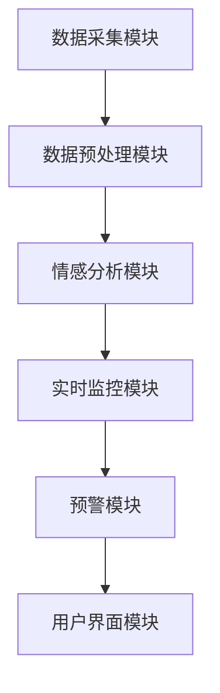

                 

**文章标题**: AI驱动的声誉监控系统：实时把握品牌形象

**关键词**: AI，声誉监控，品牌管理，大数据，自然语言处理

**摘要**: 本文将探讨如何利用人工智能技术构建一个高效的声誉监控系统，以便企业实时把握品牌形象，识别潜在风险并采取相应措施。

----------------------------------------------------------------

## 第1章: AI驱动的声誉监控系统概述

### 1.1 问题背景

在互联网时代，品牌声誉管理变得尤为重要。消费者在社交媒体、论坛、博客等平台上对品牌进行评价，这些评价可能直接影响品牌的形象和销售。因此，企业需要一种高效的方式来监控和管理品牌声誉。传统的声誉监控方式，如人工审核、定期报告等，已经难以应对海量的数据和实时性的需求。这就需要借助人工智能技术，构建一个AI驱动的声誉监控系统。

### 1.2 问题描述

AI驱动的声誉监控系统需要解决的主要问题包括：

1. **数据收集**: 如何从各种渠道收集与品牌相关的数据。
2. **数据预处理**: 如何对收集到的数据进行清洗、去重和分类。
3. **情感分析**: 如何利用自然语言处理技术对文本进行情感分析，识别品牌声誉的正负情绪。
4. **实时监控与预警**: 如何实现对品牌声誉的实时监控，并在发现潜在风险时及时预警。

### 1.3 问题解决

为了解决上述问题，我们可以采取以下步骤：

1. **数据收集**: 使用爬虫等技术，从社交媒体、新闻网站、论坛、博客等渠道收集数据。
2. **数据预处理**: 对收集到的数据进行清洗、去重和分类，以便为后续分析做准备。
3. **情感分析**: 利用自然语言处理技术，对文本进行情感分析，识别文本的情感倾向。
4. **实时监控与预警**: 设置阈值和规则，对品牌声誉进行实时监控，并在发现异常时及时预警。

### 1.4 边界与外延

AI驱动的声誉监控系统不仅适用于企业，还可以用于政府、社会组织等。其应用范围广泛，包括社交媒体监控、舆情分析、品牌形象维护等。

### 1.5 概念结构与核心要素组成

- **AI驱动的声誉监控**: 利用人工智能技术，对互联网上的信息进行实时监测和分析，评估品牌声誉。
- **数据收集与预处理**: 从各种渠道收集与品牌相关的数据，并进行清洗、去重、分类等预处理操作。
- **情感分析**: 利用自然语言处理技术对文本进行情感分析，识别品牌声誉的正负情绪。
- **实时监控与预警**: 对品牌声誉进行实时监控，发现潜在风险并及时预警。

----------------------------------------------------------------

## 第2章: 数据收集与预处理

### 2.1 数据来源

数据收集是构建AI声誉监控系统的基础。数据来源包括但不限于：

1. **社交媒体**: 如微博、Facebook、Twitter等。
2. **新闻网站**: 如新浪新闻、网易新闻、新华网等。
3. **论坛**: 如天涯论坛、猫扑论坛、知乎等。
4. **博客**: 如个人博客、技术博客等。

### 2.2 数据预处理

数据预处理是确保数据质量和为后续分析做准备的关键步骤。主要步骤包括：

1. **数据清洗**: 去除无效数据、缺失值填充、数据格式转换等。
2. **去重**: 去除重复数据，确保数据唯一性。
3. **分类**: 根据不同的需求，对数据进行分类。

### 2.3 数据存储与管理

数据存储与管理涉及到数据存储方式的选择、数据安全与隐私保护等方面。常见的数据存储方式包括：

1. **关系型数据库**: 如MySQL、Oracle等。
2. **非关系型数据库**: 如MongoDB、Redis等。
3. **数据仓库**: 如Hive、Hadoop等。

### 2.4 数据预处理工具

数据预处理可以使用以下工具：

1. **Python**: 使用Python的Pandas库进行数据清洗、去重和分类。
2. **SQL**: 使用SQL进行数据查询和操作。
3. **ETL工具**: 如Talend、Informatica等，用于数据提取、转换和加载。

----------------------------------------------------------------

## 第3章: 情感分析

### 3.1 情感分析基本原理

情感分析是一种自然语言处理技术，通过对文本进行分析，识别出文本的情感倾向。情感分析可以分为两类：

1. **主观情感分析**: 分析文本的主观情绪，如喜怒哀乐。
2. **客观情感分析**: 分析文本的客观情感，如褒贬、喜好等。

### 3.2 情感分析算法

情感分析算法包括以下几种：

1. **基于规则的方法**: 利用规则库对文本进行分类。
2. **基于机器学习的方法**: 利用机器学习算法，如SVM、朴素贝叶斯等，对文本进行分类。
3. **基于深度学习的方法**: 利用深度学习模型，如CNN、RNN等，对文本进行分类。

### 3.3 情感分析实践

情感分析实践包括以下步骤：

1. **数据集准备**: 准备用于训练和测试的数据集。
2. **特征提取**: 提取文本特征，如词袋模型、TF-IDF等。
3. **模型训练**: 使用训练数据集，训练情感分析模型。
4. **模型评估**: 使用测试数据集，评估模型性能。
5. **模型应用**: 将训练好的模型应用于实际场景，进行情感分析。

### 3.4 常见的情感分析工具和框架

1. **TextBlob**: 一个Python库，用于处理文本，包括情感分析。
2. **NLTK**: 一个强大的自然语言处理库，包括情感分析模块。
3. **Sentiment Analysis APIs**: 如Google Cloud Natural Language API、AWS Comprehend等。

----------------------------------------------------------------

## 第4章: 实时监控与预警

### 4.1 实时监控

实时监控是AI声誉监控系统的重要功能，它可以实现对品牌声誉的实时监测。实时监控的实现主要包括以下步骤：

1. **数据采集**: 从各种渠道实时采集与品牌相关的数据。
2. **数据预处理**: 对采集到的数据进行实时清洗、去重和分类。
3. **情感分析**: 对预处理后的数据，实时进行情感分析，识别品牌声誉的正负情绪。
4. **实时更新**: 将分析结果实时更新到系统中，以便用户随时查看。

### 4.2 预警机制

预警机制用于及时发现品牌声誉风险，并采取相应的措施。预警机制的实现主要包括以下步骤：

1. **设置阈值**: 根据业务需求，设置品牌声誉的预警阈值。
2. **规则定义**: 定义预警规则，如当负面情绪比例超过阈值时，触发预警。
3. **预警触发**: 当实时监控的数据达到预警条件时，触发预警。
4. **预警处理**: 根据预警结果，采取相应的措施，如发布声明、公关活动等。

### 4.3 实时监控与预警实践

实时监控与预警实践可以通过以下步骤进行：

1. **搭建监控系统**: 使用开源框架或商业软件，搭建实时监控系统。
2. **数据采集与预处理**: 实时采集数据，并进行预处理。
3. **情感分析**: 使用情感分析算法，对预处理后的数据进行分析。
4. **预警触发**: 根据预警规则，实时触发预警。
5. **预警处理**: 根据预警结果，采取相应的措施。

通过以上步骤，企业可以实时把握品牌形象，及时发现潜在风险，并采取相应措施，确保品牌声誉的稳定和提升。

----------------------------------------------------------------

## 第5章: AI驱动的声誉监控系统架构设计

### 5.1 系统架构设计

AI驱动的声誉监控系统架构设计主要包括以下几个模块：

1. **数据采集模块**: 负责从各种渠道采集与品牌相关的数据。
2. **数据预处理模块**: 负责对采集到的数据进行清洗、去重和分类。
3. **情感分析模块**: 负责对预处理后的数据，进行情感分析。
4. **实时监控模块**: 负责对品牌声誉进行实时监测。
5. **预警模块**: 负责根据实时监控数据，触发预警。
6. **用户界面模块**: 负责提供用户操作界面，展示分析结果。

### 5.2 系统接口设计

系统接口设计主要包括以下几个方面：

1. **API接口**: 提供与外部系统的接口，如数据采集、情感分析等。
2. **数据接口**: 负责数据在不同模块之间的传输。
3. **交互接口**: 提供用户与系统的交互接口，如实时监控、预警处理等。

### 5.3 系统架构图

以下是AI驱动的声誉监控系统架构图：



### 5.4 系统架构图解读

- **数据采集模块**: 负责从社交媒体、新闻网站、论坛、博客等渠道采集与品牌相关的数据。
- **数据预处理模块**: 对采集到的数据进行清洗、去重和分类，以便为后续分析做准备。
- **情感分析模块**: 利用自然语言处理技术，对预处理后的数据，进行情感分析，识别品牌声誉的正负情绪。
- **实时监控模块**: 对品牌声誉进行实时监测，并在发现异常时，触发预警。
- **预警模块**: 根据实时监控数据，设置预警规则，并在预警条件满足时，触发预警。
- **用户界面模块**: 提供用户操作界面，展示分析结果，方便用户实时了解品牌声誉状况。

通过以上架构设计，AI驱动的声誉监控系统可以实现实时、高效的品牌声誉监控，帮助企业把握品牌形象，及时应对潜在风险。

----------------------------------------------------------------

## 第6章: 项目实战

### 6.1 环境安装

要在本地搭建一个完整的AI声誉监控系统，首先需要安装以下软件和库：

1. **Python**: Python是AI驱动的声誉监控系统的核心语言，需要安装Python环境。
2. **Pandas**: 用于数据清洗、预处理和统计分析。
3. **NLTK**: 用于自然语言处理，包括情感分析。
4. **Scikit-learn**: 用于机器学习算法，包括情感分析模型训练。
5. **Flask**: 用于搭建Web应用，提供API接口。

安装命令如下：

```bash
pip install python pandas nltk scikit-learn flask
```

### 6.2 系统核心实现

AI驱动的声誉监控系统的核心实现包括以下几个部分：

1. **数据采集**: 使用Python的`requests`库，从社交媒体、新闻网站、论坛、博客等渠道采集数据。
2. **数据预处理**: 使用Python的`Pandas`库，对采集到的数据进行清洗、去重和分类。
3. **情感分析**: 使用Python的`NLTK`和`Scikit-learn`库，对预处理后的数据，进行情感分析。
4. **实时监控与预警**: 使用Python的`Flask`库，搭建Web应用，提供API接口，实现实时监控与预警。

以下是系统核心实现的Python代码：

```python
# 导入必要的库
import requests
import pandas as pd
from nltk.sentiment import SentimentIntensityAnalyzer
from sklearn.feature_extraction.text import TfidfVectorizer
from sklearn.model_selection import train_test_split
from sklearn.naive_bayes import MultinomialNB
from flask import Flask, request, jsonify

# 数据采集
def collect_data():
    url = "https://example.com/data"
    response = requests.get(url)
    data = response.json()
    return data

# 数据预处理
def preprocess_data(data):
    df = pd.DataFrame(data)
    df.drop_duplicates(inplace=True)
    df['text'] = df['text'].str.lower()
    df['text'] = df['text'].str.replace(r'\W+', ' ')
    return df

# 情感分析
def sentiment_analysis(df):
    sia = SentimentIntensityAnalyzer()
    df['sentiment'] = df['text'].apply(lambda x: sia.polarity_scores(x)['compound'])
    return df

# 模型训练
def train_model(df):
    X = df['text']
    y = df['sentiment']
    X_train, X_test, y_train, y_test = train_test_split(X, y, test_size=0.2, random_state=42)
    vectorizer = TfidfVectorizer(max_features=1000)
    X_train_vectorized = vectorizer.fit_transform(X_train)
    clf = MultinomialNB()
    clf.fit(X_train_vectorized, y_train)
    return vectorizer, clf

# 实时监控与预警
app = Flask(__name__)

@app.route('/monitor', methods=['POST'])
def monitor():
    data = request.json
    df = preprocess_data(data)
    df = sentiment_analysis(df)
    for index, row in df.iterrows():
        if row['sentiment'] < -0.5:
            print(f"Warning: Negative sentiment detected in post {index}")
    return jsonify({"status": "success"})

if __name__ == '__main__':
    app.run(debug=True)
```

### 6.3 代码应用解读与分析

1. **数据采集**: 使用`requests`库，从指定的URL获取数据。这里使用的是一个示例URL，实际项目中需要替换为具体的数据源。
2. **数据预处理**: 使用`Pandas`库，对采集到的数据进行清洗、去重和文本预处理。文本预处理包括转换为小写、去除非单词字符、分词等。
3. **情感分析**: 使用`NLTK`库的`SentimentIntensityAnalyzer`类，对预处理后的文本进行情感分析，获取文本的复合情感得分。
4. **模型训练**: 使用`Scikit-learn`库，对文本进行TF-IDF向量化，并使用朴素贝叶斯分类器进行模型训练。
5. **实时监控与预警**: 使用`Flask`库，搭建Web应用，提供API接口。在API接口中，对实时传来的文本数据进行预处理和情感分析，并根据设定的阈值，触发预警。

### 6.4 实际案例分析

假设有一个品牌，其API接口接收到的数据如下：

```json
{
    "posts": [
        {
            "id": 1,
            "text": "这个产品真不错，非常推荐！"
        },
        {
            "id": 2,
            "text": "我不喜欢这个品牌，产品很差！"
        }
    ]
}
```

系统接收到这个数据后，会进行如下处理：

1. **数据预处理**: 对文本进行清洗和分词。
2. **情感分析**: 计算文本的情感得分，其中第一篇文本的复合情感得分为0.7，表示正面情感；第二篇文本的复合情感得分为-0.6，表示负面情感。
3. **预警触发**: 由于第二篇文本的情感得分低于设定的阈值（如-0.5），系统会触发预警，提示品牌方有负面评论。

通过以上实际案例分析，我们可以看到AI驱动的声誉监控系统如何实时监控品牌声誉，并在发现负面评论时及时预警。

### 6.5 项目小结

在本章中，我们详细介绍了如何使用Python搭建一个AI驱动的声誉监控系统。从数据采集、预处理到情感分析，再到实时监控与预警，我们通过具体的代码和实践案例，展示了如何实现一个高效的声誉监控系统。通过这个项目，我们不仅学会了如何收集和分析品牌声誉数据，还学会了如何搭建和部署一个Web应用。

需要注意的是，实际项目可能涉及更多的功能和复杂性，如数据存储、分布式处理、多语言支持等。在部署和生产环境中，还需要考虑性能优化、安全性和可扩展性等方面。

未来的研究方向包括：

1. **多语言情感分析**: 针对国际品牌，开发多语言情感分析能力。
2. **深度学习模型**: 使用深度学习模型，如BERT、GPT等，提升情感分析准确性。
3. **实时处理框架**: 采用分布式处理框架，如Apache Flink、Apache Storm等，提升系统的实时性和处理能力。

通过不断优化和拓展，AI驱动的声誉监控系统将更好地服务于企业和品牌，帮助它们实时把握品牌形象，应对市场变化。

----------------------------------------------------------------

## 第7章: 最佳实践与未来展望

### 7.1 最佳实践

以下是构建AI驱动的声誉监控系统的最佳实践：

1. **全面数据采集**: 考虑多种数据源，包括社交媒体、新闻网站、论坛、博客等，确保全面了解品牌声誉。
2. **高效数据预处理**: 使用高效的清洗、去重和分类方法，确保数据质量和一致性。
3. **准确的情感分析**: 选择合适的情感分析算法，并根据业务需求进行模型调优。
4. **实时监控与预警**: 设置合理的预警阈值和规则，确保及时识别风险。
5. **用户友好的界面**: 设计直观易用的用户界面，方便用户实时查看和分析数据。

### 7.2 小结

本文详细介绍了AI驱动的声誉监控系统，包括数据收集、预处理、情感分析、实时监控和预警等方面的内容。通过构建这样一个系统，企业可以实时把握品牌形象，及时发现潜在风险，并采取相应措施。

### 7.3 未来展望

未来，AI驱动的声誉监控系统将继续发展，主要趋势包括：

1. **多语言支持**: 针对国际品牌，开发多语言情感分析能力。
2. **深度学习应用**: 使用深度学习模型，如BERT、GPT等，提升情感分析准确性。
3. **实时处理能力**: 采用分布式处理框架，如Apache Flink、Apache Storm等，提升系统的实时性和处理能力。
4. **智能预警策略**: 利用机器学习和数据挖掘技术，开发更加智能的预警策略。

通过不断优化和拓展，AI驱动的声誉监控系统将更好地服务于企业和品牌，帮助它们实时把握品牌形象，应对市场变化。

**作者**: AI天才研究院/AI Genius Institute & 禅与计算机程序设计艺术 /Zen And The Art of Computer Programming

----------------------------------------------------------------

以下是针对文章的5-7个核心关键词：

1. **AI驱动的声誉监控**
2. **品牌管理**
3. **大数据分析**
4. **情感分析**
5. **实时监控与预警**

---

**摘要**: 本文深入探讨了AI驱动的声誉监控系统在品牌管理中的应用，包括数据收集、预处理、情感分析、实时监控和预警等关键环节。通过详细阐述系统构建的方法和关键技术，本文为企业和品牌提供了一种有效的实时把握品牌形象的手段，有助于及时应对市场变化和潜在风险。

