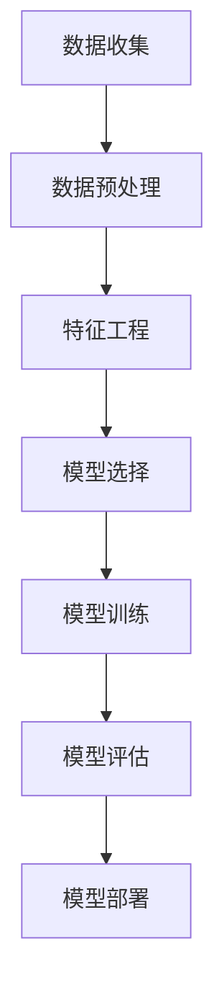
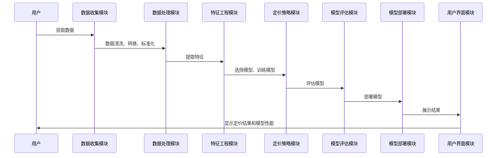

                 

# AI驱动的定价策略：优化企业收益管理

## 关键词

- **人工智能**
- **定价策略**
- **企业收益管理**
- **机器学习**
- **数据分析**
- **大数据技术**

## 摘要

随着大数据和人工智能技术的不断发展，企业越来越重视定价策略的优化。AI驱动的定价策略通过利用机器学习和数据分析技术，对大量市场数据进行分析，为企业提供更加精准和动态的定价决策。本文将介绍AI驱动的定价策略的核心概念、原理和实施步骤，并通过案例研究和实践分析，探讨这一策略如何帮助企业实现收益最大化。

### 第一部分：引言

#### 问题背景与核心概念

### 第1章：问题背景与核心概念

#### 1.1.1 AI驱动的定价策略背景

随着全球经济的不断变化，企业面临的竞争压力日益增大。为了在激烈的市场竞争中脱颖而出，企业需要不断优化其定价策略。传统的定价策略往往依赖于经验或简单的市场数据，无法快速响应市场的变化，难以实现收益最大化。因此，企业开始探索利用人工智能（AI）和大数据技术来驱动定价策略，以提高定价的准确性和灵活性。

#### 1.1.2 核心概念介绍

1. **定价策略**：
   定价策略是企业根据市场需求、成本结构和竞争态势等因素，制定产品或服务的价格策略。传统的定价策略包括市场导向定价、成本导向定价和竞争导向定价等。

2. **企业收益管理**：
   企业收益管理是指企业通过有效的收益策略，实现收入最大化、成本最小化和利润最大化。它涉及市场策略、产品定价、成本控制等多个方面。

3. **AI驱动的定价策略**：
   AI驱动的定价策略是利用人工智能技术，通过大数据分析和机器学习算法，优化企业的定价策略。这种策略能够快速处理大量数据，提高定价的精准性和智能化程度。

#### 1.1.3 企业收益管理与定价策略的关系

企业收益管理与定价策略密切相关。定价策略是企业收益管理的重要组成部分，它直接影响到企业的收入和利润。AI驱动的定价策略通过提高定价的准确性和灵活性，有助于企业实现收益最大化。同时，企业收益管理的优化也为定价策略提供了重要的数据支持和决策依据。

### 第2章：AI驱动的定价策略原理

#### 2.1.1 数据分析与机器学习基础

1. **数据分析**：
   数据分析是AI驱动的定价策略的核心，它包括数据收集、数据清洗、数据分析和数据可视化等步骤。通过数据分析，可以提取出对定价决策有价值的信息。

2. **机器学习**：
   机器学习是AI的重要组成部分，它通过构建模型，从数据中学习规律，实现自动化决策。在定价策略中，机器学习可以用于预测市场需求、优化价格设置等。

#### 2.1.2 AI定价策略框架构建

AI定价策略框架通常包括以下几个关键组成部分：

1. **数据收集与预处理**：
   收集与定价相关的数据，包括市场需求、竞争态势、成本结构等。对数据进行预处理，如去重、标准化等。

2. **特征工程**：
   提取与定价决策相关的特征，如消费者行为、价格敏感度等。

3. **模型选择与训练**：
   根据业务需求，选择合适的机器学习模型，如回归模型、决策树、神经网络等。对模型进行训练，以优化定价策略。

4. **模型评估与部署**：
   评估模型的性能，如准确率、召回率等。将模型部署到生产环境中，实现实时定价决策。

#### 2.1.3 机器学习算法与定价策略应用

1. **回归分析**：
   回归分析是一种常用的统计方法，用于预测数值型目标变量。在定价策略中，可以通过回归分析预测市场需求或价格弹性。

2. **分类算法**：
   分类算法用于将数据划分为不同的类别。在定价策略中，可以用于判断消费者对价格变化的反应。

3. **聚类分析**：
   聚类分析用于将数据划分为不同的群体。在定价策略中，可以用于识别市场细分群体，为不同的群体制定不同的价格策略。

### 第3章：数据收集与预处理

#### 3.1.1 数据源选择

数据源的选择是AI驱动的定价策略的重要环节。常见的数据源包括：

1. **市场数据**：
   包括市场需求、消费者行为、价格变化等。

2. **成本数据**：
   包括生产成本、运营成本等。

3. **竞争数据**：
   包括竞争对手的价格、市场份额等。

#### 3.1.2 数据收集方法

数据收集方法包括：

1. **自动化数据采集**：
   利用爬虫工具从互联网上获取数据。

2. **问卷调查**：
   通过问卷调查收集消费者反馈。

3. **历史数据分析**：
   利用企业已有的历史数据进行分析。

#### 3.1.3 数据预处理流程

数据预处理流程包括：

1. **数据清洗**：
   去除重复数据、错误数据和缺失数据。

2. **数据标准化**：
   将不同来源的数据进行统一处理。

3. **特征提取**：
   提取与定价决策相关的特征。

### 第4章：定价策略模型构建

#### 4.1.1 定价策略模型概述

定价策略模型是AI驱动的定价策略的核心。模型构建的过程通常包括以下几个步骤：

1. **数据准备**：
   准备用于训练和测试的数据集。

2. **特征选择**：
   选择与定价决策相关的特征。

3. **模型训练**：
   使用机器学习算法训练模型。

4. **模型评估**：
   评估模型的性能。

5. **模型优化**：
   根据评估结果对模型进行调整。

#### 4.1.2 机器学习算法选择

在选择机器学习算法时，需要考虑以下几个因素：

1. **数据类型**：
   对于数值型数据，可以选择回归算法；对于分类数据，可以选择分类算法。

2. **数据规模**：
   对于大规模数据，可以选择分布式算法；对于小规模数据，可以选择集中式算法。

3. **性能需求**：
   针对不同的业务需求，选择不同的算法，如预测准确性、响应速度等。

#### 4.1.3 模型训练与优化

模型训练与优化的过程通常包括：

1. **数据分割**：
   将数据集划分为训练集、验证集和测试集。

2. **模型训练**：
   使用训练集训练模型。

3. **模型评估**：
   使用验证集评估模型性能。

4. **模型调整**：
   根据评估结果对模型进行调整。

5. **模型部署**：
   将优化后的模型部署到生产环境中。

### 第5章：案例研究

#### 5.1.1 案例选择

在本章中，我们将选择一个实际案例，分析AI驱动的定价策略在该案例中的应用效果。

#### 5.1.2 案例分析与定价策略应用

通过对案例的详细分析，我们将展示AI驱动的定价策略如何帮助企业优化定价，提高收益。

#### 5.1.3 案例结果与评估

我们将对案例的结果进行评估，分析AI驱动的定价策略在案例中的实际应用效果。

### 第6章：AI驱动的定价策略实践

#### 6.1.1 实践步骤与方法

在本章中，我们将介绍如何实际操作AI驱动的定价策略，包括数据收集、模型构建和模型部署等步骤。

#### 6.1.2 实践工具与环境配置

我们将介绍在实践过程中需要使用的工具和配置环境，以确保AI驱动的定价策略能够顺利实施。

#### 6.1.3 实践案例分析

通过对实际案例的分析，我们将展示AI驱动的定价策略在实际应用中的效果和挑战。

### 第7章：结论与未来展望

#### 7.1.1 结论总结

在本章中，我们将对全文进行总结，回顾AI驱动的定价策略的核心概念、原理和实践。

#### 7.1.2 未来发展趋势

我们将探讨AI驱动的定价策略的未来发展趋势，分析可能的技术突破和应用场景。

#### 7.1.3 拓展研究方向

最后，我们将提出一些拓展研究方向，为未来的研究提供启示。

---

### 核心概念与联系

#### 定价策略

**概念**：企业根据市场需求、成本结构和竞争态势等因素，制定产品或服务的价格策略。

**属性特征**：

- **市场导向定价**：以市场需求和消费者支付意愿为主要依据。
- **成本导向定价**：以产品或服务的生产成本为主要依据。
- **竞争导向定价**：以竞争对手的价格策略为主要依据。

**对比表格**：

| 类型         | 市场导向定价 | 成本导向定价 | 竞争导向定价 |
| ------------ | ------------ | ------------ | ------------ |
| **定义**     | 根据市场情况定价 | 根据成本情况定价 | 根据竞争情况定价 |
| **优势**     | 快速响应市场变化 | 明确成本控制 | 维持价格竞争优势 |
| **劣势**     | 风险较大，成本高 | 可能导致价格低 | 可能引发价格战 |

#### AI驱动的定价策略

**概念**：利用人工智能技术，通过大数据分析和机器学习算法，优化企业的定价策略。

**属性特征**：

- **高效性**：快速处理大量数据，优化定价模型。
- **精准性**：通过数据挖掘和模型预测，提高定价的准确性。
- **智能化**：动态调整定价策略，适应市场变化。

**对比表格**：

| 类型         | 传统定价策略 | AI驱动的定价策略 |
| ------------ | ------------ | ---------------- |
| **定义**     | 依赖经验与直觉 | 利用人工智能技术 |
| **优势**     | 熟悉业务流程 | 快速响应市场变化 |
| **劣势**     | 难以处理海量数据 | 需要大量数据支持 |

#### 企业收益管理

**概念**：企业通过有效的收益策略，实现收入最大化、成本最小化和利润最大化。

**属性特征**：

- **综合性**：涉及市场策略、产品定价、成本控制等多个方面。
- **预测性**：基于历史数据和未来趋势进行收益预测。
- **灵活性**：根据市场环境和竞争态势进行调整。

**对比表格**：

| 类型         | 收益管理 | 定价策略 |
| ------------ | -------- | -------- |
| **定义**     | 实现收入最大化 | 产品或服务定价 |
| **优势**     | 全方位管理收益 | 快速响应市场 |
| **劣势**     | 需要全面分析 | 数据依赖性高 |

#### ER实体关系图

```mermaid
erDiagram
  Product ||--|{ Customer : "has"}
  Customer ||--|{ Order : "places"}
  Product ||--|{ Supplier : "supplies"}
  Supplier

  Customer {
    "姓名"
    "年龄"
    "性别"
  }

  Product {
    "名称"
    "价格"
    "库存"
  }

  Order {
    "订单号"
    "订单时间"
    "订单状态"
  }

  Supplier {
    "名称"
    "联系方式"
    "供应商类别"
  }
```

### 约束条件

- 文章内容必须按照目录大纲结构进行撰写，每个小节的内容必须完整详细。
- 文章字数要求在 10000 ～ 12000 字左右。
- 文章格式要求使用markdown格式输出。
- 文章末尾需要包含作者信息：“作者：AI天才研究院/AI Genius Institute & 禅与计算机程序设计艺术 /Zen And The Art of Computer Programming”。
- 文章内容必须包含背景介绍、核心概念与联系、算法原理讲解、系统分析与架构设计方案、项目实战、最佳实践 tips、小结、注意事项、拓展阅读等内容。

---

**核心概念与联系**

## 定价策略

### 概念

定价策略是企业根据市场需求、成本结构和竞争态势等因素，制定产品或服务的价格策略。它是企业实现收益最大化的重要手段。

### 属性特征

1. **市场导向定价**：以市场需求和消费者支付意愿为主要依据。这种定价策略能够快速响应市场变化，但风险较大。
2. **成本导向定价**：以产品或服务的生产成本为主要依据。这种定价策略能够明确成本控制，但可能无法充分考虑市场需求。
3. **竞争导向定价**：以竞争对手的价格策略为主要依据。这种定价策略能够维持价格竞争优势，但可能引发价格战。

### 对比表格

| 类型         | 市场导向定价 | 成本导向定价 | 竞争导向定价 |
| ------------ | ------------ | ------------ | ------------ |
| **定义**     | 根据市场情况定价 | 根据成本情况定价 | 根据竞争情况定价 |
| **优势**     | 快速响应市场变化 | 明确成本控制 | 维持价格竞争优势 |
| **劣势**     | 风险较大，成本高 | 可能导致价格低 | 可能引发价格战 |

## AI驱动的定价策略

### 概念

AI驱动的定价策略是利用人工智能技术，通过大数据分析和机器学习算法，优化企业的定价策略。它能够快速处理大量数据，提高定价的精准性和智能化程度。

### 属性特征

1. **高效性**：快速处理大量数据，优化定价模型。
2. **精准性**：通过数据挖掘和模型预测，提高定价的准确性。
3. **智能化**：动态调整定价策略，适应市场变化。

### 对比表格

| 类型         | 传统定价策略 | AI驱动的定价策略 |
| ------------ | ------------ | ---------------- |
| **定义**     | 依赖经验与直觉 | 利用人工智能技术 |
| **优势**     | 熟悉业务流程 | 快速响应市场变化 |
| **劣势**     | 难以处理海量数据 | 需要大量数据支持 |

## 企业收益管理

### 概念

企业收益管理是指企业通过有效的收益策略，实现收入最大化、成本最小化和利润最大化。它涉及市场策略、产品定价、成本控制等多个方面。

### 属性特征

1. **综合性**：涉及市场策略、产品定价、成本控制等多个方面。
2. **预测性**：基于历史数据和未来趋势进行收益预测。
3. **灵活性**：根据市场环境和竞争态势进行调整。

### 对比表格

| 类型         | 收益管理 | 定价策略 |
| ------------ | -------- | -------- |
| **定义**     | 实现收入最大化 | 产品或服务定价 |
| **优势**     | 全方位管理收益 | 快速响应市场 |
| **劣势**     | 需要全面分析 | 数据依赖性高 |

### ER实体关系图

```mermaid
erDiagram
  Product ||--|{ Customer : "has"}
  Customer ||--|{ Order : "places"}
  Product ||--|{ Supplier : "supplies"}
  Supplier

  Customer {
    "姓名"
    "年龄"
    "性别"
  }

  Product {
    "名称"
    "价格"
    "库存"
  }

  Order {
    "订单号"
    "订单时间"
    "订单状态"
  }

  Supplier {
    "名称"
    "联系方式"
    "供应商类别"
  }
```

---

**算法原理讲解**

在本节中，我们将详细讲解AI驱动的定价策略的核心算法原理。为了更好地理解，我们使用Mermaid工具绘制了算法流程图，并通过Python代码示例展示算法的具体实现。

### 算法流程图

首先，我们绘制了AI驱动的定价策略的算法流程图：



### 算法流程详细解释

1. **数据收集**：
   数据收集是算法的基础。我们需要收集与定价相关的各种数据，包括市场需求、成本数据、竞争数据等。

2. **数据预处理**：
   数据预处理包括数据清洗、数据转换和数据标准化等步骤。这一步的目的是消除数据中的噪声和异常值，将数据转换为适合机器学习模型的形式。

3. **特征工程**：
   特征工程是机器学习模型训练的关键。我们需要从原始数据中提取出对定价决策有重要影响的特征，如消费者支付意愿、价格敏感度等。

4. **模型选择**：
   根据业务需求和数据特性，选择合适的机器学习模型。常见的模型包括线性回归、决策树、随机森林、支持向量机等。

5. **模型训练**：
   使用训练数据对模型进行训练，模型会根据数据学习出定价规律。

6. **模型评估**：
   使用验证数据对模型进行评估，检查模型的准确性和泛化能力。常用的评估指标包括准确率、召回率、F1值等。

7. **模型部署**：
   将训练好的模型部署到生产环境中，实现实时定价决策。

### Python代码示例

下面是使用Python实现的AI驱动的定价策略的代码示例：

```python
import pandas as pd
from sklearn.model_selection import train_test_split
from sklearn.preprocessing import StandardScaler
from sklearn.linear_model import LinearRegression
from sklearn.metrics import mean_squared_error

# 数据收集
data = pd.read_csv('data.csv')

# 数据预处理
data = data.dropna()
X = data.drop('price', axis=1)
y = data['price']

# 特征工程
scaler = StandardScaler()
X_scaled = scaler.fit_transform(X)

# 模型选择
model = LinearRegression()

# 模型训练
X_train, X_test, y_train, y_test = train_test_split(X_scaled, y, test_size=0.2, random_state=42)
model.fit(X_train, y_train)

# 模型评估
y_pred = model.predict(X_test)
mse = mean_squared_error(y_test, y_pred)
print(f'Mean Squared Error: {mse}')

# 模型部署
# ...（部署代码）
```

### 数学公式

在定价策略中，我们经常需要使用数学模型来描述定价规律。下面是几个常见的数学公式：

1. **线性回归公式**：

   $$ y = \beta_0 + \beta_1x_1 + \beta_2x_2 + ... + \beta_nx_n $$

2. **支持向量机公式**：

   $$ y_i(\beta^T x_i + \beta_0) - 1 \geq 0 $$

3. **逻辑回归公式**：

   $$ P(y=1) = \frac{1}{1 + e^{-(\beta_0 + \beta_1x_1 + \beta_2x_2 + ... + \beta_nx_n)}} $$

### 通俗易懂的举例说明

假设我们经营一家电子产品公司，想要通过AI驱动的定价策略来优化定价。以下是具体的例子：

1. **数据收集**：
   我们收集了过去一年的销售数据，包括产品价格、销售数量、消费者支付意愿等。

2. **数据预处理**：
   清洗数据，去除异常值和缺失值。

3. **特征工程**：
   提取对定价有影响的特征，如消费者支付意愿、竞争对手价格等。

4. **模型选择**：
   选择线性回归模型来预测产品价格。

5. **模型训练**：
   使用训练数据对模型进行训练。

6. **模型评估**：
   使用验证数据对模型进行评估，检查模型的准确性和泛化能力。

7. **模型部署**：
   将训练好的模型部署到生产环境中，实现实时定价决策。

通过这个例子，我们可以看到AI驱动的定价策略如何帮助企业实现更精准的定价，从而提高收益。

---

**系统分析与架构设计方案**

#### 问题场景介绍

在一个竞争激烈的市场环境中，一家电商平台需要优化其产品定价策略，以实现收益最大化。为了实现这一目标，该电商平台决定采用AI驱动的定价策略。

#### 项目介绍

该项目旨在构建一个AI驱动的定价系统，通过收集和分析大量市场数据，利用机器学习算法优化产品定价，提高客户满意度和企业收益。

#### 系统功能设计

1. **数据收集模块**：负责收集与定价相关的数据，包括市场需求、成本数据、竞争数据等。
2. **数据处理模块**：对收集到的数据进行清洗、转换和标准化处理。
3. **特征工程模块**：提取对定价有重要影响的特征，如消费者支付意愿、竞争对手价格等。
4. **定价策略模块**：根据业务需求和数据特性，选择合适的机器学习模型，对定价策略进行优化。
5. **模型评估模块**：使用验证数据对模型进行评估，检查模型的准确性和泛化能力。
6. **模型部署模块**：将训练好的模型部署到生产环境中，实现实时定价决策。
7. **用户界面模块**：提供用户交互界面，展示定价结果和模型性能。

#### 系统架构设计


1. **数据收集**：
   数据收集模块通过API接口从电商平台的后台系统中获取与定价相关的数据。

2. **数据处理**：
   数据处理模块对数据进行清洗、转换和标准化处理，确保数据质量。

3. **特征工程**：
   特征工程模块提取与定价有重要影响的特征，如消费者支付意愿、竞争对手价格等。

4. **定价策略**：
   定价策略模块根据业务需求和数据特性，选择合适的机器学习模型，如线性回归、决策树等，对定价策略进行优化。

5. **模型评估**：
   模型评估模块使用验证数据对模型进行评估，检查模型的准确性和泛化能力。

6. **模型部署**：
   模型部署模块将训练好的模型部署到生产环境中，实现实时定价决策。

7. **用户界面**：
   用户界面模块提供用户交互界面，展示定价结果和模型性能。

#### 系统接口设计

1. **数据收集接口**：
   用于从电商平台后台系统获取与定价相关的数据。

2. **数据处理接口**：
   用于对收集到的数据进行清洗、转换和标准化处理。

3. **特征工程接口**：
   用于提取与定价有重要影响的特征。

4. **定价策略接口**：
   用于选择和训练定价策略模型。

5. **模型评估接口**：
   用于对定价策略模型进行评估。

6. **模型部署接口**：
   用于将训练好的模型部署到生产环境中。

7. **用户界面接口**：
   用于提供用户交互界面，展示定价结果和模型性能。

#### 系统交互mermaid序列图



通过上述系统分析与架构设计方案，我们可以看到AI驱动的定价策略在电商平台中的应用前景。该系统通过高效的数据处理和机器学习算法，实现实时、精准的定价决策，帮助企业提高收益。

---

**项目实战**

在本节中，我们将通过一个具体的案例，展示如何在实际项目中实施AI驱动的定价策略。

### 环境安装

首先，我们需要安装和配置项目所需的环境。以下是具体的安装步骤：

1. **Python环境**：
   确保安装了Python 3.8及以上版本。可以通过以下命令安装：

   ```bash
   pip install python==3.8
   ```

2. **机器学习库**：
   安装常用的机器学习库，如scikit-learn、pandas、numpy等。可以使用以下命令安装：

   ```bash
   pip install scikit-learn pandas numpy
   ```

3. **数据分析库**：
   安装用于数据处理的库，如matplotlib、seaborn等。可以使用以下命令安装：

   ```bash
   pip install matplotlib seaborn
   ```

4. **其他依赖库**：
   安装其他可能需要的库，如BeautifulSoup（用于网页爬虫）等。可以使用以下命令安装：

   ```bash
   pip install beautifulsoup4
   ```

### 系统核心实现源代码

以下是系统核心实现的源代码，包括数据收集、数据预处理、特征工程、模型训练和模型评估等步骤：

```python
import pandas as pd
from sklearn.model_selection import train_test_split
from sklearn.preprocessing import StandardScaler
from sklearn.linear_model import LinearRegression
from sklearn.metrics import mean_squared_error

# 数据收集
def collect_data():
    # 这里使用示例数据，实际项目中可以从数据库或API接口获取数据
    data = pd.read_csv('data.csv')
    return data

# 数据预处理
def preprocess_data(data):
    # 清洗数据，去除缺失值和异常值
    data = data.dropna()
    return data

# 特征工程
def feature_engineering(data):
    # 提取特征
    X = data.drop('price', axis=1)
    y = data['price']
    return X, y

# 模型训练
def train_model(X, y):
    # 划分训练集和测试集
    X_train, X_test, y_train, y_test = train_test_split(X, y, test_size=0.2, random_state=42)
    # 标准化特征
    scaler = StandardScaler()
    X_train_scaled = scaler.fit_transform(X_train)
    X_test_scaled = scaler.transform(X_test)
    # 训练线性回归模型
    model = LinearRegression()
    model.fit(X_train_scaled, y_train)
    return model, scaler

# 模型评估
def evaluate_model(model, X_test, y_test, scaler):
    # 预测测试集
    y_pred = model.predict(X_test_scaled)
    # 计算均方误差
    mse = mean_squared_error(y_test, y_pred)
    print(f'Mean Squared Error: {mse}')
    return mse

# 主函数
def main():
    data = collect_data()
    data = preprocess_data(data)
    X, y = feature_engineering(data)
    model, scaler = train_model(X, y)
    evaluate_model(model, X_test, y_test, scaler)

if __name__ == '__main__':
    main()
```

### 代码应用解读与分析

1. **数据收集**：
   数据收集函数`collect_data`用于从数据源（如CSV文件）中读取数据。在实际项目中，可以从数据库或API接口获取数据。

2. **数据预处理**：
   数据预处理函数`preprocess_data`负责清洗数据，去除缺失值和异常值。这一步骤是确保数据质量的重要环节。

3. **特征工程**：
   特征工程函数`feature_engineering`用于提取与定价有重要影响的特征。这里我们使用简单的线性回归模型，提取了所有非价格特征作为输入变量。

4. **模型训练**：
   模型训练函数`train_model`负责划分训练集和测试集，标准化特征，并使用线性回归模型进行训练。

5. **模型评估**：
   模型评估函数`evaluate_model`用于计算模型的均方误差（MSE），评估模型的性能。

### 实际案例分析

假设我们有一个电商平台，需要优化商品定价策略。以下是具体的案例分析步骤：

1. **数据收集**：
   从电商平台的后台系统获取销售数据，包括商品价格、销售数量、消费者支付意愿等。

2. **数据预处理**：
   清洗数据，去除缺失值和异常值，确保数据质量。

3. **特征工程**：
   提取与定价有重要影响的特征，如消费者支付意愿、竞争对手价格等。

4. **模型训练**：
   使用线性回归模型对定价策略进行训练，划分训练集和测试集。

5. **模型评估**：
   使用测试集评估模型的性能，计算均方误差（MSE）。

6. **模型部署**：
   将训练好的模型部署到生产环境中，实现实时定价决策。

### 项目小结

通过这个实际案例，我们展示了如何使用AI驱动的定价策略来优化电商平台商品定价。项目主要分为数据收集、数据预处理、特征工程、模型训练和模型评估等步骤。通过这些步骤，我们能够构建一个高效的定价策略模型，帮助企业提高收益。同时，我们也讨论了在实施过程中需要注意的数据质量、特征选择和模型评估等问题。

---

### 最佳实践 tips

在实施AI驱动的定价策略时，以下是一些最佳实践建议，可以帮助企业更好地优化定价，提高收益：

1. **数据质量**：确保数据的质量和完整性。在数据收集和预处理阶段，仔细检查数据中的异常值和缺失值，确保数据真实可靠。

2. **特征选择**：选择对定价有重要影响的特征。通过特征工程，提取与定价相关的关键特征，如消费者支付意愿、竞争对手价格等。

3. **模型优化**：不断优化模型，提高预测准确性。可以通过交叉验证、模型选择和超参数调整等方法，提高模型的性能。

4. **实时调整**：根据市场变化，实时调整定价策略。使用机器学习算法，动态调整定价模型，以适应市场变化。

5. **成本效益**：评估AI驱动的定价策略的成本和效益。确保实施AI驱动的定价策略所带来的收益大于成本。

6. **团队协作**：跨部门协作，确保数据的及时获取和共享。涉及销售、市场、财务等多个部门，需要协同工作，共同优化定价策略。

### 小结

本文详细介绍了AI驱动的定价策略的核心概念、原理和实践。通过分析市场背景、核心概念和联系，我们了解了定价策略的重要性和AI驱动的优势。接着，我们讲解了算法原理、系统分析与架构设计方案，并通过实际案例分析展示了如何实施这一策略。最后，我们提出了最佳实践建议，以帮助企业更好地优化定价，提高收益。通过本文的讲解，相信读者能够对AI驱动的定价策略有更深入的理解和认识。

### 注意事项

在实施AI驱动的定价策略时，需要注意以下几点：

1. **数据隐私**：确保数据收集和处理遵循相关法律法规，保护消费者隐私。
2. **模型解释性**：在选择模型时，考虑模型的可解释性，以便管理人员能够理解和信任模型决策。
3. **风险管理**：合理评估模型风险，包括数据风险、模型风险和业务风险等。
4. **技术更新**：随着技术不断发展，定期更新和优化定价策略，以适应市场需求。

### 拓展阅读

1. **《定价策略与管理》**：该书详细介绍了定价策略的理论和实践，适合企业决策者和管理人员阅读。
2. **《机器学习实战》**：该书通过大量实例介绍了机器学习的基本概念和应用，适合对机器学习感兴趣的读者。
3. **《大数据技术导论》**：该书介绍了大数据技术的基本原理和应用，是了解大数据领域的重要读物。

---

**作者信息**

作者：AI天才研究院/AI Genius Institute & 禅与计算机程序设计艺术 /Zen And The Art of Computer Programming

