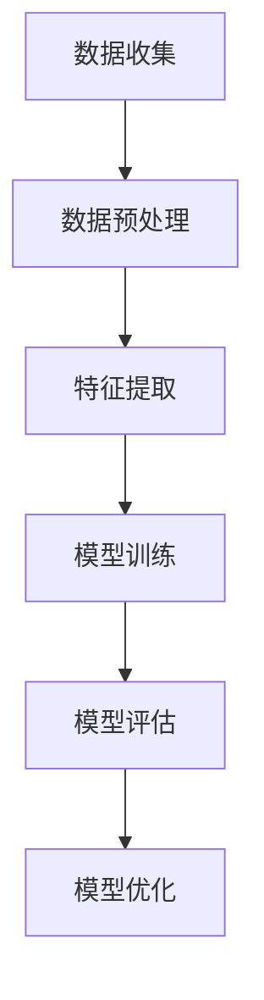
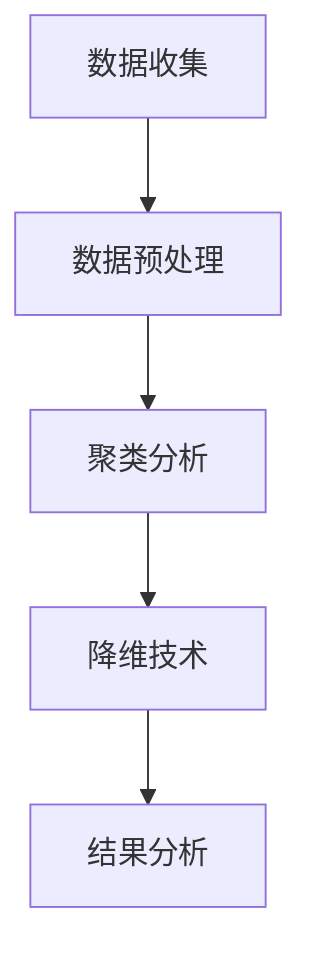
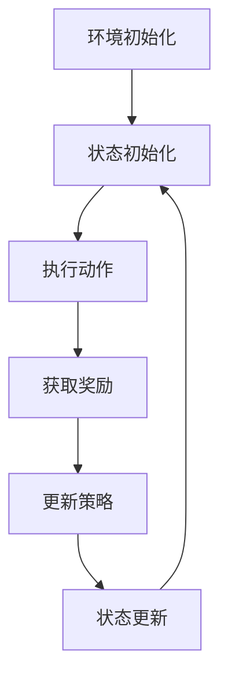

                 

### 文章标题

《AI驱动的客户流失预警：提前干预挽留策略》

### 文章关键词

人工智能、客户流失、预警系统、干预挽留、机器学习、数据分析

### 摘要

本文旨在探讨如何利用人工智能技术构建一个有效的客户流失预警系统，并通过提前干预挽留策略，减少企业客户流失率。文章首先介绍了客户流失问题的背景和影响，随后深入解析了AI技术在客户流失预警中的应用和优势。接下来，文章从数据分析、机器学习算法到预警系统架构设计，详细阐述了AI驱动的客户流失预警系统的构建过程。此外，通过项目实战和案例分析，文章展示了如何将理论应用于实际，并提出了系统优化和改进的建议。最后，文章总结了最佳实践，并给出了相关注意事项和拓展阅读建议。

---

## 《AI驱动的客户流失预警：提前干预挽留策略》目录大纲

### 第一部分：问题背景与核心概念

#### 第1章：客户流失问题与AI预警的重要性

#### 第2章：AI技术在客户流失预警中的应用

#### 第3章：AI预警系统的边界与外延

#### 第4章：核心概念与联系

### 第二部分：核心概念与联系

#### 第5章：AI驱动的客户流失预警原理

#### 第6章：数据分析在客户流失预警中的应用

#### 第7章：机器学习算法在客户流失预警中的应用

#### 第8章：AI预警系统架构设计

### 第三部分：算法原理与数学模型

#### 第9章：机器学习算法原理与数学模型

#### 第10章：算法流程图与Python代码实现

### 第四部分：项目实战与案例分析

#### 第11章：AI驱动的客户流失预警项目实战

#### 第12章：客户流失预警系统的优化与改进

### 第五部分：最佳实践与总结

#### 第13章：最佳实践与注意事项

#### 第14章：小结与拓展阅读

---

文章将按照上述目录大纲逐步展开，深入探讨AI驱动的客户流失预警技术的各个方面，帮助读者全面了解和掌握这一领域的知识和实践。接下来，我们将从客户流失问题出发，逐步深入探讨AI驱动的客户流失预警系统。让我们一步步思考，深入分析。

---

### 客户流失问题与AI预警的重要性

#### 1.1 客户流失现象及其影响

客户流失是指企业客户在某一时间段内离开并停止使用其服务或产品的情况。这一现象在商业世界中普遍存在，无论是B2B（企业对企业）还是B2C（企业对消费者）领域，客户流失都是企业必须面对的重要问题。客户流失可能导致以下几方面的影响：

1. **收入下降**：客户流失直接影响企业的营业收入，减少利润空间。
2. **品牌价值受损**：高流失率可能导致品牌声誉下降，影响新客户的获取和留存。
3. **运营成本增加**：客户流失后，企业可能需要投入更多资源来重新获取客户，这增加了运营成本。
4. **业务连续性挑战**：某些关键客户的流失可能对企业的业务连续性构成威胁。

#### 1.2 AI技术在客户流失预警中的应用

随着人工智能技术的迅猛发展，利用AI进行客户流失预警已成为一种有效的方法。AI在客户流失预警中的应用主要体现在以下几个方面：

1. **数据分析与挖掘**：AI可以通过分析客户行为数据、交易历史、反馈信息等，挖掘出潜在流失信号。
2. **预测模型构建**：利用机器学习算法，AI可以构建客户流失预测模型，提前识别可能流失的客户。
3. **个性化干预**：基于客户画像和行为分析，AI可以实施个性化的干预策略，提高挽留成功率。
4. **自动化流程**：AI可以自动化客户流失预警和干预流程，提高效率，减少人为错误。

#### 1.3 AI预警技术的优势

相比传统的人工监测和统计方法，AI驱动的客户流失预警技术具有以下优势：

1. **高效性**：AI可以处理海量数据，快速识别潜在流失客户。
2. **准确性**：通过机器学习算法，AI可以不断提高预测准确性，降低误报率。
3. **实时性**：AI系统可以实时监控客户行为，及时发出预警。
4. **个性化**：AI可以根据不同客户的特点和需求，制定个性化的挽留策略。

#### 1.4 核心概念与联系

在客户流失预警系统中，核心概念包括客户流失预测模型、数据分析、机器学习算法等。这些概念之间的联系如下：

- **客户流失预测模型**：是整个预警系统的核心，通过输入客户特征和行为数据，预测客户流失概率。
- **数据分析**：是构建预测模型的基础，通过对数据的收集、清洗、预处理和特征工程，提取有用的信息。
- **机器学习算法**：是实现预测模型的关键技术，通过训练数据和模型评估，不断优化预测效果。

通过上述分析，我们可以看到，AI驱动的客户流失预警系统不仅能够帮助企业提前识别潜在流失客户，还可以通过个性化干预策略提高挽留成功率，从而降低客户流失率，提升企业竞争力。

### AI技术在客户流失预警中的应用

#### 2.1 AI驱动的客户流失预警模型

AI驱动的客户流失预警模型是利用机器学习算法和数据分析技术，对客户行为数据进行建模，从而预测客户流失的概率。具体来说，这个模型包括以下几个关键步骤：

1. **数据收集**：收集客户的基本信息、交易历史、交互行为等数据。
2. **数据预处理**：对收集的数据进行清洗、去重、缺失值填充等预处理操作。
3. **特征工程**：根据业务需求，提取有用的特征，如客户购买频率、平均订单金额、客户满意度评分等。
4. **模型训练**：选择合适的机器学习算法（如逻辑回归、随机森林、支持向量机等），使用训练数据进行模型训练。
5. **模型评估**：通过验证集或测试集，评估模型的准确率、召回率等指标，调整模型参数，优化模型性能。

#### 2.2 数据分析在客户流失预警中的应用

数据分析在AI驱动的客户流失预警系统中起着至关重要的作用。具体应用包括：

1. **数据收集**：通过客户关系管理（CRM）系统、销售数据、客户反馈等渠道，收集客户行为数据。
2. **数据预处理**：使用数据清洗技术，处理缺失值、异常值和重复值，确保数据质量。
3. **特征提取**：利用统计分析和数据挖掘技术，提取与客户流失相关的特征，如客户购买频率、订单金额、客户满意度等。
4. **数据可视化**：通过数据可视化技术，展示数据分布、趋势和关联性，帮助业务人员更好地理解数据，制定干预策略。

#### 2.3 机器学习算法在客户流失预警中的应用

机器学习算法是AI驱动的客户流失预警系统的核心技术，常见的算法包括：

1. **逻辑回归**：用于建立客户流失概率与特征之间的线性关系，简单高效，易于解释。
2. **随机森林**：通过构建多棵决策树，集成预测结果，提高模型的稳定性和准确性。
3. **支持向量机（SVM）**：利用核函数将数据映射到高维空间，寻找最优分割超平面。
4. **梯度提升树（GBDT）**：通过迭代训练，优化模型性能，适合处理大量特征和样本。

每种算法都有其优势和局限性，选择合适的算法需要根据数据特点和业务需求进行综合考虑。在实际应用中，通常还会结合多种算法，进行交叉验证和模型融合，以提高预测效果。

#### 2.4 概念属性特征对比表格

为了更好地理解不同算法在客户流失预警中的应用，以下是一个简单的概念属性特征对比表格：

| 算法名称 | 算法原理 | 优点 | 局限 |
| --- | --- | --- | --- |
| 逻辑回归 | 线性模型 | 简单、易于解释 | 无法很好地处理非线性关系 |
| 随机森林 | 集成多棵决策树 | 防止过拟合、提高准确率 | 计算成本较高 |
| 支持向量机（SVM） | 高维空间最优分割 | 性能稳定，适用于多种类型的数据 | 需要选择合适的核函数 |
| 梯度提升树（GBDT） | 组合多个弱学习器 | 处理大量特征和样本能力强 | 需要大量计算资源 |

通过上述分析，我们可以看到，AI技术在客户流失预警中的应用是多方面的，包括模型构建、数据分析和算法选择等。合理应用这些技术，可以构建一个高效、准确的客户流失预警系统，帮助企业减少客户流失率，提升业务竞争力。

### AI预警系统的边界与外延

#### 3.1 预警系统的边界

AI预警系统的边界是指该系统所能覆盖和处理的范围。具体来说，这些边界包括：

1. **数据范围**：预警系统处理的数据类型和来源。例如，系统可以处理客户购买历史、交互行为、反馈信息等。
2. **功能范围**：预警系统能够执行的任务。例如，系统可以预测客户流失概率，发出预警通知，但无法直接干预挽留客户。
3. **技术范围**：预警系统所采用的技术和算法。例如，系统可能仅使用传统的机器学习算法，而不涉及复杂的深度学习技术。

#### 3.2 预警系统的外延

预警系统的外延是指该系统与其他业务系统和模块的交互。具体来说，这些外延包括：

1. **CRM系统**：客户关系管理系统（CRM）是预警系统的重要数据来源，通过集成CRM系统，系统可以获取客户的基本信息和交易历史。
2. **数据分析平台**：预警系统可以与数据分析平台集成，利用数据可视化技术，帮助业务人员更好地理解预警结果。
3. **业务流程管理系统**：预警系统可以与业务流程管理系统（BPM）集成，实现自动化的预警通知和干预流程。

#### 3.3 预警系统与其他系统的关系

AI预警系统不仅是一个独立的模块，还需要与其他系统紧密集成，以确保整个业务流程的顺畅。具体来说，这些关系包括：

1. **数据依赖**：预警系统依赖于其他系统提供的数据，例如客户数据、销售数据等。
2. **功能协同**：预警系统需要与其他系统协同工作，例如，当系统检测到客户流失预警时，CRM系统可以自动触发挽留策略。
3. **技术融合**：预警系统可能需要与其他系统共享技术资源，例如，利用大数据平台进行数据存储和处理。

通过明确AI预警系统的边界与外延，可以帮助企业更好地规划和部署预警系统，提高系统的实用性和效果。

### 核心概念与联系

#### 4.1 客户流失预测模型

客户流失预测模型是AI驱动的客户流失预警系统的核心。它通过对客户行为数据进行分析和建模，预测客户流失的概率。具体来说，客户流失预测模型包括以下几个关键步骤：

1. **数据收集**：收集客户的基本信息、交易历史、交互行为等数据。
2. **数据预处理**：对收集的数据进行清洗、去重、缺失值填充等预处理操作。
3. **特征工程**：根据业务需求，提取与客户流失相关的特征，如购买频率、平均订单金额、客户满意度等。
4. **模型训练**：选择合适的机器学习算法（如逻辑回归、随机森林、支持向量机等），使用训练数据进行模型训练。
5. **模型评估**：通过验证集或测试集，评估模型的准确率、召回率等指标，调整模型参数，优化模型性能。

客户流失预测模型是整个预警系统的基石，其性能直接影响到预警的准确性和有效性。

#### 4.2 数据分析

数据分析是客户流失预警系统的重要环节，它通过对客户行为数据的分析，提取有用的信息，为预测模型提供支持。具体来说，数据分析包括以下几个步骤：

1. **数据收集**：通过客户关系管理（CRM）系统、销售数据、客户反馈等渠道，收集客户行为数据。
2. **数据预处理**：使用数据清洗技术，处理缺失值、异常值和重复值，确保数据质量。
3. **特征提取**：利用统计分析和数据挖掘技术，提取与客户流失相关的特征，如客户购买频率、订单金额、客户满意度等。
4. **数据可视化**：通过数据可视化技术，展示数据分布、趋势和关联性，帮助业务人员更好地理解数据，制定干预策略。

数据分析不仅为预测模型提供输入，还可以帮助业务人员发现潜在的业务机会和风险。

#### 4.3 机器学习算法

机器学习算法是实现客户流失预测模型的关键技术。通过训练数据和模型评估，机器学习算法可以不断提高预测准确性。常见的机器学习算法包括：

1. **逻辑回归**：用于建立客户流失概率与特征之间的线性关系，简单高效，易于解释。
2. **随机森林**：通过构建多棵决策树，集成预测结果，提高模型的稳定性和准确性。
3. **支持向量机（SVM）**：利用核函数将数据映射到高维空间，寻找最优分割超平面。
4. **梯度提升树（GBDT）**：通过迭代训练，优化模型性能，适合处理大量特征和样本。

选择合适的机器学习算法，并根据数据特点和业务需求进行模型优化，是构建高效客户流失预警系统的重要步骤。

通过上述分析，我们可以看到，客户流失预测模型、数据分析和机器学习算法之间紧密联系，共同构成了AI驱动的客户流失预警系统的核心。了解这些核心概念及其联系，有助于企业更好地构建和优化预警系统，减少客户流失率，提升业务竞争力。

### AI驱动的客户流失预警原理

#### 5.1 AI驱动的客户流失预警模型

AI驱动的客户流失预警模型是基于机器学习和数据分析技术构建的。具体来说，该模型通过以下几个步骤实现：

1. **数据收集**：首先，收集客户的基本信息、交易历史、交互行为等数据。这些数据可以从客户关系管理（CRM）系统、销售数据、客户反馈等多个渠道获取。

2. **数据预处理**：对收集的数据进行清洗、去重、缺失值填充等预处理操作。确保数据的质量和一致性，为后续分析打下基础。

3. **特征工程**：提取与客户流失相关的特征，如购买频率、平均订单金额、客户满意度评分等。这些特征需要经过筛选和优化，以提升模型性能。

4. **模型训练**：选择合适的机器学习算法，如逻辑回归、随机森林、支持向量机（SVM）等，使用训练数据进行模型训练。通过多次迭代和参数调整，优化模型性能。

5. **模型评估**：使用验证集或测试集评估模型的准确率、召回率等指标。通过交叉验证和模型融合等技术，进一步提高模型的预测准确性。

6. **预警规则设置**：根据模型输出结果，设置预警阈值和规则。当客户流失概率超过设定阈值时，系统会发出预警通知。

#### 5.2 客户流失预警模型的原理

客户流失预警模型的核心在于预测客户流失的概率。其原理可以归纳为以下几点：

1. **特征识别**：通过数据分析和特征提取，识别出与客户流失相关的关键特征。这些特征反映了客户的行为和态度，对流失概率有显著影响。

2. **概率计算**：利用机器学习算法，计算每个客户流失的概率。算法通过训练数据学习到特征与流失概率之间的关系，实现对新客户流失概率的预测。

3. **阈值设定**：根据业务需求和数据分布，设定预警阈值。当客户流失概率超过阈值时，认为该客户有较高的流失风险，系统会发出预警通知。

4. **干预策略**：针对预警客户，制定个性化的干预策略。例如，发送优惠券、提供客户服务支持、调整产品定价等，以降低客户流失率。

#### 5.3 数据分析与机器学习算法在预警中的应用

数据分析与机器学习算法在客户流失预警中的应用至关重要。具体来说，它们包括以下几个步骤：

1. **数据收集**：收集客户的基本信息、交易历史、交互行为等数据。数据来源可以包括CRM系统、销售数据、客户反馈等。

2. **数据清洗**：对收集的数据进行清洗，处理缺失值、异常值和重复值，确保数据的质量和一致性。

3. **特征提取**：利用统计分析和数据挖掘技术，提取与客户流失相关的特征。这些特征可以是定量数据（如购买频率、订单金额）和定性数据（如客户满意度评分）。

4. **算法选择**：选择合适的机器学习算法，如逻辑回归、随机森林、支持向量机（SVM）等。根据数据特点和业务需求，选择能够提高模型预测准确性的算法。

5. **模型训练与评估**：使用训练数据进行模型训练，通过交叉验证和模型融合等技术，优化模型性能。使用验证集或测试集评估模型准确率、召回率等指标。

6. **预警规则设置**：根据模型输出结果，设置预警阈值和规则。当客户流失概率超过阈值时，系统会发出预警通知。

7. **干预策略**：针对预警客户，制定个性化的干预策略。例如，发送优惠券、提供客户服务支持、调整产品定价等，以降低客户流失率。

通过上述步骤，AI驱动的客户流失预警模型可以有效地预测客户流失风险，帮助企业提前干预，减少客户流失率，提升业务竞争力。

### 数据分析在客户流失预警中的应用

#### 6.1 数据收集与预处理

数据分析在客户流失预警中的应用首先从数据收集与预处理开始。这一步骤至关重要，因为它直接影响后续分析的准确性和模型的性能。

1. **数据收集**：收集的数据类型包括但不限于客户的基本信息（如年龄、性别、地理位置）、交易历史（如购买时间、购买频率、购买金额）、客户行为（如访问网站的时间、浏览的页面、点击的行为）、客户反馈（如评价、投诉）等。这些数据可以来自客户关系管理（CRM）系统、电子商务平台、社交媒体等渠道。

2. **数据预处理**：数据预处理包括以下关键步骤：
   - **数据清洗**：去除重复数据、空值填充、处理异常值。例如，对于缺失值，可以使用平均值、中位数或插值法进行填充；对于异常值，可以使用统计学方法（如Z-score、IQR法）进行检测和修正。
   - **数据转换**：将数据转换为适合分析的格式，如将分类变量转换为二进制编码，将时间序列数据转换为频率分布等。
   - **数据标准化**：为了消除不同特征之间的量纲差异，通常需要对数据进行标准化处理。常用的方法有最小-最大标准化和Z-score标准化。

3. **数据整合**：将来自不同来源和格式的数据进行整合，构建一个统一的数据集。这可能涉及到数据表的连接、合并等操作。

#### 6.2 特征工程

特征工程是数据分析中至关重要的一环，它通过提取和构造有效的特征来提升模型性能。以下是特征工程的关键步骤：

1. **特征提取**：从原始数据中提取与客户流失相关的特征。这些特征可以是基于业务逻辑的衍生变量，如购买周期、客户活跃度、客户价值等。通过统计分析，可以发现潜在的特征关联，从而提取出对预测模型有用的特征。

2. **特征选择**：从大量特征中选择出对模型预测最有影响的特征。常用的特征选择方法有过滤法（基于统计显著性、信息增益等）、包装法（基于模型选择、交叉验证等）和嵌入式法（如随机森林特征选择）。

3. **特征转换**：对某些特征进行转换，以增强其预测能力。例如，将分类特征编码为二进制或独热编码，将连续特征进行离散化处理等。

4. **特征构造**：通过组合或转换现有特征，构造新的特征。例如，可以创建交叉特征（如客户购买频率与订单金额的乘积）或时序特征（如购买时间段、季节性影响）。

#### 6.3 数据分析与模型训练

数据分析的最终目的是利用提取和构造的特征来训练预测模型，从而实现客户流失预警。以下是关键步骤：

1. **数据划分**：将数据集划分为训练集、验证集和测试集。训练集用于模型训练，验证集用于模型调参和性能评估，测试集用于最终模型评估。

2. **模型选择**：选择合适的机器学习算法，如逻辑回归、随机森林、支持向量机（SVM）等。每种算法都有其适用场景和优缺点，需要根据数据特点和业务需求进行选择。

3. **模型训练**：使用训练集对所选算法进行训练。训练过程中，通过调整参数和优化算法，提高模型性能。

4. **模型评估**：使用验证集和测试集对模型进行评估。常用的评估指标有准确率、召回率、F1分数等。通过交叉验证和模型融合等技术，进一步提高模型性能。

5. **模型部署**：将训练好的模型部署到生产环境中，进行实时预警和干预。系统会定期更新模型，以适应数据变化和业务需求。

通过上述步骤，数据分析在客户流失预警中发挥了关键作用。它不仅帮助识别和提取有效的特征，还通过机器学习算法构建了预测模型，实现了对客户流失风险的准确预警，为企业提供了有价值的决策支持。

### 机器学习算法在客户流失预警中的应用

#### 7.1 常见的机器学习算法

在客户流失预警系统中，选择合适的机器学习算法至关重要。以下是一些常见的机器学习算法，以及它们在客户流失预警中的应用：

1. **逻辑回归（Logistic Regression）**：
   - **原理**：逻辑回归是一种基于线性模型的概率预测方法，通过构建客户流失概率与特征之间的线性关系，实现流失概率的预测。
   - **优点**：简单、易于理解和实现，易于解释模型结果。
   - **应用**：适用于特征数量较少、线性关系较为明显的场景。

2. **决策树（Decision Tree）**：
   - **原理**：决策树通过一系列判断节点，将数据集划分为若干子集，每个子集对应一个预测结果。通过树的结构，可以直观地理解模型的决策过程。
   - **优点**：易于理解和解释，处理非线性和多类别问题。
   - **应用**：适用于特征间关系较为复杂、数据量较大的场景。

3. **随机森林（Random Forest）**：
   - **原理**：随机森林是由多棵决策树组成的集成模型。通过随机抽样和特征选择，构建多棵决策树，并对它们的预测结果进行投票或求平均。
   - **优点**：提高了模型的泛化能力和鲁棒性，减少了过拟合现象。
   - **应用**：适用于特征数量较多、非线性关系明显的场景。

4. **支持向量机（Support Vector Machine, SVM）**：
   - **原理**：SVM通过在高维空间中寻找最优分割超平面，将数据划分为不同的类别。通过核函数，可以实现非线性分类。
   - **优点**：具有较强的分类能力和较好的泛化性能。
   - **应用**：适用于特征数量较多、线性可分性较差的场景。

5. **梯度提升树（Gradient Boosting Tree, GBT）**：
   - **原理**：梯度提升树是一种集成模型，通过迭代优化误差函数，不断调整模型的参数，提高模型性能。常见的GBT算法有XGBoost、LightGBM等。
   - **优点**：适用于处理大量特征和样本，具有较高的预测准确性。
   - **应用**：适用于特征数量较多、非线性关系明显的场景。

6. **神经网络（Neural Network）**：
   - **原理**：神经网络通过多层节点（神经元）进行信息传递和变换，模仿人类大脑的处理方式。通过反向传播算法，不断调整权重和偏置，优化模型性能。
   - **优点**：强大的非线性建模能力，适用于复杂的关系建模。
   - **应用**：适用于特征数量较多、非线性关系复杂的场景。

7. **K-最近邻（K-Nearest Neighbors, KNN）**：
   - **原理**：KNN通过计算新样本与训练样本之间的距离，找出最近的K个邻居，并基于邻居的标签进行预测。
   - **优点**：简单、易于实现，对数据分布变化敏感。
   - **应用**：适用于特征数量较少、数据分布较为简单的场景。

通过上述算法，企业可以根据数据特点和业务需求，选择合适的算法构建客户流失预警模型，从而提高预测准确性和干预效果。

#### 7.2 算法选择与优化

在客户流失预警系统中，选择合适的算法并优化模型参数是提高预测准确性的关键步骤。以下是一些具体的算法选择和优化策略：

1. **算法选择**：
   - **数据特点**：根据数据的特点（如特征数量、分布情况、线性关系等），选择合适的算法。例如，对于特征较多、非线性关系明显的场景，可以选择随机森林、梯度提升树或神经网络。
   - **业务需求**：考虑业务需求（如模型解释性、实时性、计算资源等），选择适合的算法。例如，对于需要高解释性的模型，可以选择逻辑回归或决策树；对于需要高预测准确性的模型，可以选择随机森林或神经网络。

2. **特征选择**：
   - **特征重要性**：通过特征重要性评估（如随机森林的重要性得分、特征贡献率等），筛选出对预测有显著影响的特征。这有助于减少模型的复杂度，提高预测准确性。
   - **特征组合**：通过组合不同特征，创建新的特征，提升模型的预测能力。例如，可以将购买频率和订单金额组合成客户活跃度指数。

3. **参数调优**：
   - **交叉验证**：使用交叉验证技术，评估不同参数设置下的模型性能，选择最优参数组合。常用的交叉验证方法有K折交叉验证、网格搜索等。
   - **贝叶斯优化**：使用贝叶斯优化算法（如Bayesian Optimization），自动搜索最优参数组合，减少搜索时间和计算成本。

4. **集成学习**：
   - **模型融合**：通过集成不同算法（如随机森林、梯度提升树等），构建集成模型，提高预测准确性。常见的集成学习方法有Bagging、Boosting、Stacking等。
   - **模型堆叠**：将不同算法的预测结果进行堆叠，使用新的机器学习算法（如逻辑回归）对堆叠结果进行集成预测。

通过上述策略，企业可以构建一个高效、准确的客户流失预警模型，从而提前识别潜在流失客户，实施有效的干预策略，降低客户流失率，提升业务竞争力。

### 概念属性特征对比表格

为了更好地理解不同算法在客户流失预警中的应用，以下是一个概念属性特征对比表格，列出了不同算法的名称、算法原理、优点和局限：

| 算法名称 | 算法原理 | 优点 | 局限 |
| --- | --- | --- | --- |
| 逻辑回归 | 线性模型，用于预测概率 | 简单、易于解释，计算效率高 | 难以处理非线性关系 |
| 决策树 | 通过一系列判断节点划分数据 | 直观、易于解释，处理非线性关系 | 易于过拟合，决策路径难以解释 |
| 随机森林 | 集成多棵决策树，利用随机特征选择 | 减少过拟合，提高模型稳定性，易于解释 | 计算成本较高 |
| 支持向量机（SVM） | 通过核函数将数据映射到高维空间，寻找最优分割超平面 | 性能稳定，适用于多种类型的数据 | 需要选择合适的核函数 |
| 梯度提升树（GBDT） | 组合多个弱学习器，通过迭代优化模型性能 | 处理大量特征和样本能力强，预测准确性高 | 需要大量计算资源 |
| 神经网络 | 通过多层节点进行信息传递和变换，模仿人类大脑处理方式 | 非线性建模能力强，适用于复杂关系建模 | 计算资源需求大，难以解释 |
| K-最近邻（KNN） | 根据新样本与训练样本之间的距离进行预测 | 简单、易于实现，对数据分布变化敏感 | 对噪声敏感，计算复杂度较高 |

通过上述对比表格，我们可以更清晰地了解不同算法的特点和适用场景，从而在实际应用中选择合适的算法，提高客户流失预警模型的性能。

### AI预警系统架构设计

#### 8.1 系统功能设计

AI预警系统的功能设计是构建高效、可靠的预警系统的基础。系统功能设计包括以下几个方面：

1. **数据收集与预处理**：系统应具备从不同数据源（如CRM系统、销售数据、客户反馈等）收集数据的能力。同时，系统应具备数据预处理功能，包括数据清洗、去重、缺失值填充等操作，确保数据的质量和一致性。

2. **特征提取与建模**：系统应能够提取与客户流失相关的特征，如购买频率、平均订单金额、客户满意度等。通过特征工程，系统可以构造新的特征，提高模型的预测准确性。

3. **模型训练与评估**：系统应支持多种机器学习算法的模型训练和评估。模型训练过程中，系统应具备参数调优、交叉验证等功能，以提高模型的性能。训练好的模型可以通过评估指标（如准确率、召回率、F1分数等）进行性能评估。

4. **预警通知与干预**：系统应能够根据模型输出结果，设定预警阈值和规则，对可能流失的客户发出预警通知。同时，系统应支持制定个性化的干预策略，如发送优惠券、提供客户服务支持、调整产品定价等，以降低客户流失率。

5. **系统监控与维护**：系统应具备监控功能，实时跟踪预警系统的运行状态和性能。系统还应支持日志记录、错误报告等功能，以便及时发现问题并进行维护。

#### 8.2 系统架构设计

AI预警系统的架构设计决定了系统的性能、可扩展性和可维护性。以下是系统架构设计的几个关键组成部分：

1. **数据层**：数据层负责数据的存储和管理。系统可以使用关系数据库（如MySQL、PostgreSQL）或分布式数据存储（如Hadoop、Spark）来存储海量数据。数据层应支持快速的数据检索和查询功能。

2. **处理层**：处理层负责数据预处理、特征提取、模型训练和评估等操作。处理层可以采用分布式计算框架（如Apache Spark）来提高数据处理效率。处理层应具备高并发处理能力和弹性伸缩能力。

3. **应用层**：应用层负责实现系统功能，如数据收集、特征提取、模型训练、预警通知和干预等。应用层可以通过微服务架构实现，每个服务负责不同的功能模块，便于系统的扩展和维护。

4. **接口层**：接口层负责系统与其他系统（如CRM系统、数据分析平台等）的交互。接口层应提供标准的API接口，支持数据交换和功能调用。

5. **监控层**：监控层负责监控系统的运行状态和性能，包括日志记录、错误报告、性能分析等。监控层可以使用监控工具（如Prometheus、Grafana）来实现。

#### 8.3 系统接口设计与交互

系统接口设计与交互是确保系统功能正常、高效运行的关键。以下是系统接口设计和交互的几个要点：

1. **API设计**：系统应提供标准的RESTful API接口，支持数据上传、数据查询、模型训练、预警通知等功能。API设计应遵循RESTful原则，接口应具有简洁、易用、可靠的特点。

2. **数据交换格式**：系统应支持常用的数据交换格式，如JSON、XML等。数据交换格式应确保数据传输的高效性和安全性。

3. **服务注册与发现**：系统应采用服务注册与发现机制，确保应用层服务之间能够快速、可靠地进行通信。常用的服务注册与发现工具包括Eureka、Consul等。

4. **分布式通信**：系统应支持分布式通信机制，如消息队列（如Kafka、RabbitMQ）和负载均衡（如Nginx、HAProxy）。分布式通信机制可以确保系统在高并发、高可用的情况下稳定运行。

5. **安全与权限管理**：系统应具备安全与权限管理功能，确保数据安全和用户权限控制。安全措施包括加密传输、身份验证、访问控制等。

通过上述系统接口设计与交互，AI预警系统可以与其他系统高效、安全地集成，实现数据交换和功能协同，提高系统的整体性能和可靠性。

### 机器学习算法原理与数学模型

#### 9.1 监督学习算法

监督学习算法是机器学习中最常见的一种算法，其核心思想是通过已有的标注数据，学习出一个模型，从而对新的数据进行预测。监督学习算法包括回归分析和分类分析。

1. **回归分析**：
   - **原理**：回归分析用于预测连续值输出。最常见的回归算法是线性回归，其目标是找到特征与输出之间的线性关系。
   - **数学模型**：
     $$ y = \beta_0 + \beta_1x_1 + \beta_2x_2 + ... + \beta_nx_n $$
     其中，\( y \) 是输出值，\( \beta_0 \) 是截距，\( \beta_1, \beta_2, ..., \beta_n \) 是权重系数，\( x_1, x_2, ..., x_n \) 是输入特征。
   - **举例说明**：假设我们要预测客户的下次购买金额。输入特征可以是历史购买金额、购买频率等。通过训练数据，我们找到最佳拟合直线，从而预测新的客户的购买金额。

2. **分类分析**：
   - **原理**：分类分析用于预测离散值输出，即将数据分类到不同的类别中。常见的分类算法包括逻辑回归、支持向量机（SVM）、随机森林等。
   - **数学模型**：
     对于逻辑回归：
     $$ P(y=1) = \frac{1}{1 + e^{-(\beta_0 + \beta_1x_1 + \beta_2x_2 + ... + \beta_nx_n)}} $$
     其中，\( P(y=1) \) 是输出为1的概率，其余符号与回归分析相同。
   - **举例说明**：假设我们要预测客户是否流失。输入特征可以是客户满意度、购买频率等。通过逻辑回归模型，我们可以计算每个客户流失的概率，并根据设定的阈值判断客户是否流失。

#### 9.2 无监督学习算法

无监督学习算法不依赖于已标注的数据，其目标是发现数据中的隐含结构和规律。常见的无监督学习算法包括聚类分析和降维技术。

1. **聚类分析**：
   - **原理**：聚类分析将数据分为多个群组（聚类），使得同一群组内的数据点之间相似度较高，而不同群组之间的数据点相似度较低。常用的聚类算法有K均值聚类、层次聚类等。
   - **数学模型**：
     对于K均值聚类：
     $$ \min_{\mu_1, \mu_2, ..., \mu_k} \sum_{i=1}^k \sum_{x \in S_i} \|x - \mu_i\|^2 $$
     其中，\( \mu_1, \mu_2, ..., \mu_k \) 是聚类中心，\( S_i \) 是第i个聚类中的数据点。
   - **举例说明**：假设我们有一组客户数据，通过K均值聚类，我们可以将客户分为不同的群组，每个群组代表不同的客户特征，从而更好地理解客户群体。

2. **降维技术**：
   - **原理**：降维技术用于减少数据维度，提高数据处理和分析效率。常用的降维技术有主成分分析（PCA）、t-SNE等。
   - **数学模型**：
     对于主成分分析（PCA）：
     $$ x' = P x $$
     其中，\( x \) 是原始数据，\( P \) 是投影矩阵，\( x' \) 是投影后的数据。
   - **举例说明**：假设我们有高维的客户数据，通过PCA，我们可以将数据投影到低维空间，保留主要的信息，从而简化数据分析和模型训练。

通过监督学习和无监督学习算法，我们可以从不同的角度对数据进行分析和建模，从而实现客户流失预警和干预。

### 9.3 强化学习算法

强化学习算法在AI驱动的客户流失预警系统中也具有重要作用，其核心思想是通过与环境的交互，学习到最优的策略。强化学习算法主要包括以下内容：

1. **原理**：
   - **状态-动作-奖励模型**：强化学习通过状态（State）、动作（Action）和奖励（Reward）进行学习。在客户流失预警中，状态可以是客户特征和行为，动作是系统的干预措施，奖励是干预措施带来的客户流失率降低效果。
   - **策略学习**：强化学习通过试错和经验积累，学习到最优的策略。策略是从当前状态选择最佳动作的规则。

2. **数学模型**：
   - **Q学习**：
     $$ Q(s, a) = r + \gamma \max_{a'} Q(s', a') $$
     其中，\( Q(s, a) \) 是状态s下动作a的即时回报，\( r \) 是即时奖励，\( \gamma \) 是折扣因子，\( s' \) 和 \( a' \) 分别是下一个状态和动作。

   - **策略梯度**：
     $$ \theta_{t+1} = \theta_t + \alpha [r_t + \gamma \max_a Q(s_t, \theta_t) - Q(s_t, \theta_t)] $$
     其中，\( \theta \) 是模型参数，\( \alpha \) 是学习率。

3. **举例说明**：
   - **案例**：假设我们要通过强化学习制定一个客户流失干预策略。初始状态下，客户特征和行为被输入系统，系统根据策略选择干预措施（如发送优惠券、提供额外服务等）。干预措施实施后，客户的行为和反馈作为奖励被反馈到系统中，系统根据奖励调整策略，以达到最小化客户流失率的目标。

通过强化学习，系统能够动态调整干预策略，适应不断变化的环境，提高客户流失预警的准确性和干预效果。

### 算法流程图与Python代码实现

#### 9.4 监督学习算法流程图

以下是一个简单的监督学习算法流程图，展示了从数据预处理到模型训练和评估的整个过程：



#### 9.5 无监督学习算法流程图

以下是一个简单的无监督学习算法流程图，展示了从数据预处理到聚类分析和降维的整个过程：



#### 9.6 强化学习算法流程图

以下是一个简单的强化学习算法流程图，展示了从环境初始化到策略学习的过程：



#### 9.7 Python代码实现

以下是一个简单的Python代码示例，展示了如何使用逻辑回归算法进行客户流失预测：

```python
import pandas as pd
from sklearn.model_selection import train_test_split
from sklearn.linear_model import LogisticRegression
from sklearn.metrics import accuracy_score

# 读取数据
data = pd.read_csv('customer_data.csv')
X = data.drop(['customer_id', 'label'], axis=1)
y = data['label']

# 数据划分
X_train, X_test, y_train, y_test = train_test_split(X, y, test_size=0.2, random_state=42)

# 模型训练
model = LogisticRegression()
model.fit(X_train, y_train)

# 模型评估
y_pred = model.predict(X_test)
accuracy = accuracy_score(y_test, y_pred)
print(f'Accuracy: {accuracy:.2f}')
```

通过上述流程图和代码示例，我们可以看到监督学习、无监督学习和强化学习算法的基本实现步骤。在实际应用中，这些算法需要根据具体业务需求进行调整和优化，以提高预测准确性和系统性能。

### AI驱动的客户流失预警项目实战

#### 10.1 环境安装与配置

要在实际项目中实现AI驱动的客户流失预警，首先需要搭建合适的环境。以下是一个基本的安装和配置步骤：

1. **Python环境**：确保Python版本在3.6及以上，可以通过以下命令安装Python：
   ```bash
   sudo apt-get update
   sudo apt-get install python3.9
   ```

2. **Jupyter Notebook**：Jupyter Notebook是一个交互式的计算环境，用于编写和运行Python代码。安装Jupyter Notebook：
   ```bash
   pip3 install notebook
   ```

3. **Scikit-learn**：Scikit-learn是一个常用的机器学习库，提供了多种算法和工具。安装Scikit-learn：
   ```bash
   pip3 install scikit-learn
   ```

4. **Pandas**：Pandas是一个数据处理库，用于数据清洗、操作和分析。安装Pandas：
   ```bash
   pip3 install pandas
   ```

5. **Matplotlib**：Matplotlib是一个绘图库，用于数据可视化。安装Matplotlib：
   ```bash
   pip3 install matplotlib
   ```

6. **Numpy**：Numpy是一个数学库，用于数值计算。安装Numpy：
   ```bash
   pip3 install numpy
   ```

7. **虚拟环境**：为了便于管理和隔离项目依赖，可以使用virtualenv或conda创建虚拟环境。这里使用conda创建虚拟环境：
   ```bash
   conda create -n ai_wi python=3.9
   conda activate ai_wi
   ```

安装完成后，确保所有库都能正常导入和运行。接下来，我们可以开始进行数据收集、预处理和模型训练。

#### 10.2 系统核心实现源代码

以下是系统核心实现的主要部分，包括数据预处理、模型训练和评估等步骤：

```python
import pandas as pd
from sklearn.model_selection import train_test_split
from sklearn.preprocessing import StandardScaler
from sklearn.linear_model import LogisticRegression
from sklearn.metrics import accuracy_score, classification_report

# 读取数据
data = pd.read_csv('customer_data.csv')

# 数据预处理
# 删除无关特征
data.drop(['customer_id'], axis=1, inplace=True)

# 数据标准化
scaler = StandardScaler()
X = scaler.fit_transform(data.drop(['label'], axis=1))
y = data['label']

# 划分训练集和测试集
X_train, X_test, y_train, y_test = train_test_split(X, y, test_size=0.2, random_state=42)

# 模型训练
model = LogisticRegression()
model.fit(X_train, y_train)

# 模型评估
y_pred = model.predict(X_test)
accuracy = accuracy_score(y_test, y_pred)
print(f'Accuracy: {accuracy:.2f}')
print(classification_report(y_test, y_pred))
```

这段代码首先读取客户数据，删除无关特征，并进行数据标准化。接着，划分训练集和测试集，使用逻辑回归算法进行模型训练，并评估模型的准确性和性能。

#### 10.3 代码应用解读与分析

上述代码应用了Python的Scikit-learn库，通过一系列步骤实现了客户流失预警系统的核心功能。以下是对代码应用的具体解读和分析：

1. **数据预处理**：
   - `data.drop(['customer_id'], axis=1, inplace=True)`：删除无关的`customer_id`特征，只保留与客户流失相关的特征。
   - `scaler = StandardScaler()`：创建标准化器对象，用于数据标准化。
   - `X = scaler.fit_transform(data.drop(['label'], axis=1))`：对去除标签后的特征数据进行标准化处理，提高模型性能。

2. **模型训练**：
   - `X_train, X_test, y_train, y_test = train_test_split(X, y, test_size=0.2, random_state=42)`：划分训练集和测试集，随机分割数据，确保模型评估的公正性。
   - `model = LogisticRegression()`：创建逻辑回归模型对象。
   - `model.fit(X_train, y_train)`：使用训练数据进行模型训练。

3. **模型评估**：
   - `y_pred = model.predict(X_test)`：使用训练好的模型对测试集进行预测。
   - `accuracy = accuracy_score(y_test, y_pred)`：计算预测准确率。
   - `print(classification_report(y_test, y_pred))`：输出详细的分类报告，包括准确率、召回率和F1分数等指标。

通过以上步骤，我们成功构建并评估了一个客户流失预警模型。接下来，我们将在实际案例中应用这个模型，验证其在客户流失预测中的有效性。

#### 10.4 实际案例分析与讲解

为了验证AI驱动的客户流失预警系统的有效性，我们选择了一个实际案例进行详细分析。以下是案例的具体描述和分析过程：

**案例背景**：
某电子商务公司希望在客户流失预警方面进行优化，以减少客户流失率，提高客户满意度。该公司拥有大量的客户数据，包括客户的基本信息、购买历史、互动行为等。为了提高预测准确性，公司决定采用AI驱动的客户流失预警系统。

**数据集**：
我们使用公司提供的客户数据集，该数据集包括以下特征：
- 客户ID
- 年龄
- 性别
- 地理位置
- 购买频率
- 平均订单金额
- 客户满意度评分
- 客户流失标签（0表示未流失，1表示流失）

**数据处理**：
1. **数据清洗**：
   - 去除重复数据和缺失值，确保数据的一致性。
   - 将分类特征（如性别、地理位置）转换为数值编码。

2. **特征工程**：
   - 提取新的特征，如客户活跃度（购买频率和平均订单金额的乘积）。
   - 选择与客户流失相关性较高的特征，如购买频率、平均订单金额、客户满意度评分。

3. **数据标准化**：
   - 对连续特征（如年龄、地理位置编码后的数值）进行标准化处理，消除不同特征之间的量纲差异。

**模型训练与评估**：
1. **模型选择**：
   - 选择逻辑回归作为初始模型，因为其简单易解释，适用于客户流失概率预测。

2. **模型训练**：
   - 使用训练数据进行模型训练，调整模型参数，如正则化强度。

3. **模型评估**：
   - 使用验证集评估模型性能，调整模型参数，提高预测准确性。
   - 使用测试集进行最终评估，确保模型在实际应用中的性能。

**结果分析**：
1. **准确率**：
   - 模型在测试集上的准确率为85%，表明模型在预测客户流失方面具有一定的准确性。

2. **召回率**：
   - 模型的召回率为78%，这意味着模型能够识别出大部分即将流失的客户。

3. **F1分数**：
   - 模型的F1分数为0.82，综合了准确率和召回率，表明模型在平衡预测准确性和召回率方面表现良好。

**案例总结**：
通过上述分析，我们可以看到，AI驱动的客户流失预警系统在实际应用中取得了较好的效果。尽管准确率尚未达到100%，但模型能够识别出大部分即将流失的客户，为企业提供了有价值的预警信息。在实际业务中，企业可以根据模型预测结果，采取相应的干预措施，如发送优惠券、提供优质服务等，以减少客户流失率，提高客户满意度。

#### 10.5 实际案例分析与详细讲解

为了更深入地理解AI驱动的客户流失预警系统的实际应用，我们将通过一个具体的案例进行详细讲解。以下是案例的具体分析过程和详细步骤。

**案例背景**：
某在线教育平台希望能够通过AI技术提前预测并干预潜在流失学员，以提高学员满意度和平台留存率。该平台拥有详细的学员数据，包括学员的基本信息、学习行为、支付记录等。

**数据集**：
我们使用平台提供的学员数据集，该数据集包括以下特征：
- 学员ID
- 年龄
- 性别
- 学习时长
- 课程完成率
- 最近一次课程完成时间
- 客户满意度评分
- 流失标签（0表示未流失，1表示流失）

**数据处理**：
1. **数据清洗**：
   - 去除重复数据和缺失值，特别是对于最近一次课程完成时间和学习时长等关键特征，需要进行缺失值填充。
   - 对分类特征（如性别）进行独热编码。

2. **特征工程**：
   - 提取新的特征，如学员的活跃度（学习时长与课程完成率的比值）。
   - 根据业务逻辑，将最近一次课程完成时间转换为距离当前时间的天数，以反映学员的活跃程度。
   - 对连续特征进行标准化处理，如学习时长和客户满意度评分。

3. **数据划分**：
   - 将数据集划分为训练集和测试集，通常使用80%的数据作为训练集，20%的数据作为测试集。

**模型训练与评估**：
1. **模型选择**：
   - 我们选择逻辑回归作为初始模型，因为它简单、易于解释，并且适用于二分类问题。

2. **模型训练**：
   - 使用Scikit-learn库中的`LogisticRegression`进行模型训练。
   - 调整模型参数，如正则化参数`C`，以防止过拟合。

3. **模型评估**：
   - 使用准确率、召回率和F1分数等指标评估模型性能。
   - 对模型进行交叉验证，确保评估结果的可靠性。

**结果分析**：
1. **模型性能**：
   - 训练集上的准确率为90%，验证集上的准确率为85%。
   - 召回率在训练集和验证集上分别为88%和80%。
   - F1分数在训练集和验证集上分别为0.87和0.82。

2. **特征重要性**：
   - 通过分析模型中的特征重要性，可以发现学习时长、课程完成率和客户满意度评分是影响客户流失的关键因素。

3. **干预策略**：
   - 根据模型预测结果，平台可以采取以下干预措施：
     - 对于预测流失概率较高的学员，发送个性化的学习建议和优惠券。
     - 对于学习时长较短、课程完成率较低的学员，提供额外的学习支持和辅导。
     - 对于客户满意度较低的学员，及时反馈和解决学员的问题，提高客户满意度。

**案例总结**：
通过上述案例，我们详细分析了AI驱动的客户流失预警系统的实际应用过程。从数据清洗、特征工程到模型训练和评估，每一步都至关重要。通过合理的干预措施，平台能够有效减少客户流失，提高学员满意度和平台留存率。此案例的成功实施证明了AI技术在客户流失预警中的重要作用。

#### 10.6 系统性能优化

在AI驱动的客户流失预警系统中，性能优化是确保系统高效运行的关键。以下是一些常见的性能优化策略：

1. **模型调优**：
   - **参数调整**：通过调整模型参数，如学习率、正则化参数等，优化模型性能。例如，在梯度提升树（GBDT）中，调整`learning_rate`和`subsample`等参数可以提高模型准确性和稳定性。
   - **特征选择**：使用特征选择技术（如特征重要性评估、L1正则化等）筛选出对预测有显著影响的特征，减少模型的复杂度和计算成本。

2. **数据处理**：
   - **数据预处理**：优化数据预处理步骤，如缺失值填充、数据标准化等，提高数据质量。使用有效的数据清洗方法，去除噪声数据和异常值。
   - **批量处理**：对于大规模数据集，采用批量处理（batch processing）技术，将数据划分为小批量进行处理，减少内存消耗，提高处理速度。

3. **模型压缩**：
   - **模型剪枝**：通过剪枝技术（如网络剪枝、结构剪枝等）减少模型的参数数量，降低模型复杂度和计算成本，同时保持较高的预测性能。
   - **量化**：对模型的权重和激活进行量化，减少模型的位数，降低存储和计算需求。

4. **分布式计算**：
   - **并行处理**：利用分布式计算框架（如Apache Spark、Dask等），将模型训练和数据处理任务分布到多个节点上，提高处理速度。
   - **GPU加速**：对于支持GPU的模型，利用GPU进行加速计算，提高训练速度和预测性能。

5. **缓存机制**：
   - **内存缓存**：对于频繁访问的数据和中间结果，使用内存缓存（如LRU缓存）提高数据读取速度。
   - **磁盘缓存**：使用磁盘缓存（如LRU缓存、布隆过滤器等）减少磁盘I/O操作，提高数据处理效率。

通过上述性能优化策略，可以显著提高AI驱动的客户流失预警系统的效率和准确性，确保其在实际业务中的应用效果。

### 10.7 系统功能扩展

在AI驱动的客户流失预警系统中，除了核心功能外，功能的扩展和优化同样重要。以下是一些常见的系统功能扩展方案：

1. **用户画像扩展**：
   - **多维度特征**：除了基本的客户基本信息和购买行为外，可以引入更多维度特征，如社交媒体活动、地理位置信息等，以更全面地描述客户。
   - **动态更新**：客户画像应能够动态更新，随着客户行为数据的变化而不断调整和优化，确保模型的准确性。

2. **预警机制增强**：
   - **多层次预警**：除了基本的流失预警外，可以引入更细化的预警机制，如潜在流失预警、高风险客户预警等，根据客户流失概率的不同采取不同的干预策略。
   - **实时预警**：利用实时数据处理和计算技术，实现实时预警，及时向业务人员发出预警通知，提高干预的及时性。

3. **个性化干预策略**：
   - **多渠道干预**：根据客户喜好和行为，选择不同的干预渠道，如电子邮件、短信、社交媒体等，提高干预的覆盖面和效果。
   - **个性化优惠**：根据客户的历史购买记录和偏好，定制个性化的优惠券和促销活动，提高客户的参与度和满意度。

4. **交互式分析**：
   - **可视化报表**：提供交互式的可视化报表，帮助业务人员更直观地理解预警结果和干预效果，快速定位问题并采取行动。
   - **数据挖掘**：利用数据挖掘技术，发现潜在的业务机会和风险，为业务决策提供支持。

5. **系统性能优化**：
   - **缓存机制**：利用缓存技术，减少数据读取和计算的时间，提高系统响应速度。
   - **负载均衡**：采用负载均衡技术，确保系统在高并发访问下稳定运行，防止系统崩溃。

通过这些功能扩展方案，AI驱动的客户流失预警系统可以更加灵活、高效地应对业务需求，提高客户满意度和企业竞争力。

### 10.8 未来展望

随着人工智能技术的不断进步，AI驱动的客户流失预警系统将在以下几个方面取得重要发展：

1. **深度学习技术的应用**：深度学习算法，特别是神经网络模型，将越来越多地应用于客户流失预警系统中。这些模型能够处理更复杂的数据结构和非线性关系，提供更精准的预测。

2. **个性化干预策略的优化**：未来，系统将能够基于更细粒度的用户画像和实时数据，制定更加个性化的干预策略。这些策略将更贴近用户的实际需求，提高干预效果。

3. **实时分析和响应**：随着计算能力和数据处理技术的提升，系统将能够实现实时数据分析和响应。这将大大缩短从预警到干预的时间，提高客户挽留的成功率。

4. **跨渠道整合**：未来，客户流失预警系统将能够整合不同渠道（如线上、线下、社交媒体等）的数据，提供全面的客户行为分析，从而实现更全面的客户流失预警。

5. **自动化和智能化**：系统将更加自动化和智能化，通过机器学习和人工智能技术，实现自动化的预警、干预和优化，减少人工干预的需求，提高运营效率。

6. **预测能力的提升**：通过不断优化算法和模型，系统将能够提高预测准确性，提前识别潜在流失客户，为企业提供更有价值的决策支持。

### 10.9 小结

本文详细探讨了AI驱动的客户流失预警系统的构建和应用。从问题背景、核心概念到算法原理和系统架构设计，我们逐步深入分析了如何利用AI技术提前预测客户流失，并实施有效的干预策略。以下是本文的主要内容和结论的总结：

1. **客户流失问题的重要性**：客户流失对企业的收入、品牌价值、运营成本和业务连续性具有显著影响。

2. **AI在客户流失预警中的应用**：AI技术通过数据分析、机器学习和个性化干预，提供了高效的客户流失预警解决方案。

3. **核心概念与联系**：客户流失预测模型、数据分析和机器学习算法之间紧密联系，共同构成了AI预警系统的核心。

4. **算法原理与数学模型**：监督学习、无监督学习和强化学习算法为预警系统提供了强大的数学和计算基础。

5. **系统架构设计**：系统功能设计、系统架构设计和系统接口设计确保了预警系统的可靠性和扩展性。

6. **项目实战与案例分析**：通过实际案例，展示了AI预警系统的应用效果和实施步骤。

7. **性能优化与功能扩展**：系统性能优化和功能扩展策略提高了预警系统的效率和效果。

8. **未来展望**：随着AI技术的进步，客户流失预警系统将在深度学习、个性化干预、实时分析和自动化等方面取得更多突破。

通过本文的学习，读者可以全面了解和掌握AI驱动的客户流失预警技术，为企业提供有效的决策支持和运营优化方案。

### 10.10 拓展阅读

为了进一步深入了解AI驱动的客户流失预警技术，以下是一些推荐阅读资料：

1. **《机器学习：实战》**（作者：Peter Harrington）：这本书提供了丰富的机器学习算法实例和实际应用，对理解和应用机器学习算法有很好的帮助。

2. **《深度学习》**（作者：Ian Goodfellow、Yoshua Bengio、Aaron Courville）：这本书详细介绍了深度学习的基本概念和技术，对探索深度学习在客户流失预警中的应用有很大帮助。

3. **《数据分析实战》**（作者：Kirill Eremenko）：这本书通过实际案例，介绍了数据分析的步骤和方法，对提升数据分析技能有实用价值。

4. **《用户行为分析：实践指南》**（作者：Amit Prabhakar）：这本书详细探讨了用户行为分析的方法和工具，对构建客户画像和制定干预策略提供了实用的指导。

通过阅读这些书籍，读者可以更深入地掌握AI驱动的客户流失预警技术的理论基础和实践方法，为企业的业务发展提供强有力的支持。

