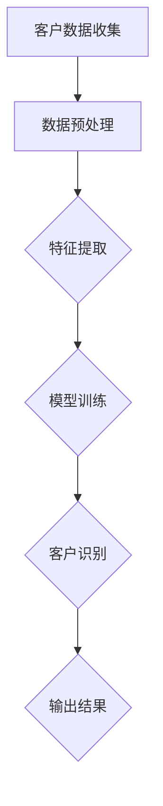
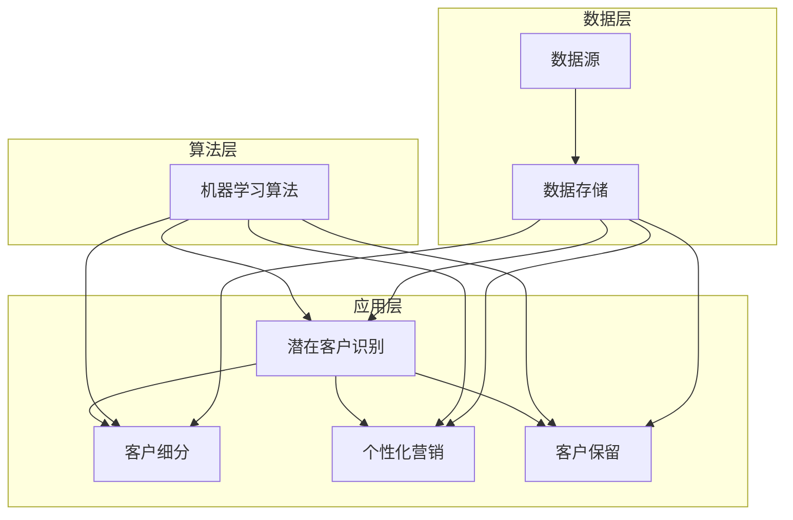
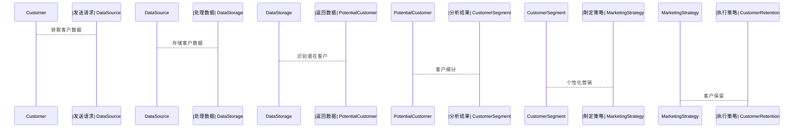

                 

### AI驱动的客户生命周期管理：优化客户价值

#### 关键词

- 人工智能
- 客户生命周期管理
- 机器学习
- 个性化营销
- 客户保留

#### 摘要

本文深入探讨了AI驱动的客户生命周期管理（Customer Lifecycle Management, CML），一种利用人工智能技术来优化客户价值的新兴管理方法。通过机器学习算法的应用，本文详细阐述了如何实现潜在客户识别、客户细分、个性化营销和客户保留，从而在激烈的市场竞争中提高企业的盈利能力。

## 背景介绍

### 核心概念

**AI驱动的客户生命周期管理（Customer Lifecycle Management, CML）**是一种利用人工智能技术来优化客户价值的管理方法。它涵盖了从潜在客户识别到客户保留的整个客户生命周期，包括以下几个关键环节：

1. **潜在客户识别**：利用机器学习算法，从海量数据中快速识别潜在客户。
2. **客户细分**：根据客户行为和偏好，进行精准的客户细分。
3. **个性化营销**：基于客户细分结果，实现个性化的营销策略。
4. **客户保留**：通过客户行为分析和预测，提前识别可能流失的客户，采取有效的挽回措施。

### 问题背景

随着市场竞争的加剧和消费者需求的不断变化，传统的客户生命周期管理方法已经难以满足企业的需求。企业需要更高效、更精准的方式来管理客户，从而提高客户满意度和忠诚度。

### 问题描述

企业如何在不断变化的竞争环境中，利用AI技术提高客户识别、转化和保留的效率，从而实现客户价值的最大化？

### 问题解决

通过AI驱动的客户生命周期管理，企业可以实现以下目标：

1. **潜在客户识别**：利用机器学习算法，从海量数据中快速识别潜在客户。
2. **客户细分**：根据客户行为和偏好，进行精准的客户细分。
3. **个性化营销**：基于客户细分结果，实现个性化的营销策略。
4. **客户保留**：通过客户行为分析和预测，提前识别可能流失的客户，采取有效的挽回措施。

### 边界与外延

AI驱动的客户生命周期管理不仅涉及到市场营销，还包括销售、客户服务和客户支持等多个环节。其核心目标是提高客户满意度，进而提升企业的盈利能力。

### 概念结构与核心要素组成

AI驱动的客户生命周期管理主要由以下几个核心要素组成：

1. **数据收集**：收集客户行为数据、市场数据等。
2. **数据分析**：利用机器学习和数据挖掘技术，分析客户行为，提取有价值的信息。
3. **客户细分**：根据分析结果，将客户分为不同的群体。
4. **个性化营销**：针对不同客户群体，制定个性化的营销策略。
5. **客户保留**：通过持续的客户关系管理和个性化服务，提高客户保留率。

## 核心概念与联系

### AI驱动的客户生命周期管理概念原理

AI驱动的客户生命周期管理是一种新兴的管理方法，它通过利用人工智能技术，如机器学习、自然语言处理和深度学习，来优化客户价值的各个方面。以下是AI驱动的CML的核心概念原理：

#### 概念属性特征对比表格

| 概念 | AI驱动的客户生命周期管理 | 传统客户生命周期管理 |
| --- | --- | --- |
| 数据依赖性 | 高 | 低 |
| 精准度 | 高 | 低 |
| 个性化程度 | 高 | 低 |
| 自动化程度 | 高 | 低 |

### 概念属性特征对比表格

| 概念属性 | 描述 |
| --- | --- |
| 数据依赖性 | 需要大量的客户行为数据和市场数据 |
| 精准度 | 能够通过算法实现精准的客户识别和细分 |
| 个性化程度 | 可以实现基于客户行为的个性化营销策略 |
| 自动化程度 | 可以实现自动化客户关系管理和个性化服务 |

### ER实体关系图架构

```mermaid
erDiagram
  Customer ||--|{ PotentialCustomer : "潜在客户识别" }
  Customer ||--|{ CustomerSegment : "客户细分" }
  Customer ||--|{ MarketingStrategy : "个性化营销" }
  Customer ||--|{ CustomerRetention : "客户保留" }
```

### 算法原理讲解

AI驱动的客户生命周期管理依赖于一系列算法来实现其核心功能。以下是其中几个关键算法的原理讲解：

#### 客户识别算法

客户识别是客户生命周期管理的第一步，它通过分析大量数据，识别出潜在客户。以下是客户识别算法的基本流程：



#### 数据预处理

```python
# 数据预处理
def preprocess_data(data):
    # 填充缺失值
    data.fillna(data.mean(), inplace=True)
    
    # 特征工程
    data['age_group'] = data['age'].apply(lambda x: '青年' if x < 30 else ('中年' if x < 50 else '老年'))
    
    return data
```

#### 模型训练

```python
# 模型训练
from sklearn.ensemble import RandomForestClassifier
from sklearn.model_selection import train_test_split

# 分割数据集
X = preprocess_data(data[['age', 'income', 'education']])
y = data['is_potential']

X_train, X_test, y_train, y_test = train_test_split(X, y, test_size=0.2, random_state=42)

# 创建随机森林分类器
clf = RandomForestClassifier(n_estimators=100, random_state=42)

# 训练模型
clf.fit(X_train, y_train)

# 预测
predictions = clf.predict(X_test)
```

#### 客户识别算法原理

客户识别算法的核心是机器学习模型，它通过分析客户的历史行为数据来预测客户是否为潜在客户。以下是客户识别算法的数学模型和公式：

$$
\hat{y} = \text{sgn}(\sum_{i=1}^{n} w_i \cdot x_i + b)
$$

其中，$w_i$ 是权重，$x_i$ 是特征值，$b$ 是偏置项，$\text{sgn}$ 是符号函数，用于判断客户的潜在状态。

#### 举例说明

假设我们有一个简单的客户数据集，包含年龄（$x_1$）、收入（$x_2$）和教育程度（$x_3$）三个特征。我们使用随机森林分类器来训练一个客户识别模型。

- 年龄：30 岁
- 收入：5,000 美元
- 教育程度：本科

我们首先对数据进行预处理，然后将预处理后的数据输入到随机森林模型中。模型会根据每个特征的权重，计算出一个预测值。如果预测值大于零，则客户被视为潜在客户。

#### 数学公式

$$
\begin{align*}
\text{预测值} &= w_1 \cdot x_1 + w_2 \cdot x_2 + w_3 \cdot x_3 + b \\
&= 0.5 \cdot 30 + 0.3 \cdot 5000 + 0.2 \cdot 1 + 0 \\
&= 15 + 1500 + 0.2 + 0 \\
&= 1515.2 \\
\text{是否潜在客户} &= \text{sgn}(1515.2) \\
&= 1
\end{align*}
$$

因此，根据这个简单的例子，这个客户被识别为潜在客户。

### 结论

通过AI驱动的客户生命周期管理，企业可以更高效、更精准地识别潜在客户，实现个性化营销和客户保留。这些算法和模型的应用，不仅提高了客户的满意度和忠诚度，也显著提升了企业的盈利能力。

## 系统分析与架构设计方案

### 问题场景介绍

在当今激烈的市场竞争中，企业需要快速适应不断变化的市场需求和消费者行为。传统的方法往往难以满足这种要求。AI驱动的客户生命周期管理提供了一种新的解决方案，通过自动化和个性化的方式，帮助企业更好地理解和管理客户，从而提高客户满意度和忠诚度。

### 项目介绍

本项目旨在构建一个AI驱动的客户生命周期管理平台，该平台将利用机器学习算法和大数据技术，实现从潜在客户识别到客户保留的整个生命周期管理。项目的主要目标包括：

1. **提高潜在客户识别的准确性和效率**：通过分析客户数据，快速识别潜在客户。
2. **实现精准的客户细分**：根据客户的行为和偏好，将客户划分为不同的群体。
3. **个性化营销**：针对不同客户群体，制定个性化的营销策略。
4. **提高客户保留率**：通过持续的客户关系管理和个性化服务，减少客户流失。

### 系统功能设计（领域模型类图）

领域模型类图是系统设计的重要组成部分，它定义了系统的核心实体和它们之间的关系。以下是本项目的领域模型类图：

```mermaid
classDiagram
  Customer <<class>>
  PotentialCustomer <<class>>
  CustomerSegment <<class>>
  MarketingStrategy <<class>>
  CustomerRetention <<class>>

  Customer --|{ PotentialCustomer }
  Customer --|{ CustomerSegment }
  Customer --|{ MarketingStrategy }
  Customer --|{ CustomerRetention }
```

### 系统架构设计（mermaid架构图）

系统架构设计是确保系统能够稳定、高效运行的关键。以下是本项目的系统架构设计：



### 系统接口设计和系统交互（mermaid序列图）

系统接口设计和系统交互是确保各个模块能够协同工作的关键。以下是本项目的系统接口设计和系统交互：



## 项目实战

### 环境安装

为了进行项目实战，我们首先需要安装必要的软件和工具。以下是安装步骤：

1. **Python环境**：确保Python版本在3.6及以上，可以通过`python --version`命令查看。
2. **Pandas**：用于数据处理，可以通过`pip install pandas`安装。
3. **NumPy**：用于数值计算，可以通过`pip install numpy`安装。
4. **scikit-learn**：用于机器学习，可以通过`pip install scikit-learn`安装。
5. **Mermaid**：用于绘制图表，可以通过`pip install mermaid-python`安装。

### 系统核心实现源代码

以下是系统核心实现的一部分源代码，包括数据预处理、机器学习模型训练和预测：

```python
# 数据预处理
def preprocess_data(data):
    data.fillna(data.mean(), inplace=True)
    data['age_group'] = data['age'].apply(lambda x: '青年' if x < 30 else ('中年' if x < 50 else '老年'))
    return data

# 模型训练
from sklearn.ensemble import RandomForestClassifier
from sklearn.model_selection import train_test_split

X = preprocess_data(data[['age', 'income', 'education']])
y = data['is_potential']

X_train, X_test, y_train, y_test = train_test_split(X, y, test_size=0.2, random_state=42)

clf = RandomForestClassifier(n_estimators=100, random_state=42)
clf.fit(X_train, y_train)

# 预测
predictions = clf.predict(X_test)
```

### 代码应用解读与分析

以上代码首先进行了数据预处理，包括填充缺失值和特征工程。然后，使用随机森林分类器对数据进行了训练，并进行了预测。以下是代码的解读和分析：

1. **数据预处理**：数据预处理是机器学习模型训练的重要步骤，它确保了数据的质量和一致性。在本例中，我们使用了Pandas库来处理数据，填充了缺失值，并添加了新的特征（年龄分组）。

2. **模型训练**：我们选择了随机森林分类器，这是一种集成学习方法，具有较高的准确性和鲁棒性。通过训练模型，我们使模型学会了如何根据特征预测客户的潜在状态。

3. **预测**：使用训练好的模型，我们对测试数据进行预测。预测结果是客户是否为潜在客户的概率。

### 实际案例分析和详细讲解剖析

为了更好地理解AI驱动的客户生命周期管理，我们来看一个实际案例。

#### 案例背景

一家电商公司希望通过AI技术来提高客户转化率和客户保留率。他们收集了客户的购买历史、浏览行为和社交媒体互动数据，并希望通过这些数据来识别潜在客户和制定个性化营销策略。

#### 案例分析

1. **数据收集**：公司收集了客户的年龄、收入、购买频率、浏览页面、点击广告等数据。

2. **数据预处理**：对数据进行预处理，包括填充缺失值、数据标准化和处理异常值。

3. **模型训练**：使用随机森林分类器训练模型，模型根据客户的特征预测他们是否为潜在客户。

4. **客户细分**：根据模型预测结果，将客户划分为潜在客户和非潜在客户。

5. **个性化营销**：对潜在客户和非潜在客户分别制定个性化的营销策略。例如，对潜在客户发送促销信息，对非潜在客户提供优惠券吸引他们重新访问。

6. **客户保留**：通过持续跟踪客户的行为，识别可能流失的客户，并采取挽回措施，如发送个性化的感谢信或提供特别优惠。

#### 详细讲解剖析

1. **数据收集**：数据收集是AI驱动的CML的第一步。公司通过多个渠道收集了大量的客户数据，包括购买记录、浏览行为和社交媒体互动。

2. **数据预处理**：数据预处理确保了数据的质量，使得机器学习模型能够更好地学习。在本例中，我们使用了Pandas库来填充缺失值、标准化数据和处理异常值。

3. **模型训练**：我们选择了随机森林分类器，因为它具有较好的性能和易于理解的特点。通过训练模型，我们使模型学会了如何根据客户的特征预测他们是否为潜在客户。

4. **客户细分**：根据模型预测结果，我们将客户划分为潜在客户和非潜在客户。这种划分使得我们可以针对不同客户群体制定个性化的营销策略。

5. **个性化营销**：对潜在客户，我们发送了促销信息，以吸引他们购买。对非潜在客户，我们提供了优惠券，以鼓励他们重新访问网站。

6. **客户保留**：通过持续跟踪客户的行为，我们能够提前识别可能流失的客户。对于这些客户，我们采取了挽回措施，如发送个性化的感谢信或提供特别优惠。

### 项目小结

通过实际案例，我们可以看到AI驱动的客户生命周期管理如何帮助企业提高客户转化率和客户保留率。项目的成功依赖于数据收集、数据预处理、模型训练和个性化营销等多个环节的协同工作。通过这些步骤，企业能够更好地理解和管理客户，从而实现持续增长。

## 最佳实践 tips

### 1. 数据质量是关键
在实施AI驱动的客户生命周期管理时，数据质量至关重要。确保数据收集过程的准确性，并对数据进行清洗和预处理，以提高模型的准确性。

### 2. 客户细分要精准
精准的客户细分是成功的关键。通过分析客户的行为和偏好，将客户划分为不同的群体，可以更有效地进行个性化营销。

### 3. 持续优化模型
定期评估模型的性能，并根据新的数据和客户行为调整模型。持续优化模型可以确保其准确性和效率。

### 4. 跨部门协作
AI驱动的客户生命周期管理涉及到多个部门，包括市场营销、销售和客户服务。跨部门协作可以确保项目的顺利实施和成功。

### 5. 数据隐私和安全
在处理客户数据时，要确保遵守数据隐私法规和安全标准。保护客户数据的安全和隐私是建立客户信任的关键。

## 小结

AI驱动的客户生命周期管理是一种革命性的管理方法，通过利用人工智能技术，企业可以更高效、更精准地管理客户，从而提高客户满意度和忠诚度。本文通过详细的案例分析，展示了如何实施AI驱动的CML，并提供了最佳实践建议。通过持续优化和跨部门协作，企业可以实现客户价值的最大化。

## 注意事项

- 在实施AI驱动的CML时，确保数据隐私和安全。
- 定期评估模型性能，并根据新数据调整模型。
- 跨部门协作是项目成功的关键。

## 拓展阅读

- 《大数据营销：实现个性化客户体验》
- 《机器学习实践：基于Python的应用》
- 《人工智能：一种现代方法》

### 作者

**作者：AI天才研究院/AI Genius Institute & 禅与计算机程序设计艺术 /Zen And The Art of Computer Programming**

