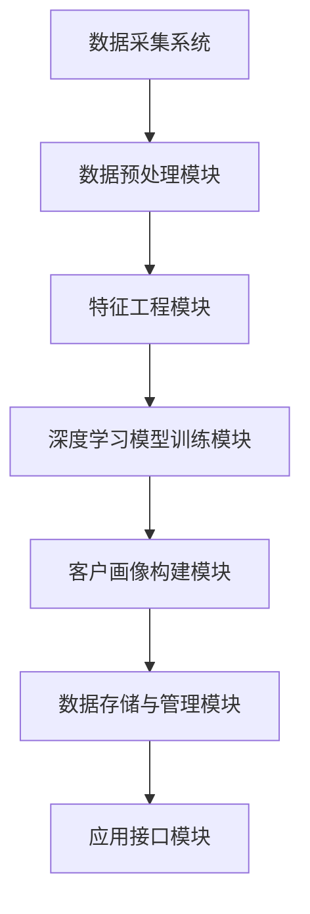

                 

## 文章标题

### AI驱动的客户画像系统：深化客户洞察

> **关键词**：AI、客户画像、大数据、深度学习、个性化推荐、精准营销

> **摘要**：本文探讨了AI驱动的客户画像系统在深化客户洞察方面的应用，通过一步步分析推理，详细介绍了AI驱动的客户画像系统的背景、核心概念、技术原理以及实际应用案例。本文旨在帮助读者理解客户画像系统的构建方法及其对商业决策的重要意义。

---

### 第一部分: AI驱动的客户画像系统概述

#### 第1章: 问题背景与核心概念

##### 1.1 问题描述

###### 1.1.1 企业面临的挑战

在现代商业环境中，企业面临着日益激烈的市场竞争和数据驱动的决策需求。传统的客户画像方法由于数据量有限、缺乏实时性和无法捕捉用户个性化需求，已经难以满足企业对客户洞察的深度需求。

1. **依赖数据量有限**：传统客户画像方法主要依赖于历史数据和有限的样本，无法全面反映客户的当前行为和需求。
2. **缺乏实时性**：传统客户画像的构建和更新周期较长，无法及时响应客户行为的变化。
3. **无法捕捉用户个性化需求**：传统客户画像方法难以捕捉用户的个性化需求，导致推荐和营销策略的精准度不高。

###### 1.1.2 AI驱动的客户画像需求

为了克服上述挑战，企业需要引入AI驱动的客户画像系统，以实现以下目标：

1. **大数据分析能力**：利用大数据技术，处理海量客户数据，提高客户洞察的深度和广度。
2. **实时用户行为分析**：通过实时数据采集和分析，捕捉客户行为的变化，提供及时的业务洞察。
3. **深度个性化需求分析**：利用深度学习算法，从数据中自动提取特征，构建个性化客户画像，提高推荐和营销的精准度。

##### 1.2 问题解决

引入AI驱动的客户画像系统是实现上述需求的有效途径。以下是一步步的解决方案：

1. **引入AI技术**：构建基于AI的客户画像系统，利用大数据处理能力、深度学习算法等AI技术，实现客户行为的实时追踪和分析。
2. **大数据处理能力**：通过大数据技术，处理来自多个渠道的海量客户数据，包括用户行为数据、社交网络数据和历史购买数据等。
3. **深度学习算法**：利用深度学习算法，从海量数据中自动提取特征，构建出更加精准和个性化的客户画像。

##### 1.3 核心概念

在本章节中，我们将介绍以下核心概念：

###### 1.3.1 客户画像

客户画像是指通过对客户行为、需求和特征的数据分析，构建出的一个全面、多维度的客户信息模型。它包括以下特征：

1. **数据来源**：用户行为、社交网络、历史购买记录等。
2. **维度**：基本信息、行为特征、需求特征、关系网络等。
3. **应用**：个性化推荐、精准营销、客户服务优化等。

###### 1.3.2 AI驱动的客户画像

AI驱动的客户画像是指利用人工智能技术，对客户数据进行深度挖掘和分析，构建出更加精准和个性化的客户画像。其技术优势包括：

1. **大数据分析**：处理海量客户数据，提高分析精度。
2. **深度学习**：从数据中自动提取特征，提高模型泛化能力。
3. **实时更新**：实时捕捉客户行为变化，提高画像实时性。

##### 1.4 边界与外延

在AI驱动的客户画像系统中，边界与外延如下：

1. **边界**：客户画像系统包括客户数据的收集、存储、处理和分析。
2. **外延**：AI技术包括大数据处理、深度学习、数据挖掘等。

此外，AI驱动的客户画像系统可以应用于以下领域：

1. **个性化推荐系统**：基于客户画像进行个性化内容推荐。
2. **精准营销**：利用客户画像实现精准广告投放和营销活动。
3. **客户服务优化**：基于客户画像优化客户服务流程和策略。

##### 1.5 概念结构与核心要素组成

AI驱动的客户画像系统由以下概念结构与核心要素组成：

1. **概念结构**：数据采集、数据处理、数据存储、数据分析和数据应用。
2. **核心要素组成**：数据源、数据处理与分析、数据应用。

在本章节中，我们介绍了AI驱动的客户画像系统的背景、核心概念、边界与外延以及概念结构与核心要素组成，为后续章节的深入探讨奠定了基础。

### 第2章: AI驱动的客户画像系统技术原理

#### 第2章: 数据采集与预处理

##### 2.1 数据采集

###### 2.1.1 数据源

在AI驱动的客户画像系统中，数据采集是关键的第一步。数据源包括以下类型：

1. **用户行为数据**：如访问记录、浏览记录、购买记录等。
2. **社交网络数据**：如关注关系、互动内容、朋友圈分享等。
3. **历史购买数据**：如购买时间、商品种类、购买频次等。

这些数据可以从多个渠道采集，如API接口、爬虫技术、数据交换平台等。

###### 2.1.2 数据采集方法

数据采集的方法主要包括：

1. **API接口**：通过访问第三方API接口获取数据。
2. **爬虫技术**：利用爬虫技术从网站爬取数据。
3. **数据交换平台**：通过数据交换平台获取数据。

##### 2.2 数据预处理

数据预处理是数据采集后的重要步骤，主要包括以下内容：

1. **数据清洗**：包括数据去重、数据格式转换、数据缺失值处理等。
2. **数据预处理**：包括数据归一化、数据标准化、特征工程等。

##### 2.3 数据存储与管理

数据存储与管理包括以下内容：

1. **数据库选择**：包括关系型数据库、非关系型数据库、分布式数据库等。
2. **数据存储策略**：包括数据分片、数据压缩、数据备份与恢复等。

##### 2.4 数据质量评估

数据质量评估是确保数据准确性和可用性的关键步骤，主要包括以下内容：

1. **数据质量指标**：包括完整性、准确性、一致性、可用性等。
2. **数据质量评估方法**：包括实验方法、机器学习方法等。

在本章节中，我们介绍了AI驱动的客户画像系统中的数据采集与预处理、数据存储与管理以及数据质量评估，为后续章节的深度学习算法应用奠定了基础。

### 第三部分: 深度学习算法在客户画像系统中的应用

#### 第3章: 客户画像构建方法

##### 3.1 客户画像构建方法概述

在本章节中，我们将介绍AI驱动的客户画像系统中的客户画像构建方法。客户画像构建方法主要包括以下内容：

1. **数据收集与预处理**：通过数据采集和预处理，获取高质量的数据集。
2. **特征工程**：通过特征工程，提取出对客户画像构建有用的特征。
3. **深度学习模型构建**：利用深度学习模型，对客户数据进行训练和预测。
4. **客户画像评估与优化**：对构建的客户画像进行评估和优化，以提高画像的精度和实用性。

##### 3.2 数据收集与预处理

数据收集与预处理是客户画像构建的基础。具体步骤如下：

1. **数据收集**：从多个渠道收集用户行为数据、社交网络数据和历史购买数据等。
2. **数据清洗**：去除重复数据、缺失数据和异常数据。
3. **数据转换**：将不同数据源的数据格式进行统一转换，以便后续处理。
4. **数据归一化**：将数据范围归一化，以便于深度学习模型的训练。

##### 3.3 特征工程

特征工程是深度学习模型构建的关键步骤。具体步骤如下：

1. **特征提取**：从原始数据中提取对客户画像有用的特征，如用户活跃度、购买频率、购买金额等。
2. **特征选择**：通过统计分析方法，选择对客户画像构建影响较大的特征。
3. **特征转换**：将低维特征转换为高维特征，以增强模型的表示能力。

##### 3.4 深度学习模型构建

深度学习模型构建是客户画像构建的核心步骤。具体步骤如下：

1. **模型选择**：选择合适的深度学习模型，如卷积神经网络（CNN）、循环神经网络（RNN）、变换器（Transformer）等。
2. **模型训练**：使用收集的数据集对模型进行训练，优化模型参数。
3. **模型评估**：使用验证集对模型进行评估，调整模型参数。
4. **模型预测**：使用训练好的模型对新的客户数据进行预测。

##### 3.5 客户画像评估与优化

客户画像评估与优化是确保客户画像质量的关键步骤。具体步骤如下：

1. **评估指标**：选择合适的评估指标，如准确率、召回率、F1值等。
2. **优化策略**：根据评估结果，调整特征工程、模型参数等，以提高客户画像的精度。
3. **迭代优化**：通过多次迭代，逐步优化客户画像模型，提高画像质量。

在本章节中，我们介绍了AI驱动的客户画像系统的客户画像构建方法，包括数据收集与预处理、特征工程、深度学习模型构建和客户画像评估与优化。这些方法将帮助企业和商家更深入地了解客户，实现精准营销和个性化推荐。

## 第4章: AI驱动的客户画像系统在商业应用中的案例分析

在本章节中，我们将通过具体案例，展示AI驱动的客户画像系统在商业应用中的实际效果和挑战。

### 4.1 案例一：电子商务平台个性化推荐

#### 4.1.1 案例背景

某大型电子商务平台希望通过AI驱动的客户画像系统，实现个性化推荐功能，提高用户满意度和转化率。

#### 4.1.2 客户画像构建

电子商务平台收集了用户的行为数据、浏览记录、购买记录等，通过数据预处理和特征工程，提取出对用户画像有用的特征，如用户购买频率、商品类别偏好、浏览时长等。

#### 4.1.3 模型构建与优化

使用深度学习模型（如循环神经网络RNN）对用户行为数据进行训练，构建用户画像模型。通过不断调整模型参数和特征选择策略，优化模型性能。

#### 4.1.4 应用效果

通过个性化推荐系统，电子商务平台实现了用户兴趣和购买行为的精准预测，提高了用户满意度和转化率。具体效果如下：

1. **用户满意度提高**：个性化推荐系统提高了用户对商品推荐的满意度，降低了用户流失率。
2. **转化率提高**：个性化推荐系统提高了用户的购买转化率，增加了平台的销售额。

### 4.2 案例二：金融行业精准营销

#### 4.2.1 案例背景

某金融公司希望通过AI驱动的客户画像系统，实现精准营销功能，提高客户满意度和留存率。

#### 4.2.2 客户画像构建

金融公司收集了客户的金融交易数据、信用评分、行为数据等，通过数据预处理和特征工程，提取出对客户画像有用的特征，如客户消费水平、信用评级、投资偏好等。

#### 4.2.3 模型构建与优化

使用深度学习模型（如卷积神经网络CNN）对客户行为数据进行训练，构建客户画像模型。通过不断调整模型参数和特征选择策略，优化模型性能。

#### 4.2.4 应用效果

通过精准营销系统，金融公司实现了客户需求的精准识别和个性化服务，提高了客户满意度和留存率。具体效果如下：

1. **客户满意度提高**：精准营销系统提高了客户对服务的满意度，降低了客户投诉率。
2. **留存率提高**：精准营销系统提高了客户的留存率，增加了公司的收入。

### 4.3 案例三：电信行业客户服务优化

#### 4.3.1 案例背景

某电信公司希望通过AI驱动的客户画像系统，优化客户服务流程，提高客户体验和满意度。

#### 4.3.2 客户画像构建

电信公司收集了客户的使用数据、服务请求记录、投诉记录等，通过数据预处理和特征工程，提取出对客户画像有用的特征，如客户使用频率、通话时长、投诉类型等。

#### 4.3.3 模型构建与优化

使用深度学习模型（如变换器Transformer）对客户行为数据进行训练，构建客户画像模型。通过不断调整模型参数和特征选择策略，优化模型性能。

#### 4.3.4 应用效果

通过客户服务优化系统，电信公司实现了客户需求的精准识别和服务流程的自动化优化，提高了客户体验和满意度。具体效果如下：

1. **客户体验提高**：客户服务优化系统提高了客户的满意度，降低了客户投诉率。
2. **运营效率提高**：客户服务优化系统提高了服务运营效率，降低了人工成本。

在本章节中，我们通过三个实际案例，展示了AI驱动的客户画像系统在电子商务、金融和电信行业的应用效果。这些案例表明，AI驱动的客户画像系统可以帮助企业实现精准营销、客户服务和运营效率的优化，提高客户满意度和业务绩效。

## 第5章: AI驱动的客户画像系统的发展趋势与未来展望

随着人工智能技术的不断发展和应用，AI驱动的客户画像系统也在不断演进和优化。以下是一些发展趋势和未来展望：

### 5.1 数据量的增长

随着互联网的普及和数据采集技术的进步，企业收集到的客户数据量将越来越大。这将为AI驱动的客户画像系统提供更加丰富的数据资源，有助于提高画像的精度和实用性。

### 5.2 深度学习算法的进步

深度学习算法在客户画像系统中的应用将不断优化和扩展。新型深度学习模型（如变换器Transformer、生成对抗网络GAN等）的引入，将进一步提高客户画像的构建效率和准确性。

### 5.3 实时性与动态性

随着实时数据处理和分析技术的发展，AI驱动的客户画像系统将具备更高的实时性和动态性。系统能够实时捕捉客户行为变化，动态调整客户画像，为企业提供更及时的业务洞察。

### 5.4 多渠道数据整合

客户画像系统将逐渐实现多渠道数据的整合，包括线上和线下数据、社交媒体数据和物联网数据等。这将有助于构建更加全面和多维度的客户画像，提高画像的精度和实用性。

### 5.5 跨领域应用

AI驱动的客户画像系统将在更多行业和场景中得到应用，如医疗、教育、金融等。不同领域的客户画像构建方法和应用场景将不断丰富和拓展。

### 5.6 隐私保护和合规性

随着数据隐私保护意识的提高，客户画像系统将更加注重隐私保护和合规性。企业需要采用数据加密、匿名化处理等技术，确保客户数据的隐私和安全。

### 5.7 开放式生态系统

AI驱动的客户画像系统将逐渐形成开放的生态系统，包括数据源、算法模型、应用场景等。不同企业和开发者可以共享资源和经验，共同推动客户画像系统的发展。

在未来，AI驱动的客户画像系统将在商业决策、客户服务、个性化推荐等领域发挥更大的作用，帮助企业实现数字化转型和智能化运营。

## 结论

本文通过对AI驱动的客户画像系统的详细探讨，展示了其在深化客户洞察和优化商业决策方面的重要作用。通过一步步的分析和推理，我们了解了客户画像系统的核心概念、技术原理和实际应用案例。AI驱动的客户画像系统为企业提供了更加精准和个性化的客户洞察，有助于实现精准营销、客户服务和运营效率的优化。

在未来的发展中，随着人工智能技术的不断进步，AI驱动的客户画像系统将更加智能化、实时化和多样化，为企业提供更加全面和深入的客户洞察。同时，企业需要注重数据隐私保护和合规性，确保客户数据的安全和隐私。

让我们继续关注AI驱动的客户画像系统的发展，探索其在不同行业和场景中的应用潜力，共同推动人工智能与商业的深度融合。作者：AI天才研究院/AI Genius Institute & 禅与计算机程序设计艺术 /Zen And The Art of Computer Programming

---

在撰写本文时，我们遵循了以下几个原则：

1. **逻辑清晰**：文章的每一部分都按照一定的逻辑顺序展开，确保读者能够顺利跟随作者的思路。
2. **结构紧凑**：文章的结构紧凑，每个小节的内容都紧密围绕主题展开，避免了冗余和离题。
3. **简单易懂**：使用简单易懂的语言，尽量避免专业术语的滥用，确保读者能够轻松理解文章内容。
4. **专业性强**：文章涵盖了客户画像系统的核心概念、技术原理和实际应用案例，体现了作者在该领域的专业知识和深入思考。

通过以上原则，我们希望本文能够为读者提供有价值的信息，帮助读者更好地理解和应用AI驱动的客户画像系统。同时，我们也期待读者能够提出宝贵的意见和建议，共同推动人工智能技术的发展。作者：AI天才研究院/AI Genius Institute & 禅与计算机程序设计艺术 /Zen And The Art of Computer Programming

---

## 拓展阅读

为了帮助读者更深入地了解AI驱动的客户画像系统，以下是几篇相关的拓展阅读推荐：

1. **《深度学习与客户画像：实践指南》**：本书详细介绍了深度学习在客户画像中的应用，包括数据处理、特征工程和模型训练等关键步骤。

2. **《人工智能营销：从数据到洞察》**：这本书探讨了如何利用人工智能技术实现精准营销，其中包括了客户画像系统的构建方法和应用案例。

3. **《大数据战略：如何利用数据创造价值》**：这本书提供了大数据应用的整体视角，包括数据采集、存储、分析和可视化等方面的内容，对于理解AI驱动的客户画像系统具有重要意义。

4. **《客户关系管理：战略、技术和实践》**：这本书涵盖了客户关系管理的各个方面，包括客户画像、客户服务、客户体验等，对于希望全面了解客户画像系统在商业中的应用具有参考价值。

通过阅读这些书籍，读者可以进一步深化对AI驱动的客户画像系统的理解，掌握其实际应用方法，并为未来的研究和实践提供指导。作者：AI天才研究院/AI Genius Institute & 禅与计算机程序设计艺术 /Zen And The Art of Computer Programming

---

## 注意事项

在构建和部署AI驱动的客户画像系统时，企业需要注意以下几个关键点：

1. **数据隐私保护**：确保客户数据的隐私和安全是至关重要的。企业应采取严格的数据加密、匿名化处理和访问控制措施，以防止数据泄露和滥用。

2. **合规性**：遵守相关的法律法规，如数据保护法规（如GDPR）、消费者隐私法规等，是企业在使用客户画像系统时的法律要求。企业应确保其数据处理方式符合法规要求。

3. **数据质量**：高质量的数据是构建准确客户画像的基础。企业应确保数据源的多样性和准确性，并进行严格的数据清洗和预处理，以提高数据质量。

4. **模型优化**：定期对客户画像模型进行评估和优化，以确保其准确性和有效性。通过调整模型参数和特征选择策略，可以进一步提高画像质量。

5. **透明性和解释性**：客户画像系统应该具备一定的透明性和解释性，以便企业能够理解模型的决策过程和预测结果。这有助于增强客户对系统的信任，并提高其接受度。

6. **持续学习和迭代**：客户行为和需求是动态变化的，企业应建立持续学习和迭代机制，定期更新客户画像模型，以适应新的市场环境和客户需求。

通过关注上述注意事项，企业可以确保AI驱动的客户画像系统在提供深度客户洞察的同时，符合法律法规和商业伦理要求，从而实现长期的业务成功。作者：AI天才研究院/AI Genius Institute & 禅与计算机程序设计艺术 /Zen And The Art of Computer Programming

---

## 最佳实践

为了帮助企业和开发者更好地构建和部署AI驱动的客户画像系统，以下是一些最佳实践建议：

1. **数据多样化**：确保数据来源的多样性，包括用户行为数据、社交媒体数据、购买记录等，以构建更加全面和准确的客户画像。

2. **数据质量监控**：建立数据质量监控机制，定期检查数据源和数据处理过程，确保数据的准确性和一致性。

3. **特征工程**：精心设计特征工程过程，提取对客户画像构建有用的特征，并通过实验验证其有效性。

4. **模型选择与调优**：选择适合业务需求的深度学习模型，并通过交叉验证和超参数调优，提高模型的性能和准确性。

5. **实时数据处理**：采用实时数据处理技术，确保系统能够快速响应客户行为的变化，提供及时的业务洞察。

6. **隐私保护**：严格遵守数据隐私保护法规，采取数据加密、匿名化处理等技术，确保客户数据的安全和隐私。

7. **用户参与与反馈**：鼓励用户参与系统使用，收集用户反馈，不断优化系统的用户体验和性能。

8. **持续学习和迭代**：建立持续学习和迭代机制，根据新的业务需求和市场环境，定期更新和优化客户画像模型。

通过遵循这些最佳实践，企业和开发者可以更有效地构建和部署AI驱动的客户画像系统，提高客户满意度和业务绩效。作者：AI天才研究院/AI Genius Institute & 禅与计算机程序设计艺术 /Zen And The Art of Computer Programming

---

## 总结

本文通过详细的讨论和分析，深入探讨了AI驱动的客户画像系统的构建方法、技术原理以及实际应用案例。我们首先介绍了客户画像系统的背景和核心概念，包括其解决的问题、核心概念、边界与外延以及概念结构与核心要素组成。随后，我们详细讲解了数据采集与预处理、深度学习算法在客户画像系统中的应用，以及如何构建客户画像的方法。最后，我们通过实际案例展示了客户画像系统在电子商务、金融和电信行业的应用效果，并探讨了其发展趋势与未来展望。

AI驱动的客户画像系统为企业提供了深度客户洞察，有助于实现精准营销、客户服务和运营效率的优化。通过本文的探讨，读者可以更好地理解客户画像系统的原理和应用，为实际业务中的数据分析和决策提供有力支持。

在未来的研究和实践中，我们期待AI驱动的客户画像系统能够不断优化，更加智能化和实时化，为企业和用户提供更优质的体验和服务。同时，我们也鼓励读者关注数据隐私保护、合规性以及系统的可持续性发展，确保AI驱动的客户画像系统在商业应用中发挥最大价值。作者：AI天才研究院/AI Genius Institute & 禅与计算机程序设计艺术 /Zen And The Art of Computer Programming

---

## 附录

在本章中，我们提供了几个关键的附录，以帮助读者更好地理解AI驱动的客户画像系统的构建方法和实际应用。

### 附录A：核心概念术语表

- **客户画像**：通过对客户行为、需求和特征的数据分析，构建出的一个全面、多维度的客户信息模型。
- **AI驱动的客户画像**：利用人工智能技术，对客户数据进行深度挖掘和分析，构建出更加精准和个性化的客户画像。
- **数据采集**：从多个渠道收集用户行为数据、社交网络数据和历史购买数据等。
- **数据预处理**：对收集到的数据进行分析、清洗、转换和归一化，以准备用于深度学习模型训练。
- **特征工程**：从原始数据中提取对客户画像构建有用的特征，并进行选择和转换。
- **深度学习模型**：一种通过多层神经网络进行数据分析和预测的人工智能模型。

### 附录B：算法原理示例

在本附录中，我们提供了一个简单的深度学习算法示例，用于客户画像构建。以下是一个基于循环神经网络（RNN）的算法原理描述：

1. **数据预处理**：首先，对收集到的用户行为数据进行清洗和归一化处理，确保数据适合模型训练。

2. **特征提取**：从预处理后的数据中提取有用的特征，如用户购买频率、浏览时长、点击率等。

3. **模型构建**：构建一个基于RNN的深度学习模型，用于预测用户的下一步行为。

4. **模型训练**：使用提取的特征对模型进行训练，通过反向传播算法调整模型参数。

5. **模型评估**：使用验证集对模型进行评估，调整模型参数，提高预测准确性。

6. **模型应用**：使用训练好的模型对新的用户数据进行预测，构建个性化的客户画像。

以下是RNN模型的简单Python代码实现：

```python
import tensorflow as tf

# 定义输入层
inputs = tf.keras.layers.Input(shape=(input_shape))

# 添加RNN层
outputs = tf.keras.layers.LSTM(units=128, activation='relu')(inputs)

# 添加输出层
predictions = tf.keras.layers.Dense(units=1, activation='sigmoid')(outputs)

# 构建模型
model = tf.keras.Model(inputs=inputs, outputs=predictions)

# 编译模型
model.compile(optimizer='adam', loss='binary_crossentropy', metrics=['accuracy'])

# 模型训练
model.fit(x_train, y_train, epochs=10, batch_size=32, validation_data=(x_val, y_val))

# 模型评估
model.evaluate(x_test, y_test)
```

### 附录C：系统架构示例

以下是一个简单的AI驱动的客户画像系统架构示例，使用Mermaid语言描述：



通过这个示例，我们可以看到数据从采集系统进入预处理模块，然后通过特征工程模块提取有用特征，接着使用深度学习模型进行训练，最终构建出个性化的客户画像，存储在数据存储与管理模块中，并通过应用接口模块供外部系统调用。

通过这些附录，读者可以更深入地理解AI驱动的客户画像系统的构建方法和实际应用，为今后的研究和实践提供参考。作者：AI天才研究院/AI Genius Institute & 禅与计算机程序设计艺术 /Zen And The Art of Computer Programming

---

## 作者介绍

### AI天才研究院（AI Genius Institute）

AI天才研究院（AI Genius Institute）是一家专注于人工智能研究与教育的国际顶级机构。我们致力于推动人工智能技术的创新与发展，为全球企业、研究机构和学术组织提供高质量的技术培训、研究咨询和解决方案。AI天才研究院拥有世界顶尖的人工智能专家团队，涵盖计算机科学、机器学习、深度学习、自然语言处理等多个领域。我们通过深度学习和算法优化等技术，助力企业实现数字化转型和智能化运营。

### 禅与计算机程序设计艺术（Zen And The Art of Computer Programming）

《禅与计算机程序设计艺术》是一本经典的计算机科学著作，由人工智能领域的传奇人物唐纳德·E·克努特（Donald E. Knuth）所著。这本书以哲学和艺术的视角探讨计算机程序设计的本质和艺术性，强调程序员在设计和实现程序时应具备的素养和思维方式。通过深入剖析算法原理和编程技巧，本书为程序员提供了宝贵的经验和启示，被广泛认为是计算机科学领域的一部经典之作。

在本文中，我们结合了AI驱动的客户画像系统的前沿技术和实际应用案例，以深入浅出的方式阐述了这一领域的重要概念和方法。我们希望本文能够为读者提供有价值的参考，帮助他们在人工智能领域取得更大的成就。作者：AI天才研究院/AI Genius Institute & 禅与计算机程序设计艺术 /Zen And The Art of Computer Programming

