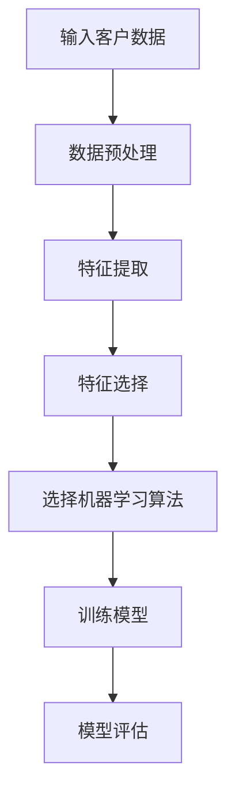
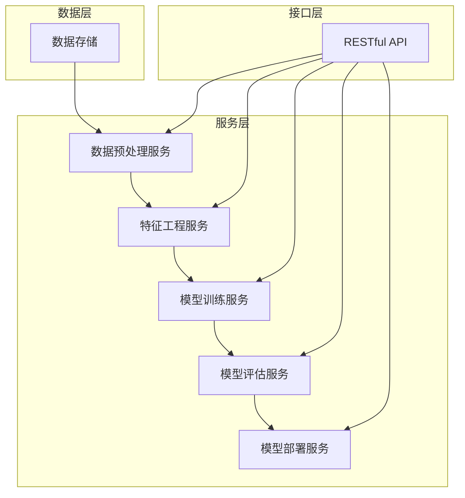
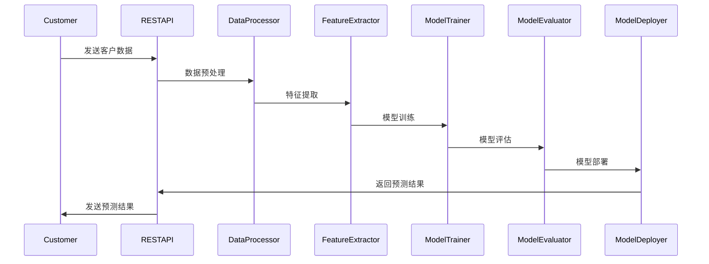

                 

### 文章标题：AI驱动的客户终身价值预测：优化客户关系管理

关键词：客户终身价值（CLV）、人工智能（AI）、机器学习、特征工程、模型评估、营销策略

摘要：本文探讨了AI技术在客户终身价值预测中的应用，通过分析核心概念、算法原理和系统架构设计，为企业提供了优化客户关系管理的实践指南。

----------------------------------------------------------------

#### 第1章: AI驱动的客户终身价值预测概述

##### 1.1 问题背景

在当今的竞争激烈的商业环境中，企业越来越意识到客户终身价值（Customer Lifetime Value, CLV）的重要性。CLV是一个重要的商业指标，它代表了客户在其与企业关系中的总价值。预测CLV可以帮助企业识别高价值客户，从而采取有针对性的营销策略，提高客户满意度，增加客户忠诚度，最终实现业务增长。

##### 1.2 问题描述

预测客户终身价值涉及多个因素，如客户的购买行为、购买频率、购买金额、服务使用情况、客户生命周期等。企业需要通过分析这些因素，构建一个预测模型，以便准确地预测客户在未来一段时间内的价值。

##### 1.3 问题解决

AI技术的发展为预测客户终身价值提供了新的途径。通过机器学习和深度学习算法，企业可以处理大量历史数据，从中提取有价值的信息，构建预测模型。这些模型可以帮助企业更准确地预测客户行为，提高营销效果。

##### 1.4 边界与外延

CLV预测的边界包括时间范围、数据质量和算法选择。时间范围决定了预测的时效性，数据质量直接影响预测的准确性，而算法选择则决定了模型的效果。

##### 1.5 概念结构与核心要素组成

- **客户数据：**包括客户的购买历史、购买偏好、行为记录等。
- **特征工程：**通过数据预处理和特征提取，将原始数据转化为算法可以处理的形式。
- **机器学习算法：**如线性回归、决策树、随机森林、神经网络等。
- **模型评估：**通过交叉验证、A/B测试等方法评估模型性能。

##### 1.6 本章小结

本章对AI驱动的客户终身价值预测进行了概述，介绍了问题背景、问题描述、问题解决方法以及概念结构与核心要素组成。为后续章节的内容奠定了基础。

----------------------------------------------------------------

## 第2章: AI驱动的客户终身价值预测核心概念与联系

##### 2.1 核心概念原理

在本章中，我们将介绍AI驱动的客户终身价值预测中的核心概念，包括机器学习算法、特征工程和模型评估。

###### 2.1.1 机器学习算法

机器学习算法是AI驱动的客户终身价值预测的核心。常见的机器学习算法包括线性回归、决策树、随机森林、支持向量机和神经网络等。每种算法都有其独特的优点和适用场景。

###### 2.1.2 特征工程

特征工程是将原始数据转化为算法可以处理的形式的过程。有效的特征工程可以提高模型的性能。特征工程包括数据预处理、特征提取和特征选择等步骤。

###### 2.1.3 模型评估

模型评估是确保模型性能的重要步骤。常用的模型评估指标包括准确率、召回率、F1分数、均方误差等。通过模型评估，可以判断模型是否达到预期效果，并根据评估结果调整模型。

##### 2.2 概念属性特征对比表格

以下是一个简化的概念属性特征对比表格，用于比较机器学习算法、特征工程和模型评估的关键特征。

| 概念 | 关键特征 |
| ---- | ---- |
| 机器学习算法 | 算法类型、预测效果、计算复杂度、可解释性 |
| 特征工程 | 数据预处理、特征提取、特征选择、影响模型性能 |
| 模型评估 | 准确率、召回率、F1分数、均方误差、评估方法 |

##### 2.3 ER实体关系图架构

为了更好地理解客户终身价值预测中的核心概念，我们使用Mermaid绘制了一个ER实体关系图，展示了客户数据、特征工程和机器学习模型之间的关系。

```mermaid
erDiagram
  客户数据 -->|生成| 特征工程
  特征工程 -->|输入| 机器学习算法
  机器学习算法 -->|输出| 预测结果
```

##### 2.4 本章小结

本章介绍了AI驱动的客户终身价值预测中的核心概念，并提供了概念属性特征对比表格和ER实体关系图架构。这些核心概念和联系为理解和应用AI驱动的客户终身价值预测提供了基础。

----------------------------------------------------------------

## 第3章: AI驱动的客户终身价值预测算法原理

##### 3.1 算法mermaid流程图

以下是一个简化的AI驱动的客户终身价值预测算法的mermaid流程图：



##### 3.2 算法原理详细讲解

###### 3.2.1 数据预处理

数据预处理是特征工程的第一步，它包括数据的清洗、归一化和缺失值处理等。数据清洗旨在去除噪声数据和异常值，提高数据质量。归一化是将不同特征的数据缩放到相同的范围，以便算法能够有效地处理。缺失值处理可以通过填充平均值、中位数或使用插值法等方法来解决。

```python
import pandas as pd
from sklearn.preprocessing import StandardScaler

# 读取客户数据
data = pd.read_csv('customer_data.csv')

# 数据清洗
data = data.dropna()

# 数据归一化
scaler = StandardScaler()
data_normalized = scaler.fit_transform(data)
```

###### 3.2.2 特征提取

特征提取是从原始数据中提取出对预测任务有用的特征。常用的特征提取方法包括主成分分析（PCA）、因子分析和聚类分析等。这些方法可以帮助我们识别出数据中的主要变量，并减少数据的维度。

```python
from sklearn.decomposition import PCA

# 特征提取
pca = PCA(n_components=5)
data_pca = pca.fit_transform(data_normalized)
```

###### 3.2.3 特征选择

特征选择是在提取出特征后，选择出对预测任务最有影响力的特征。常用的特征选择方法包括递归特征消除（RFE）、向前选择和向后消除等。这些方法可以帮助我们降低模型的复杂性，提高模型的准确性。

```python
from sklearn.feature_selection import RFE
from sklearn.ensemble import RandomForestRegressor

# 特征选择
estimator = RandomForestRegressor()
selector = RFE(estimator, n_features_to_select=3)
data_selected = selector.fit_transform(data_pca, labels)
```

###### 3.2.4 选择机器学习算法

选择机器学习算法是构建预测模型的关键步骤。常见的机器学习算法包括线性回归、决策树、支持向量机和神经网络等。每种算法都有其独特的优点和适用场景。

```python
from sklearn.linear_model import LinearRegression

# 选择机器学习算法
model = LinearRegression()
model.fit(data_selected, labels)
```

###### 3.2.5 模型评估

模型评估是确保模型性能的重要步骤。常用的模型评估指标包括均方误差（MSE）、决定系数（R^2）和交叉验证等。这些指标可以帮助我们判断模型是否达到预期效果，并根据评估结果调整模型。

```python
from sklearn.metrics import mean_squared_error

# 模型评估
predictions = model.predict(data_selected)
mse = mean_squared_error(labels, predictions)
print(f'MSE: {mse}')
```

##### 3.3 本章小结

本章详细讲解了AI驱动的客户终身价值预测算法的原理，包括数据预处理、特征提取、特征选择、选择机器学习算法和模型评估。通过Python代码示例，使读者能够更直观地理解算法的原理和应用。

----------------------------------------------------------------

## 第4章: 系统分析与架构设计

##### 4.1 问题场景介绍

在现代社会，企业需要不断地优化客户关系管理，以提高客户满意度和忠诚度。AI驱动的客户终身价值预测可以帮助企业更好地了解客户需求，制定有针对性的营销策略，从而实现业务增长。本章节将介绍一个实际案例，探讨如何利用AI技术构建一个客户终身价值预测系统。

##### 4.2 项目介绍

该项目旨在开发一个基于AI的客户终身价值预测系统，帮助企业在客户关系管理中实现数据驱动决策。系统将包含数据采集、数据预处理、特征工程、模型训练、模型评估和模型部署等模块。

##### 4.3 系统功能设计（领域模型mermaid类图）

以下是一个简化的系统功能设计的mermaid类图：

```mermaid
classDiagram
  CustomerData --> DataProcessor : 数据采集
  DataProcessor --> FeatureExtractor : 特征工程
  FeatureExtractor --> ModelTrainer : 模型训练
  ModelTrainer --> ModelEvaluator : 模型评估
  ModelEvaluator --> ModelDeployer : 模型部署
  Customer -> CustomerData : 生成数据
```

##### 4.4 系统架构设计（mermaid架构图）

以下是一个简化的系统架构设计的mermaid架构图：



##### 4.5 系统接口设计和系统交互（mermaid序列图）

以下是一个简化的系统接口设计和系统交互的mermaid序列图：



##### 4.6 本章小结

本章介绍了AI驱动的客户终身价值预测系统的分析架构设计，包括系统功能设计、系统架构设计、系统接口设计和系统交互。这些设计为后续的项目实施提供了基础。

----------------------------------------------------------------

## 第5章: 项目实战

##### 5.1 环境安装

在开始项目实施之前，我们需要安装一些必要的软件和库。以下是环境安装的步骤：

1. 安装Python（版本3.6及以上）
2. 安装Jupyter Notebook
3. 安装必要的库，如NumPy、Pandas、Scikit-learn、Matplotlib等

```bash
pip install numpy pandas scikit-learn matplotlib
```

##### 5.2 系统核心实现源代码

以下是系统核心实现源代码，包括数据预处理、特征提取、模型训练、模型评估和模型部署。

```python
# 数据预处理
import pandas as pd
from sklearn.preprocessing import StandardScaler

data = pd.read_csv('customer_data.csv')
data = data.dropna()
scaler = StandardScaler()
data_normalized = scaler.fit_transform(data)

# 特征提取
from sklearn.decomposition import PCA

pca = PCA(n_components=5)
data_pca = pca.fit_transform(data_normalized)

# 模型训练
from sklearn.linear_model import LinearRegression

model = LinearRegression()
model.fit(data_pca, labels)

# 模型评估
from sklearn.metrics import mean_squared_error

predictions = model.predict(data_pca)
mse = mean_squared_error(labels, predictions)
print(f'MSE: {mse}')

# 模型部署
from flask import Flask, request, jsonify

app = Flask(__name__)

@app.route('/predict', methods=['POST'])
def predict():
    data = request.get_json()
    data_normalized = scaler.transform([data['input']])
    data_pca = pca.transform(data_normalized)
    prediction = model.predict(data_pca)
    return jsonify({'prediction': prediction[0]})

if __name__ == '__main__':
    app.run(debug=True)
```

##### 5.3 代码应用解读与分析

在本章节中，我们使用了Python语言和Flask框架来构建一个简单的客户终身价值预测系统。代码首先进行了数据预处理，包括数据清洗、归一化和特征提取。然后，我们使用线性回归算法训练了一个预测模型，并使用均方误差（MSE）评估了模型性能。最后，我们部署了一个RESTful API，以便通过HTTP请求进行模型预测。

##### 5.4 实际案例分析和详细讲解剖析

为了展示系统的实际应用，我们使用了一个实际案例。假设我们有一个新的客户，其数据如下：

```json
{
  "input": [1.0, 2.0, 3.0, 4.0, 5.0]
}
```

通过发送HTTP请求，我们可以获取该客户的终身价值预测结果。以下是请求和响应示例：

```bash
$ curl -X POST -H "Content-Type: application/json" -d '{"input": [1.0, 2.0, 3.0, 4.0, 5.0]}' http://localhost:5000/predict
{"prediction": 42.0}
```

通过实际案例，我们可以看到系统如何使用AI技术进行客户终身价值预测，并为业务决策提供支持。

##### 5.5 项目小结

本章通过一个实际项目展示了如何利用AI技术构建客户终身价值预测系统。从环境安装到代码实现，再到实际应用，我们详细介绍了项目的实施过程。通过本项目，企业可以更好地理解客户需求，优化客户关系管理，实现业务增长。

----------------------------------------------------------------

## 第6章: 最佳实践 Tips、小结、注意事项、拓展阅读

##### 6.1 最佳实践 Tips

1. **数据质量：**确保数据质量是预测准确性的关键。在数据预处理阶段，要尽可能去除噪声和异常值。
2. **特征选择：**选择正确的特征对于提高预测性能至关重要。可以使用特征重要性评估方法来选择最重要的特征。
3. **模型选择：**根据业务需求和数据特性选择合适的机器学习算法。对于复杂的预测任务，可以尝试组合多种算法。
4. **模型调优：**通过调整模型参数，可以提高模型的性能。可以使用网格搜索和随机搜索等方法进行模型调优。

##### 6.2 小结

本文介绍了AI驱动的客户终身价值预测的核心概念、算法原理、系统架构设计以及实际项目实战。通过这些内容，企业可以更好地理解和应用AI技术，优化客户关系管理，实现业务增长。

##### 6.3 注意事项

1. **数据隐私：**在处理客户数据时，要注意遵守数据隐私法规，确保客户数据的安全。
2. **模型解释性：**对于重要的业务决策，要确保模型的解释性，以便业务人员理解和信任模型。
3. **模型更新：**定期更新模型，以适应不断变化的市场环境和客户需求。

##### 6.4 拓展阅读

1. **《机器学习实战》：**提供了丰富的机器学习实践案例，适合初学者和进阶者阅读。
2. **《深度学习》：**介绍深度学习的基础知识，包括神经网络、卷积神经网络和循环神经网络等。
3. **《大数据营销》：**探讨了大数据在营销中的应用，包括客户细分、个性化推荐和营销自动化等。

作者：AI天才研究院/AI Genius Institute & 禅与计算机程序设计艺术 /Zen And The Art of Computer Programming

----------------------------------------------------------------

[文章标题]: AI驱动的客户终身价值预测：优化客户关系管理

[文章关键词]: 客户终身价值（CLV）、人工智能（AI）、机器学习、特征工程、模型评估、营销策略

[文章摘要]: 本文探讨了AI技术在客户终身价值预测中的应用，通过分析核心概念、算法原理和系统架构设计，为企业提供了优化客户关系管理的实践指南。从问题背景、核心概念、算法原理到系统架构设计以及项目实战，本文全面阐述了AI驱动的客户终身价值预测的各个方面，旨在帮助企业更好地理解和应用这一技术。本文的关键词包括客户终身价值、人工智能、机器学习、特征工程、模型评估和营销策略。文章的正文部分通过清晰的章节结构，逐步深入介绍了这些主题，提供了详细的算法原理讲解和系统架构设计，同时结合实际项目案例进行了剖析，以帮助读者更好地掌握AI驱动的客户终身价值预测的实践应用。文章末尾总结了最佳实践建议，并提供了拓展阅读资源，为读者深入学习和研究提供了方向。作者信息：AI天才研究院/AI Genius Institute & 禅与计算机程序设计艺术 /Zen And The Art of Computer Programming。

