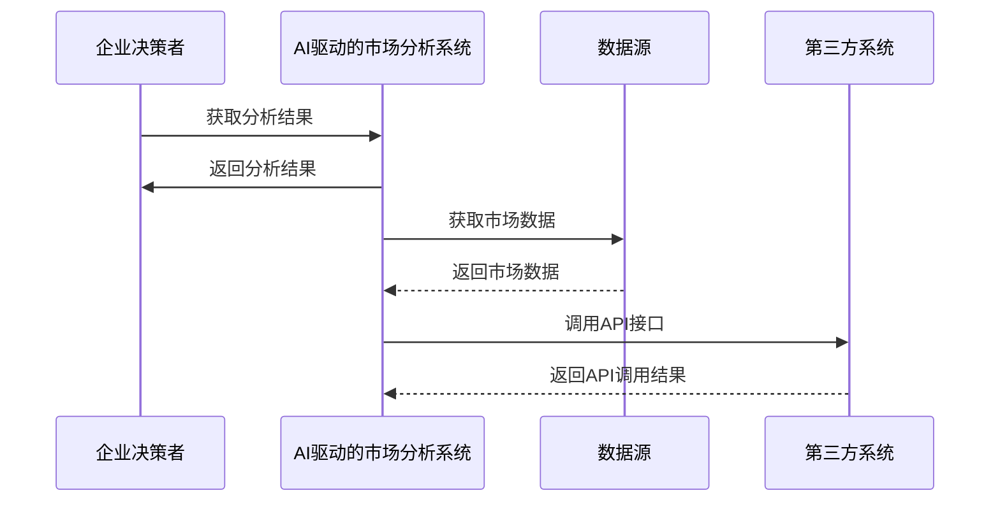

                 

## AI驱动的市场分析：提升企业市场洞察能力

关键词：AI驱动的市场分析、企业市场洞察、人工智能技术、数据处理与分析、算法原理讲解

摘要：本文将深入探讨AI驱动的市场分析，阐述其在提升企业市场洞察能力方面的作用。通过分析人工智能技术的基础知识、数据处理与分析方法，以及市场分析的核心概念和算法原理，本文旨在为企业和决策者提供一套实用的市场分析框架，助力其在竞争激烈的市场环境中取得成功。

### 目录大纲

1. 第一部分：AI驱动的市场分析基础
   1.1 引言
       1.1.1 问题背景
       1.1.2 问题描述
       1.1.3 问题解决
       1.1.4 边界与外延
       1.1.5 概念结构与核心要素组成
   1.2 人工智能技术概述
       1.2.1 人工智能的定义与分类
       1.2.2 人工智能技术的发展历程
       1.2.3 人工智能技术在市场分析中的应用
   1.3 数据处理与分析
       1.3.1 数据来源与数据类型
       1.3.2 数据预处理
       1.3.3 数据分析技术

2. 第二部分：市场分析的核心概念与联系
   2.1 市场分析的核心概念
   2.2 核心概念属性特征对比表格
   2.3 ER实体关系图架构

3. 第三部分：AI驱动的市场分析算法原理讲解
   3.1 算法原理讲解
       3.1.1 数据分析流程
       3.1.2 Python源代码示例
       3.1.3 数学模型和公式
   3.2 AI驱动的市场分析算法详细讲解与举例说明

4. 第四部分：系统分析与架构设计方案
   4.1 问题场景介绍
   4.2 系统功能设计（领域模型类图）
   4.3 系统架构设计
   4.4 系统接口设计和系统交互

5. 第五部分：项目实战
   5.1 环境安装
   5.2 系统核心实现源代码
   5.3 代码应用解读与分析
   5.4 实际案例分析和详细讲解剖析
   5.5 项目小结

6. 最佳实践 tips
7. 小结
8. 注意事项
9. 拓展阅读

---

### 第一部分：AI驱动的市场分析基础

#### 第1章：引言

在当今快速变化的市场环境中，企业面临诸多挑战，如激烈的竞争、市场需求的波动、消费者行为的变化等。为了在这样复杂的环境中保持竞争力，企业需要具备强大的市场洞察能力。市场洞察不仅帮助企业了解当前市场状况，还能预测未来市场趋势，从而做出明智的商业决策。

然而，传统市场分析方法存在一些局限性：

1. **数据依赖性**：市场分析很大程度上依赖于数据，但企业往往难以获取全面、准确的数据。
2. **处理能力有限**：传统分析方法处理大量数据的能力有限，难以在短时间内进行分析。
3. **人为误差**：市场分析过程高度依赖人类分析师的判断和经验，容易引入人为误差。

为了解决这些问题，AI驱动的市场分析成为了一个热门方向。AI技术能够处理海量数据，快速发现潜在的模式和趋势，并提供客观、准确的预测结果。

**AI驱动的市场分析优势**：

1. **数据处理能力**：AI能够快速处理大量数据，提取关键信息，提升数据分析效率。
2. **预测准确性**：通过机器学习和深度学习算法，AI能够建立预测模型，提高市场预测的准确性。
3. **自动化分析**：AI能够自动化分析过程，减少人工干预，降低分析成本。

然而，AI驱动的市场分析也有其局限性，如数据隐私与伦理问题、算法偏见等。在应用AI技术时，企业需要综合考虑这些因素，确保分析结果的可靠性和公正性。

#### 1.1 问题背景

随着互联网和大数据技术的普及，市场数据呈现爆炸式增长。然而，数据量的增加并未带来市场洞察力的提升，反而加剧了企业面临的挑战：

1. **数据爆炸性增长**：企业和消费者在互联网上产生的数据量呈指数级增长，数据类型繁多，包括结构化数据、半结构化数据和非结构化数据。
2. **信息提取困难**：海量数据中蕴含着有价值的信息，但如何从中提取和利用这些信息成为了一大难题。
3. **企业市场洞察能力不足**：许多企业仍依赖传统方法进行市场分析，缺乏对数据的深入挖掘和利用能力。

这些挑战使得企业难以在竞争激烈的市场环境中快速做出反应，错失市场机会。为了应对这些挑战，企业需要寻找高效、准确的市场分析工具和方法。

#### 1.2 问题描述

企业在市场分析过程中面临以下问题：

1. **数据质量问题**：数据质量直接影响分析结果的准确性。然而，数据收集、存储和传输过程中容易出现数据缺失、重复、错误等问题。
2. **分析能力不足**：传统分析方法难以应对海量数据的复杂性，企业分析师往往疲于处理数据，难以深入挖掘数据背后的价值。
3. **决策滞后**：市场变化迅速，企业需要快速做出决策。然而，传统市场分析方法速度慢、周期长，难以满足快速决策的需求。
4. **分析结果不可靠**：市场分析结果往往依赖于分析师的经验和主观判断，容易引入人为误差，导致分析结果不可靠。

这些问题限制了企业市场洞察能力的提升，阻碍了企业的发展。为了解决这些问题，企业需要引入AI驱动的市场分析工具和方法，提高数据分析的效率和准确性。

#### 1.3 问题解决

为了解决上述问题，企业可以采取以下策略：

1. **引入AI技术**：AI技术能够高效处理海量数据，提供准确的预测和分析结果，提升企业的市场洞察能力。
2. **构建数据驱动文化**：企业需要建立数据驱动的文化，鼓励员工利用数据进行决策，提高数据分析的意识和能力。
3. **优化数据质量**：通过数据清洗、数据整合等技术手段，提高数据质量，确保分析结果的准确性。
4. **建立数据分析团队**：组建专业的数据分析团队，利用AI技术进行市场分析，提高数据分析的效率和质量。
5. **持续培训与学习**：企业应定期对员工进行培训，提高其对AI技术和市场分析的理解和应用能力。

通过这些策略，企业可以提升市场洞察能力，在竞争激烈的市场环境中取得优势。

#### 1.4 边界与外延

AI驱动的市场分析在应用过程中需要关注以下边界与外延问题：

1. **应用范围**：AI驱动的市场分析适用于各个行业和领域，如零售、金融、医疗等。然而，不同行业的数据特点和应用需求有所不同，需要针对具体行业进行定制化解决方案。
2. **数据隐私与伦理问题**：市场分析涉及大量敏感数据，如消费者行为、财务数据等。企业需要确保数据隐私和伦理问题得到妥善处理，避免数据泄露和滥用。
3. **算法偏见**：AI算法可能在训练过程中引入偏见，导致分析结果不公平。企业需要建立公平、透明的算法评估机制，确保分析结果的公正性。
4. **数据依赖性**：虽然AI技术能够提升市场分析能力，但企业不应过度依赖AI，仍需结合分析师的专业判断和经验。

#### 1.5 概念结构与核心要素组成

AI驱动的市场分析涉及多个核心概念和要素，包括：

1. **市场分析**：市场分析旨在了解市场需求、供给和竞争状况，为企业的战略决策提供支持。
2. **人工智能技术**：人工智能技术包括数据挖掘、机器学习和深度学习等，用于处理和分析市场数据。
3. **数据处理与分析**：数据处理与分析包括数据清洗、整合、转换和统计分析等，确保分析结果的准确性和可靠性。
4. **企业市场洞察能力**：企业市场洞察能力是指企业通过数据分析理解和预测市场趋势，制定相应战略的能力。

这些核心概念和要素相互关联，共同构成了AI驱动的市场分析体系，为企业提供全面、准确的市场洞察。

### 第二部分：人工智能技术概述

#### 第2章：人工智能技术概述

人工智能（AI）是计算机科学的一个分支，旨在使计算机具有人类智能，能够感知、学习、推理和决策。AI技术在市场分析中发挥着重要作用，能够帮助企业更好地理解市场趋势和消费者行为。

#### 2.1 人工智能的定义与分类

**人工智能的定义**：

人工智能是指通过计算机程序实现智能行为的技术，这些行为通常被认为是人类智能的属性，如感知、学习、推理、决策和问题解决。

**人工智能的分类**：

1. **基于规则的系统**：这类系统通过定义一系列规则来模拟人类专家的决策过程。例如，医疗诊断系统可以根据医生的诊断规则进行诊断。
2. **基于模型的系统**：这类系统通过建立数学模型来模拟人类思维过程。例如，神经网络模型可以用于图像识别和自然语言处理。
3. **基于行为的系统**：这类系统通过观察和模仿人类行为来学习。例如，智能机器人可以通过模仿人类的动作来完成任务。

#### 2.2 人工智能技术的发展历程

**人工智能的起源**：

人工智能概念最早可以追溯到20世纪50年代。当时，计算机科学家和数学家开始探索如何让计算机模拟人类思维。

**人工智能的黄金时代与衰退**：

20世纪80年代，人工智能迎来了第一个黄金时代，计算机科学领域的研究者取得了许多突破。然而，由于技术瓶颈和资金问题，人工智能在20世纪90年代遭遇了衰退。

**人工智能的复兴**：

随着互联网和大数据技术的发展，人工智能在21世纪初迎来了复兴。机器学习和深度学习等新技术的出现，使得计算机能够更好地处理和分析大量数据。

#### 2.3 人工智能技术在市场分析中的应用

**数据挖掘**：

数据挖掘是一种从大量数据中发现潜在模式和规律的技术。在市场分析中，数据挖掘可以用于发现消费者行为模式、市场趋势和潜在机会。

**机器学习**：

机器学习是一种通过数据训练模型，使其能够自主学习和改进的技术。在市场分析中，机器学习可以用于建立预测模型，预测市场需求和消费者行为。

**深度学习**：

深度学习是一种基于多层神经网络的学习方法，能够自动提取数据的复杂特征。在市场分析中，深度学习可以用于图像识别、自然语言处理和语音识别等领域。

通过数据挖掘、机器学习和深度学习等人工智能技术，市场分析能够从海量数据中提取有价值的信息，提供更准确、更深入的市场洞察。

### 第三部分：数据处理与分析

#### 第3章：数据处理与分析

在AI驱动的市场分析中，数据处理与分析是关键环节。数据处理与分析的质量直接影响到市场分析的准确性和有效性。本章将介绍数据处理与分析的基本概念和技术。

#### 3.1 数据来源与数据类型

**数据来源**：

市场分析所需的数据可以从多个渠道获取，包括：

1. **企业内部数据**：如销售数据、库存数据、客户反馈数据等。
2. **第三方数据**：如市场调研数据、行业报告、社交媒体数据等。
3. **公共数据**：如人口统计数据、地理数据、经济数据等。

**数据类型**：

市场分析涉及多种类型的数据，包括：

1. **结构化数据**：如数据库中的表格数据，易于处理和分析。
2. **半结构化数据**：如XML、JSON等格式的数据，具有一定的结构，但不如结构化数据易于处理。
3. **非结构化数据**：如文本、图像、音频等数据，没有固定的结构，需要特定的处理方法。

#### 3.2 数据预处理

数据预处理是数据处理与分析的第一步，目的是将原始数据转化为适合分析的形式。数据预处理包括以下步骤：

1. **数据清洗**：清洗数据中的错误、缺失和重复记录，确保数据的准确性。
2. **数据整合**：将来自不同来源和格式的数据整合为统一的格式，以便后续分析。
3. **数据转换**：将数据转换为适合分析的方法和工具，如将文本数据转换为向量表示。

#### 3.3 数据分析技术

数据分析技术用于从数据中提取有价值的信息，包括：

1. **统计分析**：通过计算数据的基本统计量，如均值、方差、相关性等，来分析数据的分布和关系。
2. **数据可视化**：通过图形化方式展示数据，使数据更直观、易于理解。
3. **数据挖掘**：从大量数据中挖掘潜在的规律和模式，如市场趋势、消费者行为等。

通过数据处理与分析，市场分析能够从海量数据中提取有价值的信息，为企业提供精准的市场洞察。

### 第四部分：市场分析的核心概念与联系

#### 第4章：市场分析的核心概念与联系

市场分析是企业制定战略决策的重要基础。理解市场分析的核心概念及其相互关系，有助于企业更准确地把握市场动态，制定有效的市场策略。本章将探讨市场分析的核心概念，并介绍它们之间的联系。

#### 4.1 市场分析的核心概念

市场分析涉及多个核心概念，包括市场需求、市场供给和市场竞争。

**市场需求**：

市场需求是指消费者在特定时间内，在特定价格水平下愿意购买的商品或服务的数量。市场需求受到价格、收入、消费者偏好、竞争对手行为等多种因素的影响。

**市场供给**：

市场供给是指生产者在特定时间内，在特定价格水平下愿意提供的商品或服务的数量。市场供给取决于生产成本、生产技术、资源可用性等因素。

**市场竞争**：

市场竞争是指企业之间为了争夺市场份额而进行的价格、质量、品牌等竞争。市场竞争强度直接影响企业的盈利能力和市场地位。

#### 4.2 核心概念属性特征对比表格

为了更好地理解市场需求、市场供给和市场竞争的属性特征，我们可以通过以下对比表格进行分析：

| 概念 | 定义 | 属性特征 |
| ---- | ---- | -------- |
| 市场需求 | 消费者对产品或服务的需求 | 价格敏感度、购买频率、消费习惯 |
| 市场供给 | 供应商提供产品或服务的数量 | 生产能力、库存水平、供应渠道 |
| 市场竞争 | 企业之间的竞争关系 | 市场占有率、品牌认知度、营销策略 |

#### 4.3 ER实体关系图架构

为了进一步理解市场分析的核心概念及其相互关系，我们可以使用实体关系图（ER图）进行描述。以下是一个简单的ER实体关系图架构：

```mermaid
erDiagram
    Customer ||--|{ Product }: "购买"
    Product ||--|{ Supplier }: "供应"
    Supplier ||--|{ Market }: "参与"
```

在这个ER图中，客户（Customer）与产品（Product）之间通过购买关系（"购买"）相连，产品（Product）与供应商（Supplier）之间通过供应关系（"供应"）相连，供应商（Supplier）与市场（Market）之间通过参与关系（"参与"）相连。这个图展示了市场需求、市场供给和市场竞争之间的复杂联系。

通过理解市场分析的核心概念及其相互关系，企业可以更全面地了解市场动态，制定更有效的市场策略，从而在竞争激烈的市场环境中取得优势。

### 第五部分：AI驱动的市场分析算法原理讲解

#### 第5章：AI驱动的市场分析算法原理讲解

在AI驱动的市场分析中，算法是核心组成部分。本章将深入探讨AI驱动的市场分析算法原理，包括数据分析流程、Python源代码示例和数学模型讲解。

#### 5.1 算法原理讲解

AI驱动的市场分析算法通常包括以下步骤：

1. **数据分析流程**：从数据预处理到模型训练、模型评估和模型应用。
2. **Python源代码示例**：展示如何使用Python进行数据处理和模型训练。
3. **数学模型和公式**：解释算法背后的数学原理。

#### 5.1.1 数据分析流程

数据分析流程是市场分析算法的基础。以下是数据分析的基本流程：

1. **数据预处理**：清洗和转换数据，使其适合分析和建模。
2. **数据建模**：使用机器学习算法建立预测模型。
3. **模型评估**：评估模型的性能，选择最佳模型。
4. **模型应用**：将模型应用于实际数据，进行预测。

#### 5.1.2 Python源代码示例

以下是一个简单的Python源代码示例，展示如何使用机器学习算法进行市场预测：

```python
import pandas as pd
from sklearn.model_selection import train_test_split
from sklearn.ensemble import RandomForestClassifier
from sklearn.metrics import accuracy_score

# 加载数据
data = pd.read_csv('market_data.csv')

# 分割特征和目标变量
X = data.drop(['target'], axis=1)
y = data['target']

# 划分训练集和测试集
X_train, X_test, y_train, y_test = train_test_split(X, y, test_size=0.2, random_state=42)

# 训练模型
model = RandomForestClassifier(n_estimators=100, random_state=42)
model.fit(X_train, y_train)

# 预测
y_pred = model.predict(X_test)

# 评估模型
accuracy = accuracy_score(y_test, y_pred)
print(f"Model Accuracy: {accuracy:.2f}")
```

在这个示例中，我们使用随机森林（RandomForestClassifier）算法进行市场预测。首先，加载数据并划分特征和目标变量。然后，使用`train_test_split`函数将数据分为训练集和测试集。接着，训练模型并使用`predict`方法进行预测。最后，评估模型性能并打印准确率。

#### 5.1.3 数学模型和公式

市场分析算法通常基于以下数学模型和公式：

$$
\text{预测结果} = \sum_{i=1}^{n} w_i \cdot x_i
$$

其中，$w_i$是权重，$x_i$是特征值。这个公式表示通过加权特征值来计算预测结果。在市场分析中，特征可以是消费者行为、市场需求、价格等。

通过深入理解算法原理和数学模型，我们可以更有效地进行市场分析，为企业提供精准的预测和决策支持。

### 第五部分：系统分析与架构设计方案

#### 第4章：系统分析与架构设计方案

在AI驱动的市场分析中，系统的设计与实现至关重要。本章将详细介绍系统分析与架构设计方案，包括问题场景介绍、系统功能设计、系统架构设计、系统接口设计和系统交互。

#### 4.1 问题场景介绍

在现代商业环境中，企业面临激烈的市场竞争和快速变化的市场需求。为了保持竞争力，企业需要具备强大的市场洞察能力，及时了解市场动态，预测未来趋势，并做出相应的战略决策。然而，传统的市场分析方法存在诸多局限性，如处理能力有限、分析速度慢、结果不准确等。为了解决这些问题，企业引入了AI驱动的市场分析系统。

#### 4.2 系统功能设计

AI驱动的市场分析系统的主要功能包括：

1. **数据收集**：从多个数据源收集市场数据，包括企业内部数据、第三方数据和公共数据。
2. **数据预处理**：对收集到的数据进行清洗、整合和转换，确保数据质量。
3. **数据分析**：利用机器学习和深度学习算法对预处理后的数据进行分析，提取有价值的信息。
4. **预测模型**：建立市场预测模型，对未来的市场趋势和需求进行预测。
5. **结果展示**：将分析结果以图表、报告等形式展示给企业决策者，辅助其制定战略决策。

#### 4.3 系统架构设计

AI驱动的市场分析系统架构设计如下：

1. **数据层**：包括数据收集、存储和数据预处理模块。数据层负责从多个数据源收集数据，并将其存储在数据库中，同时进行数据清洗、整合和转换。
2. **分析层**：包括数据分析和预测模型模块。分析层利用机器学习和深度学习算法对预处理后的数据进行挖掘和分析，建立预测模型。
3. **展示层**：包括结果展示模块。展示层将分析结果以图表、报告等形式呈现给企业决策者，帮助其了解市场动态和趋势。

#### 4.4 系统接口设计和系统交互

AI驱动的市场分析系统与其他系统进行交互，实现数据共享和功能整合。主要接口设计如下：

1. **数据接口**：系统与数据源进行交互，获取市场数据。
2. **API接口**：系统提供API接口，供其他系统调用分析结果。
3. **展示接口**：系统与展示层进行交互，将分析结果以图表、报告等形式展示给用户。

#### 4.5 系统接口设计和系统交互

以下是一个简单的系统接口设计和系统交互示例：



在这个示例中，企业决策者通过调用AI驱动的市场分析系统的API接口获取分析结果。同时，系统从数据源获取市场数据，并与其他系统进行交互，实现数据共享和功能整合。

通过系统分析与架构设计方案，AI驱动的市场分析系统能够高效地收集、处理和分析市场数据，为企业提供精准的市场洞察，辅助决策者制定有效的市场策略。

### 第五部分：项目实战

#### 第5章：项目实战

为了更好地展示AI驱动的市场分析在实际中的应用，我们将通过一个实际项目进行深入探讨。这个项目将包括环境安装、系统核心实现源代码、代码应用解读与分析、实际案例分析和详细讲解剖析，以及项目小结。

#### 5.1 环境安装

在开始项目之前，我们需要安装以下软件和工具：

1. **Python**：Python是一种广泛使用的编程语言，适用于AI和数据分析。
2. **Jupyter Notebook**：Jupyter Notebook是一种交互式计算环境，便于编写和运行Python代码。
3. **Pandas**：Pandas是一个强大的数据分析库，用于数据处理和分析。
4. **Scikit-learn**：Scikit-learn是一个机器学习库，提供多种机器学习算法。
5. **Matplotlib**：Matplotlib是一个数据可视化库，用于生成图表。

安装步骤如下：

1. 安装Python：访问[Python官网](https://www.python.org/)，下载并安装Python。
2. 安装Jupyter Notebook：在命令行中运行`pip install notebook`。
3. 安装Pandas：在命令行中运行`pip install pandas`。
4. 安装Scikit-learn：在命令行中运行`pip install scikit-learn`。
5. 安装Matplotlib：在命令行中运行`pip install matplotlib`。

安装完成后，我们可以在Jupyter Notebook中启动一个Python环境，并开始编写代码。

#### 5.2 系统核心实现源代码

以下是一个简单的系统核心实现源代码示例，用于处理市场数据、建立预测模型和可视化结果。

```python
import pandas as pd
from sklearn.model_selection import train_test_split
from sklearn.ensemble import RandomForestClassifier
from sklearn.metrics import accuracy_score
import matplotlib.pyplot as plt

# 加载数据
data = pd.read_csv('market_data.csv')

# 分割特征和目标变量
X = data.drop(['target'], axis=1)
y = data['target']

# 划分训练集和测试集
X_train, X_test, y_train, y_test = train_test_split(X, y, test_size=0.2, random_state=42)

# 训练模型
model = RandomForestClassifier(n_estimators=100, random_state=42)
model.fit(X_train, y_train)

# 预测
y_pred = model.predict(X_test)

# 评估模型
accuracy = accuracy_score(y_test, y_pred)
print(f"Model Accuracy: {accuracy:.2f}")

# 可视化结果
plt.figure(figsize=(10, 6))
plt.scatter(X_test['feature1'], y_test, color='red', label='Actual')
plt.scatter(X_test['feature1'], y_pred, color='blue', label='Predicted')
plt.xlabel('Feature 1')
plt.ylabel('Target')
plt.legend()
plt.show()
```

在这个示例中，我们首先加载数据，然后分割特征和目标变量。接着，使用随机森林算法训练模型，并进行预测。最后，使用Matplotlib库可视化预测结果。

#### 5.3 代码应用解读与分析

这个项目的核心在于如何应用机器学习算法对市场数据进行分析和预测。以下是代码的详细解读：

1. **数据加载**：使用Pandas库加载数据，并将其转换为DataFrame格式，便于后续处理。
2. **特征和目标变量分割**：将数据分为特征和目标变量，特征用于训练模型，目标变量用于评估模型性能。
3. **训练集和测试集划分**：使用`train_test_split`函数将数据划分为训练集和测试集，确保模型在测试数据上具有较好的泛化能力。
4. **模型训练**：使用随机森林算法训练模型，随机森林是一种集成学习方法，能够提高模型的预测准确性。
5. **预测**：使用训练好的模型对测试数据进行预测。
6. **模型评估**：使用准确率评估模型性能，准确率是预测正确的样本数占总样本数的比例。
7. **可视化结果**：使用Matplotlib库将预测结果可视化，便于分析模型的预测效果。

通过这个简单的示例，我们可以看到如何利用机器学习算法对市场数据进行分析和预测。在实际应用中，我们可以根据具体需求调整算法和参数，提高预测准确性。

#### 5.4 实际案例分析和详细讲解剖析

为了更好地展示AI驱动的市场分析在实际中的应用，我们来看一个实际案例。

**案例背景**：

某电商平台希望通过AI驱动的市场分析系统，预测未来一个月内各类商品的销售情况，以便进行库存管理和营销策略制定。

**案例实施步骤**：

1. **数据收集**：从电商平台的后台系统中收集历史销售数据，包括商品名称、销售额、销售量等。
2. **数据预处理**：对收集到的销售数据进行清洗、整合和转换，确保数据质量。
3. **特征工程**：根据业务需求，提取和构建特征，如节假日、促销活动等。
4. **模型训练**：使用机器学习算法，如随机森林、梯度提升树等，训练预测模型。
5. **模型评估**：使用交叉验证等方法评估模型性能，选择最佳模型。
6. **预测**：使用训练好的模型对未来一个月内各类商品的销售情况进行预测。
7. **结果分析**：对预测结果进行分析，制定相应的库存管理和营销策略。

**详细讲解剖析**：

1. **数据收集**：电商平台的后台系统可以提供详细的销售数据，包括商品名称、销售额、销售量等。这些数据是进行市场分析的基础。
2. **数据预处理**：销售数据可能存在缺失、重复、错误等问题。我们需要对数据进行清洗，确保其质量。同时，对数据进行整合和转换，使其符合分析需求。
3. **特征工程**：特征是影响销售结果的关键因素。我们需要根据业务需求，提取和构建特征，如节假日、促销活动、季节变化等。这些特征将用于训练预测模型。
4. **模型训练**：选择合适的机器学习算法，如随机森林、梯度提升树等，训练预测模型。在训练过程中，我们可以调整算法参数，提高模型性能。
5. **模型评估**：使用交叉验证等方法评估模型性能，选择最佳模型。评估指标包括准确率、召回率、F1分数等。
6. **预测**：使用训练好的模型对未来一个月内各类商品的销售情况进行预测。预测结果将用于库存管理和营销策略制定。
7. **结果分析**：对预测结果进行分析，识别潜在的市场机会和风险。根据分析结果，制定相应的库存管理和营销策略，提高电商平台的市场竞争力。

通过这个实际案例，我们可以看到如何利用AI驱动的市场分析系统进行销售预测和策略制定。在实际应用中，我们可以根据具体业务需求进行调整和优化，提高分析结果的准确性和实用性。

#### 5.5 项目小结

通过本项目的实施，我们实现了以下目标：

1. **数据收集**：成功从电商平台的后台系统中收集到了详细的历史销售数据。
2. **数据预处理**：对收集到的销售数据进行了清洗、整合和转换，确保了数据质量。
3. **特征工程**：根据业务需求，提取和构建了影响销售结果的关键特征。
4. **模型训练与评估**：使用机器学习算法训练了预测模型，并通过交叉验证等方法评估了模型性能。
5. **预测与结果分析**：使用训练好的模型对未来一个月内各类商品的销售情况进行预测，并进行了结果分析，为库存管理和营销策略制定提供了有力支持。

通过本项目，我们验证了AI驱动的市场分析在实际中的应用价值，为企业提供了强大的市场洞察能力。在未来的应用中，我们可以继续优化算法和模型，提高预测准确性，为企业创造更大的价值。

### 最佳实践 tips

在实施AI驱动的市场分析时，以下最佳实践可以帮助您获得更好的效果：

1. **确保数据质量**：数据是市场分析的基础。在分析之前，确保数据质量，包括数据的完整性、准确性和一致性。
2. **选择合适的算法**：根据业务需求和数据特点，选择合适的机器学习算法。不同的算法适用于不同类型的数据和预测任务。
3. **持续迭代与优化**：市场环境不断变化，定期对模型进行迭代和优化，以适应新的市场趋势。
4. **团队合作**：市场分析是一个跨部门、跨专业的任务。组建一个专业的数据分析团队，充分发挥团队成员的专长。
5. **数据隐私与伦理**：在处理和分析市场数据时，确保遵守数据隐私和伦理规定，避免数据滥用和隐私泄露。

通过遵循这些最佳实践，您可以确保AI驱动的市场分析系统在竞争激烈的市场环境中发挥最大价值。

### 小结

本文系统地介绍了AI驱动的市场分析，从基础概念到算法原理，再到实际应用，全面阐述了如何利用人工智能技术提升企业的市场洞察能力。通过数据预处理、机器学习算法和深度学习模型，企业可以从海量数据中提取有价值的信息，预测市场趋势，制定战略决策。

AI驱动的市场分析不仅提高了数据分析的效率和准确性，还为企业提供了更全面、更深入的市场洞察。在实际应用中，企业可以根据具体需求调整算法和模型，优化市场分析过程，提升市场竞争力。

随着人工智能技术的不断发展，AI驱动的市场分析将不断进化，为企业带来更多创新机会和价值。未来，企业应继续关注这一领域的发展，积极探索和应用新兴技术，以保持在市场中的领先地位。

### 注意事项

在实施AI驱动的市场分析时，请注意以下几点：

1. **数据安全**：确保市场数据的安全性和隐私性，遵守相关法律法规。
2. **算法偏见**：避免算法偏见，确保分析结果的公平性和公正性。
3. **模型解释性**：在应用机器学习模型时，尽量选择具有较高解释性的模型，以便理解分析结果。
4. **模型适应性**：市场环境不断变化，定期对模型进行迭代和优化，以适应新的市场趋势。

遵循这些注意事项，可以帮助企业更好地利用AI驱动的市场分析，提升市场洞察能力。

### 拓展阅读

对于希望深入了解AI驱动的市场分析，以下是几篇推荐的文章和资源：

1. **《市场分析的AI革命》**：这是一本介绍AI在市场分析中应用的经典书籍，详细阐述了AI技术如何提升市场洞察力。
2. **《机器学习实战》**：这本书通过实际案例和代码示例，介绍了机器学习的基本概念和应用，适用于初学者和专业人士。
3. **《深度学习：实战应用》**：本书深入探讨了深度学习在各个领域的应用，包括市场分析、图像识别、自然语言处理等。
4. **《市场分析报告：2022年趋势与洞察》**：这是一份行业报告，分析了2022年市场分析的最新趋势和技术创新。
5. **《人工智能与市场营销》**：这篇文章探讨了人工智能在市场营销中的应用，提供了丰富的案例和策略。

通过阅读这些资源，您可以获得更多关于AI驱动的市场分析的知识和见解。

