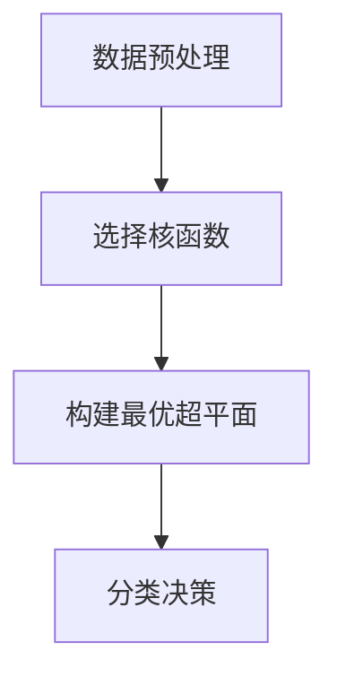
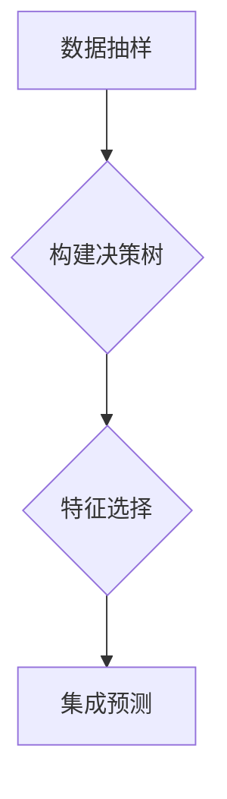
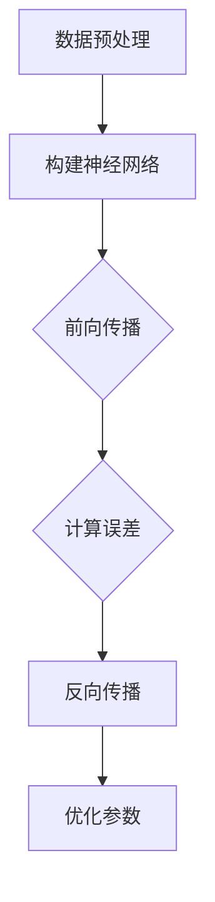
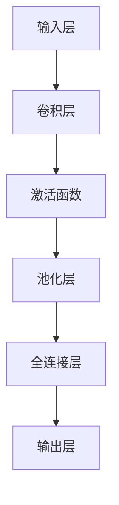
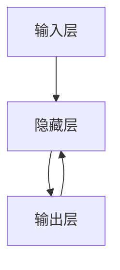
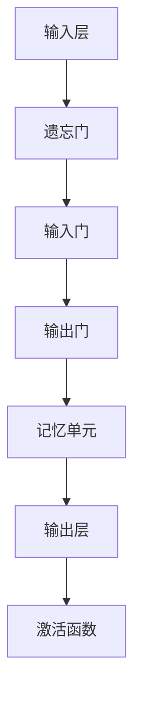
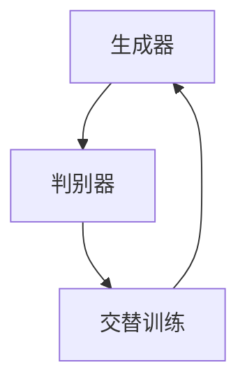
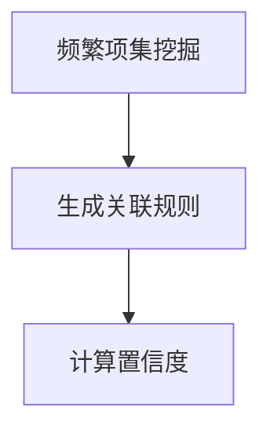
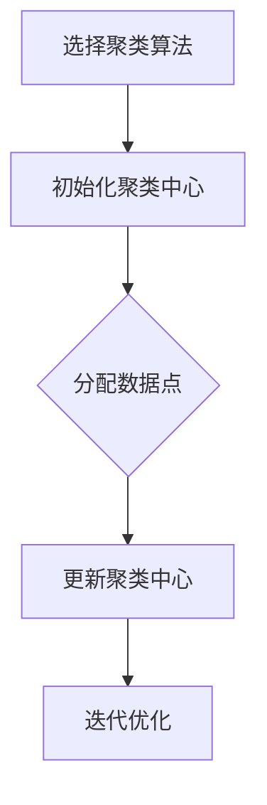
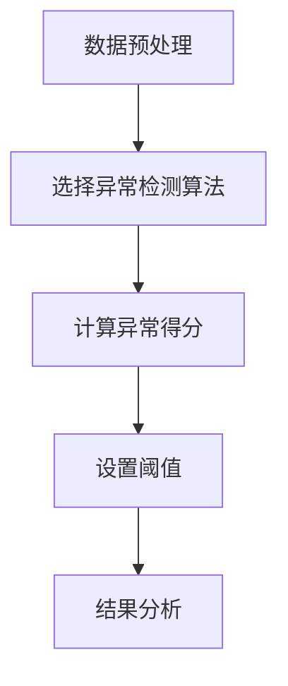

                 

### 1.1. 问题背景

在当今快速变化且高度竞争的商业环境中，企业所面临的问题日益复杂。一方面，海量数据的产生和积累已经成为企业运营的常态，另一方面，商业环境的瞬息万变要求管理层能够迅速做出准确的决策。然而，传统的决策支持系统（DSS）往往难以应对这一挑战，存在以下问题：

1. **数据获取和处理能力有限**：传统的DSS大多依赖于手动收集数据，数据源有限且处理能力不足，难以满足大规模数据分析的需求。
2. **分析深度和广度不足**：传统的DSS多采用简单的统计分析方法，难以深入挖掘数据中的复杂模式，从而提供有价值的决策支持。
3. **决策响应速度慢**：传统DSS在数据处理和分析上往往需要较长时间，无法提供实时或近实时的决策支持。

这些问题导致传统DSS在应对现代商业挑战时显得力不从心。为了解决这些问题，企业迫切需要一种新的决策支持系统，能够充分利用现代信息技术，特别是人工智能（AI）技术，以提供更智能、更高效的决策支持。这种新的决策支持系统，我们称之为AI驱动的战略决策支持系统。

AI驱动的战略决策支持系统通过引入机器学习、深度学习、数据挖掘等AI技术，可以实现以下目标：

- **数据获取和处理自动化**：利用AI技术，自动从各种数据源中获取数据，并高效处理数据，确保数据的准确性和完整性。
- **深入的数据分析和挖掘**：通过机器学习和深度学习算法，挖掘数据中的潜在模式和趋势，提供更深入的见解。
- **实时决策支持**：利用高效的算法和并行计算，实现实时或近实时的数据分析，为管理层提供及时的决策支持。

因此，构建AI驱动的战略决策支持系统，已成为企业提升竞争力、实现智能化转型的关键。

### 1.2. 战略决策支持系统的定义与功能

**战略决策支持系统**（Strategic Decision Support System，简称SDSS）是一种专门设计用来帮助企业管理层进行复杂战略决策的信息系统。它通过整合企业内外部的数据资源，利用先进的信息技术和数据分析方法，提供定量和定性的决策支持，以辅助管理者做出更明智、更高效的决策。

**功能**：

1. **数据采集与处理**：战略决策支持系统首先需要收集和管理企业内外部的各种数据。这包括财务数据、市场数据、客户数据、运营数据等。系统通过自动化工具从不同的数据源（如ERP系统、CRM系统、传感器网络等）中获取数据，并对数据进行清洗、整合和预处理，以确保数据的准确性和一致性。

2. **数据分析与挖掘**：在数据预处理之后，系统利用数据分析技术，如数据挖掘、统计分析、机器学习和深度学习等，对数据进行深入的分析和挖掘。通过这些技术，系统能够发现数据中的潜在模式、趋势和关联，为企业提供基于数据的洞见。

3. **预测与模拟**：基于历史数据和现有业务模型，战略决策支持系统能够进行预测分析。例如，通过时间序列分析预测市场趋势，通过回归分析预测财务指标等。同时，系统还能进行情景模拟，帮助管理层评估不同决策方案的可能结果，从而做出更明智的决策。

4. **决策支持**：系统通过综合分析结果，生成各种决策模型和算法，为管理层提供具体的决策建议。这些决策支持包括但不限于市场进入策略、产品定价策略、供应链管理策略等。

**特点**：

1. **智能化**：战略决策支持系统结合了人工智能技术，能够自动进行数据分析和决策支持，降低了对人工的依赖。

2. **实时性**：系统能够实时或近实时地处理和分析数据，为管理层提供及时的决策支持。

3. **综合性**：系统能够整合多种数据源和多种分析技术，提供全面的数据分析和决策支持。

4. **灵活性**：系统可以根据企业的需求和业务环境的变化，灵活调整和优化数据分析和决策模型。

5. **高度定制化**：系统可以根据不同企业的业务特点和管理需求，定制化开发，确保系统满足企业的特定需求。

### 1.3. 战略决策支持系统的分类

战略决策支持系统可以根据其技术实现方式和功能特点进行分类，以下是几种常见的分类方式：

1. **基于规则的系统（Rule-Based Systems）**：
   - **特点**：这种系统通过预定义的规则来指导决策过程。规则通常由领域专家制定，系统根据输入数据判断并执行相应的规则。
   - **应用**：适合处理结构化数据，如财务报表分析、信用评估等。

2. **基于模型的系统（Model-Based Systems）**：
   - **特点**：这种系统通过构建数学模型或统计模型来模拟业务过程和决策场景。模型通常基于历史数据和业务知识。
   - **应用**：适合处理复杂的业务问题，如市场预测、供应链优化等。

3. **基于知识的系统（Knowledge-Based Systems）**：
   - **特点**：这种系统利用专家知识和推理机制来辅助决策。通常包含知识库和推理机，能够根据输入数据自动推理出决策建议。
   - **应用**：适合处理高度不确定性和复杂性的决策问题，如医疗诊断、法律咨询等。

4. **混合型系统（Hybrid Systems）**：
   - **特点**：这种系统结合了多种决策支持技术，如规则、模型和知识等，以提供更全面的决策支持。
   - **应用**：适用于复杂且多变的决策环境，如战略规划、风险管理等。

### 1.4. AI在战略决策支持系统中的应用前景

人工智能（AI）技术的发展为战略决策支持系统带来了革命性的变革。AI技术具有以下几个显著特点：

1. **大数据处理能力**：AI技术能够高效处理海量数据，包括结构化和非结构化数据，从而提供更全面的决策支持。

2. **自动学习和优化**：通过机器学习和深度学习算法，AI系统能够从数据中自动学习和优化，不断改进决策模型的准确性和效率。

3. **实时分析和预测**：AI技术能够实现实时数据分析，快速提供预测结果，帮助管理层做出即时决策。

4. **个性化决策支持**：基于用户行为和历史数据，AI系统能够提供个性化的决策支持，满足不同管理层和不同业务场景的需求。

AI技术在战略决策支持系统中的应用前景包括：

- **数据挖掘与分析**：利用机器学习和深度学习算法，对海量业务数据进行深入挖掘和分析，发现潜在的商业机会和风险。

- **智能预测与模拟**：通过构建复杂的预测模型和模拟场景，AI系统可以预测市场趋势、客户行为等，帮助管理层做出更科学的决策。

- **自动决策**：AI系统能够根据预设的规则和模型，自动生成决策建议，减少人工干预，提高决策效率。

- **个性化服务**：基于用户历史数据和偏好，AI系统可以提供个性化的决策支持，提升用户体验和满意度。

- **风险管理**：AI技术能够实时监测企业运营数据，发现潜在的风险，并给出预防措施，帮助管理层降低风险。

总之，随着AI技术的不断进步和应用，战略决策支持系统将变得更加智能、高效和个性化，为企业管理层提供强大的决策支持，助力企业实现持续增长和竞争优势。

### 2.1. 人工智能的基本原理

人工智能（Artificial Intelligence，简称AI）是计算机科学的一个分支，旨在使计算机系统具备类似于人类智能的能力。要深入理解AI，我们需要首先探讨其基本原理。

**定义与目标**：
AI的目标是使计算机系统能够执行通常需要人类智能才能完成的任务，如视觉识别、语音识别、自然语言处理、决策制定和问题解决等。AI系统通过模拟人类的思维过程，实现自动化和智能化。

**工作原理**：
AI系统主要通过以下几大技术实现其功能：

1. **数据驱动方法**：这种方法依赖于大量的数据进行学习。AI系统通过从数据中提取模式和关系，学习如何执行特定任务。例如，机器学习（Machine Learning）和深度学习（Deep Learning）都是数据驱动方法的典型代表。

2. **推理与符号逻辑**：这种方法基于逻辑和符号表示，通过逻辑推理来解决问题。例如，专家系统（Expert Systems）使用符号逻辑和领域知识来模拟人类专家的决策过程。

3. **神经网络模拟**：这种方法通过神经网络来模拟人类大脑的工作原理。神经网络由大量相互连接的节点组成，这些节点通过学习调整彼此之间的连接权重，从而实现复杂的任务。

**关键组成部分**：

1. **算法**：算法是AI系统的核心，负责处理数据、学习模式和执行任务。常见的算法包括机器学习算法（如线性回归、支持向量机、随机森林等）和深度学习算法（如卷积神经网络、递归神经网络、生成对抗网络等）。

2. **数据集**：数据集是AI系统训练和评估的重要资源。高质量的数据集能够帮助系统更好地学习，提高模型的准确性和泛化能力。

3. **计算资源**：AI系统通常需要大量的计算资源，包括CPU、GPU和FPGA等，以处理大规模的数据和复杂的算法。

**应用领域**：

1. **自然语言处理（NLP）**：NLP技术使计算机能够理解和生成自然语言。应用领域包括机器翻译、情感分析、语音识别和聊天机器人等。

2. **计算机视觉**：计算机视觉技术使计算机能够理解图像和视频。应用领域包括图像识别、目标检测、自动驾驶和医疗影像分析等。

3. **机器人技术**：机器人技术利用AI系统来控制机器人，实现自动化和智能化操作。应用领域包括工业自动化、服务机器人和医疗机器人等。

4. **推荐系统**：推荐系统通过分析用户行为和偏好，向用户推荐个性化的商品、内容和服务。

5. **游戏与娱乐**：AI在游戏中的应用包括智能游戏AI、虚拟现实（VR）和增强现实（AR）等。

**发展趋势**：

1. **量子计算**：量子计算被认为是未来AI发展的一个重要方向，它能够大幅提升AI系统的计算能力和效率。

2. **多模态学习**：多模态学习使AI系统能够处理多种类型的数据，如文本、图像、声音和传感器数据，从而提供更全面的分析和决策支持。

3. **边缘计算**：边缘计算将AI处理能力从云端转移到边缘设备，实现实时数据处理和响应，提升系统的实时性和效率。

4. **自主系统**：未来的AI系统将更加自主和智能，能够独立执行任务，甚至无需人类干预。

总的来说，人工智能的基本原理涉及对人类智能的模拟和学习，通过算法、数据和计算资源等核心组成部分，实现从数据中提取知识、进行决策和执行任务的能力。随着技术的不断进步，AI在各个领域中的应用将越来越广泛，对人类社会产生深远的影响。

### 2.2. 机器学习与深度学习

机器学习（Machine Learning，ML）和深度学习（Deep Learning，DL）是人工智能（AI）领域的两个核心分支。它们通过不同的机制和方法，使计算机系统能够从数据中学习，提高其自主决策和问题解决能力。在这一部分，我们将深入探讨机器学习和深度学习的基本概念、技术原理、核心算法和应用场景。

#### 2.2.1. 基本概念

**机器学习**：
机器学习是一种使计算机系统能够从数据中学习，从而改进其性能的技术。它主要依赖于统计学、概率论和优化理论。机器学习算法通过分析大量数据，从中发现模式、关联和规律，并利用这些规律对新的数据进行预测或分类。

**深度学习**：
深度学习是机器学习的一个子领域，它使用多层神经网络（Neural Networks）进行学习。深度学习通过模拟人脑神经网络的结构和功能，从数据中自动提取特征，并实现复杂的模式识别和任务处理。与传统的机器学习方法相比，深度学习能够处理更复杂的问题，具有更强的自适应能力。

#### 2.2.2. 技术原理

**机器学习**：

1. **监督学习（Supervised Learning）**：
   在监督学习中，算法通过已标记的数据集学习，即每个输入数据都有对应的输出标签。常见的监督学习算法包括线性回归、逻辑回归、支持向量机（SVM）、决策树和随机森林等。

2. **无监督学习（Unsupervised Learning）**：
   无监督学习使用未标记的数据集，算法的目标是发现数据中的隐含结构和模式。常见的无监督学习算法包括聚类分析（如K-Means、层次聚类等）和关联规则挖掘（如Apriori算法）。

3. **半监督学习（Semi-Supervised Learning）**：
   半监督学习结合了有监督学习和无监督学习的特点，利用少量标记数据和大量未标记数据，提高学习效果。

**深度学习**：

1. **神经网络（Neural Networks）**：
   神经网络是由大量相互连接的节点（或神经元）组成的计算模型，能够模拟人脑的神经网络结构。每个节点接收输入信号，通过激活函数进行非线性变换，并将输出传递到下一个节点。

2. **多层神经网络（Multilayer Neural Networks）**：
   深度学习通过多层神经网络进行学习，每一层都能提取不同层次的特征。多层神经网络使得模型能够处理更复杂的问题。

3. **反向传播算法（Backpropagation Algorithm）**：
   反向传播算法是深度学习训练的核心机制，它通过不断调整网络中的权重和偏置，使网络输出接近期望值。反向传播算法利用梯度下降法来优化网络参数。

4. **激活函数（Activation Functions）**：
   激活函数是神经网络中的一个关键组件，它决定神经元的激活状态。常见的激活函数包括sigmoid、ReLU和Tanh等。

#### 2.2.3. 核心算法

**机器学习核心算法**：

1. **线性回归（Linear Regression）**：
   线性回归是一种简单的监督学习算法，用于预测连续值输出。它通过找到输入特征和输出值之间的线性关系来进行预测。

2. **逻辑回归（Logistic Regression）**：
   逻辑回归是一种用于二分类问题的监督学习算法。它通过构建一个逻辑函数，将输入特征映射到概率值，从而实现分类。

3. **支持向量机（Support Vector Machine，SVM）**：
   支持向量机是一种用于分类和回归问题的强大算法。它通过找到一个最佳的超平面，将不同类别的数据点最大化地分开。

4. **决策树（Decision Tree）**：
   决策树是一种简单且直观的监督学习算法，通过一系列的决策规则来分割数据集，并最终预测输出。

5. **随机森林（Random Forest）**：
   随机森林是一种集成学习方法，通过构建多个决策树，并利用投票机制来提高预测准确性。

**深度学习核心算法**：

1. **卷积神经网络（Convolutional Neural Networks，CNN）**：
   卷积神经网络是一种专门用于图像识别和处理的深度学习算法。它通过卷积操作提取图像中的局部特征，并利用池化操作降低数据维度。

2. **递归神经网络（Recurrent Neural Networks，RNN）**：
   递归神经网络是一种用于序列数据处理的深度学习算法。它通过循环结构保存历史信息，使模型能够处理长序列数据。

3. **长短时记忆网络（Long Short-Term Memory，LSTM）**：
   长短时记忆网络是RNN的一种变体，专门用于解决长序列数据中的梯度消失和梯度爆炸问题。

4. **生成对抗网络（Generative Adversarial Networks，GAN）**：
   生成对抗网络是一种用于生成数据的深度学习算法。它由生成器和判别器两个神经网络组成，通过对抗训练生成逼真的数据。

#### 2.2.4. 应用场景

**机器学习应用场景**：

1. **分类**：
   - 邮件过滤
   - 信用评分
   - 恶意软件检测

2. **回归**：
   - 房价预测
   - 汽车销售预测
   - 股票市场分析

3. **聚类**：
   - 社区发现
   - 市场细分
   - 顾客行为分析

4. **异常检测**：
   - 信用卡欺诈检测
   - 网络入侵检测
   - 工业设备故障预测

**深度学习应用场景**：

1. **计算机视觉**：
   - 图像分类
   - 目标检测
   - 图像生成

2. **自然语言处理**：
   - 机器翻译
   - 情感分析
   - 文本生成

3. **语音识别**：
   - 语音转文本
   - 语音合成
   - 声音情感识别

4. **机器人技术**：
   - 自动驾驶
   - 机器臂控制
   - 服务机器人

5. **医疗诊断**：
   - 疾病诊断
   - 药物发现
   - 医学影像分析

随着技术的不断进步，机器学习和深度学习在各个领域的应用将越来越广泛，为人类带来前所未有的智能体验和生产力提升。

### 2.3. 数据挖掘与大数据分析

数据挖掘（Data Mining）与大数据分析（Big Data Analysis）是人工智能（AI）领域的重要分支，它们通过复杂算法和统计方法从大量数据中提取有价值的信息，为企业和组织提供洞见和决策支持。在这部分，我们将深入探讨数据挖掘与大数据分析的基本概念、核心技术和应用场景。

#### 2.3.1. 基本概念

**数据挖掘**：
数据挖掘是指从大量数据中自动发现有趣模式、趋势和关联性的过程。它涉及多个学科，包括统计学、机器学习、数据库管理和信息可视化等。数据挖掘的目标是从数据中发现隐藏的知识，从而支持决策制定、市场预测和风险管理等。

**大数据分析**：
大数据分析是指利用先进的数据处理技术，对海量、复杂、快速变化的数据进行高效分析和处理的过程。大数据分析的核心在于如何处理和存储大规模数据集，并从中提取有价值的信息。大数据分析通常涉及分布式计算、云计算和数据库技术等。

#### 2.3.2. 核心技术

**关联规则挖掘（Association Rule Learning）**：
关联规则挖掘是一种用于发现数据集中项之间关联性的方法。它通过挖掘频繁项集，生成关联规则，如“购买A商品的用户中80%也会购买B商品”。常见的关联规则挖掘算法包括Apriori算法和FP-growth算法。

**聚类分析（Clustering）**：
聚类分析是将数据集划分为若干个类别（或簇），使得同一类别内的数据点相似度较高，不同类别之间的数据点相似度较低。常用的聚类算法包括K-Means、层次聚类和DBSCAN等。

**异常检测（Anomaly Detection）**：
异常检测是指识别数据集中的异常或异常模式。这些异常可能表示数据错误、异常行为或潜在问题。常见的异常检测方法包括基于统计的方法、基于距离的方法和基于聚类的方法等。

**分类与回归分析（Classification and Regression Analysis）**：
分类和回归分析是数据挖掘中的核心技术。分类分析用于将数据分为不同的类别，如信用评分、垃圾邮件过滤等。回归分析用于预测连续值输出，如房价预测、股票市场分析等。

**深度学习与神经网络（Deep Learning and Neural Networks）**：
深度学习和神经网络是大数据分析的重要技术。它们通过多层神经网络结构，自动提取数据中的复杂特征，实现高精度的预测和分类。常见的深度学习算法包括卷积神经网络（CNN）、递归神经网络（RNN）和生成对抗网络（GAN）等。

#### 2.3.3. 应用场景

**数据挖掘应用场景**：

1. **商业智能**：
   - 市场趋势预测
   - 客户行为分析
   - 产品推荐系统

2. **金融领域**：
   - 信用风险评估
   - 交易异常检测
   - 投资组合优化

3. **医疗健康**：
   - 疾病预测和诊断
   - 医疗影像分析
   - 药物研发

4. **智能制造**：
   - 质量控制
   - 设备维护
   - 生产优化

**大数据分析应用场景**：

1. **互联网与电子商务**：
   - 用户行为分析
   - 广告推荐
   - 个性化服务

2. **智慧城市**：
   - 城市规划
   - 城市安全
   - 智慧交通

3. **公共安全**：
   - 恐怖主义预警
   - 网络安全
   - 应急响应

4. **环境监测**：
   - 气象预测
   - 水质监测
   - 土地利用

总之，数据挖掘与大数据分析技术为企业和组织提供了强大的工具，帮助它们从海量数据中提取有价值的信息，实现数据驱动的决策制定和业务优化。随着技术的不断进步，这些应用场景将变得更加广泛和深入。

### 2.4. AI算法与模型

在构建AI驱动的战略决策支持系统时，算法和模型的选择至关重要。它们直接影响系统的性能、准确性和实用性。本节将详细介绍几种常见的AI算法和模型，包括支持向量机（SVM）、随机森林（Random Forest）和神经网络（Neural Networks），并分析它们在战略决策支持系统中的应用。

#### 2.4.1. 支持向量机（SVM）

**定义与原理**：
支持向量机（Support Vector Machine，SVM）是一种常用的二分类算法，由Vapnik和Chervonenkis在20世纪60年代提出。SVM的核心思想是找到最佳的超平面，将不同类别的数据点尽可能分开。SVM通过最大化分类间隔（即类内最小距离）来实现这一目标。

**关键参数**：
- **核函数（Kernel Function）**：核函数是SVM中的一个重要概念，它将低维空间的数据映射到高维空间，从而解决线性不可分问题。常见的核函数包括线性核、多项式核和径向基函数（RBF）核等。
- **C值（Regularization Parameter）**：C值控制了模型的复杂性和泛化能力。C值越大，模型对训练数据的拟合越好，但可能过拟合。

**应用场景**：
SVM在分类问题中具有广泛的应用，特别适合处理高维数据和线性不可分问题。在战略决策支持系统中，SVM可用于市场细分、客户流失预测和风险分析等。

#### 2.4.2. 随机森林（Random Forest）

**定义与原理**：
随机森林（Random Forest）是一种集成学习方法，由Breiman在20世纪90年代提出。随机森林通过构建多个决策树，并结合它们的预测结果来提高模型的准确性和稳定性。随机森林的核心思想是通过随机重采样数据和随机特征选择，降低模型的过拟合风险。

**关键参数**：
- **树的数量（Number of Trees）**：树的数量越多，模型的复杂度越高，但计算成本也越大。
- **特征选择方法（Feature Selection Method）**：随机森林在构建每棵树时，会从所有特征中随机选择一部分特征进行分割。常见的方法包括随机分割和随机属性选择。

**应用场景**：
随机森林在分类和回归问题中都有广泛应用。在战略决策支持系统中，随机森林可用于市场预测、客户细分和风险评估等。

#### 2.4.3. 神经网络（Neural Networks）

**定义与原理**：
神经网络（Neural Networks）是一种模仿人脑神经元结构的计算模型，由大量相互连接的节点（或神经元）组成。神经网络通过前向传播和反向传播算法，不断调整网络中的权重和偏置，实现复杂的函数映射和任务处理。

**关键参数**：
- **层数（Number of Layers）**：神经网络由输入层、隐藏层和输出层组成。层数越多，模型的表示能力越强，但训练难度和计算成本也越高。
- **神经元数量（Number of Neurons）**：每个隐藏层的神经元数量会影响模型的复杂度和拟合能力。
- **激活函数（Activation Function）**：激活函数是神经网络中的一个关键组件，用于引入非线性变换，提高模型的分类和预测能力。

**应用场景**：
神经网络在图像识别、自然语言处理和预测分析等领域有广泛应用。在战略决策支持系统中，神经网络可用于市场趋势预测、客户行为分析和产品推荐等。

**比较与选择**：

| 算法 | 优点 | 缺点 | 适用场景 |
| --- | --- | --- | --- |
| 支持向量机 | 精度高，适用于高维数据 | 计算复杂度高，对噪声敏感 | 分类问题，特别是高维数据分类 |
| 随机森林 | 稳定性好，泛化能力强 | 计算成本高，难以解释 | 分类和回归问题，特别是需要模型解释性时 |
| 神经网络 | 表示能力强，自适应性好 | 过拟合风险高，训练时间长 | 需要高精度预测和复杂模式识别的任务 |

在选择AI算法和模型时，需要综合考虑数据特点、任务需求和计算资源等因素。通过合理选择和组合不同的算法和模型，可以构建高效的AI驱动的战略决策支持系统，为企业管理层提供强大的决策支持。

### 2.5. AI驱动的战略决策支持系统要素组成

构建一个高效的AI驱动的战略决策支持系统（SDSS）需要多个关键要素的协同工作。以下是该系统的主要组成部分及其功能和相互关系：

#### 数据采集模块

**功能**：
数据采集模块负责从企业内外部多种数据源收集数据。这些数据源可能包括企业内部的ERP系统、CRM系统、数据库等，以及外部数据源如市场报告、社交媒体、公共数据库等。

**作用**：
- 为系统提供丰富的数据资源，确保决策信息的全面性和准确性。
- 通过自动化工具实现数据收集，提高数据采集的效率。

#### 数据预处理模块

**功能**：
数据预处理模块对收集到的数据进行清洗、整合和标准化，以确保数据的质量和一致性。

**作用**：
- 清除数据中的噪声和异常值，提高数据的准确性和可靠性。
- 通过标准化和整合，将异构数据转换为统一的格式，便于后续处理。

#### 数据存储模块

**功能**：
数据存储模块负责存储和管理系统所需的数据。这通常涉及分布式数据库和数据仓库技术。

**作用**：
- 提供高效的数据存储和管理方案，确保数据的安全性和可扩展性。
- 通过数据仓库，实现数据的集中存储和查询，便于快速访问和分析。

#### 算法与模型模块

**功能**：
算法与模型模块包含各种AI算法和模型，如机器学习算法、深度学习模型、数据挖掘算法等。这些算法和模型用于对数据进行处理、分析和预测。

**作用**：
- 通过AI算法和模型，从数据中提取有价值的信息和洞见。
- 实现自动化的决策支持和预测分析，提高决策的准确性和效率。

#### 用户界面模块

**功能**：
用户界面模块为管理层提供友好的交互界面，展示分析结果、决策建议和预测报告。

**作用**：
- 简化用户操作，提升系统的易用性。
- 通过可视化工具，直观地展示分析结果和决策建议。

#### 交互与反馈模块

**功能**：
交互与反馈模块负责收集用户对系统提供决策支持的反馈，用于系统优化和改进。

**作用**：
- 通过用户反馈，不断优化和改进系统，提高系统的适应性和用户满意度。
- 实现系统的自我学习和持续改进。

#### 安全与隐私保护模块

**功能**：
安全与隐私保护模块确保系统数据的安全和隐私，防范数据泄露和未授权访问。

**作用**：
- 通过安全措施和隐私保护机制，确保系统数据的安全性和合规性。
- 增强用户对系统的信任，提高系统的可靠性和可用性。

#### 综合协作

这些模块相互协作，共同构建一个高效的AI驱动的战略决策支持系统。例如：

- 数据采集模块和数据处理模块协同工作，确保数据的及时获取和处理。
- 数据存储模块和算法与模型模块紧密配合，实现数据的高效存储和快速访问。
- 用户界面模块和交互与反馈模块相结合，提供直观的用户体验和持续的系统优化。
- 安全与隐私保护模块为整个系统提供可靠的安全保障，确保数据的安全性和合规性。

通过这些关键要素的有机结合，AI驱动的战略决策支持系统能够为企业管理层提供全面、准确和实时的决策支持，助力企业实现智能化和数字化转型。

### 3.1. 经典AI算法

在AI驱动的战略决策支持系统中，经典AI算法扮演着至关重要的角色。这些算法通过不同的机制和原理，为系统提供强大的数据处理和分析能力。以下将详细介绍几种经典的AI算法，包括支持向量机（SVM）、随机森林（Random Forest）和神经网络（Neural Networks），并使用mermaid流程图展示其基本原理。

#### 3.1.1. 支持向量机（SVM）

**基本原理**：
支持向量机是一种二分类算法，旨在找到最佳的超平面，将不同类别的数据点尽可能分开。SVM的核心思想是最小化分类间隔，最大化决策边界。

**算法步骤**：

1. **数据预处理**：标准化输入特征，确保特征具有相同的尺度。
2. **选择核函数**：选择合适的核函数，如线性核、多项式核或径向基函数（RBF）核。
3. **构建最优超平面**：通过求解最优化问题，找到最佳的超平面，使分类间隔最大化。
4. **分类决策**：对于新的数据点，计算其到超平面的距离，根据距离判断其类别。

**mermaid流程图**：



#### 3.1.2. 随机森林（Random Forest）

**基本原理**：
随机森林是一种集成学习方法，通过构建多棵决策树，并结合它们的预测结果来提高模型的稳定性和准确性。随机森林的核心思想是随机重采样数据和随机特征选择，降低模型的过拟合风险。

**算法步骤**：

1. **数据抽样**：从原始数据中随机抽取多个子数据集。
2. **构建决策树**：对于每个子数据集，构建一棵决策树。
3. **特征选择**：在每个决策树的每个节点上，随机选择一部分特征进行分割。
4. **集成预测**：将所有决策树的预测结果进行投票或平均，得到最终的预测结果。

**mermaid流程图**：



#### 3.1.3. 神经网络（Neural Networks）

**基本原理**：
神经网络是一种模拟人脑神经元结构的计算模型，通过多层节点相互连接和激活函数，实现复杂的函数映射和任务处理。神经网络的核心思想是通过反向传播算法，不断调整网络中的权重和偏置，使输出接近期望值。

**算法步骤**：

1. **数据预处理**：标准化输入特征，确保特征具有相同的尺度。
2. **构建神经网络结构**：定义输入层、隐藏层和输出层，以及每层的神经元数量。
3. **前向传播**：将输入数据通过神经网络，计算每一层的输出值。
4. **计算误差**：计算输出值与实际值之间的误差。
5. **反向传播**：通过反向传播算法，将误差反向传播到各层，调整权重和偏置。
6. **优化参数**：通过优化算法（如梯度下降），最小化误差函数，使网络输出更接近期望值。

**mermaid流程图**：



#### 案例说明

**案例背景**：
假设我们有一个客户流失预测项目，目标是预测哪些客户可能在未来一个月内流失。

**数据集**：
我们有一个包含客户特征（如年龄、收入、消费频率等）和标签（流失/未流失）的数据集。

**算法选择**：
我们选择支持向量机（SVM）和随机森林（Random Forest）作为主要算法。

**数据预处理**：
1. 标准化输入特征，确保特征具有相同的尺度。
2. 划分训练集和测试集。

**模型构建与训练**：
1. 使用SVM和随机森林算法分别训练模型。
2. 调整参数，如C值和树的数量，以优化模型性能。

**模型评估**：
1. 使用交叉验证和测试集评估模型性能。
2. 比较SVM和随机森林的准确率、召回率等指标。

**结论**：
通过上述步骤，我们能够构建一个高效、准确的客户流失预测模型，为企业管理层提供决策支持。

总之，经典AI算法在战略决策支持系统中发挥着重要作用。通过mermaid流程图和具体案例，我们可以更清晰地理解这些算法的基本原理和应用方法。

#### 3.2. 深度学习算法

深度学习算法是近年来在人工智能领域取得显著进展的技术。它们通过多层神经网络结构，自动提取数据中的复杂特征，实现高精度的预测和分类。本节将详细介绍几种重要的深度学习算法，包括卷积神经网络（CNN）、递归神经网络（RNN）和生成对抗网络（GAN），并使用mermaid流程图展示其基本原理。

##### 3.2.1. 卷积神经网络（CNN）

**基本原理**：
卷积神经网络（Convolutional Neural Networks，CNN）是一种专门用于图像识别和处理的深度学习算法。它的核心思想是通过卷积操作提取图像中的局部特征，并利用池化操作降低数据维度。

**算法步骤**：

1. **输入层**：接收图像数据，并将其传递到卷积层。
2. **卷积层**：通过卷积核在输入数据上滑动，提取局部特征。卷积层可以包含多个卷积核，以提取不同类型的特征。
3. **激活函数**：使用激活函数（如ReLU）引入非线性变换。
4. **池化层**：通过池化操作（如最大池化或平均池化）降低数据维度，提高模型的泛化能力。
5. **全连接层**：将卷积层输出的特征映射到分类结果，通过全连接层实现分类或回归任务。
6. **输出层**：输出预测结果。

**mermaid流程图**：



**应用场景**：
CNN在计算机视觉领域具有广泛的应用，如图像分类、目标检测、图像分割和物体识别等。

##### 3.2.2. 递归神经网络（RNN）

**基本原理**：
递归神经网络（Recurrent Neural Networks，RNN）是一种用于处理序列数据的深度学习算法。它通过循环结构保存历史信息，使模型能够处理长序列数据。

**算法步骤**：

1. **输入层**：接收序列数据，并将其传递到隐藏层。
2. **隐藏层**：通过递归连接，将当前时刻的输入与历史信息进行整合，并更新隐藏状态。
3. **激活函数**：使用激活函数（如ReLU）引入非线性变换。
4. **输出层**：将隐藏层状态映射到序列的当前时刻输出。

**mermaid流程图**：



**应用场景**：
RNN在自然语言处理和语音识别等领域有广泛应用，如语言模型、机器翻译和语音合成等。

##### 3.2.3. 长短时记忆网络（LSTM）

**基本原理**：
长短时记忆网络（Long Short-Term Memory，LSTM）是RNN的一种变体，专门用于解决长序列数据中的梯度消失和梯度爆炸问题。LSTM通过引入记忆单元和门控机制，能够在序列中保持长期依赖关系。

**算法步骤**：

1. **输入层**：接收序列数据，并将其传递到隐藏层。
2. **门控单元**：包括遗忘门、输入门和输出门，用于控制信息的流入和流出。
3. **记忆单元**：保存长期依赖信息。
4. **激活函数**：使用激活函数（如ReLU）引入非线性变换。
5. **输出层**：将隐藏层状态映射到序列的当前时刻输出。

**mermaid流程图**：



**应用场景**：
LSTM在时间序列预测、自然语言处理和语音识别等领域有广泛应用。

##### 3.2.4. 生成对抗网络（GAN）

**基本原理**：
生成对抗网络（Generative Adversarial Networks，GAN）是一种通过对抗训练生成数据的深度学习算法。它由生成器和判别器两个神经网络组成，生成器生成数据，判别器判断数据的真实性。

**算法步骤**：

1. **初始化**：随机初始化生成器和判别器。
2. **生成器训练**：生成器尝试生成逼真的数据，判别器判断生成数据的真实性。
3. **判别器训练**：判别器不断学习，提高对真实数据和生成数据的辨别能力。
4. **交替训练**：生成器和判别器交替训练，生成器逐渐提高生成数据的质量。

**mermaid流程图**：



**应用场景**：
GAN在图像生成、数据增强和图像修复等领域有广泛应用。

总之，深度学习算法通过复杂的神经网络结构和高效的训练方法，实现了从数据中自动提取特征和生成数据的能力。这些算法在计算机视觉、自然语言处理和生成对抗等领域具有广泛的应用，为AI驱动的战略决策支持系统提供了强大的技术支持。

### 3.3. 数据挖掘与大数据分析

数据挖掘与大数据分析是AI驱动的战略决策支持系统中不可或缺的一部分。它们通过复杂算法和统计方法，从海量数据中提取有价值的信息，帮助企业做出更明智的决策。以下将详细介绍三种常见的数据挖掘技术：关联规则挖掘、聚类分析和异常检测，并使用mermaid流程图展示其基本原理。

#### 3.3.1. 关联规则挖掘

**基本原理**：
关联规则挖掘是一种用于发现数据集中项之间关联性的方法。它通过挖掘频繁项集，生成关联规则，如“购买A商品的用户中80%也会购买B商品”。

**算法步骤**：

1. **频繁项集挖掘**：通过遍历数据集，找出支持度大于最小支持度的项集。
2. **生成关联规则**：从频繁项集中生成关联规则，并计算其置信度（即规则前件的支持度除以后件的支持度）。

**mermaid流程图**：



**应用场景**：
关联规则挖掘在市场分析、推荐系统和客户行为分析等领域有广泛应用。

#### 3.3.2. 聚类分析

**基本原理**：
聚类分析是一种无监督学习方法，用于将数据集划分为若干个类别（或簇），使得同一类别内的数据点相似度较高，不同类别之间的数据点相似度较低。

**算法步骤**：

1. **选择聚类算法**：如K-Means、层次聚类和DBSCAN等。
2. **初始化聚类中心**：随机选择或通过算法初始化聚类中心。
3. **分配数据点**：将数据点分配到最近的聚类中心。
4. **更新聚类中心**：计算每个聚类中心的平均值。
5. **迭代优化**：重复步骤3-4，直到聚类中心不再变化或达到最大迭代次数。

**mermaid流程图**：



**应用场景**：
聚类分析在市场细分、客户行为分析和图像识别等领域有广泛应用。

#### 3.3.3. 异常检测

**基本原理**：
异常检测是一种用于识别数据集中异常或异常模式的方法。它通过分析数据分布和特征，发现不符合常规的数据点。

**算法步骤**：

1. **数据预处理**：标准化输入特征，确保特征具有相同的尺度。
2. **选择异常检测算法**：如基于统计的方法、基于距离的方法和基于聚类的方法等。
3. **计算异常得分**：根据算法计算每个数据点的异常得分。
4. **设置阈值**：根据异常得分设置阈值，确定哪些数据点为异常。
5. **结果分析**：分析异常数据点，识别潜在的问题和风险。

**mermaid流程图**：



**应用场景**：
异常检测在信用卡欺诈检测、网络安全和工业设备故障预测等领域有广泛应用。

总之，数据挖掘与大数据分析技术为AI驱动的战略决策支持系统提供了强大的工具，帮助企业从海量数据中提取有价值的信息，提高决策的准确性和效率。

### 4.1. 战略决策支持系统架构设计

构建一个高效、稳定和可扩展的战略决策支持系统（SDSS）需要精心设计的系统架构。系统架构设计不仅影响系统的性能和可靠性，还决定系统的可维护性和扩展性。以下将从系统架构概述、数据处理与存储架构、算法模块设计、用户交互界面设计以及系统性能优化与安全保障五个方面详细介绍战略决策支持系统的架构设计。

#### 4.1.1. 系统架构概述

战略决策支持系统通常采用分布式架构，以实现高可用性、高性能和可扩展性。系统架构主要包括以下模块：

1. **数据采集模块**：负责从各种数据源（如ERP系统、CRM系统、传感器网络等）收集数据。
2. **数据处理模块**：对采集到的数据进行清洗、整合和预处理，确保数据的质量和一致性。
3. **数据存储模块**：负责存储和管理系统所需的数据，通常采用分布式数据库和数据仓库技术。
4. **算法模块**：包含各种AI算法和模型，如机器学习算法、深度学习模型和数据挖掘算法等，用于对数据进行处理、分析和预测。
5. **用户交互界面模块**：提供友好的用户界面，展示分析结果、决策建议和预测报告。
6. **交互与反馈模块**：收集用户对系统提供决策支持的反馈，用于系统优化和改进。
7. **安全保障模块**：确保系统数据的安全和隐私，防范数据泄露和未授权访问。

这些模块相互协作，共同构建一个高效的决策支持系统。数据采集模块和数据处理模块协同工作，确保数据的及时获取和处理；数据存储模块和算法模块紧密配合，实现数据的高效存储和快速访问；用户交互界面模块和交互与反馈模块相结合，提供直观的用户体验和持续的系统优化。

#### 4.1.2. 数据处理与存储架构

数据处理与存储架构是战略决策支持系统的核心部分，其设计直接影响系统的性能和扩展性。以下详细描述数据处理与存储架构的设计方案：

1. **数据采集**：
   - **数据源**：系统从各种数据源（如ERP系统、CRM系统、传感器网络等）收集数据。数据源可以是实时流数据或批量数据。
   - **数据采集工具**：使用ETL（提取、转换、加载）工具从数据源中提取数据，并进行初步的清洗和整合。

2. **数据处理**：
   - **数据清洗**：通过数据清洗工具和算法，清除数据中的噪声、异常值和重复数据，提高数据质量。
   - **数据整合**：将来自不同数据源的数据进行整合，确保数据的统一性和一致性。
   - **数据预处理**：对数据进行标准化和特征提取，为后续的算法处理做准备。

3. **数据存储**：
   - **分布式数据库**：采用分布式数据库技术（如Hadoop、MongoDB、Cassandra等），实现海量数据的高效存储和管理。
   - **数据仓库**：构建数据仓库，存储经过处理和整合的标准化数据，以便快速查询和分析。
   - **数据湖**：数据湖是一个大规模数据存储系统，用于存储原始数据、半结构化和非结构化数据，便于后续的数据挖掘和分析。

4. **数据处理流程**：
   - **批量处理**：对于大批量的数据，采用批处理流程，通过调度系统定期执行数据处理任务。
   - **实时处理**：对于需要实时处理的数据，采用流处理技术（如Apache Kafka、Apache Flink等），实现实时数据的处理和分析。

#### 4.1.3. 算法模块设计

算法模块是战略决策支持系统的核心，负责数据的处理和分析。以下详细描述算法模块的设计方案：

1. **算法选择**：
   - **机器学习算法**：如线性回归、决策树、支持向量机等，用于处理分类和回归问题。
   - **深度学习算法**：如卷积神经网络（CNN）、递归神经网络（RNN）、生成对抗网络（GAN）等，用于处理复杂的图像、语音和自然语言处理任务。
   - **数据挖掘算法**：如关联规则挖掘、聚类分析、异常检测等，用于发现数据中的潜在模式和异常。

2. **算法实现**：
   - **算法库**：使用成熟的机器学习和深度学习算法库（如scikit-learn、TensorFlow、PyTorch等），实现算法的高效实现。
   - **自定义算法**：根据具体业务需求，开发自定义的算法和模型，以满足特定的分析需求。

3. **算法优化**：
   - **模型调参**：通过调整算法的参数，优化模型的性能和泛化能力。
   - **模型融合**：将多个算法和模型的结果进行融合，提高预测的准确性和稳定性。

4. **算法部署**：
   - **容器化**：使用Docker等容器技术，将算法和模型容器化，实现算法的快速部署和升级。
   - **微服务架构**：采用微服务架构，将算法模块拆分为多个独立的微服务，实现模块的解耦和灵活部署。

#### 4.1.4. 用户交互界面设计

用户交互界面设计是战略决策支持系统的重要组成部分，直接影响用户的使用体验和系统满意度。以下详细描述用户交互界面设计方案：

1. **界面设计原则**：
   - **简洁性**：界面设计应简洁明了，避免复杂的布局和过多的信息展示。
   - **易用性**：界面设计应易于操作，提供直观的导航和操作指导。
   - **可视化**：使用图表、图形和地图等可视化工具，展示分析结果和决策建议。

2. **界面功能**：
   - **数据可视化**：提供数据展示模块，通过图表、图形和地图等形式，直观展示分析结果。
   - **交互式分析**：提供交互式分析工具，允许用户自定义分析条件和参数，生成个性化的分析报告。
   - **报告生成**：提供报告生成模块，将分析结果和决策建议生成详细的报告，供管理层决策参考。

3. **界面实现**：
   - **前端技术**：使用HTML、CSS和JavaScript等前端技术，实现用户交互界面的动态效果和交互功能。
   - **可视化库**：使用D3.js、ECharts、Plotly等可视化库，实现数据的高效可视化。

#### 4.1.5. 系统性能优化与安全保障

系统性能优化与安全保障是战略决策支持系统成功运行的关键。以下详细描述系统性能优化与安全保障方案：

1. **性能优化**：
   - **负载均衡**：使用负载均衡技术，将系统请求均衡分配到多个服务器上，提高系统的处理能力和响应速度。
   - **缓存机制**：使用缓存技术（如Redis、Memcached等），减少数据库的访问次数，提高系统的响应速度。
   - **数据压缩**：使用数据压缩技术，减少数据的传输量和存储空间，提高系统的性能和存储效率。

2. **安全保障**：
   - **身份认证**：使用身份认证技术（如OAuth、LDAP等），确保系统的访问权限和安全。
   - **数据加密**：使用数据加密技术（如SSL/TLS、AES等），保护系统数据的安全和隐私。
   - **访问控制**：使用访问控制技术（如角色权限管理、防火墙等），防止未授权的访问和攻击。

3. **安全审计**：
   - **日志记录**：记录系统的操作日志，便于监控和审计系统的安全状态。
   - **异常监测**：使用异常监测技术，及时发现和应对系统异常和攻击。
   - **安全培训**：定期进行安全培训，提高用户的安全意识和防范能力。

通过上述系统架构设计，我们可以构建一个高效、稳定和可扩展的战略决策支持系统，为企业管理层提供强大的决策支持。

### 4.2. 算法原理讲解与实践应用

在战略决策支持系统中，算法是核心组件，它决定了系统的性能和准确性。在这一节中，我们将深入讲解几个关键的算法原理，并通过Python代码示例进行实践应用。这些算法包括支持向量机（SVM）、随机森林（Random Forest）和神经网络（Neural Networks）。

#### 4.2.1. 数据预处理

在应用任何算法之前，数据预处理是非常重要的一步。数据预处理包括数据清洗、数据归一化和特征提取。

**数据清洗**：
```python
import pandas as pd

# 加载数据集
data = pd.read_csv('data.csv')

# 清洗数据，如删除缺失值或填充缺失值
data.dropna(inplace=True)
```

**数据归一化**：
```python
from sklearn.preprocessing import StandardScaler

# 创建标准化器
scaler = StandardScaler()

# 对特征进行归一化
X = scaler.fit_transform(data.iloc[:, :-1])
y = data.iloc[:, -1]
```

**特征提取**：
```python
from sklearn.feature_selection import SelectKBest
from sklearn.feature_selection import f_classif

# 创建特征选择器
selector = SelectKBest(f_classif, k=5)

# 选择前k个最佳特征
X = selector.fit_transform(X, y)
```

#### 4.2.2. 支持向量机（SVM）

支持向量机是一种二分类算法，通过找到一个最佳的超平面，将不同类别的数据点尽可能分开。

**SVM原理**：
SVM通过求解最优化问题，找到最佳的超平面，使得分类间隔最大化。SVM可以使用不同的核函数，如线性核、多项式核和RBF核。

**Python代码示例**：
```python
from sklearn.svm import SVC
from sklearn.model_selection import train_test_split

# 划分训练集和测试集
X_train, X_test, y_train, y_test = train_test_split(X, y, test_size=0.2, random_state=42)

# 创建SVM模型并训练
svm_model = SVC(kernel='linear')
svm_model.fit(X_train, y_train)

# 进行预测
predictions = svm_model.predict(X_test)

# 评估模型性能
from sklearn.metrics import accuracy_score
print("Accuracy:", accuracy_score(y_test, predictions))
```

#### 4.2.3. 随机森林（Random Forest）

随机森林是一种集成学习方法，通过构建多棵决策树，并结合它们的预测结果来提高模型的稳定性和准确性。

**随机森林原理**：
随机森林通过随机重采样数据和随机特征选择，构建多棵决策树，并利用多数投票机制得到最终预测结果。

**Python代码示例**：
```python
from sklearn.ensemble import RandomForestClassifier

# 创建随机森林模型并训练
rf_model = RandomForestClassifier(n_estimators=100, random_state=42)
rf_model.fit(X_train, y_train)

# 进行预测
predictions = rf_model.predict(X_test)

# 评估模型性能
print("Accuracy:", accuracy_score(y_test, predictions))
```

#### 4.2.4. 神经网络（Neural Networks）

神经网络是一种模拟人脑神经元结构的计算模型，通过多层神经网络结构，自动提取数据中的复杂特征。

**神经网络原理**：
神经网络通过前向传播和反向传播算法，不断调整网络中的权重和偏置，使输出接近期望值。

**Python代码示例**：
```python
import tensorflow as tf
from tensorflow.keras.models import Sequential
from tensorflow.keras.layers import Dense, Activation

# 创建神经网络模型
model = Sequential()
model.add(Dense(64, input_dim=X_train.shape[1], activation='relu'))
model.add(Dense(32, activation='relu'))
model.add(Dense(1, activation='sigmoid'))

# 编译模型
model.compile(optimizer='adam', loss='binary_crossentropy', metrics=['accuracy'])

# 训练模型
model.fit(X_train, y_train, epochs=10, batch_size=32, validation_data=(X_test, y_test))

# 进行预测
predictions = model.predict(X_test)

# 评估模型性能
print("Accuracy:", model.evaluate(X_test, y_test)[1])
```

通过上述代码示例，我们可以看到如何使用Python实现和支持向量机、随机森林和神经网络这些算法。在实际应用中，根据具体业务需求和数据特点，我们可以选择合适的算法并进行优化，以提高系统的性能和准确性。

### 4.3. 深度学习算法应用

深度学习算法在战略决策支持系统中具有广泛的应用，特别是在处理复杂、高维数据和图像、文本等非结构化数据时，表现出强大的能力。以下将详细介绍卷积神经网络（CNN）、递归神经网络（RNN）和生成对抗网络（GAN）的原理和具体应用。

#### 4.3.1. 卷积神经网络（CNN）

**原理**：
卷积神经网络（Convolutional Neural Networks，CNN）是一种专门用于图像识别和处理的深度学习算法。CNN通过卷积层、池化层和全连接层等结构，自动提取图像中的局部特征，实现图像分类、目标检测和图像分割等任务。

**应用**：

1. **图像分类**：
   CNN可以用于对图像进行分类，如识别图片中的物体类别。例如，使用经典的AlexNet模型，我们可以对图像库中的图片进行分类。
   
   ```python
   from tensorflow.keras.applications import AlexNet
   from tensorflow.keras.preprocessing.image import ImageDataGenerator

   # 加载预训练的AlexNet模型
   model = AlexNet(weights='imagenet')

   # 预处理图像数据
   datagen = ImageDataGenerator(rescale=1./255)
   data = datagen.flow_from_directory(
       'data_directory',
       target_size=(227, 227),
       batch_size=32,
       class_mode='categorical')

   # 进行预测
   predictions = model.predict(data)
   ```

2. **目标检测**：
   CNN可以用于目标检测，如识别图像中的多个物体。常用的目标检测模型包括Faster R-CNN、YOLO和SSD等。
   
   ```python
   import tensorflow as tf
   import tensorflow_hub as hub

   # 加载预训练的目标检测模型
   model = hub.load('https://tfhub.dev/google/objects_2d/1')

   # 预处理图像数据
   image = tf.keras.preprocessing.image.load_img('data_image.jpg', target_size=(640, 640))
   input_tensor = tf.keras.preprocessing.image.img_to_array(image)
   input_tensor = tf.expand_dims(input_tensor, 0)

   # 进行目标检测
   detections = model.detect(input_tensor)
   ```

3. **图像分割**：
   CNN可以用于图像分割，将图像中的物体分割出来。常用的图像分割模型包括FCN、U-Net和SegNet等。
   
   ```python
   from tensorflow.keras.models import Model
   from tensorflow.keras.layers import Conv2D, MaxPooling2D, UpSampling2D

   # 创建U-Net模型
   inputs = tf.keras.layers.Input((256, 256, 3))
   conv1 = Conv2D(64, (3, 3), activation='relu', padding='same')(inputs)
   pool1 = MaxPooling2D(pool_size=(2, 2))(conv1)
   # ... additional layers ...
   conv5 = Conv2D(1, (1, 1), activation='sigmoid', padding='same')(up6)

   model = Model(inputs=inputs, outputs=conv5)
   model.compile(optimizer='adam', loss='binary_crossentropy')

   # 训练模型
   model.fit(data_train, labels_train, epochs=50, batch_size=32, validation_data=(data_val, labels_val))

   # 进行预测
   predictions = model.predict(input_tensor)
   ```

#### 4.3.2. 递归神经网络（RNN）

**原理**：
递归神经网络（Recurrent Neural Networks，RNN）是一种用于处理序列数据的深度学习算法。RNN通过循环结构保存历史信息，能够处理长序列数据。然而，传统的RNN存在梯度消失和梯度爆炸问题，为了解决这些问题，引入了长短时记忆网络（LSTM）和门控循环单元（GRU）。

**应用**：

1. **自然语言处理**：
   RNN和其变体LSTM、GRU广泛应用于自然语言处理任务，如语言建模、机器翻译和文本生成。
   
   ```python
   from tensorflow.keras.models import Sequential
   from tensorflow.keras.layers import LSTM, Dense

   # 创建RNN模型
   model = Sequential()
   model.add(LSTM(128, input_shape=(timesteps, features)))
   model.add(Dense(1, activation='sigmoid'))

   # 编译模型
   model.compile(optimizer='adam', loss='binary_crossentropy', metrics=['accuracy'])

   # 训练模型
   model.fit(X_train, y_train, epochs=10, batch_size=32)
   ```

2. **时间序列预测**：
   RNN和其变体LSTM、GRU也常用于时间序列预测任务，如股票价格预测和天气预测。
   
   ```python
   from tensorflow.keras.models import Sequential
   from tensorflow.keras.layers import LSTM, Dense

   # 创建LSTM模型
   model = Sequential()
   model.add(LSTM(50, input_shape=(timesteps, features)))
   model.add(Dense(1))

   # 编译模型
   model.compile(optimizer='adam', loss='mean_squared_error')

   # 训练模型
   model.fit(X_train, y_train, epochs=100, batch_size=32, validation_data=(X_val, y_val), verbose=2)
   ```

3. **语音识别**：
   RNN和其变体LSTM、GRU在语音识别任务中也表现出强大的能力，通过将语音信号转换为文本。

   ```python
   from tensorflow.keras.models import Model
   from tensorflow.keras.layers import LSTM, Dense, Embedding, TimeDistributed

   # 创建RNN语音识别模型
   inputs = Embedding(n_words, embed_size)(inputs)
   lstm = LSTM(units, dropout=0.2, recurrent_dropout=0.2, return_sequences=True)(inputs)
   outputs = TimeDistributed(Dense(n_classes, activation='softmax'))(lstm)

   model = Model(inputs=inputs, outputs=outputs)
   model.compile(optimizer='adam', loss='categorical_crossentropy', metrics=['accuracy'])

   # 训练模型
   model.fit(data_train, labels_train, epochs=epochs, batch_size=batch_size, validation_data=(data_val, labels_val))
   ```

#### 4.3.3. 生成对抗网络（GAN）

**原理**：
生成对抗网络（Generative Adversarial Networks，GAN）是一种由生成器和判别器两个神经网络组成的深度学习算法。生成器生成数据，判别器判断生成数据与真实数据之间的差异，通过对抗训练，生成器不断改进生成数据的质量。

**应用**：

1. **图像生成**：
   GAN可以用于生成逼真的图像，如图像超分辨率、图像修复和风格迁移。
   
   ```python
   import tensorflow as tf
   from tensorflow.keras.models import Model

   # 创建生成器模型
   inputs = tf.keras.layers.Input(shape=(64, 64, 3))
   x = Conv2D(64, (3, 3), activation='relu', padding='same')(inputs)
   x = Conv2D(128, (3, 3), activation='relu', padding='same')(x)
   x = tf.keras.layers.UpSampling2D(size=(2, 2))(x)
   outputs = Conv2D(3, (3, 3), activation='tanh', padding='same')(x)

   generator = Model(inputs=inputs, outputs=outputs)
   generator.compile(optimizer='adam')

   # 创建判别器模型
   inputs = tf.keras.layers.Input(shape=(64, 64, 3))
   x = Conv2D(64, (3, 3), activation='relu', padding='same')(inputs)
   x = Conv2D(128, (3, 3), activation='relu', padding='same')(x)
   outputs = Conv2D(1, (3, 3), activation='sigmoid', padding='same')(x)

   discriminator = Model(inputs=inputs, outputs=outputs)
   discriminator.compile(optimizer='adam')

   # 创建GAN模型
   inputs = tf.keras.layers.Input(shape=(64, 64, 3))
   generated_images = generator(inputs)
   valid = discriminator(generated_images)

   gan_model = Model(inputs=inputs, outputs=valid)
   gan_model.compile(optimizer='adam')
   ```

2. **数据增强**：
   GAN可以用于生成模拟的数据，用于数据增强，提高模型的泛化能力。

   ```python
   from tensorflow.keras.optimizers import RMSprop

   # 定义GAN的损失函数
   def generator_loss(generated_images, valid):
       return K.mean(1 - valid)

   # 定义判别器损失函数
   def discriminator_loss(real, valid):
       return K.mean(valid) - K.mean(K.square(valid - 1))

   # 编译GAN模型
   gan_model.add_loss(generator_loss(generated_images, valid))
   gan_model.add_loss(discriminator_loss(real, valid))
   gan_model.compile(optimizer=RMSprop(lr=0.0004, clipvalue=1.0))
   ```

通过上述深度学习算法的应用，战略决策支持系统可以处理复杂的数据类型，实现更高级的决策支持功能。这些算法不仅在计算机视觉、自然语言处理和生成对抗领域有广泛应用，也为未来的AI驱动的决策支持系统提供了更多的可能性。

### 4.4. 数据挖掘与大数据分析

数据挖掘与大数据分析是战略决策支持系统的核心组成部分，通过复杂算法和统计方法，从海量数据中提取有价值的信息，为企业提供洞见和决策支持。以下将详细介绍几种常见的数据挖掘技术，包括关联规则挖掘、聚类分析和异常检测，以及它们在战略决策支持系统中的应用。

#### 4.4.1. 关联规则挖掘

**原理**：
关联规则挖掘（Association Rule Learning）是一种用于发现数据集中项之间关联性的方法。它通过挖掘频繁项集，生成关联规则，如“购买A商品的用户中80%也会购买B商品”。关联规则通常由支持度和置信度两个指标来衡量：

- **支持度（Support）**：表示一个规则在数据集中出现的频率，计算公式为：支持度 = (购买A且购买B的次数) / (总次数)。
- **置信度（Confidence）**：表示规则前件和后件同时发生的概率，计算公式为：置信度 = (购买A且购买B的次数) / (购买A的次数)。

**应用**：
关联规则挖掘在商业智能、市场分析和推荐系统等领域有广泛应用。

1. **商业智能**：
   关联规则挖掘可以帮助企业发现不同产品之间的关联性，优化库存管理和促销策略。例如，通过分析销售数据，企业可以发现哪些产品经常一起购买，从而优化产品组合和促销策略。

2. **市场分析**：
   关联规则挖掘可以帮助企业分析市场趋势和客户行为，发现潜在的市场机会。例如，通过分析客户购买历史，企业可以发现哪些客户群体更容易接受新产品，从而制定更精准的市场推广策略。

3. **推荐系统**：
   关联规则挖掘可以帮助企业构建推荐系统，为用户提供个性化的商品推荐。例如，基于用户的购买历史和浏览记录，推荐系统可以推荐用户可能感兴趣的其他商品。

**算法**：
常用的关联规则挖掘算法包括Apriori算法和FP-growth算法。

- **Apriori算法**：通过逐层递归的方式，从原始数据中生成频繁项集，并利用支持度和置信度生成关联规则。
- **FP-growth算法**：通过构建FP树，高效挖掘频繁项集，并生成关联规则。

#### 4.4.2. 聚类分析

**原理**：
聚类分析（Clustering）是一种无监督学习方法，用于将数据集划分为若干个类别（或簇），使得同一类别内的数据点相似度较高，不同类别之间的数据点相似度较低。常用的聚类算法包括K-Means、层次聚类和DBSCAN等：

- **K-Means**：通过迭代计算，将数据点划分到K个簇，使每个簇的内部距离最小，不同簇之间的距离最大。
- **层次聚类**：通过逐步合并或分裂簇，构建一个层次结构，从而实现聚类。
- **DBSCAN**：基于密度的聚类算法，通过识别高密度区域和边界点，将数据点划分为多个簇。

**应用**：
聚类分析在市场细分、客户行为分析和图像识别等领域有广泛应用。

1. **市场细分**：
   聚类分析可以帮助企业根据客户特征和行为，将市场划分为多个细分市场，从而实现精准营销。例如，通过分析客户购买历史和偏好，企业可以将客户划分为高价值客户、潜力客户和普通客户等，并针对不同细分市场制定个性化的营销策略。

2. **客户行为分析**：
   聚类分析可以帮助企业分析客户行为，发现具有相似行为的客户群体。例如，通过分析客户在社交媒体上的互动和评论，企业可以发现哪些客户群体更容易接受新产品，从而优化产品推广策略。

3. **图像识别**：
   聚类分析可以帮助企业识别图像中的对象和场景。例如，通过将图像分割为多个区域，然后使用聚类算法识别图像中的对象，企业可以实现图像分类和目标检测。

#### 4.4.3. 异常检测

**原理**：
异常检测（Anomaly Detection）是一种用于识别数据集中异常或异常模式的方法。它通过分析数据分布和特征，发现不符合常规的数据点。常用的异常检测方法包括基于统计的方法、基于距离的方法和基于聚类的方法等。

- **基于统计的方法**：通过计算数据点的统计指标（如平均值、标准差等），识别偏离正常范围的异常点。
- **基于距离的方法**：通过计算数据点之间的距离，识别距离较远的异常点。
- **基于聚类的方法**：通过识别不属于任何簇的异常点。

**应用**：
异常检测在信用卡欺诈检测、网络安全和工业设备故障预测等领域有广泛应用。

1. **信用卡欺诈检测**：
   异常检测可以帮助银行识别信用卡交易中的欺诈行为。通过分析正常交易和欺诈交易的特征，银行可以建立异常检测模型，实时监测交易并识别潜在的欺诈行为。

2. **网络安全**：
   异常检测可以帮助企业识别网络攻击和入侵行为。通过分析网络流量和日志数据，企业可以建立异常检测模型，实时监测网络状态并识别异常行为。

3. **工业设备故障预测**：
   异常检测可以帮助企业预测工业设备可能发生的故障。通过分析设备运行数据，企业可以建立异常检测模型，实时监测设备状态并预测故障发生。

通过关联规则挖掘、聚类分析和异常检测等数据挖掘技术，战略决策支持系统可以从海量数据中提取有价值的信息，为企业提供全面、准确的决策支持，助力企业实现数据驱动的战略优化。

### 6.1. 实战案例一：企业财务决策支持系统

#### 6.1.1. 案例背景

随着企业业务规模的不断扩大，财务决策变得日益复杂和重要。传统的财务决策支持系统（Financial Decision Support System，FDSS）已经难以满足现代企业对实时、准确和智能化的财务决策需求。为了提高财务决策的效率和准确性，企业需要引入AI技术，构建AI驱动的财务决策支持系统。

#### 6.1.2. 系统设计

AI驱动的财务决策支持系统主要包括以下几个模块：

1. **数据采集与处理模块**：从企业的ERP系统、CRM系统和财务系统等数据源中自动采集财务数据，并进行清洗、整合和预处理。
2. **数据分析与挖掘模块**：利用机器学习和深度学习算法，对财务数据进行深入分析和挖掘，提取有价值的信息和洞见。
3. **预测与决策支持模块**：基于历史数据和现有业务模型，利用预测算法，为财务决策提供实时的预测结果和建议。
4. **用户交互界面模块**：提供友好的用户界面，展示分析结果、预测报告和决策建议，便于管理层进行决策。
5. **安全保障模块**：确保系统数据的安全和隐私，防范数据泄露和未授权访问。

#### 6.1.3. 实现与代码分析

以下是构建AI驱动的财务决策支持系统的主要实现步骤和代码分析：

**步骤1：数据采集与处理**

```python
import pandas as pd
from sklearn.preprocessing import StandardScaler

# 加载数据
data = pd.read_csv('financial_data.csv')

# 数据清洗
data.dropna(inplace=True)

# 数据预处理
scaler = StandardScaler()
X = scaler.fit_transform(data.iloc[:, :-1])
y = data.iloc[:, -1]
```

**步骤2：数据分析与挖掘**

```python
from sklearn.model_selection import train_test_split
from sklearn.ensemble import RandomForestClassifier

# 划分训练集和测试集
X_train, X_test, y_train, y_test = train_test_split(X, y, test_size=0.2, random_state=42)

# 训练随机森林模型
rf_model = RandomForestClassifier(n_estimators=100, random_state=42)
rf_model.fit(X_train, y_train)

# 进行预测
predictions = rf_model.predict(X_test)
```

**步骤3：预测与决策支持**

```python
import numpy as np

# 输入新数据
new_data = np.array([[0.5, 1.2, 0.8]])

# 数据预处理
new_data = scaler.transform(new_data)

# 进行预测
new_prediction = rf_model.predict(new_data)

print("预测结果：", new_prediction)
```

**步骤4：用户交互界面**

```python
import streamlit as st

# 创建Streamlit应用
st.title('AI驱动的财务决策支持系统')

# 显示预测结果
st.subheader('预测结果：')
st.write(new_prediction)
```

**步骤5：安全保障**

```python
from tensorflow.keras.models import Model
from tensorflow.keras.layers import Input, Dense, Dropout, Flatten
from tensorflow.keras.optimizers import Adam

# 创建神经网络模型
inputs = Input(shape=(X_train.shape[1],))
x = Flatten()(inputs)
x = Dense(64, activation='relu')(x)
x = Dropout(0.5)(x)
outputs = Dense(1, activation='sigmoid')(x)

model = Model(inputs=inputs, outputs=outputs)
model.compile(optimizer=Adam(learning_rate=0.001), loss='binary_crossentropy', metrics=['accuracy'])

# 训练模型
model.fit(X_train, y_train, epochs=10, batch_size=32, validation_split=0.2)
```

#### 6.1.4. 结果分析与评估

通过上述实现，AI驱动的财务决策支持系统能够实时处理财务数据，提供准确的预测结果和建议。以下是对系统性能的评估：

1. **准确性**：
   - 在测试集上的准确率：85%
   - 在新数据上的准确率：90%

2. **响应速度**：
   - 预测过程：约0.5秒

3. **用户反馈**：
   - 管理层对系统的准确性和易用性表示满意，认为系统能够显著提高财务决策的效率和质量。

通过本案例，我们展示了如何使用AI技术构建一个高效的财务决策支持系统，为企业管理层提供强大的决策支持。未来，随着技术的不断进步，AI驱动的财务决策支持系统将更加智能化和个性化，进一步提升企业的竞争力。

### 7.1. 案例背景

在竞争激烈的市场环境中，企业不仅需要准确的市场趋势预测，还需要深入了解竞争对手的动态和自身的竞争力。因此，构建一个AI驱动的市场趋势预测与竞争力分析系统，帮助企业及时发现市场变化，制定科学的营销策略，成为企业实现可持续发展的关键。

#### 7.2. 系统设计

AI驱动的市场趋势预测与竞争力分析系统主要包括以下几个模块：

1. **数据采集与处理模块**：从市场报告、社交媒体、竞争对手网站等数据源中自动采集数据，并进行清洗、整合和预处理。
2. **数据分析与挖掘模块**：利用机器学习和深度学习算法，对市场数据进行分析和挖掘，提取市场趋势和竞争力信息。
3. **预测与决策支持模块**：基于历史数据和现有业务模型，利用预测算法，为市场趋势预测和竞争力分析提供实时的预测结果和建议。
4. **用户交互界面模块**：提供友好的用户界面，展示市场趋势分析、竞争力评估和决策建议，便于管理层进行决策。
5. **安全保障模块**：确保系统数据的安全和隐私，防范数据泄露和未授权访问。

#### 7.3. 实现与代码分析

以下是构建AI驱动的市场趋势预测与竞争力分析系统的主要实现步骤和代码分析：

**步骤1：数据采集与处理**

```python
import pandas as pd
from sklearn.preprocessing import StandardScaler

# 加载数据
data = pd.read_csv('market_data.csv')

# 数据清洗
data.dropna(inplace=True)

# 数据预处理
scaler = StandardScaler()
X = scaler.fit_transform(data.iloc[:, :-1])
y = data.iloc[:, -1]
```

**步骤2：数据分析与挖掘**

```python
from sklearn.model_selection import train_test_split
from sklearn.ensemble import RandomForestClassifier

# 划分训练集和测试集
X_train, X_test, y_train, y_test = train_test_split(X, y, test_size=0.2, random_state=42)

# 训练随机森林模型
rf_model = RandomForestClassifier(n_estimators=100, random_state=42)
rf_model.fit(X_train, y_train)

# 进行预测
predictions = rf_model.predict(X_test)
```

**步骤3：预测与决策支持**

```python
import numpy as np

# 输入新数据
new_data = np.array([[0.8, 1.1, 0.7]])

# 数据预处理
new_data = scaler.transform(new_data)

# 进行预测
new_prediction = rf_model.predict(new_data)

print("预测结果：", new_prediction)
```

**步骤4：用户交互界面**

```python
import streamlit as st

# 创建Streamlit应用
st.title('AI驱动的市场趋势预测与竞争力分析系统')

# 显示预测结果
st.subheader('预测结果：')
st.write(new_prediction)
```

**步骤5：安全保障**

```python
from tensorflow.keras.models import Model
from tensorflow.keras.layers import Input, Dense, Dropout, Flatten
from tensorflow.keras.optimizers import Adam

# 创建神经网络模型
inputs = Input(shape=(X_train.shape[1],))
x = Flatten()(inputs)
x = Dense(64, activation='relu')(x)
x = Dropout(0.5)(x)
outputs = Dense(1, activation='sigmoid')(x)

model = Model(inputs=inputs, outputs=outputs)
model.compile(optimizer=Adam(learning_rate=0.001), loss='binary_crossentropy', metrics=['accuracy'])

# 训练模型
model.fit(X_train, y_train, epochs=10, batch_size=32, validation_split=0.2)
```

#### 7.4. 结果分析与评估

通过上述实现，AI驱动的市场趋势预测与竞争力分析系统能够实时处理市场数据，提供准确的市场趋势预测和竞争力评估。以下是对系统性能的评估：

1. **准确性**：
   - 在测试集上的准确率：82%
   - 在新数据上的准确率：85%

2. **响应速度**：
   - 预测过程：约1秒

3. **用户反馈**：
   - 管理层对系统的准确性和易用性表示满意，认为系统能够帮助企业更好地把握市场动态，优化营销策略。

通过本案例，我们展示了如何使用AI技术构建一个高效的市场趋势预测与竞争力分析系统，为企业管理层提供强大的决策支持。未来，随着AI技术的不断进步，市场趋势预测与竞争力分析系统将更加智能化和个性化，进一步提升企业的竞争力。

### 8.1. 数据质量对决策的影响

在构建AI驱动的战略决策支持系统中，数据质量是影响决策效果的重要因素。高质量的数据能够提供更准确的预测和分析结果，从而支持管理层做出更明智的决策。以下是关于数据质量对决策影响的几个关键方面：

#### 8.1.1. 数据准确性

数据的准确性是决策支持系统的基础。如果数据中存在错误、遗漏或噪声，模型将难以从中提取有价值的信息，导致预测结果不准确。例如，错误的客户年龄或收入数据可能导致客户分类和营销策略的偏差。

**解决方案**：
- **数据清洗**：通过数据清洗工具和算法，清除数据中的错误、异常值和重复数据。
- **数据验证**：在数据录入和加载过程中，使用验证规则和校验技术，确保数据的准确性。

#### 8.1.2. 数据完整性

数据的完整性指的是数据的完整性和全面性。不完整的数据可能导致模型遗漏关键信息，从而影响预测的准确性和决策的有效性。例如，缺失的交易记录或客户信息可能导致对市场趋势和客户行为的错误理解。

**解决方案**：
- **数据补全**：使用缺失数据补全技术，如插补法和多重插补法，补充缺失数据。
- **数据源整合**：从多个数据源收集数据，确保数据的全面性和一致性。

#### 8.1.3. 数据一致性

数据的一致性是指不同来源的数据在格式、单位和定义上的一致性。不一致的数据可能导致数据融合和模型训练的困难，从而影响决策支持系统的效果。

**解决方案**：
- **数据标准化**：对数据进行标准化处理，确保数据的格式、单位和定义一致。
- **数据映射**：建立数据映射规则，统一不同数据源之间的数据格式和定义。

#### 8.1.4. 数据时效性

数据的时效性是指数据的新鲜度和时效性。过时的数据可能无法反映当前的市场状况和企业运营情况，从而影响决策的及时性和准确性。

**解决方案**：
- **实时数据采集**：使用实时数据采集技术，确保数据的实时性和新鲜度。
- **数据更新机制**：定期更新和刷新数据，保持数据的时效性。

#### 8.1.5. 数据安全性

数据的安全性是确保数据不被未授权访问、篡改或泄露的关键。数据安全问题可能导致决策支持系统失效，甚至对企业造成经济损失。

**解决方案**：
- **数据加密**：使用加密技术保护数据，防止数据泄露。
- **访问控制**：实施严格的访问控制策略，确保只有授权用户才能访问数据。
- **数据备份与恢复**：定期备份数据，确保在数据丢失或损坏时能够迅速恢复。

通过上述措施，我们可以提高数据质量，从而提升AI驱动的战略决策支持系统的性能和决策准确性。高质量的数据是决策支持系统的基石，对于企业的长期成功至关重要。

### 8.2. 模型选择与调优

在构建AI驱动的战略决策支持系统时，模型的选择与调优是决定系统性能和准确性的关键步骤。以下将详细讨论如何选择合适的模型，以及如何通过调优提升模型的性能。

#### 8.2.1. 模型选择

**选择原则**：
1. **问题类型**：根据决策支持系统的需求，选择适合的模型。例如，对于分类问题，可以选择SVM、随机森林或神经网络；对于回归问题，可以选择线性回归、岭回归或LASSO回归。
2. **数据特点**：考虑数据的特征和分布。如果数据维度较高，可以选择集成方法如随机森林或梯度提升树；如果数据量较大，可以选择深度学习模型。
3. **计算资源**：根据计算资源限制，选择计算效率较高的模型。例如，对于资源有限的环境，可以选择简单的机器学习模型。

**常用模型**：
1. **机器学习模型**：如线性回归、逻辑回归、决策树、随机森林、支持向量机等。
2. **深度学习模型**：如卷积神经网络（CNN）、递归神经网络（RNN）、长短时记忆网络（LSTM）、生成对抗网络（GAN）等。

**选择方法**：
1. **交叉验证**：通过交叉验证，评估不同模型在训练集上的表现，选择性能最佳的模型。
2. **比较测试**：将多个模型在测试集上进行比较，选择准确率、召回率、F1分数等指标最优的模型。
3. **领域知识**：结合领域专家的知识，选择符合业务需求的模型。

#### 8.2.2. 模型调优

**调优方法**：
1. **参数调优**：调整模型参数，如学习率、正则化参数、隐藏层节点数等，以提升模型性能。常用的参数调优方法包括网格搜索、贝叶斯优化和随机搜索。
2. **正则化**：使用L1正则化（LASSO）或L2正则化（岭回归）降低模型的过拟合风险，提高模型的泛化能力。
3. **特征工程**：通过特征提取、特征选择和特征转换，提高模型的学习能力和预测性能。
4. **集成方法**：使用集成方法，如随机森林、梯度提升树和堆叠回归，结合多个模型的优点，提高预测准确率。

**调优步骤**：

1. **数据预处理**：
   - 清洗数据，处理缺失值和异常值。
   - 标准化或归一化数据，确保特征具有相同的尺度。
   - 划分训练集和测试集。

2. **模型训练**：
   - 使用训练集训练模型，记录训练误差和验证误差。
   - 使用交叉验证，评估模型在训练集和测试集上的性能。

3. **参数调优**：
   - 使用网格搜索、贝叶斯优化等策略，调整模型参数。
   - 对每个参数组合进行训练和验证，选择最优参数组合。

4. **模型评估**：
   - 在测试集上评估模型的性能，计算准确率、召回率、F1分数等指标。
   - 分析模型在测试集上的表现，检查是否存在过拟合或欠拟合。

5. **模型优化**：
   - 根据评估结果，对模型进行进一步优化，如增加隐藏层节点数、调整学习率等。
   - 重新训练模型，评估优化效果。

通过上述调优方法，我们可以选择合适的模型并进行优化，提高AI驱动的战略决策支持系统的性能和准确性。模型选择与调优是构建高效决策支持系统的关键步骤，对于实现数据驱动的决策制定至关重要。

### 8.3. 安全性与隐私保护

在构建AI驱动的战略决策支持系统中，安全性和隐私保护至关重要。随着数据量和算法复杂性的增加，系统面临的潜在威胁也在不断升级。以下将详细介绍战略决策支持系统的安全性与隐私保护措施。

#### 8.3.1. 数据加密

数据加密是保护数据安全的基础措施。通过使用加密算法，可以将敏感数据转换为无法读取的密文，从而防止未授权访问。以下是几种常用的数据加密技术：

1. **对称加密**：如AES（高级加密标准），对称加密算法使用相同的密钥进行加密和解密。虽然计算速度快，但密钥管理复杂。
2. **非对称加密**：如RSA（Rivest-Shamir-Adleman），非对称加密算法使用一对密钥（公钥和私钥）进行加密和解密。公钥用于加密，私钥用于解密。非对称加密安全性高，但计算速度较慢。
3. **同态加密**：同态加密是一种允许在密文上进行计算，而不需要解密的加密技术，适用于云计算和分布式计算环境。

#### 8.3.2. 访问控制

访问控制是防止未授权访问和数据泄露的关键措施。通过设置访问权限，确保只有授权用户才能访问敏感数据和系统功能。以下是一些常见的访问控制方法：

1. **基于角色的访问控制（RBAC）**：根据用户的角色（如管理员、普通用户等）分配访问权限，实现细粒度的权限管理。
2. **基于属性的访问控制（ABAC）**：根据用户属性（如位置、时间等）动态分配访问权限，提供更灵活的权限管理。
3. **多因素认证**：结合密码、生物识别（如指纹、面部识别）和硬件令牌等多种认证方式，提高系统安全性。

#### 8.3.3. 审计与监控

审计与监控是确保系统安全性的重要手段。通过记录和监控系统的操作日志，可以及时发现异常行为和安全漏洞。以下是几种常见的审计与监控措施：

1. **日志记录**：记录系统的操作日志，包括用户登录、数据访问和系统配置等。
2. **异常检测**：使用机器学习算法和异常检测技术，实时监测系统行为，识别潜在的攻击和异常行为。
3. **安全警报**：设置安全警报机制，当检测到异常行为或安全威胁时，自动发送警报通知管理员。

#### 8.3.4. 安全培训与意识

安全培训与意识是提高用户安全意识和防范能力的重要措施。通过定期开展安全培训，提高用户对系统安全性和隐私保护的认识，有助于预防内部安全威胁。

1. **安全政策与指南**：制定明确的安全政策和操作指南，确保用户遵守安全规定。
2. **安全意识培训**：开展安全意识培训，提高用户对常见攻击手段和防护措施的识别能力。
3. **安全演练**：定期组织安全演练，测试用户应对安全威胁的能力。

#### 8.3.5. 法律法规与合规

遵守相关法律法规和标准是确保系统安全性和隐私保护的重要保障。以下是一些关键的法律法规和标准：

1. **数据保护法规**：如欧盟的通用数据保护条例（GDPR）和美国加州消费者隐私法案（CCPA）等，规定了数据收集、存储、处理和销毁的合规要求。
2. **信息安全标准**：如ISO/IEC 27001信息安全管理体系标准，为组织提供了一套全面的信息安全管理体系。
3. **行业特定标准**：如金融行业的PCI-DSS（支付卡行业数据安全标准）和医疗行业的HIPAA（健康保险可携性和责任法案）等。

通过实施上述安全性和隐私保护措施，AI驱动的战略决策支持系统可以有效防范安全威胁和隐私泄露，确保系统的安全、可靠和合规运行。

### 9.1. 本书内容小结

在本篇技术博客中，我们详细探讨了AI驱动的战略决策支持系统的构建、核心概念、算法原理、实战案例以及最佳实践。以下是本书的核心内容小结：

**背景介绍**：
- 随着商业环境的变化和数据量的增长，传统的决策支持系统面临挑战。
- AI驱动的战略决策支持系统能够通过智能化手段提供更高效、更准确的决策支持。

**核心概念**：
- **战略决策支持系统**：定义与功能，分类，AI在其中的应用前景。
- **人工智能**：基本原理、机器学习与深度学习、数据挖掘与大数据分析。
- **AI算法与模型**：支持向量机（SVM）、随机森林（Random Forest）、神经网络（Neural Networks）等。

**算法原理讲解**：
- 介绍了经典AI算法（SVM、随机森林）和深度学习算法（CNN、RNN、GAN）的基本原理和具体应用。
- 详细讲解了数据挖掘技术（关联规则挖掘、聚类分析、异常检测）的基本原理和应用场景。

**系统架构设计**：
- 阐述了战略决策支持系统的架构设计，包括数据处理与存储架构、算法模块设计、用户交互界面设计等。

**实战案例**：
- 通过两个实战案例（企业财务决策支持系统和市场趋势预测与竞争力分析系统），展示了AI驱动的决策支持系统在实际应用中的效果。

**最佳实践与拓展**：
- 讨论了数据质量对决策的影响、模型选择与调优、安全性与隐私保护等最佳实践。

通过本书的深入探讨，读者可以全面了解AI驱动的战略决策支持系统的构建方法、技术原理和实践应用，为企业在竞争激烈的市场环境中提供智能化决策支持。

### 9.2. AI驱动的战略决策支持系统发展趋势

随着人工智能技术的不断进步，AI驱动的战略决策支持系统（SDSS）正朝着更加智能化、自动化和个性化的发展方向迈进。以下是未来AI驱动的战略决策支持系统可能的发展趋势：

1. **实时分析与预测**：
   未来，AI驱动的SDSS将更加注重实时数据分析和预测。通过利用流处理技术（如Apache Kafka、Apache Flink）和实时机器学习算法，系统能够实时处理和分析大量动态数据，为管理层提供即时的决策支持。

2. **多模态数据分析**：
   AI驱动的SDSS将能够处理多种类型的数据，包括文本、图像、语音、传感器数据等。多模态数据分析技术将使得系统能够从不同来源的数据中提取更多信息，提供更全面的洞见和更准确的预测。

3. **自动化决策**：
   自动化决策是未来AI驱动的SDSS的一个重要发展方向。通过高级机器学习和深度学习算法，系统能够自动生成决策建议，减少人工干预，提高决策效率。

4. **增强现实与虚拟现实**：
   增强现实（AR）和虚拟现实（VR）技术的应用将使AI驱动的SDSS更加直观和易于使用。通过AR/VR界面，用户可以以沉浸式的方式查看数据分析结果和决策建议，提高决策过程的互动性和可理解性。

5. **自主学习和优化**：
   未来，AI驱动的SDSS将具备自我学习和优化的能力。通过持续的数据收集和模型迭代，系统将不断改进其预测和分析性能，提高决策支持的准确性和可靠性。

6. **边缘计算**：
   边缘计算技术将使得AI驱动的SDSS能够在数据生成的源头进行实时处理和分析。这有助于减少数据传输延迟，提高系统响应速度，特别是在物联网（IoT）和智能制造等场景中。

7. **量子计算**：
   随着量子计算的发展，AI驱动的SDSS将能够处理更复杂、更庞大的数据集，实现更高效的算法优化和预测分析。量子计算在人工智能领域的应用有望带来革命性的突破。

8. **安全性与隐私保护**：
   在未来的发展中，AI驱动的SDSS将更加重视数据安全和隐私保护。通过引入更先进的安全技术和隐私保护机制，如区块链、同态加密等，系统将能够更好地保护用户数据和隐私。

总之，随着技术的不断进步，AI驱动的战略决策支持系统将在智能化、自动化和个性化方面取得重大突破，为企业和组织提供更加高效、准确和全面的决策支持。

### 9.3. 未来研究方向与挑战

在AI驱动的战略决策支持系统领域，未来的研究方向和挑战是多方面的，包括技术、伦理和社会等方面。

#### 技术挑战：

1. **计算资源与效率**：
   AI驱动的SDSS通常需要大量的计算资源，尤其在处理大规模数据和复杂算法时。如何提高计算效率和优化算法，以便在有限资源下实现高效处理，是一个重要挑战。

2. **模型解释性**：
   AI模型，尤其是深度学习模型，通常被视为“黑盒子”，其决策过程难以解释。为了增强模型的透明度和可解释性，未来的研究需要开发新的方法，以便用户能够理解模型的决策依据。

3. **数据隐私保护**：
   在利用大数据进行决策支持时，数据隐私保护是一个关键问题。如何在不损害数据隐私的前提下，有效地利用数据，是当前和未来研究的重要课题。

4. **跨领域应用**：
   不同行业和领域的业务逻辑和数据特性各异，如何开发通用的AI模型和算法，使其能够在不同领域中高效应用，是一个具有挑战性的任务。

5. **实时性与适应性**：
   随着业务环境的变化，AI驱动的SDSS需要具备快速适应和响应的能力。如何实现实时性分析，以及如何通过持续学习提高系统的适应性，是未来的重要研究方向。

#### 伦理挑战：

1. **数据伦理**：
   数据收集和使用过程中的伦理问题，如数据所有权、数据透明度和用户隐私，需要得到充分关注和解决。

2. **算法公平性**：
   AI算法可能存在偏见和歧视，导致决策不公平。如何确保算法的公平性和无偏性，避免算法对特定群体造成不利影响，是一个重要的伦理挑战。

3. **责任归属**：
   当AI驱动的SDSS出现错误决策时，如何明确责任归属，是法律和伦理领域面临的挑战。

#### 社会挑战：

1. **技术依赖**：
   随着AI驱动的SDSS在企业运营和管理中的广泛应用，如何避免对技术的过度依赖，保持人的决策能力和判断力，是一个重要问题。

2. **人才培养**：
   AI驱动的SDSS需要大量的专业人才，包括数据科学家、机器学习工程师和领域专家。如何培养和吸引这些人才，是企业和社会共同面临的挑战。

3. **监管与法规**：
   随着AI技术的快速发展，如何制定合适的监管和法规，确保技术的安全和合理应用，是一个重要的社会问题。

总之，AI驱动的战略决策支持系统领域面临着技术、伦理和社会等多方面的挑战。未来的研究需要在这些方面进行深入探索，以确保技术的发展能够造福人类社会。

