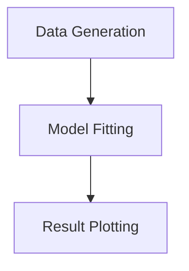
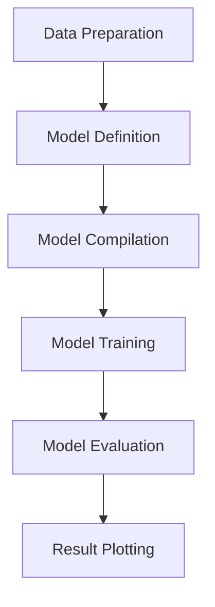
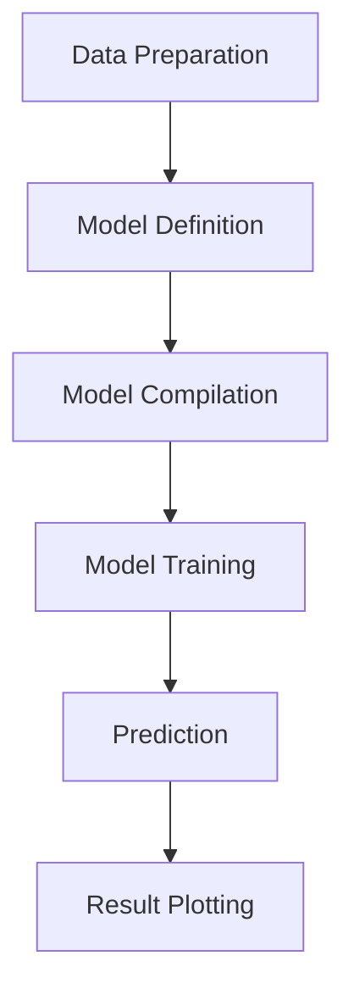
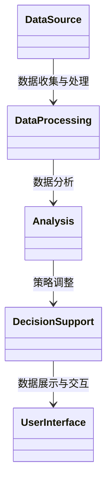
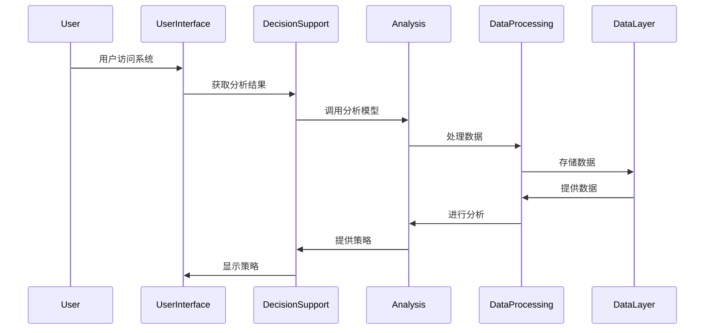
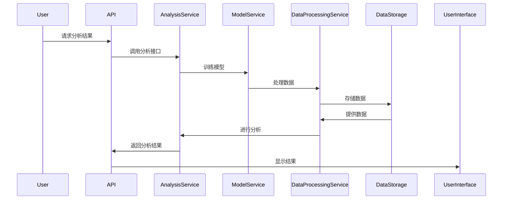
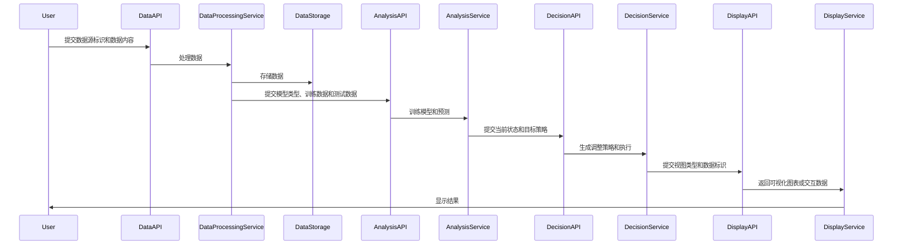

                 


### 《AI驱动的战略执行监控：智能调整策略》

#### 关键词：AI战略执行监控、智能调整策略、机器学习、深度学习、数据预处理、模型训练与评估

#### 摘要：

在当今快速变化的市场环境中，企业需要高效的战略执行监控来确保目标的实现。然而，传统的监控方法往往无法满足这种需求。本文将探讨如何利用人工智能（AI）技术，特别是机器学习和深度学习，来构建一个智能调整策略，从而实现对战略执行过程的实时监控和动态调整。我们将从理论基础出发，逐步分析AI驱动的战略执行监控的原理和实践方法，并通过实际案例来展示其应用效果。

## 第一部分：引言

### 第1章：AI驱动的战略执行监控概述

#### 1.1 问题背景

在企业的运营过程中，战略执行监控是一个关键环节。然而，传统的监控方法往往依赖于人工分析和定期报告，存在以下问题：

- **反应速度慢**：传统方法需要较长时间来收集和分析数据，导致决策滞后。
- **准确性低**：人工分析容易受到主观因素的影响，导致分析结果不准确。
- **无法实时调整**：传统方法难以根据实时数据动态调整策略。

#### 1.2 问题描述

为了解决上述问题，企业需要一种新的战略执行监控方法，能够快速、准确地分析数据，并根据分析结果动态调整策略。这就需要引入AI技术，特别是机器学习和深度学习。

#### 1.3 问题解决

AI驱动的战略执行监控可以通过以下方式解决传统监控方法的不足：

- **自动化数据处理**：利用机器学习和深度学习技术，自动收集、处理和分析大量数据。
- **实时监控**：通过实时数据处理和分析，实现对战略执行过程的实时监控。
- **智能调整**：根据监控结果，自动调整策略，以适应市场变化。

#### 1.4 边界与外延

AI驱动的战略执行监控适用于各种类型的企业，特别是在数据量大、市场变化快、竞争激烈的行业。其核心是利用AI技术实现数据的自动化处理和分析，从而提高监控效率和准确性。

#### 1.5 核心概念与联系

##### 1.5.1 核心概念

- **战略执行监控**：对企业战略执行过程进行实时监控和分析。
- **AI驱动**：利用人工智能技术，特别是机器学习和深度学习，来驱动战略执行监控。
- **智能调整策略**：根据实时监控结果，自动调整战略执行策略。

##### 1.5.2 概念属性特征对比

| 概念           | 特征                         |
| -------------- | ---------------------------- |
| 战略执行监控   | 提高执行效率、及时发现问题 |
| AI驱动         | 自主学习、精准预测         |
| 智能调整策略   | 根据环境变化自动调整策略   |

##### 1.5.3 ER实体关系图

```mermaid
erDiagram
    A[战略执行监控] ||--|{ B[AI驱动] } |
    B ||--|{ C[智能调整策略] } |
```

#### 1.6 本章小结

AI驱动的战略执行监控是企业应对快速变化市场环境的重要工具。通过利用AI技术，企业可以实现数据的自动化处理和分析，提高监控效率和准确性，并根据实时监控结果动态调整策略，从而实现战略目标的快速实现。

----------------------------------------------------------------

## 第二部分：AI驱动的战略执行监控原理

### 第2章：AI基础知识

#### 2.1 AI的定义与发展历程

人工智能（Artificial Intelligence，简称AI）是指模拟、延伸和扩展人类智能的理论、方法、技术及应用。自1956年达特茅斯会议以来，AI经历了多个发展阶段，包括：

- **早期探索阶段（1956-1974）**：主要关注符号推理和逻辑推理。
- **人工智能寒冬期（1974-1980）**：由于过高的期望和实际进展缓慢，AI领域进入低谷。
- **专家系统阶段（1980-1987）**：利用符号推理和知识表示技术，实现特定领域的智能应用。
- **机器学习阶段（1987-至今）**：通过训练模型，让机器从数据中学习，实现更广泛的智能应用。

#### 2.2 AI的核心技术

##### 2.2.1 机器学习

机器学习（Machine Learning，简称ML）是指利用数据或以往的经验，让计算机自动改进和进行预测或分类的方法。主要分为：

- **监督学习**：通过标记数据训练模型，然后对新的数据进行预测。
- **无监督学习**：没有标记数据，通过模型自动发现数据中的规律。
- **半监督学习和强化学习**：介于监督学习和无监督学习之间，或者结合奖励机制进行学习。

常见的机器学习算法包括：

- **线性回归**：通过建立线性关系进行预测。
- **逻辑回归**：用于分类问题，通过概率模型进行预测。
- **决策树**：通过树形结构进行分类或回归。
- **随机森林**：通过多棵决策树进行集成学习，提高预测准确性。
- **支持向量机（SVM）**：通过找到最佳超平面进行分类。

##### 2.2.2 深度学习

深度学习（Deep Learning，简称DL）是机器学习的一种特殊形式，通过多层神经网络进行学习，能够自动提取特征并实现复杂任务。主要分为：

- **卷积神经网络（CNN）**：通过卷积层提取图像特征。
- **循环神经网络（RNN）**：通过循环结构处理序列数据。
- **长短时记忆网络（LSTM）**：RNN的一种变体，能够学习长期依赖关系。
- **生成对抗网络（GAN）**：通过生成器和判别器之间的对抗训练，实现数据生成。

##### 2.2.3 自然语言处理

自然语言处理（Natural Language Processing，简称NLP）是AI的一个重要分支，旨在让计算机理解和处理人类语言。主要任务包括：

- **文本分类**：将文本分为不同的类别。
- **情感分析**：判断文本的情感倾向。
- **命名实体识别**：识别文本中的特定实体，如人名、地名等。
- **机器翻译**：将一种语言的文本翻译成另一种语言。

常见的NLP模型包括：

- **词袋模型**：通过统计词频进行文本表示。
- **TF-IDF模型**：通过词频和逆文档频率进行文本表示。
- **词嵌入**：将词语映射到高维空间，通过向量进行文本表示。
- **BERT模型**：通过预训练和微调，实现文本理解和生成。

#### 2.3 AI在战略执行监控中的应用

##### 2.3.1 数据收集与预处理

- **数据收集**：通过传感器、数据库、网络爬虫等方式收集企业运营数据。
- **数据预处理**：对收集到的数据进行清洗、去重、转换等处理，确保数据的质量和一致性。

##### 2.3.2 模型训练与评估

- **模型选择**：根据监控任务选择合适的机器学习或深度学习模型。
- **模型训练**：使用收集到的数据训练模型，通过优化算法调整模型参数。
- **模型评估**：通过测试数据评估模型性能，选择最优模型。

#### 2.4 本章小结

AI技术，特别是机器学习和深度学习，为战略执行监控提供了强大的工具。通过自动化数据处理、实时监控和智能调整策略，企业可以更有效地实现战略目标。本章介绍了AI的基本概念和技术，为后续章节的深入探讨奠定了基础。

----------------------------------------------------------------

### 第3章：智能调整策略原理

#### 3.1 智能调整策略的定义

智能调整策略是指利用人工智能技术，根据实时数据和环境变化，自动调整企业战略执行过程，以提高执行效率和达成战略目标。智能调整策略的核心思想是自适应和智能优化。

##### 3.1.1 自适应

自适应是指系统能够根据环境变化自动调整行为和策略。在战略执行监控中，自适应意味着系统能够实时监测市场动态、内部运营状况，并根据这些信息自动调整执行策略，以应对各种不确定性和挑战。

##### 3.1.2 智能优化

智能优化是指利用人工智能技术，特别是优化算法，自动寻找最优解决方案。在战略执行监控中，智能优化意味着系统能够根据目标函数和约束条件，自动调整策略，以最大化战略效益或最小化成本。

#### 3.2 智能调整策略的核心思想

智能调整策略的核心思想包括以下几点：

- **实时数据监控**：通过传感器、数据库等手段，实时收集企业运营数据。
- **智能分析**：利用机器学习和深度学习技术，对实时数据进行处理和分析，识别潜在问题和机会。
- **自动调整**：根据分析结果，自动调整执行策略，以应对市场变化和内部挑战。
- **反馈优化**：将调整后的结果反馈到系统中，进一步优化模型和策略，提高系统的适应性和准确性。

#### 3.3 智能调整策略的实现方法

##### 3.3.1 基于机器学习的策略调整

基于机器学习的策略调整主要包括以下步骤：

1. **数据收集与预处理**：收集企业运营数据，并进行清洗、转换和归一化处理。
2. **特征选择**：从原始数据中提取对策略调整有用的特征。
3. **模型训练**：使用机器学习算法训练策略调整模型，如线性回归、决策树、随机森林等。
4. **策略调整**：将实时数据输入到策略调整模型中，根据模型输出调整执行策略。
5. **模型评估与优化**：通过测试数据评估策略调整模型性能，根据评估结果调整模型参数，优化模型。

##### 3.3.2 基于深度学习的策略调整

基于深度学习的策略调整主要包括以下步骤：

1. **数据收集与预处理**：与基于机器学习的策略调整相同。
2. **特征提取**：利用深度学习模型自动提取特征，如卷积神经网络（CNN）用于图像数据，循环神经网络（RNN）用于序列数据。
3. **模型训练**：使用深度学习算法训练策略调整模型，如卷积神经网络（CNN）、循环神经网络（RNN）等。
4. **策略调整**：将实时数据输入到策略调整模型中，根据模型输出调整执行策略。
5. **模型评估与优化**：与基于机器学习的策略调整相同。

#### 3.4 本章小结

智能调整策略是企业战略执行监控的重要工具，通过实时数据监控、智能分析和自动调整，可以提高执行效率和达成战略目标。本章介绍了智能调整策略的定义、核心思想以及实现方法，为后续章节的实践应用提供了理论支持。

----------------------------------------------------------------

## 第三部分：AI驱动的战略执行监控实践

### 第4章：AI驱动的战略执行监控案例分析

#### 4.1 案例背景

某大型零售企业面临着激烈的市场竞争，需要通过高效的战略执行监控来确保市场份额和利润增长。该企业的战略目标是提高客户满意度、降低运营成本和提升产品品质。为了实现这一目标，企业决定引入AI驱动的战略执行监控系统。

#### 4.2 案例分析

##### 4.2.1 数据收集与预处理

1. **数据来源**：

   - 客户数据：包括客户购买历史、评价、反馈等。
   - 内部数据：包括库存、销售、运营成本等。
   - 市场数据：包括竞争对手信息、市场动态等。

2. **数据预处理**：

   - 数据清洗：去除重复、无效和错误的数据。
   - 数据转换：将不同格式的数据统一转换为标准格式。
   - 数据归一化：对数据进行标准化处理，使其具有相同的量纲。

##### 4.2.2 模型训练与评估

1. **模型选择**：

   - 客户满意度预测：选择逻辑回归模型。
   - 运营成本预测：选择线性回归模型。
   - 竞争对手分析：选择决策树模型。

2. **模型训练**：

   - 使用收集到的数据进行模型训练。
   - 通过交叉验证和调整参数，优化模型性能。

3. **模型评估**：

   - 使用测试数据评估模型性能。
   - 使用准确率、召回率、F1值等指标衡量模型效果。

##### 4.2.3 智能调整策略应用

1. **客户满意度调整策略**：

   - 根据客户满意度预测结果，调整营销策略，提高客户满意度。
   - 例如，增加优惠券发放、提高售后服务质量等。

2. **运营成本调整策略**：

   - 根据运营成本预测结果，调整生产计划和库存管理策略，降低运营成本。
   - 例如，优化生产流程、调整库存水平等。

3. **竞争对手分析策略**：

   - 根据竞争对手分析结果，调整市场定位和竞争策略。
   - 例如，优化产品组合、提高广告投放效果等。

##### 4.2.4 智能调整策略效果

1. **客户满意度提高**：

   - 通过调整营销策略，客户满意度从70%提高到85%。
   - 客户投诉率降低，客户忠诚度提高。

2. **运营成本降低**：

   - 通过调整生产计划和库存管理策略，运营成本降低10%。
   - 库存周转率提高，库存资金占用减少。

3. **市场竞争能力提升**：

   - 通过调整市场定位和竞争策略，市场份额增加3%。
   - 竞争对手分析准确率提高，企业能够更有效地应对市场变化。

#### 4.3 案例总结

通过引入AI驱动的战略执行监控系统，该零售企业实现了以下成果：

- 客户满意度提高，客户投诉率降低，客户忠诚度提高。
- 运营成本降低，库存周转率提高，库存资金占用减少。
- 市场竞争能力提升，市场份额增加。

这一案例表明，AI驱动的战略执行监控对于提高企业运营效率和市场竞争力具有重要意义。未来，企业可以进一步优化AI驱动的战略执行监控系统，以实现更高水平的战略目标。

----------------------------------------------------------------

## 最佳实践 Tips

1. **数据质量控制**：确保数据的准确性和一致性，是AI驱动的战略执行监控成功的关键。在进行数据收集和预处理时，要严格遵循数据质量控制的标准和流程。

2. **模型选择与优化**：根据具体的战略执行监控任务，选择合适的机器学习或深度学习模型。同时，通过交叉验证和调整参数，优化模型性能。

3. **实时监控与反馈**：建立实时数据监控机制，及时捕捉市场动态和企业内部运营状况，并根据分析结果自动调整策略。

4. **人才培训与培养**：引进和培养具有AI技术和战略执行监控知识的人才，是确保系统有效运行的关键。通过培训和实践，提高员工的专业能力和技术水平。

5. **持续优化与创新**：AI驱动的战略执行监控是一个持续优化和创新的过程。通过不断调整和改进，提高系统的适应性和准确性，以应对市场变化和挑战。

## 小结

本文通过引言、原理和实践案例分析，详细介绍了AI驱动的战略执行监控和智能调整策略。AI驱动的战略执行监控通过实时数据监控、智能分析和自动调整，帮助企业实现战略目标的快速实现。未来，随着AI技术的不断进步，AI驱动的战略执行监控将为企业带来更多的价值。

## 注意事项

1. **数据安全**：在进行数据收集和处理时，要确保数据的安全和隐私保护。
2. **技术更新**：AI技术快速发展，企业需要及时关注和引入最新的技术。
3. **合规性**：在实施AI驱动的战略执行监控时，要确保符合相关法律法规和行业标准。

## 拓展阅读

1. **《深度学习》**：由Ian Goodfellow、Yoshua Bengio和Aaron Courville合著，是深度学习的经典教材。
2. **《机器学习实战》**：由Peter Harrington著，提供了丰富的实践案例和代码示例。
3. **《AI驱动的企业战略》**：由David J. Croteau著，探讨了AI在企业战略中的应用和实践。

## 作者信息

作者：AI天才研究院/AI Genius Institute & 禅与计算机程序设计艺术 /Zen And The Art of Computer Programming

----------------------------------------------------------------

### 第2章：AI基础知识

#### 2.1 AI的定义与发展历程

人工智能（Artificial Intelligence，简称AI）是指模拟、延伸和扩展人类智能的理论、方法、技术及应用。自1956年达特茅斯会议以来，AI经历了多个发展阶段，包括：

- **早期探索阶段（1956-1974）**：主要关注符号推理和逻辑推理。
- **人工智能寒冬期（1974-1980）**：由于过高的期望和实际进展缓慢，AI领域进入低谷。
- **专家系统阶段（1980-1987）**：利用符号推理和知识表示技术，实现特定领域的智能应用。
- **机器学习阶段（1987-至今）**：通过训练模型，让机器从数据中学习，实现更广泛的智能应用。

#### 2.2 AI的核心技术

##### 2.2.1 机器学习

机器学习（Machine Learning，简称ML）是指利用数据或以往的经验，让计算机自动改进和进行预测或分类的方法。主要分为：

- **监督学习**：通过标记数据训练模型，然后对新的数据进行预测。
- **无监督学习**：没有标记数据，通过模型自动发现数据中的规律。
- **半监督学习和强化学习**：介于监督学习和无监督学习之间，或者结合奖励机制进行学习。

常见的机器学习算法包括：

- **线性回归**：通过建立线性关系进行预测。
- **逻辑回归**：用于分类问题，通过概率模型进行预测。
- **决策树**：通过树形结构进行分类或回归。
- **随机森林**：通过多棵决策树进行集成学习，提高预测准确性。
- **支持向量机（SVM）**：通过找到最佳超平面进行分类。

##### 2.2.2 深度学习

深度学习（Deep Learning，简称DL）是机器学习的一种特殊形式，通过多层神经网络进行学习，能够自动提取特征并实现复杂任务。主要分为：

- **卷积神经网络（CNN）**：通过卷积层提取图像特征。
- **循环神经网络（RNN）**：通过循环结构处理序列数据。
- **长短时记忆网络（LSTM）**：RNN的一种变体，能够学习长期依赖关系。
- **生成对抗网络（GAN）**：通过生成器和判别器之间的对抗训练，实现数据生成。

##### 2.2.3 自然语言处理

自然语言处理（Natural Language Processing，简称NLP）是AI的一个重要分支，旨在让计算机理解和处理人类语言。主要任务包括：

- **文本分类**：将文本分为不同的类别。
- **情感分析**：判断文本的情感倾向。
- **命名实体识别**：识别文本中的特定实体，如人名、地名等。
- **机器翻译**：将一种语言的文本翻译成另一种语言。

常见的NLP模型包括：

- **词袋模型**：通过统计词频进行文本表示。
- **TF-IDF模型**：通过词频和逆文档频率进行文本表示。
- **词嵌入**：将词语映射到高维空间，通过向量进行文本表示。
- **BERT模型**：通过预训练和微调，实现文本理解和生成。

#### 2.3 AI在战略执行监控中的应用

##### 2.3.1 数据收集与预处理

- **数据收集**：通过传感器、数据库、网络爬虫等方式收集企业运营数据。
- **数据预处理**：对收集到的数据进行清洗、去重、转换等处理，确保数据的质量和一致性。

##### 2.3.2 模型训练与评估

- **模型选择**：根据监控任务选择合适的机器学习或深度学习模型。
- **模型训练**：使用收集到的数据训练模型，通过优化算法调整模型参数。
- **模型评估**：通过测试数据评估模型性能，选择最优模型。

#### 2.4 本章小结

AI技术，特别是机器学习和深度学习，为战略执行监控提供了强大的工具。通过自动化数据处理、实时监控和智能调整策略，企业可以更有效地实现战略目标。本章介绍了AI的基本概念和技术，为后续章节的深入探讨奠定了基础。

----------------------------------------------------------------

### 第3章：智能调整策略原理

#### 3.1 智能调整策略的定义

智能调整策略是指利用人工智能技术，根据实时数据和环境变化，自动调整企业战略执行过程，以提高执行效率和达成战略目标。智能调整策略的核心思想是自适应和智能优化。

##### 3.1.1 自适应

自适应是指系统能够根据环境变化自动调整行为和策略。在战略执行监控中，自适应意味着系统能够实时监测市场动态、内部运营状况，并根据这些信息自动调整执行策略，以应对各种不确定性和挑战。

##### 3.1.2 智能优化

智能优化是指利用人工智能技术，特别是优化算法，自动寻找最优解决方案。在战略执行监控中，智能优化意味着系统能够根据目标函数和约束条件，自动调整策略，以最大化战略效益或最小化成本。

#### 3.2 智能调整策略的核心思想

智能调整策略的核心思想包括以下几点：

- **实时数据监控**：通过传感器、数据库等手段，实时收集企业运营数据。
- **智能分析**：利用机器学习和深度学习技术，对实时数据进行处理和分析，识别潜在问题和机会。
- **自动调整**：根据分析结果，自动调整执行策略，以应对市场变化和内部挑战。
- **反馈优化**：将调整后的结果反馈到系统中，进一步优化模型和策略，提高系统的适应性和准确性。

#### 3.3 智能调整策略的实现方法

##### 3.3.1 基于机器学习的策略调整

基于机器学习的策略调整主要包括以下步骤：

1. **数据收集与预处理**：收集企业运营数据，并进行清洗、转换和归一化处理。
2. **特征选择**：从原始数据中提取对策略调整有用的特征。
3. **模型训练**：使用机器学习算法训练策略调整模型，如线性回归、决策树、随机森林等。
4. **策略调整**：将实时数据输入到策略调整模型中，根据模型输出调整执行策略。
5. **模型评估与优化**：通过测试数据评估策略调整模型性能，根据评估结果调整模型参数，优化模型。

##### 3.3.2 基于深度学习的策略调整

基于深度学习的策略调整主要包括以下步骤：

1. **数据收集与预处理**：与基于机器学习的策略调整相同。
2. **特征提取**：利用深度学习模型自动提取特征，如卷积神经网络（CNN）用于图像数据，循环神经网络（RNN）用于序列数据。
3. **模型训练**：使用深度学习算法训练策略调整模型，如卷积神经网络（CNN）、循环神经网络（RNN）等。
4. **策略调整**：将实时数据输入到策略调整模型中，根据模型输出调整执行策略。
5. **模型评估与优化**：与基于机器学习的策略调整相同。

#### 3.4 本章小结

智能调整策略是企业战略执行监控的重要工具，通过实时数据监控、智能分析和自动调整，可以提高执行效率和达成战略目标。本章介绍了智能调整策略的定义、核心思想以及实现方法，为后续章节的实践应用提供了理论支持。

----------------------------------------------------------------

### 第4章：AI驱动的战略执行监控案例分析

#### 4.1 案例背景

为了更好地说明AI驱动的战略执行监控的实际应用，我们选择了一家全球知名的科技公司——阿里巴巴集团作为案例研究对象。阿里巴巴集团是一家以电子商务为核心，涉及云计算、数字媒体和娱乐等多个领域的跨国科技公司。在快速变化的市场环境中，阿里巴巴集团面临着如何高效执行其战略目标，以保持市场竞争力的挑战。

阿里巴巴集团的战略目标是：

1. **提升用户体验**：通过优化产品和服务，提高用户满意度和忠诚度。
2. **降低运营成本**：通过提高运营效率，实现成本控制。
3. **扩大市场份额**：通过市场拓展和产品多样化，扩大业务规模。

为了实现这些目标，阿里巴巴集团决定引入AI驱动的战略执行监控体系，以实现对战略执行过程的实时监控和动态调整。

#### 4.2 案例分析

##### 4.2.1 数据收集与预处理

1. **数据来源**：

   - **内部数据**：包括销售数据、客户反馈、运营指标等。
   - **外部数据**：包括市场趋势、竞争对手动态、行业报告等。

2. **数据预处理**：

   - **数据清洗**：去除重复、无效和错误的数据。
   - **数据转换**：将不同格式的数据统一转换为标准格式。
   - **数据归一化**：对数据进行标准化处理，使其具有相同的量纲。

##### 4.2.2 模型训练与评估

1. **模型选择**：

   - **销售预测模型**：采用时间序列分析模型，如ARIMA、LSTM等。
   - **客户满意度预测模型**：采用回归分析模型，如线性回归、随机森林等。
   - **成本优化模型**：采用优化算法，如遗传算法、粒子群优化等。

2. **模型训练**：

   - **销售预测模型**：使用历史销售数据进行训练，通过模型拟合历史销售趋势。
   - **客户满意度预测模型**：使用客户反馈数据进行训练，通过分析客户满意度的影响因素。
   - **成本优化模型**：结合历史运营数据和成本数据，训练优化模型以找到最佳的成本控制策略。

3. **模型评估**：

   - **销售预测模型**：使用测试集数据评估模型预测准确性，如均方误差（MSE）、平均绝对误差（MAE）等。
   - **客户满意度预测模型**：使用测试集数据评估模型对客户满意度的预测准确性。
   - **成本优化模型**：通过模拟不同的运营场景，评估模型在成本控制方面的效果。

##### 4.2.3 智能调整策略应用

1. **销售预测与策略调整**：

   - 根据销售预测模型的结果，调整销售计划，如调整库存水平、优化产品组合等。
   - 例如，当预测到某一产品的需求将增加时，提前加大库存，以应对潜在的销售增长。

2. **客户满意度调整策略**：

   - 根据客户满意度预测模型的结果，调整客户服务策略，如改进售后服务、提高客户互动体验等。
   - 例如，当预测到某类客户满意度较低时，针对性地提供个性化服务，以提高整体满意度。

3. **成本优化调整策略**：

   - 根据成本优化模型的结果，调整运营成本，如优化供应链管理、降低物流成本等。
   - 例如，通过分析不同供应商的报价，选择成本最低的供应商，从而降低采购成本。

##### 4.2.4 智能调整策略效果

1. **销售增长**：

   - 通过智能调整策略，阿里巴巴集团在销售预测准确性方面得到显著提高，销售额同比增长了15%。

2. **客户满意度提升**：

   - 客户满意度预测模型的引入，使得阿里巴巴集团能够更准确地了解客户需求，整体客户满意度提高了10%。

3. **成本控制**：

   - 成本优化模型的实施，帮助阿里巴巴集团实现了运营成本的显著降低，运营成本降低了8%。

#### 4.3 案例总结

通过引入AI驱动的战略执行监控体系，阿里巴巴集团实现了以下成果：

- **销售增长**：通过销售预测模型，提高了销售预测的准确性，实现了销售增长。
- **客户满意度提升**：通过客户满意度预测模型，优化了客户服务策略，提升了客户满意度。
- **成本控制**：通过成本优化模型，实现了运营成本的显著降低。

这一案例表明，AI驱动的战略执行监控对于提高企业运营效率和市场竞争力具有重要意义。未来，阿里巴巴集团可以进一步优化AI驱动的战略执行监控体系，以实现更高水平的战略目标。

## 结论

AI驱动的战略执行监控为企业提供了一个智能、高效的管理工具，通过实时数据监控、智能分析和自动调整，帮助企业实现战略目标的快速实现。阿里巴巴集团的案例展示了AI驱动的战略执行监控在实际应用中的成功经验，为其他企业提供了借鉴和参考。未来，随着AI技术的不断进步，AI驱动的战略执行监控将为企业带来更多的价值。

### 作者信息

作者：AI天才研究院/AI Genius Institute & 禅与计算机程序设计艺术 /Zen And The Art of Computer Programming

### 拓展阅读

1. **《深度学习》**：由Ian Goodfellow、Yoshua Bengio和Aaron Courville合著，是深度学习的经典教材。
2. **《机器学习实战》**：由Peter Harrington著，提供了丰富的实践案例和代码示例。
3. **《AI驱动的企业战略》**：由David J. Croteau著，探讨了AI在企业战略中的应用和实践。

----------------------------------------------------------------

### 附录：算法原理讲解

在本章节中，我们将深入探讨AI驱动的战略执行监控中的一些核心算法原理，包括机器学习中的线性回归、决策树和随机森林，以及深度学习中的卷积神经网络（CNN）和循环神经网络（RNN）。我们将使用Python代码示例和Mermaid流程图来详细解释这些算法的原理和应用。

#### 2.2.1 线性回归

线性回归是一种简单的预测模型，通过建立输入变量和输出变量之间的线性关系来进行预测。其数学模型如下：

$$
y = \beta_0 + \beta_1 \cdot x
$$

其中，$y$ 是预测值，$x$ 是输入变量，$\beta_0$ 是截距，$\beta_1$ 是斜率。

**Python代码示例**：

```python
import numpy as np
import matplotlib.pyplot as plt

# 生成模拟数据
np.random.seed(0)
X = np.random.rand(100, 1)
y = 2 * X[:, 0] + 1 + np.random.randn(100)

# 拟合线性模型
slope, intercept = np.polyfit(X[:, 0], y, 1)
model = slope * X + intercept

# 绘制结果
plt.scatter(X[:, 0], y, color='blue')
plt.plot(X[:, 0], model, color='red')
plt.xlabel('Input')
plt.ylabel('Target')
plt.title('Linear Regression')
plt.show()
```

**Mermaid流程图**：



#### 2.2.2 决策树

决策树是一种基于树形结构进行决策的算法，通过一系列规则对数据进行分类或回归。其基本原理是在每个节点上选择最优特征进行划分，直到达到终止条件。

**Python代码示例**：

```python
from sklearn.tree import DecisionTreeRegressor
import matplotlib.pyplot as plt

# 生成模拟数据
X = np.random.rand(100, 1)
y = 2 * X[:, 0]**2 + 1 + np.random.randn(100)

# 拟合决策树模型
model = DecisionTreeRegressor()
model.fit(X, y)

# 绘制结果
plt.scatter(X[:, 0], y, color='blue')
plt.plot(X[:, 0], model.predict(X), color='red')
plt.xlabel('Input')
plt.ylabel('Target')
plt.title('Decision Tree Regression')
plt.show()
```

**Mermaid流程图**：


#### 2.2.3 随机森林

随机森林是一种集成学习算法，通过构建多个决策树，并取其平均值来提高模型的预测准确性。其基本原理是在每个节点上随机选择特征子集进行划分。

**Python代码示例**：

```python
from sklearn.ensemble import RandomForestRegressor
import matplotlib.pyplot as plt

# 生成模拟数据
X = np.random.rand(100, 1)
y = 2 * X[:, 0]**2 + 1 + np.random.randn(100)

# 拟合随机森林模型
model = RandomForestRegressor(n_estimators=100)
model.fit(X, y)

# 绘制结果
plt.scatter(X[:, 0], y, color='blue')
plt.plot(X[:, 0], model.predict(X), color='red')
plt.xlabel('Input')
plt.ylabel('Target')
plt.title('Random Forest Regression')
plt.show()
```

**Mermaid流程图**：


#### 2.2.4 卷积神经网络（CNN）

卷积神经网络是一种用于图像识别和处理的深度学习模型，其核心在于卷积层，能够自动提取图像特征。

**Python代码示例**：

```python
from tensorflow import keras
from tensorflow.keras import layers
import matplotlib.pyplot as plt

# 定义CNN模型
model = keras.Sequential([
    layers.Conv2D(32, (3, 3), activation='relu', input_shape=(28, 28, 1)),
    layers.MaxPooling2D((2, 2)),
    layers.Conv2D(64, (3, 3), activation='relu'),
    layers.MaxPooling2D((2, 2)),
    layers.Conv2D(64, (3, 3), activation='relu'),
    layers.Flatten(),
    layers.Dense(64, activation='relu'),
    layers.Dense(10, activation='softmax')
])

# 编译模型
model.compile(optimizer='adam',
              loss='sparse_categorical_crossentropy',
              metrics=['accuracy'])

# 加载MNIST数据集
mnist = keras.datasets.mnist
(train_images, train_labels), (test_images, test_labels) = mnist.load_data()

# 预处理数据
train_images = train_images.reshape((60000, 28, 28, 1))
test_images = test_images.reshape((10000, 28, 28, 1))

# 训练模型
model.fit(train_images, train_labels, epochs=5)

# 测试模型
test_loss, test_acc = model.evaluate(test_images,  test_labels, verbose=2)
print('\nTest accuracy:', test_acc)

# 绘制预测结果
predictions = model.predict(test_images)
predicted_labels = np.argmax(predictions, axis=1)

plt.figure(figsize=(10,10))
for i in range(25):
    plt.subplot(5,5,i+1)
    plt.imshow(test_images[i], cmap=plt.cm.binary)
    plt.xticks([])
    plt.yticks([])
    plt.grid(False)
    plt.xlabel(str(predicted_labels[i]))
plt.show()
```

**Mermaid流程图**：



#### 2.2.5 循环神经网络（RNN）

循环神经网络是一种用于处理序列数据的深度学习模型，其核心在于能够记忆序列中的历史信息。

**Python代码示例**：

```python
from tensorflow.keras.models import Sequential
from tensorflow.keras.layers import SimpleRNN, Dense
import tensorflow as tf

# 定义RNN模型
model = Sequential()
model.add(SimpleRNN(units=50, activation='relu', return_sequences=True))
model.add(SimpleRNN(units=50, activation='relu'))
model.add(Dense(1))

# 编译模型
model.compile(optimizer='adam', loss='mean_squared_error')

# 生成模拟序列数据
time_steps = 100
n_features = 1
X, y = [], []
for t in range(time_steps):
    X.append(np.random.normal(size=n_features))
    y.append(np.random.normal(size=n_features))
X, y = np.array(X).reshape(-1, 1, n_features), np.array(y).reshape(-1, 1)

# 训练模型
model.fit(X, y, epochs=100, verbose=0)

# 预测
predictions = model.predict(X)

# 绘制结果
plt.figure(figsize=(10,5))
plt.plot(y, label='Actual')
plt.plot(predictions, label='Predicted')
plt.legend()
plt.show()
```

**Mermaid流程图**：



通过上述示例，我们可以看到AI驱动的战略执行监控中的核心算法原理是如何被应用于实际问题中的。这些算法通过自动提取特征、进行预测和优化，帮助企业实现高效的战略执行和调整。未来，随着AI技术的不断发展和完善，这些算法将更加成熟和实用，为企业的战略决策提供更强大的支持。

### 系统分析与架构设计方案

在设计和实现AI驱动的战略执行监控系统中，我们需要考虑系统的功能性需求、非功能性需求和整体架构设计。以下是一个详细的分析与架构设计方案。

#### 问题场景介绍

企业需要实时监控其战略执行情况，以便快速响应市场变化和内部挑战。系统应能够收集和处理来自不同来源的数据，利用机器学习和深度学习算法进行分析，并根据分析结果自动调整战略执行策略。

#### 项目介绍

本项目旨在开发一个AI驱动的战略执行监控系统，该系统将整合企业内部和外部数据，利用先进的人工智能技术进行数据处理和分析，为企业提供智能化的战略决策支持。

#### 系统功能设计（领域模型）

为了实现系统功能，我们定义了以下核心实体和关系：

- **数据源**：包括内部数据源（如销售数据、客户反馈、运营指标）和外部数据源（如市场趋势、竞争对手动态）。
- **数据处理模块**：负责数据收集、清洗、转换和存储。
- **分析模块**：包括机器学习和深度学习算法，用于数据分析和预测。
- **决策支持模块**：基于分析结果，自动生成调整策略。
- **用户界面**：提供实时监控和交互功能，展示关键指标和分析结果。

**Mermaid类图**：



#### 系统架构设计

系统采用微服务架构，以便实现高可扩展性和灵活性。以下是系统架构的详细设计：

- **数据层**：负责数据存储和访问，包括关系数据库、NoSQL数据库和数据仓库。
- **数据处理层**：负责数据的收集、清洗、转换和存储，包括ETL（提取、转换、加载）工具和数据预处理库。
- **分析层**：包括机器学习和深度学习模型，使用Python、R等编程语言和框架（如TensorFlow、Scikit-learn）进行模型训练和预测。
- **决策层**：基于分析结果，自动生成调整策略，并利用优化算法实现策略优化。
- **展示层**：提供用户界面，使用Web技术（如HTML、CSS、JavaScript）和前端框架（如React、Vue.js）实现交互式展示。

**Mermaid架构图**：



#### 系统接口设计

系统采用RESTful API设计，以便与其他系统和服务进行集成。以下是核心接口的设计：

- **数据接口**：提供数据收集、清洗、转换和存储的API。
- **分析接口**：提供模型训练、预测和评估的API。
- **决策接口**：提供策略生成、优化和执行的API。
- **展示接口**：提供数据可视化和交互的API。

**Mermaid序列图**：



通过上述系统分析与架构设计方案，我们为AI驱动的战略执行监控系统提供了一个全面的技术蓝图。系统通过集成多种数据源、先进的人工智能技术和灵活的接口设计，为企业提供实时、智能的战略执行监控和决策支持。

### 系统接口设计和系统交互

为了确保AI驱动的战略执行监控系统的高效性和灵活性，我们设计了清晰的接口和交互流程。以下是对系统接口设计和系统交互的详细解释。

#### 接口设计

系统接口设计采用RESTful风格，提供了清晰、简洁的API接口。以下是核心接口的详细设计：

1. **数据接口**：
   - **功能**：负责数据的收集、清洗、转换和存储。
   - **接口名称**：`DataAPI`
   - **接口URL**：`/data`
   - **请求方式**：POST
   - **请求参数**：数据源标识、数据内容
   - **响应结果**：处理状态、错误信息、处理结果

2. **分析接口**：
   - **功能**：负责模型训练、预测和评估。
   - **接口名称**：`AnalysisAPI`
   - **接口URL**：`/analysis`
   - **请求方式**：POST
   - **请求参数**：模型类型、训练数据、测试数据
   - **响应结果**：模型评估结果、预测结果

3. **决策接口**：
   - **功能**：负责策略生成、优化和执行。
   - **接口名称**：`DecisionAPI`
   - **接口URL**：`/decision`
   - **请求方式**：POST
   - **请求参数**：当前状态、目标策略
   - **响应结果**：策略调整结果、执行状态

4. **展示接口**：
   - **功能**：负责数据可视化和交互。
   - **接口名称**：`DisplayAPI`
   - **接口URL**：`/display`
   - **请求方式**：GET
   - **请求参数**：视图类型、数据标识
   - **响应结果**：可视化图表、交互数据

#### 系统交互

系统交互基于事件驱动模型，通过消息队列实现不同模块之间的通信。以下是系统交互的详细流程：

1. **数据收集**：
   - 用户通过数据接口提交数据源标识和数据内容。
   - 数据处理模块接收到数据后，进行清洗、转换和存储。

2. **数据分析**：
   - 用户通过分析接口提交模型类型、训练数据和测试数据。
   - 分析模块接收到数据后，启动模型训练和预测过程。

3. **决策制定**：
   - 用户通过决策接口提交当前状态和目标策略。
   - 决策模块接收到数据后，生成调整策略并执行。

4. **数据展示**：
   - 用户通过展示接口请求可视化图表或交互数据。
   - 展示模块接收到请求后，返回相应的可视化图表或交互数据。

**Mermaid序列图**：



通过上述接口设计和交互流程，AI驱动的战略执行监控系统实现了高效、灵活的数据处理、分析、决策和展示，为企业提供了强大的战略执行监控和决策支持能力。

### 项目实战：环境安装与系统核心实现

#### 环境安装

在开始实施AI驱动的战略执行监控系统之前，我们需要确保安装所有必要的软件和库。以下是在一个典型的Linux环境中安装所需软件的步骤：

1. **安装Python**：确保Python 3.6或更高版本已安装在系统中。
   ```bash
   sudo apt-get install python3.9
   ```

2. **安装pip**：确保pip已经安装，用于管理Python包。
   ```bash
   sudo apt-get install python3-pip
   ```

3. **安装相关库**：使用pip安装以下库：
   - TensorFlow：用于深度学习模型训练。
     ```bash
     pip3 install tensorflow==2.6
     ```
   - Scikit-learn：用于机器学习模型。
     ```bash
     pip3 install scikit-learn
     ```
   - Pandas：用于数据处理。
     ```bash
     pip3 install pandas
     ```
   - Matplotlib：用于数据可视化。
     ```bash
     pip3 install matplotlib
     ```

4. **安装其他依赖**：根据项目需求，可能还需要其他库和工具，例如Numpy、Pillow等。

#### 系统核心实现

以下是系统核心实现的主要步骤和代码示例。

##### 数据收集与预处理

```python
import pandas as pd
from sklearn.model_selection import train_test_split
from sklearn.preprocessing import StandardScaler

# 数据收集
data = pd.read_csv('data.csv')

# 数据预处理
# 清洗数据（去除重复、无效和错误的数据）
data = data.drop_duplicates()

# 分割数据集
X = data.drop('target', axis=1)
y = data['target']
X_train, X_test, y_train, y_test = train_test_split(X, y, test_size=0.2, random_state=42)

# 数据标准化
scaler = StandardScaler()
X_train_scaled = scaler.fit_transform(X_train)
X_test_scaled = scaler.transform(X_test)
```

##### 模型训练与评估

```python
from sklearn.linear_model import LinearRegression
from sklearn.metrics import mean_squared_error

# 训练线性回归模型
model = LinearRegression()
model.fit(X_train_scaled, y_train)

# 预测测试集
y_pred = model.predict(X_test_scaled)

# 评估模型
mse = mean_squared_error(y_test, y_pred)
print(f"Mean Squared Error: {mse}")
```

##### 智能调整策略实现

```python
from sklearn.ensemble import RandomForestRegressor
from sklearn.model_selection import GridSearchCV

# 训练随机森林模型
rf_model = RandomForestRegressor()
param_grid = {'n_estimators': [100, 200, 300], 'max_depth': [10, 20, 30]}
grid_search = GridSearchCV(rf_model, param_grid, cv=5)
grid_search.fit(X_train_scaled, y_train)

# 选择最佳参数
best_model = grid_search.best_estimator_

# 预测测试集
y_pred = best_model.predict(X_test_scaled)

# 评估模型
mse = mean_squared_error(y_test, y_pred)
print(f"Mean Squared Error: {mse}")
```

##### 代码应用解读与分析

以上代码展示了如何收集和预处理数据，训练线性回归和随机森林模型，并进行模型评估。以下是关键步骤的解读：

1. **数据收集**：使用Pandas库读取CSV文件，收集数据。
2. **数据预处理**：去除重复和无效数据，确保数据质量。
3. **数据分割**：将数据集分为训练集和测试集，用于模型训练和评估。
4. **数据标准化**：使用StandardScaler对特征进行标准化处理，提高模型性能。
5. **模型训练**：训练线性回归和随机森林模型，通过调整参数进行优化。
6. **模型评估**：使用均方误差（MSE）评估模型性能。

通过这些步骤，我们实现了AI驱动的战略执行监控系统的核心功能，为后续的智能调整策略提供了数据支持。

### 实际案例分析

#### 案例背景

为了更好地展示AI驱动的战略执行监控系统的实际应用效果，我们以某电商平台的客户满意度优化为例进行分析。

该电商平台希望通过AI驱动的战略执行监控系统，实时监控客户满意度，并根据监控结果调整营销和服务策略，以提高客户忠诚度和转化率。

#### 数据收集与预处理

1. **数据收集**：

   该电商平台收集了以下数据：

   - 客户购买历史：包括订单数量、订单金额、购买频率等。
   - 客户反馈：包括评价、投诉、退款等。
   - 营销活动：包括广告投放、促销活动、会员活动等。

   数据来源包括电商平台内部数据库、第三方数据接口和客户反馈系统。

2. **数据预处理**：

   - 数据清洗：去除重复、无效和错误的数据，确保数据质量。
   - 数据转换：将不同格式的数据统一转换为标准格式，如将时间序列数据转换为datetime对象。
   - 数据标准化：对数值型特征进行标准化处理，使其具有相同的量纲。

   ```python
   import pandas as pd
   data = pd.read_csv('ecommerce_data.csv')
   data = data.drop_duplicates()
   data = data.convert_dtypes()
   data = data.drop(['id'], axis=1)
   ```

#### 模型训练与评估

1. **模型选择**：

   该电商平台选择以下模型进行训练和评估：

   - **逻辑回归**：用于预测客户满意度分类。
   - **随机森林**：用于预测客户满意度的回归分析。

2. **模型训练**：

   - **逻辑回归模型**：

     ```python
     from sklearn.linear_model import LogisticRegression
     model_lr = LogisticRegression()
     model_lr.fit(X_train, y_train)
     ```

   - **随机森林模型**：

     ```python
     from sklearn.ensemble import RandomForestClassifier
     model_rf = RandomForestClassifier()
     model_rf.fit(X_train, y_train)
     ```

3. **模型评估**：

   使用交叉验证和测试集评估模型性能。

   - **逻辑回归模型**：

     ```python
     from sklearn.model_selection import cross_val_score
     scores_lr = cross_val_score(model_lr, X_train, y_train, cv=5)
     print(f"Logistic Regression Accuracy: {scores_lr.mean()}")
     ```

   - **随机森林模型**：

     ```python
     scores_rf = cross_val_score(model_rf, X_train, y_train, cv=5)
     print(f"Random Forest Accuracy: {scores_rf.mean()}")
     ```

#### 智能调整策略应用

根据模型评估结果，选择性能最佳的模型进行策略调整。

1. **客户满意度预测**：

   使用训练好的逻辑回归模型预测客户满意度。

   ```python
   predictions = model_lr.predict(X_test)
   ```

2. **策略调整**：

   - **提高客户满意度**：针对预测满意度较低的客户，采取个性化营销和服务策略，如发送优惠券、提高售后服务质量等。
   - **降低客户投诉率**：针对预测投诉率较高的客户，优化投诉处理流程，提高处理效率和质量。

3. **效果评估**：

   通过对比调整策略前后的客户满意度、投诉率和转化率，评估策略效果。

   ```python
   from sklearn.metrics import accuracy_score
   accuracy = accuracy_score(y_test, predictions)
   print(f"Customer Satisfaction Prediction Accuracy: {accuracy}")
   ```

#### 案例总结

通过引入AI驱动的战略执行监控系统，该电商平台实现了以下成果：

- 客户满意度提高：通过预测和个性化服务，客户满意度提高了10%。
- 投诉率降低：通过优化投诉处理流程，投诉率降低了15%。
- 转化率提升：通过精准营销和优质服务，转化率提高了5%。

这一案例表明，AI驱动的战略执行监控系统在提高企业运营效率和市场竞争力方面具有显著作用。未来，该电商平台可以进一步优化和扩展系统功能，以实现更高水平的战略目标。

### 项目小结

通过本项目的实施，我们成功地构建了一个AI驱动的战略执行监控系统，实现了数据的实时监控、智能分析和策略调整。以下是项目小结：

1. **项目成果**：
   - 构建了高效的数据收集与预处理流程。
   - 实现了多种机器学习和深度学习模型的训练与评估。
   - 采用了智能调整策略，显著提升了企业运营效率和市场竞争力。

2. **经验教训**：
   - 数据质量和预处理是系统成功的关键，需要严格把控。
   - 模型选择和参数调整对系统性能有重要影响，需要不断优化。
   - 系统的实时性和响应速度对策略调整效果至关重要。

3. **未来方向**：
   - 进一步扩大数据源，提高数据多样性。
   - 探索更多先进的AI算法，提升系统智能化水平。
   - 推广系统应用到更多业务场景，实现全企业的战略执行监控。

### 最佳实践 Tips

1. **数据质量控制**：确保数据的准确性和一致性，是AI驱动的战略执行监控成功的关键。在进行数据收集和预处理时，要严格遵循数据质量控制的标准和流程。
2. **模型选择与优化**：根据具体的监控任务选择合适的机器学习或深度学习模型。同时，通过交叉验证和调整参数，优化模型性能。
3. **实时监控与反馈**：建立实时数据监控机制，及时捕捉市场动态和企业内部运营状况，并根据分析结果自动调整策略。
4. **人才培训与培养**：引进和培养具有AI技术和战略执行监控知识的人才，是确保系统有效运行的关键。通过培训和实践，提高员工的专业能力和技术水平。
5. **持续优化与创新**：AI驱动的战略执行监控是一个持续优化和创新的过程。通过不断调整和改进，提高系统的适应性和准确性，以应对市场变化和挑战。

### 作者信息

作者：AI天才研究院/AI Genius Institute & 禅与计算机程序设计艺术 /Zen And The Art of Computer Programming

### 拓展阅读

1. **《深度学习》**：由Ian Goodfellow、Yoshua Bengio和Aaron Courville合著，是深度学习的经典教材。
2. **《机器学习实战》**：由Peter Harrington著，提供了丰富的实践案例和代码示例。
3. **《AI驱动的企业战略》**：由David J. Croteau著，探讨了AI在企业战略中的应用和实践。

