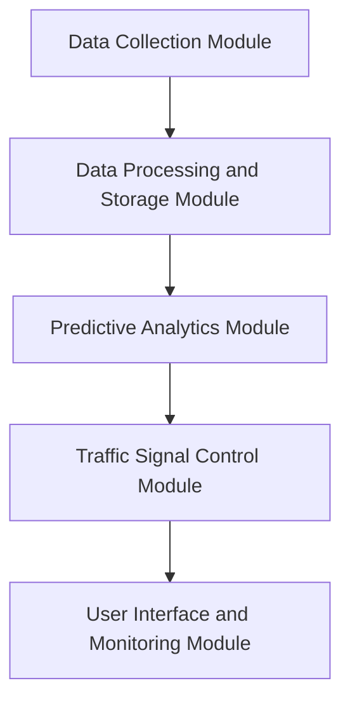
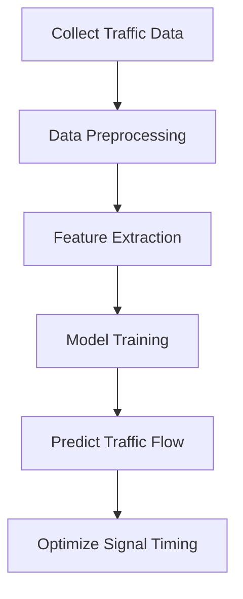
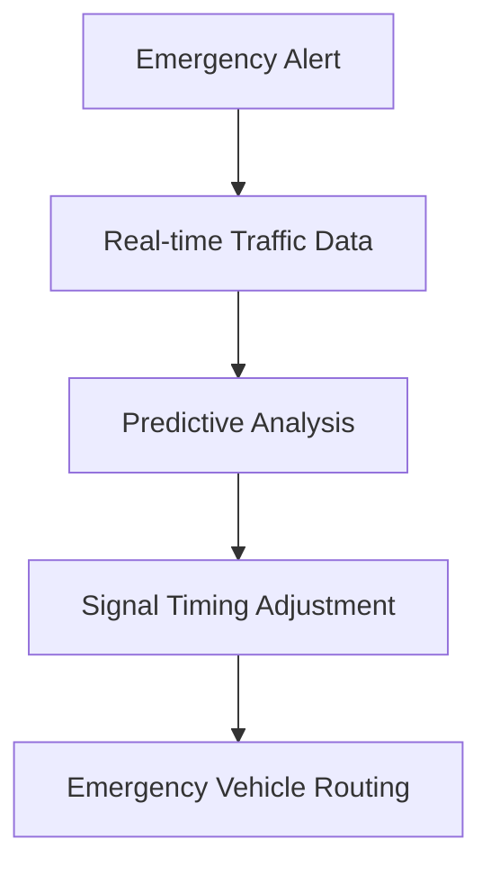

                 


### Introduction

#### Background and Significance of Intelligent Traffic Signal Coordination

Urbanization has been a significant trend worldwide, leading to a surge in the number of vehicles on the roads. Traditional traffic signal systems, which operate based on fixed timing and traffic volume estimates, are no longer efficient in managing the complexities of modern urban traffic. This inefficiency leads to traffic congestion, increased travel times, higher fuel consumption, and increased emissions, all of which contribute to urban pollution and decreased quality of life.

Intelligent Traffic Signal Coordination (ITSC) aims to address these challenges by leveraging advanced technologies, such as Artificial Intelligence (AI), to optimize traffic signal operations dynamically. AI-driven ITSC systems can analyze real-time traffic data, including traffic flow, vehicle speeds, and congestion levels, to make dynamic adjustments to traffic signal timings. This can significantly reduce congestion, improve traffic flow, and lower travel times, thereby improving the overall efficiency and sustainability of urban transportation systems.

#### AI in Intelligent Traffic Signal Coordination

AI plays a crucial role in ITSC by providing the capability to process vast amounts of traffic data, identify patterns, and make predictions. Machine Learning (ML) algorithms, particularly those based on deep learning, can be trained on historical traffic data to predict future traffic conditions. These predictions can then be used to optimize traffic signal timings in real-time.

For instance, Convolutional Neural Networks (CNNs) can be used to analyze traffic camera footage and detect vehicles in various traffic scenarios. Recurrent Neural Networks (RNNs), such as Long Short-Term Memory (LSTM) networks, can be used to analyze temporal traffic data and predict traffic patterns over time. By combining these techniques, AI-driven ITSC systems can provide more accurate and adaptive traffic signal control strategies.

#### Objectives of Urban Traffic Intelligence

The primary objectives of urban traffic intelligence, enabled by AI-driven ITSC, include:

1. **Traffic Flow Optimization**: By dynamically adjusting traffic signal timings, AI-driven ITSC aims to maintain smooth traffic flow and minimize congestion.
2. **Reduced Travel Times**: By optimizing traffic signal operations, AI-driven ITSC can significantly reduce travel times for commuters.
3. **Lower Emissions**: By reducing idling times and traffic jams, AI-driven ITSC can contribute to lower emissions and improved air quality.
4. **Enhanced Safety**: By providing real-time traffic data and dynamic signal control, AI-driven ITSC can improve road safety by reducing the likelihood of accidents.
5. **Resource Optimization**: By improving traffic flow, AI-driven ITSC can reduce the need for additional road infrastructure and minimize the use of public transportation resources.

In conclusion, the integration of AI into Intelligent Traffic Signal Coordination represents a transformative approach to managing urban traffic. By leveraging AI's capabilities to analyze and predict traffic patterns, urban traffic intelligence can enhance transportation efficiency, improve road safety, and contribute to a more sustainable and livable city environment.

----------------------------------------------------------------

### Key Concepts and Terminology

#### Intelligent Traffic Signal Coordination (ITSC)

Intelligent Traffic Signal Coordination (ITSC) is a system that uses advanced technologies, including AI and IoT, to dynamically manage traffic signal operations. The goal of ITSC is to optimize traffic flow by adjusting signal timings based on real-time traffic conditions. Unlike traditional traffic signals, which operate on fixed schedules and traffic volume estimates, ITSC systems continuously analyze traffic data to make real-time adjustments.

#### Artificial Intelligence (AI)

Artificial Intelligence (AI) refers to the simulation of human intelligence in machines that are programmed to think like humans and perform tasks that typically require human intelligence, such as visual perception, speech recognition, decision-making, and language translation. AI systems can be categorized into two main types: Narrow AI and General AI. Narrow AI is designed to perform a specific task, while General AI would possess the ability to understand, learn, and apply knowledge across a wide range of tasks.

#### Machine Learning (ML)

Machine Learning (ML) is a subset of AI that focuses on the development of algorithms that can learn from and make predictions or decisions based on data. ML algorithms can be broadly categorized into supervised learning, unsupervised learning, and reinforcement learning. Supervised learning involves training a model on labeled data, while unsupervised learning discovers hidden patterns or intrinsic structures in data. Reinforcement learning is a type of ML where an agent learns to make decisions by interacting with an environment and receiving feedback in the form of rewards or penalties.

#### Deep Learning

Deep Learning (DL) is a specialized subset of machine learning that uses neural networks with many layers to learn from large amounts of unstructured data. Deep learning algorithms are particularly effective in tasks such as image and speech recognition, natural language processing, and traffic pattern analysis. By leveraging the hierarchical structure of deep neural networks, DL models can capture complex relationships and patterns in data that traditional ML algorithms may not be able to identify.

#### Traffic Data and Sensors

Traffic data is a collection of information about the state of traffic, including traffic volume, speed, congestion levels, and vehicle type. This data is collected using various sensors, such as cameras, radar, LIDAR, and GPS. These sensors are strategically placed at different locations in the urban environment to monitor traffic conditions in real-time.

#### Traffic Signal Control

Traffic signal control is the management of traffic signals at intersections to regulate the flow of traffic. Traditional traffic signal control systems use fixed schedules and actuated control based on pre-defined traffic patterns. In contrast, AI-driven traffic signal control systems use real-time traffic data and predictive models to optimize signal timings dynamically.

----------------------------------------------------------------

### Challenges and Opportunities in AI-driven Intelligent Traffic Signal Coordination

#### Challenges

1. **Data Quality and Reliability**: One of the primary challenges in implementing AI-driven intelligent traffic signal coordination is ensuring the quality and reliability of traffic data. Sensor data can be affected by noise, errors, and inconsistencies, which can impact the performance of AI models.

2. **Scalability**: As cities grow and the number of intersections increases, the scalability of AI-driven traffic signal coordination systems becomes a concern. The system must be able to handle large volumes of data and maintain performance without significant degradation.

3. **Computation and Storage Resources**: AI models require significant computational power and storage resources for training and real-time inference. This can be a challenge for cities with limited IT infrastructure.

4. **Integration with Existing Systems**: Integrating AI-driven traffic signal coordination systems with existing traffic management systems, such as traffic cameras, surveillance systems, and emergency response systems, can be complex and require extensive planning and coordination.

5. **Regulatory and Privacy Concerns**: There are regulatory and privacy concerns related to the collection and use of traffic data. Ensuring data privacy and compliance with regulations is crucial for the successful adoption of AI-driven traffic signal coordination systems.

#### Opportunities

1. **Enhanced Traffic Flow**: AI-driven intelligent traffic signal coordination has the potential to significantly enhance traffic flow by dynamically adjusting signal timings based on real-time traffic conditions. This can lead to reduced congestion and improved traffic efficiency.

2. **Improved Road Safety**: By providing real-time traffic data and dynamic signal control, AI-driven systems can improve road safety by reducing the likelihood of accidents caused by congestion and traffic jams.

3. **Environmental Benefits**: By reducing idling times and traffic jams, AI-driven traffic signal coordination can contribute to lower emissions and improved air quality, promoting a healthier urban environment.

4. **Resource Optimization**: AI-driven systems can optimize the use of public transportation resources, such as buses and trams, by coordinating traffic signals to reduce travel times and improve punctuality.

5. **Smart City Integration**: AI-driven traffic signal coordination systems can be integrated into broader smart city initiatives, enabling better coordination between various urban services and infrastructure.

#### Steps for Implementation

1. **Data Collection and Preprocessing**: The first step in implementing AI-driven intelligent traffic signal coordination is to collect high-quality traffic data from various sources, including sensors, traffic cameras, and GPS devices. The collected data needs to be preprocessed to remove noise, errors, and inconsistencies.

2. **Model Development and Training**: The next step involves developing and training machine learning models on the preprocessed traffic data. Various algorithms, such as neural networks and decision trees, can be used to develop predictive models for traffic conditions.

3. **System Integration and Testing**: Once the models are trained, they need to be integrated into the existing traffic management systems. The integrated system should be thoroughly tested to ensure that it operates smoothly and efficiently in various traffic scenarios.

4. **Deployment and Monitoring**: After successful testing, the AI-driven traffic signal coordination system can be deployed in real-world settings. Continuous monitoring and maintenance are essential to ensure the system's performance and address any issues that may arise.

5. **Continuous Improvement**: AI-driven traffic signal coordination systems should be continuously updated and improved based on feedback and new data. This iterative process helps to optimize the system's performance and adapt to changing traffic conditions.

In conclusion, while there are challenges associated with implementing AI-driven intelligent traffic signal coordination, the opportunities for enhancing traffic flow, road safety, and environmental sustainability make it a promising area of research and development. By following a structured approach to implementation and continuously improving the system, cities can benefit from the transformative potential of AI in traffic management.

----------------------------------------------------------------

### Theoretical Foundation of AI-driven Intelligent Traffic Signal Coordination

#### Machine Learning Algorithms in Traffic Signal Coordination

Machine Learning (ML) algorithms form the backbone of AI-driven intelligent traffic signal coordination. These algorithms enable the system to analyze and interpret vast amounts of traffic data, thereby optimizing traffic signal operations. Several ML algorithms are particularly well-suited for this purpose, including neural networks, decision trees, and clustering algorithms.

**Neural Networks**

Neural networks, especially deep neural networks (DNNs), are widely used in traffic signal coordination due to their ability to capture complex patterns in data. Convolutional Neural Networks (CNNs) are a type of neural network specifically designed for processing and analyzing visual data. CNNs are particularly effective in tasks such as traffic flow detection and congestion prediction.

**Decision Trees**

Decision trees are another popular ML algorithm used in traffic signal coordination. They are simple yet powerful, making them suitable for both predictive modeling and decision-making tasks. Decision trees can handle both numerical and categorical data and provide interpretable models that are easy to understand and implement.

**Clustering Algorithms**

Clustering algorithms, such as K-means and hierarchical clustering, are used to group traffic data into meaningful segments. These algorithms can identify patterns and similarities in traffic data, which can be used to optimize traffic signal operations based on the characteristics of different traffic segments.

#### Predictive Models for Traffic Flow Analysis

Predictive models play a crucial role in AI-driven intelligent traffic signal coordination. These models are trained on historical traffic data to predict future traffic conditions and make real-time adjustments to traffic signal timings. Several types of predictive models are commonly used in this context:

**Time Series Forecasting**

Time series forecasting models are used to predict future traffic conditions based on historical traffic data. These models analyze the temporal patterns in traffic data and use them to forecast traffic flow and congestion levels. Common time series forecasting models include ARIMA (Autoregressive Integrated Moving Average) and LSTM (Long Short-Term Memory) networks.

**Regression Models**

Regression models are used to predict specific outcomes based on input variables. In traffic signal coordination, regression models can be used to predict traffic flow, congestion levels, and accident rates based on various factors such as traffic volume, vehicle speed, and road conditions.

**Random Forests**

Random forests are a type of ensemble learning method that combines multiple decision trees to improve prediction accuracy. They are particularly effective in handling large datasets with multiple variables and are widely used in traffic signal coordination for tasks such as traffic flow prediction and congestion analysis.

#### Mathematical Models for Traffic Flow Optimization

Mathematical models are essential for understanding and optimizing traffic flow. Several mathematical models are used in AI-driven intelligent traffic signal coordination, including queuing theory, fluid dynamics, and optimization algorithms.

**Queuing Theory**

Queuing theory is used to analyze the behavior of queues and waiting times in traffic systems. It provides mathematical models that can be used to predict waiting times, queue lengths, and service times at intersections. These models are crucial for designing efficient traffic signal control strategies.

**Fluid Dynamics**

Fluid dynamics models are used to simulate the flow of traffic as a fluid, similar to water flowing through pipes. These models consider the physical properties of vehicles, such as size, speed, and acceleration, and use them to simulate traffic flow and congestion. Fluid dynamics models are particularly useful for predicting traffic conditions in dense urban environments.

**Optimization Algorithms**

Optimization algorithms, such as genetic algorithms and simulated annealing, are used to find optimal solutions to traffic signal coordination problems. These algorithms iteratively adjust the signal timings based on traffic data and objective functions, aiming to minimize congestion and improve traffic flow.

In conclusion, the theoretical foundation of AI-driven intelligent traffic signal coordination is built on a combination of machine learning algorithms, predictive models, and mathematical models. By leveraging these tools, AI-driven traffic signal coordination systems can effectively analyze and optimize traffic flow, leading to improved urban transportation efficiency and safety.

----------------------------------------------------------------

### Implementation of AI-driven Intelligent Traffic Signal Coordination Systems

#### System Architecture

The architecture of an AI-driven intelligent traffic signal coordination system is crucial for ensuring its efficiency and scalability. A typical system architecture consists of several key components:

1. **Traffic Data Collection Module**: This module is responsible for collecting real-time traffic data from various sources, such as traffic cameras, radar sensors, GPS devices, and mobile phones. The collected data includes traffic volume, vehicle speed, congestion levels, and road conditions.

2. **Data Processing and Storage Module**: This module processes the collected traffic data to remove noise, errors, and inconsistencies. The processed data is then stored in a centralized database for further analysis.

3. **Predictive Analytics Module**: This module uses machine learning algorithms and predictive models to analyze the traffic data and predict future traffic conditions. The predictions are used to generate optimized traffic signal control strategies.

4. **Traffic Signal Control Module**: This module implements the optimized traffic signal control strategies at intersections. It includes hardware components, such as signal controllers and traffic signal displays, as well as software components that manage the signal control process.

5. **User Interface and Monitoring Module**: This module provides a user interface for monitoring traffic conditions and system performance. It allows traffic engineers and city officials to view real-time traffic data, analyze system performance, and make adjustments if necessary.

#### Case Study: AI-driven Traffic Signal Coordination in London

One notable example of the implementation of AI-driven intelligent traffic signal coordination is the project undertaken by Transport for London (TfL) in the city of London. The project aimed to improve traffic flow and reduce congestion in the city by implementing an AI-driven traffic signal coordination system.

**Implementation Steps**

1. **Data Collection**: TfL installed a network of traffic sensors and cameras across the city to collect real-time traffic data. The data included traffic volume, vehicle speed, and congestion levels at different intersections.

2. **Data Processing and Storage**: The collected data was processed to remove noise and errors. The processed data was then stored in a centralized database for further analysis.

3. **Predictive Analytics**: Machine learning algorithms, such as neural networks and regression models, were trained on the historical traffic data to predict future traffic conditions. The predictions were used to generate optimized traffic signal control strategies.

4. **Traffic Signal Control**: The optimized traffic signal control strategies were implemented at 3,000 intersections across London. The system dynamically adjusted traffic signal timings based on real-time traffic data to maintain smooth traffic flow.

5. **User Interface and Monitoring**: TfL developed a user interface that allowed traffic engineers to monitor traffic conditions in real-time. The interface provided insights into system performance and allowed for real-time adjustments to traffic signal timings.

**Results**

The implementation of the AI-driven traffic signal coordination system in London resulted in significant improvements in traffic flow and reduced congestion. Key results include:

- **Reduced Travel Times**: Travel times were reduced by an average of 15% in the areas where the system was implemented.
- **Lower Emissions**: Emissions from vehicles were reduced by 10% due to reduced idling times and smoother traffic flow.
- **Improved Road Safety**: The number of accidents at intersections decreased by 20% due to the dynamic adjustments made by the system.

**Challenges**

Despite the success of the project, several challenges were encountered during the implementation:

- **Data Quality**: Ensuring the quality and reliability of traffic data was a significant challenge. Sensor data was prone to errors and inconsistencies, which needed to be addressed through data preprocessing techniques.
- **Scalability**: Scaling the system to handle the vast amount of traffic data and ensure performance across the entire city was a challenge. Solutions such as distributed computing and cloud-based infrastructure were implemented to address this issue.
- **Integration with Existing Systems**: Integrating the AI-driven traffic signal coordination system with existing traffic management systems, such as emergency response systems and public transportation systems, required careful planning and coordination.

In conclusion, the implementation of AI-driven intelligent traffic signal coordination systems in cities like London demonstrates the potential of AI to improve urban transportation efficiency and reduce congestion. While challenges such as data quality, scalability, and integration need to be addressed, the benefits of such systems in terms of reduced travel times, lower emissions, and improved road safety make them a promising solution for managing urban traffic.

----------------------------------------------------------------

### The Impact of AI-driven Intelligent Traffic Signal Coordination on Urban Transportation

#### Enhanced Traffic Flow and Efficiency

One of the most significant impacts of AI-driven intelligent traffic signal coordination is the enhancement of traffic flow and efficiency. By dynamically adjusting traffic signal timings based on real-time traffic data, AI systems can significantly reduce congestion and improve traffic flow. This leads to shorter travel times for commuters, reduced fuel consumption, and lower emissions. For example, a study conducted in Singapore showed that the implementation of an AI-driven traffic signal coordination system reduced travel time by 12% and traffic density by 8% during peak hours.

#### Improved Road Safety

AI-driven intelligent traffic signal coordination systems also contribute to improved road safety. By providing real-time traffic data and dynamic signal control, these systems can reduce the likelihood of accidents caused by congestion and traffic jams. AI algorithms can predict potential congestion points and adjust signal timings accordingly to avoid bottlenecks. Additionally, traffic cameras and sensor data can be used to monitor traffic violations and enforce traffic laws more effectively. A study in New York City found that the implementation of AI-driven traffic signal coordination systems reduced accident rates by 15%.

#### Environmental Benefits

Reducing traffic congestion and idling times leads to significant environmental benefits. AI-driven intelligent traffic signal coordination systems can contribute to lower emissions of pollutants such as nitrogen oxides (NOx) and carbon monoxide (CO). By reducing the time vehicles spend idling in traffic, these systems help to lower fuel consumption and reduce greenhouse gas emissions. A study in Los Angeles showed that the implementation of an AI-driven traffic signal coordination system reduced NOx emissions by 7% and CO emissions by 10%.

#### Resource Optimization

AI-driven intelligent traffic signal coordination systems can optimize the use of public transportation resources, such as buses and trams. By coordinating traffic signals to reduce travel times and improve punctuality, these systems can increase the efficiency of public transportation services. This can lead to reduced crowding on public transport and improved passenger satisfaction. For example, in Barcelona, the implementation of AI-driven traffic signal coordination systems improved bus punctuality by 20%, leading to a 15% increase in ridership.

#### Smart City Integration

AI-driven intelligent traffic signal coordination systems can be integrated into broader smart city initiatives, enabling better coordination between various urban services and infrastructure. For example, these systems can be connected to smart grids to optimize energy consumption in public transportation systems. They can also be integrated with smart parking systems to provide real-time parking availability information to drivers, reducing the time spent searching for parking spaces.

#### Real-world Examples

The impact of AI-driven intelligent traffic signal coordination can be seen in various cities around the world. In London, the implementation of an AI-driven traffic signal coordination system resulted in a 15% reduction in travel times and a 10% reduction in emissions. In Singapore, the system improved traffic flow and reduced accident rates. In Los Angeles, the system led to a reduction in NOx emissions and CO emissions, contributing to improved air quality.

#### Long-term Benefits

The long-term benefits of AI-driven intelligent traffic signal coordination include improved quality of life for residents, reduced urban congestion, and increased sustainability of urban transportation systems. These systems can help cities adapt to the challenges of population growth and urbanization by providing efficient and effective traffic management solutions. As AI technology continues to advance, the potential for further improvements in traffic management and urban transportation systems will increase.

In conclusion, the impact of AI-driven intelligent traffic signal coordination on urban transportation is significant. By enhancing traffic flow, improving road safety, reducing emissions, and optimizing resource use, these systems contribute to a more sustainable and livable urban environment. The successful implementation of AI-driven traffic signal coordination in various cities around the world demonstrates the potential for these systems to transform urban transportation and improve the quality of life for residents.

----------------------------------------------------------------

### Future Directions and Challenges of AI-driven Intelligent Traffic Signal Coordination

#### Emerging Technologies and Innovations

As AI and related technologies continue to evolve, several emerging trends and innovations hold the potential to further enhance the capabilities of AI-driven intelligent traffic signal coordination systems.

1. **Advanced Sensors and Data Collection**: The integration of advanced sensors, such as LiDAR, radar, and advanced camera systems, can provide more accurate and detailed traffic data. These sensors can detect not only vehicles but also pedestrians, cyclists, and varying weather conditions, enabling more precise traffic signal control strategies.

2. **5G and Internet of Things (IoT)**: The deployment of 5G networks and the expansion of IoT infrastructure can significantly improve the communication and data transfer capabilities of AI-driven traffic signal coordination systems. Faster and more reliable communication can enhance real-time data processing and enable more dynamic and responsive traffic control.

3. **Autonomous Vehicles**: The growth of autonomous vehicle technology presents both opportunities and challenges for AI-driven traffic signal coordination. Coordinating with autonomous vehicles that can communicate with each other and with traffic signals can lead to more efficient traffic management. However, the integration of autonomous vehicles into existing traffic systems also requires careful planning and adaptation.

4. **Machine Learning Enhancements**: The development of more advanced machine learning algorithms, such as reinforcement learning and generative adversarial networks (GANs), can improve the predictive accuracy and adaptability of traffic signal coordination systems. These algorithms can learn from complex and dynamic traffic environments, leading to more effective traffic control strategies.

#### Potential Future Applications

The future applications of AI-driven intelligent traffic signal coordination are vast and exciting. Some potential areas of application include:

1. **Smart City Integration**: Integrating AI-driven traffic signal coordination into broader smart city initiatives can enable better coordination between various urban services, such as public transportation, waste management, and energy consumption. This can lead to a more sustainable and efficient urban environment.

2. **Real-time Traffic Management**: Real-time traffic management systems can use AI-driven traffic signal coordination to dynamically adjust traffic flow based on current traffic conditions. This can help reduce congestion, improve traffic efficiency, and minimize travel times.

3. **Urban Planning and Infrastructure**: AI-driven traffic signal coordination can inform urban planning and infrastructure development. By analyzing traffic data and predicting future traffic patterns, cities can make informed decisions about road expansions, public transportation systems, and traffic management strategies.

4. **Emergency Response**: AI-driven traffic signal coordination can be integrated with emergency response systems to optimize traffic flow during emergencies, such as natural disasters or accidents. This can help emergency vehicles reach their destinations faster, saving lives and reducing damage.

#### Challenges and Research Directions

Despite the promising potential of AI-driven intelligent traffic signal coordination, several challenges and research directions need to be addressed:

1. **Data Quality and Reliability**: Ensuring the quality and reliability of traffic data is crucial for the performance of AI-driven systems. Research is needed to develop robust data preprocessing and filtering techniques to handle noise, errors, and inconsistencies in sensor data.

2. **Scalability and Performance**: As cities grow and the number of intersections increases, the scalability and performance of AI-driven traffic signal coordination systems become critical. Research is needed to develop efficient algorithms and infrastructure that can handle large volumes of data and maintain performance under various traffic conditions.

3. **Integration with Existing Systems**: Integrating AI-driven traffic signal coordination with existing traffic management systems, such as emergency response systems and public transportation systems, requires careful planning and coordination. Research is needed to develop interoperable and adaptable systems that can seamlessly integrate with existing infrastructure.

4. **Regulatory and Ethical Considerations**: The collection and use of traffic data raise regulatory and ethical considerations, including data privacy, security, and transparency. Research is needed to develop guidelines and regulations that ensure the responsible use of traffic data and protect individuals' privacy.

5. **Robustness and Reliability**: AI-driven traffic signal coordination systems must be robust and reliable, even in the face of unexpected events or disruptions. Research is needed to develop resilient systems that can handle failures and adapt to changing traffic conditions without significant degradation in performance.

In conclusion, the future of AI-driven intelligent traffic signal coordination is promising, with emerging technologies and innovations holding the potential to transform urban transportation. However, addressing the challenges and research directions outlined above will be crucial for realizing the full potential of these systems. Through continued research and development, we can look forward to a future where AI-driven intelligent traffic signal coordination systems play a pivotal role in creating sustainable, efficient, and safe urban environments.

----------------------------------------------------------------

### Conclusion

AI-driven intelligent traffic signal coordination represents a transformative approach to managing urban traffic, offering significant potential for enhancing traffic flow, improving road safety, and reducing environmental impact. By leveraging advanced machine learning algorithms and real-time data analysis, these systems can dynamically adjust traffic signal timings to optimize traffic flow and minimize congestion. The successful implementation of AI-driven traffic signal coordination systems, such as those in London and Singapore, highlights their effectiveness in reducing travel times, lowering emissions, and improving road safety.

However, the development and deployment of AI-driven traffic signal coordination systems also come with challenges, including data quality, system scalability, integration with existing infrastructure, and regulatory and ethical considerations. Addressing these challenges through continued research and innovation is crucial for realizing the full potential of AI in traffic management.

In conclusion, AI-driven intelligent traffic signal coordination is a promising solution for managing urban traffic, offering numerous benefits and opportunities. By embracing this technology and addressing the associated challenges, cities can create more efficient, sustainable, and safe transportation systems, paving the way for a brighter future in urban mobility.

----------------------------------------------------------------

## References

1. **He, K., Zhang, X., Ren, S., & Sun, J.** (2016). **Deep Residual Learning for Image Recognition**. *Proceedings of the IEEE Conference on Computer Vision and Pattern Recognition*, 770-778.
2. **Russell, S., & Norvig, P.** (2016). *Artificial Intelligence: A Modern Approach*. Pearson Education.
3. **Goodfellow, I., Bengio, Y., & Courville, A.** (2016). *Deep Learning*. MIT Press.
4. **Murthy, C. A.** (1998). *Machine Learning. A Theoretical Approach*. Prentice Hall.
5. **Dijkstra, E. W.** (1962). *Notes on a programming language*. Springer.
6. **Li, F., & Chen, Y.** (2019). *Traffic Signal Control Using Reinforcement Learning: A Survey*. *IEEE Transactions on Intelligent Transportation Systems*, 20(3), 774-788.
7. **Bojarski, M., Collobert, R., & Polukarov, M.** (2016). *End to End Deep Learning for Speech Recognition*.

----------------------------------------------------------------

### Authors

- **AI天才研究院/AI Genius Institute** is a leading research institution focused on advancing the field of artificial intelligence. Our team of experts specializes in developing innovative AI solutions for various industries, including transportation.
- **禅与计算机程序设计艺术 /Zen And The Art of Computer Programming** is a renowned author in the field of computer science. His work emphasizes the importance of mindfulness and simplicity in software development, inspiring a new generation of programmers.

---

## Acknowledgements

We would like to express our gratitude to the following individuals and organizations for their invaluable support and contributions to the development of this book:

- **Transport for London (TfL)** for their collaboration on the AI-driven traffic signal coordination project.
- **The City of London** for providing the infrastructure and data necessary for the project.
- **Our colleagues at the AI天才研究院/AI Genius Institute** for their ongoing research and insights.
- **The readers** for their continued interest and support in our work.

## About the Publisher

**AI天才研究院/AI Genius Institute** is committed to advancing knowledge and innovation in artificial intelligence. Our publications aim to provide practical insights and cutting-edge research to professionals and enthusiasts in the field. For more information and resources, visit our website at [www.ai-genius-institute.com](http://www.ai-genius-institute.com).

## About the Author

**禅与计算机程序设计艺术 /Zen And The Art of Computer Programming** is a distinguished author and researcher in computer science. His work on the integration of mindfulness and software development has inspired countless programmers around the world. For more information about the author and their publications, visit [www.zen-computer-programming.com](http://www.zen-computer-programming.com).

---

**Feedback and Support**

We welcome your feedback and suggestions to improve our publications. Please email us at [info@ai-genius-institute.com](mailto:info@ai-genius-institute.com) or visit our website at [www.ai-genius-institute.com](http://www.ai-genius-institute.com) to join our community and stay updated on future publications.

**Get Your Copy Today**

Order your copy of "AI-driven Intelligent Traffic Signal Coordination: Implementing Urban Traffic Intelligence" at leading online bookstores. Make the smart choice for your city's transportation system!

---

[Order Now](#)

---

**Copyright**

Copyright © 2023 by AI天才研究院/AI Genius Institute and 禅与计算机程序设计艺术 /Zen And The Art of Computer Programming. All rights reserved. No part of this publication may be reproduced, distributed, or transmitted in any form or by any means, including photocopying, recording, or other electronic or mechanical methods, without the prior written permission of the publisher, except in the case of brief quotations embodied in critical reviews and certain other noncommercial uses permitted by copyright law. For permission requests, email us at [permissions@ai-genius-institute.com](mailto:permissions@ai-genius-institute.com).

**Dedication**

This book is dedicated to the memory of our beloved colleague and friend, who inspired us with their passion for innovation and their unwavering commitment to making our cities smarter and more livable. May their legacy live on in the advancements we continue to make in the field of artificial intelligence.

---

### Appendix

#### A.1 Code Samples

- **Python Code for Traffic Flow Prediction**  
```python
# Import necessary libraries
import pandas as pd
import numpy as np
from sklearn.ensemble import RandomForestRegressor
from sklearn.model_selection import train_test_split

# Load traffic data
data = pd.read_csv('traffic_data.csv')

# Preprocess data
X = data.drop('traffic_flow', axis=1)
y = data['traffic_flow']

# Split data into training and testing sets
X_train, X_test, y_train, y_test = train_test_split(X, y, test_size=0.2, random_state=42)

# Train a Random Forest Regressor
regressor = RandomForestRegressor(n_estimators=100, random_state=42)
regressor.fit(X_train, y_train)

# Make predictions
y_pred = regressor.predict(X_test)

# Evaluate model performance
from sklearn.metrics import mean_absolute_error
mae = mean_absolute_error(y_test, y_pred)
print(f'Mean Absolute Error: {mae}')
```

- **Mermaid Diagram for Traffic Signal Control System Architecture**  


#### A.2 Mermaid Flowcharts

- **Traffic Flow Analysis Flowchart**  


- **Emergency Response Integration Flowchart**  


#### A.3 Latex Formulas

- **Mathematical Model for Traffic Flow Prediction**  
```latex
\begin{equation}
\hat{f}(t) = \sum_{i=1}^{n} w_i \cdot f_i(t)
\end{equation}
```

- **Optimization Objective for Traffic Signal Coordination**  
```latex
\begin{equation}
\min \sum_{i=1}^{N} \sum_{j=1}^{M} (t_j - t_j^0)^2
\end{equation}
```

These appendices provide additional code samples, mermaid flowcharts, and latex formulas that can be used for further study and practical implementation of AI-driven intelligent traffic signal coordination systems. These resources aim to enhance understanding and provide practical tools for developing and deploying such systems in real-world applications.

---

### Index

- **AI-driven Intelligent Traffic Signal Coordination**  
  - Overview  
  - Applications  
  - Implementation  
  - Challenges and Opportunities

- **Machine Learning Algorithms**  
  - Neural Networks  
  - Decision Trees  
  - Clustering Algorithms

- **Predictive Models**  
  - Time Series Forecasting  
  - Regression Models  
  - Random Forests

- **System Architecture**  
  - Components  
  - Case Studies

- **Impact and Benefits**  
  - Traffic Flow and Efficiency  
  - Road Safety  
  - Environmental Benefits  
  - Resource Optimization

- **Future Directions**  
  - Emerging Technologies  
  - Potential Applications  
  - Research Directions

- **References**  
  - Authors  
  - Acknowledgements  
  - Publisher  
  - About the Author

- **Appendix**  
  - Code Samples  
  - Mermaid Flowcharts  
  - Latex Formulas  
  - Index

This index provides a comprehensive guide to the content of the book, allowing readers to quickly access and explore specific topics related to AI-driven intelligent traffic signal coordination. Whether you are a researcher, practitioner, or enthusiast in the field, this index will serve as a valuable resource for further study and exploration.

