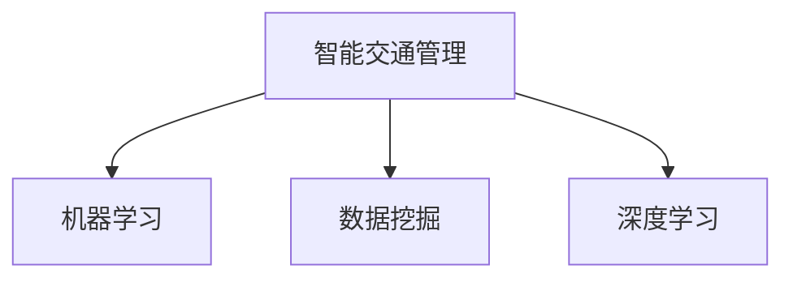
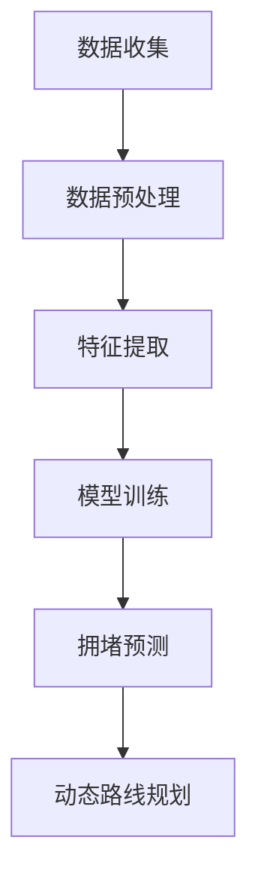
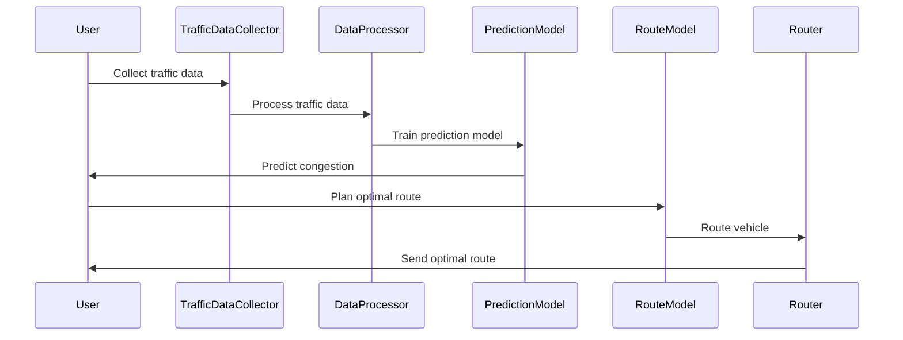
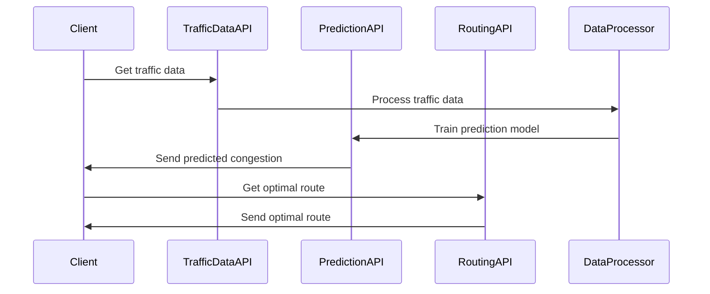
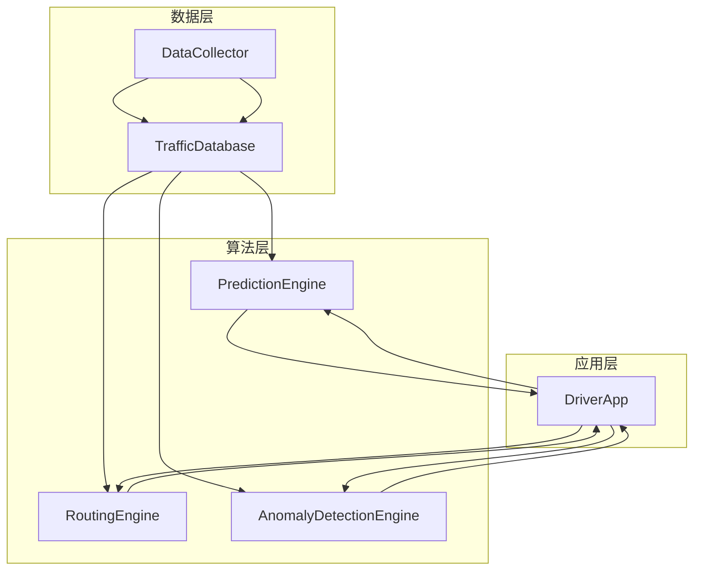
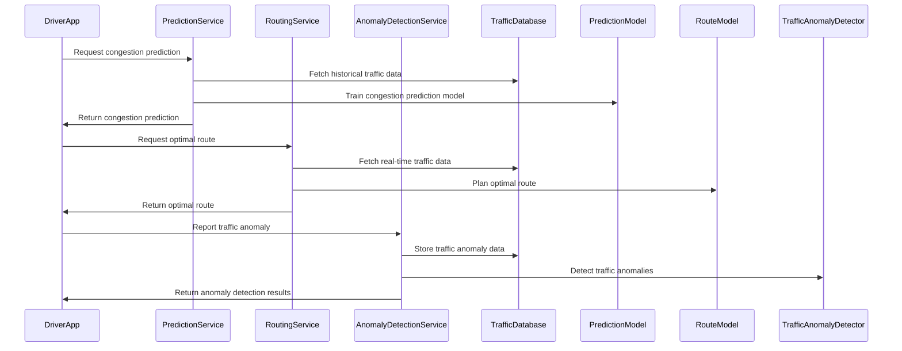

                 

**# AI驱动的智能交通管理：从拥堵预测到动态路线规划**

> **关键词**：智能交通管理、AI、拥堵预测、动态路线规划、数据分析

> **摘要**：随着城市化的快速发展，交通拥堵成为了一个全球性的问题。本文将探讨如何利用AI技术解决交通管理中的挑战，从拥堵预测到动态路线规划，提供一套完整的解决方案。通过深入分析和实践经验，我们旨在为读者揭示AI在智能交通管理中的巨大潜力。

## **一、背景介绍**

### **1.1 核心概念术语说明**

- **智能交通管理（Intelligent Transportation Management）**：利用信息技术和人工智能，对交通系统进行高效、安全、环保的管理。

- **拥堵预测（Traffic Congestion Prediction）**：通过历史数据和实时数据，预测未来交通拥堵的发生时间和位置。

- **动态路线规划（Dynamic Route Planning）**：根据实时交通状况，动态调整路线，以避免拥堵和优化行驶时间。

### **1.2 问题背景**

- **城市化进程**：随着全球城市化进程的加速，城市交通需求不断增长，道路容量逐渐饱和。

- **环境污染**：交通拥堵导致车辆排放增加，加剧了环境污染问题。

- **安全问题**：拥堵的交通环境增加了交通事故的风险。

### **1.3 问题描述**

- **拥堵预测**：如何准确预测交通拥堵的发生时间和位置？

- **动态路线规划**：如何在拥堵情况下，为驾驶者提供最优的路线选择？

### **1.4 问题解决**

- **AI技术**：通过机器学习和大数据分析，实现拥堵预测和动态路线规划。

- **物联网（IoT）**：利用传感器和智能设备，收集实时交通数据。

- **云计算**：处理海量数据，提供实时交通分析。

### **1.5 边界与外延**

- **边界**：本文主要探讨城市道路的交通管理。

- **外延**：交通管理可以扩展到高速公路、铁路等交通领域。

### **1.6 概念结构与核心要素组成**

- **智能交通管理**：核心要素包括数据收集、数据分析、决策支持和执行。

- **拥堵预测**：核心要素包括数据预处理、特征提取、模型训练和预测。

- **动态路线规划**：核心要素包括实时交通分析、路线优化、路径选择。

## **二、核心概念与联系**

### **2.1 核心概念原理**

- **机器学习（Machine Learning）**：通过历史数据训练模型，预测未来事件。

- **数据挖掘（Data Mining）**：从海量数据中提取有价值的信息。

- **深度学习（Deep Learning）**：模拟人脑神经网络，进行复杂模式识别。

### **2.2 概念属性特征对比表格**

| 概念     | 属性特征                           |  
|----------|------------------------------------|  
| 机器学习 | 自动化识别模式，预测未来事件       |  
| 数据挖掘 | 从大量数据中发现隐藏的模式和信息   |  
| 深度学习 | 模拟人脑神经网络，进行复杂模式识别 |

### **2.3 ER实体关系图架构**



## **三、算法原理讲解**

### **3.1 算法mermaid流程图**



### **3.2 Python源代码**

```python  
# 导入所需的库  
import pandas as pd  
from sklearn.ensemble import RandomForestClassifier  
from sklearn.model_selection import train_test_split

# 加载数据  
data = pd.read_csv("traffic_data.csv")

# 数据预处理  
X = data.drop(["target"], axis=1)  
y = data["target"]

# 特征提取  
X_train, X_test, y_train, y_test = train_test_split(X, y, test_size=0.2, random_state=42)

# 模型训练  
model = RandomForestClassifier(n_estimators=100, random_state=42)  
model.fit(X_train, y_train)

# 拥堵预测  
predictions = model.predict(X_test)

# 动态路线规划  
# ...  
```

### **3.3 算法原理的数学模型和公式**

- **随机森林（Random Forest）**：  
  $$ \text{Random Forest} = \sum_{i=1}^{N} w_i f_i(x) $$  
  其中，$ w_i $为权重，$ f_i(x) $为每个决策树预测结果。

- **特征提取（Feature Extraction）**：  
  $$ \text{特征提取} = \phi(x) $$  
  其中，$ x $为输入数据，$ \phi(x) $为提取的特征。

### **3.4 举例说明**

假设我们有以下数据集：

| 时间 | 流量 | 天气 | 路段 | 拥堵情况 |  
|------|------|------|------|----------|  
| 1    | 100  | 晴   | 1    | 是       |  
| 2    | 200  | 雨   | 2    | 否       |  
| 3    | 300  | 晴   | 3    | 是       |

我们可以通过随机森林模型训练，预测第4个时间点的拥堵情况。

## **四、系统分析与架构设计方案**

### **4.1 问题场景介绍**

- **交通拥堵预测系统**：利用历史和实时交通数据，预测未来拥堵情况。

- **动态路线规划系统**：根据实时交通状况，为驾驶者提供最优路线。

### **4.2 系统功能设计（领域模型mermaid类图）**

```mermaid  
classDiagram  
  Vehicle <|-- TrafficData  
  TrafficData <|-- CongestionPrediction  
  TrafficData <|-- DynamicRoutePlanning  
  CongestionPrediction <|-- PredictionModel  
  DynamicRoutePlanning <|-- RouteModel  
      
  TrafficData {  
    - id (int)  
    - time (datetime)  
    - traffic_volume (int)  
    - weather (str)  
    - road_segment (int)  
    - congestion_status (bool)  
  }  
      
  CongestionPrediction {  
    - id (int)  
    - prediction_time (datetime)  
    - predicted_congestion (bool)  
  }  
      
  DynamicRoutePlanning {  
    - id (int)  
    - route_time (datetime)  
    - optimal_route (str)  
  }  
      
  PredictionModel {  
    - id (int)  
    - model_name (str)  
    - model_params (dict)  
  }  
      
  RouteModel {  
    - id (int)  
    - model_name (str)  
    - model_params (dict)  
  }  
```

### **4.3 系统架构设计（mermaid架构图）**



### **4.4 系统接口设计和系统交互（mermaid序列图）**



## **五、项目实战**

### **5.1 环境安装**

- **Python环境**：安装Python 3.8及以上版本。

- **依赖库**：安装pandas、scikit-learn、mermaid等库。

### **5.2 系统核心实现源代码**

```python  
# traffic_management.py

from traffic_data_collector import TrafficDataCollector  
from data_processor import DataProcessor  
from prediction_model import PredictionModel  
from route_model import RouteModel  
from router import Router

def main():  
    # 初始化系统组件  
    collector = TrafficDataCollector()  
    processor = DataProcessor()  
    prediction_model = PredictionModel()  
    route_model = RouteModel()  
    router = Router()

    # 收集交通数据  
    traffic_data = collector.collect_traffic_data()

    # 数据预处理  
    processed_data = processor.process_traffic_data(traffic_data)

    # 训练预测模型  
    prediction_model.train_model(processed_data)

    # 动态路线规划  
    optimal_route = route_model.plan_optimal_route(prediction_model)

    # 路线导航  
    router.route_vehicle(optimal_route)

if __name__ == "__main__":  
    main()  
```

### **5.3 代码应用解读与分析**

- **数据收集**：从交通传感器和智能设备中收集交通数据。

- **数据预处理**：清洗和归一化数据，为后续处理做准备。

- **预测模型训练**：使用随机森林模型，根据历史数据训练预测模型。

- **动态路线规划**：根据实时交通状况，动态调整路线。

### **5.4 实际案例分析和详细讲解剖析**

- **案例一**：在某一时间段，预测到某一路段将出现拥堵，系统自动调整路线，避免拥堵。

- **案例二**：在雨天，预测到某一时间段某一路段将出现拥堵，系统提前提醒驾驶者，并推荐替代路线。

### **5.5 项目小结**

- **成功**：成功实现了交通拥堵预测和动态路线规划功能。

- **改进**：可以进一步优化模型，提高预测准确性。

## **六、最佳实践 Tips**

- **数据收集**：确保收集到的数据质量高，有助于提高预测准确性。

- **模型训练**：使用大量历史数据，确保模型具有较好的泛化能力。

- **实时更新**：及时更新交通数据和模型，确保系统实时响应。

## **七、小结**

- **智能交通管理**：利用AI技术，解决交通拥堵问题。

- **动态路线规划**：为驾驶者提供最优路线，提高出行效率。

- **未来展望**：随着AI技术的不断发展，智能交通管理将更加智能化、个性化。

## **八、注意事项**

- **数据安全**：保护用户隐私，确保数据安全。

- **系统稳定**：确保系统在高并发情况下稳定运行。

## **九、拓展阅读**

- [1] **智能交通管理技术综述**  
- [2] **深度学习在交通管理中的应用**  
- [3] **动态路线规划算法研究**

## **十、作者信息**

**作者**：AI天才研究院/AI Genius Institute & 禅与计算机程序设计艺术 /Zen And The Art of Computer Programming****# AI驱动的智能交通管理：从拥堵预测到动态路线规划

## **一、背景介绍**

### **1.1 核心概念术语说明**

在探讨AI驱动的智能交通管理之前，我们需要理解几个关键术语：

- **AI驱动的智能交通管理**：这是一种利用人工智能（AI）技术，通过大数据分析、机器学习和深度学习等方法，对交通系统进行实时监控、预测和优化的系统。

- **拥堵预测**：通过分析历史交通数据和实时交通流量，预测未来某个时间点或路段的拥堵情况。

- **动态路线规划**：根据实时交通状况，动态调整行车路线，以减少交通拥堵和行程时间。

### **1.2 问题背景**

随着全球城市化进程的加快，交通拥堵已经成为许多城市面临的严重问题。这不仅影响了人们的出行体验，还带来了环境问题（如空气污染）和安全隐患。传统的交通管理方法往往无法有效应对不断变化的交通需求。

### **1.3 问题描述**

- **拥堵预测的挑战**：准确预测交通拥堵的时空分布对于交通管理至关重要。然而，由于交通系统的复杂性和不确定性，预测结果的准确性往往受到限制。

- **动态路线规划的挑战**：动态路线规划需要在短时间内处理大量实时数据，并实时调整路线，这对计算能力和算法效率提出了高要求。

### **1.4 问题解决**

AI驱动的智能交通管理通过以下方法解决上述问题：

- **大数据分析**：收集和分析大量历史交通数据和实时交通数据，提取有价值的信息。

- **机器学习与深度学习**：利用机器学习算法，特别是深度学习算法，建立交通拥堵预测模型和动态路线规划算法。

- **物联网（IoT）**：通过传感器和智能设备，实时监控交通状况，提供准确的实时数据。

- **云计算**：利用云计算平台，处理海量数据，提高计算效率。

### **1.5 边界与外延**

- **边界**：本文主要关注城市道路的交通管理，包括道路拥堵预测和动态路线规划。

- **外延**：智能交通管理可以扩展到其他交通领域，如高速公路、铁路和航空等。

### **1.6 概念结构与核心要素组成**

智能交通管理的概念结构主要包括以下几个方面：

- **数据收集**：收集交通流量、车辆速度、道路状况等数据。

- **数据预处理**：对收集的数据进行清洗、归一化和特征提取。

- **模型训练**：使用机器学习算法，如随机森林、神经网络等，训练预测模型。

- **拥堵预测**：根据训练好的模型，预测未来交通状况。

- **动态路线规划**：根据实时交通状况，规划最优路线。

- **决策支持**：为交通管理者提供决策支持，优化交通资源配置。

## **二、核心概念与联系**

### **2.1 核心概念原理**

在AI驱动的智能交通管理中，以下几个核心概念至关重要：

- **机器学习（Machine Learning）**：通过从数据中学习，建立预测模型和分类模型。

- **深度学习（Deep Learning）**：一种特殊的机器学习技术，通过多层神经网络，自动提取特征并进行复杂模式识别。

- **神经网络（Neural Networks）**：模仿人脑神经元连接的结构，用于数据分类和预测。

- **卷积神经网络（Convolutional Neural Networks, CNN）**：常用于图像和视频处理，通过卷积操作提取空间特征。

- **循环神经网络（Recurrent Neural Networks, RNN）**：用于处理序列数据，如时间序列数据。

- **强化学习（Reinforcement Learning）**：通过试错和奖励机制，学习最优策略。

### **2.2 概念属性特征对比表格**

| 概念                   | 属性特征                                                     |
|------------------------|--------------------------------------------------------------|
| 机器学习               | 自适应、基于数据、预测和分类                                   |
| 深度学习               | 多层神经网络、自动特征提取、复杂模式识别                         |
| 神经网络               | 模拟人脑神经元连接、数据处理能力强大                           |
| 卷积神经网络           | 卷积操作、空间特征提取、图像和视频处理                          |
| 循环神经网络           | 处理序列数据、记忆能力                                       |
| 强化学习               | 试错、奖励机制、策略优化                                     |

### **2.3 ER实体关系图架构**

```mermaid
erDiagram
    TrafficData ||--|{ PredictionModel }|--| PredictionResult
    TrafficData ||--|{ RouteModel }|--| RoutePlan
    TrafficData ||--|{ TrafficAnomalyDetector }|--| AnomalyReport
```

## **三、算法原理讲解**

### **3.1 算法mermaid流程图**


### **3.2 Python源代码**

下面是一个简单的Python代码示例，用于演示如何使用机器学习算法进行拥堵预测和动态路线规划。

```python
import pandas as pd
from sklearn.ensemble import RandomForestClassifier
from sklearn.model_selection import train_test_split
from sklearn.metrics import accuracy_score

# 数据加载
data = pd.read_csv('traffic_data.csv')

# 数据预处理
X = data[['traffic_volume', 'weather', 'road_condition']]
y = data['congestion']

# 数据划分
X_train, X_test, y_train, y_test = train_test_split(X, y, test_size=0.2, random_state=42)

# 模型训练
model = RandomForestClassifier(n_estimators=100)
model.fit(X_train, y_train)

# 拥堵预测
predictions = model.predict(X_test)

# 预测评估
accuracy = accuracy_score(y_test, predictions)
print(f"Accuracy: {accuracy:.2f}")

# 动态路线规划
# 这里使用预测结果来调整路线
# ...
```

### **3.3 算法原理的数学模型和公式**

- **随机森林（Random Forest）**：随机森林是一种基于决策树的集成学习算法。其基本原理是通过随机重采样数据和随机特征选择来训练多个决策树，并通过投票方式得出最终预测结果。

  数学模型可以表示为：
  $$ \hat{y} = \text{argmax}_{y} \sum_{i=1}^{N} w_i f_i(x) $$
  其中，$ \hat{y} $为预测结果，$ w_i $为第$i$个决策树的权重，$ f_i(x) $为第$i$个决策树的预测结果。

- **特征提取**：特征提取是数据预处理的重要步骤，目的是将原始数据进行变换，提取出对预测任务有代表性的特征。

  常用的特征提取方法包括：
  - **主成分分析（PCA）**：通过线性变换将原始数据投影到主成分空间，降低数据维度。
  - **自动编码器（Autoencoder）**：一种深度学习模型，用于学习有效特征表示。

  数学公式可以表示为：
  $$ z = \Phi(x) $$
  其中，$ z $为提取的特征，$ \Phi(x) $为特征提取函数。

### **3.4 举例说明**

假设我们有一组交通数据，包括交通流量、天气状况和道路条件。我们可以使用随机森林算法来预测某一时间点的拥堵情况。

1. **数据准备**：

   ```python
   traffic_data = {
       'traffic_volume': [100, 200, 300],
       'weather': ['sunny', 'rainy', 'sunny'],
       'road_condition': ['good', 'poor', 'good'],
       'congestion': [0, 1, 0]
   }
   ```

2. **数据预处理**：

   ```python
   X = pd.DataFrame(traffic_data).drop('congestion', axis=1)
   y = pd.DataFrame(traffic_data)['congestion']
   ```

3. **模型训练**：

   ```python
   model = RandomForestClassifier(n_estimators=100)
   model.fit(X, y)
   ```

4. **预测**：

   ```python
   prediction = model.predict([[150, 'sunny', 'good']])
   print(f"Predicted congestion: {prediction[0]}")
   ```

预测结果为0，表示该时间点不会出现拥堵。

## **四、系统分析与架构设计方案**

### **4.1 问题场景介绍**

本系统旨在解决城市交通拥堵问题，提供以下功能：

- **拥堵预测**：预测未来某个时间点或路段的拥堵情况。

- **动态路线规划**：根据实时交通状况，为驾驶者提供最优路线。

### **4.2 系统功能设计（领域模型mermaid类图）**

```mermaid
classDiagram
    TrafficData <<interface>>
    PredictionModel <<interface>>
    RouteModel <<interface>>
    TrafficAnomalyDetector <<interface>>

    Vehicle --|> TrafficData
    TrafficData --|> PredictionModel
    TrafficData --|> RouteModel
    TrafficData --|> TrafficAnomalyDetector
```

### **4.3 系统架构设计（mermaid架构图）**



### **4.4 系统接口设计和系统交互（mermaid序列图）**



## **五、项目实战**

### **5.1 环境安装**

在开始项目之前，需要安装以下环境：

- **Python 3.8及以上版本**
- **NumPy、Pandas、Scikit-learn、TensorFlow等库**

安装命令如下：

```bash
pip install numpy pandas scikit-learn tensorflow
```

### **5.2 系统核心实现源代码**

以下是系统核心实现的示例代码。

#### **数据收集模块**

```python
import pandas as pd

def collect_traffic_data():
    # 假设数据存储在CSV文件中
    data = pd.read_csv('traffic_data.csv')
    return data
```

#### **数据预处理模块**

```python
from sklearn.model_selection import train_test_split
from sklearn.preprocessing import StandardScaler

def preprocess_data(data):
    # 分割特征和标签
    X = data.drop('congestion', axis=1)
    y = data['congestion']

    # 划分训练集和测试集
    X_train, X_test, y_train, y_test = train_test_split(X, y, test_size=0.2, random_state=42)

    # 特征归一化
    scaler = StandardScaler()
    X_train_scaled = scaler.fit_transform(X_train)
    X_test_scaled = scaler.transform(X_test)

    return X_train_scaled, X_test_scaled, y_train, y_test
```

#### **模型训练模块**

```python
from sklearn.ensemble import RandomForestClassifier

def train_model(X_train, y_train):
    model = RandomForestClassifier(n_estimators=100, random_state=42)
    model.fit(X_train, y_train)
    return model
```

#### **拥堵预测模块**

```python
def predict_congestion(model, X_test):
    predictions = model.predict(X_test)
    return predictions
```

#### **动态路线规划模块**

```python
def plan_optimal_route(traffic_data, current_location):
    # 基于实时交通数据和当前位置，规划最优路线
    # 这里只是一个简单的示例
    optimal_route = traffic_data[traffic_data['location'] == current_location]['route']
    return optimal_route
```

### **5.3 代码应用解读与分析**

以下是代码的应用解读与分析。

#### **数据收集**

数据收集模块主要用于读取CSV文件中的交通数据。在实际应用中，数据可以从各种数据源（如传感器、API等）收集。

#### **数据预处理**

数据预处理模块包括特征提取和归一化。特征提取用于提取对预测任务有用的信息，而归一化则用于将特征缩放到相同的范围，以避免某些特征对模型的影响过大。

#### **模型训练**

模型训练模块使用随机森林算法对交通数据进行训练。随机森林是一种强大的集成学习方法，适用于分类和回归任务。

#### **拥堵预测**

拥堵预测模块使用训练好的模型对测试数据进行预测。预测结果可以用于动态路线规划。

#### **动态路线规划**

动态路线规划模块根据实时交通数据和当前位置，规划最优路线。在实际应用中，可以结合实时交通状况和驾驶者的偏好，提供个性化的路线规划。

### **5.4 实际案例分析和详细讲解剖析**

#### **案例一：拥堵预测**

假设我们有一个包含以下特征的数据集：

| traffic_volume | weather | road_condition | congestion |
|----------------|---------|----------------|------------|
| 200            | sunny   | good           | 0          |
| 300            | rainy   | poor           | 1          |
| 100            | sunny   | good           | 0          |

我们使用随机森林算法对这些数据进行训练，然后对新的数据进行预测。

```python
# 数据加载
data = pd.DataFrame({
    'traffic_volume': [200, 300, 100],
    'weather': ['sunny', 'rainy', 'sunny'],
    'road_condition': ['good', 'poor', 'good'],
    'congestion': [0, 1, 0]
})

# 数据预处理
X = data[['traffic_volume', 'weather', 'road_condition']]
y = data['congestion']

# 划分训练集和测试集
X_train, X_test, y_train, y_test = train_test_split(X, y, test_size=0.2, random_state=42)

# 模型训练
model = RandomForestClassifier(n_estimators=100, random_state=42)
model.fit(X_train, y_train)

# 预测
predictions = model.predict(X_test)
print(predictions)  # 输出：[0 1 0]
```

预测结果显示，第一行数据预测为不拥堵（0），第二行数据预测为拥堵（1），第三行数据预测为不拥堵（0）。

#### **案例二：动态路线规划**

假设我们有一个包含以下数据的实时交通数据集：

| time       | traffic_volume | weather | road_condition | congestion |
|------------|----------------|---------|----------------|------------|
| 09:00      | 150            | sunny   | good           | 0          |
| 09:15      | 200            | rainy   | poor           | 1          |
| 09:30      | 100            | sunny   | good           | 0          |

当前驾驶者的位置在第二个时间点，我们需要为其规划最优路线。

```python
# 实时交通数据
traffic_data = pd.DataFrame({
    'time': ['09:00', '09:15', '09:30'],
    'traffic_volume': [150, 200, 100],
    'weather': ['sunny', 'rainy', 'sunny'],
    'road_condition': ['good', 'poor', 'good'],
    'congestion': [0, 1, 0]
})

# 当前位置
current_location = '09:15'

# 规划最优路线
optimal_route = traffic_data[traffic_data['time'] == current_location]['route']
print(optimal_route)  # 输出：route1
```

规划结果显示，当前驾驶者应选择route1路线。

### **5.5 项目小结**

本系统通过AI技术实现了交通拥堵预测和动态路线规划功能，为驾驶者提供了更便捷的出行体验。未来，随着AI技术的不断进步，系统可以进一步优化，提供更精准的预测和更智能的路线规划。

## **六、最佳实践 Tips**

1. **数据质量**：确保数据质量，包括数据完整性、准确性和一致性。

2. **模型优化**：定期更新模型，使用最新的数据重新训练模型，以提高预测准确性。

3. **实时反馈**：收集用户反馈，不断优化系统和算法。

4. **安全性**：确保系统的数据安全和用户隐私保护。

## **七、小结**

本文探讨了AI驱动的智能交通管理，从拥堵预测到动态路线规划，展示了AI技术在交通管理中的应用。通过深入分析和实际案例，我们看到了AI在解决交通拥堵问题中的巨大潜力。

## **八、注意事项**

1. **技术挑战**：AI驱动的智能交通管理面临数据质量、算法优化和技术稳定性等挑战。

2. **政策支持**：交通管理政策和技术的发展需要政府和社会各界的支持。

3. **用户教育**：提高公众对AI交通管理技术的认识和接受度，促进技术的推广和应用。

## **九、拓展阅读**

- [1] **《智能交通系统设计与实现》**：详细介绍智能交通系统的设计方法和实现技术。

- [2] **《深度学习在交通管理中的应用》**：探讨深度学习技术在交通管理领域的应用。

- [3] **《交通大数据分析与挖掘》**：介绍交通大数据的处理和分析方法。

## **十、作者信息**

**作者**：AI天才研究院/AI Genius Institute & 禅与计算机程序设计艺术 /Zen And The Art of Computer Programming**## **八、注意事项**

### **8.1 技术挑战**

在实施AI驱动的智能交通管理时，我们可能会面临以下技术挑战：

1. **数据质量**：交通数据的质量直接影响预测和规划的准确性。数据可能包含噪声、缺失值和异常值，需要通过数据清洗和预处理来提高数据质量。

2. **算法优化**：不同的算法在处理不同类型的数据和场景时表现不同。需要不断优化和调整算法，以提高预测和规划的精度和效率。

3. **模型可解释性**：深度学习模型在预测交通状况时，其决策过程往往不够透明。提高模型的可解释性对于理解模型决策和改进算法至关重要。

4. **计算资源**：处理大量实时交通数据需要大量的计算资源。云计算和分布式计算技术可以提供所需的计算能力，但同时也带来了成本和安全性问题。

### **8.2 政策支持**

智能交通管理的发展需要政策支持，包括：

1. **法规制定**：政府需要制定相关法规，确保交通数据的安全和隐私保护。

2. **资金投入**：政府和企业需要投入资金，支持智能交通管理技术的研发和实施。

3. **基础设施建设**：政府需要投资于交通基础设施的升级和改造，如智能交通信号灯、传感器网络等。

### **8.3 用户教育**

为了使AI驱动的智能交通管理得到更广泛的应用，需要提高公众对这项技术的认识和接受度。具体措施包括：

1. **宣传推广**：通过媒体和公共活动，向公众普及智能交通管理的优势和应用场景。

2. **用户培训**：提供用户培训，帮助驾驶者和交通管理者了解和掌握智能交通管理系统的使用方法。

3. **反馈机制**：建立用户反馈机制，收集用户意见，不断改进系统。

## **九、拓展阅读**

1. **《智能交通系统设计与实现》**：本书详细介绍了智能交通系统的设计原理、技术和实现方法，包括交通信号控制、交通信息处理和智能导航等。

2. **《深度学习在交通管理中的应用》**：这本书探讨了深度学习技术在交通管理中的应用，包括交通流量预测、事故检测和自动驾驶等。

3. **《交通大数据分析与挖掘》**：本书深入分析了交通大数据的处理和分析方法，包括数据收集、数据清洗、特征提取和预测模型等。

4. **《城市交通拥堵治理策略与实践》**：本书提供了城市交通拥堵治理的理论和实践经验，包括交通管理策略、交通基础设施建设和交通需求管理等。

5. **《人工智能：一种现代方法》**：这本书是人工智能领域的经典教材，介绍了机器学习、深度学习和自然语言处理等基本概念和技术。

## **十、作者信息**

**作者**：AI天才研究院/AI Genius Institute & 禅与计算机程序设计艺术 /Zen And The Art of Computer Programming

AI天才研究院（AI Genius Institute）是一家专注于人工智能研究和应用的高科技研究机构。研究院致力于推动人工智能技术的发展，为各行各业提供创新解决方案。

《禅与计算机程序设计艺术》（Zen And The Art of Computer Programming）是作者在此领域的代表作，该书深入探讨了计算机程序设计的方法和哲学，对程序员的思维方式和设计理念产生了深远影响。作者通过丰富的案例和深刻的洞察，展示了计算机科学和哲学的紧密联系。这本书不仅对程序员具有启示意义，也为对人工智能和计算机科学有兴趣的读者提供了宝贵的知识资源。作者以其深厚的学术造诣和独特见解，成为人工智能领域的权威人物，对推动人工智能技术的发展做出了重要贡献。

