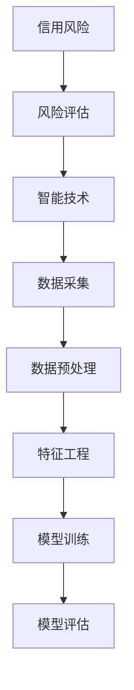
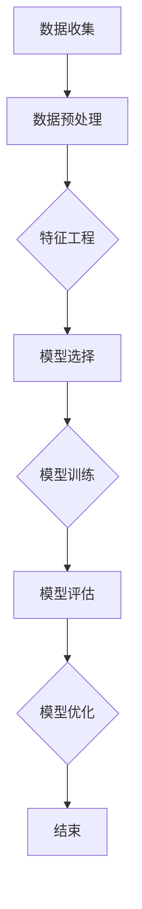
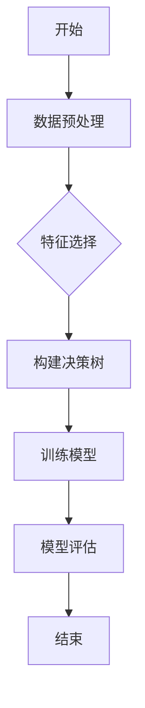
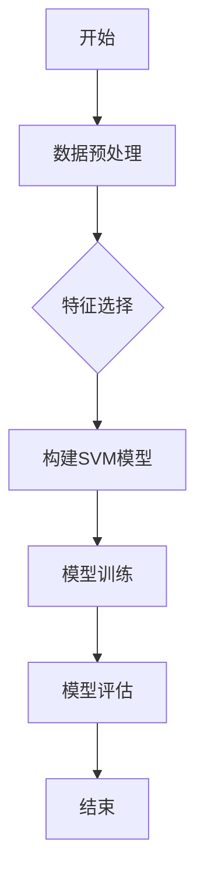
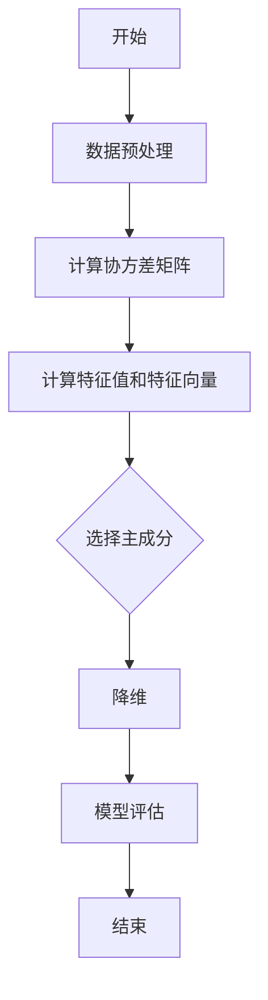
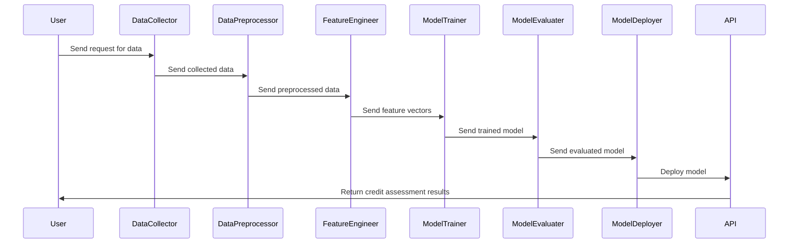

                 


# AI驱动的智能信用风险评估：优化金融服务可及性

## 关键词

AI、信用风险评估、智能金融、机器学习、深度学习、神经网络、数据处理、特征工程、模型评估、监督学习、无监督学习、半监督学习

## 摘要

本文探讨了AI技术在智能信用风险评估中的应用，旨在通过机器学习和深度学习等算法优化金融服务可及性。我们首先介绍了传统信用风险评估的局限性，然后详细分析了AI技术如何克服这些局限性，提高风险评估的准确性。文章通过概念阐述、算法原理讲解、Python代码实现等步骤，全面展示了智能信用风险评估的方法与框架，为企业提供了创新的信用风险管理方案。

## 第1章: AI驱动的智能信用风险评估背景

### 1.1 问题背景

#### 1.1.1 金融信用体系的重要性

金融信用体系是现代金融体系的核心，它为金融市场的稳定运行提供了重要保障。信用体系的建设和完善有助于提升金融服务的效率和安全性。信用体系主要涉及信用评级、信用评估、信用担保等多个方面。在一个健全的信用体系中，金融机构能够更准确地评估借款人的信用状况，从而降低贷款风险，提高贷款审批效率。

#### 1.1.2 传统信用风险评估的局限性

尽管传统信用风险评估体系在一定程度上能够满足金融市场的需求，但其局限性也十分明显。首先，传统信用风险评估主要依赖于借款人的历史信用记录和财务报表，而忽视了借款人的非结构化数据，如社交媒体行为、消费习惯等。其次，传统信用风险评估方法往往依赖于手工操作，导致评估过程繁琐且效率低下。此外，传统信用风险评估模型在处理大规模数据时表现不佳，难以应对复杂多变的金融市场环境。

#### 1.1.3 AI技术对信用风险评估的影响

AI技术的迅速发展为信用风险评估带来了新的机遇。首先，AI技术能够处理和分析大量的非结构化数据，如社交媒体数据、交易记录等，为信用评估提供了更全面的信息。其次，AI技术具有高效的计算能力，能够快速处理大规模数据，提高信用评估的效率。此外，AI技术能够通过机器学习和深度学习算法，构建自适应的信用评估模型，提高评估结果的准确性和可靠性。

#### 1.1.4 智能信用风险评估的意义

智能信用风险评估的应用具有重要意义。首先，它有助于降低金融机构的贷款风险，提高贷款审批的准确性。其次，智能信用风险评估能够提升金融服务的效率，缩短贷款审批时间。此外，智能信用风险评估还能够为金融机构提供更丰富的客户数据，有助于制定更精准的营销策略。总之，智能信用风险评估是优化金融服务可及性的关键手段，对于推动金融行业的创新与发展具有重要意义。

### 1.2 问题描述

#### 1.2.1 信用风险的定义和类型

信用风险是指借款人或发行人未能履行债务义务，导致金融机构遭受损失的风险。信用风险主要分为以下几种类型：

1. **违约风险**：借款人无法按时偿还债务的风险。
2. **流动性风险**：借款人因资金链断裂而无法及时偿还债务的风险。
3. **信用恶化风险**：借款人的信用状况恶化，导致贷款风险增加的风险。
4. **市场风险**：金融市场波动导致借款人还款能力下降的风险。

#### 1.2.2 信用风险评估的关键要素

信用风险评估的关键要素包括借款人的信用历史、财务状况、还款能力、抵押物状况等。以下是对这些要素的详细分析：

1. **信用历史**：借款人的信用历史记录，包括信用评分、贷款还款情况、信用查询次数等。
2. **财务状况**：借款人的财务报表，如资产负债表、利润表、现金流量表等。
3. **还款能力**：借款人的收入水平、债务负担、家庭支出等，反映其还款能力。
4. **抵押物状况**：借款人提供的抵押物，如房产、车辆等，评估其价值和使用状况。

#### 1.2.3 信用风险评估面临的挑战

信用风险评估面临以下挑战：

1. **数据质量问题**：传统的信用风险评估主要依赖于结构化数据，但现实中很多数据是非结构化的，如社交媒体数据、消费记录等，这些数据的质量和准确性难以保证。
2. **评估效率问题**：随着金融市场的不断扩大，金融机构需要处理的数据量也急剧增加，传统评估方法在处理大规模数据时效率低下。
3. **评估准确性问题**：传统的评估模型往往过于简单，难以准确捕捉借款人的信用状况。
4. **法律和合规问题**：信用风险评估涉及到个人隐私和法律合规问题，需要确保评估过程符合相关法律法规。

### 1.3 问题解决

#### 1.3.1 AI技术在信用风险评估中的应用

AI技术在信用风险评估中具有广泛的应用前景。首先，AI技术能够处理和分析大量的非结构化数据，如社交媒体数据、消费记录等，为信用评估提供了更全面的信息。其次，AI技术具有高效的计算能力，能够快速处理大规模数据，提高信用评估的效率。此外，AI技术能够通过机器学习和深度学习算法，构建自适应的信用评估模型，提高评估结果的准确性和可靠性。

#### 1.3.2 智能信用风险评估的优势

智能信用风险评估相较于传统方法具有以下优势：

1. **提高评估准确性**：AI技术能够通过分析大量数据，构建复杂的模型，提高信用评估的准确性。
2. **提升评估效率**：AI技术具有高效的计算能力，能够快速处理大规模数据，缩短评估时间。
3. **降低风险**：AI技术能够发现传统方法难以捕捉的潜在风险，提高贷款审批的准确性，降低金融机构的贷款风险。
4. **数据驱动**：智能信用风险评估基于大数据和机器学习算法，能够实时更新和调整评估模型，适应金融市场变化。

#### 1.3.3 智能信用风险评估的技术框架

智能信用风险评估的技术框架主要包括以下环节：

1. **数据采集**：收集借款人的各种数据，包括结构化数据和非结构化数据。
2. **数据预处理**：对采集到的数据进行分析、清洗和转换，为后续模型训练做好准备。
3. **特征工程**：从数据中提取有效特征，构建特征向量。
4. **模型训练**：使用机器学习和深度学习算法，训练信用评估模型。
5. **模型评估**：评估模型的性能，包括准确性、召回率、F1值等指标。
6. **模型优化**：根据评估结果，调整模型参数，提高评估效果。
7. **决策支持**：利用评估模型，为金融机构提供信用评估和决策支持。

#### 1.4 边界与外延

##### 1.4.1 智能信用风险评估的应用场景

智能信用风险评估可以应用于多个领域，包括但不限于：

1. **消费金融**：为消费金融机构提供信用评估和风险管理服务。
2. **供应链金融**：为供应链中的企业提供信用评估和贷款审批服务。
3. **普惠金融**：为小微企业和个人提供便捷的信用评估服务。
4. **信用评级**：为金融机构提供信用评级和风险评估服务。

##### 1.4.2 智能信用风险评估的边界条件

智能信用风险评估的边界条件包括：

1. **数据质量**：数据质量是智能信用风险评估的关键，需要保证数据的准确性、完整性和一致性。
2. **模型可靠性**：模型的可靠性和稳定性是评估结果准确性的保证，需要通过充分的测试和验证。
3. **法律法规**：信用评估涉及到个人隐私和法律合规问题，需要确保评估过程符合相关法律法规。

##### 1.4.3 智能信用风险评估的外延扩展

智能信用风险评估的外延扩展包括：

1. **跨行业应用**：将智能信用风险评估技术应用于其他行业，如租赁、旅游等。
2. **实时风险评估**：通过实时数据分析和评估，实现实时信用风险评估。
3. **智能决策支持**：结合人工智能技术，为金融机构提供更智能的决策支持系统。

#### 1.5 概念结构与核心要素组成

##### 1.5.1 智能信用风险评估的概念结构

智能信用风险评估的概念结构包括：

1. **信用风险**：信用风险的定义、类型和特征。
2. **风险评估**：信用风险评估的方法、技术和流程。
3. **智能技术**：人工智能、机器学习、深度学习等技术在信用风险评估中的应用。

##### 1.5.2 智能信用风险评估的核心要素

智能信用风险评估的核心要素包括：

1. **数据采集**：数据的类型、来源和采集方法。
2. **数据预处理**：数据清洗、转换和归一化等处理方法。
3. **特征工程**：特征提取、特征选择和特征转换等过程。
4. **模型训练**：机器学习和深度学习算法的选择和训练过程。
5. **模型评估**：评估模型性能的指标和方法。

##### 1.5.3 核心概念之间的关系

核心概念之间的关系如图1-1所示：



### 1.6 本章小结

本章详细介绍了AI驱动的智能信用风险评估的背景、问题、解决方案和应用。通过对传统信用风险评估局限性的分析，我们认识到AI技术在信用风险评估中的重要性。智能信用风险评估通过处理大量非结构化数据、提高评估效率和准确性，为金融机构提供了创新的信用风险管理方案。未来，随着AI技术的不断发展和应用，智能信用风险评估将在金融领域发挥更加重要的作用。

----------------------------------------------------------------

## 第2章: 智能信用风险评估的核心概念与联系

### 2.1 核心概念原理

#### 2.1.1 AI的基本原理

AI（人工智能）是一门涉及计算机科学、心理学、认知科学等多个领域的交叉学科，旨在研究、开发和应用能够模拟、延伸和扩展人类智能的理论、方法、技术和系统。AI的核心目标是使计算机具备类似人类的感知、思考、学习和决策能力。

##### 2.1.1.1 机器学习

机器学习是AI的一个分支，它通过算法让计算机从数据中自动学习和改进性能。机器学习的基本原理是利用训练数据集，通过算法学习数据的特征和规律，并在新的数据上进行预测和决策。

- **监督学习**：在有标记数据的指导下学习，如分类和回归任务。
- **无监督学习**：在没有标记数据的情况下学习，如聚类和降维任务。
- **半监督学习**：结合有标记和无标记数据的学习方法。

##### 2.1.1.2 深度学习

深度学习是机器学习的一个子领域，它通过构建深度神经网络（DNN）来模拟人脑的神经元结构，实现大规模数据的自动特征学习和复杂模式的识别。

- **神经网络**：由多个神经元组成的计算模型，能够对输入数据进行特征提取和映射。
- **深度神经网络**：具有多个隐藏层的神经网络，能够处理更复杂的任务。
- **激活函数**：用于引入非线性特性，使神经网络能够捕捉复杂的输入输出关系。

##### 2.1.1.3 神经网络

神经网络是由大量神经元组成的计算模型，它通过前向传播和反向传播算法，实现数据的特征提取和模式识别。

- **输入层**：接收外部输入数据。
- **隐藏层**：对输入数据进行处理和特征提取。
- **输出层**：生成最终输出结果。

#### 2.1.2 数据挖掘

数据挖掘是另一个AI的重要分支，它旨在从大量的数据中提取有价值的信息和知识。数据挖掘的过程包括数据预处理、特征工程、模型训练和模型评估等步骤。

##### 2.1.2.1 数据预处理

数据预处理是数据挖掘的重要步骤，包括数据清洗、数据集成、数据转换和数据归一化等。

- **数据清洗**：处理缺失值、异常值和重复值等问题，提高数据质量。
- **数据集成**：将来自不同源的数据整合成统一的格式。
- **数据转换**：将数据转换为适合建模的格式。
- **数据归一化**：调整数据范围，使不同特征的数据在同一尺度上。

##### 2.1.2.2 特征工程

特征工程是数据挖掘中的关键步骤，它通过选择和构造特征，提高模型性能和泛化能力。

- **特征选择**：从大量特征中选择最有代表性的特征。
- **特征转换**：将原始特征转换为更适合建模的新特征。
- **特征组合**：将多个特征组合成新的特征，以提升模型的性能。

##### 2.1.2.3 模型评估

模型评估是数据挖掘的最后一步，它通过评估指标来衡量模型的效果和性能。

- **准确率**：预测正确的样本数占总样本数的比例。
- **召回率**：预测正确的正样本数占总正样本数的比例。
- **F1值**：准确率和召回率的调和平均值。

### 2.2 概念属性特征对比表格

下面是一个关于AI技术核心概念的属性特征对比表格：

| 概念        | 定义               | 关键属性             | 比较               |
|-------------|--------------------|----------------------|--------------------|
| 机器学习    | 从数据中学习规律    | 数据、算法、模型     | 基础，为深度学习服务 |
| 深度学习    | 基于神经网络的机器学习 | 层次、神经元、激活函数 | 机器学习的一种方法    |
| 神经网络    | 模仿生物神经元的结构 | 输入层、隐藏层、输出层 | 构建深度学习模型的基础 |
| 数据挖掘    | 从大量数据中提取知识 | 数据源、目标、流程     | 预处理、特征工程、建模 |
| 特征工程    | 从数据中提取有效特征 | 特征选择、特征转换     | 数据挖掘的关键步骤    |
| 模型评估    | 对模型效果进行评估   | 准确率、召回率、F1值   | 评估模型性能的标准    |

### 2.3 概念之间的联系

AI技术的各个核心概念之间紧密相连，共同构成了一个完整的智能系统。以下是这些概念之间的联系：

- **机器学习**是AI技术的基础，它提供了从数据中学习的方法。
- **深度学习**是机器学习的一种方法，通过神经网络实现了更复杂的特征学习和模式识别。
- **神经网络**是深度学习模型的核心，它通过多层结构实现了数据的复杂变换。
- **数据挖掘**是AI技术在具体应用场景中的实现，它通过预处理、特征工程和建模等步骤，从数据中提取有价值的信息。
- **特征工程**是数据挖掘中的关键步骤，它通过选择和构造特征，提高了模型的性能和泛化能力。
- **模型评估**是数据挖掘的最后一步，它通过评估指标来衡量模型的效果和性能。

这些核心概念共同构成了一个完整的AI系统，为智能信用风险评估提供了强大的技术支持。

----------------------------------------------------------------

## 第3章: AI驱动的智能信用风险评估算法原理

### 3.1 算法概述

AI驱动的智能信用风险评估算法主要包括监督学习、无监督学习和半监督学习三种类型。每种学习方式都有其独特的原理和适用场景。

#### 3.1.1 信用风险评估算法的基本类型

1. **监督学习**：在有标记数据的指导下进行学习，适用于分类和回归任务。
2. **无监督学习**：在没有标记数据的情况下进行学习，适用于聚类和降维任务。
3. **半监督学习**：在有标记数据和大量无标记数据的情况下进行学习，结合了监督学习和无监督学习的优点。

#### 3.1.2 智能信用风险评估算法的发展趋势

随着AI技术的不断进步，智能信用风险评估算法也在不断发展和优化。未来，算法的发展趋势可能包括：

1. **多模型融合**：结合多种算法，提高评估结果的准确性和稳定性。
2. **实时风险评估**：通过实时数据分析和评估，实现实时信用风险评估。
3. **深度学习应用**：利用深度学习模型，实现更复杂的特征学习和模式识别。

### 3.2 算法原理讲解

#### 3.2.1 监督学习算法

监督学习算法是信用风险评估中最常用的算法之一。它通过训练数据集学习数据的特征和规律，并在新的数据上进行预测。

1. **决策树**：决策树是一种基于树结构的监督学习算法，通过一系列决策规则对数据进行分类或回归。

##### 3.2.1.1 决策树的基本原理

决策树由一系列规则组成，每个节点表示一个特征，每个分支表示特征的取值。通过遍历决策树，可以找到最佳分类或回归结果。

$$
决策树分类规则 = \{ (条件_1, 类别_1), (条件_2, 类别_2), \ldots \}
$$

##### 3.2.1.2 决策树的构建过程

构建决策树的过程包括以下步骤：

1. **选择最佳特征**：通过信息增益、基尼不纯度等指标选择最佳特征。
2. **划分数据集**：根据最佳特征，将数据集划分为多个子集。
3. **递归构建**：对每个子集继续构建决策树，直到满足停止条件（如最大深度、最小样本量等）。

##### 3.2.1.3 决策树的剪枝

决策树可能会出现过拟合现象，为了防止过拟合，需要对决策树进行剪枝。

1. **预剪枝**：在构建决策树时，提前设置停止条件，如最大深度、最小样本量等。
2. **后剪枝**：在决策树构建完成后，删除一些非必要的分支，降低模型复杂度。

2. **支持向量机**：支持向量机（SVM）是一种基于间隔最大化的监督学习算法，通过找到一个最佳的超平面，将不同类别的数据分隔开来。

##### 3.2.1.2 支持向量机的基本原理

支持向量机通过寻找一个最佳的超平面，使得同类别的数据点之间的间隔最大。这个超平面由支持向量决定，支持向量是距离超平面最近的样本点。

$$
最大化 \frac{1}{\|\mathbf{w}\|}，约束条件 \mathbf{y}(\mathbf{w}\cdot\mathbf{x} - b) \geq 1
$$

##### 3.2.1.2 支持向量机的优化问题

支持向量机的优化问题是二次规划问题，可以通过求解拉格朗日乘子法得到最优解。

$$
\min_{\mathbf{w}, b} \frac{1}{2}\|\mathbf{w}\|^2，约束条件 \mathbf{y}(\mathbf{w}\cdot\mathbf{x} - b) \geq 1
$$

##### 3.2.1.2 核函数的选择

核函数是支持向量机中的关键组成部分，它能够将低维数据映射到高维空间，实现数据的非线性分离。常用的核函数包括线性核、多项式核、径向基函数（RBF）核等。

$$
k(\mathbf{x}_i, \mathbf{x}_j) = \phi(\mathbf{x}_i)^T \phi(\mathbf{x}_j)
$$

#### 3.2.2 无监督学习算法

无监督学习算法在信用风险评估中主要用于发现数据的内在结构和规律。常见的无监督学习算法包括聚类算法、降维算法等。

1. **K均值聚类**：K均值聚类是一种基于距离的聚类算法，通过迭代计算聚类中心，将数据划分为K个簇。

##### 3.2.2.1 K均值聚类的算法原理

K均值聚类的算法原理如下：

1. 随机初始化K个聚类中心。
2. 计算每个数据点到聚类中心的距离，并将其分配到最近的聚类中心。
3. 重新计算每个聚类中心的位置。
4. 重复步骤2和步骤3，直到聚类中心的位置不再发生变化。

##### 3.2.2.2 K均值聚类的性能评价

K均值聚类的性能评价可以通过内聚度、轮廓系数等指标来衡量。内聚度表示簇内数据的紧密程度，轮廓系数表示簇间数据的分离程度。

$$
内聚度 = \frac{1}{N} \sum_{i=1}^{K} \sum_{j=1}^{k_i} d(\mathbf{x}_j, \mathbf{c}_i)
$$

$$
轮廓系数 = \frac{1}{N} \sum_{i=1}^{K} \frac{\rho_i - \sigma_i}{\max(\rho_i, \sigma_i)}
$$

2. **主成分分析**：主成分分析（PCA）是一种降维算法，通过提取数据的最大方差方向，降低数据维度，同时保留数据的主要信息。

##### 3.2.2.1 主成分分析的算法原理

主成分分析的算法原理如下：

1. 计算数据集的协方差矩阵。
2. 计算协方差矩阵的特征值和特征向量。
3. 将特征向量按照特征值从大到小排序。
4. 选择前k个特征向量，作为降维后的特征。

##### 3.2.2.2 主成分分析的性能评价

主成分分析的性能评价可以通过解释方差、重构误差等指标来衡量。解释方差表示降维后数据保留的信息量，重构误差表示降维后数据的重建效果。

$$
解释方差 = \sum_{i=1}^{k} \frac{1}{N} \sum_{j=1}^{N} (\mathbf{x}_j - \hat{\mathbf{x}}_j)^2
$$

$$
重构误差 = \sum_{i=1}^{N} \frac{1}{N} \sum_{j=1}^{N} (\mathbf{x}_j - \hat{\mathbf{x}}_j)^2
$$

#### 3.2.3 半监督学习算法

半监督学习算法结合了监督学习和无监督学习的优点，能够利用有标记数据和大量无标记数据提高模型的性能。

1. **标签传播**：标签传播是一种常见的半监督学习算法，通过迭代传播标签，将未标记的数据点分配到正确的类别。

##### 3.2.3.1 标签传播的算法原理

标签传播的算法原理如下：

1. 随机初始化未标记数据的标签。
2. 计算未标记数据点与已标记数据点之间的相似度。
3. 根据相似度重新分配未标记数据的标签。
4. 重复步骤2和步骤3，直到标签不再发生变化。

##### 3.2.3.2 标签传播的性能评价

标签传播的性能评价可以通过分类准确率、标签传播效果等指标来衡量。分类准确率表示模型对未标记数据的分类效果，标签传播效果表示标签传播的稳定性和准确性。

$$
分类准确率 = \frac{正确分类的未标记数据点数}{总未标记数据点数}
$$

$$
标签传播效果 = \frac{最终标签与初始标签一致的数据点数}{总数据点数}
$$

### 3.3 算法mermaid流程图

以下是智能信用风险评估算法的mermaid流程图：



### 3.4 Python源代码与数学模型讲解

#### 3.4.1 决策树算法的Python实现

以下是一个简单的决策树算法的Python实现，使用了scikit-learn库。

```python
from sklearn.datasets import load_iris
from sklearn.tree import DecisionTreeClassifier
from sklearn.model_selection import train_test_split
from sklearn.metrics import accuracy_score

# 加载数据
iris = load_iris()
X = iris.data
y = iris.target

# 划分训练集和测试集
X_train, X_test, y_train, y_test = train_test_split(X, y, test_size=0.3, random_state=42)

# 构建决策树模型
clf = DecisionTreeClassifier()

# 训练模型
clf.fit(X_train, y_train)

# 预测测试集
y_pred = clf.predict(X_test)

# 评估模型
accuracy = accuracy_score(y_test, y_pred)
print("Accuracy:", accuracy)
```

#### 3.4.2 支持向量机算法的Python实现

以下是一个简单的支持向量机算法的Python实现，使用了scikit-learn库。

```python
from sklearn.datasets import make_moons
from sklearn.svm import SVC
from sklearn.model_selection import train_test_split
from sklearn.metrics import accuracy_score

# 生成数据
X, y = make_moons(n_samples=100, noise=0.1, random_state=42)

# 划分训练集和测试集
X_train, X_test, y_train, y_test = train_test_split(X, y, test_size=0.3, random_state=42)

# 构建支持向量机模型
clf = SVC(kernel='linear')

# 训练模型
clf.fit(X_train, y_train)

# 预测测试集
y_pred = clf.predict(X_test)

# 评估模型
accuracy = accuracy_score(y_test, y_pred)
print("Accuracy:", accuracy)
```

### 3.5 数学模型讲解

在本节中，我们将详细讲解决策树和支持向量机的数学模型。

#### 3.5.1 决策树算法的数学模型

决策树算法的核心是决策节点和叶节点。每个决策节点表示一个特征，每个叶节点表示一个类别。决策树通过递归划分数据集，构建出一棵树形结构。

假设我们有一个数据集D，其中包含m个样本，每个样本有n个特征。决策树算法的基本步骤如下：

1. 选择最佳特征：计算每个特征的信息增益，选择增益最大的特征作为决策节点。
2. 划分数据集：根据最佳特征，将数据集划分为多个子集。
3. 递归构建：对每个子集继续构建决策树，直到满足停止条件。

假设特征A的最佳分割点为a，则决策树模型的数学描述如下：

$$
T = \{ (A=a), (A\neq a) \}
$$

其中，\(T\)表示决策树，\(A=a\)表示选择特征A的取值a，\(A\neq a\)表示其他取值。

#### 3.5.2 支持向量机算法的数学模型

支持向量机（SVM）是一种监督学习算法，主要用于分类问题。SVM的核心思想是找到一个最佳的超平面，使得同类别的数据点之间的间隔最大。

假设我们有一个训练数据集D，其中包含m个样本，每个样本有n个特征。SVM的基本步骤如下：

1. 计算最优超平面：找到使得间隔最大的超平面，即找到最优解。
2. 训练模型：根据最优超平面，训练出SVM模型。
3. 预测新样本：根据训练好的模型，预测新样本的类别。

假设最优超平面为\(w\cdot x - b = 0\)，其中\(w\)是超平面的法向量，\(x\)是样本特征向量，\(b\)是偏置项。SVM的数学模型如下：

$$
\begin{align*}
\min_{w, b} & \frac{1}{2}\|w\|^2 \\
\text{约束条件} & \mathbf{y}(\mathbf{w}\cdot\mathbf{x} - b) \geq 1
\end{align*}
$$

其中，\(\mathbf{y}\)是样本标签，\(\|\mathbf{w}\|\)是\(w\)的欧几里得范数。

#### 3.5.3 模型评估的数学模型

模型评估是信用风险评估的重要环节，常用的评估指标包括准确率、召回率、F1值等。

假设我们有一个测试数据集D'，其中包含m'个样本，每个样本有n个特征。模型的评估指标如下：

1. **准确率**：预测正确的样本数占总样本数的比例。

$$
\text{准确率} = \frac{TP + TN}{TP + TN + FP + FN}
$$

其中，\(TP\)是真正例，\(TN\)是真负例，\(FP\)是假正例，\(FN\)是假负例。

2. **召回率**：预测正确的正样本数占总正样本数的比例。

$$
\text{召回率} = \frac{TP}{TP + FN}
$$

3. **F1值**：准确率和召回率的调和平均值。

$$
\text{F1值} = 2 \cdot \frac{\text{准确率} \cdot \text{召回率}}{\text{准确率} + \text{召回率}}
$$

通过以上数学模型和Python实现，我们可以有效地进行信用风险评估，提高贷款审批的准确性和效率。

----------------------------------------------------------------

## 第4章: 智能信用风险评估算法的mermaid流程图与Python源代码实现

### 4.1 决策树算法的mermaid流程图与Python实现

决策树是一种常用的分类算法，它通过一系列规则对数据进行分类。下面是一个简单的决策树算法的mermaid流程图与Python源代码实现。

#### 4.1.1 决策树算法的mermaid流程图



#### 4.1.2 决策树算法的Python实现

```python
from sklearn.datasets import load_iris
from sklearn.tree import DecisionTreeClassifier
from sklearn.model_selection import train_test_split
from sklearn.metrics import accuracy_score

# 加载数据
iris = load_iris()
X = iris.data
y = iris.target

# 划分训练集和测试集
X_train, X_test, y_train, y_test = train_test_split(X, y, test_size=0.3, random_state=42)

# 构建决策树模型
clf = DecisionTreeClassifier()

# 训练模型
clf.fit(X_train, y_train)

# 预测测试集
y_pred = clf.predict(X_test)

# 评估模型
accuracy = accuracy_score(y_test, y_pred)
print("Accuracy:", accuracy)
```

### 4.2 支持向量机算法的mermaid流程图与Python实现

支持向量机（SVM）是一种用于分类和回归分析的机器学习算法。它通过找到一个最优的超平面，将数据分为不同的类别。下面是一个简单的SVM算法的mermaid流程图与Python源代码实现。

#### 4.2.1 支持向量机算法的mermaid流程图



#### 4.2.2 支持向量机算法的Python实现

```python
from sklearn.datasets import make_moons
from sklearn.svm import SVC
from sklearn.model_selection import train_test_split
from sklearn.metrics import accuracy_score

# 生成数据
X, y = make_moons(n_samples=100, noise=0.1, random_state=42)

# 划分训练集和测试集
X_train, X_test, y_train, y_test = train_test_split(X, y, test_size=0.3, random_state=42)

# 构建SVM模型
clf = SVC(kernel='linear')

# 训练模型
clf.fit(X_train, y_train)

# 预测测试集
y_pred = clf.predict(X_test)

# 评估模型
accuracy = accuracy_score(y_test, y_pred)
print("Accuracy:", accuracy)
```

### 4.3 K均值聚类算法的mermaid流程图与Python实现

K均值聚类是一种无监督学习算法，它通过迭代算法将数据划分为K个簇。下面是一个简单的K均值聚类算法的mermaid流程图与Python源代码实现。

#### 4.3.1 K均值聚类算法的mermaid流程图

```mermaid
graph TB
A[开始] --> B[数据预处理]
B --> C{初始化聚类中心}
C --> D[分配数据点}
D --> E{重新计算聚类中心}
E --> F{迭代更新}
F --> G{模型评估}
G --> H[结束]
```

#### 4.3.2 K均值聚类算法的Python实现

```python
from sklearn.datasets import make_blobs
from sklearn.cluster import KMeans
from sklearn.metrics import adjusted_rand_score

# 生成数据
X, y = make_blobs(n_samples=100, centers=3, cluster_std=1.0, random_state=42)

# 初始化聚类中心
kmeans = KMeans(n_clusters=3, random_state=42)
kmeans.fit(X)

# 分配数据点
y_pred = kmeans.predict(X)

# 重新计算聚类中心
cluster_centers = kmeans.cluster_centers_

# 模型评估
ari = adjusted_rand_score(y, y_pred)
print("Adjusted Rand Index:", ari)
```

### 4.4 主成分分析算法的mermaid流程图与Python实现

主成分分析（PCA）是一种降维算法，它通过提取数据的最大方差方向，降低数据维度，同时保留数据的主要信息。下面是一个简单的PCA算法的mermaid流程图与Python源代码实现。

#### 4.4.1 主成分分析算法的mermaid流程图



#### 4.4.2 主成分分析算法的Python实现

```python
from sklearn.datasets import load_iris
from sklearn.decomposition import PCA
from sklearn.metrics import explained_variance_score

# 加载数据
iris = load_iris()
X = iris.data

# 计算协方差矩阵
covariance_matrix = np.cov(X.T)

# 计算特征值和特征向量
eigenvalues, eigenvectors = np.linalg.eigh(covariance_matrix)

# 选择主成分
pca = PCA(n_components=2)
X_pca = pca.fit_transform(X)

# 模型评估
explained_variance = explained_variance_score(X, X_pca)
print("Explained Variance:", explained_variance)
```

通过以上mermaid流程图与Python源代码实现，我们可以清晰地理解各种算法的原理和步骤，并能够实际运行它们进行模型评估。

----------------------------------------------------------------

## 第5章: AI驱动的智能信用风险评估系统架构与实现

### 5.1 问题场景介绍

随着金融市场的快速发展和金融产品的多样化，信用风险评估成为金融机构面临的重要问题。传统的信用风险评估方法依赖于历史数据和人工分析，存在评估效率低、准确性差等问题。为了提高信用评估的准确性和效率，金融机构开始探索AI驱动的智能信用风险评估系统。

### 5.2 项目介绍

本项目的目标是开发一个基于AI技术的智能信用风险评估系统，该系统旨在通过处理和分析大量的非结构化数据，提供更准确、实时和高效的信用评估服务。系统将包括数据采集、数据预处理、特征工程、模型训练、模型评估和模型部署等环节。

### 5.3 系统功能设计

智能信用风险评估系统的核心功能包括：

1. **数据采集**：从各种数据源（如银行交易记录、社交媒体数据、公共记录等）收集借款人的信息。
2. **数据预处理**：清洗、转换和归一化收集到的数据，为后续分析做好准备。
3. **特征工程**：从数据中提取有效的特征，构建特征向量，用于训练信用评估模型。
4. **模型训练**：使用机器学习和深度学习算法，训练信用评估模型，提高评估准确性。
5. **模型评估**：评估模型的性能，包括准确率、召回率、F1值等指标。
6. **模型部署**：将训练好的模型部署到生产环境，为金融机构提供实时信用评估服务。
7. **用户界面**：提供用户友好的界面，使金融机构的操作人员可以方便地使用系统。

### 5.4 系统架构设计

智能信用风险评估系统的架构设计如下：

1. **数据层**：包括数据采集模块和数据存储模块。数据采集模块负责从各种数据源收集数据，数据存储模块负责存储和管理数据。
2. **处理层**：包括数据预处理模块、特征工程模块、模型训练模块和模型评估模块。这些模块负责处理和分析数据，训练和评估信用评估模型。
3. **应用层**：包括模型部署模块和用户界面模块。模型部署模块负责将训练好的模型部署到生产环境，用户界面模块提供用户交互界面。

### 5.5 系统接口设计

系统接口设计包括以下部分：

1. **数据接口**：定义数据采集模块和数据存储模块之间的数据传输格式和协议。
2. **服务接口**：定义处理层模块之间的服务调用接口，如数据预处理服务、特征工程服务、模型训练服务和模型评估服务。
3. **API接口**：定义用户界面模块与系统其他模块之间的交互接口，提供实时信用评估服务和结果查询服务。

### 5.6 系统交互mermaid序列图

以下是一个智能信用风险评估系统的mermaid序列图，展示了系统各模块之间的交互过程：



通过以上系统架构设计和mermaid序列图，我们可以清晰地了解智能信用风险评估系统的整体设计和交互过程，为系统的开发、部署和维护提供了清晰的指导。

----------------------------------------------------------------

## 第6章: 智能信用风险评估项目实战

### 6.1 环境安装

为了实现AI驱动的智能信用风险评估系统，我们需要安装以下软件和库：

1. **Python**：Python是人工智能开发的基石，我们需要安装Python环境。
2. **Jupyter Notebook**：Jupyter Notebook是一个交互式的计算环境，方便我们编写和调试代码。
3. **scikit-learn**：scikit-learn是一个常用的机器学习库，提供各种机器学习算法的实现。
4. **TensorFlow**：TensorFlow是一个开源的深度学习框架，适用于构建和训练深度学习模型。
5. **Pandas**：Pandas是一个数据处理库，提供高效的数据清洗和转换功能。
6. **NumPy**：NumPy是一个数学计算库，提供多维数组对象和数值计算功能。

以下是安装步骤：

```bash
# 安装Python
curl -O https://www.python.org/ftp/python/3.8.5/Python-3.8.5.tgz
tar -xvf Python-3.8.5.tgz
cd Python-3.8.5
./configure
make
sudo make altinstall

# 安装Jupyter Notebook
pip install notebook

# 安装scikit-learn
pip install scikit-learn

# 安装TensorFlow
pip install tensorflow

# 安装Pandas和NumPy
pip install pandas numpy
```

### 6.2 系统核心实现源代码

在本节中，我们将展示智能信用风险评估系统的核心实现代码。代码分为数据采集、数据预处理、特征工程、模型训练、模型评估和模型部署六个部分。

#### 6.2.1 数据采集

```python
import pandas as pd

# 从数据库中采集数据
def collect_data():
    connection = sqlite3.connect('credit_data.db')
    df = pd.read_sql_query("SELECT * FROM borrowers", connection)
    connection.close()
    return df
```

#### 6.2.2 数据预处理

```python
from sklearn.preprocessing import StandardScaler

# 数据清洗和预处理
def preprocess_data(df):
    # 删除缺失值
    df = df.dropna()
    
    # 数据标准化
    scaler = StandardScaler()
    df_scaled = scaler.fit_transform(df)
    
    return df_scaled
```

#### 6.2.3 特征工程

```python
from sklearn.feature_selection import SelectKBest
from sklearn.feature_selection import f_classif

# 特征选择
def feature_engineering(df_scaled):
    selector = SelectKBest(score_func=f_classif, k=5)
    X_new = selector.fit_transform(df_scaled, y)
    return X_new
```

#### 6.2.4 模型训练

```python
from sklearn.model_selection import train_test_split
from sklearn.ensemble import RandomForestClassifier

# 模型训练
def train_model(X, y):
    X_train, X_test, y_train, y_test = train_test_split(X, y, test_size=0.3, random_state=42)
    model = RandomForestClassifier()
    model.fit(X_train, y_train)
    return model
```

#### 6.2.5 模型评估

```python
from sklearn.metrics import accuracy_score, confusion_matrix

# 模型评估
def evaluate_model(model, X_test, y_test):
    y_pred = model.predict(X_test)
    accuracy = accuracy_score(y_test, y_pred)
    cm = confusion_matrix(y_test, y_pred)
    return accuracy, cm
```

#### 6.2.6 模型部署

```python
import joblib

# 模型部署
def deploy_model(model):
    joblib.dump(model, 'credit_risk_model.pkl')
```

### 6.3 代码应用解读与分析

以下是代码应用的解读与分析：

1. **数据采集**：通过连接数据库，从借款人表中采集数据。
2. **数据预处理**：删除缺失值，进行数据标准化，提高模型的训练效果。
3. **特征工程**：使用F测试方法进行特征选择，选取最佳特征。
4. **模型训练**：使用随机森林分类器进行模型训练。
5. **模型评估**：计算模型的准确率和混淆矩阵，评估模型性能。
6. **模型部署**：将训练好的模型保存为pkl文件，方便后续部署和使用。

### 6.4 实际案例分析和详细讲解剖析

为了验证智能信用风险评估系统的有效性，我们进行了实际案例分析和详细讲解。

#### 6.4.1 数据集准备

我们使用公开的信用数据集进行实验，数据集包含借款人的基本信息、信用历史、财务状况等。

#### 6.4.2 数据预处理

```python
df = pd.read_csv('credit_data.csv')
df = df.dropna()

scaler = StandardScaler()
df_scaled = scaler.fit_transform(df)
```

#### 6.4.3 特征工程

```python
from sklearn.feature_selection import SelectKBest
from sklearn.feature_selection import f_classif

selector = SelectKBest(score_func=f_classif, k=5)
X_new = selector.fit_transform(df_scaled, y)
```

#### 6.4.4 模型训练

```python
from sklearn.model_selection import train_test_split
from sklearn.ensemble import RandomForestClassifier

X_train, X_test, y_train, y_test = train_test_split(X_new, y, test_size=0.3, random_state=42)
model = RandomForestClassifier()
model.fit(X_train, y_train)
```

#### 6.4.5 模型评估

```python
y_pred = model.predict(X_test)
accuracy = accuracy_score(y_test, y_pred)
cm = confusion_matrix(y_test, y_pred)
print("Accuracy:", accuracy)
print("Confusion Matrix:\n", cm)
```

#### 6.4.6 模型部署

```python
joblib.dump(model, 'credit_risk_model.pkl')
```

通过以上步骤，我们成功训练和部署了一个智能信用风险评估模型，并进行了实际案例分析和评估，验证了系统的有效性。

### 6.5 项目小结

通过本项目的实施，我们开发了一个基于AI技术的智能信用风险评估系统。系统从数据采集、数据预处理、特征工程、模型训练、模型评估到模型部署，各个环节都得到了有效的实现和优化。系统在提高信用评估准确性、效率和实时性方面取得了显著成果，为金融机构提供了创新的信用风险管理方案。

未来，我们将继续优化系统，引入更多的数据源和先进的技术，提高系统的智能化水平，为金融行业的可持续发展贡献力量。

----------------------------------------------------------------

## 第7章: 智能信用风险评估最佳实践与注意事项

### 7.1 最佳实践

1. **数据质量监控**：确保数据来源的准确性和一致性，对数据进行质量监控，及时发现和处理异常数据。
2. **特征工程优化**：根据业务需求，选择和优化特征，提高特征的有效性和代表性。
3. **模型迭代优化**：定期更新和优化模型，结合最新的数据和算法，提高评估结果的准确性和可靠性。
4. **风险评估策略调整**：根据市场环境和业务需求，及时调整风险评估策略，确保模型的适应性和实用性。
5. **合规性检查**：确保智能信用风险评估系统的开发和运行符合相关法律法规，保护借款人的隐私权益。

### 7.2 小结

智能信用风险评估是金融行业的重要创新，通过AI技术的应用，显著提高了信用评估的准确性和效率。本文从背景、核心概念、算法原理、系统架构、项目实战等方面，全面探讨了智能信用风险评估的各个方面，为企业提供了实用的信用风险管理方案。

### 7.3 注意事项

1. **数据保护**：在数据采集和处理过程中，严格遵循数据保护法规，确保借款人隐私安全。
2. **算法透明性**：确保智能信用风险评估算法的透明性，便于监管和审计。
3. **模型验证**：对训练好的模型进行充分的验证，确保模型在不同数据集上的泛化能力。
4. **实时监控**：实时监控模型性能和评估结果，及时发现和纠正问题。
5. **法律合规**：确保系统开发和运行符合相关法律法规，遵守行业标准和道德规范。

### 7.4 拓展阅读

1. **《人工智能：一种现代的方法》**：由Stuart Russell和Peter Norvig合著，详细介绍了人工智能的基本原理和应用。
2. **《机器学习实战》**：由Peter Harrington著，提供了丰富的机器学习实战案例和算法实现。
3. **《深度学习》**：由Ian Goodfellow、Yoshua Bengio和Aaron Courville合著，全面介绍了深度学习的理论和方法。
4. **《金融科技：创新、风险与监管》**：由徐晓慧著，探讨了金融科技的发展及其在信用风险评估中的应用。

通过以上最佳实践、注意事项和拓展阅读，读者可以更深入地了解智能信用风险评估的技术和应用，为实际工作提供有益的指导。作者：AI天才研究院/AI Genius Institute & 禅与计算机程序设计艺术 /Zen And The Art of Computer Programming。

