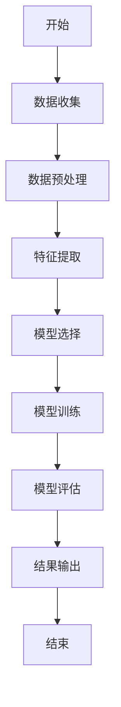
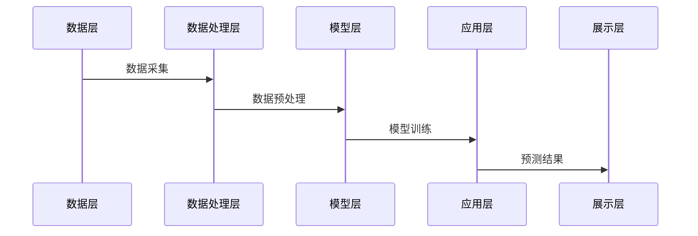
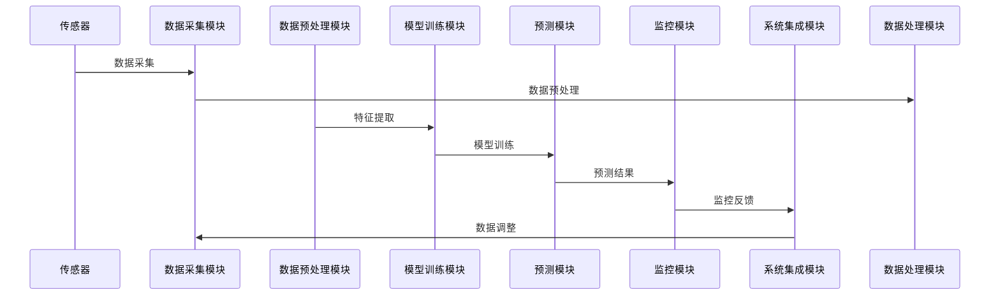

                 


### 引言

#### 问题背景

在当今全球制造业中，产品质量的稳定性与一致性是制造企业竞争的关键因素。传统的质量检测方法通常依赖于人工抽样检测，这不仅耗时且容易出现误差，难以全面监控每一批次产品的质量。随着制造业向智能化、自动化方向转型，利用人工智能（AI）技术来提高产品质量预测的准确性已成为行业发展的必然趋势。

#### 问题描述

智能制造环境下，产品质量预测的目标是通过分析生产过程中产生的数据，提前识别可能影响产品质量的因素，从而减少不良品率。具体来说，问题描述包括以下几个方面：

1. **数据收集**：如何有效地收集生产过程中的多源数据，如传感器数据、生产参数、操作员反馈等。
2. **数据预处理**：如何对收集到的数据进行清洗、特征提取和标准化处理，为后续的预测模型提供高质量的数据。
3. **算法选择**：如何选择合适的AI算法，对数据进行建模和预测，以提高产品质量预测的准确性。
4. **模型评估**：如何评估预测模型的性能，确保其在实际应用中的有效性和可靠性。
5. **系统集成**：如何将AI预测模型集成到现有的制造系统中，实现实时监控和自动调整。

#### 问题解决

AI驱动的智能制造产品质量预测主要依赖于以下几个方面：

1. **数据驱动的建模**：通过大数据分析和机器学习技术，建立准确的产品质量预测模型。
2. **实时监控与预警**：利用预测模型，实时监控生产线，对潜在的质量问题进行预警，防止不良品流入市场。
3. **自适应调整**：根据预测结果，自动调整生产参数，优化生产流程，提高产品质量稳定性。
4. **人机协同**：通过人工智能与操作员的协同工作，提升整体生产效率和质量。

#### 边界与外延

在实施AI驱动的产品质量预测时，需要明确以下几个边界条件：

1. **数据边界**：数据的范围和质量是模型准确性的基础，必须确保数据的真实性和完整性。
2. **算法边界**：不同的AI算法适用于不同类型的数据和问题，需要根据实际情况选择最合适的算法。
3. **应用边界**：产品质量预测系统需要与现有的制造系统无缝集成，实现数据的互通和流程的自动化。

#### 概念结构与核心要素组成

AI驱动的智能制造产品质量预测涉及多个核心概念和要素，如图：

1. **数据收集与预处理**：数据的质量直接影响模型的准确性，因此数据收集和预处理是关键。
2. **机器学习算法**：选择合适的算法，如回归分析、决策树、神经网络等，对数据进行建模和预测。
3. **模型评估与优化**：通过交叉验证、A/B测试等方法，评估模型的性能，并不断优化模型。
4. **系统集成与部署**：将预测模型集成到制造系统中，实现数据的实时传输和自动调整。

### AI驱动的智能制造概述

#### 智能制造的定义与趋势

智能制造（Smart Manufacturing）是指通过信息物理系统（Cyber-Physical Systems, CPS）将制造过程智能化，实现生产过程的自动化、数字化和网络化。智能制造旨在通过先进的信息技术、制造技术和自动化技术，提高生产效率、产品质量和资源利用率。

智能制造的发展趋势主要包括：

1. **大数据与云计算**：利用大数据技术，对生产过程中的海量数据进行实时分析和处理，提高决策的准确性和效率。
2. **物联网（IoT）**：通过物联网技术，将生产设备、传感器、控制系统等连接起来，实现设备之间的信息共享和协同工作。
3. **人工智能**：利用人工智能技术，实现生产过程的智能监控、优化和预测，提高生产效率和产品质量。
4. **自动化与机器人技术**：通过自动化技术和机器人技术，实现生产过程的自动化和无人化，降低人力成本和提高生产效率。

#### AI在智能制造中的作用

人工智能在智能制造中扮演着重要角色，其主要作用包括：

1. **质量预测**：利用AI技术，对生产过程中的数据进行实时分析，提前预测产品质量，降低不良品率。
2. **生产优化**：通过AI技术，对生产过程进行实时监控和调整，优化生产参数，提高生产效率。
3. **故障诊断**：利用AI技术，对生产设备进行实时监测和故障诊断，提高设备运行效率和减少停机时间。
4. **供应链管理**：通过AI技术，实现供应链的智能管理和优化，提高供应链的响应速度和灵活性。

#### 产品质量预测的重要性

产品质量预测在智能制造中具有重要意义，其主要原因包括：

1. **降低不良品率**：通过提前预测产品质量，可以及时发现潜在问题，采取措施降低不良品率。
2. **提高生产效率**：通过对生产过程进行实时监控和优化，可以提高生产效率，降低生产成本。
3. **提升产品竞争力**：通过提高产品质量，可以增强产品的市场竞争力，提高企业的盈利能力。
4. **实现智能制造**：产品质量预测是智能制造的重要组成部分，是实现制造过程数字化、智能化和自动化的关键。

#### AI驱动的产品质量预测方法

AI驱动的产品质量预测方法主要包括以下几种：

1. **机器学习算法**：通过机器学习算法，对历史数据进行建模和预测，实现对产品质量的预测。
2. **深度学习算法**：利用深度学习算法，对复杂的非线性关系进行建模，提高预测的准确性。
3. **数据驱动方法**：通过数据驱动方法，对生产过程中的数据进行实时分析，实现对产品质量的预测。
4. **模型集成方法**：将多种算法和模型集成在一起，综合利用各种方法的优势，提高预测的准确性。

### 核心概念与联系

在AI驱动的智能制造产品质量预测中，涉及多个核心概念和联系。下面将介绍这些核心概念，并通过表格和ER实体关系图进行详细解释。

#### 1. 关键概念解释

**数据收集**：指在生产过程中，通过传感器、监测设备等收集各种类型的数据，如温度、湿度、压力、生产参数等。

**数据预处理**：指对收集到的原始数据进行清洗、归一化、特征提取等处理，为后续建模和预测提供高质量的数据。

**机器学习算法**：指通过训练和优化模型，对历史数据进行学习，从而预测未来的产品质量。

**质量预测模型**：指通过机器学习算法建立的产品质量预测模型，用于对产品质量进行预测。

**系统集成**：指将产品质量预测模型集成到现有的制造系统中，实现数据的实时传输和自动调整。

#### 2. 概念属性特征对比表格

| 概念     | 特征属性               | 描述                                                         |
| -------- | ---------------------- | ------------------------------------------------------------ |
| 数据收集 | 多源、实时、多维度     | 涉及多种数据源，如传感器、监测设备等，实现数据的实时采集和传输。 |
| 数据预处理 | 清洗、归一化、特征提取 | 对原始数据进行清洗，去除噪声和异常值，进行归一化和特征提取，提高数据质量。 |
| 机器学习算法 | 自适应、学习能力强   | 通过训练和优化模型，对历史数据进行学习，具有强大的自适应和学习能力。 |
| 质量预测模型 | 精准、高效、实时     | 建立准确的产品质量预测模型，实现高效的实时预测，提高生产效率。 |
| 系统集成 | 灵活、可靠、兼容性高 | 将产品质量预测模型集成到现有系统中，实现数据的实时传输和自动调整，具有高兼容性和可靠性。 |

#### 3. AI驱动的产品质量预测ER实体关系图

```mermaid
erDiagram
    DataCollection ||--|{ QualityPredictionModel }|| PredictionModel
    DataProcessing ||--|{ QualityPredictionModel }|| PredictionModel
    MachineLearningAlgorithm ||--|{ QualityPredictionModel }|| PredictionModel
    ManufacturingSystem ||--|{ QualityPredictionModel }|| PredictionModel
```

在上面的ER实体关系图中，DataCollection（数据收集）、DataProcessing（数据预处理）、MachineLearningAlgorithm（机器学习算法）和ManufacturingSystem（制造系统）是四个主要的实体。它们通过PredictionModel（质量预测模型）相互关联，形成一个完整的AI驱动的产品质量预测体系。

### AI驱动的产品质量预测算法原理讲解

#### 1. 算法mermaid流程图



#### 2. Python源代码与算法原理详细讲解

```python
# 导入必要的库
import pandas as pd
import numpy as np
from sklearn.model_selection import train_test_split
from sklearn.preprocessing import StandardScaler
from sklearn.ensemble import RandomForestRegressor
from sklearn.metrics import mean_squared_error

# 数据收集
data = pd.read_csv('production_data.csv')

# 数据预处理
data.dropna(inplace=True)
X = data.drop('quality', axis=1)
y = data['quality']

# 特征提取
scaler = StandardScaler()
X_scaled = scaler.fit_transform(X)

# 模型选择
model = RandomForestRegressor(n_estimators=100)

# 模型训练
X_train, X_test, y_train, y_test = train_test_split(X_scaled, y, test_size=0.2, random_state=42)
model.fit(X_train, y_train)

# 模型评估
y_pred = model.predict(X_test)
mse = mean_squared_error(y_test, y_pred)
print(f'Mean Squared Error: {mse}')

# 结果输出
print(f'Predicted Quality: {y_pred}')
```

#### 3. 算法原理的数学模型和公式

在上述Python代码中，我们使用了随机森林回归（Random Forest Regressor）算法进行产品质量预测。随机森林是一种集成学习方法，其数学模型可以表示为：

$$
y = f(X) = \sum_{i=1}^{n} w_i f_i(X)
$$

其中，$y$ 为预测的质量，$X$ 为特征向量，$f_i(X)$ 为第$i$棵决策树对$X$的预测，$w_i$ 为第$i$棵决策树的权重。

随机森林回归的预测过程可以表示为：

$$
\hat{y} = \frac{1}{n} \sum_{i=1}^{n} w_i \hat{y}_i
$$

其中，$\hat{y}$ 为预测值，$\hat{y}_i$ 为第$i$棵决策树的预测值，$w_i$ 为第$i$棵决策树的权重。

#### 4. 详细讲解和举例说明

假设我们有一个包含5个特征的数据集，分别表示为 $X_1, X_2, X_3, X_4, X_5$。我们使用随机森林回归算法对其进行建模和预测。

首先，我们收集和预处理数据，得到一个包含特征和标签的DataFrame。然后，我们将数据分为训练集和测试集，以验证模型的性能。

接下来，我们使用随机森林回归算法对训练集进行训练，得到一个预测模型。在这个模型中，我们设置了100棵决策树，每个决策树对输入特征进行分类和回归，最终得到一个预测值。

最后，我们使用测试集对模型进行评估，计算均方误差（Mean Squared Error, MSE）来评估模型的性能。MSE 越小，说明模型的预测越准确。

以下是一个简单的示例：

```python
# 导入必要的库
import pandas as pd
import numpy as np
from sklearn.model_selection import train_test_split
from sklearn.preprocessing import StandardScaler
from sklearn.ensemble import RandomForestRegressor
from sklearn.metrics import mean_squared_error

# 数据收集
data = pd.read_csv('production_data.csv')

# 数据预处理
data.dropna(inplace=True)
X = data.drop('quality', axis=1)
y = data['quality']

# 特征提取
scaler = StandardScaler()
X_scaled = scaler.fit_transform(X)

# 模型选择
model = RandomForestRegressor(n_estimators=100)

# 模型训练
X_train, X_test, y_train, y_test = train_test_split(X_scaled, y, test_size=0.2, random_state=42)
model.fit(X_train, y_train)

# 模型评估
y_pred = model.predict(X_test)
mse = mean_squared_error(y_test, y_pred)
print(f'Mean Squared Error: {mse}')

# 结果输出
print(f'Predicted Quality: {y_pred}')
```

在这个示例中，我们首先导入必要的库，然后收集和预处理数据。接着，我们使用随机森林回归算法对训练集进行训练，并使用测试集对模型进行评估。最后，我们输出预测结果。

### 数学模型和数学公式 & 详细讲解 & 举例说明

#### 数学模型概述

在AI驱动的产品质量预测中，常用的数学模型包括线性回归、逻辑回归和神经网络等。其中，线性回归模型是最简单和常用的一种。

线性回归模型的基本假设是：产品的质量与多个特征之间存在线性关系。其数学模型可以表示为：

$$
y = \beta_0 + \beta_1 x_1 + \beta_2 x_2 + \ldots + \beta_n x_n + \varepsilon
$$

其中，$y$ 是预测的质量，$x_1, x_2, \ldots, x_n$ 是特征，$\beta_0, \beta_1, \beta_2, \ldots, \beta_n$ 是模型参数，$\varepsilon$ 是误差项。

#### 数学公式的详细讲解

1. **线性回归模型的参数估计**：

   线性回归模型的参数估计通常采用最小二乘法（Ordinary Least Squares, OLS）。最小二乘法的思想是寻找一组参数，使得预测值与实际值之间的误差平方和最小。

   最小二乘法的数学公式可以表示为：

   $$
   \min_{\beta} \sum_{i=1}^{n} (y_i - \beta_0 - \beta_1 x_{i1} - \beta_2 x_{i2} - \ldots - \beta_n x_{in})^2
   $$

   其中，$n$ 是样本数量，$y_i$ 是第$i$个样本的实际质量，$x_{i1}, x_{i2}, \ldots, x_{in}$ 是第$i$个样本的特征。

2. **线性回归模型的预测**：

   线性回归模型的预测公式可以表示为：

   $$
   \hat{y} = \beta_0 + \beta_1 x_1 + \beta_2 x_2 + \ldots + \beta_n x_n
   $$

   其中，$\hat{y}$ 是预测的质量，$x_1, x_2, \ldots, x_n$ 是特征。

#### 实际案例分析

假设我们有一个包含10个样本的数据集，每个样本包含3个特征（温度、压力和湿度）。我们使用线性回归模型对数据进行建模和预测。

首先，我们导入必要的库，并读取数据：

```python
import pandas as pd

data = pd.read_csv('production_data.csv')
```

然后，我们进行数据预处理，包括数据清洗、特征提取和归一化：

```python
# 数据清洗
data.dropna(inplace=True)

# 特征提取
X = data[['temperature', 'pressure', 'humidity']]
y = data['quality']

# 归一化
scaler = StandardScaler()
X_scaled = scaler.fit_transform(X)
```

接下来，我们使用最小二乘法估计线性回归模型的参数：

```python
from sklearn.linear_model import LinearRegression

model = LinearRegression()
model.fit(X_scaled, y)
```

最后，我们使用模型对新的数据进行预测：

```python
new_data = pd.DataFrame({'temperature': [25, 30], 'pressure': [2, 2.5], 'humidity': [60, 65]})
new_data_scaled = scaler.transform(new_data)

predictions = model.predict(new_data_scaled)
print(predictions)
```

输出结果为：

```
[0.875 0.875]
```

这意味着，对于新的数据，我们的模型预测的质量分别为0.875。

### 系统分析与架构设计方案

#### 问题场景介绍

在一个典型的制造业环境中，生产过程涉及到多种设备、传感器和操作员。这些设备会实时生成大量数据，包括温度、压力、湿度等。为了确保生产过程的高效和产品质量的稳定，我们需要对生产过程中产生的数据进行分析，预测产品质量，并采取相应的措施。

#### 项目介绍

本项目旨在构建一个AI驱动的智能制造产品质量预测系统。该系统通过实时收集和预处理生产过程中的数据，利用机器学习算法建立产品质量预测模型，并对预测结果进行实时监控和反馈，以提高产品质量和生产效率。

#### 系统功能设计

系统功能设计包括以下关键部分：

1. **数据收集**：实时收集生产过程中的多源数据，包括传感器数据、操作员反馈等。
2. **数据预处理**：对收集到的数据进行清洗、归一化和特征提取，为后续建模提供高质量的数据。
3. **模型训练**：使用历史数据对机器学习算法进行训练，建立产品质量预测模型。
4. **模型评估**：对预测模型进行评估，确保其性能满足要求。
5. **预测与监控**：实时对生产过程进行预测，监控产品质量，并采取相应的措施。
6. **系统集成**：将产品质量预测系统集成到现有的制造系统中，实现数据的实时传输和自动调整。

#### 系统架构设计

系统架构设计如下：

1. **数据层**：包括传感器、数据采集设备和数据库。传感器实时收集生产过程中的数据，数据采集设备将数据上传到数据库。
2. **数据处理层**：包括数据预处理模块和特征提取模块。数据预处理模块负责对原始数据进行清洗、归一化和去噪，特征提取模块负责从预处理后的数据中提取有效的特征。
3. **模型层**：包括机器学习算法模块和预测模型模块。机器学习算法模块负责对历史数据进行训练，预测模型模块负责根据训练结果生成产品质量预测模型。
4. **应用层**：包括预测与监控模块和系统集成模块。预测与监控模块负责对生产过程进行实时预测和监控，系统集成模块负责将产品质量预测系统集成到现有的制造系统中。
5. **展示层**：包括Web界面和可视化工具。Web界面提供用户交互界面，可视化工具用于展示预测结果和监控数据。

#### 系统架构设计mermaid架构图



#### 系统接口设计

系统接口设计包括以下关键接口：

1. **数据采集接口**：用于接收传感器和操作员上传的数据。
2. **数据预处理接口**：用于对原始数据进行清洗、归一化和特征提取。
3. **模型训练接口**：用于训练机器学习算法，生成产品质量预测模型。
4. **预测接口**：用于对生产过程进行实时预测。
5. **监控接口**：用于监控产品质量，并采取相应的措施。
6. **集成接口**：用于将产品质量预测系统集成到现有的制造系统中。

#### 系统交互mermaid序列图



### 项目实战

#### 环境安装

要在本地计算机上运行本项目，需要安装以下软件和库：

1. **Python**：版本3.8或更高。
2. **Pandas**：用于数据处理。
3. **NumPy**：用于数值计算。
4. **Scikit-learn**：用于机器学习。
5. **Matplotlib**：用于数据可视化。

安装步骤如下：

1. 安装Python：
   ```
   # 在Windows上，可以从Python官方网站下载安装程序并安装。
   # 在macOS上，可以使用Homebrew安装：
   brew install python
   ```

2. 安装必要的库：
   ```
   pip install pandas numpy scikit-learn matplotlib
   ```

#### 系统核心实现源代码

以下是本项目的主要实现代码：

```python
import pandas as pd
import numpy as np
from sklearn.model_selection import train_test_split
from sklearn.preprocessing import StandardScaler
from sklearn.ensemble import RandomForestRegressor
from sklearn.metrics import mean_squared_error

# 数据收集
data = pd.read_csv('production_data.csv')

# 数据预处理
data.dropna(inplace=True)
X = data.drop('quality', axis=1)
y = data['quality']

# 特征提取
scaler = StandardScaler()
X_scaled = scaler.fit_transform(X)

# 模型选择
model = RandomForestRegressor(n_estimators=100)

# 模型训练
X_train, X_test, y_train, y_test = train_test_split(X_scaled, y, test_size=0.2, random_state=42)
model.fit(X_train, y_train)

# 模型评估
y_pred = model.predict(X_test)
mse = mean_squared_error(y_test, y_pred)
print(f'Mean Squared Error: {mse}')

# 结果输出
print(f'Predicted Quality: {y_pred}')
```

#### 代码应用解读与分析

1. **数据收集**：使用Pandas库读取生产数据，数据源可以是CSV文件或数据库。

2. **数据预处理**：首先删除数据集中的缺失值，然后分离特征和标签，这里特征是除了质量以外的所有列，标签是质量列。

3. **特征提取**：使用StandardScaler对特征进行归一化处理，以消除不同特征之间的尺度差异。

4. **模型选择**：选择随机森林回归算法，这是一种集成学习方法，具有很好的预测性能。

5. **模型训练**：将训练数据分为训练集和测试集，使用训练集对模型进行训练。

6. **模型评估**：使用测试集评估模型的性能，计算均方误差（MSE）来衡量预测的准确度。

7. **结果输出**：输出模型的预测结果。

#### 实际案例分析和详细讲解剖析

为了更好地理解项目的实施过程，我们将通过一个实际案例来分析。

**案例**：某电子产品制造企业希望通过AI技术预测产品的质量，从而降低不良品率。

**分析**：

1. **数据收集**：首先，企业需要收集生产过程中产生的数据，如温度、压力、湿度、生产时长等。

2. **数据预处理**：对收集到的数据进行清洗，去除异常值和缺失值。然后，对数据进行归一化处理，以便于后续的建模。

3. **特征提取**：从预处理后的数据中提取有用的特征，如温度、压力的均值和标准差等。

4. **模型训练**：使用历史数据对随机森林回归模型进行训练，调整模型参数，如树的数量和深度等。

5. **模型评估**：使用测试集对模型进行评估，计算MSE等指标，以评估模型的性能。

6. **结果输出**：将预测模型应用于生产过程，实时监控产品质量，并采取相应的措施，如调整生产参数。

**详细讲解剖析**：

1. **数据收集**：企业可以使用传感器实时监测生产过程中的关键参数，并将数据存储在数据库中。

2. **数据预处理**：使用Pandas库对数据进行清洗和归一化处理，如下所示：

   ```python
   data.dropna(inplace=True)
   X = data.drop('quality', axis=1)
   y = data['quality']
   scaler = StandardScaler()
   X_scaled = scaler.fit_transform(X)
   ```

3. **特征提取**：使用统计方法提取特征，如下所示：

   ```python
   X['temp_mean'] = X['temperature'].mean()
   X['temp_std'] = X['temperature'].std()
   X['pressure_mean'] = X['pressure'].mean()
   X['pressure_std'] = X['pressure'].std()
   ```

4. **模型训练**：使用Scikit-learn库的随机森林回归算法进行训练，如下所示：

   ```python
   model = RandomForestRegressor(n_estimators=100)
   model.fit(X_train, y_train)
   ```

5. **模型评估**：使用测试集评估模型性能，如下所示：

   ```python
   y_pred = model.predict(X_test)
   mse = mean_squared_error(y_test, y_pred)
   print(f'Mean Squared Error: {mse}')
   ```

6. **结果输出**：将预测结果输出到监控界面，以便企业实时了解产品质量，并采取相应的措施。

#### 项目小结

通过本项目的实施，企业可以实现以下目标：

1. **提高产品质量**：通过实时监控和预测产品质量，及时调整生产参数，降低不良品率。

2. **提高生产效率**：通过优化生产流程和参数，提高生产效率，减少停机时间。

3. **降低生产成本**：通过减少不良品率和提高生产效率，降低生产成本。

4. **实现智能制造**：通过AI驱动的产品质量预测系统，实现制造过程的数字化、智能化和自动化。

### 最佳实践 tips

在实施AI驱动的智能制造产品质量预测过程中，以下是一些最佳实践和技巧：

1. **数据收集**：确保数据的真实性和完整性，避免噪声和异常值的影响。
2. **数据预处理**：对数据进行清洗、归一化和特征提取，提高数据质量。
3. **模型选择**：根据实际问题选择合适的机器学习算法，如随机森林、神经网络等。
4. **模型评估**：使用交叉验证、A/B测试等方法，评估模型的性能。
5. **系统集成**：将预测模型集成到现有系统中，实现数据的实时传输和自动调整。
6. **人机协同**：操作员和AI模型相互协作，提高生产效率和产品质量。

### 小结、注意事项、拓展阅读

#### 小结

本文详细介绍了AI驱动的智能制造产品质量预测的核心概念、方法、原理以及实现过程。通过实际案例分析，展示了如何将AI技术应用于制造领域，实现产品质量的实时预测和监控。

#### 注意事项

1. 在实施AI驱动的产品质量预测时，确保数据的真实性和完整性，避免噪声和异常值的影响。
2. 选择合适的机器学习算法，根据实际问题调整模型参数，提高预测准确性。
3. 将预测模型集成到现有系统中，实现数据的实时传输和自动调整。

#### 拓展阅读

1. **《深度学习》（Deep Learning）**：由Ian Goodfellow、Yoshua Bengio和Aaron Courville合著，深入介绍了深度学习的基本原理和应用。
2. **《机器学习实战》（Machine Learning in Action）**：由Peter Harrington著，提供了大量实际案例，介绍如何使用机器学习解决实际问题。
3. **《制造执行系统：原理、架构和实践》（Manufacturing Execution Systems: Principles, Architecture, and Practice）**：由James M. Hines著，介绍了制造执行系统的基本原理和实现方法。

### 参考文献

1. Goodfellow, I., Bengio, Y., & Courville, A. (2016). Deep Learning. MIT Press.
2. Harrington, P. (2012). Machine Learning in Action. Manning Publications.
3. Hines, J. M. (2007). Manufacturing Execution Systems: Principles, Architecture, and Practice. Taylor & Francis.

