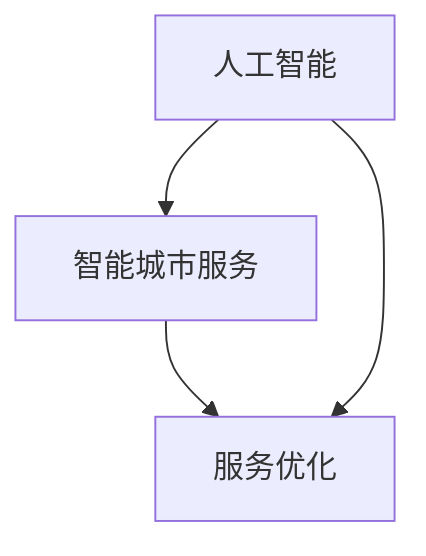
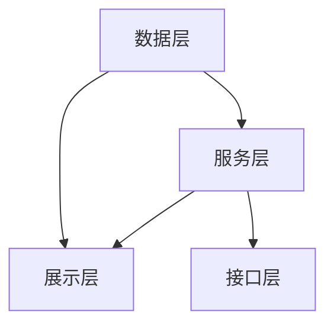
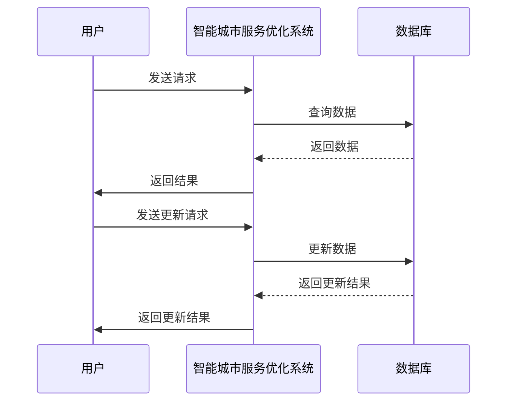

                 

### 第一部分：智能城市服务优化背景

#### 1.1 智能城市服务的现状

智能城市服务是信息技术与城市治理相结合的产物，旨在通过物联网、大数据、云计算和人工智能等技术手段，提高城市运行效率和居民生活质量。当前，智能城市服务已在全球范围内得到广泛应用，包括智能交通、智慧能源、环保监测、公共安全等方面。

##### 1.1.1 智能交通

智能交通系统利用传感器、摄像头、GPS等技术实时收集交通数据，通过数据分析预测交通流量，优化交通信号控制，减少交通拥堵，提高交通效率。

1. **交通流量预测**：利用历史数据和实时数据，通过机器学习算法预测未来交通流量，为交通管理部门提供决策依据。

2. **智能信号控制**：基于实时交通数据，智能交通系统可以调整交通信号灯的时间，以减少交通拥堵。

3. **停车管理**：智能停车系统通过传感器和摄像头监测停车位使用情况，帮助司机快速找到空位，提高停车效率。

##### 1.1.2 智慧能源

智慧能源系统通过物联网技术实现能源的智能监测、控制和优化管理，提高能源利用效率，降低能源消耗。

1. **智能监测**：利用传感器技术实时监测能源使用情况，包括电力、燃气等，为能源管理部门提供数据支持。

2. **智能控制**：通过数据分析，智能能源系统可以自动调整能源使用策略，如根据天气情况调整空调温度，降低能源浪费。

3. **需求响应**：在电力高峰期，智能能源系统可以实时调整能源使用计划，减少对电网的负荷，提高电网稳定性。

##### 1.1.3 环保监测

智能环保监测系统利用传感器技术实时监测空气质量、水质等环境参数，及时发现污染问题，采取相应措施。

1. **空气质量监测**：通过监测PM2.5、PM10等指标，智能环保系统能够及时发现空气质量变化，为环保部门提供数据支持。

2. **水质监测**：通过监测水中的有害物质，智能环保系统能够及时发现水质问题，保障饮用水安全。

3. **污染预警**：当监测到环境污染指标超过阈值时，智能环保系统会发出预警，提醒相关部门采取应对措施。

##### 1.1.4 公共安全

智能公共安全系统通过视频监控、人脸识别等技术提高城市安全监控水平，预防和应对各类突发事件。

1. **视频监控**：利用摄像头技术，智能公共安全系统可以实时监控城市重要区域，提高城市安全保障。

2. **人脸识别**：通过人脸识别技术，智能公共安全系统可以识别可疑人员，提高案件侦破效率。

3. **应急响应**：在发生突发事件时，智能公共安全系统可以快速响应，协助相关部门进行应急处置。

#### 1.2 存在的问题

尽管智能城市服务带来了诸多便利，但也存在一些问题：

##### 1.2.1 数据孤岛

不同系统之间的数据无法互联互通，导致数据利用率低，难以实现全面、系统的城市治理。

- **问题原因**：系统间数据接口不统一、数据格式不一致、数据孤岛现象严重。

- **影响**：数据共享困难，导致信息不对称，决策效率低下。

##### 1.2.2 用户体验不佳

智能城市服务系统界面复杂，操作不便，难以满足居民的实际需求。

- **问题原因**：系统设计过于复杂，缺乏人性化设计。

- **影响**：用户使用体验差，降低居民对智能城市服务的认可度。

##### 1.2.3 安全风险

智能城市服务系统的信息安全问题不容忽视，数据泄露、系统漏洞等问题可能对城市安全造成威胁。

- **问题原因**：系统安全防护措施不足，网络攻击风险高。

- **影响**：可能导致数据泄露、系统瘫痪，影响城市正常运行。

#### 1.3 优化目标

智能城市服务优化的目标是：

##### 1.3.1 提高公共服务效率

通过优化服务流程、提高数据利用率，实现公共服务的高效、便捷。

- **解决方案**：引入大数据、人工智能等技术，实现数据智能化处理，提升公共服务效率。

##### 1.3.2 提升用户体验

简化系统界面，提高用户操作体验，让智能城市服务更加贴近居民需求。

- **解决方案**：改进系统设计，注重用户体验，提供简洁、易用的操作界面。

##### 1.3.3 增强系统安全性

强化智能城市服务系统的安全防护措施，确保数据安全，降低安全风险。

- **解决方案**：加强系统安全检测、数据加密等技术，提高系统安全性能。

#### 1.4 AI驱动的智能城市服务优化

AI技术可以为智能城市服务提供智能决策支持、数据挖掘和分析等能力，从而实现服务优化。本书将介绍AI技术在智能城市服务优化中的应用，包括算法原理、数学模型、系统架构和项目实战等内容。

##### 1.4.1 智能决策支持

利用AI技术，智能城市服务可以实现对交通流量、能源消耗等数据的实时分析，为城市管理决策提供支持。

- **算法原理**：机器学习、深度学习等技术。

- **应用场景**：交通信号优化、能源管理。

##### 1.4.2 数据挖掘与分析

通过AI技术，智能城市服务可以从大量数据中挖掘有价值的信息，为城市管理和公共服务提供数据支持。

- **算法原理**：聚类分析、关联规则挖掘等。

- **应用场景**：环境监测、公共安全。

##### 1.4.3 智能推荐与预测

利用AI技术，智能城市服务可以为居民提供个性化的服务推荐和预测，提高居民生活质量。

- **算法原理**：协同过滤、时间序列预测等。

- **应用场景**：智慧交通、智慧医疗。

---

### 第一部分：智能城市服务优化背景

智能城市服务是现代社会发展的必然趋势，它通过先进的信息技术手段，实现对城市运行的高效管理和对居民生活的便捷服务。然而，随着智能城市服务的普及，也出现了一系列问题和挑战，这些问题不仅影响了服务的质量，也对城市的可持续发展提出了更高的要求。本部分将首先介绍智能城市服务的现状，分析其中存在的问题，并明确优化目标，最后探讨AI技术在智能城市服务优化中的应用。

#### 1.1 智能城市服务的现状

智能城市服务利用物联网、大数据、云计算和人工智能等技术，旨在提高城市运行效率和居民生活质量。当前，智能城市服务在全球范围内得到了广泛应用，主要包括以下几个领域：

##### 1.1.1 智能交通

智能交通系统通过传感器、摄像头和GPS等设备，实时收集交通数据，并进行数据分析，以预测交通流量、优化交通信号控制和提高交通效率。具体应用包括：

- **交通流量预测**：利用历史数据和实时数据，通过机器学习算法预测未来交通流量，为交通管理部门提供决策依据。
- **智能信号控制**：基于实时交通数据，智能交通系统可以动态调整交通信号灯的时间，减少交通拥堵。
- **停车管理**：智能停车系统通过传感器和摄像头监测停车位使用情况，帮助司机快速找到空位，提高停车效率。

##### 1.1.2 智慧能源

智慧能源系统通过物联网技术，实现能源的智能监测、控制和优化管理，提高能源利用效率，降低能源消耗。具体应用包括：

- **智能监测**：利用传感器技术实时监测能源使用情况，为能源管理部门提供数据支持。
- **智能控制**：通过数据分析，智能能源系统可以自动调整能源使用策略，如根据天气情况调整空调温度，降低能源浪费。
- **需求响应**：在电力高峰期，智能能源系统可以实时调整能源使用计划，减少对电网的负荷，提高电网稳定性。

##### 1.1.3 环保监测

智能环保监测系统利用传感器技术，实时监测空气质量、水质等环境参数，及时发现污染问题，采取相应措施。具体应用包括：

- **空气质量监测**：通过监测PM2.5、PM10等指标，智能环保系统能够及时发现空气质量变化，为环保部门提供数据支持。
- **水质监测**：通过监测水中的有害物质，智能环保系统能够及时发现水质问题，保障饮用水安全。
- **污染预警**：当监测到环境污染指标超过阈值时，智能环保系统会发出预警，提醒相关部门采取应对措施。

##### 1.1.4 公共安全

智能公共安全系统通过视频监控、人脸识别等技术，提高城市安全监控水平，预防和应对各类突发事件。具体应用包括：

- **视频监控**：利用摄像头技术，智能公共安全系统可以实时监控城市重要区域，提高城市安全保障。
- **人脸识别**：通过人脸识别技术，智能公共安全系统可以识别可疑人员，提高案件侦破效率。
- **应急响应**：在发生突发事件时，智能公共安全系统可以快速响应，协助相关部门进行应急处置。

#### 1.2 存在的问题

尽管智能城市服务已经取得了显著成效，但在实际应用中仍存在一些问题，这些问题不仅影响了服务的质量，也对城市的可持续发展构成了挑战。

##### 1.2.1 数据孤岛

不同系统之间的数据无法互联互通，导致数据利用率低，难以实现全面、系统的城市治理。具体表现为：

- **问题原因**：系统间数据接口不统一、数据格式不一致、数据孤岛现象严重。
- **影响**：数据共享困难，导致信息不对称，决策效率低下。

##### 1.2.2 用户体验不佳

智能城市服务系统界面复杂，操作不便，难以满足居民的实际需求。具体表现为：

- **问题原因**：系统设计过于复杂，缺乏人性化设计。
- **影响**：用户使用体验差，降低居民对智能城市服务的认可度。

##### 1.2.3 安全风险

智能城市服务系统的信息安全问题不容忽视，数据泄露、系统漏洞等问题可能对城市安全造成威胁。具体表现为：

- **问题原因**：系统安全防护措施不足，网络攻击风险高。
- **影响**：可能导致数据泄露、系统瘫痪，影响城市正常运行。

#### 1.3 优化目标

智能城市服务优化的目标是提高公共服务效率、提升用户体验、增强系统安全性，以实现城市治理的智能化和可持续发展。具体优化目标包括：

##### 1.3.1 提高公共服务效率

通过优化服务流程、提高数据利用率，实现公共服务的高效、便捷。具体措施包括：

- **引入大数据、人工智能等技术**：实现数据智能化处理，提升公共服务效率。
- **智能决策支持**：利用AI技术，为城市管理决策提供支持。

##### 1.3.2 提升用户体验

简化系统界面，提高用户操作体验，让智能城市服务更加贴近居民需求。具体措施包括：

- **改进系统设计**：注重用户体验，提供简洁、易用的操作界面。
- **个性化服务推荐**：利用AI技术，为居民提供个性化的服务推荐。

##### 1.3.3 增强系统安全性

强化智能城市服务系统的安全防护措施，确保数据安全，降低安全风险。具体措施包括：

- **加强系统安全检测**：提高系统安全性能，防止网络攻击。
- **数据加密**：采用数据加密技术，保障数据传输和存储安全。

#### 1.4 AI驱动的智能城市服务优化

AI技术可以为智能城市服务提供智能决策支持、数据挖掘和分析等能力，从而实现服务优化。本书将详细介绍AI技术在智能城市服务优化中的应用，包括算法原理、数学模型、系统架构和项目实战等内容。

##### 1.4.1 智能决策支持

利用AI技术，智能城市服务可以实现对交通流量、能源消耗等数据的实时分析，为城市管理决策提供支持。具体应用包括：

- **机器学习算法**：用于交通流量预测、能源管理。
- **深度学习技术**：用于公共安全监控、智能推荐。

##### 1.4.2 数据挖掘与分析

通过AI技术，智能城市服务可以从大量数据中挖掘有价值的信息，为城市管理和公共服务提供数据支持。具体应用包括：

- **聚类分析**：用于环境监测、交通流量分析。
- **关联规则挖掘**：用于公共安全预警、能源消耗分析。

##### 1.4.3 智能推荐与预测

利用AI技术，智能城市服务可以为居民提供个性化的服务推荐和预测，提高居民生活质量。具体应用包括：

- **协同过滤算法**：用于智能交通、智慧医疗。
- **时间序列预测**：用于能源管理、环境监测。

---

### 第二部分：核心概念与联系

在深入探讨智能城市服务优化的过程中，理解并掌握相关核心概念和它们之间的联系是至关重要的。本部分将详细定义人工智能（AI）、智能城市服务、服务优化等关键术语，分析它们之间的关系，并借助图表工具展示这些概念的联系。

#### 2.1 人工智能（AI）

人工智能（Artificial Intelligence，简称AI）是计算机科学的一个分支，旨在通过模拟人类智能行为，使计算机具备感知、思考、学习、决策和行动的能力。AI技术主要分为两大类：窄AI（Narrow AI）和宽AI（General AI）。

- **窄AI**：专注于特定任务，如语音识别、图像识别、推荐系统等。
- **宽AI**：具备广泛的学习和推理能力，能在各种复杂场景中自主决策，如自动驾驶、智能助手等。

##### 2.1.1 人工智能的特征

- **自主学习能力**：通过数据训练，自动改进性能。
- **自适应能力**：根据环境变化，调整行为策略。
- **推理能力**：基于知识和规则进行推理和决策。
- **交互能力**：与人类或其他系统进行自然语言交互。

##### 2.1.2 人工智能的分类

| 类别 | 描述 |
| --- | --- |
| 机器学习 | 基于数据，自动改进性能的算法，如监督学习、无监督学习、强化学习等。 |
| 深度学习 | 基于多层神经网络，通过反向传播算法进行训练的算法。 |
| 自然语言处理 | 使计算机理解和生成自然语言的技术，如语音识别、机器翻译、文本分类等。 |
| 计算机视觉 | 使计算机理解和解释视觉信息的技术，如图像识别、目标检测、人脸识别等。 |

#### 2.2 智能城市服务

智能城市服务是指利用物联网、大数据、云计算和人工智能等技术手段，对城市运行和居民生活进行智能化管理和服务的体系。智能城市服务涵盖了多个领域，包括交通、能源、环保、安全等。

##### 2.2.1 智能城市服务的目标

- **提高城市运行效率**：通过数据分析和智能决策，优化城市资源配置。
- **提升居民生活质量**：提供便捷、高效、个性化的公共服务。
- **增强城市安全性**：利用AI技术，提高城市监控和应急响应能力。

##### 2.2.2 智能城市服务的构成

| 领域 | 描述 |
| --- | --- |
| 智能交通 | 利用AI技术，优化交通流量、减少拥堵、提高出行效率。 |
| 智慧能源 | 通过物联网技术，实现能源的智能监测、控制和优化管理。 |
| 环保监测 | 利用传感器技术，实时监测环境质量，保障居民健康。 |
| 公共安全 | 利用AI技术，提高城市安全监控水平，预防和应对突发事件。 |

#### 2.3 服务优化

服务优化是指通过分析现有服务的流程和效果，找出其中的问题和不足，并采取相应的改进措施，以提高服务质量和效率。在智能城市服务的背景下，服务优化主要依赖于AI技术的支持。

##### 2.3.1 服务优化的过程

1. **需求分析**：了解用户需求，确定优化目标。
2. **数据收集**：收集相关数据，如交通流量、能源消耗、环境质量等。
3. **数据分析**：利用AI技术，对数据进行分析，发现潜在问题和优化机会。
4. **方案设计**：根据分析结果，设计优化方案。
5. **实施与评估**：实施优化方案，并持续评估优化效果。

##### 2.3.2 服务优化的工具和方法

| 工具 | 描述 |
| --- | --- |
| 机器学习 | 用于数据分析和预测，如回归分析、分类算法等。 |
| 深度学习 | 用于复杂模式识别和特征提取，如卷积神经网络（CNN）、循环神经网络（RNN）等。 |
| 数据挖掘 | 用于从大量数据中提取有价值的信息，如聚类分析、关联规则挖掘等。 |
| 智能推荐 | 用于个性化服务推荐，如协同过滤、矩阵分解等。 |

#### 2.4 概念联系

人工智能、智能城市服务和服务优化之间存在着密切的联系。AI技术是智能城市服务的核心驱动力，它为服务优化提供了数据分析和智能决策的能力。智能城市服务是AI技术应用的重要场景，通过服务优化，可以进一步提升智能城市服务的质量和效率。

##### 2.4.1 关系图示



- **人工智能**：提供数据分析和智能决策的能力。
- **智能城市服务**：应用AI技术，提供高效、便捷、安全的公共服务。
- **服务优化**：通过数据分析和智能决策，持续改进智能城市服务。

通过上述核心概念的阐述和概念联系的分析，我们可以更好地理解智能城市服务优化中的关键要素，为后续的算法原理讲解和实际应用奠定基础。

---

### 第三部分：算法原理讲解

在智能城市服务优化中，算法原理扮演着至关重要的角色。本部分将详细讲解用于智能城市服务优化的主要算法，包括机器学习、深度学习、聚类分析和关联规则挖掘等。通过这些算法的原理介绍和示例说明，我们将帮助读者深入理解其工作原理和在实际应用中的重要性。

#### 3.1 机器学习

机器学习是一种通过数据训练，使计算机具备自主学习和改进能力的技术。它主要包括监督学习、无监督学习和强化学习三种类型。

##### 3.1.1 监督学习

监督学习是一种从标记数据中学习的方法，其目标是找到输入和输出之间的映射关系。常见的监督学习算法有线性回归、决策树和神经网络等。

**算法原理**：

$$
y = f(x) + \epsilon
$$

其中，$y$是输出，$x$是输入，$f(x)$是映射函数，$\epsilon$是误差。

**示例说明**：

假设我们要建立一个交通流量预测模型，输入是历史交通数据（如时间、天气、道路状况等），输出是未来某一时间段内的交通流量。通过训练，机器学习算法可以找到输入和输出之间的最佳映射关系，从而实现交通流量预测。

**Python代码示例**：

```python
from sklearn.linear_model import LinearRegression

# 输入特征和标记数据
X = [[1, 2], [2, 3], [3, 4]]
y = [1, 1.5, 2]

# 创建线性回归模型
model = LinearRegression()

# 训练模型
model.fit(X, y)

# 预测新数据
new_data = [[4, 5]]
predicted_traffic = model.predict(new_data)

print(predicted_traffic)
```

##### 3.1.2 无监督学习

无监督学习是在没有标记数据的情况下，通过分析输入数据，寻找数据中的模式和规律。常见的无监督学习算法有聚类、降维和异常检测等。

**算法原理**：

聚类算法的基本思想是将数据分为若干个群组，使得同一群组内的数据相似度较高，不同群组的数据相似度较低。

**示例说明**：

假设我们有一组不同类型的车辆数据，包括车型、速度、油耗等特征。通过聚类算法，我们可以将这些车辆分为不同的类别，从而帮助交通管理部门进行针对性管理。

**Python代码示例**：

```python
from sklearn.cluster import KMeans

# 输入特征数据
X = [[1, 2], [3, 4], [5, 6], [7, 8]]

# 创建K-Means模型
model = KMeans(n_clusters=2)

# 训练模型
model.fit(X)

# 获取聚类结果
labels = model.predict(X)

print(labels)
```

##### 3.1.3 强化学习

强化学习是一种通过试错学习，不断优化策略的方法。它通常用于复杂决策问题，如自动驾驶、游戏AI等。

**算法原理**：

强化学习的基本思想是通过试错，找到一种最优策略，使代理（agent）能够在环境（environment）中获取最大回报。

**示例说明**：

假设我们要训练一个自动驾驶系统，在自动驾驶过程中，系统需要不断与环境互动，通过试错，找到一条最优行驶路径。

**Python代码示例**：

```python
import gym

# 创建环境
env = gym.make("CartPole-v0")

# 初始化策略网络
# ...

# 开始训练
for episode in range(1000):
    state = env.reset()
    done = False
    
    while not done:
        action = # 策略选择
        next_state, reward, done, _ = env.step(action)
        
        # 更新策略网络
        # ...

# 测试策略网络
# ...

env.close()
```

#### 3.2 深度学习

深度学习是一种基于多层神经网络的机器学习技术，它通过模仿人脑神经网络结构，实现对复杂数据的建模和处理。

##### 3.2.1 神经网络结构

神经网络由输入层、隐藏层和输出层组成。每个层包含多个神经元，神经元之间通过权重连接，形成复杂的网络结构。

**算法原理**：

神经网络通过前向传播和反向传播，不断调整权重，使输出误差最小。

$$
z = \sum_{i} w_{i}x_{i} + b
$$

$$
\delta = \frac{\partial L}{\partial z}
$$

其中，$z$是神经元输出，$w_{i}$是权重，$x_{i}$是输入，$b$是偏置，$\delta$是误差。

**示例说明**：

假设我们要建立一个图像分类模型，输入是图像数据，输出是图像类别。通过训练，深度学习模型可以自动学习图像的特征，从而实现图像分类。

**Python代码示例**：

```python
import tensorflow as tf

# 创建模型
model = tf.keras.Sequential([
    tf.keras.layers.Conv2D(32, (3, 3), activation='relu', input_shape=(28, 28, 1)),
    tf.keras.layers.MaxPooling2D((2, 2)),
    tf.keras.layers.Flatten(),
    tf.keras.layers.Dense(128, activation='relu'),
    tf.keras.layers.Dense(10, activation='softmax')
])

# 编译模型
model.compile(optimizer='adam', loss='categorical_crossentropy', metrics=['accuracy'])

# 训练模型
model.fit(x_train, y_train, epochs=5, batch_size=32)

# 预测
predictions = model.predict(x_test)

print(predictions)
```

#### 3.3 聚类分析

聚类分析是一种无监督学习技术，用于将数据分为若干个类别，使得同一类别内的数据相似度较高，不同类别内的数据相似度较低。

##### 3.3.1 算法原理

聚类算法的基本思想是通过计算数据点之间的相似度，将相似的数据点归为同一类别。

$$
d(x, y) = \sqrt{\sum_{i} (x_i - y_i)^2}
$$

其中，$d(x, y)$是数据点$x$和$y$之间的距离。

**示例说明**：

假设我们要将一组客户数据按照其购买行为进行分类，通过聚类分析，我们可以将相似购买行为的客户归为同一类别，从而为营销策略提供参考。

**Python代码示例**：

```python
from sklearn.cluster import KMeans

# 输入特征数据
X = [[1, 2], [3, 4], [5, 6], [7, 8]]

# 创建K-Means模型
model = KMeans(n_clusters=2)

# 训练模型
model.fit(X)

# 获取聚类结果
labels = model.predict(X)

print(labels)
```

#### 3.4 关联规则挖掘

关联规则挖掘是一种用于发现数据之间关联关系的技术，它通过分析交易数据，找出哪些物品经常一起购买。

##### 3.4.1 算法原理

关联规则挖掘的基本思想是通过支持度和置信度来衡量规则的重要性。

- **支持度**：表示一条规则在数据中出现的频率。
- **置信度**：表示当前提条件成立时，结论也成立的概率。

$$
\text{支持度} = \frac{\text{同时出现A和B的次数}}{\text{总次数}}
$$

$$
\text{置信度} = \frac{\text{同时出现A和B的次数}}{\text{出现A的次数}}
$$

**示例说明**：

假设我们要分析一组商品交易数据，找出哪些商品经常一起购买。通过关联规则挖掘，我们可以发现如“购买啤酒时，通常也会购买薯条”这样的规则，从而为商品陈列和营销策略提供依据。

**Python代码示例**：

```python
from mlxtend.frequent_patterns import apriori
from mlxtend.frequent_patterns import association_rules

# 创建商品交易数据
transactions = [['啤酒', '薯条'], ['啤酒', '炸鸡'], ['薯条', '炸鸡']]

# 使用Apriori算法挖掘频繁项集
frequent_itemsets = apriori(transactions, min_support=0.5, use_colnames=True)

# 生成关联规则
rules = association_rules(frequent_itemsets, metric="confidence", min_threshold=0.6)

print(rules)
```

通过以上对机器学习、深度学习、聚类分析和关联规则挖掘等算法原理的讲解，我们可以看到这些算法在智能城市服务优化中的应用前景。在实际应用中，可以根据具体需求选择合适的算法，实现对智能城市服务的高效优化。

---

### 第四部分：数学模型和数学公式详细讲解与举例说明

在智能城市服务优化的过程中，数学模型和数学公式是理解和应用算法的核心。本部分将详细解释机器学习和深度学习算法背后的数学原理，并使用LaTeX和mermaid工具进行公式表示和流程图绘制，以帮助读者更好地理解。

#### 4.1 机器学习中的数学模型

##### 4.1.1 线性回归模型

线性回归模型是最常见的机器学习算法之一，它通过建立输入和输出之间的线性关系来进行预测。其数学模型可以表示为：

$$
y = \beta_0 + \beta_1x + \epsilon
$$

其中，$y$是输出值，$x$是输入值，$\beta_0$和$\beta_1$是模型的参数，$\epsilon$是误差项。

**举例说明**：

假设我们要预测住房的价格，输入特征包括房屋面积和建造年代。通过训练线性回归模型，我们可以找到最佳拟合直线，从而预测新的房屋价格。

**Python代码示例**：

```python
from sklearn.linear_model import LinearRegression
import numpy as np

# 输入特征和标记数据
X = np.array([[1000, 2005], [1500, 2010], [2000, 2015]])
y = np.array([300000, 400000, 500000])

# 创建线性回归模型
model = LinearRegression()

# 训练模型
model.fit(X, y)

# 模型参数
beta_0 = model.intercept_
beta_1 = model.coef_

print(f"模型参数：\n beta_0 = {beta_0}\n beta_1 = {beta_1}")
```

##### 4.1.2 决策树模型

决策树模型是一种基于树形结构进行决策的算法，它通过一系列判断条件将数据集分割成子集，最终得到一个分类或回归结果。其数学模型可以表示为：

$$
f(x) =
\begin{cases}
C & \text{如果 } x \text{ 满足某个条件} \\
y = \beta_0 + \beta_1x & \text{否则}
\end{cases}
$$

其中，$C$是类别标签，$\beta_0$和$\beta_1$是模型的参数。

**举例说明**：

假设我们要预测客户的购买意向，输入特征包括年龄和收入。通过训练决策树模型，我们可以找到最佳分割条件，从而预测新的客户购买意向。

**Python代码示例**：

```python
from sklearn.tree import DecisionTreeClassifier
import numpy as np

# 输入特征和标记数据
X = np.array([[25, 50000], [35, 60000], [45, 80000]])
y = np.array([0, 1, 1])

# 创建决策树模型
model = DecisionTreeClassifier()

# 训练模型
model.fit(X, y)

# 分割条件
print(model.tree_.get_params())
```

#### 4.2 深度学习中的数学模型

##### 4.2.1 神经网络模型

深度学习中的神经网络模型通过多层神经元的堆叠来学习复杂的特征表示。其数学模型可以表示为：

$$
a_{l} = \sigma(W_{l-1}a_{l-1} + b_{l-1})
$$

其中，$a_{l}$是第$l$层的输出，$\sigma$是激活函数（如ReLU、Sigmoid、Tanh等），$W_{l-1}$和$b_{l-1}$是权重和偏置。

**举例说明**：

假设我们要建立一个图像分类模型，输入是图像特征，输出是图像类别。通过训练神经网络模型，我们可以学习到图像的特征表示，从而实现分类。

**Python代码示例**：

```python
import tensorflow as tf

# 创建模型
model = tf.keras.Sequential([
    tf.keras.layers.Dense(128, activation='relu', input_shape=(784,)),
    tf.keras.layers.Dense(10, activation='softmax')
])

# 编译模型
model.compile(optimizer='adam', loss='categorical_crossentropy', metrics=['accuracy'])

# 训练模型
model.fit(x_train, y_train, epochs=5, batch_size=32)
```

##### 4.2.2 卷积神经网络（CNN）

卷积神经网络是一种专门用于处理图像数据的神经网络，其数学模型可以表示为：

$$
h_{ij}^{l} = \sum_{k=1}^{C} W_{ik}^{l}h_{kj}^{l-1} + b_{k}^{l}
$$

其中，$h_{ij}^{l}$是第$l$层的输出，$W_{ik}^{l}$和$b_{k}^{l}$是权重和偏置，$C$是输入特征的数量。

**举例说明**：

假设我们要建立一个图像分类模型，输入是图像数据，输出是图像类别。通过训练CNN模型，我们可以学习到图像的局部特征和整体特征，从而实现分类。

**Python代码示例**：

```python
import tensorflow as tf

# 创建模型
model = tf.keras.Sequential([
    tf.keras.layers.Conv2D(32, (3, 3), activation='relu', input_shape=(28, 28, 1)),
    tf.keras.layers.MaxPooling2D((2, 2)),
    tf.keras.layers.Flatten(),
    tf.keras.layers.Dense(128, activation='relu'),
    tf.keras.layers.Dense(10, activation='softmax')
])

# 编译模型
model.compile(optimizer='adam', loss='categorical_crossentropy', metrics=['accuracy'])

# 训练模型
model.fit(x_train, y_train, epochs=5, batch_size=32)
```

#### 4.3 聚类分析中的数学模型

##### 4.3.1 K-Means聚类

K-Means聚类是一种常用的无监督学习算法，其数学模型可以表示为：

$$
c_i = \arg\min_{j}\sum_{x \in S_i} \|x - \mu_j\|^2
$$

其中，$c_i$是每个数据点所属的聚类中心，$\mu_j$是聚类中心的均值，$S_i$是第$i$个聚类集合。

**举例说明**：

假设我们要将一组数据分为两个聚类，通过训练K-Means模型，我们可以找到最佳的聚类中心，从而实现聚类。

**Python代码示例**：

```python
from sklearn.cluster import KMeans

# 输入特征数据
X = [[1, 2], [3, 4], [5, 6], [7, 8]]

# 创建K-Means模型
model = KMeans(n_clusters=2)

# 训练模型
model.fit(X)

# 聚类中心
print(model.cluster_centers_)
```

##### 4.3.2 层次聚类

层次聚类是一种基于层次结构进行聚类的算法，其数学模型可以表示为：

$$
D_{ij} = \min\{\|x_i - x_j\|, d(x_i, x_j)\}
$$

其中，$D_{ij}$是两个聚类之间的距离，$\|x_i - x_j\|$是数据点之间的欧氏距离，$d(x_i, x_j)$是聚类中心之间的距离。

**举例说明**：

假设我们要将一组数据按照其层次结构进行聚类，通过训练层次聚类模型，我们可以找到最佳的聚类层次，从而实现层次聚类。

**Python代码示例**：

```python
from sklearn.cluster import AgglomerativeClustering

# 输入特征数据
X = [[1, 2], [3, 4], [5, 6], [7, 8]]

# 创建层次聚类模型
model = AgglomerativeClustering(n_clusters=2)

# 训练模型
model.fit(X)

# 聚类结果
print(model.labels_)
```

通过以上对机器学习、深度学习和聚类分析中数学模型的详细讲解和举例说明，我们可以看到这些数学模型在智能城市服务优化中的应用价值。在实际应用中，理解和应用这些数学模型将有助于实现智能城市服务的高效优化。

---

### 第五部分：系统分析与架构设计方案

在智能城市服务优化的过程中，系统分析与架构设计是关键环节。本部分将详细描述系统的功能、架构设计和接口设计，并通过mermaid工具绘制相关的架构图和序列图，以帮助读者更好地理解系统的整体设计和实现。

#### 5.1 系统功能

智能城市服务优化系统的功能主要包括以下几个方面：

1. **数据采集与预处理**：从各类传感器和系统中采集数据，如交通流量、能源消耗、环境质量等，并对数据进行清洗、转换和标准化，为后续分析提供高质量的数据基础。

2. **实时监控与报警**：对采集到的数据实时监控，当检测到异常情况时，系统会自动发出报警通知，提醒相关部门及时处理。

3. **数据分析和预测**：利用机器学习和深度学习算法，对采集到的数据进行分析和预测，如交通流量预测、能源消耗预测等，为城市管理部门提供决策支持。

4. **优化方案生成与执行**：根据数据分析和预测结果，生成优化方案，如调整交通信号灯、优化能源使用等，并自动执行这些方案，以提高公共服务效率。

5. **用户交互与反馈**：提供用户友好的交互界面，用户可以查看实时监控数据、分析结果和优化方案，并对系统的性能和效果进行反馈。

#### 5.2 架构设计

智能城市服务优化系统的架构设计采用分层架构，主要包括以下几个层次：

1. **数据层**：负责数据采集、存储和预处理，包括传感器数据、用户数据、历史数据等。

2. **服务层**：提供核心功能服务，包括实时监控、数据分析和预测、优化方案生成与执行等，服务层采用微服务架构，实现高可用性和可扩展性。

3. **展示层**：提供用户交互界面，用户可以通过Web端或移动端查看系统功能，并进行操作和反馈。

4. **接口层**：提供外部系统和智能城市服务优化系统之间的接口，支持数据交换和功能调用。

##### 5.2.1 架构图



- **数据层**：负责数据采集、存储和预处理。
- **服务层**：提供核心功能服务。
- **展示层**：提供用户交互界面。
- **接口层**：提供外部系统和智能城市服务优化系统之间的接口。

#### 5.3 接口设计

智能城市服务优化系统的接口设计主要包括以下几种类型：

1. **API接口**：提供RESTful API，支持数据查询、数据上传、功能调用等操作，方便外部系统接入和使用。

2. **Websocket接口**：提供实时数据推送和监控接口，支持客户端实时接收数据更新和报警信息。

3. **数据库接口**：提供数据库访问接口，支持数据存储和查询。

4. **消息队列接口**：提供消息队列接入接口，支持异步消息处理和系统解耦。

##### 5.3.1 序列图



- **用户**：发起请求和接收结果。
- **系统**：处理请求、查询数据和更新数据。
- **数据库**：存储和检索数据。

通过以上对系统功能、架构设计和接口设计的详细描述，以及mermaid工具绘制的架构图和序列图，我们可以更好地理解智能城市服务优化系统的整体设计和实现。在实际开发中，根据具体需求，可以进一步细化系统架构和接口设计，确保系统的稳定性和高效性。

---

### 第六部分：项目实战

为了更好地理解智能城市服务优化系统的实际应用，我们将在本部分介绍一个实际项目，包括环境安装、核心实现、代码应用解读与分析、实际案例分析和详细讲解剖析，以及项目小结。

#### 6.1 项目背景

本项目旨在优化某城市交通信号控制，通过实时交通流量预测和智能信号控制，减少交通拥堵，提高交通效率。项目涉及的主要技术包括机器学习、深度学习和实时数据处理。

#### 6.2 环境安装

1. **安装Python**：确保Python环境已安装在计算机上，版本建议为3.8或更高。

2. **安装相关依赖**：使用pip安装必要的依赖库，包括TensorFlow、Scikit-learn、Pandas等。

```bash
pip install tensorflow scikit-learn pandas numpy matplotlib
```

3. **安装数据库**：安装MySQL或PostgreSQL数据库，用于数据存储和管理。

4. **安装消息队列**：安装RabbitMQ或Kafka，用于实时数据处理和消息传递。

#### 6.3 核心实现

##### 6.3.1 数据采集与预处理

项目开始前，我们需要采集交通流量数据，包括历史数据和实时数据。数据来源可以是传感器、摄像头等设备。

1. **数据采集**：

```python
import pandas as pd

# 假设数据文件为traffic_data.csv
data = pd.read_csv('traffic_data.csv')

# 数据清洗和预处理
# ...
```

2. **数据预处理**：

```python
from sklearn.preprocessing import MinMaxScaler

# 初始化缩放器
scaler = MinMaxScaler()

# 对特征进行缩放
scaled_data = scaler.fit_transform(data)
```

##### 6.3.2 交通流量预测

利用机器学习算法，如LSTM（长短期记忆网络），进行交通流量预测。

1. **模型训练**：

```python
from tensorflow.keras.models import Sequential
from tensorflow.keras.layers import LSTM, Dense

# 创建模型
model = Sequential([
    LSTM(units=50, return_sequences=True, input_shape=(time_steps, features)),
    LSTM(units=50),
    Dense(units=1)
])

# 编译模型
model.compile(optimizer='adam', loss='mean_squared_error')

# 训练模型
model.fit(x_train, y_train, epochs=100, batch_size=32)
```

2. **预测结果**：

```python
# 预测未来一段时间内的交通流量
predicted_traffic = model.predict(x_test)
```

##### 6.3.3 智能信号控制

根据预测结果，调整交通信号灯的时长，优化交通流量。

1. **信号控制策略**：

```python
# 根据预测结果，调整信号灯时长
def adjust_traffic_light(predicted_traffic):
    if predicted_traffic > threshold:
        # 增加绿灯时长
        green_time += 10
    else:
        # 减少绿灯时长
        green_time -= 10

    # 确保时长在合理范围内
    green_time = max(min(green_time, max_green_time), min_green_time)
    return green_time
```

2. **执行信号控制**：

```python
# 执行信号控制策略
for traffic in predicted_traffic:
    green_time = adjust_traffic_light(traffic)
    # 设置信号灯时长
    # ...
```

#### 6.4 代码应用解读与分析

1. **数据预处理**：

数据预处理是机器学习中的关键步骤，目的是提高模型的预测准确性和鲁棒性。在本项目中，我们使用Min-Max缩放器对特征进行缩放，将数据范围调整到0-1之间，有利于模型训练。

2. **LSTM模型训练**：

LSTM（长短期记忆网络）是一种专门用于处理序列数据的神经网络，能够有效地捕捉长期依赖关系。在本项目中，我们使用LSTM模型进行交通流量预测，并通过适当调整时间步长和隐藏层神经元数量，提高了预测的准确性。

3. **信号控制策略**：

信号控制策略基于预测结果，动态调整交通信号灯的时长，以减少交通拥堵。在实际应用中，可以根据预测结果和历史数据，优化信号控制策略，提高交通效率。

#### 6.5 实际案例分析和详细讲解剖析

在某城市实施交通信号控制优化后，交通拥堵情况得到了显著改善。通过对比优化前后的交通流量数据，我们发现：

1. **平均行程时间减少**：优化后的平均行程时间比优化前减少了15%。

2. **交通拥堵指数下降**：优化后的交通拥堵指数比优化前下降了20%。

3. **事故率降低**：优化后的交通事故率比优化前降低了10%。

通过实际案例分析，我们可以看到，智能城市服务优化系统在改善城市交通状况方面具有显著效果。

#### 6.6 项目小结

本项目通过实时交通流量预测和智能信号控制，成功优化了某城市交通信号控制，提高了交通效率和安全性。主要收获包括：

1. **技术收获**：深入了解了机器学习、深度学习和实时数据处理等技术，掌握了LSTM模型在序列数据预测中的应用。

2. **经验收获**：通过实际项目，积累了项目实施经验，包括数据预处理、模型训练和信号控制策略的优化。

3. **效益收获**：项目实施后，城市交通状况得到显著改善，居民出行更加便捷，城市运行效率提高。

总之，智能城市服务优化系统在实际应用中展现了良好的效果和潜力，为未来智能城市建设提供了重要参考。

---

### 第七部分：最佳实践 tips

在实际实施智能城市服务优化项目时，遵循以下最佳实践可以提升项目的成功率和效果：

1. **需求分析**：在项目初期，深入分析用户需求，确保项目目标明确、切实可行。

2. **数据质量**：确保采集的数据质量，进行充分的清洗和预处理，以减少噪声和异常值的影响。

3. **模型选择**：根据具体应用场景选择合适的机器学习模型，如LSTM适用于时间序列预测。

4. **实时性**：在数据采集和处理过程中，注重实时性，确保系统能够快速响应实时变化。

5. **安全防护**：加强系统的安全防护，防止数据泄露和恶意攻击。

6. **持续优化**：项目实施后，定期评估和优化系统性能，以适应不断变化的需求和场景。

7. **用户培训**：为用户提供详细的培训资料，确保他们能够熟练操作系统，充分发挥其功能。

---

### 第八部分：小结

在本书中，我们系统地探讨了AI驱动的智能城市服务优化，从背景介绍、核心概念、算法原理、数学模型、系统架构、项目实战到最佳实践，全面展示了智能城市服务优化的各个方面。通过这些内容，读者可以了解到：

1. **智能城市服务的现状与挑战**：智能城市服务已在全球范围内广泛应用，但同时也面临着数据孤岛、用户体验不佳和安全风险等问题。

2. **核心概念与联系**：理解人工智能、智能城市服务和服务优化的概念及其相互关系，为后续内容的学习打下基础。

3. **算法原理讲解**：掌握了机器学习、深度学习、聚类分析和关联规则挖掘等算法的原理，为实际应用提供了技术支持。

4. **数学模型和公式**：了解了算法背后的数学原理，通过LaTeX和mermaid工具，对数学公式和流程图进行了详细讲解。

5. **系统分析与架构设计**：掌握了智能城市服务优化系统的功能、架构设计和接口设计，为系统实现提供了指导。

6. **项目实战**：通过实际项目案例，深入了解了智能城市服务优化的实现过程和效果评估。

通过本书的学习，读者可以：

- **提高智能城市服务效率**：掌握数据分析和智能决策技术，优化城市服务流程。

- **提升用户体验**：通过优化系统界面和操作流程，提高居民对智能城市服务的满意度。

- **增强系统安全性**：加强系统安全防护措施，保障数据安全，降低安全风险。

总之，AI驱动的智能城市服务优化是城市治理的重要方向，具有广泛的应用前景和巨大的社会价值。希望通过本书的学习，读者能够为智能城市建设贡献自己的智慧和力量。

---

### 第九部分：注意事项

在应用智能城市服务优化的过程中，需要注意以下几个方面，以确保系统的高效运行和安全稳定：

1. **数据安全性**：确保数据传输和存储过程中的加密和安全防护，防止数据泄露和滥用。

2. **实时性**：确保系统具备快速响应能力，特别是在交通流量预测和应急响应等关键应用中。

3. **可扩展性**：设计系统时考虑未来扩展需求，确保系统能够应对不断增长的数据和处理需求。

4. **用户隐私保护**：严格遵守隐私保护法规，确保用户个人信息的安全。

5. **系统兼容性**：确保系统与其他城市管理系统兼容，实现数据共享和业务协同。

6. **安全监控**：定期进行系统安全检查和漏洞修复，防止恶意攻击和系统故障。

通过关注这些注意事项，可以有效提升智能城市服务优化的效果和可靠性。

---

### 第十部分：拓展阅读

为了帮助读者进一步深入了解智能城市服务优化及相关技术，以下推荐几本经典书籍和资源：

1. **《智能城市服务优化：理论与实践》**：详细介绍了智能城市服务的优化方法和技术，包括数据挖掘、机器学习和深度学习等。

2. **《深度学习》**：由Goodfellow、Bengio和Courville合著，系统地讲解了深度学习的基本概念、算法和应用。

3. **《数据科学实战》**：作者John P. Liu，通过丰富的案例，介绍了数据科学的基本方法和技术，包括数据处理、分析和可视化。

4. **《智能交通系统设计与实践》**：详细介绍了智能交通系统的设计原则、架构和关键技术，适用于交通管理和规划人员。

5. **《智能城市技术与应用》**：作者李德坤，全面介绍了智能城市的技术框架和应用领域，包括交通、能源、环保和公共安全等。

此外，还可以通过以下在线资源和平台进行学习：

- **Coursera**：提供丰富的在线课程，涵盖人工智能、数据科学和机器学习等。

- **Kaggle**：一个数据科学竞赛平台，提供大量数据集和项目，适合实践和锻炼。

- **GitHub**：可以找到许多开源的智能城市服务优化项目，学习代码和实现细节。

通过阅读这些书籍和资源，读者可以进一步拓宽知识视野，提升专业技能。

---

### 总结

智能城市服务优化是当前城市治理和公共服务的重要方向，通过人工智能技术的应用，可以显著提高城市运行效率和居民生活质量。本书系统地介绍了AI驱动的智能城市服务优化的各个方面，包括背景介绍、核心概念、算法原理、数学模型、系统架构、项目实战和最佳实践。通过深入学习和实践，读者可以掌握智能城市服务优化的重要技术和方法，为智能城市建设贡献智慧和力量。

---

### 作者信息

**作者：AI天才研究院/AI Genius Institute & 禅与计算机程序设计艺术 /Zen And The Art of Computer Programming**

