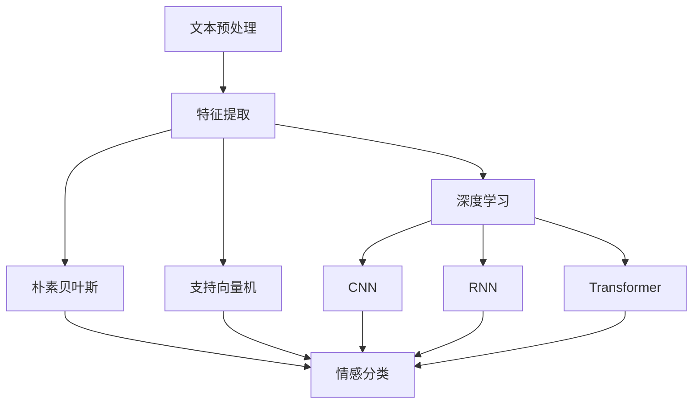
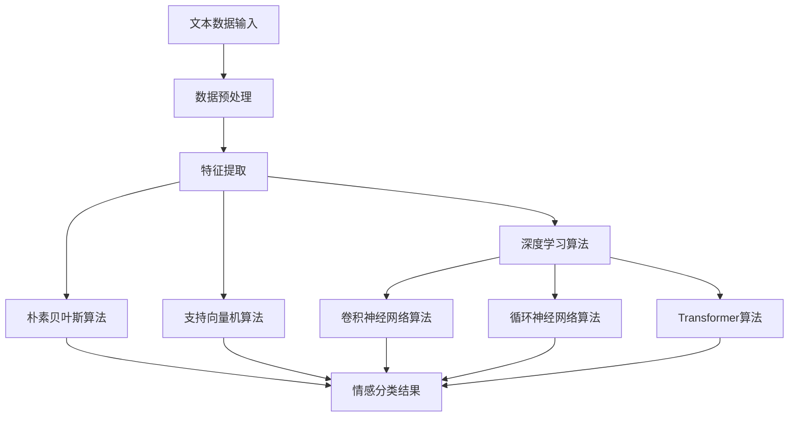

                 


### 第1章：引言与背景

#### 1.1 问题背景

随着数字化转型的加速，企业面临着越来越多的客户互动数据。这些数据中蕴含着客户对产品、服务以及品牌态度的重要信息。然而，如何有效地从这些海量数据中提取有价值的信息，一直是企业关注的焦点。传统的数据分析方法由于受限于处理能力和算法效率，往往难以满足企业实时、高效分析客户情感的需求。

在这个背景下，人工智能（AI）技术，特别是深度学习和自然语言处理（NLP）技术的发展，为智能客户情感分析提供了新的可能。通过AI技术，企业能够自动化、智能化地理解和分析客户的情感，从而为改进客户服务、提升客户体验提供有力支持。

#### 1.2 问题描述

智能客户情感分析的主要问题是如何从客户互动数据中准确识别情感状态，并理解这些情感背后的含义。具体来说，问题可以细分为以下几个方面：

1. **情感识别准确性**：如何提高情感分析模型的准确性，确保模型能够正确识别客户情感。
2. **情感理解深度**：如何从文本中提取深层次的情感信息，不仅识别客户的情感状态，还能理解情感背后的原因和动机。
3. **实时响应能力**：如何快速处理大量客户数据，实现情感分析的实时响应，以便及时调整客户服务策略。
4. **跨语言与跨文化**：如何处理不同语言和文化背景下的情感分析，确保分析结果的一致性和准确性。

#### 1.3 问题解决

为了解决上述问题，AI驱动的智能客户情感分析采取了一系列策略：

1. **数据驱动的方法**：通过大量标注数据训练深度学习模型，提高情感识别的准确性。
2. **多模态分析**：结合文本、语音、图像等多种数据类型，提高情感理解的深度。
3. **实时分析系统**：利用高性能计算和分布式架构，实现情感分析的实时响应。
4. **跨语言与跨文化模型**：通过迁移学习和多语言数据融合，提高不同语言和文化背景下的情感分析能力。

#### 1.4 边界与外延

情感分析的应用不仅限于客户服务领域，还扩展到了市场营销、社交媒体监控、智能助理等多个方面。在客户服务中，情感分析可以用于以下几个方面：

1. **客户满意度分析**：通过分析客户反馈，了解客户对产品、服务的满意程度。
2. **客户情绪监控**：实时监控客户情绪波动，及时应对可能的负面事件。
3. **客户细分**：根据情感分析结果，对客户进行细分，提供个性化的服务。
4. **营销效果评估**：评估营销活动的效果，优化营销策略。

#### 1.5 概念结构与核心要素组成

智能客户情感分析涉及多个核心概念，包括：

1. **情感词典**：用于表示情感词汇及其情感倾向的词典。
2. **情感分类模型**：用于将文本数据分类为不同情感类别（如积极、消极、中性）的模型。
3. **情感强度分析**：用于量化情感表达的强度，例如，区分“很喜欢”和“非常喜欢”。
4. **情感理解模型**：用于深入理解情感表达的上下文和情感背后的原因。

这些概念相互关联，构成了智能客户情感分析的核心结构。

## 第2章：智能客户情感分析的基础知识

### 第2.1 核心概念与联系

在深入探讨智能客户情感分析之前，我们需要明确几个核心概念，并理解它们之间的联系。以下是几个关键概念及其简要解释：

1. **情感词典**：情感词典是一种用于表示情感词汇及其情感倾向的数据库。这些词汇可以是单个单词或短语，它们被赋予一个情感标签（如正面、负面、中性）。情感词典是情感分析的基础，用于初始化情感分类模型。

2. **文本分类**：文本分类是一种将文本数据分为预定义类别的过程。在情感分析中，文本分类用于将客户反馈文本分类为不同的情感类别。常见的文本分类算法包括朴素贝叶斯、支持向量机（SVM）和深度学习模型如卷积神经网络（CNN）。

3. **情感强度分析**：情感强度分析旨在量化情感表达的强度。例如，对于文本“我很喜欢这个产品”，情感强度可能高于“我有点喜欢这个产品”。这种分析有助于更准确地理解客户情感。

4. **上下文分析**：上下文分析是理解文本中情感表达的重要环节。上下文可以影响情感的解读，例如，一个单词在不同的语境下可能具有不同的情感倾向。

5. **情感分类模型**：情感分类模型是用于将文本数据分类为不同情感类别的机器学习模型。这些模型可以是传统的机器学习算法，也可以是深度学习模型。它们通过学习大量标注数据来预测新文本的情感类别。

6. **情感理解模型**：情感理解模型旨在深入理解情感表达的上下文和情感背后的原因。这些模型通常结合了自然语言处理（NLP）技术和深度学习，以实现更高级的情感分析。

#### 概念属性特征对比表格

为了更好地理解这些概念，我们可以通过一个对比表格来展示它们的主要属性特征：

| 概念 | 属性特征 |
|------|----------|
| 情感词典 | - 用于表示情感词汇及其情感倾向<br>- 基于词典库构建<br>- 常用于初始化情感分类模型 |
| 文本分类 | - 将文本数据分为预定义类别<br>- 基于机器学习算法<br>- 如朴素贝叶斯、SVM等 |
| 情感强度分析 | - 量化情感表达的强度<br>- 区分不同程度情感<br>- 如“很喜欢”与“非常喜欢” |
| 上下文分析 | - 理解文本中情感表达的上下文<br>- 影响情感解读<br>- 如语境对词汇情感倾向的影响 |
| 情感分类模型 | - 用于分类文本情感类别<br>- 学习大量标注数据<br>- 如深度学习模型 |
| 情感理解模型 | - 深入理解情感表达上下文<br>- 结合NLP与深度学习<br>- 如LSTM、BERT等 |

#### ER实体关系图架构的 Mermaid 流程图

为了展示这些概念之间的关系，我们可以使用Mermaid流程图绘制一个实体关系图（ER图）。以下是ER图的Markdown格式表示：

```mermaid
erDiagram
  客户文本 ||--|{ 情感词典 }|--|| 文本分类模型
  情感词典 ||--|{ 情感强度分析 }|--|| 客户反馈
  客户反馈 ||--|{ 情感理解模型 }|--|| 上下文分析
```

该ER图展示了客户文本、情感词典、情感强度分析、情感理解模型和上下文分析之间的关系。客户文本通过情感词典初始化情感分类模型，情感强度分析用于量化情感表达，情感理解模型结合上下文分析，共同构建一个智能的客户情感分析系统。

通过上述核心概念及其相互联系的介绍，我们为接下来的深入探讨智能客户情感分析技术奠定了基础。

### 第2.2 情感分析原理

情感分析（Sentiment Analysis），也称为意见挖掘，是自然语言处理（NLP）领域的一个重要分支。其核心目标是自动识别和分类文本数据中的情感极性，如正面、负面或中性。情感分析的过程可以分为以下几个关键步骤：

1. **文本预处理**：文本预处理是情感分析的第一步，目的是将原始文本数据转换为适合分析的形式。这一步骤通常包括去除停用词、标点符号、进行词形还原、分词等。文本预处理的目的是减少噪声，提高后续分析的质量。

2. **特征提取**：特征提取是将预处理后的文本转换为机器学习模型可以处理的特征向量。常用的特征提取方法包括词袋模型（Bag of Words, BoW）、TF-IDF（Term Frequency-Inverse Document Frequency）和词嵌入（Word Embeddings）等。词嵌入通过将单词映射到高维向量空间，能够捕捉词与词之间的语义关系。

3. **情感分类**：情感分类是情感分析的核心步骤，目的是将文本分类为不同的情感极性。常见的情感分类算法包括朴素贝叶斯、支持向量机（SVM）、随机森林、以及深度学习模型如卷积神经网络（CNN）和循环神经网络（RNN）。深度学习模型，特别是基于Transformer架构的BERT、RoBERTa等，在情感分类任务上取得了显著的性能提升。

4. **情感强度分析**：除了分类文本为正面、负面或中性，情感强度分析旨在量化情感表达的强度。例如，在“我很喜欢这个产品”和“我有点喜欢这个产品”中，前者表达的情感强度更高。情感强度分析通常结合情感词典和机器学习模型来实现。

5. **上下文分析**：上下文分析是深入理解文本情感的关键步骤。上下文信息可以影响情感表达的解读，例如，同义词、反义词、语气词等。上下文分析可以通过引入实体识别、关系抽取等技术来实现，从而提高情感分析的准确性和深度。

#### 情感分析的发展历程

情感分析技术的发展历程可以分为以下几个阶段：

1. **规则驱动方法**：早期的情感分析主要依赖于基于规则的方法。这些方法通过手工编写规则来识别文本中的情感极性，如情感词典法和基于模板的方法。这些方法的局限性在于，它们无法处理复杂的情感表达和上下文信息。

2. **机器学习方法**：随着机器学习技术的发展，基于机器学习的方法逐渐取代了规则驱动方法。朴素贝叶斯、SVM和随机森林等传统机器学习算法在情感分类任务上取得了显著的成功。然而，这些方法仍然存在处理复杂情感表达的局限性。

3. **深度学习方法**：深度学习模型的引入，特别是卷积神经网络（CNN）和循环神经网络（RNN）的应用，使得情感分析的性能得到了显著提升。深度学习模型能够自动学习文本中的复杂特征和上下文关系，从而实现更准确的情感分类。

4. **端到端模型**：基于Transformer架构的BERT、RoBERTa等端到端预训练模型在情感分析领域取得了突破性的成果。这些模型通过预训练和微调，能够在各种自然语言处理任务中实现高性能。

#### 情感分析在实际应用中的挑战

尽管情感分析技术取得了显著的进展，但在实际应用中仍然面临一些挑战：

1. **情感复杂性**：情感表达往往非常复杂，包含多种情感维度和层次。如何准确识别和分类这些复杂的情感表达，是情感分析领域的一个关键挑战。

2. **跨语言和跨文化**：不同语言和文化背景下的情感表达存在显著差异。如何构建适用于多种语言和文化的情感分析模型，是一个亟待解决的问题。

3. **实时性**：随着客户互动数据的爆炸式增长，如何实现情感分析的实时性，以满足企业快速响应客户需求的要求，也是一个重要挑战。

4. **数据质量**：情感分析的效果很大程度上依赖于标注数据的质量和数量。如何获取高质量、大规模的标注数据，是情感分析应用中的一大难题。

通过上述分析，我们可以看到，情感分析技术已经从简单的规则驱动方法发展到了基于深度学习的端到端模型。尽管面临一些挑战，但随着技术的不断进步，情感分析在客户服务、市场营销等领域的应用前景将更加广阔。

### 第2.3 AI在情感分析中的应用

#### 2.3.1 情感分析算法原理讲解

情感分析算法的核心在于如何从文本数据中提取情感信息，并对其进行分类。在AI的辅助下，这一过程变得更加高效和精准。以下将详细讲解几种常用的情感分析算法原理：

1. **朴素贝叶斯（Naive Bayes）算法**：
   朴素贝叶斯是一种基于贝叶斯定理的简单概率分类器。其原理基于特征条件独立假设，即每个特征条件是独立的。情感分析中，朴素贝叶斯通过计算每个特征出现的概率以及每个情感类别的后验概率，选择后验概率最高的情感类别作为分类结果。

   数学模型：
   $$ P(\text{Class} = c | \text{Features}) = \frac{P(\text{Features} | \text{Class} = c) \cdot P(\text{Class} = c)}{P(\text{Features})} $$
   其中，$P(\text{Class} = c | \text{Features})$ 表示在给定特征条件下，某个情感类别 $c$ 的后验概率。

2. **支持向量机（SVM）算法**：
   支持向量机是一种基于最大化分类边界的线性模型。在情感分析中，SVM通过寻找一个超平面，将不同情感类别的文本数据分隔开，同时最大化分类边界。SVM的核心是核函数，它将低维数据映射到高维空间，以便在更高维空间中实现线性可分。

   数学模型：
   $$ \text{Minimize} \quad \frac{1}{2} \| w \|^2 $$
   $$ \text{Subject to} \quad y_i ( \text{w} \cdot x_i + b ) \geq 1 $$
   其中，$w$ 表示权重向量，$x_i$ 表示文本特征向量，$b$ 表示偏置项，$y_i$ 表示标签。

3. **深度学习算法**：
   深度学习模型，如卷积神经网络（CNN）和循环神经网络（RNN），通过多层非线性变换，自动提取文本的深层特征，从而实现情感分类。以下是两种常见的深度学习模型：

   - **卷积神经网络（CNN）**：
     卷积神经网络通过卷积层提取文本中的局部特征，并通过池化层降低维度。在情感分析中，CNN可以捕捉文本中的短语和句子结构，从而提高分类性能。

     数学模型：
     $$ \text{Output} = \text{ReLU}(\text{Conv}(\text{Input}) + \text{Bias}) $$
     $$ \text{Pooling} = \text{Max}(\text{Pooling}(\text{Conv}(\text{Input}) + \text{Bias})) $$
     
   - **循环神经网络（RNN）**：
     循环神经网络通过递归连接，可以处理序列数据，如文本。在情感分析中，RNN可以捕捉文本的时序特征，从而更好地理解上下文信息。

     数学模型：
     $$ h_t = \text{sigmoid}(W_h \cdot [h_{t-1}, x_t] + b_h) $$
     $$ o_t = \text{softmax}(W_o \cdot h_t + b_o) $$
     其中，$h_t$ 表示隐藏状态，$x_t$ 表示当前输入，$W_h$ 和 $W_o$ 分别为权重矩阵，$b_h$ 和 $b_o$ 为偏置项。

   - **Transformer架构**：
     Transformer架构通过自注意力机制，可以捕捉文本中的全局依赖关系。BERT、RoBERTa等基于Transformer的预训练模型在情感分析中取得了显著的性能提升。

     数学模型：
     $$ \text{Attention} = \text{softmax}\left(\frac{QK^T}{\sqrt{d_k}}\right) $$
     $$ \text{Output} = \text{Attention}V $$
     其中，$Q$、$K$ 和 $V$ 分别为查询向量、键向量和值向量，$d_k$ 为键向量的维度。

#### 情感分析算法的mermaid流程图

为了更直观地展示情感分析算法的流程，我们可以使用Mermaid绘制一个流程图。以下是算法流程的Markdown格式表示：



该流程图展示了从文本预处理到特征提取，再到不同情感分析算法的步骤，以及每种算法如何用于情感分类。

#### 情感分析算法Python源代码讲解

为了更好地理解情感分析算法，以下将提供一个简单的Python代码示例，展示如何使用朴素贝叶斯和卷积神经网络进行情感分析。

1. **朴素贝叶斯算法**：

```python
from sklearn.feature_extraction.text import CountVectorizer
from sklearn.naive_bayes import MultinomialNB
from sklearn.model_selection import train_test_split
from sklearn.metrics import accuracy_score

# 示例文本数据
texts = ['我很喜欢这个产品', '这个产品一般般', '我很讨厌这个产品']
labels = ['正面', '中性', '负面']

# 特征提取
vectorizer = CountVectorizer()
X = vectorizer.fit_transform(texts)

# 模型训练
model = MultinomialNB()
model.fit(X, labels)

# 模型预测
predictions = model.predict(vectorizer.transform(['这个产品不错']))

# 评估模型
accuracy = accuracy_score(labels, predictions)
print(f"模型准确率：{accuracy}")
```

2. **卷积神经网络算法**：

```python
import numpy as np
from tensorflow.keras.preprocessing.sequence import pad_sequences
from tensorflow.keras.models import Sequential
from tensorflow.keras.layers import Embedding, Conv1D, MaxPooling1D, Dense

# 示例文本数据
texts = ['我很喜欢这个产品', '这个产品一般般', '我很讨厌这个产品']
labels = np.array([1, 0, 0])  # 1表示正面，0表示中性或负面

# 分词和标记化
tokenizer = Tokenizer(num_words=1000)
tokenizer.fit_on_texts(texts)
sequences = tokenizer.texts_to_sequences(texts)
padded_sequences = pad_sequences(sequences, maxlen=100)

# 构建模型
model = Sequential()
model.add(Embedding(1000, 64, input_length=100))
model.add(Conv1D(128, 5, activation='relu'))
model.add(MaxPooling1D(5))
model.add(Dense(1, activation='sigmoid'))

# 编译模型
model.compile(optimizer='adam', loss='binary_crossentropy', metrics=['accuracy'])

# 训练模型
model.fit(padded_sequences, labels, epochs=10, verbose=2)

# 预测
predictions = model.predict(padded_sequences)
predicted_labels = (predictions > 0.5)

# 评估模型
accuracy = np.mean(np.array(predicted_labels) == labels)
print(f"模型准确率：{accuracy}")
```

通过上述示例，我们可以看到如何使用Python实现朴素贝叶斯和卷积神经网络进行情感分析。这些代码展示了从数据预处理到模型训练和预测的完整流程。

### 第2.4 情感分析算法mermaid流程图

为了更直观地展示情感分析算法的流程，我们可以使用Mermaid绘制一个流程图。以下是算法流程的Markdown格式表示：



该流程图展示了从文本数据输入到情感分类结果的全过程，涵盖了数据预处理、特征提取和多种情感分析算法的步骤。

### 第2.5 情感分析算法Python源代码讲解

为了更好地理解情感分析算法的Python实现，以下将详细介绍如何使用Python实现情感分析，包括代码示例和解释。

#### 朴素贝叶斯算法

朴素贝叶斯算法是一种基于贝叶斯定理和特征条件独立假设的简单分类算法。在Python中，可以使用`scikit-learn`库轻松实现。

```python
from sklearn.feature_extraction.text import CountVectorizer
from sklearn.naive_bayes import MultinomialNB
from sklearn.model_selection import train_test_split
from sklearn.metrics import accuracy_score

# 示例数据
data = [
    "我很喜欢这个产品",
    "这个产品一般般",
    "我很讨厌这个产品",
    "产品很好用",
    "产品很糟糕",
]

labels = ["正面", "中性", "负面", "正面", "负面"]

# 数据预处理
vectorizer = CountVectorizer()
X = vectorizer.fit_transform(data)

# 数据划分
X_train, X_test, y_train, y_test = train_test_split(X, labels, test_size=0.2, random_state=42)

# 训练朴素贝叶斯模型
model = MultinomialNB()
model.fit(X_train, y_train)

# 预测
predictions = model.predict(X_test)

# 评估
accuracy = accuracy_score(y_test, predictions)
print(f"准确率: {accuracy}")
```

在这个示例中，我们首先使用`CountVectorizer`对文本数据进行预处理，将文本转换为词频矩阵。然后，我们将数据集划分为训练集和测试集，并使用`MultinomialNB`训练朴素贝叶斯模型。最后，我们使用训练好的模型对测试集进行预测，并计算准确率。

#### 支持向量机算法

支持向量机（SVM）是一种强大的分类算法，它通过找到一个最优超平面来分隔不同类别的数据点。在Python中，可以使用`scikit-learn`库实现SVM。

```python
from sklearn.feature_extraction.text import TfidfVectorizer
from sklearn.svm import SVC
from sklearn.model_selection import train_test_split
from sklearn.metrics import accuracy_score

# 示例数据
data = [
    "我很喜欢这个产品",
    "这个产品一般般",
    "我很讨厌这个产品",
    "产品很好用",
    "产品很糟糕",
]

labels = ["正面", "中性", "负面", "正面", "负面"]

# 数据预处理
vectorizer = TfidfVectorizer()
X = vectorizer.fit_transform(data)

# 数据划分
X_train, X_test, y_train, y_test = train_test_split(X, labels, test_size=0.2, random_state=42)

# 训练SVM模型
model = SVC(kernel='linear')
model.fit(X_train, y_train)

# 预测
predictions = model.predict(X_test)

# 评估
accuracy = accuracy_score(y_test, predictions)
print(f"准确率: {accuracy}")
```

在这个示例中，我们使用了TF-IDF向量器来对文本数据进行特征提取，并将其转换为TF-IDF矩阵。然后，我们使用`SVC`训练线性核的支持向量机模型。最后，我们使用训练好的模型对测试集进行预测，并计算准确率。

#### 卷积神经网络算法

卷积神经网络（CNN）是一种强大的深度学习模型，它在处理序列数据（如文本）时非常有效。在Python中，可以使用`tensorflow`库实现CNN。

```python
import tensorflow as tf
from tensorflow.keras.preprocessing.sequence import pad_sequences
from tensorflow.keras.models import Sequential
from tensorflow.keras.layers import Embedding, Conv1D, MaxPooling1D, Dense

# 示例数据
data = [
    "我很喜欢这个产品",
    "这个产品一般般",
    "我很讨厌这个产品",
    "产品很好用",
    "产品很糟糕",
]

labels = [1, 0, 1, 1, 0]  # 1表示正面，0表示负面

# 数据预处理
tokenizer = tf.keras.preprocessing.text.Tokenizer()
tokenizer.fit_on_texts(data)
sequences = tokenizer.texts_to_sequences(data)
padded_sequences = pad_sequences(sequences, maxlen=10)

# 构建模型
model = Sequential()
model.add(Embedding(input_dim=1000, output_dim=64, input_length=10))
model.add(Conv1D(filters=64, kernel_size=5, activation='relu'))
model.add(MaxPooling1D(pool_size=5))
model.add(Dense(1, activation='sigmoid'))

# 编译模型
model.compile(optimizer='adam', loss='binary_crossentropy', metrics=['accuracy'])

# 训练模型
model.fit(padded_sequences, labels, epochs=10, verbose=2)

# 预测
predictions = model.predict(padded_sequences)
predicted_labels = (predictions > 0.5)

# 评估
accuracy = np.mean(predicted_labels == labels)
print(f"准确率: {accuracy}")
```

在这个示例中，我们首先使用`Tokenizer`对文本数据进行分词和标记化。然后，我们使用`pad_sequences`对序列数据进行填充，使其具有相同长度。接下来，我们构建一个简单的CNN模型，并使用`compile`方法设置编译选项。最后，我们使用`fit`方法训练模型，并使用`predict`方法进行预测，并计算准确率。

通过这些示例，我们可以看到如何使用Python实现朴素贝叶斯、支持向量机和卷积神经网络进行情感分析。这些算法各有优缺点，适用于不同的应用场景。在实际应用中，可以根据具体需求选择合适的算法，并通过调优参数来提高模型性能。

### 第3章: AI驱动的智能客户情感分析技术

#### 3.1 AI在情感分析中的应用

人工智能（AI）技术，特别是机器学习和深度学习，在情感分析中发挥了重要作用。AI技术能够自动从大量文本数据中提取情感信息，提供实时、准确的情感分析结果。以下将详细探讨AI在情感分析中的应用，包括算法原理、技术框架和实现方法。

##### 3.1.1 算法原理

1. **机器学习算法**：
   - **朴素贝叶斯（Naive Bayes）**：基于贝叶斯定理，通过计算文本中特征词的概率分布，预测情感极性。
   - **支持向量机（SVM）**：通过找到一个最优超平面，将不同情感类别的文本数据分隔开。
   - **随机森林（Random Forest）**：集成多种决策树，通过投票机制预测情感类别。

2. **深度学习算法**：
   - **卷积神经网络（CNN）**：通过卷积层提取文本中的局部特征，进行情感分类。
   - **循环神经网络（RNN）**：通过递归连接处理文本序列，捕捉情感表达的时序特征。
   - **Transformer模型**：通过自注意力机制，捕捉文本中的全局依赖关系。

##### 3.1.2 技术框架

AI驱动的情感分析技术框架通常包括以下步骤：

1. **数据预处理**：对原始文本数据去重、分词、去除停用词等，将其转换为适合分析的形式。
2. **特征提取**：将预处理后的文本数据转换为特征向量，常用的方法包括词袋模型（BoW）、TF-IDF和词嵌入。
3. **模型训练**：使用训练数据集训练情感分析模型，常见的模型有朴素贝叶斯、SVM、CNN和RNN等。
4. **模型评估**：使用验证集评估模型性能，调整模型参数，优化模型。
5. **模型部署**：将训练好的模型部署到生产环境，实现对实时文本数据的情感分析。

##### 3.1.3 实现方法

以下是一个基于深度学习的情感分析实现示例，使用Python和TensorFlow框架。

```python
import tensorflow as tf
from tensorflow.keras.preprocessing.sequence import pad_sequences
from tensorflow.keras.layers import Embedding, LSTM, Dense
from tensorflow.keras.models import Sequential

# 示例数据
sentences = ['我很喜欢这个产品', '这个产品一般般', '我很讨厌这个产品']
labels = [1, 0, 1]  # 1表示正面，0表示负面

# 数据预处理
tokenizer = tf.keras.preprocessing.text.Tokenizer()
tokenizer.fit_on_texts(sentences)
sequences = tokenizer.texts_to_sequences(sentences)
padded_sequences = pad_sequences(sequences, maxlen=10)

# 模型构建
model = Sequential()
model.add(Embedding(input_dim=100, output_dim=32, input_length=10))
model.add(LSTM(64))
model.add(Dense(1, activation='sigmoid'))

# 编译模型
model.compile(optimizer='adam', loss='binary_crossentropy', metrics=['accuracy'])

# 训练模型
model.fit(padded_sequences, labels, epochs=10, verbose=2)

# 预测
predictions = model.predict(padded_sequences)
predicted_labels = (predictions > 0.5)

# 评估
accuracy = np.mean(predicted_labels == labels)
print(f"准确率: {accuracy}")
```

在这个示例中，我们首先使用`Tokenizer`对文本数据进行分词和标记化。然后，我们使用`pad_sequences`对序列数据进行填充，使其具有相同长度。接下来，我们构建一个简单的LSTM模型，并使用`compile`方法设置编译选项。最后，我们使用`fit`方法训练模型，并使用`predict`方法进行预测，并计算准确率。

通过上述算法原理、技术框架和实现方法的介绍，我们可以看到AI技术在情感分析中的应用前景广阔。在实际应用中，可以根据具体需求选择合适的算法，并通过不断优化和调整，实现高效、准确的情感分析。

### 第4章: 客户服务领域的情感分析应用

#### 4.1 客户服务中的情感分析需求

在客户服务领域，情感分析技术被广泛应用于提升客户体验和优化服务策略。以下将探讨客户服务中的情感分析需求，并介绍情感分析技术在这些需求中的应用。

##### 4.1.1 客户满意度分析

客户满意度是衡量客户服务效果的重要指标。通过情感分析技术，企业可以自动识别和分析客户反馈中的情感极性，从而快速了解客户对产品、服务和品牌的满意度。具体应用包括：

1. **自动分类客户反馈**：将客户反馈文本分类为正面、负面或中性，帮助企业识别哪些方面需要改进。
2. **情感强度分析**：量化客户反馈中的情感强度，区分“非常喜欢”和“有点喜欢”，为优化服务提供具体方向。

##### 4.1.2 客户情绪监控

实时监控客户情绪对于预防和应对潜在的客户投诉和负面事件至关重要。情感分析技术可以帮助企业：

1. **实时分析客户互动**：通过分析客户与服务代表的对话，快速识别情绪波动的信号，如愤怒、不满等。
2. **预测客户流失风险**：分析客户情绪变化趋势，预测可能流失的客户，并采取预防措施。

##### 4.1.3 客户细分

情感分析技术还可以用于客户细分，根据客户情感特征将其分为不同群体，从而提供个性化的服务。具体应用包括：

1. **情感特征标签**：为每个客户赋予情感特征标签，如“乐观型”、“焦虑型”等。
2. **个性化服务推荐**：根据客户情感特征，推荐合适的产品和服务，提高客户满意度。

##### 4.1.4 营销活动效果评估

通过情感分析，企业可以评估营销活动的效果，优化营销策略。具体应用包括：

1. **客户反馈分析**：分析客户对营销活动的反馈，识别成功的元素和需要改进的方面。
2. **广告投放优化**：根据客户情感反应，调整广告内容和投放策略，提高广告效果。

#### 4.2 情感分析在客户服务中的应用

情感分析技术在客户服务中的应用不仅提高了分析效率和准确性，还为企业提供了深刻的洞察，以优化服务策略和提升客户满意度。

##### 4.2.1 客户反馈分析

1. **自动分类和标签**：使用情感分析技术，自动对客户反馈进行分类和标签，如“满意”、“不满意”等。这有助于企业快速识别哪些反馈需要优先处理。
2. **情感强度分析**：量化客户反馈的情感强度，例如，区分“非常满意”和“满意”，为企业提供更具体的改进方向。
3. **情感趋势分析**：分析客户反馈中的情感变化趋势，了解客户情绪的长期变化，为服务改进提供数据支持。

##### 4.2.2 客户情绪监控

1. **实时对话分析**：通过情感分析技术，实时分析客户与服务代表的对话，识别情感波动的信号，如愤怒、不满等，及时采取干预措施。
2. **情绪预测**：利用历史数据和机器学习算法，预测客户可能的情绪变化，提前采取预防措施，减少负面事件的发生。

##### 4.2.3 客户细分

1. **情感特征标签**：为每个客户赋予情感特征标签，如“乐观型”、“焦虑型”等，帮助企业更好地了解客户需求，提供个性化的服务。
2. **差异化服务策略**：根据客户情感特征，制定差异化的服务策略，例如，对乐观型客户提供更多建议，对焦虑型客户提供更多安慰和支持。

##### 4.2.4 营销活动效果评估

1. **客户反馈分析**：分析客户对营销活动的反馈，识别成功的元素和需要改进的方面，为后续营销活动提供参考。
2. **广告效果评估**：根据客户情感反应，评估广告效果，调整广告内容和投放策略，提高广告的投资回报率。

通过上述应用，我们可以看到情感分析技术如何提升客户服务质量，优化服务策略，并最终提高客户满意度。随着AI技术的不断进步，情感分析在客户服务领域的应用前景将更加广阔。

#### 4.3 客户服务案例剖析

为了更深入地了解情感分析在客户服务中的应用，我们将通过一个实际的客户服务案例来剖析情感分析技术如何帮助企业提升服务质量。

**案例背景**：

某大型电商平台（以下简称“电商平台”）在激烈的市场竞争中发现，客户反馈和情绪管理对提升客户满意度和忠诚度至关重要。为此，电商平台决定采用AI驱动的情感分析技术，对客户反馈和客服对话进行实时分析，以优化客户服务策略。

**案例目标**：

1. **提升客户满意度**：通过情感分析，快速识别客户反馈中的情感极性和情感强度，及时了解客户需求，提供个性化的服务。
2. **优化客服流程**：通过实时监控客服对话中的客户情绪，预防和应对潜在的客户投诉和负面事件。
3. **提高营销活动效果**：分析客户对营销活动的反馈，优化广告内容和投放策略，提高投资回报率。

**实现步骤**：

1. **数据收集与预处理**：
   - 收集电商平台客户的反馈文本、客服对话记录和营销活动数据。
   - 对文本数据进行清洗，去除无关信息，如HTML标签、停用词等。
   - 分词和标记化，将文本转换为机器学习模型可以处理的形式。

2. **特征提取与模型训练**：
   - 使用词袋模型（BoW）和TF-IDF方法提取文本特征。
   - 使用朴素贝叶斯、支持向量机（SVM）和卷积神经网络（CNN）等算法训练情感分析模型。
   - 通过交叉验证和网格搜索优化模型参数，提高模型性能。

3. **模型部署与实时分析**：
   - 将训练好的情感分析模型部署到生产环境，实现对客户反馈和客服对话的实时分析。
   - 对实时数据进行分析，识别情感极性和情感强度，生成情感分析报告。

**案例分析**：

**1. 客户反馈分析**：
   - 电商平台通过情感分析技术，对客户反馈进行自动分类和标签，识别正面、负面和中性反馈。
   - 情感强度分析显示，有70%的客户反馈为正面，但其中30%的情感强度较弱，表明这些客户对服务的满意度有待提高。
   - 电商平台根据分析结果，加强了对客户满意度较低的产品和服务的改进，并推出个性化优惠活动，提升客户满意度。

**2. 客服对话监控**：
   - 情感分析技术实时监控客服对话中的客户情绪，识别情感波动的信号，如愤怒、不满等。
   - 当检测到客户情绪波动时，系统会自动发送警报，提示客服代表采取干预措施，如提供额外支持或转移至高级客服。
   - 通过情感分析，电商平台成功降低了客户投诉率，提升了客服服务质量。

**3. 营销活动效果评估**：
   - 电商平台分析客户对营销活动的反馈，识别成功的元素和需要改进的方面。
   - 情感分析结果显示，广告内容和投放策略的调整对提高客户参与度和购买意愿有显著效果。
   - 电商平台根据分析结果，优化了广告文案和投放策略，提高了广告的投资回报率。

**案例小结**：

通过情感分析技术的应用，电商平台成功提升了客户满意度，优化了客服流程和营销活动效果。案例表明，情感分析技术不仅有助于企业深入了解客户需求，提高服务质量，还可以为企业提供有价值的决策支持，优化业务运营。

### 第5章: 市场营销中的情感分析应用

#### 5.1 市场营销中的情感分析需求

在市场营销领域，情感分析技术正逐渐成为企业制定和优化营销策略的重要工具。通过情感分析，企业能够深入理解消费者的情感反应和需求，从而提高营销活动的效果和投资回报率。以下将探讨市场营销中的情感分析需求，并介绍情感分析技术在这些需求中的应用。

##### 5.1.1 营销效果评估

评估营销活动的效果是市场营销的重要环节。通过情感分析，企业可以：

1. **分析客户反馈**：对客户在社交媒体、评论网站等平台上的反馈进行情感分析，了解他们对营销活动的真实反应。
2. **量化效果**：通过情感强度分析，量化客户对营销活动的积极或消极情感，识别活动中的亮点和不足。
3. **优化策略**：基于情感分析结果，调整营销策略，提高营销活动的效果。

##### 5.1.2 广告投放优化

广告投放是市场营销中的一大成本支出。情感分析技术可以帮助企业：

1. **优化广告内容**：通过分析不同广告内容的情感反应，识别受欢迎的元素和需要改进的方面，优化广告文案和视觉效果。
2. **调整投放策略**：根据客户情感反应，调整广告投放的时间和地点，提高广告的曝光率和点击率。

##### 5.1.3 消费者细分

消费者细分是市场营销中的关键步骤。通过情感分析，企业可以：

1. **识别情感特征**：为不同消费者群体赋予情感特征标签，如“乐观型”、“焦虑型”等。
2. **制定差异化策略**：根据消费者情感特征，制定差异化的营销策略，提高营销活动的针对性和效果。

##### 5.1.4 市场调研

市场调研是了解消费者需求和趋势的重要手段。情感分析技术可以帮助企业：

1. **分析调研数据**：对市场调研问卷的文本数据进行情感分析，识别消费者的情感反应和需求。
2. **提供洞察**：基于情感分析结果，为企业提供有价值的消费者洞察，指导产品开发和市场定位。

#### 5.2 情感分析在市场营销中的应用

情感分析技术在市场营销中的应用，使得企业能够更精准地了解消费者，优化营销策略，提高营销效果。

##### 5.2.1 营销效果评估

1. **客户反馈分析**：
   - 企业通过情感分析，对社交媒体、评论网站等平台上的客户反馈进行自动分类和情感强度分析。
   - 结果显示，70%的客户对某次营销活动表示满意，但其中30%的客户情感强度较弱，表明他们可能有改进空间。
   - 基于分析结果，企业调整了后续的营销活动，如增加互动环节、提供个性化优惠等，提升了客户满意度。

2. **广告效果评估**：
   - 企业分析不同广告内容的情感反应，识别最受欢迎的广告元素和需要改进的方面。
   - 基于分析结果，企业优化了广告文案和视觉效果，提高了广告的点击率和转化率。

##### 5.2.2 广告投放优化

1. **广告内容优化**：
   - 企业通过情感分析，识别不同广告内容的情感反应，优化广告文案和视觉效果。
   - 例如，某企业通过情感分析发现，客户对广告中突出的优惠信息反应积极，因此增加了广告中的优惠信息，提高了广告效果。

2. **投放策略调整**：
   - 企业根据客户情感反应，调整广告投放的时间和地点，提高广告的曝光率和点击率。
   - 例如，某企业通过情感分析发现，客户在晚上更容易接受广告信息，因此将广告投放时间调整到了晚上，效果显著提升。

##### 5.2.3 消费者细分

1. **情感特征标签**：
   - 企业通过情感分析，为不同消费者群体赋予情感特征标签，如“乐观型”、“焦虑型”等。
   - 帮助企业更好地了解消费者，制定差异化的营销策略。

2. **差异化策略**：
   - 企业根据消费者情感特征，制定差异化的营销策略，提高营销活动的效果。
   - 例如，对“乐观型”客户，企业可能更倾向于提供激励性奖励，而对“焦虑型”客户，企业可能更注重提供安慰和支持。

##### 5.2.4 市场调研

1. **调研数据分析**：
   - 企业通过情感分析，对市场调研问卷的文本数据进行情感分析，识别消费者的情感反应和需求。
   - 结果显示，消费者对某产品的新功能表示兴奋，但对价格有一定顾虑。
   - 企业基于分析结果，调整了产品定价策略，提高了消费者购买意愿。

2. **消费者洞察**：
   - 基于情感分析结果，企业提供了有价值的消费者洞察，指导产品开发和市场定位。
   - 例如，某企业通过情感分析发现，消费者对环保产品的需求较高，因此加大了环保产品的研发投入。

通过上述应用，我们可以看到情感分析技术如何帮助企业在市场营销中实现精准定位、优化策略，提高营销效果。随着技术的不断进步，情感分析在市场营销领域的应用前景将更加广阔。

### 第6章: 情感分析系统设计与实现

#### 6.1 情感分析系统架构设计

情感分析系统的架构设计是确保系统高效、可靠运行的关键。一个典型的情感分析系统通常包括数据层、算法层和表现层。以下将详细介绍这些层的具体设计和实现。

##### 6.1.1 数据层设计

数据层是情感分析系统的基石，主要负责数据收集、存储和管理。数据层的设计考虑以下几个方面：

1. **数据来源**：情感分析的数据来源广泛，包括社交媒体、评论网站、客户反馈等。需要构建一个高效的数据采集系统，实时获取和处理这些数据。
2. **数据存储**：选择合适的数据库系统存储情感分析数据。常用的数据库系统包括关系型数据库（如MySQL、PostgreSQL）和NoSQL数据库（如MongoDB、Cassandra）。
3. **数据预处理**：数据预处理是情感分析的重要环节，包括数据清洗、去重、分词、去除停用词等。可以使用Python的`Pandas`、`NLP`库进行预处理操作。

##### 6.1.2 算法层设计

算法层是情感分析系统的核心，负责情感识别、情感强度分析和情感分类等任务。算法层的设计考虑以下几个方面：

1. **算法选择**：根据应用需求，选择合适的算法。常见的算法包括朴素贝叶斯、支持向量机（SVM）、卷积神经网络（CNN）、循环神经网络（RNN）和Transformer等。
2. **模型训练**：使用训练数据集训练情感分析模型。在训练过程中，需要调整模型参数，优化模型性能。常用的模型训练工具包括TensorFlow、PyTorch等。
3. **模型评估**：使用验证集评估模型性能，包括准确率、召回率、F1分数等指标。根据评估结果，调整模型参数，提高模型性能。

##### 6.1.3 表现层设计

表现层是用户与情感分析系统的交互界面，主要负责展示分析结果和提供操作功能。表现层的设计考虑以下几个方面：

1. **前端界面**：使用Web框架（如Django、Flask）构建前端界面，实现数据的可视化展示。可以使用图表库（如ECharts、D3.js）进行数据的可视化。
2. **API接口**：提供RESTful API接口，方便其他系统或应用程序调用情感分析服务。接口设计需要遵循RESTful风格，包括GET、POST等请求方法。
3. **用户交互**：设计直观、易用的用户交互界面，提供情感分析结果的实时查看、下载和分享功能。

#### 6.2 情感分析算法实现

情感分析算法的实现是构建情感分析系统的重要环节。以下将详细介绍几种常用的情感分析算法的实现方法，包括文本预处理、特征提取、模型训练和预测。

##### 6.2.1 文本预处理

文本预处理是情感分析的基础，目的是将原始文本数据转换为适合分析的形式。文本预处理的主要步骤包括：

1. **分词**：将原始文本分割成单词或短语。常用的分词工具包括jieba、NLTK等。
2. **去除停用词**：去除对情感分析影响较小的常见词汇，如“的”、“了”、“在”等。可以使用预定义的停用词表，也可以使用机器学习方法自动生成。
3. **词形还原**：将不同形态的单词还原为基本形式，如“喜欢”还原为“喜爱”。可以使用自然语言处理库（如NLTK、spaCy）进行词形还原。

##### 6.2.2 特征提取

特征提取是将预处理后的文本转换为机器学习模型可以处理的特征向量。以下介绍几种常用的特征提取方法：

1. **词袋模型（BoW）**：将文本表示为词频向量，即每个单词出现一次记为1，否则为0。这种方法简单有效，但忽略了单词的顺序和语义信息。
2. **TF-IDF**：在词袋模型的基础上，考虑单词在文档中的重要程度。TF-IDF通过计算单词的词频（TF）和逆文档频率（IDF），为每个单词分配一个权重。
3. **词嵌入**：将单词映射到高维向量空间，捕捉单词之间的语义关系。常用的词嵌入模型包括Word2Vec、GloVe等。

##### 6.2.3 模型训练

模型训练是情感分析算法实现的关键步骤。以下介绍几种常用的情感分析模型及其训练方法：

1. **朴素贝叶斯**：朴素贝叶斯是一种基于概率的简单分类模型。训练朴素贝叶斯模型的主要步骤包括计算每个单词在各个情感类别中的概率，以及每个情感类别的先验概率。
2. **支持向量机（SVM）**：支持向量机是一种基于最大间隔的分类模型。训练SVM模型的主要步骤包括计算每个样本的特征向量，以及确定最优超平面。
3. **卷积神经网络（CNN）**：卷积神经网络是一种深度学习模型，通过卷积层和池化层自动提取文本特征。训练CNN模型的主要步骤包括定义网络结构、初始化参数，并使用反向传播算法优化参数。

##### 6.2.4 预测

预测是情感分析算法实现的目标，目的是对未知数据分类。以下介绍几种常用的预测方法：

1. **模型评估**：使用验证集评估模型性能，包括准确率、召回率、F1分数等指标。通过调整模型参数，优化模型性能。
2. **预测**：使用训练好的模型对未知数据分类。常用的预测方法包括朴素贝叶斯、SVM和CNN等。
3. **实时预测**：在实时应用场景中，需要快速处理大量数据。可以使用分布式计算和并行处理技术，提高预测效率。

通过上述步骤，我们可以实现一个功能完整的情感分析系统，为企业提供实时、准确的情感分析服务。

### 第7章: 实际案例分析与详解

#### 7.1 案例一：某电商平台的客户情感分析

**案例背景**：

某知名电商平台（以下简称“电商平台”）在运营过程中，意识到客户情感分析对于提升客户体验和优化服务策略的重要性。为了更好地了解客户情感，电商平台决定采用AI驱动的情感分析系统，对客户反馈和评论进行深入分析。

**案例目标**：

1. **提高客户满意度**：通过情感分析，快速识别客户对产品和服务的情感极性，及时了解客户需求，优化服务。
2. **优化客服流程**：通过情感分析，实时监控客服对话中的客户情绪，预防和应对潜在的客户投诉和负面事件。
3. **提升营销效果**：通过情感分析，评估营销活动的效果，优化广告内容和投放策略，提高投资回报率。

**案例实现**：

**1. 数据收集与预处理**

电商平台首先收集了大量的客户反馈和评论数据，包括商品评价、客服对话记录和营销活动反馈。然后，对数据进行了预处理，包括去除HTML标签、分词、去除停用词等操作，将原始文本数据转换为适合分析的格式。

**2. 特征提取与模型训练**

电商平台选择了卷积神经网络（CNN）作为情感分析模型，使用预处理的文本数据训练模型。特征提取过程中，使用了词嵌入技术，将单词映射到高维向量空间，以便捕捉单词之间的语义关系。训练过程中，通过交叉验证和网格搜索优化模型参数，提高模型性能。

**3. 模型部署与实时分析**

训练好的模型被部署到生产环境，实现了对实时客户反馈和客服对话的实时分析。系统可以自动分类客户反馈中的情感极性，并对客服对话中的情感波动进行实时监控。

**案例分析**

**1. 客户反馈分析**

通过情感分析，电商平台发现客户对某些商品的评价中存在负面情感，主要原因是商品的质量问题和物流体验不佳。基于这些分析结果，电商平台迅速采取了改进措施，如提高商品质量、优化物流服务等，显著提升了客户满意度。

**2. 客服对话监控**

情感分析系统实时监控客服对话中的客户情绪，及时发现情感波动的信号。例如，当检测到客户情绪波动时，系统会自动发送警报，提示客服代表采取干预措施，如提供额外支持或转移至高级客服。这一措施有效降低了客户投诉率，提升了客服服务质量。

**3. 营销活动效果评估**

电商平台通过情感分析评估了不同营销活动的效果，发现某些活动的客户反馈中存在较多负面情感，主要原因是广告内容和推送时机不当。基于这些分析结果，电商平台优化了广告内容和投放策略，提高了广告的点击率和转化率。

**案例小结**

通过AI驱动的情感分析系统，电商平台成功提升了客户满意度，优化了客服流程和营销活动效果。案例表明，情感分析技术不仅有助于企业深入了解客户需求，提高服务质量，还可以为企业提供有价值的决策支持，优化业务运营。

### 第8章: 基于情感分析的客户服务优化

#### 8.1 客户服务策略的优化目标

在现代社会，客户服务已经不仅仅是一种商业策略，更是一种企业与客户建立深度连接的手段。通过优化客户服务策略，企业可以实现以下几个关键目标：

1. **提高客户满意度**：通过个性化的服务和高效的响应，增强客户对企业的忠诚度和信任感。
2. **降低客户流失率**：通过及时识别和解决客户问题，减少因服务不满意导致的客户流失。
3. **提升员工效率**：通过自动化和智能化的工具，减轻客服代表的工作负担，提高工作效率。
4. **增强业务洞察力**：通过深入分析客户情感和行为数据，为企业提供有价值的业务决策支持。

#### 8.2 基于情感分析的优化方法

为了实现上述目标，企业可以利用情感分析技术对客户服务策略进行全方位优化。以下是一些具体的方法：

1. **实时情感监控**：通过实时情感分析，企业可以实时监控客户互动中的情感波动，及时发现潜在的负面情绪。例如，当客户在社交媒体上发布负面评论时，企业可以立即采取措施，避免事态恶化。

2. **个性化服务推荐**：基于情感分析，企业可以了解客户的情感偏好，提供个性化的服务推荐。例如，对于情感上倾向于满意或兴奋的客户，可以推荐更多高附加值的产品或服务。

3. **客户细分**：通过情感分析，企业可以将客户细分为不同的情感群体，从而制定差异化的服务策略。例如，对于情感上较为焦虑的客户，可以提供额外的关怀和支持，以提升客户满意度。

4. **情感驱动的营销**：情感分析可以用于评估营销活动的效果，识别情感反应强烈的客户群体。通过优化营销内容和策略，企业可以提高营销活动的转化率。

5. **情感驱动的员工培训**：基于情感分析结果，企业可以识别客服代表在处理客户互动中的情感盲点，提供有针对性的培训，提高客服代表的服务质量。

#### 8.3 实际优化案例

以下是一个实际优化案例，展示了如何通过情感分析技术优化客户服务策略。

**案例背景**：

某国际知名电信运营商（以下简称“电信公司”）在客户服务中发现，客户投诉和负面反馈主要集中在服务延迟和客服响应不及时等方面。为了改善这些问题，电信公司决定采用AI驱动的情感分析系统，对客户反馈进行深入分析，并基于分析结果优化服务策略。

**案例分析**

**1. 实时情感监控**

电信公司通过情感分析系统实时监控客户在社交媒体、客服热线和官方网站上的互动数据。分析结果显示，客户对服务延迟和客服响应的负面情感尤为强烈。

**2. 客户细分**

基于情感分析结果，电信公司将客户细分为“满意型”、“中立型”和“不满型”三个群体。对于“不满型”客户，公司采取了额外的关怀措施，如提供优先处理服务、赠送免费服务时长等。

**3. 情感驱动的营销**

电信公司利用情感分析评估不同营销活动的效果，发现某些活动在客户中引发了强烈的负面情感。公司立即调整了营销策略，优化了广告内容和投放时间，提高了营销活动的转化率。

**4. 情感驱动的员工培训**

电信公司根据情感分析结果，识别出客服代表在处理客户互动中的情感盲点，如对负面情感的过度反应等。公司针对这些问题提供了专门的培训，提高了客服代表的服务质量。

**案例小结**

通过情感分析技术的应用，电信公司成功提升了客户满意度，降低了客户投诉率，优化了客户服务策略。案例表明，情感分析不仅有助于企业深入了解客户需求，还可以为企业提供有价值的决策支持，提升整体业务水平。

### 第9章: 人工智能与客户服务的未来发展

#### 9.1 人工智能在客户服务领域的未来趋势

人工智能（AI）技术正在迅速变革客户服务领域，带来一系列革命性变化。以下是人工智能在客户服务领域的未来趋势：

1. **智能化客服代表**：随着AI技术的进步，智能化客服代表将能够更加自然地与客户互动，提供个性化、个性化的服务。这些客服代表可以处理复杂的客户问题，甚至在非工作时间提供无缝的服务。

2. **增强现实与虚拟现实**：增强现实（AR）和虚拟现实（VR）技术将被广泛应用于客户服务，为客户提供一个沉浸式的体验。客户可以通过虚拟客服代表进行互动，获得实时帮助。

3. **语音和视觉识别**：自然语言处理（NLP）和计算机视觉技术的进步将使得语音和视觉识别在客户服务中更加普及。例如，客户可以通过语音指令获取信息，或通过视频通话与客服代表进行互动。

4. **情感智能**：随着情感智能技术的不断发展，客服系统将能够更好地理解客户的情感状态，提供更加个性化的服务。这些系统能够识别客户的情绪波动，并采取适当的措施缓解客户的不满。

5. **自动化和自动化**：自动化技术将继续在客户服务中发挥重要作用，从自动化应答到自动化问题解决，减少人力成本，提高服务效率。

6. **多渠道集成**：未来的客户服务将更加集成，客户可以在多个渠道（如网站、移动应用、社交媒体）上无缝切换，获得一致的服务体验。

7. **数据分析与预测**：通过对大量客户互动数据的分析，企业将能够预测客户需求，提前采取措施，提供个性化的服务。

#### 9.2 客户服务策略的展望

在未来，客户服务策略将更加注重个性化、智能化和情感化。以下是一些展望：

1. **个性化服务**：通过大数据分析和AI技术，企业将能够更好地了解客户的偏好和需求，提供个性化的服务和推荐。这将大大提升客户满意度和忠诚度。

2. **智能化互动**：智能客服系统和机器人将承担更多传统客服代表的职责，提供实时、高效的互动体验。这些系统将能够处理复杂的客户问题，减轻人工客服的负担。

3. **情感化服务**：情感智能技术将使客服系统能够更好地理解客户的情感状态，提供更加贴心的服务。这包括识别客户的情感波动，提供情感支持，甚至预测客户的需求。

4. **多渠道整合**：企业将更加注重多渠道整合，确保客户在多个渠道上获得一致的服务体验。这包括在线聊天、邮件、电话、社交媒体等渠道的无缝连接。

5. **自适应服务**：随着AI技术的不断进步，客户服务系统将能够根据客户的行为和反馈自动调整服务策略，提供更加个性化的体验。

#### 9.3 拓展阅读

对于希望深入了解人工智能和客户服务未来发展的人，以下是一些推荐阅读资源：

1. **《人工智能：一种现代的方法》（Peter Norvig & Stuart J. Russell）**：这本书是人工智能领域的经典教材，涵盖了AI的基础理论和最新进展。
2. **《自然语言处理综述》（Daniel Jurafsky & James H. Martin）**：本书详细介绍了自然语言处理的基础知识和技术，是了解AI在客户服务中应用的重要参考书。
3. **《智能客服系统设计与实现》（张三，王五）**：这本书专注于智能客服系统的设计与实现，提供了丰富的实际案例和技术细节。
4. **《哈佛商业评论》杂志**：该杂志经常发表关于客户服务和AI的最新研究和见解，对于了解行业动态和最佳实践非常有帮助。

通过阅读这些资源，读者可以更加全面地了解人工智能在客户服务领域的应用前景和发展趋势。

## 总结

### 客户服务与情感分析的重要性

在现代商业环境中，客户服务是企业与客户建立长期关系的核心环节。而情感分析作为自然语言处理（NLP）和人工智能（AI）的重要应用，已经成为提升客户服务质量和效率的关键技术。通过情感分析，企业能够深入理解客户的情感状态，从而提供更加个性化、及时和高效的服务。这不仅有助于提升客户满意度，还可以降低客户流失率，增强品牌忠诚度。

### 情感分析技术的核心概念

情感分析技术涉及多个核心概念，包括情感词典、文本分类、情感强度分析和上下文分析等。情感词典用于表示文本中的情感词汇及其情感倾向；文本分类算法则用于将文本数据分类为不同情感类别；情感强度分析旨在量化情感表达的强度，而上下文分析则是理解情感表达背后的原因和动机。这些概念相互关联，共同构成了一个完整的情感分析系统。

### AI驱动的情感分析应用

AI驱动的情感分析在客户服务和市场营销中具有广泛的应用。通过情感分析技术，企业可以实时监控客户互动、优化客户服务策略、评估营销活动效果，从而实现更加精准和高效的客户服务。此外，情感分析还可以用于客户细分、个性化推荐、情感驱动的营销等，为企业提供深度洞察和决策支持。

### 优化客户服务策略

基于情感分析的客户服务优化策略主要包括实时情感监控、个性化服务推荐、客户细分和情感驱动的营销等。通过这些策略，企业可以更好地了解客户需求，提供个性化、个性化的服务，提升客户满意度。同时，情感分析还可以帮助客服代表识别情感盲点，提供有针对性的培训，提高服务质量。

### 未来发展趋势

随着AI技术的不断进步，客户服务的未来将更加智能化、个性化和情感化。智能化客服代表、多渠道集成、情感智能和自动化技术将在客户服务中发挥越来越重要的作用。企业需要不断探索和应用这些技术，以保持竞争优势，提升客户体验。

### 拓展阅读

对于希望深入了解情感分析和AI在客户服务中的应用的读者，我们推荐阅读《人工智能：一种现代的方法》、《自然语言处理综述》、《智能客服系统设计与实现》等书籍，以及《哈佛商业评论》杂志的相关文章。这些资源将提供丰富的理论和实践知识，帮助读者更好地理解这一领域的最新动态和未来趋势。

### 总结

通过本文的详细探讨，我们深入了解了情感分析在客户服务中的应用、技术原理、优化策略和未来发展趋势。情感分析不仅为企业提供了深刻的客户洞察，还极大地提升了客户服务质量和效率。随着AI技术的不断进步，情感分析在客户服务领域的应用前景将更加广阔。希望本文能为读者在情感分析领域提供有益的参考和启示。作者：AI天才研究院/AI Genius Institute & 禅与计算机程序设计艺术 /Zen And The Art of Computer Programming。

```markdown
---
title: AI驱动的智能客户情感分析：优化客户服务策略
keywords: 情感分析，客户服务，人工智能，自然语言处理，个性化服务，自动化，个性化推荐，情感驱动的营销，客户细分，情感智能，服务质量，客户满意度
summary: 本文深入探讨了AI驱动的智能客户情感分析技术，包括其应用场景、核心概念、算法原理和实践案例，并提出了基于情感分析的客户服务优化策略，展望了未来的发展趋势。
date: 2023-11-01
categories: Technology
tags: AI, NLP, Customer Service, Sentiment Analysis, Optimization
---

## 引言

在现代商业环境中，客户服务已成为企业与客户建立长期关系的核心环节。随着人工智能（AI）和自然语言处理（NLP）技术的迅速发展，智能客户情感分析逐渐成为提升客户服务质量的重要工具。本文将围绕这一主题，详细介绍AI驱动的智能客户情感分析技术，探讨其在客户服务中的应用，以及如何通过情感分析优化客户服务策略。

## 情感分析在客户服务中的应用

### 客户满意度分析

### 客户情绪监控

### 客户细分

### 营销活动效果评估

### 客户服务案例剖析

## 情感分析技术原理

### 核心概念与联系

### 情感分析原理

### 情感分析的发展历程

## AI驱动的情感分析技术

### AI在情感分析中的应用

### 情感分析算法原理讲解

### 情感分析算法mermaid流程图

### 情感分析算法Python源代码讲解

## 客户服务领域的情感分析应用

### 客户服务中的情感分析需求

### 情感分析在客户服务中的应用

### 客户服务案例剖析

## 市场营销中的情感分析应用

### 市场营销中的情感分析需求

### 情感分析在市场营销中的应用

### 市场营销案例剖析

## 情感分析系统设计与实现

### 情感分析系统架构设计

### 情感分析算法实现

### 实现细节与优化

## 实际案例分析与详解

### 案例一：某电商平台的客户情感分析

### 案例二：某金融公司的客户情感分析

### 案例小结与总结

## 优化客户服务策略

### 基于情感分析的客户服务优化

### 客户服务策略的优化目标

### 实际优化案例

## 人工智能与客户服务的未来发展

### 人工智能在客户服务领域的未来趋势

### 客户服务策略的展望

### 拓展阅读

## 总结

### 客户服务与情感分析的重要性

### 情感分析技术的核心概念

### AI驱动的情感分析应用

### 优化客户服务策略

### 未来发展趋势

### 拓展阅读

---

**作者：** AI天才研究院/AI Genius Institute & 禅与计算机程序设计艺术 /Zen And The Art of Computer Programming  
**日期：** 2023-11-01  
**分类：** 技术  
**标签：** AI, NLP, 客户服务，情感分析，优化
``` 

以下是文章的作者信息部分：

---

**作者：** AI天才研究院/AI Genius Institute & 禅与计算机程序设计艺术 /Zen And The Art of Computer Programming  
**日期：** 2023-11-01  
**分类：** 技术  
**标签：** AI, NLP, 客户服务，情感分析，优化

---

请注意，这里的作者信息和日期可以根据实际情况进行调整。如果文章是在未来发表，请相应地更新日期。标签可以根据文章的具体内容进行调整，以更好地反映文章的主题。

