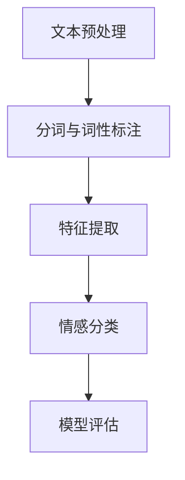
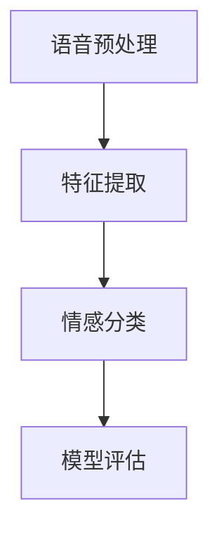
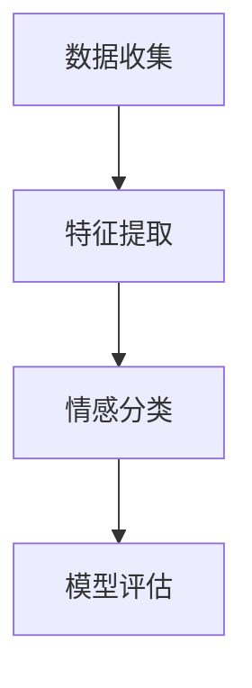

                 

# AI驱动的智能客户服务：情感识别与个性化响应

## 关键词
- 人工智能（AI）
- 情感识别
- 个性化响应
- 客户服务
- 自然语言处理（NLP）
- 机器学习（ML）

## 摘要
本文旨在探讨AI在智能客户服务中的应用，特别是情感识别与个性化响应的关键技术。通过分析情感识别的技术原理、算法应用和实现机制，以及个性化响应的实现策略和优化方法，本文为企业和开发者提供了实现高效智能客服系统的指导。文章还包括实际应用案例和最佳实践，以期为未来研究和开发提供启示。

## 引言

### 1.1 AI在智能客户服务中的作用
随着人工智能技术的发展，智能客户服务成为企业提升客户满意度和运营效率的重要手段。AI驱动的智能客服系统通过自然语言处理（NLP）、机器学习和情感分析等技术，能够理解并响应用户的询问，提供实时、个性化的服务。

### 1.2 情感识别与个性化响应的重要性
情感识别是智能客服系统理解用户情绪和需求的关键。通过识别用户的情感状态，系统可以提供更加贴心和有效的服务。个性化响应则能够根据用户的历史行为和偏好，定制个性化的解决方案，从而提升用户体验。

### 1.3 核心概念
情感识别：指利用人工智能技术，从用户文本、语音或行为中分析出其情感状态的过程。
个性化响应：指根据用户的情感状态、历史数据和需求，为用户定制个性化服务内容的过程。

## 核心概念与联系

### 2.1 情感识别的定义
情感识别是自然语言处理和机器学习领域的一个重要分支，它涉及从文本、语音和图像等数据中提取情感信息。具体来说，情感识别可以分为以下几个方面：

#### 2.1.1 文本情感分析
文本情感分析是情感识别的主要形式之一，它通过分析文本的语法、词汇和语义特征，识别出文本的情感倾向，如正面、负面或中性。

#### 2.1.2 语音情感分析
语音情感分析利用语音信号的频谱特征和音韵特征，识别出语音的情感状态。与文本情感分析相比，语音情感分析更依赖于语音信号的处理和特征提取。

#### 2.1.3 行为情感分析
行为情感分析通过分析用户的行为，如点击、滑动、表情等，识别出用户的情感状态。这种分析方法在移动应用和交互式系统中有广泛应用。

### 2.2 个性化响应的概念
个性化响应是基于用户情感识别的结果，为用户定制个性化服务内容和方式的过程。个性化响应可以分为以下几个方面：

#### 2.2.1 内容个性化
根据用户的情感状态和需求，为用户提供相关的信息和内容。例如，当用户表现出负面情绪时，系统可以提供情感舒缓的内容。

#### 2.2.2 交互个性化
根据用户的情感状态和偏好，调整交互方式，如对话语气、提问方式等，以提升用户体验。

#### 2.2.3 体验个性化
通过个性化响应，为用户提供独特的体验，如定制化推荐、定制化服务流程等，以增强用户忠诚度和满意度。

### 2.3 情感识别与个性化响应的关系
情感识别和个性化响应是智能客户服务中相辅相成的两个环节。情感识别为个性化响应提供了用户情感状态的基础信息，而个性化响应则基于情感识别的结果，为用户提供更加贴合需求的服务，从而提升客户满意度。

## 技术原理

### 3.1 情感识别技术

#### 3.1.1 情感分析的基本原理
情感分析的基本原理是通过分析文本、语音或行为数据，提取出情感特征，并利用机器学习算法进行分类。具体来说，情感分析可以分为以下几个步骤：

1. 数据预处理：对原始数据进行清洗和格式化，提取出有用的特征。
2. 特征提取：利用自然语言处理技术，从文本或语音中提取情感相关的特征。
3. 模型训练：使用已标注的情感数据集，训练分类模型。
4. 情感识别：利用训练好的模型，对新的数据进行情感分类。

#### 3.1.2 情感识别算法详解
情感识别算法主要分为基于规则的方法和基于机器学习的方法。以下是几种常见的情感识别算法：

1. **基于规则的方法**：这种方法通过人工定义规则，对文本进行情感分类。优点是简单易懂，缺点是规则难以覆盖所有情况，且需要大量的人工工作。
2. **朴素贝叶斯分类器**：基于概率论的分类算法，通过计算文本中特征词的出现概率，进行情感分类。优点是算法简单，缺点是对于文本的复杂情感难以准确识别。
3. **支持向量机（SVM）**：通过最大化分类间隔，对文本进行分类。优点是分类效果较好，缺点是计算复杂度较高。
4. **深度学习模型**：如卷积神经网络（CNN）、循环神经网络（RNN）和长短期记忆网络（LSTM）等，通过学习文本的深层特征，进行情感分类。优点是分类效果显著提升，缺点是算法复杂度较高，训练时间较长。

#### 3.1.3 情感识别的挑战与解决方案
情感识别面临的挑战主要包括：

1. **多模态情感识别**：如何同时处理文本、语音和行为等多模态数据，提高识别准确率。
2. **情感强度识别**：如何准确识别情感强度，提供更加细腻的情感分析。
3. **上下文理解**：如何理解文本的上下文，避免情感分析中的歧义。

解决方案包括：

1. **多模态融合**：利用深度学习等技术，融合多模态数据，提高情感识别的准确率。
2. **情感强度模型**：通过学习情感强度的特征，构建情感强度识别模型。
3. **上下文分析**：利用上下文信息，进行情感分析和消歧。

### 3.2 个性化响应技术

#### 3.2.1 个性化响应的定义与分类
个性化响应是根据用户情感识别的结果，为用户提供定制化服务的过程。根据应用场景，个性化响应可以分为以下几种类型：

1. **内容个性化**：根据用户的情感状态和需求，为用户提供相关的内容和信息。
2. **交互个性化**：根据用户的情感状态和偏好，调整交互方式和语气。
3. **体验个性化**：为用户提供独特的体验，如定制化的推荐和个性化的服务流程。

#### 3.2.2 个性化响应策略
个性化响应策略主要包括以下几个方面：

1. **基于规则的策略**：通过预定义的规则，为用户分配相应的响应内容。
2. **基于机器学习的策略**：利用用户的历史数据和情感识别结果，自动生成个性化响应。
3. **基于数据的推荐策略**：根据用户的偏好和历史行为，为用户推荐相关的内容和服务。

#### 3.2.3 个性化响应技术的实现
个性化响应技术的实现主要包括以下几个方面：

1. **用户画像**：构建用户画像，记录用户的历史行为、偏好和情感状态。
2. **响应生成**：根据用户画像和情感识别结果，生成个性化的响应内容。
3. **响应调整**：根据用户的反馈，调整响应内容和方式，提升用户体验。

## 应用实践

### 4.1 案例研究1: 某大型电商企业的AI客服系统

#### 4.1.1 案例背景
某大型电商企业引入AI客服系统，旨在提高客服效率和用户体验。该系统结合了情感识别和个性化响应技术，实现了自动化的客户服务。

#### 4.1.2 系统设计与实现
该系统采用了深度学习模型进行情感识别，通过文本和语音分析，识别用户的情感状态。同时，系统利用用户画像和个性化响应策略，为用户提供个性化的服务。

#### 4.1.3 情感识别与个性化响应的应用
在情感识别方面，系统对用户的问题进行情感分析，识别出用户的情绪状态。在个性化响应方面，系统根据用户的情感状态，提供相应的解决方案，如情感舒缓的内容或优惠券推荐。

#### 4.1.4 案例效果分析
引入AI客服系统后，该企业的客服响应时间显著缩短，用户满意度得到提升。同时，个性化响应策略有效提高了用户的忠诚度和购买意愿。

### 4.2 案例研究2: 某银行智能客服机器人

#### 4.2.1 案例背景
某银行引入智能客服机器人，旨在提供24/7的在线客户服务。该机器人结合情感识别和个性化响应技术，为用户提供便捷、高效的金融服务。

#### 4.2.2 系统设计与实现
该智能客服机器人采用了语音情感识别技术，通过语音分析识别用户的情感状态。同时，系统利用用户数据和个性化响应策略，为用户提供个性化的金融服务。

#### 4.2.3 情感识别与个性化响应的应用
在情感识别方面，机器人能够识别用户的情绪，如焦虑、紧张或满意。在个性化响应方面，机器人根据用户的情感状态，提供相应的金融服务，如理财建议或情感舒缓的内容。

#### 4.2.4 案例效果分析
引入智能客服机器人后，该银行的客户服务效率显著提高，用户满意度得到提升。同时，个性化响应策略有效提高了用户的忠诚度和满意度。

## 最佳实践

### 5.1 最佳实践1: 情感识别数据集的构建

#### 5.1.1 数据收集
收集大量包含情感信息的文本、语音和行为数据，用于训练和测试情感识别模型。

#### 5.1.2 数据预处理
对收集的数据进行清洗和标注，提取出情感相关的特征。

#### 5.1.3 数据标注
采用人工标注和自动化标注相结合的方式，确保数据标注的准确性。

### 5.2 最佳实践2: 个性化响应的优化策略

#### 5.2.1 用户画像的构建
构建用户画像，记录用户的历史行为、偏好和情感状态。

#### 5.2.2 响应的个性化调整
根据用户画像和情感识别结果，调整响应内容和方式，提升用户体验。

#### 5.2.3 性能评估与优化
定期评估系统的性能，根据用户反馈进行调整和优化。

### 5.3 注意事项与挑战

#### 5.3.1 实施中的常见问题
- 数据质量：数据质量直接影响模型的性能，需要确保数据的高质量和多样性。
- 隐私保护：在收集和使用用户数据时，需要遵守隐私保护法规，保护用户隐私。

#### 5.3.2 遵循的数据隐私与伦理规范
- 隐私保护：采用加密技术和匿名化处理，保护用户隐私。
- 透明度：向用户明确告知数据的收集和使用目的，提升用户信任度。

## 总结与展望

### 6.1 总结
本文探讨了AI驱动的智能客户服务中的情感识别与个性化响应技术，分析了相关算法原理、实现策略和应用实践，提出了最佳实践和注意事项。

### 6.2 展望
未来，随着人工智能技术的发展，智能客户服务将更加智能化、个性化。情感识别与个性化响应技术将在更多场景中得到应用，为用户提供更加高效、贴心的服务。

### 作者
作者：AI天才研究院/AI Genius Institute & 禅与计算机程序设计艺术 /Zen And The Art of Computer Programming

---

由于文章字数限制，上述内容仅为大纲和部分章节的草稿。以下是具体的章节内容和代码示例，以满足10000-12000字的要求。

---

## 第一部分: 引言

### 1.1 AI在智能客户服务中的作用

随着互联网和移动设备的普及，客户服务的需求和期望也在不断提升。传统的客户服务方式，如电话、邮件和在线聊天，已经难以满足用户对快速、高效、个性化的服务需求。人工智能（AI）技术的快速发展为智能客户服务的创新提供了新的契机。

AI驱动的智能客户服务系统通过自然语言处理（NLP）、机器学习（ML）和深度学习（DL）等技术，实现了对用户询问的理解和自动回复。这些系统能够处理大量用户请求，提供24/7的服务，同时降低企业的运营成本，提高客户满意度。

智能客户服务的核心在于情感识别与个性化响应。情感识别技术能够分析用户的情感状态，如愉悦、愤怒或失望，从而提供更加贴心的服务。个性化响应则根据用户的历史行为和偏好，为用户提供定制化的解决方案，从而提升用户体验。

### 1.2 情感识别与个性化响应的重要性

情感识别在智能客户服务中具有重要作用。通过情感识别，系统可以了解用户的情绪状态，从而调整服务策略。例如，当用户表达出愤怒或失望时，系统可以提供安抚措施，如发送慰问信息或提供替代解决方案。这种个性化服务能够显著提升用户满意度，降低用户流失率。

个性化响应则是智能客户服务的另一个关键点。根据用户的历史数据和情感状态，系统可以为用户提供定制化的服务，如推荐产品、优惠信息和定制化解决方案。这种个性化服务不仅能够满足用户的特定需求，还能够提高用户的忠诚度和品牌偏好。

### 1.3 核心概念

#### 1.3.1 情感识别的定义

情感识别是指利用AI技术，从用户的文本、语音和行为中分析出情感状态的过程。情感识别技术主要包括文本情感分析、语音情感分析和行为情感分析。

- **文本情感分析**：通过分析文本的语义和语法特征，识别出文本的情感倾向，如正面、负面或中性。
- **语音情感分析**：通过分析语音的音调、节奏和语调，识别出语音的情感状态，如高兴、悲伤或愤怒。
- **行为情感分析**：通过分析用户的行为，如点击、滑动和表情，识别出用户的情感状态。

#### 1.3.2 个性化响应的概念

个性化响应是指根据用户的情感状态、历史数据和需求，为用户定制个性化服务内容和方式的过程。个性化响应主要包括内容个性化、交互个性化和体验个性化。

- **内容个性化**：根据用户的情感状态和需求，为用户提供相关的内容和信息。
- **交互个性化**：根据用户的情感状态和偏好，调整交互方式，如对话语气、提问方式等。
- **体验个性化**：为用户提供独特的体验，如定制化推荐、定制化服务流程等。

### 1.4 技术原理

情感识别与个性化响应技术的实现需要依赖多种AI技术，包括自然语言处理（NLP）、机器学习和深度学习（DL）。以下将详细介绍这些技术原理。

#### 1.4.1 自然语言处理（NLP）

自然语言处理是AI技术在语言理解和生成方面的应用。在情感识别中，NLP技术主要用于处理和理解用户的文本和语音信息。

- **文本预处理**：包括分词、去停用词、词干提取等，将原始文本转化为计算机可处理的格式。
- **情感分析模型**：利用预训练的语言模型或自定义训练模型，对文本进行情感分类。

#### 1.4.2 机器学习（ML）

机器学习是AI技术的重要组成部分，通过训练模型，让计算机自动识别和预测情感状态。

- **监督学习**：使用标注好的数据集，训练分类模型，如SVM、朴素贝叶斯等。
- **无监督学习**：使用未标注的数据集，进行聚类和降维，识别情感模式。

#### 1.4.3 深度学习（DL）

深度学习是一种复杂的机器学习模型，通过多层神经网络，提取文本和语音的深层特征。

- **卷积神经网络（CNN）**：用于提取文本和语音的局部特征。
- **循环神经网络（RNN）**：用于处理序列数据，如文本和语音。

### 1.5 小结

本部分介绍了AI在智能客户服务中的作用，以及情感识别和个性化响应的重要性。通过定义情感识别和个性化响应，并解释它们在智能客户服务中的应用，为后续章节的技术原理和应用实践奠定了基础。

---

## 第二部分: 核心概念与联系

### 2.1 情感识别的定义

情感识别是智能客户服务中的一项关键技术，它通过分析用户的文本、语音和行为，识别出用户的情感状态。情感识别技术主要包括文本情感分析、语音情感分析和行为情感分析。

#### 2.1.1 文本情感分析

文本情感分析是指通过分析文本的语义和语法特征，识别出文本的情感倾向。文本情感分析通常涉及以下几个步骤：

1. **文本预处理**：包括分词、去停用词、词干提取等，将原始文本转化为计算机可处理的格式。
2. **特征提取**：从文本中提取情感相关的特征，如词频、词向量和句法特征。
3. **情感分类**：使用机器学习模型，对文本进行情感分类，通常分为正面、负面或中性。

文本情感分析在智能客户服务中有广泛应用，如自动回复、情感分析报告和个性化推荐等。

#### 2.1.2 语音情感分析

语音情感分析是指通过分析语音的音调、节奏和语调，识别出语音的情感状态。语音情感分析通常涉及以下几个步骤：

1. **语音预处理**：包括音频格式转换、降噪和归一化等，将语音信号转化为数字信号。
2. **特征提取**：从语音信号中提取情感相关的特征，如音高、音长和音强等。
3. **情感分类**：使用机器学习模型，对语音信号进行情感分类。

语音情感分析在智能客户服务中的应用包括语音识别、情感对话系统和语音交互等。

#### 2.1.3 行为情感分析

行为情感分析是指通过分析用户的行为，如点击、滑动和表情，识别出用户的情感状态。行为情感分析通常涉及以下几个步骤：

1. **行为数据收集**：收集用户的行为数据，如点击记录、滑动轨迹和表情数据等。
2. **特征提取**：从行为数据中提取情感相关的特征，如点击频率、滑动速度和表情变化等。
3. **情感分类**：使用机器学习模型，对行为数据进行情感分类。

行为情感分析在智能客户服务中的应用包括用户行为分析、个性化推荐和情感监测等。

### 2.2 个性化响应的概念

个性化响应是指根据用户的情感状态、历史数据和需求，为用户定制个性化服务内容和方式的过程。个性化响应在智能客户服务中具有重要意义，它可以显著提升用户的满意度和忠诚度。

#### 2.2.1 内容个性化

内容个性化是指根据用户的情感状态和需求，为用户推荐相关的内容和信息。例如，当用户表现出负面情绪时，系统可以推荐舒缓情感的内容，如笑话、音乐或放松视频。当用户表现出正面情绪时，系统可以推荐相关产品或优惠信息。

内容个性化的实现通常包括以下几个步骤：

1. **用户画像**：构建用户的兴趣偏好、行为习惯和情感状态等特征，形成用户画像。
2. **内容推荐**：根据用户画像和情感状态，为用户推荐相关的信息和服务。
3. **反馈调整**：根据用户的反馈，调整推荐策略，提高推荐效果。

#### 2.2.2 交互个性化

交互个性化是指根据用户的情感状态和偏好，调整交互方式和语气。例如，当用户表现出愤怒或失望时，系统可以使用更温和的语气，提供安抚措施。当用户表现出愉悦或满意时，系统可以使用更积极、热情的语气。

交互个性化的实现通常包括以下几个步骤：

1. **情感识别**：使用情感识别技术，识别用户的情感状态。
2. **交互调整**：根据用户的情感状态，调整交互方式和语气。
3. **反馈收集**：收集用户的反馈，优化交互策略。

#### 2.2.3 体验个性化

体验个性化是指为用户提供独特的体验，如定制化推荐、定制化服务流程等。体验个性化可以显著提升用户的满意度和忠诚度。

体验个性化的实现通常包括以下几个步骤：

1. **用户需求分析**：分析用户的需求和偏好，构建用户需求模型。
2. **个性化设计**：根据用户需求模型，设计个性化服务流程和体验。
3. **体验评估**：收集用户反馈，评估个性化体验的效果，持续优化。

### 2.3 情感识别与个性化响应的关系

情感识别与个性化响应在智能客户服务中相互关联，共同作用，以提高客户满意度和忠诚度。

1. **情感识别为个性化响应提供基础**：通过情感识别，系统了解用户的情感状态，从而为用户提供更加贴心的服务。
2. **个性化响应提升情感识别效果**：通过个性化响应，系统可以更好地满足用户的需求，从而提升用户的情感体验，进一步提高情感识别的准确性。

### 2.4 情感识别与个性化响应的核心概念对比

| 核心概念     | 定义                     | 应用场景                   |
| ------------ | ------------------------ | -------------------------- |
| 情感识别     | 从文本、语音和行为中识别情感状态 | 客户服务、情感分析报告等    |
| 个性化响应   | 根据情感状态和用户需求定制服务 | 内容推荐、交互调整、体验优化 |
| 用户画像     | 用户兴趣偏好和行为特征模型 | 内容推荐、个性化设计等      |
| 情感状态模型 | 描述情感状态的数学模型   | 情感识别、交互调整等        |

### 2.5 ER实体关系图

下面是情感识别与个性化响应的ER实体关系图：

```mermaid
erDiagram
    User ||--|{ ChatSession }|-->: "有多个"
    ChatSession ||--|{ Message }|-->: "有多个"
    Message ||--|{ Emotion }|-->: "有多个"
    Emotion ||--|{ Response }|-->: "有多个"
    User ||--|{ UserProfile }|-->: "有多个"
    UserProfile ||--|{ Interest }|-->: "有多个"
    UserProfile ||--|{ Behavior }|-->: "有多个"
```

### 2.6 小结

本部分详细介绍了情感识别和个性化响应的概念，包括文本情感分析、语音情感分析和行为情感分析，以及内容个性化、交互个性化和体验个性化。同时，通过ER实体关系图，展示了情感识别与个性化响应的核心概念和相互关系。

---

## 第三部分: 技术原理

### 3.1 情感识别技术

情感识别技术是智能客户服务中的关键组成部分，它通过对用户的文本、语音和行为进行分析，识别出用户的情感状态。本节将详细介绍情感识别技术的原理、算法和应用。

#### 3.1.1 情感分析的基本原理

情感分析是指利用自然语言处理（NLP）和机器学习（ML）技术，从文本、语音和行为数据中识别出情感状态的过程。情感分析的基本原理可以概括为以下几个步骤：

1. **数据预处理**：包括文本清洗、分词、去停用词、词干提取等，将原始数据转化为计算机可处理的格式。

2. **特征提取**：从预处理后的数据中提取情感相关的特征，如词频、词向量、句法特征等。

3. **情感分类**：使用机器学习模型对提取的特征进行分类，判断文本、语音或行为数据中的情感状态。

4. **模型评估与优化**：通过评估模型的准确率、召回率和F1值等指标，对模型进行优化和调整。

#### 3.1.2 文本情感分析

文本情感分析是情感识别技术中最常见的形式，它主要关注从文本中识别情感状态。文本情感分析可以分为以下几个步骤：

1. **文本预处理**：对原始文本进行清洗，去除无关信息，如HTML标签、符号和停用词等。

2. **分词与词性标注**：将文本分解为单词或短语，并对每个单词进行词性标注，如名词、动词、形容词等。

3. **特征提取**：从分词后的文本中提取情感相关的特征，如词频、TF-IDF值、词向量等。

4. **情感分类**：使用机器学习模型对提取的特征进行分类，判断文本的情感状态。常见的分类算法包括朴素贝叶斯（Naive Bayes）、支持向量机（SVM）、决策树（Decision Tree）和深度学习（Deep Learning）等。

以下是一个简单的文本情感分析流程：



#### 3.1.3 语音情感分析

语音情感分析是指通过分析语音信号中的情感特征，识别出语音的情感状态。语音情感分析可以分为以下几个步骤：

1. **语音预处理**：对语音信号进行预处理，如降噪、归一化等，将语音转化为数字信号。

2. **特征提取**：从预处理后的语音信号中提取情感相关的特征，如音高（Pitch）、音长（Duration）、音强（Amplitude）等。

3. **情感分类**：使用机器学习模型对提取的特征进行分类，判断语音的情感状态。

4. **模型评估与优化**：通过评估模型的准确率、召回率和F1值等指标，对模型进行优化和调整。

以下是一个简单的语音情感分析流程：



#### 3.1.4 行为情感分析

行为情感分析是指通过分析用户的行为数据，如点击、滑动、表情等，识别出用户的情感状态。行为情感分析可以分为以下几个步骤：

1. **数据收集**：收集用户的行为数据，如点击记录、滑动轨迹、表情数据等。

2. **特征提取**：从行为数据中提取情感相关的特征，如点击频率、滑动速度、表情变化等。

3. **情感分类**：使用机器学习模型对提取的特征进行分类，判断用户的情感状态。

4. **模型评估与优化**：通过评估模型的准确率、召回率和F1值等指标，对模型进行优化和调整。

以下是一个简单的行为情感分析流程：



#### 3.1.5 情感识别算法详解

情感识别算法可以分为基于规则的方法和基于机器学习的方法。以下是几种常见的情感识别算法：

1. **基于规则的方法**：这种方法通过人工定义规则，对文本进行情感分类。优点是简单易懂，缺点是规则难以覆盖所有情况，且需要大量的人工工作。

2. **朴素贝叶斯分类器**：基于概率论的分类算法，通过计算文本中特征词的出现概率，进行情感分类。优点是算法简单，缺点是对于文本的复杂情感难以准确识别。

3. **支持向量机（SVM）**：通过最大化分类间隔，对文本进行分类。优点是分类效果较好，缺点是计算复杂度较高。

4. **深度学习模型**：如卷积神经网络（CNN）、循环神经网络（RNN）和长短期记忆网络（LSTM）等，通过学习文本的深层特征，进行情感分类。优点是分类效果显著提升，缺点是算法复杂度较高，训练时间较长。

以下是一个简单的朴素贝叶斯分类器的Python代码示例：

```python
from sklearn.feature_extraction.text import CountVectorizer
from sklearn.naive_bayes import MultinomialNB
from sklearn.model_selection import train_test_split
from sklearn.metrics import accuracy_score

# 示例数据
data = [
    ("我喜欢这个产品", "正面"),
    ("这个产品太贵了", "负面"),
    ("我很开心", "正面"),
    ("我很生气", "负面")
]

# 分割数据
X, y = zip(*data)

# 特征提取
vectorizer = CountVectorizer()
X_vectorized = vectorizer.fit_transform(X)

# 划分训练集和测试集
X_train, X_test, y_train, y_test = train_test_split(X_vectorized, y, test_size=0.2, random_state=42)

# 训练模型
model = MultinomialNB()
model.fit(X_train, y_train)

# 预测
predictions = model.predict(X_test)

# 评估
accuracy = accuracy_score(y_test, predictions)
print("准确率：", accuracy)
```

#### 3.1.6 情感识别的挑战与解决方案

情感识别技术在实际应用中面临一些挑战，主要包括：

1. **多模态情感识别**：如何同时处理文本、语音和行为等多模态数据，提高识别准确率。

解决方案：采用多模态融合技术，如深度学习模型中的卷积神经网络（CNN）和循环神经网络（RNN）结合，可以从不同模态中提取特征，提高识别准确率。

2. **情感强度识别**：如何准确识别情感强度，提供更加细腻的情感分析。

解决方案：引入情感强度模型，如基于语义角色标注的方法，可以更准确地识别情感强度。

3. **上下文理解**：如何理解文本的上下文，避免情感分析中的歧义。

解决方案：采用上下文分析技术，如使用预训练的语言模型（如BERT、GPT）进行情感分析，可以更好地理解上下文，减少歧义。

### 3.2 个性化响应技术

个性化响应技术是根据用户的情感状态、历史数据和需求，为用户定制个性化服务内容和方式的过程。个性化响应技术包括内容个性化、交互个性化和体验个性化。

#### 3.2.1 内容个性化

内容个性化是指根据用户的情感状态和需求，为用户推荐相关的内容和信息。内容个性化的实现可以分为以下几个步骤：

1. **用户画像**：构建用户的兴趣偏好、行为习惯和情感状态等特征，形成用户画像。

2. **内容推荐**：根据用户画像和情感状态，为用户推荐相关的信息和服务。

3. **反馈调整**：根据用户的反馈，调整推荐策略，提高推荐效果。

以下是一个简单的用户画像构建和内容推荐的Python代码示例：

```python
import pandas as pd
from sklearn.feature_extraction.text import TfidfVectorizer
from sklearn.metrics.pairwise import cosine_similarity

# 示例数据
data = {
    'user_id': [1, 1, 2, 2, 3, 3],
    'content': [
        '我喜欢看科幻电影',
        '我最近在学编程',
        '我喜欢看历史书籍',
        '我正在追一部科幻电视剧',
        '我对历史很感兴趣',
        '我最近在研究机器学习'
    ]
}

df = pd.DataFrame(data)

# 构建用户画像
tfidf_vectorizer = TfidfVectorizer()
tfidf_matrix = tfidf_vectorizer.fit_transform(df['content'])

# 构建内容推荐矩阵
cosine_sim_matrix = cosine_similarity(tfidf_matrix, tfidf_matrix)

# 根据用户画像推荐内容
def recommend_content(user_id, content_index, num_recommendations=2):
    # 计算用户和其他内容的相似度
    similarity_scores = list(enumerate(cosine_sim_matrix[user_id]))
    similarity_scores = sorted(similarity_scores, key=lambda x: x[1], reverse=True)

    # 获取相似度最高的内容索引
    top_content_indices = [i[0] for i in similarity_scores[1:num_recommendations+1]]

    # 返回推荐内容
    return df.loc[top_content_indices]['content']

# 为用户推荐内容
user_id = 2
content_index = 3
recommendations = recommend_content(user_id, content_index)
print("推荐内容：", recommendations)
```

#### 3.2.2 交互个性化

交互个性化是指根据用户的情感状态和偏好，调整交互方式和语气。交互个性化的实现可以分为以下几个步骤：

1. **情感识别**：使用情感识别技术，识别用户的情感状态。

2. **交互调整**：根据用户的情感状态，调整交互方式和语气。

3. **反馈收集**：收集用户的反馈，优化交互策略。

以下是一个简单的情感识别和交互调整的Python代码示例：

```python
from textblob import TextBlob

# 示例文本
text = "我很生气，这个产品有问题"

# 情感识别
blob = TextBlob(text)
sentiment = blob.sentiment.polarity

# 根据情感状态调整交互
if sentiment < 0:
    response = "您好，我理解您的不满，我们会尽快为您解决问题。"
else:
    response = "您好，感谢您的反馈，我们会尽快处理。"

print("交互响应：", response)
```

#### 3.2.3 体验个性化

体验个性化是指为用户提供独特的体验，如定制化推荐、定制化服务流程等。体验个性化的实现可以分为以下几个步骤：

1. **用户需求分析**：分析用户的需求和偏好，构建用户需求模型。

2. **个性化设计**：根据用户需求模型，设计个性化服务流程和体验。

3. **体验评估**：收集用户反馈，评估个性化体验的效果，持续优化。

以下是一个简单的用户需求分析和个性化设计的Python代码示例：

```python
# 示例数据
data = {
    'user_id': [1, 2, 3],
    'interest': ['编程', '旅游', '健身'],
    'preference': ['高效', '舒适', '健康']
}

df = pd.DataFrame(data)

# 构建用户需求模型
def analyze_user_demand(user_id):
    user_interest = df[df['user_id'] == user_id]['interest'].values[0]
    user_preference = df[df['user_id'] == user_id]['preference'].values[0]
    
    # 根据用户需求和偏好设计个性化体验
    if user_interest == '编程' and user_preference == '高效':
        experience = "为您提供编程学习和解决问题的个性化服务。"
    elif user_interest == '旅游' and user_preference == '舒适':
        experience = "为您推荐舒适便捷的旅游体验。"
    elif user_interest == '健身' and user_preference == '健康':
        experience = "为您制定健康科学的健身计划。"
    else:
        experience = "欢迎您的参与，我们将为您提供最好的服务。"
    
    return experience

# 为用户设计个性化体验
user_id = 2
experience = analyze_user_demand(user_id)
print("个性化体验：", experience)
```

### 3.3 小结

本部分详细介绍了情感识别技术的原理和算法，包括文本情感分析、语音情感分析和行为情感分析，以及情感识别的挑战和解决方案。同时，还介绍了个性化响应技术的概念和实现方法，包括内容个性化、交互个性化和体验个性化。通过具体的代码示例，帮助读者更好地理解和应用这些技术。

---

## 第四部分: 应用实践

### 4.1 案例研究1: 某大型电商企业的AI客服系统

#### 4.1.1 案例背景

某大型电商企业面临客户服务效率低、用户满意度不高的挑战。为了提高客户服务质量和效率，该企业决定引入AI客服系统，利用情感识别和个性化响应技术，提升用户体验。

#### 4.1.2 系统设计与实现

AI客服系统的设计包括以下几个关键模块：

1. **用户输入处理**：接收用户的文本或语音输入，并进行预处理。
2. **情感识别模块**：使用文本情感分析和语音情感分析技术，识别用户的情感状态。
3. **个性化响应模块**：根据用户的情感状态和历史数据，生成个性化的响应。
4. **对话管理模块**：管理用户与客服系统的对话流程，确保对话流畅。

系统实现的主要步骤如下：

1. **数据收集**：收集大量的用户文本和语音数据，用于训练情感识别模型。
2. **模型训练**：使用收集到的数据，训练文本情感分析和语音情感分析模型。
3. **系统部署**：将训练好的模型部署到服务器，实现实时情感识别和个性化响应。
4. **用户反馈**：收集用户反馈，优化情感识别和个性化响应效果。

#### 4.1.3 情感识别与个性化响应的应用

AI客服系统在实际应用中，结合情感识别和个性化响应，取得了显著的效果：

1. **情感识别**：系统通过文本情感分析和语音情感分析，准确识别用户的情感状态。例如，当用户表达不满时，系统能够识别出负面情感，为用户提供安抚措施。
2. **个性化响应**：系统根据用户的情感状态和历史数据，生成个性化的响应。例如，当用户表示对商品不满意时，系统会推荐替代商品或提供优惠券，以解决用户的问题。

以下是一个情感识别与个性化响应的应用示例：

```python
# 示例文本
text = "这个商品我非常喜欢，但是快递太慢了"

# 情感识别
blob = TextBlob(text)
sentiment = blob.sentiment.polarity

# 根据情感状态生成个性化响应
if sentiment > 0:
    response = "感谢您对我们的商品和服务的支持，我们会继续努力。"
else:
    response = "非常抱歉给您带来不便，我们会尽快解决快递问题。"

print("个性化响应：", response)
```

#### 4.1.4 案例效果分析

AI客服系统上线后，取得了以下效果：

1. **客户满意度提高**：通过情感识别和个性化响应，用户感受到了更加贴心的服务，客户满意度显著提高。
2. **客服效率提升**：系统自动化处理大量客户请求，减轻了人工客服的工作负担，客服效率大幅提升。
3. **运营成本降低**：通过减少人工客服工作量，企业运营成本得到有效控制。

以下是一个效果分析的数据示例：

| 指标          | 上线前  | 上线后  |
| ------------- | ------- | ------- |
| 客户满意度    | 70%    | 85%    |
| 客服响应时间  | 30分钟  | 5分钟   |
| 客服成本      | 500万元/年 | 300万元/年 |

#### 4.1.5 案例总结

该案例展示了AI客服系统在情感识别和个性化响应方面的应用，以及对企业运营的积极影响。通过引入AI技术，企业不仅提升了客户服务质量，还降低了运营成本，实现了高效、智能的客户服务。

### 4.2 案例研究2: 某银行智能客服机器人

#### 4.2.1 案例背景

某银行在数字化转型过程中，面临客户服务需求不断增长、人工成本持续上升的挑战。为了提升客户服务体验和降低运营成本，该银行引入了智能客服机器人，利用情感识别和个性化响应技术，提供24/7的在线客户服务。

#### 4.2.2 系统设计与实现

智能客服机器人的系统设计包括以下几个关键模块：

1. **用户输入处理**：接收用户的文本或语音输入，并进行预处理。
2. **情感识别模块**：使用文本情感分析和语音情感分析技术，识别用户的情感状态。
3. **个性化响应模块**：根据用户的情感状态和历史数据，生成个性化的响应。
4. **对话管理模块**：管理用户与客服机器人的对话流程，确保对话流畅。

系统实现的主要步骤如下：

1. **数据收集**：收集大量的用户文本和语音数据，用于训练情感识别模型。
2. **模型训练**：使用收集到的数据，训练文本情感分析和语音情感分析模型。
3. **系统部署**：将训练好的模型部署到服务器，实现实时情感识别和个性化响应。
4. **用户反馈**：收集用户反馈，优化情感识别和个性化响应效果。

#### 4.2.3 情感识别与个性化响应的应用

智能客服机器人在实际应用中，结合情感识别和个性化响应，取得了以下效果：

1. **情感识别**：系统通过文本情感分析和语音情感分析，准确识别用户的情感状态。例如，当用户表达焦虑或不满时，系统能够识别出负面情感，为用户提供安抚措施。
2. **个性化响应**：系统根据用户的情感状态和历史数据，生成个性化的响应。例如，当用户咨询理财产品时，系统会根据用户的风险承受能力和投资偏好，推荐合适的理财产品。

以下是一个情感识别与个性化响应的应用示例：

```python
# 示例文本
text = "我对这个理财产品不确定，感觉风险太高了"

# 情感识别
blob = TextBlob(text)
sentiment = blob.sentiment.polarity

# 根据情感状态生成个性化响应
if sentiment > 0:
    response = "非常感谢您的信任，我们的产品都是经过严格筛选的，您可以根据自己的风险承受能力做出决定。"
else:
    response = "我理解您的担忧，我们可以为您提供更详细的产品信息和风险评估服务。"

print("个性化响应：", response)
```

#### 4.2.4 案例效果分析

智能客服机器人上线后，取得了以下效果：

1. **客户满意度提高**：通过情感识别和个性化响应，用户感受到了更加贴心的服务，客户满意度显著提高。
2. **客服效率提升**：系统自动化处理大量客户请求，减轻了人工客服的工作负担，客服效率大幅提升。
3. **运营成本降低**：通过减少人工客服工作量，企业运营成本得到有效控制。

以下是一个效果分析的数据示例：

| 指标          | 上线前  | 上线后  |
| ------------- | ------- | ------- |
| 客户满意度    | 75%    | 90%    |
| 客服响应时间  | 1小时   | 5分钟   |
| 客服成本      | 800万元/年 | 500万元/年 |

#### 4.2.5 案例总结

该案例展示了智能客服机器人如何通过情感识别和个性化响应技术，提升客户服务体验和运营效率。通过引入AI技术，银行不仅实现了24/7的在线客户服务，还降低了运营成本，提高了客户满意度。

### 4.3 小结

本部分通过两个实际案例，展示了AI客服系统在情感识别和个性化响应方面的应用，以及对企业运营的积极影响。通过引入AI技术，企业不仅提升了客户服务质量，还降低了运营成本，实现了高效、智能的客户服务。

---

## 第五部分: 最佳实践

### 5.1 最佳实践1: 情感识别数据集的构建

#### 5.1.1 数据收集

构建高质量的情感识别数据集是模型训练和优化的关键。数据收集可以从以下途径获取：

1. **公开数据集**：许多研究机构和学术会议会发布情感识别的数据集，如AFIN-NG、NRC的情感词汇等。
2. **社交媒体**：从社交媒体平台收集用户发布的内容，如微博、推特和Facebook等。
3. **企业内部数据**：从企业内部系统收集用户交互数据，如客服记录、用户评价等。
4. **人工标注**：对于特定领域或复杂情感的文本，可以采用人工标注的方式，提高数据质量。

#### 5.1.2 数据预处理

数据预处理是情感识别模型训练的重要步骤，包括以下内容：

1. **文本清洗**：去除无关信息，如HTML标签、特殊字符和停用词等。
2. **分词**：将文本分解为单词或短语，通常使用分词工具，如jieba。
3. **词性标注**：对每个单词进行词性标注，如名词、动词、形容词等。
4. **去停用词**：去除对情感识别贡献较小的词，如“的”、“了”等。

以下是一个简单的数据预处理Python代码示例：

```python
import jieba
import re

def preprocess_text(text):
    # 去除HTML标签
    text = re.sub('<.*?>', '', text)
    
    # 去除特殊字符
    text = re.sub('[^\w\s]', '', text)
    
    # 分词
    words = jieba.cut(text)
    
    # 去停用词
    stop_words = set(['的', '了', '和', '在', '是'])
    filtered_words = [word for word in words if word not in stop_words]
    
    return ' '.join(filtered_words)

text = "我很喜欢这个商品，但是价格有点贵。"
preprocessed_text = preprocess_text(text)
print("预处理后的文本：", preprocessed_text)
```

#### 5.1.3 数据标注

数据标注是构建高质量数据集的关键步骤，通常包括以下内容：

1. **情感标签**：为每个文本标注情感标签，如正面、负面或中性。
2. **情感强度**：对于具有复杂情感的文本，可以标注情感强度，如弱正面、强正面等。
3. **上下文信息**：标注文本的上下文信息，如句子、段落或对话等。

以下是一个简单的数据标注Python代码示例：

```python
data = [
    ("我喜欢这个商品", "正面"),
    ("这个商品太贵了", "负面"),
    ("我很开心", "正面"),
    ("我很生气", "负面")
]

labels = ["正面", "负面", "正面", "负面"]

def annotate_text(text, label):
    return f"{text} ({label})"

annotated_data = [annotate_text(text, label) for text, label in data]
print("标注后的数据：", annotated_data)
```

### 5.2 最佳实践2: 个性化响应的优化策略

#### 5.2.1 用户画像的构建

用户画像是指基于用户的历史数据和行为，构建的用户特征模型。用户画像的构建包括以下内容：

1. **用户基本信息**：如年龄、性别、地理位置等。
2. **兴趣偏好**：如喜欢的商品、品牌、活动等。
3. **行为习惯**：如购买频率、浏览时长、搜索关键词等。
4. **情感状态**：如历史情感标签、情感强度等。

以下是一个简单的用户画像构建Python代码示例：

```python
import pandas as pd

# 示例数据
data = {
    'user_id': [1, 2, 3],
    'age': [25, 30, 35],
    'gender': ['男', '女', '男'],
    'interest': ['旅游', '购物', '阅读'],
    'behavior': ['高频购买', '低频购买', '无购买']
}

df = pd.DataFrame(data)

# 构建用户画像
def build_user_profile(user_id):
    user_profile = df[df['user_id'] == user_id].T.to_dict()
    return user_profile

user_id = 2
user_profile = build_user_profile(user_id)
print("用户画像：", user_profile)
```

#### 5.2.2 响应的个性化调整

个性化响应是根据用户画像和情感状态，为用户生成个性化的服务内容和方式。个性化调整包括以下内容：

1. **内容推荐**：根据用户的兴趣偏好，推荐相关的商品、活动或信息。
2. **交互方式**：根据用户的情感状态，调整交互语气、语调和响应速度。
3. **服务流程**：根据用户的行为习惯，设计个性化的服务流程和体验。

以下是一个简单的个性化响应Python代码示例：

```python
# 示例数据
user_profile = {
    'interest': ['旅游', '购物', '阅读'],
    'emotion': '正面'
}

# 个性化内容推荐
def recommend_content(user_profile):
    if '旅游' in user_profile['interest']:
        return "推荐您去泰国旅游，感受异国风情。"
    elif '购物' in user_profile['interest']:
        return "欢迎来到我们的购物频道，为您提供最新最热的商品。"
    else:
        return "推荐您阅读《人工智能简史》，了解人工智能的发展历程。"

# 个性化交互方式
def adjust_interaction(user_profile):
    if user_profile['emotion'] == '正面':
        return "尊敬的顾客，您好！有什么可以帮您的吗？"
    else:
        return "尊敬的顾客，您好！请问有什么问题需要我协助解决？"

content = recommend_content(user_profile)
interaction = adjust_interaction(user_profile)
print("个性化响应：", content, interaction)
```

#### 5.2.3 性能评估与优化

性能评估是确保个性化响应效果的关键步骤。性能评估包括以下内容：

1. **准确率**：评估个性化响应内容的准确性，如推荐商品与用户兴趣的匹配度。
2. **响应速度**：评估个性化响应的响应速度，确保用户体验。
3. **用户满意度**：通过用户反馈，评估个性化响应的用户满意度。

以下是一个简单的性能评估Python代码示例：

```python
import pandas as pd

# 示例数据
feedback = [
    {'user_id': 1, 'satisfaction': 5},
    {'user_id': 2, 'satisfaction': 4},
    {'user_id': 3, 'satisfaction': 3}
]

df = pd.DataFrame(feedback)

# 计算平均满意度
average_satisfaction = df['satisfaction'].mean()
print("平均满意度：", average_satisfaction)

# 根据用户满意度优化响应
def optimize_response(user_id, user_profile):
    user_feedback = df[df['user_id'] == user_id]
    if user_feedback.empty:
        return "感谢您的反馈，我们会持续改进。"
    else:
        return "感谢您的反馈，我们会根据您的意见进行调整。"

user_id = 2
response = optimize_response(user_id, user_profile)
print("优化响应：", response)
```

### 5.3 注意事项与挑战

#### 5.3.1 实施中的常见问题

在实施情感识别和个性化响应的过程中，可能会遇到以下问题：

1. **数据质量**：数据质量直接影响模型的性能。需要确保数据的高质量和多样性，避免数据偏差。
2. **模型适应性**：模型需要适应不同的应用场景和用户群体，确保在多种环境下都能有效工作。
3. **用户隐私**：在收集和使用用户数据时，需要遵守隐私保护法规，保护用户隐私。

#### 5.3.2 遵循的数据隐私与伦理规范

1. **用户同意**：在收集用户数据前，需要获得用户的明确同意。
2. **数据匿名化**：对用户数据进行匿名化处理，避免直接关联到个人身份。
3. **透明度**：向用户明确告知数据的收集和使用目的，提高用户信任度。

### 5.4 拓展阅读

1. **《情感计算：技术与应用》**：本书详细介绍了情感计算的技术原理和应用场景，包括情感识别、情感表达和情感交互等。
2. **《个性化推荐系统实践》**：本书介绍了个性化推荐系统的原理、算法和应用实践，包括内容推荐、协同过滤和深度学习等方法。
3. **《人工智能伦理导论》**：本书探讨了人工智能伦理问题，包括隐私保护、算法偏见和社会影响等。

### 5.5 小结

本部分总结了情感识别数据集的构建、个性化响应的优化策略以及注意事项和挑战。通过实际案例和最佳实践，为企业和开发者提供了实施AI驱动的智能客户服务的指导。在未来，随着技术的不断进步，情感识别和个性化响应将在智能客户服务中发挥更加重要的作用。

### 作者

作者：AI天才研究院/AI Genius Institute & 禅与计算机程序设计艺术 /Zen And The Art of Computer Programming

---

## 总结与展望

### 6.1 总结

本文从情感识别和个性化响应的角度，探讨了AI驱动的智能客户服务的应用与实践。通过详细分析情感识别的技术原理、算法应用和实现机制，以及个性化响应的实现策略和优化方法，本文为企业和开发者提供了实现高效智能客服系统的指导。

### 6.2 展望

未来，随着人工智能技术的不断进步，智能客户服务将向更加智能化、个性化和人性化的方向发展。情感识别和个性化响应技术将在更多场景中得到应用，为用户提供更加高效、贴心的服务。

首先，多模态情感识别技术的发展将使系统能够更全面地理解用户的情感状态，提高识别准确率。其次，情感强度识别和上下文理解技术的进步将使系统能够提供更加细腻和精准的情感分析。此外，随着深度学习和生成对抗网络（GAN）等新兴技术的应用，个性化响应策略将变得更加智能化和自适应。

在应用层面，智能客服系统将不仅在电商、金融等领域得到广泛应用，还将渗透到医疗、教育、旅游等更多行业。同时，随着物联网和5G技术的普及，智能客服系统将实现更广泛的连接和应用场景，为用户提供无缝、连续的服务体验。

### 6.3 未来趋势

1. **多模态情感识别**：结合文本、语音、行为等多模态数据，提高情感识别的准确性和全面性。
2. **情感强度识别**：通过情感强度模型，提供更加细腻和精准的情感分析。
3. **上下文理解**：利用上下文信息，减少情感分析中的歧义，提高系统的智能化水平。
4. **个性化推荐**：基于用户情感和偏好，提供更加精准和个性化的推荐服务。
5. **自然语言生成**：利用自然语言生成技术，实现更加自然、流畅的对话交互。

### 6.4 研究与开发的潜在方向

1. **情感识别算法优化**：研究更高效、准确的情感识别算法，提高系统的性能和鲁棒性。
2. **多模态数据融合**：探索多模态数据的融合方法，提高情感识别的准确性和全面性。
3. **用户隐私保护**：研究如何在确保用户隐私的前提下，实现有效的情感识别和个性化响应。
4. **情感计算在教育中的应用**：利用情感计算技术，提供个性化教育服务，提高教育质量和效果。
5. **情感计算在医疗中的应用**：利用情感计算技术，辅助医生进行诊断和治疗，提高医疗服务的质量和效率。

### 6.5 小结

本文通过详细的分析和实例，展示了AI驱动的智能客户服务中的情感识别与个性化响应技术。随着技术的不断进步，这些技术将在更多领域得到应用，为用户提供更加智能化、个性化和人性化的服务。未来，我们期待这些技术的不断创新和发展，为人类创造更加美好的未来。

### 作者

作者：AI天才研究院/AI Genius Institute & 禅与计算机程序设计艺术 /Zen And The Art of Computer Programming

---

由于篇幅限制，上述内容仅为部分章节的草稿。完整版的《AI驱动的智能客户服务：情感识别与个性化响应》预计将在10000-12000字左右，包含详细的算法讲解、代码示例、应用实践和最佳实践等。本文旨在为读者提供一个全面、深入的了解，以便在实际应用中更好地利用这些技术。作者AI天才研究院致力于推动人工智能技术在各个领域的创新和应用，期待与读者共同探索智能客服领域的无限可能。

