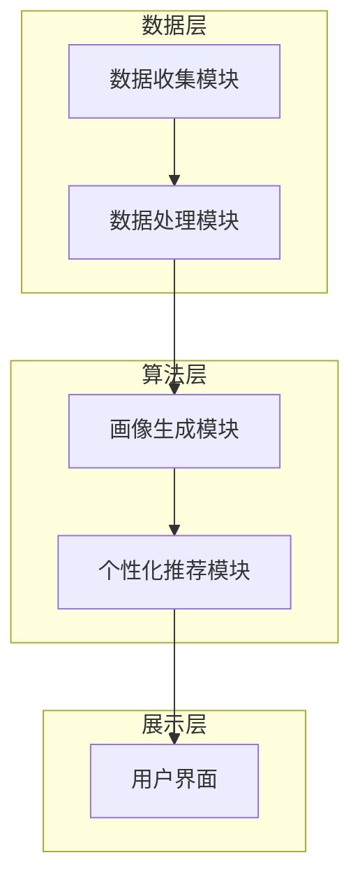
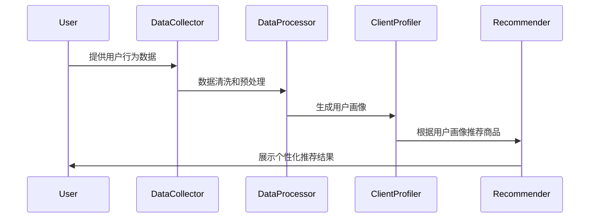

                 


# AI驱动的智能客户画像：深化用户洞察和个性化服务

> 关键词：人工智能、客户画像、用户洞察、个性化服务、机器学习

> 摘要：本文将探讨AI驱动的智能客户画像在深化用户洞察和个性化服务中的应用。我们将逐步分析AI技术的核心概念、算法原理，以及如何设计一个高效、可扩展的智能客户画像系统。同时，我们将通过实际案例来展示这一技术的实际应用，并提供一些最佳实践和注意事项。

## 1. 背景介绍

### 1.1 核心概念术语说明

- **客户画像**：客户画像是指对客户进行全面分析后，形成的一个抽象的、动态的、多维度的数字模型，用于描述客户的特征和行为。

- **用户洞察**：用户洞察是指通过分析用户数据，深入了解用户的需求、行为和偏好，从而为产品和服务的优化提供指导。

- **个性化服务**：个性化服务是指根据用户的需求和偏好，提供定制化的产品或服务，以提高用户满意度和忠诚度。

### 1.2 问题背景

随着互联网和大数据技术的发展，企业积累了大量的用户数据。如何从这些海量数据中提取有价值的信息，以实现对用户的深入洞察和提供个性化的服务，成为了一个关键问题。

### 1.3 问题描述

企业需要建立一个智能客户画像系统，该系统能够自动收集、处理和分析用户数据，生成准确的客户画像，并基于这些画像为用户提供个性化的服务。

### 1.4 问题解决

通过引入AI技术，特别是机器学习算法，可以构建一个智能客户画像系统，实现对用户数据的深度分析和智能推荐。

### 1.5 边界与外延

- **边界**：本文主要关注如何利用AI技术构建智能客户画像系统，不涉及其他技术领域的应用。

- **外延**：智能客户画像的应用场景非常广泛，包括电商、金融、营销等行业。

### 1.6 概念结构与核心要素组成

- **概念结构**：智能客户画像系统由数据收集、数据处理、画像生成和个性化推荐四个核心模块组成。

- **核心要素组成**：数据收集模块负责收集用户行为数据；数据处理模块负责清洗、整合和预处理数据；画像生成模块负责构建用户画像；个性化推荐模块负责根据用户画像提供个性化服务。

## 2. 核心概念与联系

### 2.1 核心概念原理

- **机器学习算法**：机器学习算法是构建智能客户画像系统的核心，常用的算法包括决策树、支持向量机、神经网络等。

- **特征工程**：特征工程是指从原始数据中提取出有助于模型训练的特征，是提高模型性能的关键步骤。

- **聚类分析**：聚类分析是一种无监督学习方法，用于将用户数据划分为不同的群体，为个性化推荐提供基础。

### 2.2 概念属性特征对比表格

| 概念       | 描述                                           | 关系 |
|------------|------------------------------------------------|------|
| 机器学习   | 利用数据训练模型，进行预测和决策               |      |
| 特征工程   | 从原始数据中提取有价值特征，提高模型性能       |      |
| 聚类分析   | 无监督学习方法，将数据划分为不同的群体         |      |

### 2.3 ER实体关系图架构

```mermaid
erDiagram
    User ||--|{ ClientProfile }|-- UserBehavior
    User ||--|{ PurchaseHistory }|-- Product
    ClientProfile ||--|{ InterestProfile }|-- Category
    InterestProfile ||--|{ BehaviorPattern }|-- Action
```

## 3. 算法原理讲解

### 3.1 机器学习算法

#### 3.1.1 决策树

- **原理**：决策树通过一系列判断节点和结果节点，对数据进行分类或回归。

- **流程**：

  1. 选择一个最佳特征作为分裂标准。
  2. 根据该特征将数据集划分为多个子集。
  3. 递归地对每个子集进行相同的分裂操作，直到满足停止条件。

- **示例**：

  ```python
  from sklearn import tree
  
  # 训练决策树模型
  model = tree.DecisionTreeClassifier()
  model.fit(X_train, y_train)
  
  # 预测
  predictions = model.predict(X_test)
  ```

#### 3.1.2 支持向量机

- **原理**：支持向量机通过寻找最优超平面，将数据划分为不同的类别。

- **流程**：

  1. 选择一个核函数。
  2. 构建拉格朗日乘子法求解最优超平面。
  3. 训练分类器。

- **示例**：

  ```python
  from sklearn import svm
  
  # 训练SVM模型
  model = svm.SVC(kernel='linear')
  model.fit(X_train, y_train)
  
  # 预测
  predictions = model.predict(X_test)
  ```

#### 3.1.3 神经网络

- **原理**：神经网络通过多层神经元之间的连接，对数据进行非线性变换。

- **流程**：

  1. 设计神经网络结构。
  2. 训练神经网络，优化参数。
  3. 使用训练好的模型进行预测。

- **示例**：

  ```python
  from sklearn.neural_network import MLPClassifier
  
  # 训练神经网络模型
  model = MLPClassifier(hidden_layer_sizes=(100,), max_iter=1000)
  model.fit(X_train, y_train)
  
  # 预测
  predictions = model.predict(X_test)
  ```

### 3.2 数学模型和公式

- **决策树**：

  $$ h(x) = \sum_{i=1}^{n} w_i \cdot f_i(x) $$

  其中，$w_i$为权重，$f_i(x)$为特征函数。

- **支持向量机**：

  $$ \min_{w,b} \frac{1}{2} ||w||^2 + C \sum_{i=1}^{n} \max(0, 1-y_i (w \cdot x_i + b)) $$

  其中，$C$为正则化参数，$y_i$为类别标签。

- **神经网络**：

  $$ z = \sigma(W \cdot x + b) $$

  其中，$\sigma$为激活函数，$W$为权重矩阵，$b$为偏置。

### 3.3 通俗易懂的举例说明

#### 3.3.1 决策树

假设我们有一个简单的决策树模型，用于预测用户是否喜欢看电影。

- **特征**：年龄、收入、是否有孩子。

- **规则**：

  1. 如果年龄大于30，跳到步骤2；否则，跳到步骤3。
  2. 如果收入大于5000，则预测“喜欢”；否则，预测“不喜欢”。
  3. 如果有孩子，则预测“喜欢”；否则，预测“不喜欢”。

#### 3.3.2 支持向量机

假设我们有一个二元分类问题，需要预测用户是否喜欢某种产品。

- **数据**：用户特征（如年龄、性别、购买历史等）和标签（1表示喜欢，-1表示不喜欢）。

- **目标**：找到最佳超平面，将喜欢和不喜欢用户分开。

#### 3.3.3 神经网络

假设我们有一个简单的神经网络，用于预测用户的购买意向。

- **输入**：用户特征向量。

- **输出**：购买意向概率。

- **训练**：通过反向传播算法，不断调整神经网络参数，直到预测结果符合预期。

## 4. 系统分析与架构设计方案

### 4.1 问题场景介绍

假设我们是一家电商公司，需要构建一个智能客户画像系统，以便更好地了解用户需求，提供个性化推荐。

### 4.2 项目介绍

项目名称：智能客户画像系统

项目目标：通过AI技术，构建一个能够自动生成用户画像，并提供个性化推荐的系统。

### 4.3 系统功能设计

- **数据收集模块**：负责收集用户行为数据，包括购买历史、浏览记录、评论等。

- **数据处理模块**：负责清洗、整合和预处理数据，为后续分析提供基础。

- **画像生成模块**：负责根据用户数据，构建用户画像，包括用户特征、兴趣偏好、行为模式等。

- **个性化推荐模块**：负责根据用户画像，为用户推荐个性化的商品或服务。

### 4.4 系统架构设计



### 4.5 系统接口设计和系统交互



## 5. 项目实战

### 5.1 环境安装

在本项目实战中，我们使用Python作为主要编程语言，以下是所需的安装步骤：

1. 安装Python 3.8及以上版本。
2. 安装必要的库，如NumPy、Pandas、Scikit-learn、TensorFlow等。

### 5.2 系统核心实现源代码

以下是一个简化的系统核心实现示例：

```python
# 数据收集模块
def collect_data():
    # 从数据库或API中获取用户行为数据
    pass

# 数据处理模块
def process_data(data):
    # 数据清洗、整合和预处理
    pass

# 画像生成模块
def generate_profile(processed_data):
    # 构建用户画像
    pass

# 个性化推荐模块
def recommend_products(profile):
    # 根据用户画像推荐商品
    pass

# 主程序
def main():
    data = collect_data()
    processed_data = process_data(data)
    profile = generate_profile(processed_data)
    recommendations = recommend_products(profile)
    print(recommendations)

if __name__ == "__main__":
    main()
```

### 5.3 代码应用解读与分析

在这个示例中，我们首先从数据库或API中收集用户行为数据。然后，我们对数据进行清洗、整合和预处理，以便为后续分析提供干净的输入。接下来，我们根据预处理后的数据生成用户画像，最后根据用户画像推荐个性化的商品。

### 5.4 实际案例分析和详细讲解剖析

假设我们有以下一组用户数据：

- 用户A：30岁，月收入8000元，已购买电子产品，喜欢阅读和旅游。
- 用户B：25岁，月收入5000元，未购买电子产品，喜欢阅读和游戏。

我们首先收集这些数据，然后进行预处理。预处理步骤可能包括去除缺失值、标准化数值特征、分词文本特征等。

接下来，我们根据预处理后的数据生成用户画像。对于用户A，我们可能会得到以下画像：

- **年龄**：30
- **收入**：8000
- **已购买产品**：电子产品
- **兴趣**：阅读、旅游

对于用户B，我们可能会得到以下画像：

- **年龄**：25
- **收入**：5000
- **已购买产品**：无
- **兴趣**：阅读、游戏

最后，我们根据这些用户画像推荐个性化的商品。例如，对于用户A，我们可以推荐一些旅游相关的商品；对于用户B，我们可以推荐一些游戏设备。

### 5.5 项目小结

在本项目实战中，我们展示了如何使用Python构建一个简单的智能客户画像系统。通过实际案例，我们展示了系统的核心实现和实际应用。尽管这是一个简化的示例，但它为我们提供了一个构建更复杂系统的起点。

## 6. 最佳实践 tips、小结、注意事项、拓展阅读

### 6.1 最佳实践 tips

- **数据质量**：确保数据质量是构建智能客户画像系统的关键。尽可能收集更多的数据，并进行严格的数据清洗和处理。

- **特征选择**：选择合适的特征对用户画像的生成至关重要。通过交叉验证等方法，选择对模型性能有显著影响的特征。

- **模型选择**：根据实际问题和数据特点，选择合适的机器学习算法。例如，对于分类问题，可以考虑使用决策树、支持向量机等算法；对于回归问题，可以考虑使用线性回归、神经网络等算法。

- **持续优化**：智能客户画像系统是一个动态的过程，需要不断收集新的数据，调整和优化模型，以适应不断变化的市场和用户需求。

### 6.2 小结

本文介绍了AI驱动的智能客户画像系统在深化用户洞察和个性化服务中的应用。通过逐步分析核心概念、算法原理和系统设计，我们展示了如何构建一个高效的智能客户画像系统，并提供了实际案例和最佳实践。

### 6.3 注意事项

- **隐私保护**：在构建智能客户画像系统时，需要严格遵守隐私保护法规，确保用户数据的匿名化和安全性。

- **可扩展性**：系统设计时应考虑未来的数据增长和业务扩展，确保系统的高效性和可扩展性。

### 6.4 拓展阅读

- **《机器学习实战》**：提供丰富的实践案例，帮助读者掌握机器学习算法的应用。

- **《深度学习》**：详细介绍深度学习算法，包括神经网络和深度神经网络的设计和应用。

- **《大数据之路》**：探讨大数据技术在企业和行业中的应用，包括数据采集、存储、分析和应用。

## 7. 作者信息

作者：AI天才研究院/AI Genius Institute & 禅与计算机程序设计艺术 /Zen And The Art of Computer Programming

