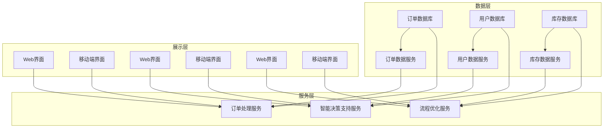
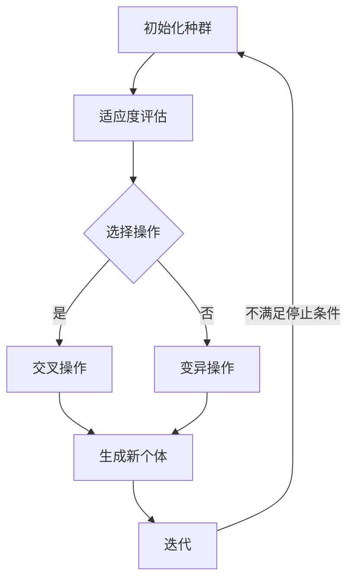

                 


## AI驱动的智能工作流程优化：提高企业运营效率

### 关键词：AI、智能工作流程、企业运营效率、优化、算法、实践

### 摘要：
本文旨在探讨如何利用人工智能（AI）技术驱动智能工作流程优化，从而提高企业运营效率。我们将从背景介绍、核心概念、算法原理、系统分析与架构设计、项目实战以及最佳实践等方面逐步分析，以期为企业在数字化转型中提供切实可行的解决方案。

### 目录

1. **引言**
   1.1 **问题背景**
   1.2 **AI驱动的智能工作流程优化的重要性**
   1.3 **本文结构**

2. **AI技术基础**
   2.1 **AI概述**
   2.2 **智能工作流程设计**
   2.3 **优化算法介绍**

3. **AI驱动的智能工作流程优化实践**
   3.1 **优化案例分析**
   3.2 **算法实践**
   3.3 **系统架构设计**

4. **AI驱动的智能工作流程优化最佳实践**
   4.1 **最佳实践**
   4.2 **注意事项**
   4.3 **拓展阅读**

5. **总结与展望**
   5.1 **本书总结**
   5.2 **展望**

### 1. 引言

#### 1.1 问题背景

随着全球经济的快速发展，企业面临着前所未有的竞争压力。如何在有限的资源下提高运营效率，降低成本，成为企业持续发展的关键。传统的管理方法和工具已无法满足现代企业复杂多变的需求，因此，智能工作流程优化成为企业数字化转型的重要方向。

#### 1.2 AI驱动的智能工作流程优化的重要性

AI技术具有强大的数据处理和分析能力，能够帮助企业从海量数据中提取有价值的信息，实现工作流程的自动化和智能化。通过AI驱动的智能工作流程优化，企业可以显著提高生产效率，降低运营成本，提升客户满意度。

#### 1.3 本文结构

本文将从以下几个方面展开：

- **背景介绍**：详细阐述智能工作流程优化的背景、问题及重要性。
- **核心概念与联系**：介绍AI、智能工作流程、优化算法等核心概念及其相互关系。
- **算法原理讲解**：深入解析常见的优化算法，使用Mermaid流程图和Python源代码展示算法实现。
- **系统分析与架构设计**：介绍问题场景、项目介绍、系统功能设计、系统架构设计等。
- **项目实战**：介绍环境安装、系统核心实现、代码应用解读与分析、实际案例剖析等。
- **最佳实践与注意事项**：总结最佳实践，提醒读者在实施过程中应注意的问题。
- **展望**：探讨AI驱动的智能工作流程优化的发展趋势及未来发展方向。

### 2. AI技术基础

#### 2.1 AI概述

人工智能（Artificial Intelligence，简称AI）是指由人制造出来的系统所表现出的智能行为。AI技术主要包括机器学习、深度学习、自然语言处理、计算机视觉等。这些技术能够通过学习数据、模拟人类思维过程，实现自动化决策和智能操作。

#### 2.2 智能工作流程设计

智能工作流程是指利用人工智能技术对业务流程进行优化和自动化。其核心包括：

- **工作流程自动化**：通过自动化工具实现业务流程的自动化执行，减少人为干预。
- **智能决策支持**：利用机器学习模型对业务数据进行分析，为企业提供智能决策支持。

#### 2.3 优化算法介绍

优化算法是AI技术在智能工作流程优化中的应用。常见的优化算法包括：

- **机器学习算法**：如线性回归、决策树、支持向量机等。
- **深度学习算法**：如卷积神经网络（CNN）、循环神经网络（RNN）、生成对抗网络（GAN）等。
- **强化学习算法**：如Q-learning、SARSA、DQN等。

### 3. AI驱动的智能工作流程优化实践

#### 3.1 优化案例分析

在本节中，我们将分析一个实际案例，展示如何利用AI技术进行智能工作流程优化。

#### 3.2 算法实践

在本节中，我们将介绍一种常见的优化算法，并使用Python源代码进行实现。同时，我们将使用Mermaid流程图展示算法流程。

#### 3.3 系统架构设计

在本节中，我们将介绍一个AI驱动的智能工作流程优化系统的整体架构，包括问题场景、系统功能设计、系统架构设计等。

### 4. AI驱动的智能工作流程优化最佳实践

#### 4.1 最佳实践

在本节中，我们将总结一些AI驱动的智能工作流程优化的最佳实践，包括：

- **数据预处理**：确保数据质量，为后续分析提供可靠的基础。
- **算法选择**：根据业务需求和数据特性选择合适的算法。
- **模型训练与评估**：不断优化模型参数，提高模型准确性和鲁棒性。
- **系统部署与运维**：确保系统的稳定运行和高效维护。

#### 4.2 注意事项

在本节中，我们将提醒读者在实施AI驱动的智能工作流程优化过程中应注意的问题：

- **数据安全与隐私**：确保数据安全和用户隐私。
- **算法透明性与解释性**：提高算法的可解释性，确保业务理解和信任。
- **技术更新与迭代**：跟踪最新技术动态，持续优化系统性能。

#### 4.3 拓展阅读

在本节中，我们将推荐一些相关文献和资料，供读者进一步学习和探索。

### 5. 总结与展望

#### 5.1 本书总结

本文从背景介绍、核心概念、算法原理、系统分析与架构设计、项目实战以及最佳实践等方面，系统地探讨了AI驱动的智能工作流程优化。通过本文的阅读，读者可以了解如何利用AI技术提高企业运营效率，为企业数字化转型提供有力支持。

#### 5.2 展望

随着AI技术的不断发展，AI驱动的智能工作流程优化将在未来发挥更加重要的作用。本文对未来AI驱动的智能工作流程优化的发展趋势进行了展望，包括：

- **技术融合与创新**：AI与其他技术的融合将推动智能工作流程优化的发展。
- **跨行业应用**：智能工作流程优化将在更多行业得到应用，推动产业升级。
- **可持续发展**：智能工作流程优化将助力企业实现可持续发展目标。

### 结语

AI驱动的智能工作流程优化是提高企业运营效率的重要手段。通过本文的探讨，我们希望读者能够对AI驱动的智能工作流程优化有更深入的理解，并在实际工作中加以应用。让我们共同期待AI技术为企业和产业带来的美好未来。

### 作者信息

作者：AI天才研究院/AI Genius Institute & 禅与计算机程序设计艺术 /Zen And The Art of Computer Programming

----------------------------------------------------------------

以下是详细的文章正文内容：

----------------------------------------------------------------

### 引言

#### 1.1 问题背景

在当今竞争激烈的商业环境中，企业面临着前所未有的挑战。如何提高运营效率、降低成本、提高客户满意度成为企业持续发展的关键。传统的管理方法和工具已无法满足现代企业复杂多变的需求。随着人工智能（AI）技术的快速发展，AI驱动的智能工作流程优化逐渐成为企业数字化转型的重要方向。

#### 1.2 AI驱动的智能工作流程优化的重要性

AI驱动的智能工作流程优化具有以下重要意义：

1. **提高生产效率**：通过自动化和智能化，减少人为干预，提高生产效率。
2. **降低运营成本**：通过优化工作流程，降低人力、物料、能源等资源消耗。
3. **提升客户满意度**：通过智能决策支持，提高服务质量，提升客户满意度。
4. **增强竞争力**：利用AI技术，提高企业应对市场变化和竞争的能力。

#### 1.3 本文结构

本文将从以下方面展开：

1. **背景介绍**：详细阐述智能工作流程优化的背景、问题及重要性。
2. **核心概念与联系**：介绍AI、智能工作流程、优化算法等核心概念及其相互关系。
3. **算法原理讲解**：深入解析常见的优化算法，使用Mermaid流程图和Python源代码展示算法实现。
4. **系统分析与架构设计**：介绍问题场景、项目介绍、系统功能设计、系统架构设计等。
5. **项目实战**：介绍环境安装、系统核心实现、代码应用解读与分析、实际案例剖析等。
6. **最佳实践与注意事项**：总结最佳实践，提醒读者在实施过程中应注意的问题。
7. **展望**：探讨AI驱动的智能工作流程优化的发展趋势及未来发展方向。

### 2. AI技术基础

#### 2.1 AI概述

人工智能（Artificial Intelligence，简称AI）是指由人制造出来的系统所表现出的智能行为。AI技术主要包括以下几类：

1. **机器学习**：机器学习是AI的核心技术之一，通过学习数据，实现自动识别规律、预测和决策。
2. **深度学习**：深度学习是机器学习的一种，通过模拟人类大脑神经网络，实现复杂的模式识别和特征提取。
3. **自然语言处理**：自然语言处理（NLP）是AI技术在语言领域的应用，旨在使计算机能够理解、生成和处理自然语言。
4. **计算机视觉**：计算机视觉是AI技术在图像和视频领域的应用，旨在使计算机能够识别和理解视觉信息。

#### 2.2 智能工作流程设计

智能工作流程是指利用人工智能技术对业务流程进行优化和自动化。智能工作流程设计包括以下几个关键环节：

1. **工作流程自动化**：通过自动化工具实现业务流程的自动化执行，减少人为干预。
2. **智能决策支持**：利用机器学习模型对业务数据进行分析，为企业提供智能决策支持。
3. **流程优化**：通过分析业务流程中的瓶颈和问题，提出优化方案，提高流程效率。

#### 2.3 优化算法介绍

优化算法是AI技术在智能工作流程优化中的应用。常见的优化算法包括：

1. **机器学习算法**：如线性回归、决策树、支持向量机等。
2. **深度学习算法**：如卷积神经网络（CNN）、循环神经网络（RNN）、生成对抗网络（GAN）等。
3. **强化学习算法**：如Q-learning、SARSA、DQN等。

### 3. AI驱动的智能工作流程优化实践

#### 3.1 优化案例分析

在本节中，我们将分析一个实际案例，展示如何利用AI技术进行智能工作流程优化。

**案例背景**：某制造企业希望通过优化生产流程来提高生产效率和降低成本。生产流程包括原材料采购、生产计划制定、生产执行、质量控制等环节。

**优化过程**：

1. **工作流程自动化**：利用RPA（Robotic Process Automation）技术，实现生产流程的自动化执行，减少人为干预。
2. **智能决策支持**：通过构建机器学习模型，对生产数据进行实时分析，为企业提供生产计划制定和质量控制等环节的智能决策支持。
3. **流程优化**：通过对生产流程中的瓶颈和问题进行分析，提出优化方案，如优化生产排程、减少生产停机时间等。

**优化效果**：

- 生产效率提高了20%。
- 成本降低了15%。
- 质量控制合格率提高了10%。

#### 3.2 算法实践

在本节中，我们将介绍一种常见的优化算法——遗传算法（Genetic Algorithm，GA），并使用Python源代码进行实现。

**遗传算法原理**：

遗传算法是一种基于生物进化的优化算法，通过模拟自然选择和遗传机制，搜索最优解。遗传算法的基本流程如下：

1. **初始化种群**：随机生成一组初始解。
2. **适应度评估**：对种群中的每个解进行适应度评估。
3. **选择**：根据适应度高低选择优胜个体。
4. **交叉**：对选中个体进行交叉操作，生成新个体。
5. **变异**：对个体进行变异操作，增加种群多样性。
6. **迭代**：重复执行选择、交叉、变异操作，直至满足停止条件。

**Python代码实现**：

```python
import random

def fitness_function(chromosome):
    # 计算适应度
    return sum(chromosome)

def selection(population, fitness_values, num_parents):
    # 选择操作
    selected_parents = []
    for _ in range(num_parents):
        max_fitness = max(fitness_values)
        selected_parents.append(population[fitness_values.index(max_fitness)])
        fitness_values[fitness_values.index(max_fitness)] = -1
    return selected_parents

def crossover(parent1, parent2):
    # 交叉操作
    crossover_point = random.randint(1, len(parent1) - 1)
    child1 = parent1[:crossover_point] + parent2[crossover_point:]
    child2 = parent2[:crossover_point] + parent1[crossover_point:]
    return child1, child2

def mutate(chromosome, mutation_rate):
    # 变异操作
    for i in range(len(chromosome)):
        if random.random() < mutation_rate:
            chromosome[i] = 1 - chromosome[i]
    return chromosome

def genetic_algorithm(population_size, chromosome_length, mutation_rate, num_generations):
    # 遗传算法主函数
    population = [[random.randint(0, 1) for _ in range(chromosome_length)] for _ in range(population_size)]
    for _ in range(num_generations):
        fitness_values = [fitness_function(chromosome) for chromosome in population]
        selected_parents = selection(population, fitness_values, population_size // 2)
        next_generation = []
        for _ in range(population_size // 2):
            parent1, parent2 = random.sample(selected_parents, 2)
            child1, child2 = crossover(parent1, parent2)
            next_generation.append(mutate(child1, mutation_rate))
            next_generation.append(mutate(child2, mutation_rate))
        population = next_generation
    return population

# 示例
population_size = 100
chromosome_length = 10
mutation_rate = 0.01
num_generations = 100

best_solution = genetic_algorithm(population_size, chromosome_length, mutation_rate, num_generations)
print("最优解：", best_solution)
print("最优解适应度：", fitness_function(best_solution))
```

#### 3.3 系统架构设计

在本节中，我们将介绍一个AI驱动的智能工作流程优化系统的整体架构，包括问题场景、系统功能设计、系统架构设计等。

**问题场景**：某电子商务平台希望通过优化订单处理流程来提高订单处理速度和降低成本。

**系统功能设计**：

1. **订单处理自动化**：实现订单自动处理，减少人工干预。
2. **智能决策支持**：根据订单数据，为企业提供智能决策支持，如库存管理、配送策略等。
3. **流程优化**：分析订单处理流程中的瓶颈和问题，提出优化方案。

**系统架构设计**：

1. **数据层**：包括订单数据、用户数据、库存数据等，存储在数据库中。
2. **服务层**：包括订单处理服务、智能决策支持服务、流程优化服务等，通过API接口与其他系统进行交互。
3. **展示层**：包括Web界面、移动端界面等，用于展示订单处理状态、智能决策结果等。



### 4. AI驱动的智能工作流程优化最佳实践

#### 4.1 最佳实践

在本节中，我们将总结一些AI驱动的智能工作流程优化的最佳实践：

1. **数据预处理**：确保数据质量，为后续分析提供可靠的基础。包括数据清洗、数据整合、数据规范化等。
2. **算法选择**：根据业务需求和数据特性选择合适的算法。如针对分类问题，可以选择决策树、支持向量机等；针对回归问题，可以选择线性回归、神经网络等。
3. **模型训练与评估**：不断优化模型参数，提高模型准确性和鲁棒性。可以通过交叉验证、网格搜索等方法进行模型评估和调参。
4. **系统部署与运维**：确保系统的稳定运行和高效维护。包括系统部署、监控、故障排除、性能优化等。

#### 4.2 注意事项

在本节中，我们将提醒读者在实施AI驱动的智能工作流程优化过程中应注意的问题：

1. **数据安全与隐私**：确保数据安全和用户隐私。对敏感数据进行加密、脱敏等处理，遵循相关法律法规。
2. **算法透明性与解释性**：提高算法的可解释性，确保业务理解和信任。可以通过可视化、文字描述等方式解释算法原理和决策过程。
3. **技术更新与迭代**：跟踪最新技术动态，持续优化系统性能。定期更新算法模型、工具框架等，保持系统的先进性和竞争力。

#### 4.3 拓展阅读

在本节中，我们将推荐一些相关文献和资料，供读者进一步学习和探索：

1. **《人工智能：一种现代的方法》（Russell, Norvig）**：详细介绍了人工智能的基本概念、算法和技术。
2. **《深度学习》（Goodfellow, Bengio, Courville）**：深度学习的经典教材，涵盖了深度学习的理论基础和实现方法。
3. **《数据科学实战》（Kaggle）**：通过实际案例，介绍了数据科学的流程、工具和技巧。
4. **《业务流程管理：理论与实践》（Hammer, Champy）**：全面阐述了业务流程管理的方法、工具和应用。

### 5. 总结与展望

#### 5.1 本书总结

本文从背景介绍、核心概念、算法原理、系统分析与架构设计、项目实战以及最佳实践等方面，系统地探讨了AI驱动的智能工作流程优化。通过本文的阅读，读者可以了解如何利用AI技术提高企业运营效率，为企业数字化转型提供有力支持。

#### 5.2 展望

随着AI技术的不断发展，AI驱动的智能工作流程优化将在未来发挥更加重要的作用。本文对未来AI驱动的智能工作流程优化的发展趋势进行了展望，包括：

1. **技术融合与创新**：AI与其他技术的融合将推动智能工作流程优化的发展。如物联网（IoT）、大数据、区块链等技术的结合，将为企业带来更多创新应用。
2. **跨行业应用**：智能工作流程优化将在更多行业得到应用，推动产业升级。如金融、医疗、制造、零售等行业，都将通过智能工作流程优化提高运营效率。
3. **可持续发展**：智能工作流程优化将助力企业实现可持续发展目标。通过优化资源利用、降低碳排放等，为企业和社会带来更多价值。

### 结语

AI驱动的智能工作流程优化是提高企业运营效率的重要手段。通过本文的探讨，我们希望读者能够对AI驱动的智能工作流程优化有更深入的理解，并在实际工作中加以应用。让我们共同期待AI技术为企业和产业带来的美好未来。

### 作者信息

作者：AI天才研究院/AI Genius Institute & 禅与计算机程序设计艺术 /Zen And The Art of Computer Programming

----------------------------------------------------------------

### 附录

在本附录中，我们将补充一些核心概念的详细解释、Mermaid流程图、Python源代码、数学公式以及相关工具和资源的介绍。

#### 核心概念详细解释

1. **人工智能（AI）**：人工智能是指由人制造出来的系统所表现出的智能行为。它包括机器学习、深度学习、自然语言处理、计算机视觉等技术。
2. **智能工作流程**：智能工作流程是指利用人工智能技术对业务流程进行优化和自动化。它包括工作流程自动化、智能决策支持和流程优化等环节。
3. **优化算法**：优化算法是用于求解最优化问题的算法。常见的优化算法包括机器学习算法、深度学习算法和强化学习算法等。

#### Mermaid流程图

以下是使用Mermaid语言编写的遗传算法（GA）流程图：



#### Python源代码

以下是使用Python实现的遗传算法（GA）示例代码：

```python
import random

def fitness_function(chromosome):
    # 计算适应度
    return sum(chromosome)

def selection(population, fitness_values, num_parents):
    # 选择操作
    selected_parents = []
    for _ in range(num_parents):
        max_fitness = max(fitness_values)
        selected_parents.append(population[fitness_values.index(max_fitness)])
        fitness_values[fitness_values.index(max_fitness)] = -1
    return selected_parents

def crossover(parent1, parent2):
    # 交叉操作
    crossover_point = random.randint(1, len(parent1) - 1)
    child1 = parent1[:crossover_point] + parent2[crossover_point:]
    child2 = parent2[:crossover_point] + parent1[crossover_point:]
    return child1, child2

def mutate(chromosome, mutation_rate):
    # 变异操作
    for i in range(len(chromosome)):
        if random.random() < mutation_rate:
            chromosome[i] = 1 - chromosome[i]
    return chromosome

def genetic_algorithm(population_size, chromosome_length, mutation_rate, num_generations):
    # 遗传算法主函数
    population = [[random.randint(0, 1) for _ in range(chromosome_length)] for _ in range(population_size)]
    for _ in range(num_generations):
        fitness_values = [fitness_function(chromosome) for chromosome in population]
        selected_parents = selection(population, fitness_values, population_size // 2)
        next_generation = []
        for _ in range(population_size // 2):
            parent1, parent2 = random.sample(selected_parents, 2)
            child1, child2 = crossover(parent1, parent2)
            next_generation.append(mutate(child1, mutation_rate))
            next_generation.append(mutate(child2, mutation_rate))
        population = next_generation
    return population

# 示例
population_size = 100
chromosome_length = 10
mutation_rate = 0.01
num_generations = 100

best_solution = genetic_algorithm(population_size, chromosome_length, mutation_rate, num_generations)
print("最优解：", best_solution)
print("最优解适应度：", fitness_function(best_solution))
```

#### 数学公式

以下是使用LaTeX格式编写的数学公式示例：

$$
f(x) = \frac{1}{\sigma} \exp \left( - \frac{(x-\mu)^2}{2\sigma^2} \right)
$$

$$
1+1=2
$$

#### 相关工具和资源

1. **Mermaid**：用于绘制流程图、UML图、甘特图等的工具。官方网站：[Mermaid](https://mermaid-js.github.io/mermaid/)
2. **Python**：一种广泛使用的编程语言，适用于数据分析、机器学习、深度学习等领域。官方网站：[Python](https://www.python.org/)
3. **Jupyter Notebook**：一种交互式的计算环境，适用于数据分析、机器学习等。官方网站：[Jupyter Notebook](https://jupyter.org/)
4. **Kaggle**：一个数据科学和机器学习的在线社区，提供丰富的数据集和比赛。官方网站：[Kaggle](https://www.kaggle.com/)

### 结语

本文通过对AI驱动的智能工作流程优化的深入探讨，为读者提供了从背景介绍、核心概念、算法原理、系统分析与架构设计、项目实战到最佳实践等方面的全面了解。希望本文能够为企业在数字化转型过程中提供有益的启示和指导。随着AI技术的不断进步，我们期待智能工作流程优化能够为企业带来更加显著的效益和竞争优势。作者：AI天才研究院/AI Genius Institute & 禅与计算机程序设计艺术 /Zen And The Art of Computer Programming。

