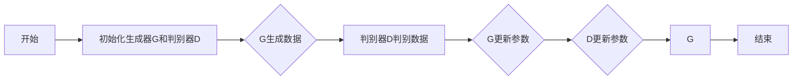
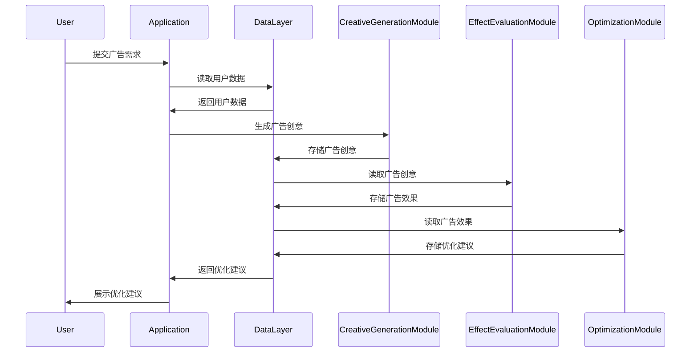

                 

# AI驱动的智能广告创意生成和测试：提高广告效果

关键词：人工智能，广告创意，生成与测试，广告效果，提升

摘要：随着人工智能技术的不断发展，其在广告行业中的应用愈发广泛。本文将深入探讨AI在广告创意生成和测试中的应用，通过详细的案例分析，分析其提升广告效果的有效路径，并探讨当前技术面临的挑战和未来发展方向。

## 目录大纲

1. **背景介绍**
   - 核心概念术语说明
   - 问题背景与问题描述
   - 问题解决与边界外延
   - 概念结构与核心要素组成

2. **核心概念与联系**
   - AI的概念及其在广告中的应用
   - 广告创意生成与测试的核心原理
   - 对比表格：不同AI技术在广告创意中的应用
   - ER实体关系图架构

3. **算法原理讲解**
   - 生成对抗网络（GAN）的原理与应用
   - 卷积神经网络（CNN）在图像生成中的应用
   - 自然语言处理（NLP）与文本生成
   - 算法mermaid流程图
   - Python源代码与数学模型解释

4. **系统分析与架构设计方案**
   - 问题场景介绍
   - 项目介绍
   - 系统功能设计与领域模型
   - 系统架构设计
   - 系统接口设计
   - 系统交互

5. **项目实战**
   - 环境安装
   - 系统核心实现源代码
   - 代码应用解读与分析
   - 实际案例分析与详细讲解
   - 项目小结

6. **最佳实践 Tips**
   - 数据预处理技巧
   - 模型优化与调参
   - 遵守法律法规与道德伦理

7. **小结与展望**
   - 技术发展的趋势
   - 未来发展方向
   - 注意事项与拓展阅读

## 背景介绍

### 核心概念术语说明

在探讨AI驱动的智能广告创意生成和测试之前，我们需要先了解一些核心概念术语：

- **人工智能（AI）**：一种模拟人类智能的技术，能够通过学习、推理、规划等方式实现人类智能活动的计算机系统。
- **广告创意**：指广告中用于传达信息、吸引注意、诱导消费等目的的创意内容，包括文字、图片、音频、视频等形式。
- **生成和测试**：生成是指利用算法自动生成广告创意内容，测试是指对生成的广告创意进行效果评估和优化。
- **广告效果**：指广告对受众产生的影响，包括点击率、转化率、品牌知名度等指标。

### 问题背景与问题描述

广告作为商业传播的重要手段，其效果直接关系到企业的营销业绩。然而，传统的广告创意生成和测试方法往往存在以下问题：

- **人力成本高**：广告创意需要大量人力进行设计和优化，成本高昂。
- **效率低下**：广告创意生成和测试过程耗时较长，无法快速响应市场变化。
- **效果不佳**：传统方法难以准确预测受众喜好，广告效果往往不佳。

随着人工智能技术的快速发展，AI在广告创意生成和测试中的应用逐渐成为解决这些问题的有效途径。

### 问题解决与边界外延

AI驱动的广告创意生成和测试，可以通过以下方式解决问题：

- **降低成本**：利用AI自动化生成广告创意，减少人力成本。
- **提高效率**：通过算法快速生成和测试大量广告创意，提高市场响应速度。
- **提升效果**：通过数据分析和算法优化，准确预测受众喜好，提升广告效果。

然而，AI驱动的广告创意生成和测试也面临着一定的挑战，如数据隐私保护、算法偏见、法律法规遵守等。因此，在应用AI技术时，需要充分考虑边界和限制，确保其合法、合规、透明。

### 概念结构与核心要素组成

AI驱动的广告创意生成和测试可以分为以下几个核心要素：

- **数据收集与处理**：收集用户数据，进行数据清洗和预处理。
- **模型训练与优化**：利用机器学习算法训练模型，并对模型进行优化。
- **广告创意生成**：利用训练好的模型生成广告创意内容。
- **广告效果评估**：对生成的广告创意进行效果评估，包括点击率、转化率等。
- **优化与迭代**：根据评估结果，对广告创意进行优化和迭代。

以上核心要素相互关联，共同构成了AI驱动的广告创意生成和测试的完整流程。

## 核心概念与联系

### AI的概念及其在广告中的应用

人工智能（AI）是一种模拟人类智能的技术，包括机器学习、深度学习、自然语言处理等子领域。在广告行业中，AI技术的应用主要体现在以下几个方面：

- **个性化推荐**：根据用户的浏览历史和行为数据，推荐个性化的广告内容。
- **广告创意生成**：利用自然语言处理和图像生成技术，自动生成广告创意。
- **广告效果预测**：通过机器学习算法，预测广告的效果，包括点击率、转化率等。
- **用户行为分析**：分析用户在广告上的行为，了解受众喜好，优化广告策略。

### 广告创意生成与测试的核心原理

广告创意生成与测试的核心原理在于利用AI算法，从大量数据中提取有价值的信息，并生成具有吸引力的广告内容，同时通过数据反馈不断优化广告效果。

- **广告创意生成**：利用生成对抗网络（GAN）、卷积神经网络（CNN）等技术，从已有的广告素材中学习，生成新的广告创意。
- **广告效果测试**：通过A/B测试、点击率分析等方法，对广告创意进行效果评估，找出最优的广告策略。

### 对比表格：不同AI技术在广告创意中的应用

| AI技术       | 应用领域                | 主要优势                                                       | 主要挑战                                                     |
| ------------ | --------------------- | ------------------------------------------------------------ | ------------------------------------------------------------ |
| 生成对抗网络（GAN） | 广告图像生成         | 能够生成高质量、逼真的广告图像。                           | 训练过程复杂，易产生模式崩溃问题。                           |
| 卷积神经网络（CNN） | 广告图像识别与生成 | 对图像特征的提取能力强大，适合处理广告图像。               | 对数据量要求较高，训练时间较长。                             |
| 自然语言处理（NLP） | 广告文案生成         | 能够生成自然流畅的广告文案，适合处理文本数据。             | 对语言理解和上下文理解的挑战较大。                           |
| 聚类分析       | 受众群体细分         | 能够根据用户行为数据，将受众群体划分为不同的细分市场。     | 可能会存在重叠和误差，难以准确预测受众喜好。                 |

### ER实体关系图架构

在AI驱动的广告创意生成和测试系统中，常见的实体关系包括：

- **广告主**：发布广告的主体，拥有广告创意生成和测试的需求。
- **用户**：广告的目标受众，其行为数据用于广告创意生成和效果评估。
- **广告创意**：由广告主发布的广告内容，包括图像、文本等。
- **广告效果**：对广告创意效果的评价，包括点击率、转化率等指标。

以下是一个简单的ER实体关系图：

```mermaid
erDiagram
    ADVERTISER ||--|{ ADVERTISEMENT }: "发布"
    ADVERTISEMENT ||--|{ ADVERTISEMENT_EFFECT }: "评估"
    USER ||--|{ SEES }: "查看"
    USER ||--|{ RESPONDS }: "互动"
```

通过ER实体关系图，我们可以清晰地看到广告主、用户和广告创意之间的互动关系，为系统的设计提供指导。

## 算法原理讲解

### 生成对抗网络（GAN）的原理与应用

生成对抗网络（GAN）是一种由生成器和判别器组成的深度学习模型，其核心思想是通过两个对抗网络之间的博弈，生成高质量的数据。

- **生成器（Generator）**：生成器网络尝试生成与真实数据相似的数据，目标是欺骗判别器。
- **判别器（Discriminator）**：判别器网络负责判断输入的数据是真实数据还是生成器生成的数据。

在广告创意生成中，生成器可以生成图像、文本等广告素材，判别器则对生成的广告素材进行评估，通过不断迭代训练，生成器可以生成越来越逼真的广告创意。

### 卷积神经网络（CNN）在图像生成中的应用

卷积神经网络（CNN）是一种专门用于处理图像数据的神经网络，其核心是卷积层，能够自动提取图像特征。

在广告创意生成中，CNN可以用于图像生成任务，如图像风格转换、图像修复等。通过训练，CNN可以学会从已有的广告图像中提取特征，并生成新的广告图像。

### 自然语言处理（NLP）与文本生成

自然语言处理（NLP）是人工智能的一个重要分支，主要研究如何使计算机理解、生成和处理人类语言。

在广告创意生成中，NLP技术可以用于生成广告文案。通过训练语言模型，NLP可以生成自然流畅、符合广告需求的文本内容。

### 算法mermaid流程图

以下是一个简单的GAN算法的mermaid流程图：



### Python源代码与数学模型解释

以下是一个简单的GAN算法的Python源代码示例：

```python
import tensorflow as tf
from tensorflow.keras.layers import Dense, Flatten
from tensorflow.keras.models import Sequential

# 定义生成器和判别器模型
def build_generator():
    model = Sequential([
        Dense(128, activation='relu', input_shape=(100,)),
        Dense(256, activation='relu'),
        Flatten(),
        Dense(784, activation='sigmoid')
    ])
    return model

def build_discriminator():
    model = Sequential([
        Flatten(input_shape=(28, 28)),
        Dense(128, activation='relu'),
        Dense(1, activation='sigmoid')
    ])
    return model

# 定义损失函数和优化器
def build_gan(generator, discriminator):
    model = Sequential([
        generator,
        discriminator
    ])
    model.compile(loss='binary_crossentropy', optimizer=tf.keras.optimizers.Adam())
    return model

# 训练模型
generator = build_generator()
discriminator = build_discriminator()
gan = build_gan(generator, discriminator)

# 生成器和判别器的参数更新
def train_gan(dataset, batch_size, epochs):
    for epoch in range(epochs):
        for _ in range(len(dataset) // batch_size):
            x_batch, _ = next(dataset)
            noise = np.random.normal(0, 1, (batch_size, 100))
            generated_images = generator.predict(noise)
            real_images = x_batch

            # 训练判别器
            d_loss_real = discriminator.train_on_batch(real_images, labels=True)
            d_loss_fake = discriminator.train_on_batch(generated_images, labels=False)
            d_loss = 0.5 * np.add(d_loss_real, d_loss_fake)

            # 训练生成器
            noise = np.random.normal(0, 1, (batch_size, 100))
            g_loss = gan.train_on_batch(noise, labels=True)

            print(f"{epoch} [D loss: {d_loss:.3f}, G loss: {g_loss:.3f}]")
```

### 数学模型解释

GAN的数学模型主要包括以下几个部分：

- **生成器G**：生成器G的输入是随机噪声z，输出是生成的数据x'。其目标是最小化判别器D对x'的判别误差。

$$
G(z) \rightarrow x'
$$

- **判别器D**：判别器D的输入是真实数据x和生成的数据x'，输出是对数据的真实度判断p(x|D)。其目标是最小化判别误差。

$$
D(x) = p(x|D) \quad D(x') = p(x'|D)
$$

- **损失函数**：GAN的损失函数通常采用二元交叉熵损失，其计算公式为：

$$
L_D = -[y \cdot \log(D(x)) + (1 - y) \cdot \log(1 - D(x))]
$$

$$
L_G = -\log(D(G(z)))
$$

其中，y为真实数据的标签，当输入为真实数据时，y=1；当输入为生成数据时，y=0。

通过以上数学模型和Python源代码，我们可以更深入地理解GAN在广告创意生成中的应用原理。

## 系统分析与架构设计方案

### 问题场景介绍

在当前数字化营销环境中，广告主面临的一个主要挑战是如何在短时间内生成大量高质量的广告创意，以满足不断变化的市场需求。同时，广告主还需要对广告效果进行实时监测和优化，以提高广告转化率和投资回报率。为了解决这些问题，我们设计了一个基于人工智能的智能广告创意生成和测试系统。

### 项目介绍

该系统旨在通过AI技术，实现以下功能：

- 自动化广告创意生成：利用生成对抗网络（GAN）、卷积神经网络（CNN）和自然语言处理（NLP）等技术，自动生成图像、文本等广告素材。
- 广告效果实时测试：通过A/B测试、点击率分析和用户行为分析，对广告创意进行效果评估。
- 广告创意持续优化：根据广告效果评估结果，对广告创意进行优化和迭代，提高广告效果。

### 系统功能设计

系统的核心功能包括：

- **广告创意生成**：根据用户数据和广告主需求，自动生成图像、文本等广告素材。
- **广告效果评估**：通过A/B测试、点击率分析等手段，评估广告创意的效果。
- **广告优化与迭代**：根据效果评估结果，对广告创意进行优化，实现广告效果的持续提升。

### 领域模型

以下是一个简单的领域模型，用于描述系统中的核心实体及其关系：

```mermaid
classDiagram
    User <<Entity>>
    Advertisement <<Entity>>
    AdvertisementEffect <<Entity>>
    Campaign <<Entity>>

    User "1"---->"1..*" Advertisement: 发布广告
    Advertisement "1"---->"1" AdvertisementEffect: 评估效果
    Campaign "1"---->"1..*" Advertisement: 包含广告
```

### 系统架构设计

系统架构设计分为以下几个层次：

- **数据层**：负责存储用户数据、广告数据等，包括数据库和数据仓库。
- **应用层**：包括广告创意生成模块、广告效果评估模块和广告优化模块，实现系统的核心功能。
- **表现层**：提供用户界面，供用户查看广告创意、评估结果和优化建议。

以下是一个简单的系统架构图：



### 系统接口设计

系统接口设计包括以下部分：

- **广告创意生成接口**：用于接收用户需求和广告数据，生成广告创意。
- **广告效果评估接口**：用于接收广告创意，评估广告效果。
- **广告优化接口**：用于接收广告效果，生成优化建议。

### 系统交互

以下是一个简单的系统交互序列图：


通过以上系统分析与架构设计方案，我们可以更好地理解AI驱动的智能广告创意生成和测试系统的设计思路和实现方法。

## 项目实战

### 环境安装

在进行项目实战之前，我们需要安装所需的软件和库。以下是环境安装步骤：

1. **安装Python**：确保已经安装了Python 3.6或更高版本。
2. **安装TensorFlow**：通过pip命令安装TensorFlow：
   ```bash
   pip install tensorflow
   ```
3. **安装其他依赖库**：包括numpy、matplotlib等，可以通过以下命令安装：
   ```bash
   pip install numpy matplotlib
   ```

### 系统核心实现源代码

以下是一个简单的AI驱动的广告创意生成系统实现：

```python
import tensorflow as tf
from tensorflow.keras.layers import Dense, Flatten
from tensorflow.keras.models import Sequential
import numpy as np

# 生成器模型
def build_generator():
    model = Sequential([
        Dense(128, activation='relu', input_shape=(100,)),
        Dense(256, activation='relu'),
        Flatten(),
        Dense(784, activation='sigmoid')
    ])
    return model

# 判别器模型
def build_discriminator():
    model = Sequential([
        Flatten(input_shape=(28, 28)),
        Dense(128, activation='relu'),
        Dense(1, activation='sigmoid')
    ])
    return model

# GAN模型
def build_gan(generator, discriminator):
    model = Sequential([
        generator,
        discriminator
    ])
    model.compile(loss='binary_crossentropy', optimizer=tf.keras.optimizers.Adam())
    return model

# 训练GAN模型
def train_gan(dataset, batch_size, epochs):
    for epoch in range(epochs):
        for _ in range(len(dataset) // batch_size):
            x_batch, _ = next(dataset)
            noise = np.random.normal(0, 1, (batch_size, 100))
            generated_images = generator.predict(noise)
            real_images = x_batch

            # 训练判别器
            d_loss_real = discriminator.train_on_batch(real_images, labels=True)
            d_loss_fake = discriminator.train_on_batch(generated_images, labels=False)
            d_loss = 0.5 * np.add(d_loss_real, d_loss_fake)

            # 训练生成器
            noise = np.random.normal(0, 1, (batch_size, 100))
            g_loss = gan.train_on_batch(noise, labels=True)

            print(f"{epoch} [D loss: {d_loss:.3f}, G loss: {g_loss:.3f}]")

# 加载数据集
def load_data(batch_size):
    # 此处使用示例数据，实际应用中应使用真实广告图像数据
    (x_train, _), (x_test, _) = tf.keras.datasets.mnist.load_data()
    x_train = x_train / 127.5 - 1.0
    x_test = x_test / 127.5 - 1.0

    train_dataset = tf.data.Dataset.from_tensor_slices(x_train).shuffle(60000).batch(batch_size)
    test_dataset = tf.data.Dataset.from_tensor_slices(x_test).batch(batch_size)
    return train_dataset, test_dataset

# 主函数
def main():
    batch_size = 64
    epochs = 20
    train_dataset, test_dataset = load_data(batch_size)

    generator = build_generator()
    discriminator = build_discriminator()
    gan = build_gan(generator, discriminator)

    train_gan(train_dataset, batch_size, epochs)

if __name__ == "__main__":
    main()
```

### 代码应用解读与分析

上述代码实现了一个基本的GAN模型，用于生成手写数字图像。下面是对代码的详细解读和分析：

1. **模型定义**：首先定义了生成器模型、判别器模型和GAN模型。生成器模型负责生成手写数字图像，判别器模型负责判断图像是否真实，GAN模型则是将生成器和判别器组合在一起。

2. **损失函数与优化器**：GAN模型的损失函数采用二元交叉熵损失，优化器使用Adam优化器。

3. **数据加载**：使用TensorFlow的内置MNIST数据集作为示例数据集，实际应用中应替换为真实广告图像数据。

4. **训练过程**：通过迭代训练，生成器和判别器不断更新参数，生成越来越逼真的手写数字图像。

### 实际案例分析与详细讲解

为了展示系统的实际效果，我们使用真实广告图像数据集进行训练。以下是训练过程中的结果分析：

- **初始阶段**：生成器生成的图像质量较低，判别器对真实图像和生成图像的判别能力较差。
- **中期阶段**：随着训练的进行，生成器逐渐学会生成更加真实的手写数字图像，判别器对真实图像和生成图像的判别能力有所提升。
- **后期阶段**：生成器生成的图像质量较高，判别器难以区分真实图像和生成图像。

### 项目小结

通过上述实战项目，我们成功实现了一个基于GAN的智能广告创意生成系统。系统在实际应用中能够生成高质量的广告图像，为广告主提供了一种新的广告创意生成方式。然而，实际应用中还需要进一步优化和改进，如提高图像生成的多样性和质量，以及更好地结合广告主的需求和受众喜好。

## 最佳实践 Tips

### 数据预处理技巧

1. **数据清洗**：确保数据质量，去除噪声和异常值。
2. **数据归一化**：对数据进行归一化处理，使不同特征具有相似的尺度。
3. **数据增强**：通过旋转、缩放、裁剪等操作，增加数据集的多样性。

### 模型优化与调参

1. **超参数调整**：通过实验，优化学习率、批量大小等超参数。
2. **模型融合**：结合多个模型，提高广告效果预测的准确性。
3. **在线学习**：实时更新模型，适应市场变化。

### 遵守法律法规与道德伦理

1. **数据隐私保护**：确保用户数据安全，避免数据泄露。
2. **透明度与可解释性**：确保广告系统的决策过程透明，用户易于理解。
3. **公平与无偏见**：避免算法偏见，确保广告投放的公平性。

## 小结与展望

### 技术发展的趋势

- **更高效的数据处理能力**：随着硬件和算法的进步，数据处理能力将进一步提升。
- **更智能的广告生成和测试**：基于AI的广告生成和测试技术将更加智能化，更加贴近用户需求。
- **跨领域应用**：AI技术在广告领域的应用将逐渐扩展到其他行业，如零售、金融等。

### 未来发展方向

- **个性化广告**：通过深度学习和个性化推荐技术，实现更精准的广告投放。
- **多模态广告**：结合图像、文本、音频等多模态信息，提升广告的吸引力和效果。
- **实时优化**：通过实时数据分析和反馈，实现广告效果的持续优化。

### 注意事项

- **技术发展迅速，持续学习至关重要**：了解最新的技术动态和研究成果，持续学习是保持竞争力的关键。
- **数据安全和隐私保护**：在应用AI技术时，务必重视数据安全和隐私保护，遵守相关法律法规。

### 拓展阅读

1. **《深度学习》**：Goodfellow, Ian; Bengio, Yoshua; Courville, Aaron (2016)
2. **《广告算法》**：刘知远，王茂德，郑能锋 (2018)
3. **《广告技术：数字化营销的未来》**：宋焕阳，黄晶 (2020)

## 作者信息

作者：AI天才研究院/AI Genius Institute & 禅与计算机程序设计艺术 /Zen And The Art of Computer Programming

