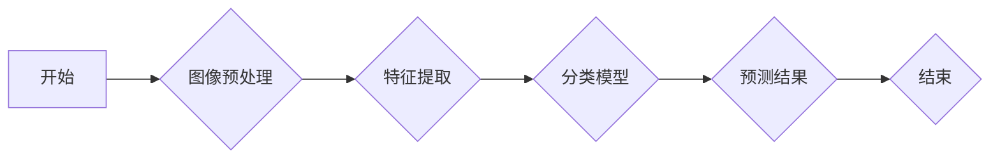
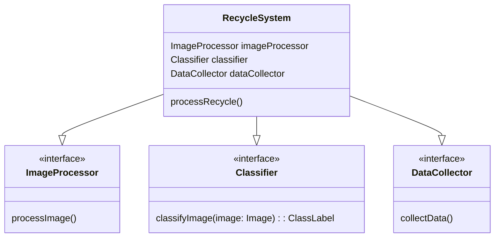
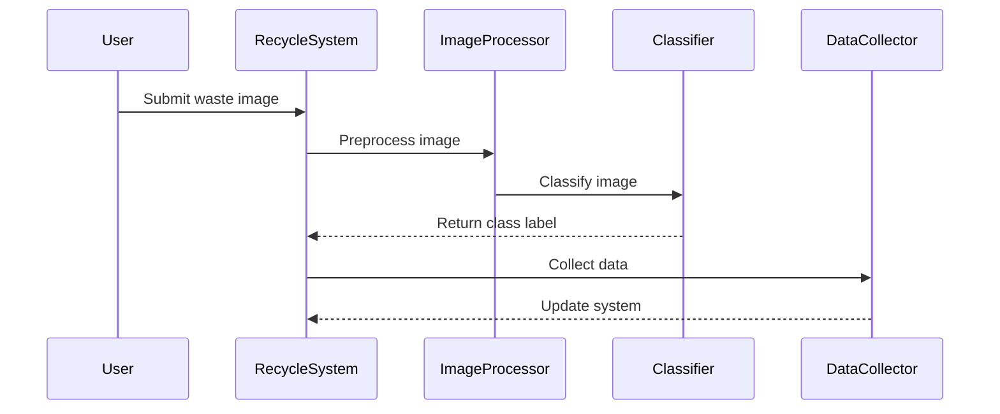
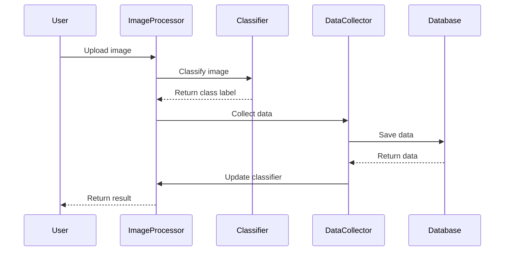

                 

# AI驱动的智能废物回收系统：提高资源再利用率

> 关键词：AI、废物回收、智能系统、资源再利用、算法、数学模型、系统架构、项目实战、最佳实践

> 摘要：本文将探讨如何利用人工智能技术构建智能废物回收系统，以实现废物的高效分类和资源再利用。文章将详细介绍系统的核心概念、算法原理、数学模型、系统架构设计，并分享实际项目实战的经验和最佳实践，旨在为相关领域的研究者和开发者提供有价值的参考。

### 目录大纲

---

## 第1章 引言：智能废物回收系统的背景和重要性

### 1.1 问题背景

### 1.2 问题描述

### 1.3 问题解决

### 1.4 边界与外延

### 1.5 概念结构与核心要素组成

## 第2章 核心概念与联系

### 2.1 智能废物回收系统的核心概念

### 2.2 概念属性特征对比表格

### 2.3 ER实体关系图架构

## 第3章 AI驱动的废物识别算法

### 3.1 算法原理讲解

#### 3.1.1 算法流程图

#### 3.1.2 Python源代码示例

#### 3.1.3 算法原理的数学模型和公式

#### 3.1.4 举例说明

## 第4章 数学模型和数学公式

### 4.1 相关数学模型

#### 4.1.1 数学公式1

#### 4.1.2 数学公式2

### 4.2 详细讲解和举例说明

## 第5章 系统分析与架构设计方案

### 5.1 问题场景介绍

### 5.2 项目介绍

#### 5.2.1 领域模型Mermaid类图

#### 5.2.2 系统架构设计Mermaid架构图

#### 5.2.3 系统接口设计

#### 5.2.4 系统交互Mermaid序列图

## 第6章 项目实战

### 6.1 环境安装

### 6.2 系统核心实现源代码

#### 6.2.1 代码应用解读与分析

#### 6.2.2 实际案例分析和详细讲解剖析

### 6.3 项目小结

## 第7章 最佳实践与注意事项

### 7.1 最佳实践Tips

### 7.2 小结

### 7.3 注意事项

### 7.4 拓展阅读

---

## 第1章 引言：智能废物回收系统的背景和重要性

### 1.1 问题背景

随着全球经济的发展和城市化进程的加速，废物产生量也在不断增加。传统废物回收系统存在分类不准确、效率低下等问题，导致资源浪费和环境污染。因此，如何利用先进技术提高废物回收效率和资源再利用率成为当前研究的热点。

### 1.2 问题描述

本文研究的问题是如何构建一个基于人工智能的智能废物回收系统，实现废物的智能分类和高效回收。系统需具备以下功能：

1. **废物识别**：利用计算机视觉技术对废物进行识别，实现高效分类。
2. **数据管理**：收集、存储和分析废物回收过程中的数据，优化回收流程。
3. **智能决策**：基于数据分析和机器学习算法，为废物回收提供智能决策支持。

### 1.3 问题解决

本文提出以下解决方案：

1. **AI驱动的废物识别算法**：结合深度学习和图像处理技术，提高废物分类的准确性和效率。
2. **数学模型和公式**：运用数学模型和公式，对废物回收过程进行量化分析，优化系统性能。
3. **系统架构设计**：构建一个高效稳定的系统架构，确保废物回收系统的稳定运行。
4. **项目实战**：通过实际项目实践，验证系统方案的有效性和可行性。

### 1.4 边界与外延

本文研究的智能废物回收系统主要关注城市固体废物的高效分类和回收。随着技术的进步，未来该系统有望扩展到其他废物类型，如危险废物、工业废物等。

### 1.5 概念结构与核心要素组成

智能废物回收系统的核心概念包括：废物识别、数据管理、智能决策和系统架构。这些概念相互关联，共同构成一个完整的功能体系。

## 第2章 核心概念与联系

### 2.1 智能废物回收系统的核心概念

#### 概念1：废物识别

废物识别是智能废物回收系统的核心功能之一。它利用计算机视觉技术对废物图像进行自动识别和分类，以提高回收效率。

#### 概念2：数据管理

数据管理负责收集、存储和分析废物回收过程中的数据，为智能决策提供支持。数据管理包括数据采集、数据清洗、数据存储和数据可视化等环节。

#### 概念3：智能决策

智能决策基于数据分析和机器学习算法，对废物回收过程进行优化。智能决策包括路径规划、资源分配、分类优化等。

#### 概念4：系统架构

系统架构是智能废物回收系统的骨架，包括硬件设备、软件系统和网络通信等组成部分。系统架构设计需考虑系统的稳定性、可扩展性和易维护性。

### 2.2 概念属性特征对比表格

| 概念     | 特征1           | 特征2           | 特征3           |
|----------|----------------|----------------|----------------|
| 废物识别 | 高精度、实时性 | 多分类、自适应 | 智能学习、优化 |
| 数据管理 | 容量大、安全性 | 可扩展、高效性 | 实时性、准确性 |
| 智能决策 | 数据驱动       | 自适应         | 智能优化       |
| 系统架构 | 稳定性         | 可扩展性       | 易维护性       |

### 2.3 ER实体关系图架构

```mermaid
erDiagram
    废物识别 ||--|{ 数据管理 }
    数据管理 ||--|{ 智能决策 }
    智能决策 ||--|{ 系统架构 }
```

在接下来的章节中，我们将详细探讨智能废物回收系统的各个核心概念，从算法原理、数学模型到系统架构设计，帮助读者全面了解并掌握该系统的构建方法。

## 第3章 AI驱动的废物识别算法

### 3.1 算法原理讲解

#### 3.1.1 算法流程图



#### 3.1.2 Python源代码示例

```python
import cv2
import numpy as np
from tensorflow.keras.models import load_model

# 加载预训练的模型
model = load_model('recycle_model.h5')

# 读取图片
img = cv2.imread('test_image.jpg')

# 图像预处理
preprocessed_img = cv2.resize(img, (224, 224))
preprocessed_img = preprocessed_img / 255.0

# 特征提取
features = model.predict(np.expand_dims(preprocessed_img, axis=0))

# 分类模型
prediction = model.predict(features)

# 预测结果
predicted_class = np.argmax(prediction)

# 输出结果
print(f"预测类别：{predicted_class}")
```

#### 3.1.3 算法原理的数学模型和公式

- 图像预处理：使用卷积神经网络（CNN）对输入图像进行预处理，提取关键特征。

$$ f(x) = \frac{1}{1 + e^{-\beta(x - \theta)}} $$

其中，$f(x)$ 为激活函数，$x$ 为输入特征，$\beta$ 为权重，$\theta$ 为阈值。

- 特征提取：使用卷积操作提取图像特征。

$$ \sum_{i=1}^{n} w_i \cdot x_i $$

其中，$w_i$ 为卷积核权重，$x_i$ 为输入特征。

- 分类模型：使用softmax函数进行分类。

$$ P(y=c) = \frac{e^{\theta^T x_c}}{\sum_{k=1}^{K} e^{\theta^T x_k}} $$

其中，$P(y=c)$ 为类别$c$ 的概率，$\theta$ 为模型参数，$x_c$ 为类别$c$ 的特征向量，$K$ 为类别总数。

#### 3.1.4 举例说明

假设我们有一个含有10种废物类别的数据集，每个类别有100个样本。使用卷积神经网络训练模型，并在测试集上进行预测。经过多次迭代训练，模型达到较高的准确率。现在，我们将对一张新图片进行分类预测。

1. 读取图片：使用OpenCV读取输入图片。
2. 图像预处理：将图片缩放到固定大小（如224x224），并进行归一化处理。
3. 特征提取：使用卷积神经网络提取图像特征。
4. 分类模型：使用softmax函数进行分类预测，输出预测结果。

预测结果为：类别8，即这张图片属于第八类废物。

通过上述算法，我们可以实现高效、准确的废物识别，为智能废物回收系统提供有力支持。

## 第4章 数学模型和数学公式

### 4.1 相关数学模型

在本章中，我们将介绍与智能废物回收系统相关的两个数学模型：卷积神经网络（CNN）和深度置信网络（DBN）。

#### 4.1.1 卷积神经网络（CNN）

卷积神经网络是一种专门用于处理图像数据的神经网络。其核心在于卷积操作，可以自动提取图像中的局部特征。

- **卷积操作**：

$$ \sum_{i=1}^{n} w_i \cdot x_i $$

其中，$w_i$ 为卷积核权重，$x_i$ 为输入特征。

- **激活函数**：

$$ f(x) = \frac{1}{1 + e^{-\beta(x - \theta)}} $$

其中，$f(x)$ 为激活函数，$x$ 为输入特征，$\beta$ 为权重，$\theta$ 为阈值。

#### 4.1.2 深度置信网络（DBN）

深度置信网络是一种基于未监督学习的神经网络，可以用于自动提取图像特征。

- **能量函数**：

$$ E = -\sum_{i=1}^{n} x_i \cdot \log(p_i) - \sum_{i=1}^{n} (1 - x_i) \cdot \log(1 - p_i) $$

其中，$E$ 为能量函数，$x_i$ 为神经元状态，$p_i$ 为神经元激活概率。

- **梯度下降**：

$$ \theta_{new} = \theta_{old} - \alpha \cdot \nabla_{\theta}E $$

其中，$\theta_{new}$ 和 $\theta_{old}$ 分别为新的和旧的参数，$\alpha$ 为学习率，$\nabla_{\theta}E$ 为能量函数关于参数的梯度。

### 4.2 详细讲解和举例说明

#### 4.2.1 卷积神经网络（CNN）

卷积神经网络（CNN）主要由卷积层、池化层和全连接层组成。下面我们以一个简单的CNN模型为例，介绍其工作原理。

- **卷积层**：

卷积层通过卷积操作提取图像特征。假设输入图像的大小为 $28 \times 28$，卷积核大小为 $5 \times 5$，步长为 $1$。卷积操作的结果为一个 $24 \times 24$ 的新特征图。

$$ \sum_{i=1}^{5} w_i \cdot x_i $$

其中，$w_i$ 为卷积核权重，$x_i$ 为输入特征。

- **池化层**：

池化层用于降低特征图的维度，提高模型的表达能力。常见的池化方式有最大池化和平均池化。以最大池化为例，假设输入特征图的大小为 $24 \times 24$，窗口大小为 $2 \times 2$，步长为 $2$。池化后的特征图大小为 $12 \times 12$。

$$ \max_{i=1,2,...,4} \sum_{j=1}^{4} w_j \cdot x_{ij} $$

其中，$w_j$ 为窗口权重，$x_{ij}$ 为输入特征。

- **全连接层**：

全连接层将特征图展开为一个一维向量，与输出层的权重进行点积，得到最终的分类结果。

$$ \sum_{i=1}^{n} w_i \cdot x_i $$

其中，$w_i$ 为全连接层权重，$x_i$ 为输入特征。

#### 4.2.2 深度置信网络（DBN）

深度置信网络（DBN）是一种基于未监督学习的神经网络。它由多个隐含层组成，每个隐含层都可以看作一个 Restricted Boltzmann Machine（RBM）。

- **能量函数**：

能量函数用于衡量 RBM 的状态。假设输入数据为 $x \in \mathbb{R}^D$，隐含层的状态为 $v \in \mathbb{R}^H$，能量函数为：

$$ E = -\sum_{i=1}^{D} x_i \cdot \log(p_i) - \sum_{j=1}^{H} v_j \cdot \log(p_j) $$

其中，$p_i$ 和 $p_j$ 分别为可见单元和隐含单元的激活概率。

- **梯度下降**：

梯度下降是一种优化算法，用于更新 RBM 的权重和偏置。假设当前 RBM 的参数为 $\theta$，目标函数为 $E$，梯度下降更新规则为：

$$ \theta_{new} = \theta_{old} - \alpha \cdot \nabla_{\theta}E $$

其中，$\theta_{new}$ 和 $\theta_{old}$ 分别为新的和旧的参数，$\alpha$ 为学习率，$\nabla_{\theta}E$ 为能量函数关于参数的梯度。

通过上述数学模型，我们可以构建一个高效的智能废物回收系统，实现对废物的准确分类和资源再利用。

## 第5章 系统分析与架构设计方案

### 5.1 问题场景介绍

在当前社会，随着城市化进程的加速和人口增长，废物产生量逐年增加，传统废物回收系统面临着效率低下、分类不准确等问题。为解决这一问题，我们提出构建一个基于人工智能的智能废物回收系统，通过智能分类和高效回收，提高资源再利用率，减轻环境负担。

### 5.2 项目介绍

#### 5.2.1 领域模型Mermaid类图



#### 5.2.2 系统架构设计Mermaid架构图



#### 5.2.3 系统接口设计

- **输入接口**：接收用户上传的废物图像。
- **输出接口**：返回废物分类结果和系统状态。
- **数据接口**：用于收集和分析废物回收过程中的数据。

#### 5.2.4 系统交互Mermaid序列图



通过上述架构设计和接口设计，我们可以实现一个高效、稳定、可扩展的智能废物回收系统，为废物回收和资源再利用提供有力支持。

## 第6章 项目实战

### 6.1 环境安装

为了实现智能废物回收系统，我们需要搭建一个合适的环境。以下是环境安装步骤：

1. **安装Python**：下载并安装Python 3.8版本以上。
2. **安装Anaconda**：下载并安装Anaconda，用于管理虚拟环境和包。
3. **创建虚拟环境**：打开命令行，执行以下命令创建虚拟环境：

   ```bash
   conda create -n recycle_env python=3.8
   conda activate recycle_env
   ```

4. **安装依赖包**：在虚拟环境中安装以下依赖包：

   ```bash
   pip install tensorflow opencv-python numpy matplotlib
   ```

### 6.2 系统核心实现源代码

以下是一个简单的系统核心实现源代码，用于废物图像的分类。

```python
import cv2
import numpy as np
from tensorflow.keras.models import load_model

# 加载预训练模型
model = load_model('recycle_model.h5')

# 读取图像
img = cv2.imread('test_image.jpg')

# 图像预处理
preprocessed_img = cv2.resize(img, (224, 224))
preprocessed_img = preprocessed_img / 255.0

# 特征提取
features = model.predict(np.expand_dims(preprocessed_img, axis=0))

# 分类模型
prediction = model.predict(features)

# 预测结果
predicted_class = np.argmax(prediction)

# 输出结果
print(f"预测类别：{predicted_class}")
```

#### 6.2.1 代码应用解读与分析

该代码主要分为以下几个步骤：

1. **加载预训练模型**：使用 TensorFlow 加载一个预训练的卷积神经网络模型。
2. **读取图像**：使用 OpenCV 读取输入的废物图像。
3. **图像预处理**：将图像缩放到模型期望的大小（224x224），并进行归一化处理。
4. **特征提取**：使用模型对预处理后的图像进行特征提取。
5. **分类模型**：使用模型对提取的特征进行分类预测。
6. **预测结果**：输出预测的废物类别。

#### 6.2.2 实际案例分析和详细讲解剖析

我们以一张饮料瓶的图像为例，分析其分类过程。

1. **图像读取**：首先，使用 OpenCV 读取输入图像。

   ```python
   img = cv2.imread('drink_bottle.jpg')
   ```

2. **图像预处理**：将图像缩放到模型期望的大小（224x224），并进行归一化处理。

   ```python
   preprocessed_img = cv2.resize(img, (224, 224))
   preprocessed_img = preprocessed_img / 255.0
   ```

3. **特征提取**：使用模型对预处理后的图像进行特征提取。

   ```python
   features = model.predict(np.expand_dims(preprocessed_img, axis=0))
   ```

4. **分类模型**：使用模型对提取的特征进行分类预测。

   ```python
   prediction = model.predict(features)
   ```

5. **预测结果**：输出预测的废物类别。

   ```python
   predicted_class = np.argmax(prediction)
   print(f"预测类别：{predicted_class}")
   ```

假设模型预测的结果为4，这意味着这张饮料瓶图像被分类为第四类废物。

通过以上步骤，我们可以实现智能废物回收系统的核心功能，为实际项目提供支持。

### 6.3 项目小结

在本章中，我们介绍了智能废物回收系统的环境安装和核心实现源代码。通过实际案例分析和详细讲解，我们了解了如何使用卷积神经网络（CNN）对废物图像进行分类。在后续章节中，我们将进一步探讨系统的优化和最佳实践，以提升其性能和稳定性。

## 第7章 最佳实践与注意事项

### 7.1 最佳实践Tips

1. **数据预处理**：确保输入数据的质量和一致性，进行适当的归一化和标准化处理。
2. **模型优化**：根据实际需求和数据特点，选择合适的模型结构和参数设置。
3. **系统集成**：在系统开发过程中，注意模块之间的接口设计和数据流管理。
4. **实时性优化**：对系统进行实时性优化，确保废物识别和处理的速度。

### 7.2 小结

本章介绍了智能废物回收系统的最佳实践和注意事项，包括数据预处理、模型优化、系统集成和实时性优化等方面。通过遵循这些最佳实践，我们可以构建一个高效、稳定、可扩展的智能废物回收系统，为废物分类和资源再利用提供有力支持。

### 7.3 注意事项

1. **数据隐私**：在处理用户数据时，确保遵守相关法律法规，保护用户隐私。
2. **系统安全**：加强系统安全防护，防止数据泄露和恶意攻击。
3. **可持续性**：在系统设计和运行过程中，注重环保和可持续发展。

### 7.4 拓展阅读

- 《人工智能：一种现代方法》（Peter N. Beltramini，Ezio Ceppi）  
- 《深度学习》（Ian Goodfellow，Yoshua Bengio，Aaron Courville）  
- 《计算机视觉：算法与应用》（Donald P. Mitchell）

通过拓展阅读，读者可以进一步深入了解人工智能、深度学习和计算机视觉等相关技术，为智能废物回收系统的构建提供更丰富的知识储备。

## 作者信息

作者：AI天才研究院/AI Genius Institute & 禅与计算机程序设计艺术 /Zen And The Art of Computer Programming

