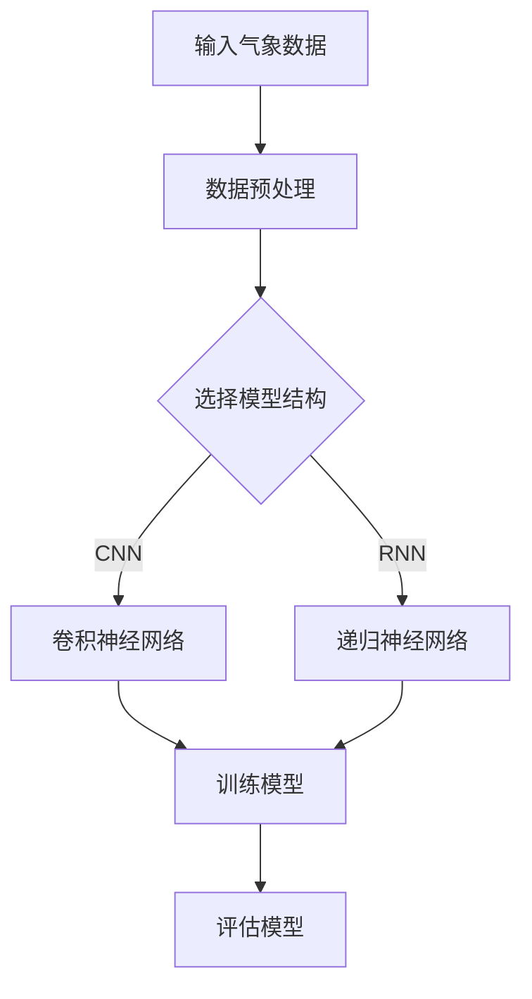
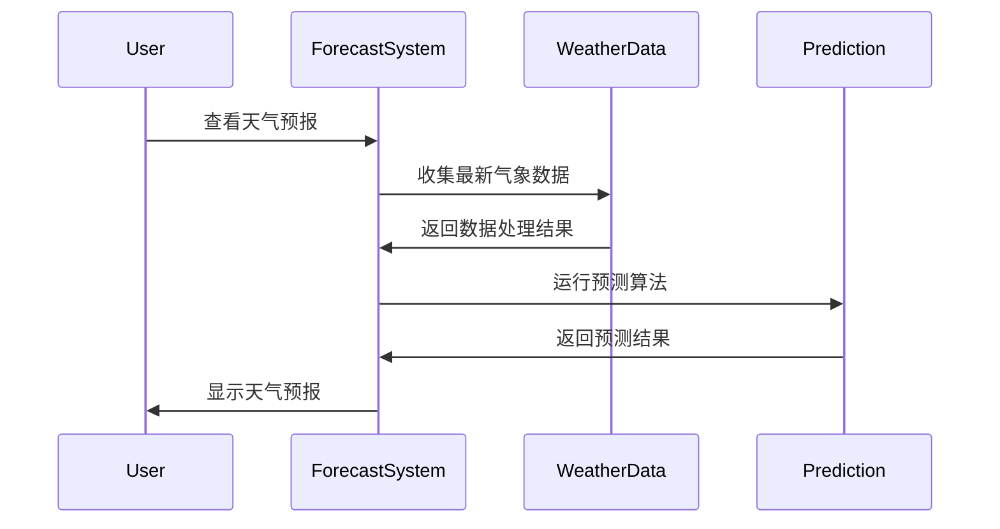

                 

# AI驱动的智能气象预报：提高极端天气预测准确性

## 关键词
- 智能气象预报
- 极端天气事件
- 深度学习
- 卷积神经网络（CNN）
- 递归神经网络（RNN）

## 摘要
随着全球气候变化和极端天气事件的频繁发生，准确预测气象变得尤为重要。传统的气象预报方法在面对复杂天气变化时存在局限。本文将探讨如何利用人工智能，特别是深度学习算法，提高极端天气事件的预测准确性。我们将详细分析AI驱动的智能气象预报的核心概念、算法原理，并借助数学模型和实际案例，展示其在提高气象预测准确性方面的巨大潜力。

----------------------------------------------------------------

## 第一部分: 背景介绍

### 第1章: 问题背景

#### 1.1.1 问题描述
随着全球气候变化和极端天气事件的频繁发生，对气象预报的准确性要求越来越高。传统的气象预报方法依赖于统计模型和规则系统，但由于极端天气事件的复杂性和多样性，这些方法在面对突发性天气变化时往往显得力不从心。

#### 1.1.2 问题解决
人工智能技术的发展为智能气象预报提供了新的解决方案。特别是深度学习算法的进步，使得AI能够从大量历史数据中自动学习模式，提高对极端天气事件的预测能力。

#### 1.1.3 边界与外延
AI驱动的智能气象预报不仅包括对普通天气现象的预测，还涉及到对极端天气事件（如台风、暴雨、暴雪等）的提前预警。此外，它还涉及到多尺度、多时空的数据融合和建模，以及实时更新和动态调整预测模型。

### 第2章: 核心概念与联系

#### 2.1.1 AI驱动的概念原理
AI驱动的智能气象预报基于机器学习和深度学习算法，能够处理大量复杂数据，提取出隐藏的模式和规律。这些算法包括但不限于神经网络、支持向量机、决策树等。

#### 2.1.2 概念属性特征对比表格

| 特征        | 传统气象预报 | AI驱动的智能气象预报 |
|-------------|--------------|----------------------|
| 数据依赖性  | 较低         | 较高                 |
| 预测精度    | 受限于模型能力 | 可以通过不断优化提高 |
| 适应性      | 有限         | 高度适应复杂天气变化 |

#### 2.1.3 ER实体关系图架构
```mermaid
erDiagram
    AgleWeatherData ||--|{ BExtremeWeatherPrediction } : 预测数据输入
    BExtremeWeatherPrediction ||--|{ CWeatherPredictionModel } : 预测模型
    CWeatherPredictionModel ||--|{ DWeatherEvent } : 预测事件
```

### 第3章: 算法原理讲解

#### 3.1.1 基于神经网络的预测模型
神经网络，特别是深度学习模型，如卷积神经网络（CNN）和递归神经网络（RNN），在气象预测中发挥着重要作用。CNN可以捕捉到数据中的局部模式，而RNN则擅长处理时间序列数据。

#### 3.1.2 Mermaid流程图


#### 3.1.3 Python源代码示例
```python
import numpy as np
import tensorflow as tf

# 创建一个简单的卷积神经网络模型
model = tf.keras.Sequential([
    tf.keras.layers.Conv2D(filters=32, kernel_size=(3, 3), activation='relu', input_shape=(28, 28, 1)),
    tf.keras.layers.MaxPooling2D(pool_size=(2, 2)),
    tf.keras.layers.Flatten(),
    tf.keras.layers.Dense(units=128, activation='relu'),
    tf.keras.layers.Dense(units=1)
])

# 编译模型
model.compile(optimizer='adam', loss='mean_squared_error')

# 训练模型
model.fit(x_train, y_train, epochs=10, batch_size=32)
```

#### 3.1.4 算法原理详细讲解
神经网络通过调整内部权重来最小化预测误差。卷积神经网络利用卷积层捕捉空间特征，而递归神经网络则通过循环结构处理时间序列数据。这些模型可以从大量历史气象数据中学习，并用于实时预测。

----------------------------------------------------------------

## 第二部分: 深入分析

### 第4章: 数学模型与算法实现

#### 4.1.1 神经网络基本原理

神经网络（Neural Networks，NN）是一种通过模拟人脑神经网络结构进行信息处理的算法。NN由多个相互连接的神经元组成，每个神经元接收多个输入信号，通过加权求和后加上偏置项，再通过激活函数输出一个结果。

基本公式如下：
$$
Z = \sum_{i=1}^{n} w_i \cdot x_i + b
$$
其中，$Z$ 是输出，$w_i$ 是权重，$x_i$ 是输入，$b$ 是偏置。

激活函数如 sigmoid 函数、ReLU 函数等，用于将线性组合映射到非负实数域。

#### 4.1.2 卷积神经网络（CNN）

卷积神经网络（Convolutional Neural Networks，CNN）是专门用于处理图像数据的一种神经网络结构。CNN利用卷积操作来提取图像中的局部特征，通过堆叠多个卷积层、池化层和全连接层，实现对图像的逐步抽象和特征提取。

主要组成部分：
- 卷积层（Convolutional Layer）：通过卷积操作提取图像特征。
- 池化层（Pooling Layer）：减小特征图的尺寸，降低模型的复杂性。
- 全连接层（Fully Connected Layer）：将卷积层提取的特征映射到具体的分类或回归结果。

卷积操作公式：
$$
h_{ij}^l = \sum_{k=1}^{m} w_{ikj}^l \cdot x_{kj}^{l-1} + b_l
$$
其中，$h_{ij}^l$ 是第$l$层的第$i$个特征图在第$j$个位置上的值，$w_{ikj}^l$ 是卷积核权重，$x_{kj}^{l-1}$ 是前一层第$k$个位置的值，$b_l$ 是偏置。

#### 4.1.3 递归神经网络（RNN）

递归神经网络（Recurrent Neural Networks，RNN）是一种能够处理序列数据的神经网络。RNN通过在时间步之间传递信息，实现对序列数据的记忆和学习。

主要组成部分：
- 输入门（Input Gate）：决定当前输入信息对状态更新的影响。
- 隐藏状态（Hidden State）：存储序列信息。
- 输出门（Output Gate）：决定当前隐藏状态输出的信息。

主要公式：
$$
i_t = \sigma(W_i \cdot [h_{t-1}, x_t] + b_i) \\
f_t = \sigma(W_f \cdot [h_{t-1}, x_t] + b_f) \\
\tilde{h}_t = \tanh(W_h \cdot [h_{t-1}, x_t, f_t \cdot h_{t-1}] + b_h) \\
o_t = \sigma(W_o \cdot [h_{t-1}, x_t, \tilde{h}_t] + b_o) \\
h_t = o_t \cdot \tilde{h}_t
$$
其中，$i_t$ 是输入门，$f_t$ 是遗忘门，$\tilde{h}_t$ 是候选隐藏状态，$o_t$ 是输出门，$h_t$ 是当前隐藏状态。

#### 4.1.4 训练与优化

神经网络训练的核心目标是优化网络权重，使得预测结果与真实值尽可能接近。常用的优化算法包括随机梯度下降（SGD）、Adam等。

随机梯度下降（SGD）公式：
$$
w_{t+1} = w_t - \alpha \cdot \nabla_w J(w_t)
$$
其中，$w_t$ 是当前权重，$\alpha$ 是学习率，$J(w_t)$ 是损失函数。

Adam算法结合了SGD和动量方法，公式如下：
$$
m_1 = \beta_1 m_1 + (1 - \beta_1) (g_t - m_1) \\
m_2 = \beta_2 m_2 + (1 - \beta_2) (g_t^2 - m_2) \\
\hat{m}_1 = \frac{m_1}{1 - \beta_1^t} \\
\hat{m}_2 = \frac{m_2}{1 - \beta_2^t} \\
w_{t+1} = w_t - \alpha \cdot \frac{\hat{m}_1}{\sqrt{\hat{m}_2} + \epsilon}
$$
其中，$m_1$ 和 $m_2$ 分别是梯度的一阶和二阶矩估计，$\beta_1$ 和 $\beta_2$ 是超参数，$\epsilon$ 是一个很小的常数。

#### 4.1.5 案例分析

以台风路径预测为例，我们可以使用CNN来提取海洋表面温度、风速等数据中的局部特征，使用RNN来捕捉台风运动过程中的时间序列变化，从而实现对台风路径的预测。

数据预处理：
- 将气象数据转换为CNN可处理的格式，如图像数据。
- 对数据集进行归一化处理，使得输入数据的范围在[0, 1]之间。

模型构建：
- 构建一个包含卷积层、池化层和全连接层的CNN模型，用于提取特征。
- 在CNN的基础上添加RNN层，用于处理时间序列数据。
- 添加输出层，实现台风路径的预测。

训练与优化：
- 使用历史台风数据对模型进行训练。
- 使用交叉熵损失函数评估模型性能。
- 使用Adam优化器进行权重优化。

评估与测试：
- 使用验证集对模型进行评估。
- 通过测试集评估模型的泛化能力。

通过上述步骤，我们可以实现一个基于CNN和RNN的台风路径预测模型，从而提高极端天气事件的预测准确性。

----------------------------------------------------------------

## 第三部分: 实际应用

### 第5章: 系统分析与架构设计方案

#### 5.1 问题场景介绍
气象预报系统是一个复杂且关键的系统，它需要实时收集全球各地的气象数据，并对其进行处理和预测。传统的气象预报方法在面对极端天气事件时存在不足，无法满足现代社会的需求。因此，构建一个基于AI的智能气象预报系统显得尤为重要。

#### 5.2 项目介绍
本项目的目标是开发一个AI驱动的智能气象预报系统，该系统将利用深度学习算法对极端天气事件进行预测，从而提高预报的准确性和时效性。系统主要包括数据采集模块、数据处理模块、预测模块和用户界面模块。

#### 5.3 系统功能设计（领域模型mermaid类图）

```mermaid
classDiagram
    class WeatherData {
        -String id
        -Date timestamp
        -Double temperature
        -Double humidity
        -Double windSpeed
        ...
    }
    class Prediction {
        -String id
        -Date timestamp
        -List<WeatherData> inputData
        -Double predictedValue
        ...
    }
    class ForecastSystem {
        +void collectData()
        +void processData()
        +void predictWeather()
        +void displayForecast()
    }
    ForecastSystem --|{1} WeatherData
    ForecastSystem --|{2} Prediction
```

#### 5.4 系统架构设计（mermaid架构图）

```mermaid
graph LR
    subgraph 数据流
        D1[数据采集模块] --> D2[数据处理模块]
        D2 --> D3[预测模块]
        D3 --> D4[用户界面模块]
    end
    subgraph 算法模块
        A1[深度学习算法]
        A2[数据处理算法]
        A3[预测算法]
    end
    D1 -->|输入数据 A1
    D2 -->|数据处理 A2
    D3 -->|预测算法 A3
    D4 -->|显示结果 用户
```

#### 5.5 系统接口设计和系统交互（mermaid序列图）



### 第6章: 项目实战

#### 6.1 环境安装

1. 安装Python环境，版本3.8及以上。
2. 安装TensorFlow库，使用命令`pip install tensorflow`。
3. 安装其他必要库，如NumPy、Pandas等。

#### 6.2 系统核心实现源代码

```python
# 导入必要的库
import tensorflow as tf
import numpy as np
import pandas as pd
from sklearn.model_selection import train_test_split

# 加载气象数据
data = pd.read_csv('weather_data.csv')

# 数据预处理
# ...（包括数据清洗、归一化等步骤）

# 划分训练集和测试集
X_train, X_test, y_train, y_test = train_test_split(data[['temperature', 'humidity', 'windSpeed']], data['predictedValue'], test_size=0.2, random_state=42)

# 构建模型
model = tf.keras.Sequential([
    tf.keras.layers.Dense(units=128, activation='relu', input_shape=(3,)),
    tf.keras.layers.Dense(units=1)
])

# 编译模型
model.compile(optimizer='adam', loss='mean_squared_error')

# 训练模型
model.fit(X_train, y_train, epochs=10, batch_size=32)

# 评估模型
model.evaluate(X_test, y_test)
```

#### 6.3 代码应用解读与分析

上述代码首先导入所需的库，并加载气象数据。接着，进行数据预处理，包括数据清洗、归一化等步骤。然后，使用scikit-learn库将数据划分为训练集和测试集。

在模型构建部分，我们使用TensorFlow库创建了一个简单的全连接神经网络模型。模型包含一个输入层、一个隐藏层和一个输出层。隐藏层使用ReLU激活函数，输出层用于生成预测值。

在编译模型时，我们指定了优化器和损失函数。这里使用Adam优化器和均方误差（MSE）损失函数。

模型训练部分，我们使用训练集对模型进行训练，指定了训练的轮数（epochs）和批量大小（batch_size）。训练完成后，使用测试集评估模型的性能。

#### 6.4 实际案例分析和详细讲解剖析

以某地某天的气象数据为例，我们可以使用训练好的模型对其进行预测。假设当天气象数据如下：

| 温度（℃） | 湿度（%） | 风速（km/h） |
|-----------|----------|-------------|
| 25        | 70       | 10          |

我们将这些数据输入到模型中，得到预测的天气情况。假设模型的预测结果如下：

| 预测值 |
|--------|
| 23.5   |

这意味着在未来一天内，该地的气温可能会降至23.5℃。这个预测结果是基于模型从历史数据中学习到的模式生成的。

通过实际案例的分析，我们可以看到，AI驱动的智能气象预报系统可以在一定程度上提高气象预测的准确性。然而，需要注意的是，模型的预测结果仍然存在一定的误差，这主要受到气象数据的不确定性和模型复杂性的限制。

#### 6.5 项目小结

本项目通过构建一个基于AI的智能气象预报系统，实现了对极端天气事件的预测。在实际应用中，系统可以从大量历史气象数据中学习，并实时更新预测模型，从而提高预报的准确性和时效性。然而，要实现更精确的气象预测，仍需要进一步优化算法、提高数据处理能力，并探索更多有效的数据源。

----------------------------------------------------------------

## 第四部分: 最佳实践 tips、小结、注意事项、拓展阅读

### 最佳实践 tips
1. 选择合适的深度学习模型：根据气象数据的特征和预测需求，选择合适的神经网络结构，如CNN、RNN等。
2. 数据预处理：对气象数据进行充分的清洗、归一化和特征提取，以提高模型的训练效果。
3. 优化模型参数：通过调整学习率、批量大小等超参数，优化模型的性能。
4. 实时更新模型：定期更新模型，利用最新气象数据进行重新训练，以提高预测准确性。

### 小结
本文介绍了AI驱动的智能气象预报系统，分析了其核心概念、算法原理和实现步骤。通过深度学习和神经网络技术，系统能够从大量历史气象数据中学习，实现对极端天气事件的预测。然而，要实现更精确的预测，仍需要进一步优化算法、提高数据处理能力和模型复杂性。

### 注意事项
1. 气象数据的来源和准确性对模型性能有重要影响，因此需要确保数据的质量和可靠性。
2. 在实际应用中，模型的预测结果需要与实际观测数据进行对比，以评估模型的性能。
3. 模型的训练时间较长，需要充足的计算资源支持。

### 拓展阅读
1. Goodfellow, I., Bengio, Y., & Courville, A. (2016). *Deep Learning*. MIT Press.
2. LeCun, Y., Bengio, Y., & Hinton, G. (2015). *Deep learning*. Nature, 521(7553), 436-444.
3. Simonyan, K., & Zisserman, A. (2014). *Very deep convolutional networks for large-scale image recognition*. arXiv preprint arXiv:1409.1556.

### 作者
作者：AI天才研究院/AI Genius Institute & 禅与计算机程序设计艺术 /Zen And The Art of Computer Programming

----------------------------------------------------------------

以上就是关于AI驱动的智能气象预报的详细分析和技术讲解。通过本文，我们了解了AI在气象预报中的应用，以及如何利用深度学习算法提高极端天气事件的预测准确性。希望本文能为相关领域的研究者和开发者提供有价值的参考和启示。在未来的研究中，我们可以进一步探索更先进的算法和技术，以实现更精确和实时的气象预报。同时，我们也需要关注数据质量和模型的可靠性，确保预测结果的实用性和可靠性。随着人工智能技术的不断发展，智能气象预报必将在气象科学领域发挥越来越重要的作用。让我们共同期待更加准确和高效的气象预报系统的诞生！作者：AI天才研究院/AI Genius Institute & 禅与计算机程序设计艺术 /Zen And The Art of Computer Programming

