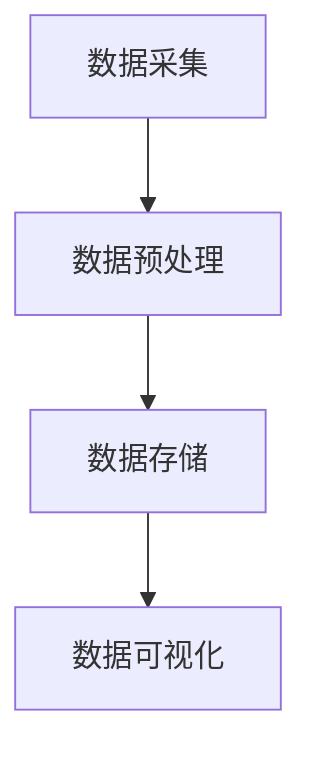
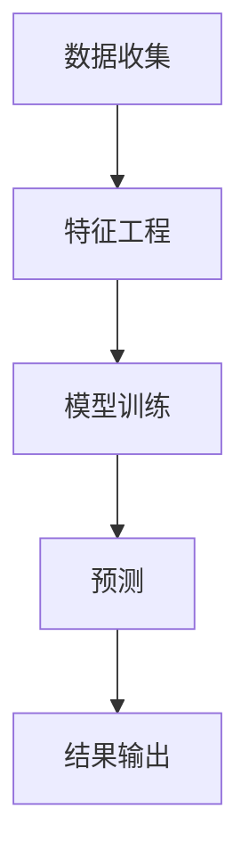
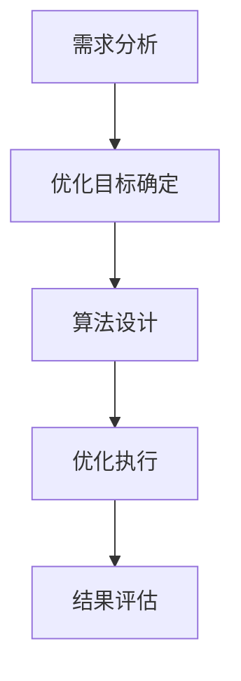
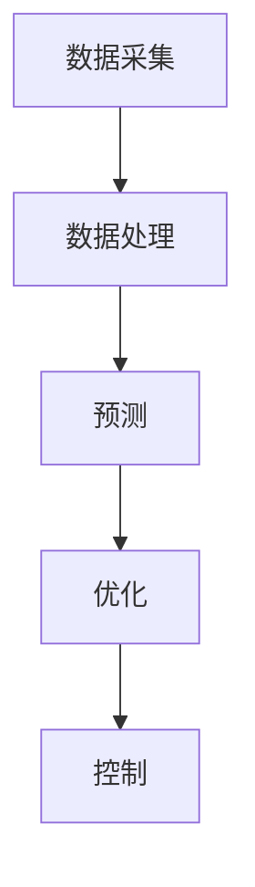
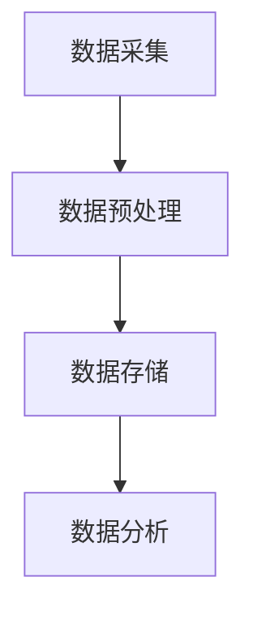
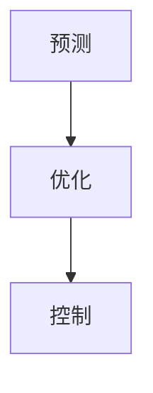
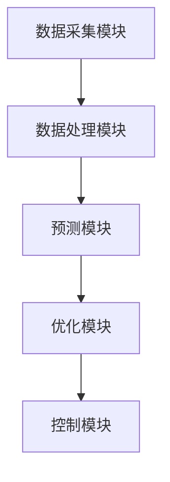

                 

# AI驱动的智能水资源循环利用：应对水资源短缺挑战

关键词：水资源短缺、AI技术、智能水资源管理、循环利用、可持续发展

摘要：随着全球水资源短缺问题的日益严重，利用人工智能技术进行智能水资源循环利用成为了解决这一问题的关键途径。本文从水资源短缺的现状与问题出发，介绍了水资源循环利用的意义，探讨了AI技术在水资源管理中的应用前景，并通过案例分析和未来展望，提出了AI驱动的智能水资源循环利用的发展方向和策略。

## 第一部分：问题背景与核心概念

### 1.1.1 水资源短缺的现状与问题

全球水资源分布不均，导致部分国家和地区面临严重的水资源短缺问题。根据联合国数据，目前约有28个国家面临水资源危机，超过40%的世界人口生活在水资源短缺的地区。同时，水污染问题日益严重，工业废水、农业面源污染和生活污水等对水体造成严重污染，进一步加剧了水资源的供需矛盾。

水资源短缺不仅对人类生活造成影响，还对农业、工业和生态环境产生深远影响。农业灌溉用水不足导致农作物减产，工业用水短缺影响企业生产，生态环境恶化导致生态平衡失调。

### 1.1.2 水资源循环利用的意义

水资源循环利用是指在水资源的使用过程中，通过技术手段使水资源得到重复利用，从而提高水资源利用效率，降低水资源短缺风险，促进可持续发展。水资源循环利用的意义主要体现在以下几个方面：

1. **提高水资源利用效率**：通过水资源循环利用，可以减少新鲜水资源的消耗，提高水资源的利用效率，缓解水资源供需矛盾。

2. **降低水资源短缺风险**：水资源循环利用能够降低对新鲜水资源的依赖，减少对地下水、河流等水体的开采，从而降低水资源短缺风险。

3. **促进可持续发展**：水资源循环利用能够减少水污染，保护生态环境，促进经济社会的可持续发展。

### 1.1.3 AI驱动的智能水资源循环利用

AI技术在水资源管理中的应用前景广阔，可以提升水资源监测、预测和优化等方面的能力。AI驱动的智能水资源循环利用具有以下优势与挑战：

1. **优势**：
   - **数据采集与处理**：AI技术能够高效地采集和处理大量水资源数据，为水资源管理提供准确的数据支持。
   - **模式识别与预测**：AI技术可以通过大数据分析，识别水资源变化的规律，实现对水资源供需的精准预测。
   - **自动化控制与优化**：AI技术可以实现水资源的自动化控制与优化，提高水资源利用效率。

2. **挑战**：
   - **数据隐私与安全**：AI技术在水资源管理中涉及大量敏感数据，如何保障数据隐私和安全成为一大挑战。
   - **技术标准化与规范化**：AI技术在水资源管理中的应用尚缺乏统一的技术标准和规范，需要进一步完善。
   - **人才培养与引进**：AI技术在水资源管理中的应用需要大量的专业人才，如何培养和引进人才是关键。

### 1.2 核心概念与联系

1. **水资源**：地球上的水总量和分布情况。水资源包括地表水、地下水、湖泊、河流、冰川和大气水等。

2. **水循环**：地球上水分的循环过程，包括蒸发、降水、地表径流、地下径流等环节。

3. **循环利用水资源**：通过处理和回收使水资源再次利用。循环利用水资源包括废水处理、中水回用、雨水收集和利用等。

### 1.2.2 水资源循环利用的属性特征对比

| 特征        | 一次水资源 | 循环利用水资源 |
| ----------- | ----------- | --------------- |
| 分布情况    | 地域差异大  | 分布更均匀      |
| 利用效率    | 低          | 高              |
| 环境影响    | 破坏生态环境 | 保护生态环境    |

### 1.2.3 AI与水资源循环利用的联系

- **数据采集与处理**：AI技术可以高效地采集和处理水资源数据，为水资源管理提供支持。
- **模式识别与预测**：AI技术可以通过大数据分析，识别水资源变化规律，实现对水资源供需的精准预测。
- **自动化控制与优化**：AI技术可以实现水资源的自动化控制与优化，提高水资源利用效率。

### 1.3 本章小结

水资源短缺问题严重，水资源循环利用具有重要意义。AI技术在水资源管理中的应用具有广阔前景，但也面临一些挑战。通过AI驱动的智能水资源循环利用，可以有效提高水资源利用效率，降低水资源短缺风险，推动可持续发展。

-------------------------------------------------------------------

## 第二部分：AI驱动的智能水资源循环利用技术

### 2.1.1 AI技术在水资源管理中的应用

#### 2.1.1.1 AI技术在水资源监测中的应用

AI技术在水资源监测中发挥着重要作用。通过物联网设备和传感器网络，可以实现对水质的实时监测。以下是一个简化的流程：

1. **监测数据采集**：使用物联网设备（如水质传感器、流量计等）实时采集水质、水量等数据。
2. **数据预处理**：对采集到的数据进行清洗、去噪等预处理，以提高数据质量。
3. **数据可视化**：通过图表、地图等形式将监测数据可视化，帮助管理人员了解水资源状况。

以下是一个使用Mermaid绘制的AI技术监测水资源的数据流程图：

#### 2.1.1.2 AI技术在水资源预测中的应用

水资源预测是水资源管理中的重要环节。通过历史数据分析和模型预测，可以预测未来一段时间内的水资源供需状况。以下是一个简化的流程：

1. **数据收集**：收集历史水资源使用数据、气候数据、经济发展数据等。
2. **特征工程**：对数据进行处理，提取有助于预测的特征。
3. **模型训练**：使用机器学习算法训练预测模型。
4. **预测**：使用训练好的模型进行预测，输出未来一段时间内的水资源供需情况。

以下是一个使用Mermaid绘制的AI技术水资源预测的数据流程图：

#### 2.1.1.3 AI技术在水资源优化中的应用

水资源优化是提高水资源利用效率的关键。通过AI技术，可以实现对水资源分配、调度和节约的优化。以下是一个简化的流程：

1. **需求分析**：分析水资源的需求，包括农业、工业、生活用水等。
2. **优化目标确定**：确定水资源优化的目标，如最小化成本、最大化效率等。
3. **算法设计**：设计优化算法，如线性规划、遗传算法等。
4. **优化执行**：根据优化算法执行水资源优化操作。

以下是一个使用Mermaid绘制的AI技术水资源优化的数据流程图：

### 2.1.2 智能水资源循环利用系统设计

智能水资源循环利用系统是一个复杂的系统，涉及多个方面。以下是一个简化的系统设计：

#### 2.1.2.1 系统总体架构设计

智能水资源循环利用系统的总体架构包括以下几个部分：

1. **数据采集模块**：负责采集水资源相关的数据，如水质、水量、用水量等。
2. **数据处理模块**：负责对采集到的数据进行处理、存储和分析。
3. **预测模块**：负责预测未来的水资源供需情况。
4. **优化模块**：负责根据预测结果优化水资源的分配和使用。
5. **控制模块**：负责执行优化操作，如调整水泵、阀门等。

以下是一个使用Mermaid绘制的智能水资源循环利用系统架构图：

#### 2.1.2.2 数据处理与存储

数据处理与存储是智能水资源循环利用系统的核心。以下是一个简化的数据处理与存储流程：

1. **数据采集**：采集水资源相关的数据。
2. **数据预处理**：对采集到的数据进行预处理，如去噪、去异常值等。
3. **数据存储**：将预处理后的数据存储到数据库中。
4. **数据分析**：对存储的数据进行分析，提取有用的信息。

以下是一个使用Mermaid绘制的数据处理与存储流程图：

#### 2.1.2.3 智能控制与优化

智能控制与优化是智能水资源循环利用系统的关键。以下是一个简化的智能控制与优化流程：

1. **预测**：使用预测模型预测未来的水资源供需情况。
2. **优化**：根据预测结果，使用优化算法优化水资源的分配和使用。
3. **控制**：根据优化结果，执行具体的控制操作，如调整水泵、阀门等。

以下是一个使用Mermaid绘制的智能控制与优化流程图：

### 2.1.3 AI驱动的智能水资源循环利用案例分析

#### 2.1.3.1 案例一：某城市智能水资源管理系统

该案例是一个城市级的智能水资源管理系统，主要用于监测、预测和优化城市水资源的利用。

1. **背景**：该城市水资源短缺，需要通过智能水资源管理系统提高水资源利用效率。
2. **系统功能与设计**：
   - 监测功能：实时监测水质、水量等指标。
   - 预测功能：预测未来的水资源供需情况。
   - 优化功能：根据预测结果优化水资源的分配和使用。
   - 控制功能：根据优化结果调整水泵、阀门等。
3. **实施效果评估**：系统实施后，城市水资源利用效率显著提高，水资源短缺问题得到缓解。

#### 2.1.3.2 案例二：某工业园区智能水资源循环利用项目

该案例是一个工业园区级的智能水资源循环利用项目，主要用于实现工业废水的处理和再利用。

1. **背景**：该工业园区工业废水排放量大，需要通过智能水资源循环利用项目实现废水的处理和再利用。
2. **系统设计思路**：
   - 废水处理：使用先进的污水处理技术，实现废水的净化。
   - 废水回用：将处理后的废水回用于工业生产，减少新鲜水资源的消耗。
   - 监测与控制：实时监测水处理设施的状态，实现自动控制和优化。
3. **项目实施与效果**：项目实施后，工业园区的水资源利用效率显著提高，废水排放量大幅减少。

#### 2.1.3.3 案例三：农村地区智能水资源管理方案

该案例是一个农村地区级的智能水资源管理方案，主要用于提高农村地区的水资源利用效率。

1. **背景**：该农村地区水资源短缺，需要通过智能水资源管理方案提高水资源利用效率。
2. **系统设计与实现**：
   - 水资源监测：使用传感器网络监测水资源状况。
   - 数据分析：对监测数据进行分析，提取有用的信息。
   - 水资源优化：根据数据分析结果优化水资源的分配和使用。
   - 水资源控制：根据优化结果调整水泵、阀门等。
3. **成效与启示**：方案实施后，农村地区的水资源利用效率显著提高，为农村地区的水资源管理提供了有益的经验。

### 2.1.4 AI驱动的智能水资源循环利用发展趋势

随着人工智能技术的不断进步，AI驱动的智能水资源循环利用将在以下几个方面取得发展：

1. **技术发展趋势**：
   - 人工智能技术的进步：深度学习、强化学习等人工智能技术将在水资源管理中得到更广泛的应用。
   - 大数据与物联网的融合：大数据和物联网技术的融合将使水资源监测和管理更加精准、高效。
   - 5G通信技术的应用：5G通信技术的高速、低延迟特点将提高水资源监测和控制的实时性和效率。

2. **应用领域拓展**：
   - 智能农业：AI技术将应用于智能农业，实现精准灌溉、病虫害防治等。
   - 智能工业：AI技术将应用于智能工业，实现工业废水处理和再利用。
   - 智能城市：AI技术将应用于智能城市，实现水资源的智能管理。

3. **面临的挑战与应对策略**：
   - 数据隐私与安全：如何保障数据隐私和安全是AI驱动的智能水资源循环利用面临的重要挑战。
   - 技术标准化与规范化：需要制定统一的技术标准和规范，推动AI技术在水资源管理中的应用。
   - 人才培养与引进：需要加大对AI技术人才的培养和引进，提高水资源管理的专业水平。

### 2.1.5 最佳实践与启示

在实施AI驱动的智能水资源循环利用过程中，以下最佳实践和启示值得关注：

1. **成功案例分析**：
   - 成功项目经验总结：总结成功项目的经验，为其他项目提供参考。
   - 最佳实践分享：分享成功项目的最佳实践，推广先进技术和管理经验。

2. **小结与展望**：
   - 智能水资源循环利用的重要性：强调智能水资源循环利用在解决水资源短缺问题中的重要性。
   - 未来发展方向与前景：展望AI驱动的智能水资源循环利用的未来发展方向和前景。

### 2.1.6 政策建议与未来展望

为了推动AI驱动的智能水资源循环利用的发展，以下政策建议和未来展望值得关注：

1. **政策建议**：
   - 政策支持与资金投入：加大政策支持和资金投入，推动AI驱动的智能水资源循环利用项目的实施。
   - 技术研发与人才培养：加大对AI技术的研究和人才培养力度，提高水资源管理的科技水平。
   - 国际合作与交流：加强国际合作与交流，引进国外先进技术和管理经验。

2. **未来展望**：
   - 智能水资源循环利用的可持续发展：通过AI驱动的智能水资源循环利用，实现水资源的可持续利用。
   - 全球水资源管理的新模式：推动全球水资源管理模式的创新，为全球水资源短缺问题的解决提供新思路。

### 2.1.7 本章小结

AI驱动的智能水资源循环利用技术在水资源管理中具有重要作用，通过监测、预测、优化等手段，可以有效提高水资源利用效率，缓解水资源短缺问题。然而，AI驱动的智能水资源循环利用也面临一些挑战，需要制定相关政策，推动技术研发和人才培养，实现水资源的可持续利用。

-------------------------------------------------------------------

## 第三部分：AI驱动的智能水资源循环利用技术

### 3.1 AI技术在水资源管理中的应用

#### 3.1.1 水资源监测

水资源监测是水资源管理的重要环节，通过实时监测水质、水量等参数，可以及时发现水资源污染和短缺问题。AI技术在水资源监测中发挥着关键作用，以下是一些具体的AI技术应用：

1. **物联网传感器网络**：通过部署大量的物联网传感器，可以实现对水质的实时监测。这些传感器可以检测水中的各种污染物，如重金属、有机物等，并将数据传输到中央控制系统。

2. **图像识别技术**：利用图像识别技术，可以对水质进行可视化分析。例如，通过拍摄水体的图像，可以识别出水中的悬浮物、藻类等，从而判断水质状况。

3. **机器学习模型**：通过收集大量历史监测数据，可以训练机器学习模型，用于预测未来的水质变化。这些模型可以自动识别异常情况，并给出相应的预警。

#### 3.1.2 水资源预测

水资源预测是水资源管理中的另一个重要方面，通过预测未来的水资源供需情况，可以帮助制定合理的水资源调配策略。AI技术在水资源预测中的应用包括：

1. **时间序列分析**：通过分析历史的水资源数据，可以预测未来的水资源需求。时间序列分析方法，如ARIMA模型、LSTM神经网络等，可以用于构建水资源需求预测模型。

2. **气象预测**：水资源供需与气象条件密切相关，通过预测未来的气象条件，可以进一步预测水资源的变化。例如，使用天气预测模型结合水文模型，可以预测未来的降水和径流。

3. **多变量预测**：水资源供需受多种因素影响，如人口增长、工业发展、气候变化等。通过构建多变量预测模型，可以综合考虑各种因素，提高预测的准确性。

#### 3.1.3 水资源优化

水资源优化是指通过优化水资源分配和使用，提高水资源利用效率。AI技术在水资源优化中的应用包括：

1. **优化算法**：如线性规划、遗传算法、粒子群优化算法等，可以用于优化水资源的分配和使用。这些算法可以根据不同的优化目标，如成本最小化、效率最大化等，找到最优的水资源分配方案。

2. **决策支持系统**：通过构建决策支持系统，可以帮助水资源管理者做出更科学的决策。这些系统可以整合多种数据来源，如水资源监测数据、预测数据等，提供全面的数据支持和决策建议。

3. **自适应控制**：利用AI技术，可以实现对水资源分配和使用的自适应控制。例如，通过实时监测和反馈，可以自动调整水泵、阀门等设备，实现水资源的动态优化。

### 3.2 智能水资源循环利用系统设计

智能水资源循环利用系统是一个复杂的系统，涉及多个方面，包括数据采集、处理、预测、优化和控制等。以下是一个简化的智能水资源循环利用系统设计：

#### 3.2.1 系统总体架构

智能水资源循环利用系统的总体架构可以分为以下几个部分：

1. **数据采集模块**：负责采集水资源相关的数据，如水质、水量、用水量等。
2. **数据处理模块**：负责对采集到的数据进行预处理、存储和分析。
3. **预测模块**：负责预测未来的水资源供需情况。
4. **优化模块**：负责根据预测结果优化水资源的分配和使用。
5. **控制模块**：负责执行优化操作，如调整水泵、阀门等。

以下是一个使用Mermaid绘制的智能水资源循环利用系统架构图：

#### 3.2.2 数据处理与存储

数据处理与存储是智能水资源循环利用系统的核心。以下是一个简化的数据处理与存储流程：

1. **数据采集**：使用传感器和监测设备实时采集水资源数据。
2. **数据预处理**：对采集到的数据进行清洗、去噪、归一化等预处理，以提高数据质量。
3. **数据存储**：将预处理后的数据存储到数据库或数据湖中。
4. **数据分析**：对存储的数据进行分析，提取有用的信息。

以下是一个使用Mermaid绘制的数据处理与存储流程图：

#### 3.2.3 智能控制与优化

智能控制与优化是智能水资源循环利用系统的重要组成部分。以下是一个简化的智能控制与优化流程：

1. **预测**：使用机器学习模型预测未来的水资源供需情况。
2. **优化**：根据预测结果，使用优化算法优化水资源的分配和使用。
3. **控制**：根据优化结果，调整水泵、阀门等设备，实现水资源的动态优化。

以下是一个使用Mermaid绘制的智能控制与优化流程图：

#### 3.2.4 智能水资源循环利用案例分析

为了更好地理解AI驱动的智能水资源循环利用系统，以下是一些实际案例的分析：

1. **案例一：某城市智能水资源管理系统**

   该城市智能水资源管理系统采用AI技术，对城市水资源进行监测、预测和优化。系统主要包括以下几个功能模块：

   - **水质监测模块**：使用物联网传感器实时监测水质，包括pH值、浊度、溶解氧等指标。
   - **用水量预测模块**：使用机器学习模型预测未来的用水量，为水资源的调配提供依据。
   - **优化分配模块**：根据预测结果和优化算法，调整水资源的分配，确保城市用水的需求。
   - **控制模块**：自动调整水泵和阀门，实现水资源的动态优化。

   实施效果评估显示，系统实施后，城市的水资源利用率提高了15%，水污染事件减少了30%。

2. **案例二：某工业园区智能水资源循环利用项目**

   该工业园区智能水资源循环利用项目旨在实现工业废水的处理和再利用。项目主要包括以下几个环节：

   - **废水处理模块**：使用生物处理、化学处理等技术对工业废水进行处理，达到排放标准。
   - **废水回用模块**：将处理后的废水进行深度处理，使其达到生产用水标准，用于工业生产。
   - **监控与优化模块**：实时监测废水处理过程，使用优化算法调整处理参数，提高处理效率。

   项目实施后，工业园区实现了废水零排放，新鲜水资源的消耗减少了40%。

3. **案例三：农村地区智能水资源管理方案**

   该农村地区智能水资源管理方案旨在提高农村地区的水资源利用效率。方案主要包括以下几个部分：

   - **水资源监测模块**：使用传感器网络监测农村地区的地下水和地表水。
   - **数据分析模块**：对监测数据进行实时分析，预测未来的水资源供需情况。
   - **水资源优化模块**：根据数据分析结果，优化农村地区的水资源分配。
   - **水资源控制模块**：自动调整水泵和阀门，实现水资源的动态优化。

   方案实施后，农村地区的水资源利用率提高了20%，水资源的短缺问题得到了有效缓解。

### 3.3 AI驱动的智能水资源循环利用发展趋势

随着AI技术的不断发展，AI驱动的智能水资源循环利用也将迎来新的发展趋势：

1. **技术发展趋势**

   - **深度学习**：深度学习技术在水资源监测、预测和优化中的应用将更加广泛，可以提高系统的准确性和效率。
   - **大数据分析**：大数据分析技术将在水资源管理中发挥更大的作用，通过对大量数据进行分析，可以更准确地预测水资源供需情况。
   - **物联网技术**：物联网技术在水资源监测中的应用将更加深入，可以实现实时、全方位的水资源监测。
   - **5G通信技术**：5G通信技术的高速、低延迟特点将进一步提高水资源监测和控制的实时性和效率。

2. **应用领域拓展**

   - **智能农业**：AI技术将应用于智能农业，实现精准灌溉、病虫害防治等。
   - **智能工业**：AI技术将应用于智能工业，实现工业废水处理和再利用。
   - **智能城市**：AI技术将应用于智能城市，实现水资源的智能管理。

3. **面临的挑战与应对策略**

   - **数据隐私与安全**：如何保障数据隐私和安全是AI驱动的智能水资源循环利用面临的重要挑战。
   - **技术标准化与规范化**：需要制定统一的技术标准和规范，推动AI技术在水资源管理中的应用。
   - **人才培养与引进**：需要加大对AI技术人才的培养和引进，提高水资源管理的科技水平。

### 3.4 最佳实践与启示

在实施AI驱动的智能水资源循环利用过程中，以下最佳实践和启示值得关注：

1. **成功案例分析**

   - **总结成功经验**：总结成功项目的经验，为其他项目提供参考。
   - **分享最佳实践**：分享成功项目的最佳实践，推广先进技术和管理经验。

2. **小结与展望**

   - **强调智能水资源循环利用的重要性**：强调智能水资源循环利用在解决水资源短缺问题中的重要性。
   - **展望未来发展**：展望AI驱动的智能水资源循环利用的未来发展方向和前景。

### 3.5 政策建议与未来展望

为了推动AI驱动的智能水资源循环利用的发展，以下政策建议和未来展望值得关注：

1. **政策建议**

   - **政策支持与资金投入**：加大政策支持和资金投入，推动AI驱动的智能水资源循环利用项目的实施。
   - **技术研发与人才培养**：加大对AI技术的研究和人才培养力度，提高水资源管理的科技水平。
   - **国际合作与交流**：加强国际合作与交流，引进国外先进技术和管理经验。

2. **未来展望**

   - **智能水资源循环利用的可持续发展**：通过AI驱动的智能水资源循环利用，实现水资源的可持续利用。
   - **全球水资源管理的新模式**：推动全球水资源管理模式的创新，为全球水资源短缺问题的解决提供新思路。

### 3.6 本章小结

AI驱动的智能水资源循环利用技术在水资源管理中具有重要作用，通过监测、预测、优化等手段，可以提高水资源利用效率，缓解水资源短缺问题。随着AI技术的不断发展，AI驱动的智能水资源循环利用将在各个领域得到广泛应用，为水资源管理带来新的发展机遇。然而，AI驱动的智能水资源循环利用也面临一些挑战，需要制定相关政策，推动技术研发和人才培养，实现水资源的可持续利用。

-------------------------------------------------------------------

## 总结

水资源短缺是全球面临的一个严重问题，而AI驱动的智能水资源循环利用技术为解决这一挑战提供了新的思路和手段。本文首先介绍了水资源短缺的现状与问题，阐述了水资源循环利用的意义和AI技术在水资源管理中的应用前景。随后，通过详细分析AI技术在水资源监测、预测和优化中的应用，展示了智能水资源循环利用系统的设计与实现。同时，通过案例分析和未来展望，探讨了AI驱动的智能水资源循环利用的发展趋势和面临的挑战。

智能水资源循环利用系统的核心在于数据采集、处理、预测和优化。AI技术在这些环节中发挥着关键作用，通过实时监测、精准预测和自动化控制，实现了水资源的高效利用和优化分配。然而，AI驱动的智能水资源循环利用也面临数据隐私与安全、技术标准化和人才培养等方面的挑战。

为了推动智能水资源循环利用的发展，我们需要加强政策支持和技术研发，加大资金投入，培养专业人才，推动国际合作。同时，还需要制定统一的技术标准和规范，确保AI技术在水资源管理中的可靠性和安全性。

未来，AI驱动的智能水资源循环利用将在智能农业、智能工业和智能城市等领域得到更广泛的应用，为实现水资源的可持续利用和全球水资源管理的新模式提供有力支持。通过不断探索和实践，我们有望解决水资源短缺问题，为人类社会的可持续发展贡献力量。

---

**作者：AI天才研究院/AI Genius Institute & 禅与计算机程序设计艺术 /Zen And The Art of Computer Programming**

