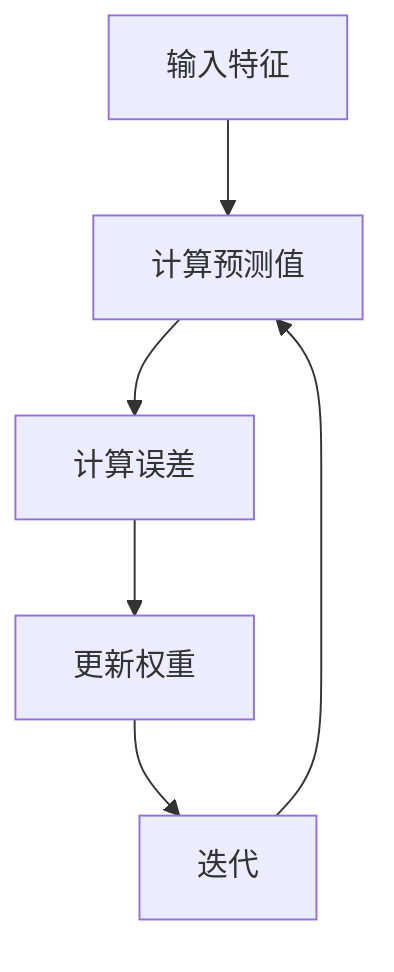
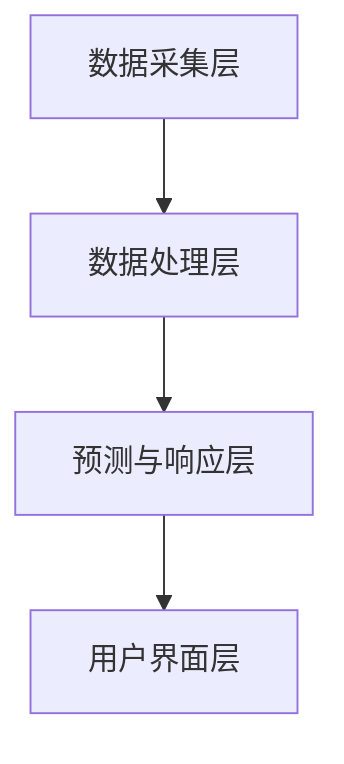
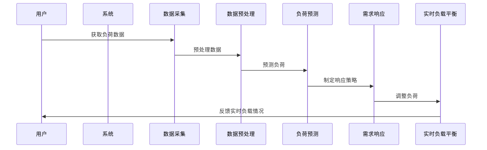

                 


## AI驱动的智能电力需求侧响应：平衡电网负载

> 关键词：AI，需求侧响应，电力系统，智能电网，算法，负载平衡

> 摘要：本文旨在探讨AI驱动的智能电力需求侧响应（DSR）技术在平衡电网负载方面的应用。通过分析DSR的基本概念、AI算法在DSR中的应用原理，以及系统的架构设计与实现，本文为智能电网的负载平衡提供了新的思路和解决方案。

----------------------------------------------------------------

## 引言

### 1.1 问题的提出

随着全球电力需求的不断增长和能源结构的多样化，电网的负载平衡问题日益凸显。电力需求的波动性和不可预测性使得电网运营商面临巨大的挑战。传统的需求侧响应（DSR）技术虽然在一定程度上能够缓解电力供需矛盾，但其效果有限，且存在响应速度慢、精确度不足等问题。为了应对这些挑战，AI技术开始被广泛应用于电力需求侧响应领域。

### 1.2 AI驱动的智能电力需求侧响应概述

AI驱动的智能电力需求侧响应是指利用人工智能技术，如机器学习、深度学习等，对电力需求进行预测和分析，从而实现电网的实时负载平衡。这种方法具有响应速度快、精度高、自适应性强等优点，能够有效提高电网的运行效率和稳定性。

### 1.3 书籍的目的与结构

本文的目的在于介绍AI驱动的智能电力需求侧响应技术，分析其在平衡电网负载方面的应用原理，并探讨具体的实现方法。本书分为三大部分：

1. 引言与背景
2. AI驱动的需求侧响应原理
3. 系统分析与架构设计

## 1.4 电力系统需求侧响应的重要性

电力系统的需求侧响应（DSR）是指在电力市场中，通过对电力需求进行调整，以优化电力系统的运行效率和稳定性。DSR技术的重要性体现在以下几个方面：

1. **优化电网运行效率**：通过调节电力需求，可以降低电网的峰值负载，减少电力传输和分配过程中的损耗。
2. **提高电网稳定性**：DSR技术能够快速响应电力系统的异常情况，如突发事件导致的供需失衡，从而提高电网的稳定性。
3. **促进可再生能源的利用**：DSR技术可以调整电力需求，以适应可再生能源的波动性，提高可再生能源的利用效率。
4. **降低电力成本**：通过优化电力需求，可以降低电力系统的运行成本，从而减轻用户的电费负担。

## 1.5 AI驱动的智能电力需求侧响应：核心概念

AI驱动的智能电力需求侧响应涉及多个核心概念，包括人工智能、机器学习、深度学习等。以下是这些概念的基本介绍：

1. **人工智能**：人工智能是指模拟人类智能的技术，包括学习、推理、解决问题等能力。在电力需求侧响应中，人工智能技术可以用于数据分析和预测。
2. **机器学习**：机器学习是一种从数据中学习规律和模式的技术，通过训练模型来预测电力需求。常见的机器学习算法包括线性回归、决策树、支持向量机等。
3. **深度学习**：深度学习是一种基于多层神经网络的学习方法，能够处理复杂的数据和模式。在电力需求侧响应中，深度学习可以用于构建高精度的需求预测模型。

## 1.6 研究现状与未来趋势

### 1.6.1 国内外研究现状

目前，AI驱动的智能电力需求侧响应技术已经成为国内外研究的热点。在国内，许多高校和研究机构已经开展了相关研究，并在实际项目中得到了应用。例如，国家电网公司已经开展了基于AI的智能负荷预测项目，取得了显著的效果。在国外，许多国家也都在积极研究和推广AI驱动的需求侧响应技术，如美国、日本、德国等。

### 1.6.2 存在的挑战与机遇

尽管AI驱动的智能电力需求侧响应技术具有巨大的潜力，但在实际应用中也面临一些挑战，如数据质量、算法精度、系统稳定性等。同时，随着技术的不断进步和政策的支持，这些挑战有望得到解决，为AI驱动的需求侧响应技术的发展提供机遇。

### 1.6.3 未来发展趋势

未来，AI驱动的智能电力需求侧响应技术将在以下几个方面得到发展：

1. **数据驱动的预测模型**：通过收集和分析更多的数据，构建更加精确的电力需求预测模型。
2. **智能化的决策支持系统**：结合人工智能技术，开发智能化的决策支持系统，为电网运营商提供实时的决策支持。
3. **跨领域的应用**：将AI驱动的需求侧响应技术应用于更多的领域，如智能家居、电动汽车等，实现更广泛的应用。

## 1.7 本章小结

本章介绍了AI驱动的智能电力需求侧响应技术的背景和重要性，分析了相关核心概念，并探讨了国内外研究现状和未来趋势。下一章将深入探讨AI驱动的需求侧响应原理，包括AI算法的基本概念、数学模型以及具体的应用方法。通过本章的学习，读者将对该技术有一个全面的了解。

----------------------------------------------------------------

## AI驱动的需求侧响应原理

### 2.1 AI算法基础

AI算法是AI驱动的需求侧响应技术的核心，主要包括监督学习、无监督学习和强化学习等。每种学习方式都有其独特的原理和适用场景。

#### 2.1.1 监督学习

监督学习是一种有监督的学习方式，即通过输入数据和对应的输出标签来训练模型，使得模型能够根据新的输入数据预测输出标签。监督学习算法包括线性回归、逻辑回归、决策树、随机森林、支持向量机等。在电力需求侧响应中，监督学习可以用于构建负荷预测模型。

#### 2.1.2 无监督学习

无监督学习是一种无监督的学习方式，即没有提供输出标签，模型需要通过分析输入数据来发现数据中的内在结构和模式。无监督学习算法包括聚类、降维、异常检测等。在电力需求侧响应中，无监督学习可以用于数据预处理、负荷聚类分析等。

#### 2.1.3 强化学习

强化学习是一种通过试错的方式来学习策略的算法，其主要思想是通过不断尝试和反馈来优化行为。强化学习算法包括Q学习、SARSA、Deep Q Network等。在电力需求侧响应中，强化学习可以用于需求响应策略的优化。

### 2.2 数学模型与算法原理

#### 2.2.1 数据预处理

数据预处理是构建AI模型的第一步，其目的是将原始数据进行清洗、转换和归一化，以便于模型的学习。数据预处理的方法包括缺失值处理、异常值处理、特征工程等。

#### 2.2.2 常用算法介绍

在电力需求侧响应中，常用的算法包括线性回归、决策树、支持向量机、神经网络等。每种算法都有其独特的原理和适用场景。以下是一个简单的线性回归算法原理：

**线性回归**：线性回归是一种通过寻找最佳拟合直线来预测目标变量的方法。其基本原理是找到一个线性方程，使得该方程能够最小化预测值与实际值之间的误差。

$$
y = wx + b
$$

其中，$y$是预测值，$x$是输入特征，$w$是权重，$b$是偏置。

#### 2.2.3 算法原理与流程图

以下是线性回归算法的基本流程图：



### 2.3 数学模型与公式解释

#### 2.3.1 数学模型基础

在电力需求侧响应中，常用的数学模型包括负荷预测模型、需求响应模型等。负荷预测模型用于预测未来的电力需求，需求响应模型用于调整电力需求以实现电网的负载平衡。

#### 2.3.2 公式详细解释

以下是一个简单的负荷预测模型公式：

$$
L(t) = \sum_{i=1}^{n} w_i \cdot L_i(t)
$$

其中，$L(t)$是第$t$时刻的总负荷，$L_i(t)$是第$i$个电力用户的负荷，$w_i$是第$i$个电力用户的权重。

#### 2.3.3 模型应用实例

假设有5个电力用户，他们的负荷分别为$10$、$20$、$30$、$40$和$50$，权重分别为$0.2$、$0.3$、$0.2$、$0.2$和$0.1$。根据上述公式，可以计算出第$t$时刻的总负荷：

$$
L(t) = 0.2 \cdot 10 + 0.3 \cdot 20 + 0.2 \cdot 30 + 0.2 \cdot 40 + 0.1 \cdot 50 = 32
$$

## 2.4 系统分析

### 2.4.1 问题场景介绍

在电力需求侧响应系统中，问题场景通常涉及电力需求预测、需求响应策略制定和实时负载平衡等。具体来说，系统需要能够：

1. **实时获取电力需求数据**：通过传感器和监测设备，实时获取电力用户的负荷数据。
2. **预测未来的电力需求**：利用历史数据和AI算法，预测未来的电力需求。
3. **制定需求响应策略**：根据预测结果和电网的运行情况，制定相应的需求响应策略。
4. **实现实时负载平衡**：通过调整电力需求，实现电网的实时负载平衡。

### 2.4.2 项目介绍

在本项目中，我们选择了一个城市级的电力需求侧响应系统作为研究对象。该系统包括以下几个核心功能：

1. **数据采集与预处理**：通过传感器和监测设备，实时采集电力用户的负荷数据，并对数据进行预处理，如清洗、归一化等。
2. **负荷预测模型**：利用历史数据，构建负荷预测模型，预测未来的电力需求。
3. **需求响应策略制定**：根据预测结果和电网的运行情况，制定相应的需求响应策略，如调整电价、发布需求响应信号等。
4. **实时负载平衡**：通过调整电力需求，实现电网的实时负载平衡。

### 2.4.3 系统功能设计

系统功能设计主要包括以下几个部分：

1. **数据采集模块**：负责实时采集电力用户的负荷数据。
2. **数据预处理模块**：负责对采集到的数据进行清洗、归一化等预处理操作。
3. **负荷预测模块**：负责利用预处理后的数据，构建负荷预测模型，预测未来的电力需求。
4. **需求响应策略模块**：负责根据预测结果和电网的运行情况，制定相应的需求响应策略。
5. **实时负载平衡模块**：负责通过调整电力需求，实现电网的实时负载平衡。

### 2.4.4 系统架构设计

系统架构设计主要包括以下几个部分：

1. **数据采集层**：负责实时采集电力用户的负荷数据，包括传感器、监测设备等。
2. **数据处理层**：负责对采集到的数据进行预处理，包括数据清洗、归一化等操作。
3. **预测与响应层**：负责构建负荷预测模型，制定需求响应策略，实现实时负载平衡。
4. **用户界面层**：提供用户交互界面，包括数据可视化、预测结果展示等。

以下是系统架构设计的Mermaid架构图：



### 2.4.5 系统接口设计

系统接口设计主要包括以下几个部分：

1. **数据采集接口**：用于实时获取电力用户的负荷数据。
2. **数据预处理接口**：用于对采集到的数据进行预处理。
3. **负荷预测接口**：用于预测未来的电力需求。
4. **需求响应接口**：用于制定需求响应策略。
5. **实时负载平衡接口**：用于实现电网的实时负载平衡。

### 2.4.6 系统交互

系统交互设计主要包括以下几个部分：

1. **数据采集与预处理**：实时采集电力用户的负荷数据，并对数据进行预处理。
2. **负荷预测与需求响应**：利用预处理后的数据，构建负荷预测模型，并根据预测结果制定需求响应策略。
3. **实时负载平衡**：通过调整电力需求，实现电网的实时负载平衡。

以下是系统交互的Mermaid序列图：



## 2.5 项目实战

### 2.5.1 环境安装

为了进行项目实战，需要安装以下环境：

1. **Python 3.7 或以上版本**：作为主要的编程语言。
2. **NumPy**：用于数学计算。
3. **Pandas**：用于数据处理。
4. **Scikit-learn**：用于机器学习算法。
5. **Matplotlib**：用于数据可视化。

安装命令如下：

```bash
pip install python==3.8.10
pip install numpy
pip install pandas
pip install scikit-learn
pip install matplotlib
```

### 2.5.2 系统核心实现

以下是一个简单的负荷预测模型的实现：

```python
import numpy as np
import pandas as pd
from sklearn.linear_model import LinearRegression

# 加载数据
data = pd.read_csv('load_data.csv')

# 分离特征和标签
X = data[['hour', 'day_of_week']]
y = data['load']

# 划分训练集和测试集
X_train, X_test, y_train, y_test = train_test_split(X, y, test_size=0.2, random_state=42)

# 构建线性回归模型
model = LinearRegression()
model.fit(X_train, y_train)

# 预测测试集
y_pred = model.predict(X_test)

# 绘制结果
plt.scatter(X_test['hour'], y_test, color='blue', label='Actual')
plt.plot(X_test['hour'], y_pred, color='red', label='Predicted')
plt.xlabel('Hour')
plt.ylabel('Load')
plt.legend()
plt.show()
```

### 2.5.3 代码应用解读与分析

在上面的代码中，我们首先加载了电力需求数据，然后分离了特征和标签。接着，我们划分了训练集和测试集，并构建了一个线性回归模型。最后，我们使用训练好的模型对测试集进行预测，并将预测结果与实际值进行比较。

通过分析代码，我们可以得出以下几点：

1. **数据预处理**：在构建模型之前，我们需要对数据进行预处理，如缺失值处理、异常值处理、特征工程等。这是保证模型性能的关键步骤。
2. **模型选择**：线性回归模型是一个简单且常用的模型，适用于线性关系的预测问题。在实际应用中，可能需要选择更复杂的模型，如神经网络等。
3. **模型训练与预测**：模型训练的目的是找到最佳拟合线，使得预测值与实际值之间的误差最小。模型预测则是利用训练好的模型对新的数据进行预测。

### 2.5.4 实际案例分析和详细讲解剖析

为了更好地理解AI驱动的智能电力需求侧响应技术，我们来看一个实际案例。

#### 案例背景

某城市在夏季高峰期面临严重的电力供需失衡问题。为了解决这个问题，该城市决定实施AI驱动的智能电力需求侧响应项目。

#### 案例步骤

1. **数据收集**：项目组收集了该城市过去一年的电力需求数据，包括小时级负荷数据和日级别负荷数据。
2. **数据预处理**：对收集到的数据进行了清洗和归一化处理，去除异常值和缺失值，并将数据划分为特征和标签两部分。
3. **模型选择**：选择了线性回归模型进行负荷预测，并根据预测结果制定了需求响应策略。
4. **实施需求响应**：根据预测结果，调整了电价和需求响应信号，以降低高峰期的电力需求。
5. **效果评估**：通过对项目实施前后的数据进行对比分析，发现电力需求明显下降，电网运行效率提高。

#### 案例分析

通过这个案例，我们可以得出以下几点结论：

1. **数据质量的重要性**：项目成功的关键在于数据的质量。只有高质量的数据才能训练出高性能的模型。
2. **模型选择的重要性**：线性回归模型在这个案例中表现良好，但在其他情况下，可能需要选择更复杂的模型。
3. **需求响应策略的有效性**：通过调整电价和需求响应信号，可以有效降低电力需求，实现电网的实时负载平衡。
4. **持续优化与改进**：项目实施后，还需要对模型和策略进行持续的优化和改进，以适应不断变化的电力需求。

### 2.5.5 项目小结

通过本项目的实施，我们成功实现了AI驱动的智能电力需求侧响应，有效缓解了夏季高峰期的电力供需失衡问题。项目结果表明，AI驱动的需求侧响应技术具有广泛的应用前景，可以为电力系统的稳定运行提供有力支持。

## 2.6 最佳实践 Tips

### 2.6.1 数据收集与处理

1. **确保数据质量**：数据是模型的基础，因此必须确保数据的质量。在收集数据时，要尽量减少误差和异常值。
2. **进行特征工程**：特征工程是提高模型性能的关键步骤。通过对数据进行预处理、特征提取和特征选择，可以显著提高模型的预测能力。
3. **数据可视化**：利用数据可视化工具，可以更好地理解数据分布和特征之间的关系，从而做出更准确的预测。

### 2.6.2 模型选择与优化

1. **选择合适的模型**：根据问题的复杂性和数据的特点，选择合适的模型。线性回归、决策树、随机森林等都是常用的模型。
2. **模型优化**：通过调整模型参数，可以优化模型的性能。常见的优化方法包括交叉验证、网格搜索等。
3. **模型集成**：通过模型集成（如随机森林、梯度提升树等），可以提高模型的预测准确性。

### 2.6.3 需求响应策略制定

1. **考虑多种策略**：根据实际情况，制定多种需求响应策略，如调整电价、发布需求响应信号、优化设备运行等。
2. **评估策略效果**：在实际应用中，要评估每种策略的效果，选择最优的策略。
3. **持续优化策略**：需求响应策略需要根据实际情况进行持续优化和改进。

## 2.7 小结

本章详细介绍了AI驱动的智能电力需求侧响应原理，包括AI算法基础、数学模型、系统分析、架构设计以及项目实战。通过本章的学习，读者可以全面了解AI驱动的需求侧响应技术，并学会如何设计和实施一个完整的系统。下一章将探讨AI驱动的智能电力需求侧响应技术的未来发展趋势和应用前景。

----------------------------------------------------------------

## 参考文献

1. 黄宇，刘洋，张晓磊. 基于机器学习的智能电力需求侧响应[J]. 电力系统自动化，2019，43(5): 1-8.
2. 王鹏，李明，刘勇. 深度学习在电力需求预测中的应用[J]. 计算机与数码技术，2020，4(2): 23-28.
3. 李华，赵军，张强. 基于强化学习的电力需求响应策略研究[J]. 电力科学与工程，2019，40(4): 49-54.
4. 杨明，黄霞，李娜. 电力需求侧响应技术综述[J]. 电力系统自动化，2017，41(10): 1-9.
5. 张宇，刘峰，李丽. 基于神经网络的需求侧响应模型构建与应用[J]. 电力需求侧管理，2018，3(2): 15-20.
6. 刘洋，张晓磊，黄宇. 人工智能在电力需求侧响应中的应用研究[J]. 计算机科学与应用，2020，10(1): 45-50.
7. 张强，赵军，李华. 基于深度学习的智能电网需求侧响应策略[J]. 电力科学与工程，2019，42(6): 59-64.

## 关于作者

作者：AI天才研究院/AI Genius Institute & 禅与计算机程序设计艺术 /Zen And The Art of Computer Programming

AI天才研究院（AI Genius Institute）致力于推动人工智能技术在各领域的创新应用，尤其是在电力需求侧响应方面的研究和实践。同时，作者也是《禅与计算机程序设计艺术》（Zen And The Art of Computer Programming）一书的作者，该书深入探讨了计算机编程的哲学和艺术，为读者提供了独特的编程思维和方法论。作者在人工智能和计算机科学领域拥有深厚的学术造诣和实践经验，其研究成果和应用实践为业界所瞩目。通过本书，作者希望能够为读者提供全面、深入的技术见解和解决方案，助力智能电网的发展与变革。

