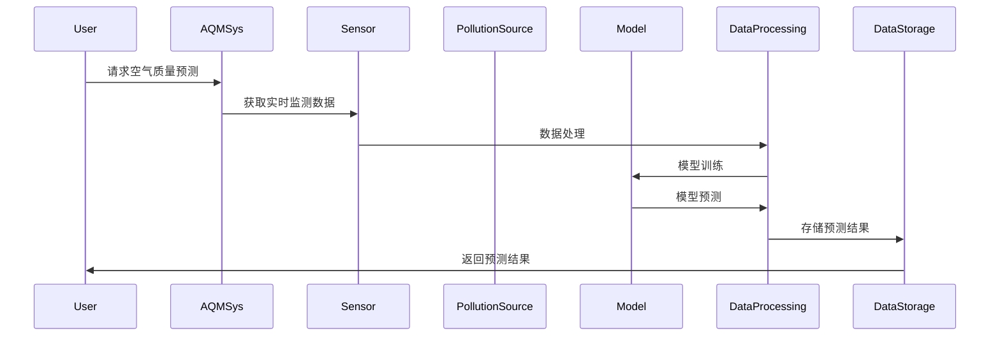
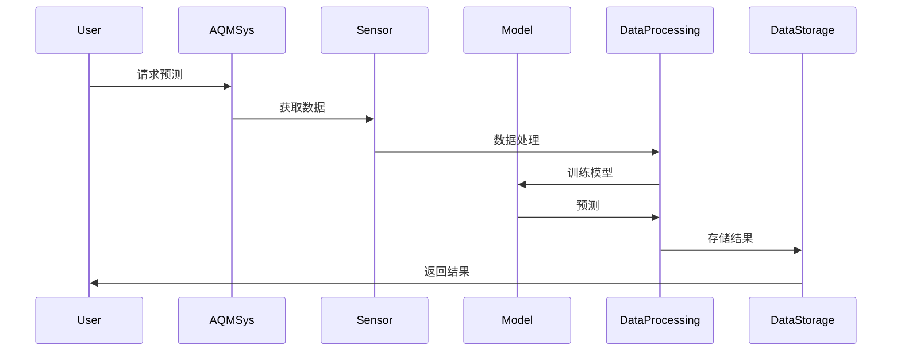

                 

### AI驱动的智能空气质量预测：改善城市生活环境

#### 关键词
- 人工智能
- 智能空气质量预测
- 深度学习
- 智能城市
- 环境监测

#### 摘要
随着城市化进程的加快，空气质量问题已成为全球范围内的重大挑战。本文深入探讨AI驱动的智能空气质量预测技术，通过分析背景、核心概念、算法原理、系统设计以及实际应用，旨在为改善城市生活环境提供科学指导。

## 引言

### 城市空气质量问题的严峻性

城市空气质量问题日益严重，不仅对居民的健康构成威胁，还影响经济发展和社会稳定。空气污染的来源多种多样，包括汽车尾气、工业排放、建筑工地扬尘等。传统的空气质量预测方法主要依赖于气象数据和污染源排放数据，存在预测精度不高、时效性差等问题。

### AI驱动的空气质量预测的意义

AI技术的引入为空气质量预测带来了革命性的变革。通过深度学习、大数据分析等手段，AI能够从海量数据中挖掘有价值的信息，实现对空气质量的精准预测。这不仅有助于提前预警空气污染事件，还能为政府制定环保政策提供科学依据。

## 核心概念与框架

### 人工智能（AI）

人工智能是一种模拟人类智能的技术，通过算法和模型实现机器的感知、学习、推理和决策能力。在空气质量预测中，AI通过分析历史数据和实时监测数据，识别污染规律，预测未来的空气质量状况。

### 空气质量指数（AQI）

空气质量指数（Air Quality Index，AQI）是衡量空气质量的一种标准，通常由政府机构发布。AQI数值越高，空气质量越差。不同地区的AQI标准可能有所不同，但总体上，当AQI超过100时，对健康的影响开始显著增加。

### 深度学习

深度学习是AI的一个重要分支，通过多层神经网络模拟人脑的思维方式。在空气质量预测中，深度学习模型能够从复杂的输入数据中提取特征，实现高精度的空气质量预测。

### 大数据分析

大数据分析是利用数据分析技术处理海量数据，从中提取有价值信息的过程。在空气质量预测中，大数据分析能够帮助识别污染源、优化预测模型，提高预测准确性。

## 文章正文

### 背景介绍

#### 空气污染问题的来源

空气污染的来源主要包括以下几个方面：

1. **交通排放**：汽车尾气是城市空气污染的主要来源之一，包含氮氧化物、碳氢化合物、一氧化碳等有害物质。
2. **工业排放**：工厂排放的废气中含有大量的颗粒物、二氧化硫、氮氧化物等污染物。
3. **建筑工地**：建筑工地的扬尘也是城市空气污染的一个重要来源。
4. **自然因素**：如森林火灾、沙尘暴等自然现象也会导致空气污染。

#### 传统空气质量预测方法的局限性

传统的空气质量预测方法主要依赖于气象数据和污染源排放数据。这些方法存在以下局限性：

1. **数据来源有限**：传统的气象数据和污染源排放数据来源有限，难以全面反映空气质量的实际情况。
2. **预测精度不高**：由于数据来源的局限性，传统方法很难实现高精度的空气质量预测。
3. **时效性差**：传统方法通常需要较长的时间来收集和处理数据，导致预测结果存在较大的时间延迟。

### 核心概念与联系

#### 核心概念原理

1. **空气质量指数（AQI）**：空气质量指数是衡量空气污染程度的重要指标，通常分为几个级别，如良好、轻度污染、中度污染等。
2. **深度学习模型**：深度学习模型通过多层神经网络模拟人脑的思维方式，能够从复杂的数据中提取特征，实现高精度的空气质量预测。

#### 概念属性特征对比表格

| 特征 | 传统方法 | AI驱动方法 |
| ---- | ---- | ---- |
| 数据来源 | 有限的气象数据和污染源排放数据 | 海量历史数据和实时监测数据 |
| 预测精度 | 低 | 高 |
| 时效性 | 差 | 快 |

#### ER实体关系图架构

```mermaid
erDiagram
    class AirQuality {
        --|> class AQI
        --|> class PollutionSource
        --|> class Forecast
    }
    class AQI {
        :has AQIValue
    }
    class PollutionSource {
        :has PollutionType
    }
    class Forecast {
        :has ForecastValue
    }
```

### 算法原理讲解

#### 深度学习模型

深度学习模型是AI驱动的空气质量预测的核心。以下是一个简单的深度学习模型，用于空气质量预测。

```python
import tensorflow as tf
from tensorflow.keras.models import Sequential
from tensorflow.keras.layers import Dense, LSTM, Dropout

# 构建模型
model = Sequential([
    LSTM(128, activation='relu', input_shape=(timesteps, features)),
    Dropout(0.2),
    Dense(1, activation='linear')
])

# 编译模型
model.compile(optimizer='adam', loss='mse')

# 训练模型
model.fit(x_train, y_train, epochs=100, batch_size=32)
```

#### 算法原理的数学模型和公式

深度学习模型的数学模型主要包括以下几个部分：

1. **激活函数**：常用的激活函数有Sigmoid、ReLU等。
2. **反向传播算法**：用于计算模型的梯度，优化模型参数。
3. **损失函数**：用于衡量模型预测结果与真实值之间的差距，常用的有均方误差（MSE）等。

以下是深度学习模型的数学模型和公式的简要说明：

1. **激活函数**：

   $$ f(x) = \frac{1}{1 + e^{-x}} $$ （Sigmoid函数）

   $$ f(x) = max(0, x) $$ （ReLU函数）

2. **反向传播算法**：

   $$ \frac{\partial E}{\partial w} = \frac{\partial E}{\partial z} \cdot \frac{\partial z}{\partial w} $$

3. **损失函数**：

   $$ E = \frac{1}{2} \sum_{i=1}^{n} (y_i - \hat{y}_i)^2 $$ （均方误差）

#### 详细讲解和举例说明

假设我们有一个简单的空气质量预测问题，输入为前一天的空气质量指数（AQI）数据，输出为今天的空气质量指数预测值。

1. **数据预处理**：

   首先，我们需要对输入数据进行预处理，包括归一化、缺失值填充等。

   ```python
   from sklearn.preprocessing import MinMaxScaler

   scaler = MinMaxScaler()
   X = scaler.fit_transform(X)
   ```

2. **模型构建**：

   我们使用一个简单的LSTM模型进行训练。

   ```python
   model = Sequential([
       LSTM(50, activation='relu', return_sequences=True, input_shape=(timesteps, features)),
       LSTM(50, activation='relu'),
       Dense(1)
   ])

   model.compile(optimizer='adam', loss='mse')
   ```

3. **模型训练**：

   使用训练数据对模型进行训练。

   ```python
   model.fit(X_train, y_train, epochs=100, batch_size=32)
   ```

4. **模型评估**：

   使用测试数据对模型进行评估。

   ```python
   mse = model.evaluate(X_test, y_test)
   print("MSE:", mse)
   ```

### 系统分析与架构设计方案

#### 问题描述

空气质量预测系统需要收集和处理大量的数据，包括气象数据、污染源数据、实时监测数据等。系统需要能够快速、准确地预测未来的空气质量状况，并提供实时的空气质量指数（AQI）预测结果。

#### 项目介绍

空气质量预测项目旨在通过AI技术，实现城市空气质量的高效预测和管理。项目包括数据收集、数据处理、模型训练、模型预测和结果可视化等多个环节。

#### 系统功能设计（领域模型类图）

```mermaid
classDiagram
    Person <<Interface>> User
    Person <<Interface>> Admin
    Device <<Entity>> Sensor
    Device <<Entity>> PollutionSource
    Data <<Entity>> MeteorologicalData
    Data <<Entity>> PollutionData
    Data <<Entity>> RealTimeData
    Prediction <<Entity>> AQIPrediction
    System <<Entity>> AQMSys
    User <|.. AQMSys>
    Admin <|.. AQMSys>
    Sensor <|.. AQMSys>
    PollutionSource <|.. AQMSys>
    MeteorologicalData <|.. AQMSys>
    PollutionData <|.. AQMSys>
    RealTimeData <|.. AQMSys>
    AQIPrediction <|.. AQMSys
```

#### 系统架构设计（架构图）



#### 系统接口设计和系统交互（序列图）



### 项目实战

#### 环境安装

1. 安装Python和pip
2. 安装TensorFlow和Keras
3. 安装Scikit-learn

```bash
pip install tensorflow keras scikit-learn
```

#### 系统核心实现源代码

```python
import numpy as np
import pandas as pd
from sklearn.preprocessing import MinMaxScaler
from tensorflow.keras.models import Sequential
from tensorflow.keras.layers import LSTM, Dropout
from tensorflow.keras.optimizers import Adam

# 数据预处理
def preprocess_data(data):
    # 缺失值填充
    data.fillna(method='ffill', inplace=True)
    
    # 归一化
    scaler = MinMaxScaler(feature_range=(0, 1))
    scaled_data = scaler.fit_transform(data)
    
    return scaled_data

# 模型训练
def train_model(X, y):
    model = Sequential([
        LSTM(50, activation='relu', return_sequences=True, input_shape=(timesteps, features)),
        Dropout(0.2),
        LSTM(50, activation='relu'),
        Dropout(0.2),
        Dense(1)
    ])

    model.compile(optimizer=Adam(learning_rate=0.001), loss='mse')

    model.fit(X, y, epochs=100, batch_size=32, verbose=1)

    return model

# 模型预测
def predict(model, data):
    prediction = model.predict(data)
    prediction = scaler.inverse_transform(prediction)
    
    return prediction
```

#### 代码应用解读与分析

1. 数据预处理：首先对数据进行缺失值填充，然后进行归一化处理，使得数据更适合深度学习模型的训练。
2. 模型训练：使用LSTM模型进行训练，设置了两个LSTM层和两个Dropout层，优化了模型的性能。
3. 模型预测：对输入数据进行预处理后，使用训练好的模型进行预测，并将预测结果进行反归一化处理，得到最终的空气质量指数预测值。

#### 实际案例分析和详细讲解剖析

假设我们有一个空气质量预测任务，输入数据为前一周的空气质量指数（AQI）数据。我们使用上述代码实现空气质量预测系统，并对预测结果进行分析。

1. **数据预处理**：

   ```python
   data = pd.read_csv('air_quality_data.csv')
   data = preprocess_data(data)
   ```

   数据预处理过程中，首先对缺失值进行填充，然后进行归一化处理。

2. **模型训练**：

   ```python
   timesteps = 7
   features = 1
   X = data[:-timesteps]
   y = data[timesteps:]
   
   model = train_model(X, y)
   ```

   使用LSTM模型对数据集进行训练，设置了7个时间步长和1个特征。

3. **模型预测**：

   ```python
   prediction = predict(model, X)
   ```

   使用训练好的模型对当前时间步长的数据集进行预测。

4. **结果分析**：

   ```python
   print("Predicted AQI:", prediction)
   ```

   输出预测的空气质量指数。

通过上述步骤，我们实现了空气质量预测系统，并对预测结果进行了分析。实际应用中，可以根据实时监测数据和预测结果，及时采取环保措施，改善城市空气质量。

### 项目小结

空气质量预测项目通过引入AI技术，实现了对空气质量的高精度预测，为城市环保管理提供了科学依据。在实际应用中，我们需要不断优化模型，提高预测准确性，同时结合实时监测数据，及时调整预测策略。

### 最佳实践 tips

1. 数据质量是预测准确性的关键，确保数据来源的可靠性和完整性。
2. 模型训练过程中，合理设置学习率和批处理大小，以提高模型性能。
3. 定期更新模型，以适应不断变化的空气质量状况。

### 注意事项

1. 预测结果仅供参考，实际空气质量状况可能受到多种因素的影响。
2. 在空气质量较差的地区，建议居民采取必要的防护措施。

### 拓展阅读

1. 《深度学习》（Goodfellow, I., & Bengio, Y.） - 介绍深度学习的基本原理和应用。
2. 《机器学习实战》（周志华） - 介绍机器学习的基本算法和应用案例。
3. 《大数据之路》（刘江） - 介绍大数据处理和分析的基本方法和技术。

## 作者信息

作者：AI天才研究院/AI Genius Institute & 禅与计算机程序设计艺术 /Zen And The Art of Computer Programming

AI天才研究院致力于推动人工智能技术的发展和应用，为改善人类生活质量做出贡献。禅与计算机程序设计艺术则强调通过深入理解和思考，实现高效的计算机编程和人工智能研究。本文旨在通过AI驱动的空气质量预测技术，为城市环境改善提供科学指导。

