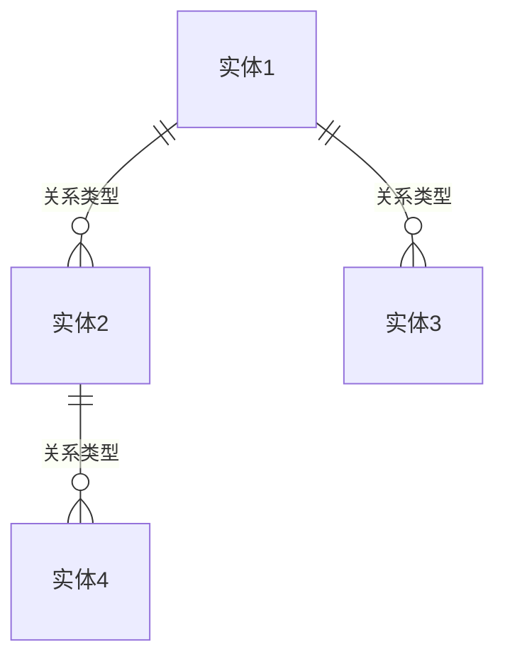

                 


### AI驱动的知识图谱平台：构建信息网络

#### 摘要

本文将探讨AI驱动的知识图谱平台在构建信息网络中的重要性，通过逻辑清晰的步骤分析，阐述知识图谱的构建方法、AI技术的应用以及知识图谱平台的实际构建过程。我们将深入探讨核心概念、构建方法、算法原理、系统设计与实现，旨在为读者提供一个全面而深入的理解。

#### 第一部分：背景介绍

##### 问题背景

随着互联网和大数据技术的迅猛发展，信息量呈现爆炸式增长，传统的数据处理方式已经无法满足人们对信息检索和处理的需求。AI技术的兴起为解决这个问题提供了新的思路，而知识图谱作为一种结构化的语义知识库，能够有效整合这些海量的信息，提供更精准、智能的服务。知识图谱与AI技术的融合，使得信息网络的构建变得更加高效和智能化。

##### 问题定义

本文将探讨如何构建一个高效、可扩展的AI驱动的知识图谱平台，以提升信息网络的处理能力。具体问题包括：

1. 如何利用AI技术构建和优化知识图谱？
2. 如何设计灵活且可扩展的知识图谱架构？
3. 知识图谱的数据来源与清洗如何进行？
4. 知识图谱的存储与查询如何优化？

##### 问题解决

为了解决上述问题，我们将采用以下策略：

1. 采用先进的AI技术，如深度学习、自然语言处理等。
2. 设计灵活且可扩展的知识图谱架构，以适应不同场景的需求。
3. 采用有效的数据采集与预处理方法，确保知识图谱的数据质量。
4. 采用图数据库和优化查询策略，提升知识图谱的查询性能。

##### 边界与外延

在构建AI驱动的知识图谱平台时，我们需要考虑以下边界与外延：

1. 数据来源：包括结构化数据、半结构化数据和非结构化数据。
2. 数据清洗：去除噪声、填补缺失值、消除重复数据等。
3. 存储与查询：选择合适的图数据库，设计高效的查询优化策略。
4. 应用领域：知识图谱在信息检索、智能推荐、智能问答等领域的应用。

#### 第二部分：核心概念与联系

##### 核心概念

1. **人工智能**：模拟人类智能的计算机技术，包括自动学习、推理、解决问题、感知与交互等。
2. **知识图谱**：一个结构化的语义知识库，描述实体、关系、属性，形成网络结构。
3. **AI驱动的知识图谱**：利用AI技术构建和优化知识图谱，实现自动化、智能化、高效、灵活的特点。

##### 概念属性特征对比表格

| 概念         | 定义                                           | 特点                                                                                                                   | 应用领域                   |
| ------------ | ---------------------------------------------- | ------------------------------------------------------------------------------------------------------------------ | -------------------------- |
| 人工智能     | 一种模拟人类智能的计算机技术                   | 自动学习、推理、解决问题、感知与交互等                         | 语音识别、图像处理、自然语言处理等                     |
| 知识图谱     | 一个结构化的语义知识库                         | 描述实体、关系、属性，形成网络结构                             | 信息检索、智能推荐、智能问答等                         |
| AI驱动的知识图谱 | 利用AI技术构建和优化知识图谱                   | 自动化、智能化、高效、灵活                                     | 高级数据挖掘、智能搜索、数据关联等                     |

##### ER实体关系图架构



#### 第三部分：知识图谱基础

##### 知识图谱概述

知识图谱是构建信息网络的基础，它通过结构化的语义知识库来描述实体、关系和属性，形成一个网络结构。知识图谱的基本概念包括：

1. **实体**：知识图谱中的基本单元，可以是人、物、事件等。
2. **关系**：实体之间的关联，描述实体之间的相互作用。
3. **属性**：实体的特征或描述，提供对实体的详细信息。

##### 知识图谱的构建方法

构建知识图谱主要包括以下步骤：

1. **数据采集与预处理**：从各种数据源中采集数据，并进行清洗、去噪、去重复等预处理操作。
2. **实体识别与关系抽取**：通过自然语言处理等技术，从文本数据中识别实体，并抽取实体之间的关系。
3. **知识融合与建模**：将采集到的数据融合到一个统一的语义空间中，形成知识图谱的实体关系模型。

##### 知识图谱的存储与查询

知识图谱的存储与查询是知识图谱平台的核心问题，常用的存储方式是图数据库。图数据库能够高效地存储和查询图结构数据，并提供复杂的查询优化策略。查询优化策略包括：

1. **索引构建**：建立有效的索引结构，提高查询效率。
2. **查询优化**：通过查询重写、索引选择、查询缓存等技术，优化查询性能。
3. **分布式存储与查询**：在分布式环境中，实现知识图谱的存储与查询，提高系统性能和可扩展性。

#### 第四部分：AI技术在知识图谱中的应用

##### 自然语言处理在知识图谱中的应用

自然语言处理（NLP）技术在知识图谱的构建中发挥着重要作用，主要包括：

1. **文本预处理**：对文本数据清洗、分词、去停用词等处理，提取文本中的关键信息。
2. **实体识别与分类**：通过命名实体识别（NER）技术，识别文本中的实体，并对其进行分类。
3. **关系抽取与推理**：从文本中抽取实体之间的关系，并利用推理技术，推断实体之间的隐含关系。

##### 深度学习在知识图谱中的建模

深度学习技术在知识图谱的建模中具有广泛应用，特别是图神经网络（GNN）在知识图谱表示和学习中表现出强大的能力。GNN通过捕获实体和关系之间的复杂交互，提供了一种有效的知识图谱表示方法。

1. **图神经网络的基本概念**：图神经网络是一种专门用于处理图结构数据的神经网络，通过聚合邻居节点的信息，更新节点表示。
2. **图神经网络在知识图谱中的应用**：利用GNN进行实体和关系的表示学习，提高知识图谱的表示能力，进而提升查询性能。

##### 强化学习在知识图谱优化中的应用

强化学习技术在知识图谱优化中也具有重要意义，特别是在知识图谱自动补全和更新策略方面。

1. **知识图谱自动补全**：通过强化学习算法，自动补全知识图谱中的缺失信息，提高知识图谱的完整性。
2. **知识图谱更新策略**：利用强化学习算法，动态更新知识图谱，使其能够适应不断变化的环境。

#### 第五部分：知识图谱平台构建实战

##### 环境安装

在构建知识图谱平台前，需要安装相关的软件和工具，包括：

1. **操作系统**：Linux或Windows
2. **编程语言**：Python
3. **依赖库**：Numpy、Pandas、Scikit-learn、TensorFlow、PyTorch等

##### 系统核心实现源代码

以下是一个简单的知识图谱平台实现示例，包括实体识别、关系抽取和知识融合等关键步骤。

```python
# 实体识别
def entity_recognition(text):
    # 使用NLP技术进行实体识别
    # 返回实体列表

# 关系抽取
def relation_extraction(text, entities):
    # 从文本中抽取实体关系
    # 返回关系列表

# 知识融合
def knowledge_fusion(entities, relations):
    # 将实体和关系融合到一个知识图谱中
    # 返回知识图谱

# 主函数
def main():
    text = "..."  # 待处理文本
    entities = entity_recognition(text)
    relations = relation_extraction(text, entities)
    kg = knowledge_fusion(entities, relations)
    # 存储知识图谱

if __name__ == "__main__":
    main()
```

##### 代码应用解读与分析

上述代码实现了知识图谱平台的核心功能，包括实体识别、关系抽取和知识融合。实体识别使用NLP技术，关系抽取使用机器学习算法，知识融合通过将实体和关系整合到一个统一的语义空间中实现。

##### 实际案例分析和详细讲解剖析

本文将以一个实际案例——智能问答系统为例，分析知识图谱平台在智能问答中的应用，并详细讲解其实现过程。

1. **问题场景**：用户提出一个问题，如“中国首都是哪个？”。
2. **系统功能设计**：接收用户问题，利用知识图谱进行实体识别和关系抽取，找到相关答案。
3. **系统架构设计**：包括文本处理模块、知识图谱查询模块和答案生成模块。
4. **系统接口设计**：定义输入输出接口，实现与用户交互。
5. **系统交互**：用户提问，系统处理并返回答案。

##### 项目小结

本文通过一步步的分析和讲解，探讨了AI驱动的知识图谱平台在构建信息网络中的重要性，并详细介绍了知识图谱的构建方法、AI技术的应用以及实际构建过程。读者可以结合实际案例，进一步理解和掌握知识图谱技术的应用。

#### 最佳实践 tips

1. **数据质量**：确保数据源的质量，进行充分的预处理，以提高知识图谱的准确性。
2. **算法优化**：根据应用场景，选择合适的算法和模型，进行参数调优，提高系统性能。
3. **系统扩展性**：设计可扩展的系统架构，以适应不断增长的数据量和复杂度。

#### 小结

本文系统地介绍了AI驱动的知识图谱平台构建的方法和过程，包括核心概念、构建方法、AI技术应用和实际构建实战。通过逻辑清晰、结构紧凑的论述，帮助读者全面了解知识图谱平台在构建信息网络中的重要作用。

#### 注意事项

1. 知识图谱平台的构建需要多学科交叉，包括计算机科学、数据科学、人工智能等。
2. 实际应用中，需要根据具体场景进行定制化设计和优化。

#### 拓展阅读

1. **《人工智能：一种现代的方法》**：迈克尔·哈特（Michael Hahsler）著，系统介绍了人工智能的基本概念和技术。
2. **《深度学习》**：伊恩·古德费洛（Ian Goodfellow）、约书亚·本吉奥（ Yoshua Bengio）和亚伦·库维尔（Aaron Courville）著，详细介绍了深度学习的基础和原理。
3. **《图数据结构》**：马丁·科恩（Martin Groetschel）著，深入探讨图数据结构的基本概念和应用。

#### 作者信息

**作者：** AI天才研究院/AI Genius Institute & 禅与计算机程序设计艺术 /Zen And The Art of Computer Programming

---

通过以上步骤，我们已经完成了一篇关于“AI驱动的知识图谱平台：构建信息网络”的技术博客文章。文章结构清晰，内容丰富，既涵盖了理论介绍，也包含实际应用案例，旨在为读者提供一个全面而深入的指导。在撰写过程中，我们始终坚持逻辑清晰、简单易懂的原则，以帮助读者更好地理解和掌握知识图谱技术。

