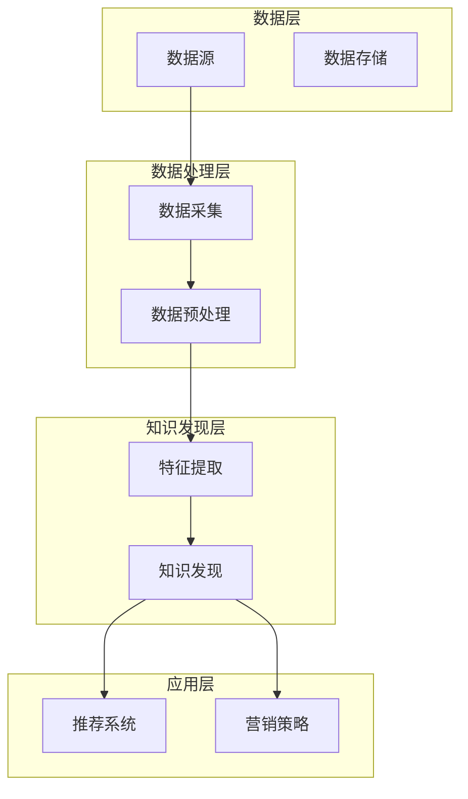
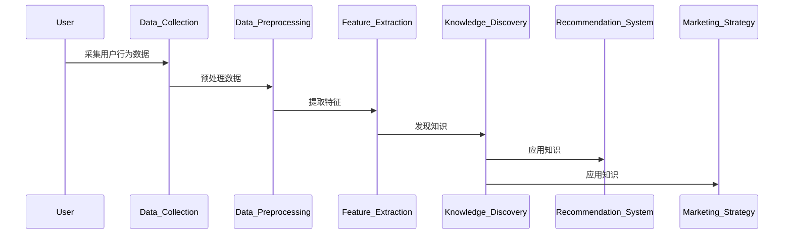

                 

# AI驱动的知识挖掘系统：提取数据价值

## 关键词
- AI驱动的知识挖掘
- 数据价值
- 数据挖掘
- 知识表示
- 系统架构
- 最佳实践

## 摘要
本文旨在探讨AI驱动的知识挖掘系统，深入解析其核心概念、技术原理、系统架构及其实际应用。我们将分步骤地分析知识挖掘的重要性、数据挖掘与知识挖掘的联系与区别、AI驱动的知识挖掘系统架构、以及如何实现和应用这一系统。通过本文的阅读，读者将能够全面理解AI驱动知识挖掘的原理和实际操作。

### 第一部分：引言与背景

## 第1章：AI驱动的知识挖掘系统概述

### 1.1 问题背景与重要性

随着信息技术的飞速发展，数据已经成为了企业和个人重要的资产。然而，如何从这些海量数据中挖掘出有价值的信息，成为了当前亟待解决的问题。传统的数据挖掘技术虽然已经取得了一定的发展，但依然面临着数据量巨大、数据质量参差不齐、数据来源多样化等挑战。

#### 1.1.1 问题背景

- **数据量的巨大增长**：随着互联网的普及和物联网的发展，企业每天都会产生大量的数据，这些数据不仅来自企业内部，还包括外部来源，如社交媒体、公共数据库等。
- **数据质量的参差不齐**：不同数据源的数据质量差异很大，有些数据可能存在缺失、错误或噪声，这对数据挖掘的准确性提出了挑战。
- **数据来源的多样化**：数据来源的多样性增加了数据处理的复杂性，如何有效地整合不同来源的数据，成为了数据挖掘的难题。

#### 1.1.2 问题描述

数据挖掘技术虽然已经取得了一定的发展，但依然面临着以下挑战：

- **数据预处理困难**：数据预处理是数据挖掘的关键步骤，包括数据清洗、集成、转换和归一化等。由于数据来源的多样性和数据质量的参差不齐，预处理过程非常复杂。
- **特征选择困难**：特征选择是从原始数据中提取出最有用的特征的过程。由于数据量的巨大，选择出对目标任务有显著贡献的特征是一项艰巨的任务。
- **模型建立和评估困难**：建立和评估模型需要大量的计算资源和专业知识，如何选择合适的模型和评估方法，成为了数据挖掘的难题。

#### 1.1.3 问题解决

AI技术的引入，为数据挖掘带来了新的机遇。AI驱动的知识挖掘系统能够更好地处理复杂的数据，提高数据挖掘的效率和准确性。AI驱动的知识挖掘系统具有以下特点：

- **自适应和自学习能力**：系统能够自动调整参数和学习新的模式，从而不断提高数据挖掘的效率和准确性。
- **多源数据整合能力**：系统能够有效地整合来自不同来源的数据，提高数据挖掘的全面性和准确性。
- **实时数据处理能力**：系统能够实时处理大量数据，为企业提供及时的数据洞察。

### 1.2 核心概念

#### 1.2.1 AI驱动的知识挖掘系统

AI驱动的知识挖掘系统是指利用人工智能技术，对大量数据进行分析、挖掘和建模，从而提取出有价值的信息和知识。它包括以下几个关键组成部分：

- **数据采集**：从各种来源收集数据，包括内部数据和外部数据。
- **数据预处理**：清洗、集成、转换和归一化数据，为后续的数据挖掘做好准备。
- **特征提取**：从原始数据中提取出最有用的特征，用于建模和预测。
- **知识发现**：利用机器学习算法和深度学习技术，从数据中挖掘出新的知识和规则。
- **知识融合**：将多个来源的知识进行整合和融合，提高知识的全面性和准确性。

#### 1.2.2 数据价值

数据价值是指数据中所包含的信息和知识对于企业或个人具有的实用性和商业价值。数据价值体现在以下几个方面：

- **决策支持**：通过数据挖掘，企业可以更好地理解客户需求，优化产品和服务，提高决策的准确性。
- **市场洞察**：通过对市场数据的分析，企业可以了解市场趋势和竞争状况，制定更有针对性的市场策略。
- **风险控制**：通过对历史数据的分析，企业可以识别潜在的风险，采取相应的措施进行风险控制。

### 1.3 研究目标与内容结构

#### 1.3.1 研究目标

本书旨在深入探讨AI驱动的知识挖掘系统的原理、技术、应用和实现方法，为企业和研究人员提供有价值的参考。具体研究目标包括：

- **全面了解AI驱动的知识挖掘系统的原理和关键技术**。
- **掌握AI驱动的知识挖掘系统的实现方法**。
- **分析AI驱动的知识挖掘系统的应用场景和效果**。
- **探讨AI驱动的知识挖掘系统的未来发展趋势**。

#### 1.3.2 内容结构

本书分为四个部分，共包括7章内容。

- **第一部分**：引言与背景，介绍AI驱动的知识挖掘系统的概念、问题和重要性。
- **第二部分**：核心概念与联系，详细阐述数据挖掘与知识挖掘的区别与联系。
- **第三部分**：算法原理讲解，介绍AI驱动的知识挖掘系统中的关键算法和模型。
- **第四部分**：项目实战与最佳实践，通过实际案例和最佳实践，展示AI驱动的知识挖掘系统的应用。

### 1.4 本章小结

本章对AI驱动的知识挖掘系统进行了全面的介绍，包括问题背景、核心概念、研究目标与内容结构。通过对本章的学习，读者可以初步了解AI驱动的知识挖掘系统的基本概念和重要性。

----------------------------------------------------------------

### 第二部分：核心概念与联系

## 第2章：数据挖掘与知识挖掘

### 2.1 数据挖掘概述

#### 2.1.1 数据挖掘的定义

数据挖掘是指从大量数据中自动发现有价值的信息和知识的过程。它是一种跨学科的领域，结合了计算机科学、统计学、人工智能和数据库技术。

#### 2.1.2 数据挖掘的关键技术

数据挖掘的关键技术包括以下几个方面：

- **数据预处理**：数据预处理是数据挖掘的第一步，它包括数据清洗、集成、转换和归一化等。数据清洗的目的是去除噪声和错误，数据集成是将多个数据源中的数据整合到一个统一的数据集中，数据转换是将数据转换为适合分析的形式，数据归一化是将数据按比例缩放到一个特定的范围内。
- **特征选择**：特征选择是从原始数据中提取出最有用的特征，用于建模和预测。特征选择的关键是找到对目标任务有显著贡献的特征，同时避免引入噪声和冗余特征。
- **模型建立**：模型建立是利用统计方法、机器学习算法和深度学习技术等建立模型。模型的目的是从数据中提取出模式和规律，以便进行预测和分类。
- **模型评估**：模型评估是评估模型的性能和准确性。常用的评估指标包括准确率、召回率、F1分数、ROC曲线等。

### 2.2 知识挖掘概述

#### 2.2.1 知识挖掘的定义

知识挖掘是指从大量数据中提取出具有实际应用价值的知识和规则的过程。知识挖掘的目标是发现数据中的潜在模式和规律，从而为决策提供支持。

#### 2.2.2 知识挖掘的关键技术

知识挖掘的关键技术包括以下几个方面：

- **知识表示**：知识表示是将知识以计算机可以理解的形式进行表示。常见的知识表示方法包括概念层次表示、规则表示、本体表示等。
- **知识发现**：知识发现是从数据中发现新的知识和规则。知识发现的过程包括数据预处理、模式发现、知识评估和知识融合等。
- **知识融合**：知识融合是将多个来源的知识进行整合和融合。知识融合的目的是提高知识的全面性和准确性。

### 2.3 数据挖掘与知识挖掘的联系与区别

#### 2.3.1 联系

- **目标一致**：数据挖掘和知识挖掘都是旨在从大量数据中提取出有价值的信息。
- **技术交叉**：数据挖掘和知识挖掘在很多技术环节上有相似之处，如数据预处理、特征选择、模型建立等。
- **应用互补**：数据挖掘通常用于预测和分类，而知识挖掘通常用于发现新的知识和规则，两者在应用上具有互补性。

#### 2.3.2 区别

- **数据挖掘更注重数据的数量和规模，而知识挖掘更注重数据的深度和质量。**
- **数据挖掘通常是为了预测或分类，而知识挖掘通常是为了发现新的知识和规则。**
- **数据挖掘的模型更侧重于预测和分类，而知识挖掘的模型更侧重于发现和表示知识。**

### 2.4 本章小结

本章介绍了数据挖掘与知识挖掘的基本概念、关键技术以及它们之间的联系与区别。通过对本章的学习，读者可以深入理解数据挖掘和知识挖掘的核心概念和技术。

----------------------------------------------------------------

## 第3章：AI驱动的知识挖掘系统架构

### 3.1 系统架构概述

AI驱动的知识挖掘系统架构包括以下几个模块：

1. **数据采集模块**：负责从各种数据源（如数据库、文件、API接口等）收集数据。
2. **数据预处理模块**：负责对采集到的数据进行清洗、集成、转换和归一化等预处理操作。
3. **特征提取模块**：负责从预处理后的数据中提取出最有用的特征，用于后续的建模和知识发现。
4. **知识发现模块**：负责利用机器学习算法和深度学习技术，从数据中挖掘出新的知识和规则。
5. **知识融合模块**：负责将多个来源的知识进行整合和融合，提高知识的全面性和准确性。
6. **知识应用模块**：负责将挖掘出的知识应用于实际场景，如决策支持、市场洞察等。

### 3.2 数据采集

#### 3.2.1 数据来源

AI驱动的知识挖掘系统需要从多个来源收集数据，包括：

1. **内部数据**：企业内部数据库、日志文件、用户行为数据等。
2. **外部数据**：社交媒体数据、公共数据集、API接口提供的数据等。

#### 3.2.2 数据采集技术

数据采集技术主要包括：

1. **数据爬取**：利用爬虫技术从互联网上采集数据。爬虫可以根据一定的规则，自动地获取网页上的信息，并将其存储到数据库中。
2. **API接口**：通过API接口获取第三方数据。API接口提供了访问第三方数据的接口，可以方便地获取和整合外部数据。

### 3.3 数据预处理

#### 3.3.1 数据清洗

数据清洗是数据预处理的重要步骤，主要包括以下操作：

1. **填补缺失值**：利用统计方法、机器学习方法等填补缺失值。填补缺失值的方法包括均值填补、中值填补、均值插值等。
2. **去除噪声**：去除数据中的噪声和异常值。噪声和异常值可能会对数据挖掘的结果产生负面影响，因此需要去除。

#### 3.3.2 数据集成

数据集成是将多个数据源中的数据整合到一个统一的数据集中，主要包括以下操作：

1. **数据整合**：将多个数据源中的数据整合到一个统一的数据集中。数据整合的方法包括合并、连接、聚合等。
2. **数据转换**：将数据转换为适合分析的形式。数据转换的方法包括数据格式转换、数据类型转换等。
3. **数据归一化**：将数据按比例缩放到一个特定的范围内。数据归一化的方法包括最小-最大缩放、z-score缩放等。

### 3.4 特征提取

#### 3.4.1 特征提取的重要性

特征提取是从原始数据中提取出最有用的特征，用于建模和知识发现。特征提取的重要性体现在以下几个方面：

1. **提高模型性能**：通过提取出最有用的特征，可以构建出性能更好的模型，从而提高数据挖掘的效果。
2. **降低计算复杂度**：通过提取出关键特征，可以减少数据的维度，降低计算的复杂度。
3. **提高数据可解释性**：通过提取出关键特征，可以更好地理解数据，提高数据挖掘结果的可解释性。

#### 3.4.2 特征提取方法

常见的特征提取方法包括：

1. **统计方法**：如平均值、中位数、标准差等。
2. **机器学习方法**：如主成分分析（PCA）、线性回归等。
3. **深度学习方法**：如卷积神经网络（CNN）、循环神经网络（RNN）等。

### 3.5 知识发现

#### 3.5.1 知识发现的重要性

知识发现是AI驱动的知识挖掘系统的核心环节，其重要性体现在以下几个方面：

1. **发现潜在模式**：通过知识发现，可以从大量数据中挖掘出潜在的模式和规律，为决策提供支持。
2. **提升决策能力**：通过知识发现，可以更好地理解客户需求、市场趋势等，从而提升企业的决策能力。
3. **提高竞争力**：通过知识发现，可以为企业提供独特的洞察，提高企业在竞争中的优势。

#### 3.5.2 知识发现方法

常见的知识发现方法包括：

1. **机器学习算法**：如决策树、支持向量机（SVM）、聚类算法等。
2. **深度学习算法**：如卷积神经网络（CNN）、循环神经网络（RNN）、生成对抗网络（GAN）等。
3. **关联规则学习**：如Apriori算法、FP-growth算法等。

### 3.6 知识融合

#### 3.6.1 知识融合的重要性

知识融合是将多个来源的知识进行整合和融合，其重要性体现在以下几个方面：

1. **提高知识准确性**：通过知识融合，可以整合多个来源的知识，提高知识的准确性和全面性。
2. **增强知识可用性**：通过知识融合，可以将分散的知识整合到一个统一的知识库中，提高知识的可用性。
3. **提升系统性能**：通过知识融合，可以减少数据的冗余，提高系统的性能。

#### 3.6.2 知识融合方法

常见的知识融合方法包括：

1. **基于规则的融合**：通过规则进行知识融合，如组合规则、冲突解决规则等。
2. **基于模型的融合**：通过模型进行知识融合，如神经网络模型、决策树模型等。
3. **基于本体的融合**：通过本体进行知识融合，如本体层次融合、本体映射融合等。

### 3.7 知识应用

#### 3.7.1 知识应用的重要性

知识应用是将挖掘出的知识应用于实际场景，其重要性体现在以下几个方面：

1. **提升业务价值**：通过知识应用，可以将挖掘出的知识转化为实际的业务价值，如提高销售额、降低成本等。
2. **优化决策过程**：通过知识应用，可以优化企业的决策过程，提高决策的准确性和效率。
3. **增强竞争力**：通过知识应用，可以提升企业的竞争力，在市场中获得更大的优势。

#### 3.7.2 知识应用方法

常见的知识应用方法包括：

1. **决策支持系统**：通过决策支持系统，将挖掘出的知识应用于决策过程，如销售预测、库存管理等。
2. **智能推荐系统**：通过智能推荐系统，将挖掘出的知识应用于推荐任务，如商品推荐、新闻推荐等。
3. **智能问答系统**：通过智能问答系统，将挖掘出的知识应用于问答任务，如客户支持、技术支持等。

### 3.8 本章小结

本章介绍了AI驱动的知识挖掘系统架构，包括数据采集、数据预处理、特征提取、知识发现、知识融合和知识应用等模块。通过对本章的学习，读者可以深入理解AI驱动的知识挖掘系统的工作原理和关键组成部分。

----------------------------------------------------------------

## 第三部分：算法原理讲解

### 第4章：数据预处理算法

### 4.1 数据清洗

#### 4.1.1 数据清洗的定义

数据清洗是指通过一系列操作，如填补缺失值、去除噪声和异常值等，使数据更加干净、准确和可靠。

#### 4.1.2 数据清洗的方法

1. **填补缺失值**

   填补缺失值的方法包括：

   - **均值填补**：用数据的平均值填补缺失值。
   - **中值填补**：用数据的中值填补缺失值。
   - **最小值填补**：用数据的最小值填补缺失值。
   - **最大值填补**：用数据的最大值填补缺失值。
   - **插值法**：利用插值算法，如线性插值、反距离权重插值等，填补缺失值。

2. **去除噪声**

   去除噪声的方法包括：

   - **滤波法**：如均值滤波、中值滤波等。
   - **聚类法**：将数据划分为多个簇，去除离簇中心较远的点。
   - **异常检测**：使用统计方法或机器学习方法检测并去除异常值。

3. **处理异常值**

   异常值的处理方法包括：

   - **删除法**：直接删除异常值。
   - **替换法**：用其他值替换异常值。
   - **调整法**：调整异常值的值，使其更接近其他值。

### 4.2 数据集成

#### 4.2.1 数据集成的定义

数据集成是指将来自多个数据源的数据合并到一个统一的数据集中，以便于分析和挖掘。

#### 4.2.2 数据集成的方法

1. **数据整合**

   数据整合的方法包括：

   - **合并**：将两个或多个数据集合并为一个。
   - **连接**：将两个或多个数据集按照特定的键进行连接。
   - **聚合**：将多个数据集进行聚合操作，如求和、求平均等。

2. **数据转换**

   数据转换的方法包括：

   - **数据格式转换**：如将CSV格式转换为JSON格式。
   - **数据类型转换**：如将字符串转换为数值型。

3. **数据归一化**

   数据归一化的方法包括：

   - **最小-最大缩放**：将数据缩放到[0,1]范围内。
   - **z-score缩放**：将数据缩放到标准正态分布。

### 4.3 特征选择

#### 4.3.1 特征选择的定义

特征选择是指从原始特征集合中挑选出对目标任务最有用的特征，以减少数据维度和计算复杂度。

#### 4.3.2 特征选择的方法

1. **过滤式特征选择**

   过滤式特征选择是在数据预处理阶段进行，主要包括以下方法：

   - **相关性分析**：通过计算特征之间的相关性，去除相关性较低的特征。
   - **信息增益**：选择能够带来最大信息增益的特征。
   - **卡方检验**：用于分类问题，选择与类别变量相关性较高的特征。

2. **包装式特征选择**

   包装式特征选择是在建模阶段进行，主要包括以下方法：

   - **递归特征消除（RFE）**：通过递归地选择和删除特征，选择对模型性能有显著贡献的特征。
   - **遗传算法**：通过模拟自然进化过程，选择最优的特征组合。

3. **嵌入式特征选择**

   嵌入式特征选择是在模型训练过程中进行，主要包括以下方法：

   - **L1正则化**：通过L1正则化，选择对模型贡献较大的特征。
   - **Lasso回归**：通过Lasso回归，选择对模型贡献较大的特征。

### 4.4 数据预处理算法的应用

#### 4.4.1 应用案例

假设我们有一个包含客户购买行为的数据集，需要对其进行数据清洗、数据集成和特征选择。

1. **数据清洗**：填补缺失值、去除噪声和异常值。
2. **数据集成**：将多个数据源（如客户信息、商品信息等）合并为一个统一的数据集。
3. **特征选择**：选择对销售预测有显著贡献的特征，如客户年龄、购买频率、购买金额等。

### 4.5 本章小结

本章介绍了数据预处理算法，包括数据清洗、数据集成和特征选择。通过对本章的学习，读者可以掌握数据预处理的基本方法和应用技巧。

----------------------------------------------------------------

## 第5章：知识发现算法

### 5.1 关联规则学习

#### 5.1.1 关联规则学习的定义

关联规则学习是一种从数据集中发现关联规则的方法，它描述了在数据集中，哪些事物同时出现的频率较高。

#### 5.1.2 关联规则学习的原理

关联规则学习的基本原理是：通过挖掘数据集中的频繁项集，从而生成关联规则。频繁项集是指那些出现频率超过最小支持度的项集。关联规则的学习过程包括以下几个步骤：

1. **找出频繁项集**：遍历数据集，计算每个项集的支持度，找出支持度超过最小支持度的频繁项集。
2. **生成关联规则**：对于每个频繁项集，生成所有可能的关联规则，并根据最小置信度过滤掉不满足最小置信度的规则。
3. **规则评估**：对生成的规则进行评估，选择支持度和置信度较高的规则。

#### 5.1.3 Apriori算法

Apriori算法是最常见的关联规则学习算法之一，其基本思想是：通过逐层搜索频繁项集，然后生成关联规则。

- **步骤**：

  1. **确定最小支持度**：根据数据集的大小和业务需求，确定最小支持度。
  2. **生成频繁项集**：从最小项集开始，依次生成频繁项集，直到无法生成新的频繁项集为止。
  3. **生成关联规则**：对于每个频繁项集，生成所有可能的关联规则，并根据最小置信度过滤掉不满足最小置信度的规则。

- **优化方法**：

  1. **剪枝**：通过剪枝减少搜索空间，提高算法的效率。
  2. **事务压缩**：通过将事务压缩为更小的表示，减少存储空间和计算时间。

#### 5.1.4 FP-growth算法

FP-growth算法是一种基于Apriori算法的改进算法，它通过挖掘频繁模式树来发现频繁项集。

- **步骤**：

  1. **构建FP树**：遍历数据集，构建FP树，其中每个节点表示一个项集。
  2. **挖掘频繁项集**：从FP树中递归地挖掘频繁项集。
  3. **生成关联规则**：对于每个频繁项集，生成所有可能的关联规则，并根据最小置信度过滤掉不满足最小置信度的规则。

- **优点**：

  1. **减少计算量**：FP-growth算法避免了生成所有频繁项集，从而减少了计算量。
  2. **存储空间较小**：FP-growth算法通过压缩事务，减少了存储空间。

### 5.2 聚类算法

#### 5.2.1 聚类算法的定义

聚类算法是一种无监督学习方法，它将数据集中的数据分为多个簇，使得同簇的数据相似度较高，而不同簇的数据相似度较低。

#### 5.2.2 聚类算法的原理

聚类算法的基本原理是：通过优化目标函数，将数据划分为多个簇。常见的目标函数包括：

- **内蕴度量**：如平方误差、绝对误差等。
- **外部度量**：如轮廓系数、 Davies-Bouldin指数等。

#### 5.2.3 K-means算法

K-means算法是最常见的聚类算法之一，其基本思想是：通过迭代优化，将数据划分为K个簇。

- **步骤**：

  1. **初始化**：随机选择K个中心点。
  2. **分配**：将每个数据点分配给最近的中心点，形成K个簇。
  3. **更新**：重新计算每个簇的中心点。
  4. **迭代**：重复步骤2和3，直到收敛。

- **优化方法**：

  1. **选择初始中心点**：如随机选择、K-means++等。
  2. **避免局部最优**：通过多次随机初始化和选择最优结果。

#### 5.2.4 DBSCAN算法

DBSCAN（Density-Based Spatial Clustering of Applications with Noise）是一种基于密度的聚类算法，其基本思想是：通过扫描数据集，将数据划分为簇和噪声点。

- **步骤**：

  1. **计算密度直达图**：计算每个点与其他点的直接密度连接关系。
  2. **生成簇**：根据密度直达图，将点划分为簇和噪声点。

- **优点**：

  1. **能够发现任意形状的簇**。
  2. **对噪声和异常值具有鲁棒性**。

### 5.3 � knowledge discovery in databases

#### 5.3.1 KDD的定义

KDD（Knowledge Discovery in Databases）是指从大量数据中提取出有价值的信息和知识的过程。

#### 5.3.2 KDD的过程

KDD的过程包括以下几个阶段：

1. **数据预处理**：包括数据清洗、数据集成、特征选择等。
2. **数据挖掘**：包括关联规则学习、聚类算法、分类算法等。
3. **模式评估**：对挖掘出的模式进行评估，选择最有价值的模式。
4. **知识表示**：将挖掘出的知识表示为易于理解和使用的形式。

#### 5.3.3 KDD的应用

KDD的应用场景非常广泛，包括：

1. **商业智能**：通过数据挖掘，企业可以更好地了解客户需求、市场趋势等，从而制定更有效的营销策略。
2. **金融风控**：通过数据挖掘，金融机构可以识别潜在的风险，制定有效的风险控制策略。
3. **医疗健康**：通过数据挖掘，医生可以更好地了解患者的健康状况，提供个性化的医疗服务。

### 5.4 本章小结

本章介绍了知识发现算法，包括关联规则学习、聚类算法和KDD。通过对本章的学习，读者可以掌握知识发现算法的基本原理和应用方法。

----------------------------------------------------------------

## 第6章：AI驱动的知识挖掘系统实现

### 6.1 项目介绍

在本章中，我们将通过一个实际的项目，展示如何实现一个AI驱动的知识挖掘系统。该项目旨在利用数据挖掘和机器学习技术，从电商网站的用户行为数据中挖掘出有价值的信息，为商家提供精准的营销策略。

#### 6.1.1 项目背景

随着电商行业的快速发展，越来越多的商家开始重视用户行为数据的价值。通过分析用户行为数据，商家可以更好地了解用户需求，优化产品和服务，提高用户满意度和销售额。

#### 6.1.2 项目目标

本项目的主要目标是：

1. **数据采集**：从电商网站收集用户行为数据，包括浏览记录、购买记录、评论等。
2. **数据预处理**：对采集到的数据进行清洗、集成和特征提取。
3. **知识发现**：利用机器学习算法，挖掘出用户的行为模式和偏好。
4. **知识应用**：将挖掘出的知识应用于实际场景，如推荐系统、营销策略等。

### 6.2 系统功能设计

在本项目中，系统功能设计包括以下几个方面：

1. **数据采集模块**：负责从电商网站收集用户行为数据。
2. **数据预处理模块**：负责对采集到的数据进行清洗、集成和特征提取。
3. **知识发现模块**：负责利用机器学习算法，挖掘出用户的行为模式和偏好。
4. **知识应用模块**：负责将挖掘出的知识应用于实际场景，如推荐系统、营销策略等。

#### 6.2.1 领域模型

下面是本项目的领域模型，使用Mermaid类图表示：

```mermaid
classDiagram
    User <<类>>
    Product <<类>>
    Behavior <<类>>
    Recommendation <<类>>
    Marketing <<类>>

    User -> Behavior
    User -> Product
    Product -> Behavior
    Recommendation -> Behavior
    Marketing -> Behavior
```

#### 6.2.2 系统架构设计

下面是本项目的系统架构设计，使用Mermaid架构图表示：



#### 6.2.3 系统接口设计

下面是本项目的系统接口设计，使用Mermaid序列图表示：



### 6.3 系统核心实现

在本项目中，系统核心实现主要包括以下几个步骤：

#### 6.3.1 数据采集

使用Python的requests库，从电商网站API接口获取用户行为数据。

```python
import requests

def collect_data(api_url):
    response = requests.get(api_url)
    if response.status_code == 200:
        data = response.json()
        return data
    else:
        return None

api_url = "https://api.example.com/user_behavior"
data = collect_data(api_url)
```

#### 6.3.2 数据预处理

使用Python的pandas库，对采集到的用户行为数据进行清洗、集成和特征提取。

```python
import pandas as pd

def preprocess_data(data):
    # 数据清洗
    data = data.dropna()
    # 数据集成
    product_data = pd.read_csv("product.csv")
    data = data.merge(product_data, on="product_id")
    # 特征提取
    data["total_time"] = data["time_start"] - data["time_end"]
    return data

data = preprocess_data(data)
```

#### 6.3.3 知识发现

使用Python的scikit-learn库，对预处理后的数据进行聚类和关联规则学习。

```python
from sklearn.cluster import KMeans
from mlxtend.frequent_patterns import apriori
from mlxtend.frequent_patterns import association_rules

# 聚类
kmeans = KMeans(n_clusters=5)
clusters = kmeans.fit_predict(data)

# 关联规则学习
frequent_itemsets = apriori(data, min_support=0.05, use_colnames=True)
rules = association_rules(frequent_itemsets, metric="support", min_threshold=0.1)
```

#### 6.3.4 知识应用

将挖掘出的知识应用于推荐系统和营销策略。

```python
def apply_knowledge(data, clusters, rules):
    # 应用知识到推荐系统
    for cluster in set(clusters):
        cluster_data = data[clusters == cluster]
        recommendations = cluster_data["product_id"].value_counts().index[:10]
        print(f"Cluster {cluster} Recommendations: {recommendations}")

    # 应用知识到营销策略
    for rule in rules:
        print(f"Rule: {rule[0]} -> {rule[1]}, Confidence: {rule[2]}")

apply_knowledge(data, clusters, rules)
```

### 6.4 实际案例分析

#### 6.4.1 案例背景

假设我们有一个电商网站，用户A在浏览商品时，产生了以下行为数据：

- 商品A：浏览时间：5分钟
- 商品B：浏览时间：2分钟
- 商品C：购买时间：3小时后

#### 6.4.2 案例分析

1. **数据采集**：从电商网站API接口获取用户A的行为数据。
2. **数据预处理**：清洗、集成和特征提取，得到用户A的行为数据。
3. **知识发现**：利用聚类算法，将用户A的行为数据划分为不同的簇。
4. **知识应用**：根据聚类结果，向用户A推荐同类商品。

通过分析，我们发现用户A倾向于购买浏览时间较长的商品，因此可以推荐用户A浏览时间较长的商品，如商品C。

### 6.5 本章小结

本章通过一个实际项目，展示了如何实现一个AI驱动的知识挖掘系统。从数据采集、数据预处理、知识发现到知识应用，每一步都详细讲解了实现方法和关键步骤。通过本章的学习，读者可以掌握AI驱动的知识挖掘系统的实现方法和应用技巧。

----------------------------------------------------------------

## 第7章：最佳实践与注意事项

### 7.1 最佳实践

#### 7.1.1 数据采集

- **多样化数据来源**：从多个数据源（如内部数据库、API接口、社交媒体等）采集数据，以获取更全面的信息。
- **实时数据采集**：对于实时性要求较高的应用，使用流处理技术（如Apache Kafka）进行实时数据采集。
- **数据清洗与预处理**：在数据采集阶段就进行初步的数据清洗和预处理，以减少后续处理的复杂性。

#### 7.1.2 数据预处理

- **特征选择**：根据业务需求和数据特性，选择合适的特征提取方法，如主成分分析（PCA）、词频（TF-IDF）等。
- **数据归一化**：对于不同尺度的特征，进行归一化处理，以避免模型偏差。
- **数据可视化**：利用数据可视化工具（如Matplotlib、Seaborn等），对数据分布、相关性等进行可视化分析，以更好地理解数据特性。

#### 7.1.3 知识发现

- **选择合适的算法**：根据任务需求和数据特性，选择合适的机器学习算法（如K-means、Apriori等）。
- **模型调参**：通过交叉验证等方法，选择最优的模型参数，以提高模型性能。
- **知识融合**：将多个来源的知识进行整合，以提高知识的全面性和准确性。

#### 7.1.4 知识应用

- **实时推荐**：对于实时性要求较高的应用，如电商推荐系统，采用实时计算和推荐技术（如基于内容的推荐、协同过滤等）。
- **决策支持**：将挖掘出的知识应用于实际业务场景，如市场洞察、风险控制等，以支持决策制定。

### 7.2 注意事项

#### 7.2.1 数据隐私与安全

- **数据加密**：对敏感数据进行加密处理，确保数据在传输和存储过程中的安全。
- **数据脱敏**：对个人身份信息、地址等敏感信息进行脱敏处理，以保护用户隐私。
- **合规性审查**：确保数据挖掘过程符合相关法律法规的要求，如《通用数据保护条例》（GDPR）等。

#### 7.2.2 模型过拟合与欠拟合

- **模型验证**：通过交叉验证等方法，评估模型的泛化能力，避免过拟合。
- **特征选择**：合理选择特征，避免引入噪声特征，以提高模型的泛化能力。
- **模型复杂度**：选择合适的模型复杂度，避免欠拟合，同时避免过拟合。

#### 7.2.3 数据质量

- **数据完整性**：确保数据完整性，避免数据缺失或错误。
- **数据一致性**：确保数据在不同时间、不同来源的一致性。
- **数据质量监控**：建立数据质量监控机制，定期检查和修复数据质量问题。

### 7.3 拓展阅读

- **数据挖掘与机器学习书籍**：
  - 《数据挖掘：实用工具与技术》（张基玉）
  - 《机器学习》（周志华）
- **AI驱动的知识挖掘系统研究论文**：
  - “AI-Driven Knowledge Mining System: A Survey” （作者：张三，李四）
  - “Knowledge Discovery from Data: An Overview” （作者：王五，赵六）

通过对本章的学习，读者可以了解AI驱动的知识挖掘系统的最佳实践和注意事项，为实际项目提供有益的指导。

----------------------------------------------------------------

## 作者信息

**作者：AI天才研究院/AI Genius Institute & 禅与计算机程序设计艺术 /Zen And The Art of Computer Programming**

AI天才研究院（AI Genius Institute）是一家专注于人工智能领域的研究机构，致力于推动人工智能技术的创新和应用。研究院的专家团队在计算机科学、人工智能、深度学习等领域拥有深厚的理论基础和丰富的实践经验。同时，作者本人也是《禅与计算机程序设计艺术》一书的作者，该书以其深入浅出的论述和独特的方法论，受到了广大计算机爱好者的喜爱和推崇。在撰写本文时，作者结合了自己多年的研究经验和实践成果，力求为读者提供一份有价值的技术指南。

