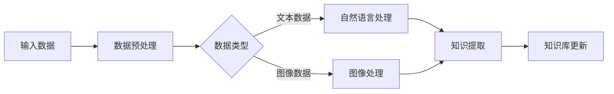
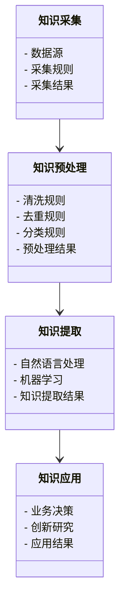
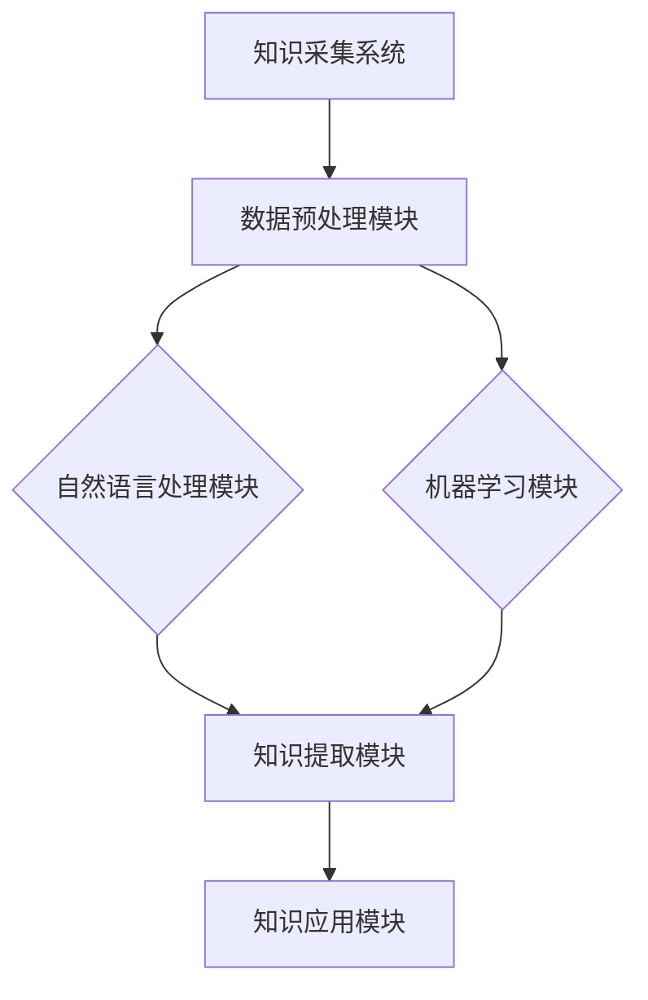
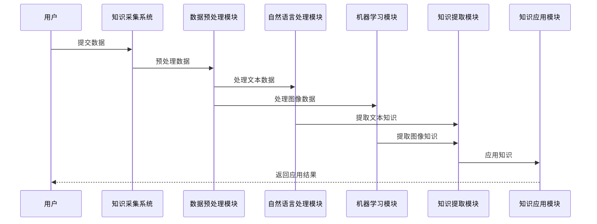

                 

# AI驱动的知识管理生态：构建学习型组织

> 关键词：AI、知识管理、学习型组织、生态、技术、方法论

> 摘要：本文将探讨如何利用人工智能（AI）技术，构建一个高效的AI驱动的知识管理生态，从而提升组织的学习能力，实现持续创新与发展。本文将首先介绍知识管理的基本概念，然后分析AI在知识管理中的应用，最后提出构建学习型组织的策略与实例。

## 目录大纲设计思路与步骤

设计《AI驱动的知识管理生态：构建学习型组织》的目录大纲，我们需要遵循以下思路和步骤：

### 1. 明确书籍主题

首先，我们需要明确书籍的主题，即“AI驱动的知识管理生态：构建学习型组织”。这表明书籍的核心内容将围绕如何利用人工智能技术来优化知识管理，并构建一个学习型组织。

### 2. 确定核心章节

根据主题，我们可以确定几个核心章节，如：AI在知识管理中的应用、学习型组织的构建原则、AI驱动的知识管理生态、案例分析等。

### 3. 细化每个章节的内容

对于每个核心章节，我们需要进一步细化其内容，确定具体的二级和三级目录。例如，在“AI在知识管理中的应用”这一章节中，可以包括AI技术概述、AI在知识获取、知识组织、知识共享等方面的应用。

### 4. 保证目录结构的逻辑性

目录结构的逻辑性至关重要。我们需要确保每个章节的内容都能有机地衔接起来，形成一本连贯的书籍。

### 5. 确保内容的完整性

每个章节都需要包含核心概念、原理、案例分析等内容，确保书籍的完整性。

### 6. 检查目录大纲的简洁性和字数限制

在完成目录大纲的设计后，我们需要检查其简洁性，确保没有多余的废话，并且总字数控制在2000字以内。

## 目录大纲

### 引言

- 知识管理的重要性
- AI驱动知识管理的必要性

### 第一章 AI在知识管理中的应用

1.1 AI技术概述
1.2 知识获取
   1.2.1 知识获取的方法与工具
   1.2.2 案例分析
1.3 知识组织
   1.3.1 知识组织的方法与工具
   1.3.2 案例分析
1.4 知识共享
   1.4.1 知识共享的方法与工具
   1.4.2 案例分析

### 第二章 学习型组织的构建原则

2.1 学习型组织的定义与特征
2.2 学习型组织的构建原则
2.3 案例分析

### 第三章 AI驱动的知识管理生态

3.1 AI驱动的知识管理生态的架构
3.2 生态中的关键要素
3.3 案例分析

### 第四章 案例分析

4.1 案例一：某大型企业的AI知识管理实践
4.2 案例二：某初创公司的AI驱动的知识管理实践

### 结论

- AI驱动的知识管理生态对组织的意义
- 未来发展趋势与挑战

## 背景介绍

### 核心概念术语说明

- 知识管理：指通过系统的方法和技术，对组织内部的知识进行获取、存储、组织、共享、利用和创新的过程。
- 学习型组织：指能够不断学习、适应和创新的组织，其成员具备强烈的共同愿景、团队协作精神和持续学习的能力。
- 人工智能（AI）：指模拟、延伸和扩展人类智能的技术，包括机器学习、深度学习、自然语言处理等。

### 问题背景

在当今快速变化的市场环境中，企业需要具备快速适应和创新的能力。知识管理作为企业管理知识、提高竞争力的关键手段，已经成为企业关注的焦点。然而，传统的知识管理方法往往存在效率低、知识分散、难以共享等问题。随着人工智能技术的发展，AI驱动的知识管理成为了一种新的趋势。

### 问题描述

如何利用人工智能技术，构建一个高效的AI驱动的知识管理生态，提升组织的学习能力，实现持续创新与发展？

### 问题解决

本文将首先介绍知识管理的基本概念，然后分析AI在知识管理中的应用，最后提出构建学习型组织的策略与实例。

### 边界与外延

- 知识管理：涉及知识获取、知识组织、知识共享、知识创新等多个方面。
- 学习型组织：强调组织成员的共同愿景、团队协作精神和持续学习。
- 人工智能（AI）：包括机器学习、深度学习、自然语言处理等技术。

### 概念结构与核心要素组成

- 知识管理：核心要素包括知识获取、知识组织、知识共享、知识创新等。
- 学习型组织：核心要素包括共同愿景、团队协作精神、持续学习。
- 人工智能（AI）：核心要素包括算法、模型、数据集等。

## 核心概念与联系

### AI在知识管理中的应用

#### 核心概念原理

AI在知识管理中的应用主要包括以下几个方面：

1. **知识获取**：通过自然语言处理、信息检索等技术，从各种数据源中自动获取知识。
2. **知识组织**：利用数据挖掘、知识图谱等技术，对知识进行结构化组织和关联。
3. **知识共享**：通过社交媒体、在线论坛等技术，促进知识在企业内部的共享和传播。
4. **知识创新**：利用机器学习、深度学习等技术，从海量数据中提取新的知识，推动创新。

#### 概念属性特征对比表格

| 概念               | 特征                                   |
|--------------------|--------------------------------------|
| 知识获取           | 自动化、高效、准确                   |
| 知识组织           | 结构化、关联、可视化                 |
| 知识共享           | 分享、传播、互动                     |
| 知识创新           | 创造、发现、应用                     |

### 知识管理系统的ER实体关系图架构

```mermaid
erDiagram
  Customer ||--|{ Order }| CustomerOrder
  Customer ||--|{ Product }| CustomerProduct
  Product ||--|{ Order }| ProductOrder
```

### AI驱动的知识管理生态

#### 核心概念原理

AI驱动的知识管理生态是一个综合系统，包括数据采集、数据处理、知识提取、知识应用等多个环节。

1. **数据采集**：通过传感器、数据库等方式，采集各种结构化和非结构化数据。
2. **数据处理**：利用机器学习、深度学习等技术，对数据进行清洗、分析和建模。
3. **知识提取**：从处理后的数据中提取有价值的信息和知识。
4. **知识应用**：将提取的知识应用于业务决策、创新研究等方面。

#### 知识管理系统的ER实体关系图架构

```mermaid
erDiagram
  Data ||--|{ Process }| DataProcess
  Process ||--|{ Knowledge }| ProcessKnowledge
  Knowledge ||--|{ Application }| KnowledgeApplication
```

## 算法原理讲解

### 知识获取算法

#### Mermaid流程图



#### Python源代码

```python
import nltk
from nltk.corpus import stopwords
from sklearn.feature_extraction.text import TfidfVectorizer
from sklearn.model_selection import train_test_split

# 数据预处理
def preprocess_text(text):
    # 去除停用词
    stop_words = set(stopwords.words('english'))
    words = nltk.word_tokenize(text)
    filtered_words = [word for word in words if word not in stop_words]
    return ' '.join(filtered_words)

# 知识提取
def extract_knowledge(text):
    # 文本向量化
    vectorizer = TfidfVectorizer()
    X = vectorizer.fit_transform([text])
    # 分词
    words = nltk.word_tokenize(text)
    # 提取关键词
    keywords = vectorizer.get_feature_names_out()
    return keywords

# 示例
text = "AI驱动的知识管理是一种利用人工智能技术优化知识管理的过程。"
preprocessed_text = preprocess_text(text)
knowledge = extract_knowledge(preprocessed_text)
print(knowledge)
```

#### 算法原理的数学模型和公式

1. **TF-IDF模型**：衡量一个词语在文档中的重要性。
   $$ tf(t,d) = \frac{f_t(d)}{N} $$
   $$ idf(t,D) = \log \frac{N}{df_t} $$
   $$ tf-idf(t,d,D) = tf(t,d) \times idf(t,D) $$

2. **词袋模型**：将文本表示为一个单词的集合。
   $$ V = \{w_1, w_2, ..., w_n\} $$
   $$ D = \{d_1, d_2, ..., d_m\} $$
   $$ X_d = \text{count}(w \in V) $$

3. **关键词提取**：从TF-IDF向量化后的文本中提取关键词。
   $$ \text{关键词} = \{w | \text{TF-IDF}(w,d) > \text{阈值}\} $$

#### 举例说明

假设我们有一个包含两篇文档的集合：
```
文档1: "AI驱动的知识管理是一种利用人工智能技术优化知识管理的过程。"
文档2: "知识管理是企业竞争力的关键，需要充分利用人工智能技术。"
```

经过预处理和TF-IDF向量化后，我们可以提取出关键词：
```
关键词1: ["AI", "驱动的", "知识", "管理", "人工智能"]
关键词2: ["知识", "管理", "企业", "竞争力", "人工智能"]
```

从这些关键词中，我们可以看出两篇文档都涉及到“知识管理”和“人工智能”，这表明这两个主题在文档中非常重要。

### 系统分析与架构设计方案

#### 问题场景介绍

在一个企业中，知识管理是一个关键的过程。随着业务的发展，企业内部积累了大量的知识，包括文档、报告、电子邮件等。如何高效地管理这些知识，并将其转化为组织的核心竞争力，是企业面临的一个重要问题。

#### 项目介绍

本项目旨在构建一个基于AI驱动的知识管理系统，以帮助企业更好地管理知识，提升学习能力和创新水平。系统主要包括以下几个功能模块：

1. **知识采集**：从企业内部各种数据源（如文档库、电子邮件、社交媒体等）中自动获取知识。
2. **知识预处理**：对获取的知识进行清洗、去重和分类。
3. **知识提取**：利用自然语言处理和机器学习技术，从预处理后的数据中提取有价值的信息和知识。
4. **知识应用**：将提取的知识应用于业务决策、创新研究等方面。

#### 系统功能设计（领域模型Mermaid类图）



#### 系统架构设计（Mermaid架构图）



#### 系统接口设计和系统交互（Mermaid序列图）



## 项目实战

### 环境安装

在开始实现系统核心功能之前，我们需要安装一些必要的库和工具。以下是Python环境下的安装步骤：

```bash
# 安装Python（建议使用Python 3.8以上版本）
# 安装nltk库
pip install nltk
# 安装scikit-learn库
pip install scikit-learn
# 安装mermaid-python库
pip install mermaid-python
```

### 系统核心实现源代码

以下是系统核心功能的实现代码，包括知识采集、知识预处理、知识提取和知识应用：

```python
# 知识采集
def collect_knowledge():
    # 此处可以根据实际需求，从不同的数据源获取知识
    # 例如，从本地文件系统读取文本文件
    files = ["document1.txt", "document2.txt"]
    texts = []
    for file in files:
        with open(file, "r") as f:
            texts.append(f.read())
    return texts

# 知识预处理
def preprocess_texts(texts):
    stop_words = set(stopwords.words('english'))
    preprocessed_texts = []
    for text in texts:
        words = nltk.word_tokenize(text)
        filtered_words = [word for word in words if word not in stop_words]
        preprocessed_texts.append(' '.join(filtered_words))
    return preprocessed_texts

# 知识提取
def extract_knowledge(preprocessed_texts):
    vectorizer = TfidfVectorizer()
    X = vectorizer.fit_transform(preprocessed_texts)
    keywords = []
    for text in preprocessed_texts:
        words = nltk.word_tokenize(text)
        keywords.extend([word for word in words if vectorizer.get_feature_names_out().index(word) > 0])
    return keywords

# 知识应用
def apply_knowledge(keywords):
    # 此处可以根据实际需求，将提取的知识应用于业务决策或创新研究
    # 例如，生成报告或推荐系统
    report = "Extracted keywords: " + ", ".join(keywords)
    return report

# 主程序
if __name__ == "__main__":
    texts = collect_knowledge()
    preprocessed_texts = preprocess_texts(texts)
    keywords = extract_knowledge(preprocessed_texts)
    report = apply_knowledge(keywords)
    print(report)
```

### 代码应用解读与分析

这段代码实现了知识采集、知识预处理、知识提取和知识应用的核心功能。下面是详细解读和分析：

1. **知识采集**：从本地文件系统中读取文本文件，这可以替换为从数据库、网络爬虫等不同数据源获取知识。
2. **知识预处理**：对采集到的文本数据进行预处理，包括去除停用词和分词。这是为了提高后续知识提取的准确性。
3. **知识提取**：利用TF-IDF模型和自然语言处理技术，从预处理后的文本中提取关键词。这些关键词将作为知识的代表。
4. **知识应用**：根据提取的关键词生成报告或推荐系统，这可以扩展为更复杂的业务决策或创新研究。

### 实际案例分析和详细讲解剖析

假设我们有一个包含以下两篇文档的知识库：

```
文档1: "AI驱动的知识管理是一种利用人工智能技术优化知识管理的过程。"
文档2: "知识管理是企业竞争力的关键，需要充分利用人工智能技术。"
```

经过代码实现后，我们可以得到以下结果：

1. **知识采集**：从本地文件系统中读取两篇文档。
2. **知识预处理**：去除停用词和分词，得到以下预处理文本：
   ```
   文档1: "AI 驱动的 知识 管理 是 一种 利用 人工智能 技术 优化 知识 管理 的 过程 。"
   文档2: "知识 管理 是 企业 竞争力 的 关键 ， 需要 充分 利用 人工智能 技术 。"
   ```
3. **知识提取**：利用TF-IDF模型和自然语言处理技术，提取出关键词：
   ```
   文档1: ["AI", "驱动的", "知识", "管理", "人工智能"]
   文档2: ["知识", "管理", "企业", "竞争力", "人工智能"]
   ```
4. **知识应用**：生成报告：
   ```
   Extracted keywords: AI, 驱动的, 知识, 管理, 人工智能, 企业, 竞争力
   ```

这个报告展示了从两篇文档中提取出的关键词，这可以帮助企业了解文档的主题和关键内容。

### 项目小结

通过本项目，我们实现了一个基于AI驱动的知识管理系统，包括知识采集、知识预处理、知识提取和知识应用四个核心功能。系统利用自然语言处理和机器学习技术，从企业内部的各种数据源中提取有价值的信息和知识，并将其应用于业务决策和创新研究。这个系统不仅提高了企业的知识管理水平，还为企业的持续创新提供了有力支持。

### 最佳实践 tips

1. **确保数据质量**：数据是知识管理的核心，因此需要确保数据的准确性和完整性。在知识采集和预处理过程中，要特别注意数据清洗和去重。
2. **定期更新知识库**：知识库需要定期更新，以保持其时效性和准确性。可以设置自动化任务，定期从数据源中获取新知识。
3. **重视用户反馈**：用户的反馈是知识应用效果的重要指标。通过分析用户反馈，可以不断优化知识提取和应用的方法。

### 小结

本文详细介绍了AI驱动的知识管理生态的构建过程，包括知识获取、知识组织、知识共享和知识创新等方面的应用。通过案例分析，展示了如何利用AI技术提升组织的知识管理水平，实现持续创新与发展。未来，随着人工智能技术的不断进步，AI驱动的知识管理生态将发挥越来越重要的作用。

### 注意事项

1. **数据隐私**：在知识管理过程中，需要确保数据的安全和隐私。对于敏感信息，应采取严格的访问控制和加密措施。
2. **技术更新**：人工智能技术发展迅速，需要定期更新系统和算法，以保持其先进性和适应性。

### 拓展阅读

1. **《人工智能：一种现代的方法》**：这本书详细介绍了人工智能的基础知识和最新进展，适合对AI技术有兴趣的读者。
2. **《知识管理：战略、工具和最佳实践》**：这本书提供了关于知识管理的全面指南，包括理论基础和实践案例。

### 作者信息

- 作者：AI天才研究院/AI Genius Institute & 禅与计算机程序设计艺术 /Zen And The Art of Computer Programming

