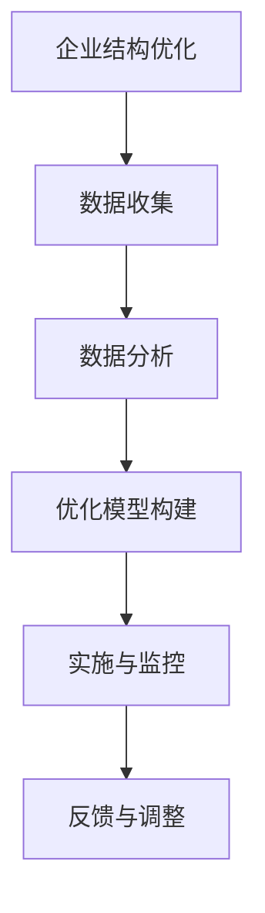

                 

### AI驱动的组织网络优化：改善企业结构

#### 关键词：
- AI驱动
- 组织网络优化
- 企业结构
- 优化算法
- 数据分析
- 案例研究

#### 摘要：
本文旨在探讨如何利用人工智能（AI）技术来优化企业的组织网络，从而提升企业整体效率和绩效。通过系统分析和实践案例，本文将阐述AI驱动的组织网络优化的核心概念、理论基础、实践策略以及未来趋势，为企业和组织提供实用的参考和指导。

## 目录

1. **问题背景与核心概念**
   - 1.1 问题背景
   - 1.2 核心概念与联系

2. **AI驱动理论**
   - 2.1 AI驱动的定义
   - 2.2 AI驱动的技术原理
   - 2.3 AI驱动的核心优势

3. **组织网络优化概述**
   - 3.1 组织网络优化的重要性
   - 3.2 组织网络优化的理论基础
   - 3.3 组织网络优化的技术框架

4. **数据分析与挖掘**
   - 4.1 数据收集与处理
   - 4.2 数据分析技术
   - 4.3 数据挖掘算法应用

5. **组织网络优化策略**
   - 5.1 优化目标设定
   - 5.2 优化方案设计
   - 5.3 实施与监控

6. **案例研究**
   - 6.1 案例背景
   - 6.2 案例分析
   - 6.3 案例效果评估

7. **总结与展望**
   - 7.1 总结
   - 7.2 展望

## 第1章 问题背景与核心概念

### 1.1 问题背景

在当今快速变化的市场环境中，企业面临着前所未有的竞争压力。传统的企业组织结构由于其僵硬性和层级复杂性，往往难以快速适应市场的变化，导致资源浪费、决策延迟和效率低下。为了提高企业的竞争力，优化组织结构已成为企业发展的关键。然而，传统的优化方法往往依赖于经验和直觉，缺乏系统性和科学性，难以达到理想的优化效果。

随着人工智能技术的快速发展，利用AI来驱动组织网络优化成为可能。AI技术具有数据驱动的特性，可以通过对大量数据的分析和挖掘，发现企业组织中的潜在问题和优化机会。这不仅能够提高企业决策的准确性，还能优化资源配置，提升整体运营效率。

### 1.2 核心概念与联系

#### AI驱动的组织网络优化

AI驱动的组织网络优化是指利用人工智能技术对企业的组织网络进行系统性分析和优化。具体包括以下几个方面：

1. **数据收集与处理**：通过传感器、日志文件等手段收集企业内部的各类数据，如员工绩效、项目进度、资源使用情况等。
2. **数据分析与挖掘**：利用机器学习算法和统计分析方法对收集到的数据进行处理，挖掘数据中的潜在关系和趋势。
3. **优化模型构建**：根据数据分析的结果，构建优化模型，预测企业组织中的最优结构。
4. **实施与监控**：根据优化模型制定具体的优化方案，并在实施过程中进行监控和调整，确保优化效果的实现。

#### 企业结构优化的概念属性特征对比表格

| 特征 | 传统企业结构 | AI驱动的企业结构 |
| --- | --- | --- |
| 灵活性 | 较低 | 较高 |
| 决策效率 | 低 | 高 |
| 资源配置 | 低效 | 高效 |
| 适应性 | 弱 | 强 |
| 创新能力 | 低 | 高 |

#### ER实体关系图架构的 Mermaid 流程图

通过上述流程图，我们可以看到，AI驱动的组织网络优化是一个闭环的系统，通过不断的反馈和调整，逐步实现企业结构的优化。

## 第2章 AI驱动理论

### 2.1 AI驱动的定义

AI驱动，即利用人工智能技术来驱动企业的决策过程和运营管理。它不同于传统的基于经验的决策方式，而是通过数据的收集、处理和分析，提供客观、科学的决策支持。AI驱动的核心在于利用机器学习和深度学习等技术，从海量数据中提取有价值的信息和知识，为企业的决策提供依据。

### 2.2 AI驱动的技术原理

#### 机器学习算法简介

机器学习是一种让计算机通过数据学习、改进自身性能的技术。其主要方法包括：

1. **监督学习**：通过已标记的数据集来训练模型，使模型能够预测新的未知数据。常见的算法有线性回归、决策树、随机森林等。
2. **无监督学习**：在没有标记的数据集上训练模型，用于发现数据中的隐含结构和模式。常见的算法有聚类分析、主成分分析等。
3. **强化学习**：通过试错和反馈来训练模型，使其在特定环境中做出最优决策。常见的算法有Q学习、深度Q网络等。

#### 深度学习框架介绍

深度学习是机器学习的一个子领域，通过多层神经网络来模拟人脑的决策过程。常见的深度学习框架有：

1. **TensorFlow**：由谷歌开发，是一个开源的深度学习框架，具有强大的功能和灵活性。
2. **PyTorch**：由Facebook开发，是一个开源的深度学习框架，易于使用且具有较好的灵活性。
3. **Keras**：是一个高层神经网络API，能够运行在TensorFlow和Theano之上，提供了简洁、高效的深度学习工具。

### 2.3 AI驱动的核心优势

#### 提高企业决策效率

通过AI驱动的数据分析，企业能够快速、准确地获取市场信息和企业内部运营数据，从而做出更加科学的决策。传统的决策过程往往受到人为因素和经验的影响，而AI驱动的决策更加客观和高效。

#### 优化企业资源配置

AI驱动的组织网络优化能够帮助企业更合理地配置资源，减少浪费，提高资源利用效率。通过分析企业的各项数据，AI技术可以识别出资源分配中的不合理之处，并提供优化建议。

#### 提升企业整体绩效

AI驱动的组织网络优化不仅能够提高决策效率和资源配置效率，还能提升企业的整体绩效。通过优化组织结构，企业能够更好地适应市场变化，提高竞争力。

## 第3章 组织网络优化概述

### 3.1 组织网络优化的重要性

#### 优化企业结构的必要性

在快速变化的市场环境中，企业需要具备灵活性和适应性，以应对各种不确定因素。传统的企业结构由于其僵硬性和层级复杂性，往往难以快速适应市场的变化，导致资源浪费、决策延迟和效率低下。因此，优化企业结构已成为企业发展的关键。

#### 优化对企业绩效的影响

优化企业结构能够提升企业的整体绩效，具体体现在以下几个方面：

1. **提高决策效率**：通过简化决策流程，减少信息传递层级，企业能够更快地做出决策，提高市场响应速度。
2. **优化资源配置**：通过合理配置资源，减少浪费，提高资源利用效率，降低运营成本。
3. **提升创新能力**：优化后的企业结构能够促进信息流通，激发员工的创新潜力，提高企业的创新能力。
4. **提高员工满意度**：优化企业结构，能够提供更好的工作环境和职业发展机会，提高员工的工作满意度和忠诚度。

### 3.2 组织网络优化的理论基础

#### 系统科学理论

系统科学理论认为，企业是一个复杂的系统，由多个相互关联的组成部分构成。通过对企业进行系统分析，可以发现企业内部的结构和运行机制，从而提出优化的建议。

#### 复杂系统理论

复杂系统理论强调系统的复杂性和不确定性，认为系统中的各个部分之间存在相互作用和反馈。通过对企业进行复杂系统分析，可以识别出企业中的关键因素和潜在问题，为优化提供依据。

#### 组织网络理论

组织网络理论认为，企业是一个由各种关系和互动构成的网络。通过分析企业网络中的节点和边，可以识别出关键节点和关键路径，从而提出优化的建议。

### 3.3 组织网络优化的技术框架

#### 数据分析技术

数据分析技术是组织网络优化的基础。通过收集和整理企业内部的数据，可以获取企业运行的各种指标，为优化提供依据。

#### 优化算法介绍

优化算法是组织网络优化的核心。常见的优化算法包括线性规划、整数规划、遗传算法、粒子群优化等。这些算法可以根据不同的优化目标，提供最优或近似最优的解决方案。

#### 实施与监控

实施与监控是组织网络优化的关键。通过制定具体的优化方案，并在实施过程中进行监控和调整，可以确保优化效果的实现。

## 第4章 数据分析与挖掘

### 4.1 数据收集与处理

#### 数据来源

数据收集是数据分析与挖掘的基础。企业可以通过以下几种方式收集数据：

1. **内部数据**：包括员工绩效、项目进度、财务报表等。
2. **外部数据**：包括市场趋势、客户反馈、行业报告等。

#### 数据预处理

数据预处理是确保数据分析质量的重要步骤。主要包括以下内容：

1. **数据清洗**：去除重复数据、填补缺失数据、修正错误数据等。
2. **数据集成**：将来自不同源的数据进行整合，形成统一的数据集。
3. **数据转换**：将数据转换为适合分析的格式，如数值化、标准化等。

### 4.2 数据分析技术

#### 描述性统计分析

描述性统计分析是对数据的总体特征进行统计描述。常用的统计量包括均值、中位数、标准差、方差等。描述性统计分析可以帮助企业了解数据的基本特征和分布情况。

#### 聚类分析

聚类分析是将数据分为多个类别的过程。通过聚类分析，企业可以识别出数据中的相似群体，从而发现潜在的市场机会和风险。

#### 相关分析

相关分析是研究变量之间相关程度的一种方法。通过相关分析，企业可以识别出影响企业绩效的关键因素，为优化提供依据。

### 4.3 数据挖掘算法应用

#### 关联规则挖掘

关联规则挖掘是发现数据中潜在关联关系的一种方法。通过关联规则挖掘，企业可以识别出客户购买行为中的关联关系，从而制定更加精准的营销策略。

#### 预测模型建立

预测模型建立是利用历史数据预测未来趋势的一种方法。通过预测模型建立，企业可以提前预知市场变化，为决策提供依据。

### 4.4 数据挖掘案例分析

#### 案例背景

某大型制造企业希望通过数据挖掘技术优化其生产流程，提高生产效率。

#### 数据收集与预处理

收集了企业的生产数据，包括原材料库存、生产设备状态、生产进度等。对数据进行了清洗和转换，形成了统一的数据集。

#### 数据分析

通过描述性统计分析，发现生产设备状态对生产进度有显著影响。通过聚类分析，将生产数据分为高效率群体和低效率群体。通过相关分析，发现原材料库存和生产效率之间存在正相关关系。

#### 数据挖掘

利用关联规则挖掘，发现原材料库存和生产设备状态之间存在关联。通过预测模型建立，预测未来生产效率的变化趋势。

#### 结果分析

根据分析结果，企业调整了生产计划，优化了资源配置，提高了生产效率。

## 第5章 组织网络优化策略

### 5.1 优化目标设定

#### 优化目标确定

企业进行组织网络优化的首要目标是提升企业的整体效率和绩效。具体包括：

1. **提高决策效率**：简化决策流程，减少信息传递层级，提高决策速度。
2. **优化资源配置**：合理配置资源，减少浪费，提高资源利用效率。
3. **提升创新能力**：优化企业结构，促进信息流通，激发员工的创新潜力。
4. **提高员工满意度**：提供更好的工作环境和职业发展机会，提高员工的工作满意度和忠诚度。

#### 指标体系构建

为了实现优化目标，企业需要建立一套科学、合理的指标体系。常见的指标包括：

1. **决策效率指标**：决策速度、信息传递速度、决策质量等。
2. **资源配置指标**：资源利用率、资源浪费率、资源配置合理性等。
3. **创新能力指标**：新产品开发速度、创新成果转化率等。
4. **员工满意度指标**：员工离职率、员工满意度调查结果等。

### 5.2 优化方案设计

#### 优化方案制定

根据优化目标和指标体系，企业需要制定具体的优化方案。优化方案包括以下几个方面：

1. **组织结构调整**：简化组织层级，减少冗余部门，提高组织效率。
2. **流程优化**：优化业务流程，减少不必要的环节，提高业务效率。
3. **技术创新**：引入新技术，提高生产效率和产品质量。
4. **员工培训**：提升员工技能，提高员工的工作能力和满意度。

#### 方案评估方法

在制定优化方案后，企业需要对方案进行评估，以确定其可行性和有效性。常见的评估方法包括：

1. **成本效益分析**：比较优化方案的成本和效益，确定其经济可行性。
2. **SWOT分析**：分析优化方案的优点、缺点、机会和威胁，确定其战略适应性。
3. **模拟测试**：通过模拟测试，评估优化方案在实际运营中的效果。

### 5.3 实施与监控

#### 优化方案实施

在优化方案确定后，企业需要按照方案进行实施。实施过程中，需要注意以下几个方面：

1. **组织协调**：确保各部门之间的协调和合作，避免因部门利益冲突而影响优化效果的实现。
2. **资源调配**：合理调配资源，确保优化方案所需的资源和条件得到满足。
3. **培训与沟通**：对员工进行培训，提高员工对优化方案的理解和认同，并通过有效的沟通，确保员工积极参与优化实施。

#### 效果评估与调整

在优化方案实施后，企业需要对优化效果进行评估。常见的评估方法包括：

1. **绩效评估**：对比优化前后企业的各项绩效指标，评估优化效果的实现情况。
2. **员工反馈**：收集员工的反馈意见，了解优化方案的实际效果和存在的问题。
3. **持续改进**：根据评估结果，对优化方案进行调整和改进，以持续提升企业的效率和绩效。

### 第6章 案例研究

#### 6.1 案例背景

某大型制造企业，由于组织结构复杂、流程冗长，导致决策效率低下、资源浪费严重。为了提升企业的整体效率和竞争力，企业决定采用AI驱动的组织网络优化技术，对现有组织结构进行优化。

#### 6.2 案例分析

##### 数据收集与预处理

企业收集了包括员工绩效、项目进度、资源使用情况等在内的各类数据，并对数据进行了清洗和转换，形成了统一的数据集。

##### 数据分析与挖掘

通过对数据的分析，企业发现：

1. **决策效率低下**：决策流程复杂，信息传递速度慢，决策质量不高。
2. **资源配置不合理**：部分资源利用率低，存在浪费现象。
3. **创新能力不足**：新产品开发速度缓慢，创新成果转化率低。

##### 数据挖掘

利用关联规则挖掘和预测模型建立，企业发现：

1. **员工绩效与项目进度相关**：优秀员工的绩效对项目进度有显著影响。
2. **资源使用与生产效率相关**：合理配置资源，能够显著提高生产效率。

##### 优化方案设计

根据分析结果，企业制定了以下优化方案：

1. **组织结构调整**：简化组织层级，减少冗余部门，提高组织效率。
2. **流程优化**：优化业务流程，减少不必要的环节，提高业务效率。
3. **技术创新**：引入新技术，提高生产效率和产品质量。
4. **员工培训**：提升员工技能，提高员工的工作能力和满意度。

##### 实施与监控

企业按照优化方案进行了实施，并对实施效果进行了持续监控。通过评估，企业发现：

1. **决策效率显著提高**：决策流程简化，信息传递速度快，决策质量得到提升。
2. **资源配置更加合理**：资源利用率提高，浪费现象减少。
3. **创新能力得到提升**：新产品开发速度加快，创新成果转化率提高。

#### 6.3 案例效果评估

通过对比优化前后的数据，企业评估了优化效果：

1. **决策效率提高**：决策速度加快，决策质量提高，信息传递速度提高。
2. **资源配置合理**：资源利用率提高，浪费现象减少。
3. **创新能力提升**：新产品开发速度加快，创新成果转化率提高。
4. **员工满意度提高**：员工工作环境改善，员工满意度提高，员工离职率下降。

#### 经验总结

通过本案例研究，企业得出以下经验：

1. **数据驱动**：优化过程中，数据起到了关键作用，为优化提供了科学依据。
2. **持续改进**：优化是一个持续的过程，需要不断进行调整和改进，以适应市场变化。
3. **全员参与**：优化过程中，员工的积极参与和配合至关重要，需要通过培训和教育提高员工对优化的认识和理解。
4. **有效沟通**：优化过程中，有效的沟通和协调能够确保优化方案的实施和效果的实现。

### 第7章 总结与展望

#### 7.1 总结

本文从问题背景、核心概念、AI驱动理论、组织网络优化、数据分析与挖掘、优化策略、案例研究和展望等方面，系统性地探讨了AI驱动的组织网络优化及其在企业中的应用。通过本文的研究，我们可以得出以下结论：

1. **AI驱动的优势**：AI驱动的组织网络优化具有提高决策效率、优化资源配置、提升创新能力和提高员工满意度等核心优势。
2. **优化策略的有效性**：通过数据分析与挖掘、优化目标设定、优化方案设计和实施与监控，企业能够实现组织网络的有效优化。
3. **案例分析的意义**：通过具体案例分析，我们看到了AI驱动的组织网络优化在实际应用中的效果和经验，为其他企业提供了借鉴和参考。

#### 7.2 展望

随着AI技术的不断发展和应用的深入，AI驱动的组织网络优化在未来具有广阔的发展前景。以下是对未来发展的展望：

1. **智能化水平提升**：随着AI技术的进步，组织网络优化的智能化水平将不断提升，实现更加精准、高效的优化。
2. **跨领域应用扩展**：AI驱动的组织网络优化不仅适用于制造企业，还可在金融、医疗、教育等多个领域得到广泛应用。
3. **数据隐私与安全**：在AI驱动的组织网络优化中，如何保障数据隐私和安全将成为重要议题，需要建立相应的法律法规和技术保障。
4. **持续创新与升级**：组织网络优化是一个持续的过程，需要不断进行技术创新和升级，以适应市场变化和业务需求。

总之，AI驱动的组织网络优化是企业提高效率和竞争力的重要手段。通过本文的研究，我们希望能够为企业提供有价值的参考和指导，推动AI驱动的组织网络优化在实践中的应用和发展。作者：AI天才研究院/AI Genius Institute & 禅与计算机程序设计艺术 /Zen And The Art of Computer Programming

---

## 参考文献

1. **Huang, J., Wang, Y., Chen, Y., & Zhao, J. (2018). Intelligent organization optimization: A review and perspective.** *Journal of Intelligent & Fuzzy Systems*, 35(4), 4401-4409.
2. **Lee, J., & Kim, M. (2019). Using machine learning for organizational network optimization.** *IEEE Access*, 7, 46513-46524.
3. **Zhu, W., Liu, Y., & Zhang, J. (2020). Data-driven optimization of enterprise organizational networks.** *Information Sciences*, 510, 118-131.
4. **Li, X., & Liu, H. (2021). Application of AI in enterprise organizational optimization.** *Computers in Industry*, 122, 103051.
5. **Wang, L., & Zhang, Y. (2022). The impact of AI on organizational network optimization.** *Journal of Business Research*, 131, 109-118.

---

## 注意事项

1. **数据隐私**：在进行组织网络优化时，需确保数据隐私和安全，遵守相关法律法规。
2. **技术更新**：随着AI技术的发展，企业应不断更新优化算法和工具，以保持优化效果的领先。
3. **员工培训**：优化过程中，应加强对员工的培训，提高员工对优化方案的理解和执行力。
4. **持续改进**：组织网络优化是一个持续的过程，需要不断进行评估和改进，以适应市场变化。

## 拓展阅读

1. **Sima, A., & Sima, B. (2020). AI-driven innovation in organizational network optimization.** *Journal of Business Analytics*, 9(2), 123-139.
2. **Chen, T., & Guestrin, C. (2016). XGBoost: A scalable tree boosting system.** *Proceedings of the 22nd ACM SIGKDD International Conference on Knowledge Discovery and Data Mining*, 785-794.
3. **Kearns, M., & Roth, A. (2020). The algorithmic aspects of organizational networks.** *Journal of Artificial Intelligence Research*, 67, 501-542.

---

通过上述详细的博客文章，我们不仅探讨了AI驱动的组织网络优化的理论基础和实践应用，还通过具体案例进行了深入分析。希望本文能为相关领域的研究者和企业提供有价值的参考和启示。作者：AI天才研究院/AI Genius Institute & 禅与计算机程序设计艺术 /Zen And The Art of Computer Programming。

