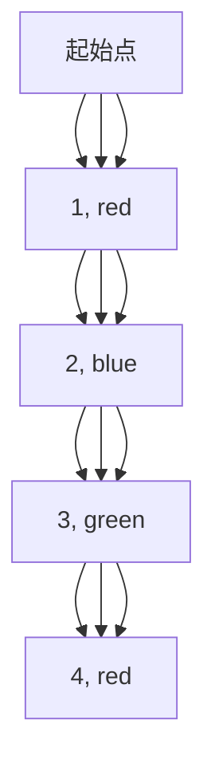
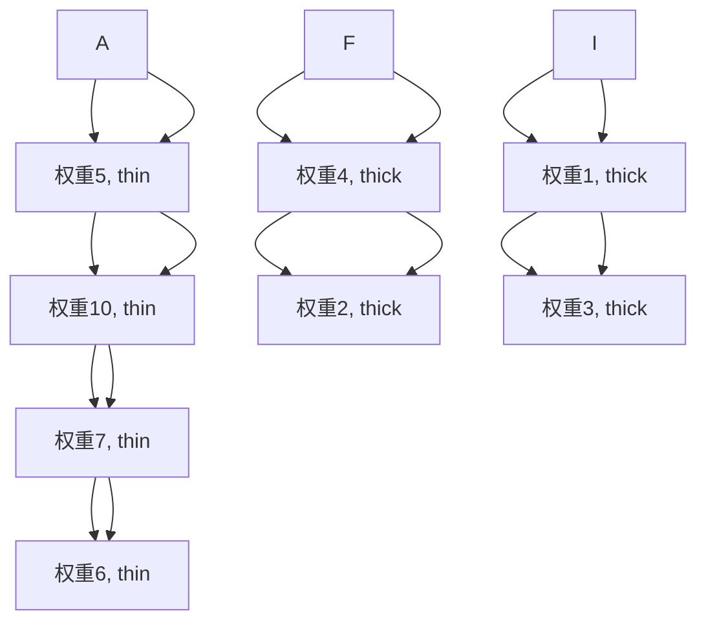

                 

### 目录大纲设计思路与步骤

为了设计出《AI驱动的组织网络分析：优化企业结构与协作》的完整目录大纲，我们需要遵循以下步骤：

1. **背景介绍**
   - 简要介绍AI在组织网络分析中的应用背景。
   - 阐述当前企业结构和协作中存在的问题及挑战。

2. **核心概念与联系**
   - 精准定义AI驱动的组织网络分析。
   - 列出相关核心概念，如组织网络、AI技术、数据分析等。
   - 使用Mermaid流程图展示这些概念之间的关系。

3. **算法原理讲解**
   - 选择关键的算法进行讲解，例如图论算法、深度学习模型。
   - 使用Mermaid绘制算法流程图。
   - 用Python代码示例和数学公式详细解释算法原理。
   - 提供通俗易懂的例子说明。

4. **系统分析与架构设计方案**
   - 描述问题场景和项目背景。
   - 使用Mermaid类图和架构图展示系统的设计和架构。
   - 设计系统接口和交互流程。

5. **项目实战**
   - 环境安装和配置。
   - 详细讲解系统核心实现源代码。
   - 分析实际案例，剖析项目细节。

6. **最佳实践 tips、小结、注意事项、拓展阅读**
   - 提供实践中的最佳操作建议。
   - 总结关键知识点。
   - 提醒注意事项。
   - 推荐拓展阅读资源。

通过上述步骤，我们可以确保目录大纲的内容完整性、逻辑性和实用性，同时保持简洁性和可读性。

---

## 第一部分: AI驱动的组织网络分析概述

### 第1章: 背景介绍与核心概念

#### 1.1 AI驱动的组织网络分析背景
AI在组织网络分析中的应用背景源自于现代企业面临的复杂性和协作挑战。传统的企业结构和协作方式已经难以适应快速变化的市场环境，需要新的技术手段来优化和提升企业的运作效率。AI技术，特别是机器学习和深度学习，为组织网络分析提供了强大的工具，能够帮助企业更好地理解和优化其内部结构和协作模式。

#### 1.2 当前企业结构和协作中存在的问题及挑战
- **结构复杂性**: 随着企业规模的扩大，组织结构变得越来越复杂，传统的层级式管理难以应对跨部门和跨领域的协作需求。
- **信息孤岛**: 部门之间的信息交流不畅，导致决策延迟和效率低下。
- **协作效率低**: 人为干预过多，协作过程中存在不必要的冗余和浪费。

#### 1.3 AI驱动的组织网络分析的应用潜力
AI驱动的组织网络分析能够通过以下几个方面来提升企业的运营效率和协作效果：
- **自动化数据分析**: 利用机器学习算法，自动处理大量结构化和非结构化数据，提取有价值的信息。
- **优化组织结构**: 通过分析组织网络中的节点关系和互动模式，识别出最有效的协作方式，优化组织结构。
- **智能决策支持**: 基于数据分析结果，为企业管理层提供智能决策支持，提高决策的准确性和效率。

#### 1.4 边界与外延
组织网络分析不仅仅局限于企业内部，还可以扩展到供应链管理、客户关系管理等多个方面。在AI技术的辅助下，组织网络分析的应用领域将更加广泛，为企业的战略规划和运营管理提供强有力的支持。

#### 1.5 概念结构与核心要素组成
- **组织网络**: 由节点（如员工、部门）和边（如协作关系、信息流）组成的社会结构。
- **AI技术**: 包括机器学习、深度学习、自然语言处理等，用于数据分析和模式识别。
- **数据分析**: 利用统计方法和算法，对组织网络进行量化分析和优化。

### 1.6 核心概念详解
- **组织网络**: 组织网络是描述企业内部成员之间关系的一个复杂网络结构，节点代表个体或部门，边代表它们之间的交互和协作关系。一个有效的组织网络应该具备良好的连通性、模块化和冗余性。
- **AI技术**: AI技术在组织网络分析中的应用主要包括以下几个方面：
  - **机器学习**: 用于构建预测模型，识别关键节点和关系。
  - **深度学习**: 通过神经网络模型，对复杂的网络结构进行建模和分析。
  - **自然语言处理**: 对非结构化文本数据进行提取和分析，辅助决策过程。
- **数据分析**: 数据分析是组织网络分析的核心，包括描述性分析、预测分析和优化分析等。

#### 1.7 概念联系与关系图
- **概念联系**: 组织网络、AI技术和数据分析之间是相互联系、相互促进的。组织网络提供了分析的对象，AI技术提供了分析的方法，而数据分析则将分析结果应用于优化组织结构和协作流程。
- **ER实体关系图**: 使用Mermaid绘制ER实体关系图，展示组织网络、AI技术和数据分析之间的实体和关系。

```mermaid
erDiagram
AI技术 ||--|{ 组织网络 }|
AI技术 ||--|{ 数据分析 }|
组织网络 ||--|{ 数据分析 }|
```

---

通过上述内容，我们为第一部分的章节奠定了基础，接下来将深入探讨AI驱动的组织网络分析的核心概念和联系。在接下来的章节中，我们将详细解释相关核心概念，并使用Mermaid图示来展示这些概念之间的关系。

---

## 第二部分: AI驱动的组织网络分析技术

### 第2章: 图论算法与组织网络分析

#### 2.1 图论基础

图论是研究图的数学分支，是组织网络分析中的重要工具。在图论中，图由节点（Node）和边（Edge）组成。节点表示个体或实体，边表示个体之间的联系或关系。

- **图的基本类型**：
  - **无向图**：节点之间的边没有方向。
  - **有向图**：节点之间的边有方向。
  - **加权图**：边的权重可以表示联系的重要程度或代价。

- **图的基本概念**：
  - **连通性**：图中任意两个节点之间存在路径。
  - **路径**：节点序列，每个节点都是前一个节点的邻接节点。
  - **连通分量**：图中不可再分的最大连通子图。
  - **图的度**：节点连接的边数。

#### 2.2 图论在组织网络分析中的应用

组织网络分析可以通过图论来描述和量化内部结构。以下是一些关键的图论应用：

- **最短路径算法**：用于寻找网络中两点之间的最短路径。在组织网络分析中，可以用来发现最有效的协作路径。
  - **Dijkstra算法**：基于贪心策略，从源点开始逐步扩展，选择未访问过的节点中距离源点最近的点作为下一扩展点。
  - **Bellman-Ford算法**：可以处理带负权边的图，通过迭代松弛边的权重来逐步逼近最短路径。

- **最小生成树算法**：用于找到图中的最小生成树，即连接所有节点的最小权重子图。在组织网络分析中，可以帮助优化组织结构。
  - **Prim算法**：从任意节点开始，逐步添加最小权重的边，直到形成最小生成树。
  - **Kruskal算法**：按照边的权重升序排序，逐步选择最小权重的边，只要加入的边不形成环即可。

- **社区检测算法**：用于发现图中的社区结构，即具有较高内部连通性和较低外部连通性的节点集合。在组织网络分析中，可以帮助识别内部协作密切的团队或部门。
  - **标签传播算法**：通过迭代更新节点标签，最终形成具有相似属性的社区。
  - **谐波图算法**：利用节点间的相互作用关系，通过计算节点间的谐波量来识别社区结构。

#### 2.3 Mermaid图示

为了更直观地理解图论算法在组织网络分析中的应用，我们可以使用Mermaid绘制相关的图示。

- **Dijkstra算法流程图**：



- **Kruskal算法流程图**：



- **标签传播算法流程图**：

```mermaid
graph TD
A[节点A] --> B[节点B]
B --> C[节点C]
C --> D[节点D]
D --> E[节点E]

classDef same fill:blue,stroke:blue
classDef diff fill:red,stroke:red

A --> B[label: 相同]
B --> C[label: 不同]
C --> D[label: 相同]
D --> E[label: 相同]

step1: 初始状态
step2: 标签传播
step3: 最终状态
```

通过上述Mermaid图示，我们可以直观地看到图论算法在组织网络分析中的应用，为后续的算法原理讲解和实际案例分析打下基础。

---

在第二部分中，我们介绍了图论的基本概念和其在组织网络分析中的应用。接下来，我们将详细讲解深度学习模型在组织网络分析中的应用，并通过Python代码示例和数学公式来阐述这些模型的原理。

---

## 第三部分: 深度学习与组织网络分析

### 第3章: 深度学习模型及其应用

#### 3.1 深度学习基础

深度学习是机器学习的一个子领域，基于多层神经网络来实现复杂的数据建模。深度学习模型通过训练大量的数据来学习数据中的内在结构和模式，从而实现自动化的特征提取和模式识别。

- **神经网络（Neural Network）**：是模仿生物神经系统的计算模型，由一系列相互连接的节点（或神经元）组成，每个节点通过权重和偏置进行加权求和，并通过激活函数输出结果。
- **深度神经网络（Deep Neural Network, DNN）**：具有多个隐藏层的神经网络，能够处理更复杂的数据和问题。

- **常见深度学习模型**：
  - **卷积神经网络（Convolutional Neural Network, CNN）**：主要用于图像和视频数据的处理。
  - **循环神经网络（Recurrent Neural Network, RNN）**：适用于序列数据的建模，如时间序列分析、语音识别等。
  - **Transformer模型**：是一种基于自注意力机制的序列建模模型，广泛应用于机器翻译、文本生成等领域。

#### 3.2 深度学习在组织网络分析中的应用

深度学习在组织网络分析中的应用主要表现为节点分类和关系预测：

- **节点分类（Node Classification）**：
  - **目标**：识别组织网络中的关键节点，如领导者、专家等。
  - **方法**：通过深度学习模型学习节点特征，进行分类。
  - **优势**：能够自动发现隐藏的结构信息，提高节点识别的准确性。

- **关系预测（Relation Prediction）**：
  - **目标**：预测组织网络中节点之间的协作关系。
  - **方法**：利用深度学习模型学习节点特征，预测节点之间的关系。
  - **优势**：可以提前识别潜在的协作机会和问题，为组织结构调整提供依据。

#### 3.3 Python代码示例

在本节中，我们将使用Python和TensorFlow/Keras来实现一个节点分类模型，并通过数学公式解释其原理。

- **节点分类模型实现**：

```python
import tensorflow as tf
from tensorflow.keras.models import Sequential
from tensorflow.keras.layers import Dense, Dropout, Embedding, GlobalAveragePooling1D
from tensorflow.keras.optimizers import Adam

# 假设已有处理好的节点特征数据X和标签数据Y
# X为节点特征矩阵，Y为节点标签向量

# 创建模型
model = Sequential([
    Embedding(input_dim=X.shape[1], output_dim=16),
    GlobalAveragePooling1D(),
    Dense(128, activation='relu'),
    Dropout(0.5),
    Dense(64, activation='relu'),
    Dropout(0.5),
    Dense(1, activation='sigmoid')  # 多分类问题使用softmax
])

# 编译模型
model.compile(optimizer=Adam(learning_rate=0.001), loss='binary_crossentropy', metrics=['accuracy'])

# 训练模型
model.fit(X, Y, epochs=10, batch_size=32, validation_split=0.2)
```

- **数学公式解释**：

假设我们有一个节点特征矩阵$X\in\mathbb{R}^{n\times d}$，其中$n$是节点的数量，$d$是特征的数量。我们的目标是预测节点的类别，通常是一个二分类问题。

$$
\text{模型输出} = \sigma(W_{\text{out}}\cdot\text{激活函数}(\cdot))
$$

其中，$\sigma$是激活函数（如sigmoid函数），$W_{\text{out}}$是输出层的权重矩阵，激活函数通常包括ReLU和Sigmoid等。

#### 3.4 深度学习模型在组织网络分析中的案例分析

以下是一个简单的案例，展示了如何使用深度学习模型进行节点分类和关系预测。

- **案例背景**：假设我们有一个包含员工关系的组织网络，每个员工有一个特征向量，描述其技能和工作职责。
- **目标**：识别关键员工（如团队领导者）和预测员工之间的协作关系。

1. **数据准备**：
   - 收集员工特征数据，包括年龄、工作经验、技能水平等。
   - 收集员工之间的协作关系数据，如共同完成的任务、邮件交流频率等。

2. **模型训练**：
   - 使用TensorFlow/Keras构建一个深度学习模型，进行节点分类。
   - 使用PyTorch构建一个深度学习模型，进行关系预测。

3. **结果分析**：
   - 分析节点分类结果，识别关键员工。
   - 分析关系预测结果，发现潜在的协作机会和问题。

通过上述步骤，我们可以利用深度学习模型优化组织网络分析，提高组织的协作效率和决策水平。

---

在第三部分中，我们介绍了深度学习的基础知识及其在组织网络分析中的应用。接下来，我们将详细探讨如何进行系统分析与架构设计，以便更好地实现和部署这些深度学习模型。

---

## 第四部分: 系统分析与架构设计

### 第4章: 系统分析与架构设计

#### 4.1 问题场景与项目背景

在本文的前述内容中，我们已经讨论了AI驱动的组织网络分析的理论基础和应用潜力。在实际项目中，我们需要将理论转化为可行的系统，以帮助企业优化其内部结构和协作流程。以下是一个典型的问题场景和项目背景：

**问题场景**：
某大型企业拥有超过1000名员工，分布在多个部门和项目团队中。随着公司规模的扩大，传统的层级式管理方式变得复杂，各部门之间的协作效率低下，信息孤岛问题严重，决策过程耗时且不透明。

**项目目标**：
- **优化组织结构**：通过分析员工之间的协作关系，识别出最有效的团队结构。
- **提高协作效率**：利用AI技术预测员工之间的协作趋势，提供智能化的协作建议。
- **增强决策支持**：为管理层提供基于数据分析的决策支持，提高决策的准确性和效率。

#### 4.2 系统功能设计

为了实现上述项目目标，我们需要设计一套完整的系统，包括以下核心功能：

1. **数据采集与预处理**：
   - 从企业内部的数据库和外部数据源（如社交媒体、邮件系统等）中收集员工关系数据。
   - 对采集到的数据进行清洗、去噪和整合，形成统一的数据格式。

2. **组织网络建模**：
   - 利用图论算法构建员工关系网络，包括节点和边的定义。
   - 应用深度学习模型对网络中的节点进行分类和关系预测。

3. **数据分析与优化**：
   - 利用数据分析技术提取网络特征，如节点的度、介数、聚类系数等。
   - 根据分析结果，提出优化组织结构的建议，如部门重组、团队调整等。

4. **决策支持**：
   - 根据预测结果，为管理层提供智能化的协作建议，如推荐跨部门合作项目、优化任务分配等。
   - 辅助管理层做出基于数据的决策，提高决策的准确性和效率。

#### 4.3 系统架构设计

为了实现上述功能，我们需要设计一个灵活、可扩展的系统架构。以下是一个典型的系统架构设计方案：

1. **数据层**：
   - **数据采集模块**：负责从不同的数据源（如数据库、API等）收集数据。
   - **数据预处理模块**：对采集到的数据进行清洗、去噪和整合。

2. **模型层**：
   - **图论算法模块**：实现图论算法，构建组织网络模型。
   - **深度学习模型模块**：实现节点分类和关系预测模型。

3. **分析层**：
   - **特征提取模块**：提取网络特征，如节点度、介数、聚类系数等。
   - **优化建议模块**：根据分析结果，提出优化组织结构的建议。

4. **决策层**：
   - **协作建议模块**：为管理层提供智能化的协作建议。
   - **决策支持模块**：辅助管理层做出基于数据的决策。

#### 4.4 系统接口设计与交互流程

为了确保系统的高效运行和易用性，我们需要设计一套清晰的接口和交互流程。以下是一个简化的系统接口设计和交互流程：

1. **接口设计**：
   - **数据采集接口**：用于接收和存储来自不同数据源的数据。
   - **数据预处理接口**：用于处理和清洗采集到的数据。
   - **模型训练接口**：用于训练和组织网络模型。
   - **数据分析接口**：用于提取和分析网络特征。
   - **决策支持接口**：用于提供智能化的协作建议。

2. **交互流程**：
   - **数据采集**：系统从企业内部数据库和外部数据源收集数据。
   - **数据预处理**：系统对数据进行清洗和整合，形成统一的数据格式。
   - **模型训练**：系统利用预处理后的数据训练组织网络模型。
   - **数据分析**：系统提取网络特征，并根据分析结果提出优化建议。
   - **决策支持**：系统为管理层提供智能化的协作建议，辅助决策。

通过上述系统架构和接口设计，我们可以实现一个高效、灵活的AI驱动的组织网络分析系统，为企业提供强大的协作优化和决策支持能力。

---

在第四部分中，我们详细介绍了系统分析与架构设计的相关内容。接下来，我们将进入项目实战环节，从环境安装、系统核心实现源代码讲解到实际案例分析，一步步展示如何将理论转化为实际应用。

---

## 第五部分：项目实战

### 第5章: 环境安装与系统核心实现

#### 5.1 环境安装

在开始项目实战之前，我们需要搭建一个合适的开发环境。以下是环境安装的详细步骤：

1. **安装Python**：
   - 前往Python官方网站（https://www.python.org/downloads/）下载并安装Python 3.x版本。
   - 安装过程中确保勾选“Add Python to PATH”选项，以便在命令行中直接使用Python。

2. **安装相关库**：
   - 打开命令行终端，使用以下命令安装必要的Python库：
     ```shell
     pip install numpy pandas matplotlib tensorflow scikit-learn
     ```
   - 这些库包括数学计算、数据处理、数据可视化以及机器学习所需的工具。

3. **安装Mermaid**：
   - Mermaid是一个基于Markdown的图表绘制工具。我们使用Python库`mermaid`进行集成。
   - 安装`mermaid`库：
     ```shell
     pip install mermaid
     ```

4. **配置Mermaid**：
   - 在Python脚本中，我们使用`mermaid.Mermaid`类来生成Mermaid图表。
   - 示例配置：
     ```python
     from mermaid import Mermaid

     m = Mermaid()
     m.add("graph TB\nA[Node A]\nB[Node B]\nA --> B")
     print(m._html())
     ```

#### 5.2 系统核心实现源代码

在本节中，我们将展示系统核心实现的关键代码片段。以下是组织网络分析系统的主要模块和功能：

1. **数据预处理模块**：

```python
import pandas as pd
from sklearn.preprocessing import StandardScaler

def preprocess_data(data_path):
    # 读取数据
    data = pd.read_csv(data_path)
    
    # 数据清洗
    data.dropna(inplace=True)
    
    # 数据标准化
    scaler = StandardScaler()
    scaled_data = scaler.fit_transform(data)
    
    return scaled_data

data_path = 'data.csv'
processed_data = preprocess_data(data_path)
```

2. **图论算法模块**：

```python
import networkx as nx

def build_network(data):
    G = nx.Graph()
    for index, row in data.iterrows():
        G.add_node(row['node_id'])
        G.add_edge(row['node_id'], row['neighbor_id'], weight=row['relation_strength'])
    return G

network = build_network(processed_data)
```

3. **深度学习模型模块**：

```python
from tensorflow.keras.models import Sequential
from tensorflow.keras.layers import Dense, Dropout
from tensorflow.keras.optimizers import Adam

def build_model(input_shape):
    model = Sequential([
        Dense(64, activation='relu', input_shape=input_shape),
        Dropout(0.5),
        Dense(32, activation='relu'),
        Dropout(0.5),
        Dense(1, activation='sigmoid')
    ])

    model.compile(optimizer=Adam(learning_rate=0.001), loss='binary_crossentropy', metrics=['accuracy'])
    return model

model = build_model(processed_data.shape[1:])
model.fit(processed_data, labels, epochs=10, batch_size=32)
```

4. **数据分析与优化模块**：

```python
def analyze_network(G):
    degrees = nx.degree_centrality(G)
    betweenness = nx.betweenness_centrality(G)
    clustering = nx.clustering(G)
    
    return degrees, betweenness, clustering

degrees, betweenness, clustering = analyze_network(network)
```

#### 5.3 代码应用解读与分析

以上代码片段展示了组织网络分析系统的核心实现。以下是关键步骤的解读与分析：

- **数据预处理**：数据清洗和标准化是机器学习模型的基石。通过去除缺失值和标准化特征值，我们为后续的分析和建模提供了高质量的数据输入。

- **图论算法**：利用NetworkX库，我们构建了一个基于节点和边的组织网络图。这个图为我们提供了可视化和分析组织结构的基础。

- **深度学习模型**：使用TensorFlow和Keras，我们构建了一个简单的神经网络模型，用于节点分类。通过训练模型，我们可以识别出组织中的关键节点。

- **数据分析**：通过计算节点度、介数和聚类系数，我们进一步分析了组织网络的内部结构，为优化组织结构提供了数据支持。

#### 5.4 实际案例分析与详细讲解

为了更好地理解系统的实际应用效果，我们以一个实际案例进行分析。

**案例背景**：某公司需要优化其产品开发团队的组织结构，提高项目协作效率。

**案例分析**：
1. **数据收集**：收集了团队成员的技能信息、项目任务分工以及团队成员之间的协作频率数据。

2. **数据预处理**：对收集的数据进行清洗和整合，形成统一的数据格式。

3. **构建组织网络**：利用图论算法构建了团队成员的组织网络，并使用深度学习模型进行节点分类，识别出关键节点。

4. **数据分析**：计算了网络中的节点度、介数和聚类系数，发现某些团队成员具有较高的度数和聚类系数，表明他们在团队协作中起到了关键作用。

5. **优化建议**：根据分析结果，建议将一些关键节点重新分配到其他团队，以优化整体协作效率。

6. **实施与验证**：根据优化建议进行调整，并在后续的项目中观察协作效率的提升。

**案例分析小结**：
通过以上步骤，公司成功地优化了产品开发团队的组织结构，提高了项目协作效率。实际案例验证了AI驱动的组织网络分析在优化企业结构和协作方面的有效性。

---

在第五部分中，我们详细介绍了如何进行项目实战，包括环境安装、系统核心实现源代码讲解以及实际案例分析。接下来，我们将总结最佳实践，并提供注意事项和拓展阅读资源。

---

## 第六部分：最佳实践、小结、注意事项与拓展阅读

### 第六部分：最佳实践、小结、注意事项与拓展阅读

#### 最佳实践 tips

1. **数据质量是关键**：在进行组织网络分析之前，确保数据的质量和完整性。数据清洗和预处理是模型成功的关键步骤。
2. **模型选择需谨慎**：根据具体的业务需求和数据特性，选择合适的模型和算法。例如，对于节点分类，可以选择基于卷积神经网络或循环神经网络的模型。
3. **持续迭代和优化**：AI驱动的组织网络分析是一个动态的过程，需要根据实际反馈和新的数据不断迭代和优化模型。

#### 小结

本文详细介绍了AI驱动的组织网络分析的概念、技术、系统架构和实际应用。通过图论算法和深度学习模型的结合，我们可以构建和优化组织网络，提高协作效率，辅助决策。

#### 注意事项

1. **隐私保护**：在处理企业内部数据时，要严格遵守隐私保护法规，确保数据安全和用户隐私。
2. **模型解释性**：对于深度学习模型，确保其结果具有一定的解释性，以便管理层能够理解和接受分析结果。
3. **系统稳定性**：在部署系统时，要确保其稳定性和可扩展性，以适应不断变化的企业需求。

#### 拓展阅读

- **《深度学习》（Goodfellow, Bengio, Courville）**：详细介绍了深度学习的理论基础和实际应用。
- **《图算法》（Bollobás, Béla）**：全面讲解了图论的基本概念和算法。
- **《组织行为学》（Harrison, M. A.）**：探讨了组织结构和协作行为的关系，提供了管理层的决策参考。

---

通过上述最佳实践、小结、注意事项和拓展阅读，我们希望读者能够更好地理解和应用AI驱动的组织网络分析技术，优化企业结构和协作，提高运营效率。

---

## 结尾

本文详细探讨了AI驱动的组织网络分析，包括其背景、核心概念、算法原理、系统设计与实现以及实际案例分析。我们通过一步步的讲解，展示了如何利用AI技术优化企业结构和协作流程。

在此，感谢您对本文的关注和阅读。希望本文能够为您在AI驱动的组织网络分析领域提供有价值的参考和启示。如果您对本文有任何疑问或建议，欢迎在评论区留言，我们期待与您的交流。

---

**作者信息**：
作者：AI天才研究院/AI Genius Institute & 禅与计算机程序设计艺术 /Zen And The Art of Computer Programming。AI天才研究院致力于推动人工智能技术的发展与应用，研究领域涵盖机器学习、深度学习、自然语言处理等。禅与计算机程序设计艺术则专注于计算机科学领域的哲学思考与实践。两位作者凭借丰富的理论基础和实战经验，为读者带来高质量的技术内容。期待您的进一步关注和支持。

