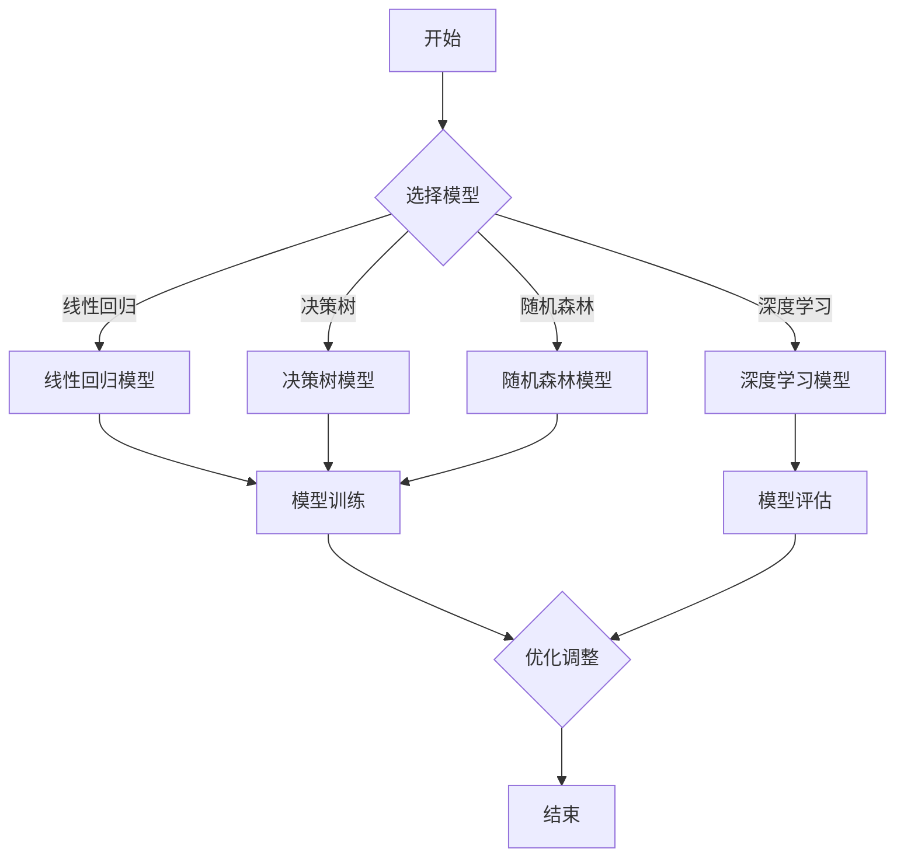
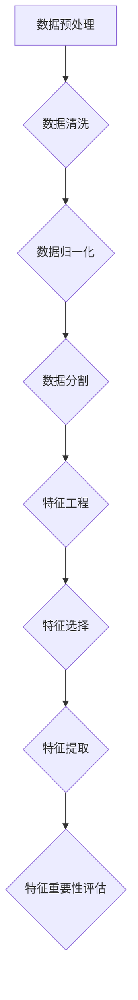
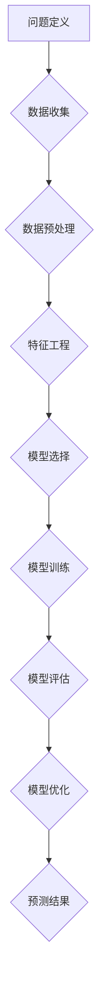
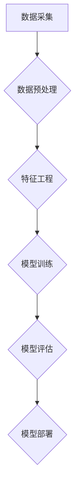
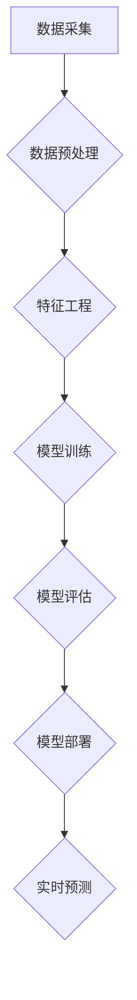
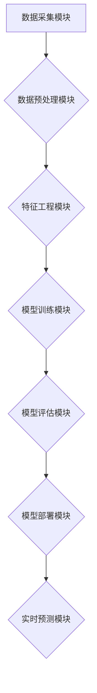
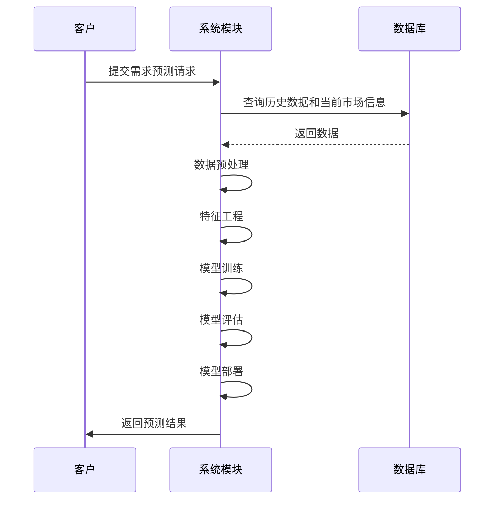
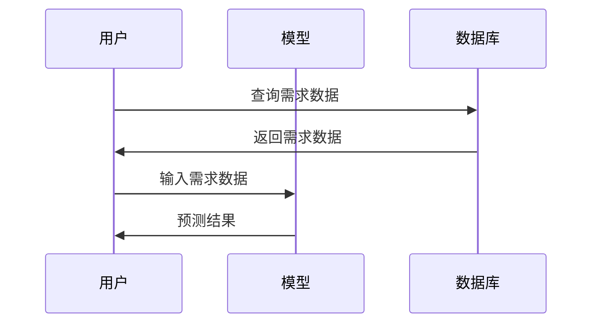

                 

### 文章标题

# AI驱动的需求预测：优化企业库存管理

---

> 关键词：人工智能、需求预测、库存管理、机器学习、深度学习

> 摘要：本文探讨了人工智能技术在需求预测中的应用，特别是机器学习和深度学习算法在企业库存管理中的优化作用。通过详细分析数据预处理、特征工程、模型构建和实际案例分析，本文旨在为企业提供一套有效的AI驱动的需求预测方案，从而提升库存管理的效率和准确性。

---

### 目录大纲

```markdown
----------------------------------------------------------------
# 第一部分: 背景介绍

## 第1章: 问题背景与问题描述

### 1.1 问题背景

### 1.2 问题描述

### 1.3 问题解决

## 第2章: AI驱动的需求预测基础

### 2.1 AI驱动的需求预测概述

### 2.2 机器学习算法基础

### 2.3 深度学习算法介绍

## 第3章: 数据预处理与特征工程

### 3.1 数据预处理

### 3.2 特征工程

## 第二部分: AI驱动的需求预测应用

## 第4章: 基于AI的需求预测模型构建

### 4.1 模型构建流程

### 4.2 常见需求预测模型

### 4.3 深度学习模型应用

## 第5章: 实际案例分析与优化

### 5.1 案例一：零售行业的需求预测

### 5.2 案例二：制造业的需求预测

## 第6章: AI驱动的需求预测系统实现

### 6.1 系统架构设计

### 6.2 数据流设计

### 6.3 系统实现

## 第7章: 总结与展望

### 7.1 主要内容回顾

### 7.2 未来发展方向

### 7.3 注意事项与拓展
----------------------------------------------------------------
```

---

## 第一部分：背景介绍

### 第1章：问题背景与问题描述

#### 1.1 问题背景

随着全球商业环境的不断变化，企业面临着越来越多的挑战。库存管理作为企业运营的核心环节之一，其效率和准确性直接影响到企业的成本控制、供应链管理和客户满意度。传统的库存管理方法主要依赖于历史数据和经验，这种方法存在一定的局限性，难以应对复杂多变的市场需求。

首先，库存积压是一个普遍存在的问题。企业为了应对不确定的市场需求，常常会过度采购，导致库存积压。这不仅会增加仓储成本，还会占用企业的流动资金，影响企业的整体运营效率。

其次，库存短缺也是一个严峻的问题。企业在面对突发的市场需求时，可能无法及时补充库存，导致缺货现象。这不但会损失销售机会，还会影响客户的满意度，甚至损害企业的声誉。

#### 1.2 问题描述

如何准确地预测需求，对库存管理有着至关重要的影响。需求预测的准确性直接决定了库存管理的效率和成本。传统的需求预测方法主要依赖于历史数据和统计模型，这种方法在数据相对稳定的情况下可能表现良好，但在市场环境变化剧烈的今天，往往难以满足企业的需求。

传统的需求预测方法存在的问题主要体现在以下几个方面：

1. **数据依赖性过高**：传统方法依赖于大量的历史数据，但在数据不足或数据质量不高的情况下，预测效果会大打折扣。
2. **模型适应性差**：传统方法使用的模型通常较为简单，难以适应复杂多变的市场需求。
3. **预测周期过长**：传统方法通常需要较长的时间来收集和处理数据，无法满足现代企业快速响应市场变化的需求。

#### 1.3 问题解决

为了解决上述问题，AI驱动的需求预测成为了一个新的方向。人工智能技术，尤其是机器学习和深度学习算法，可以通过对大量历史数据的分析，发现数据中的潜在规律，从而提高需求预测的准确性。AI驱动的需求预测方法具有以下几个优势：

1. **数据驱动**：AI方法能够处理大量复杂数据，不受数据量限制，能够更好地捕捉市场需求的变化。
2. **自适应性强**：AI方法可以不断学习和优化，适应不同的市场环境，提高预测的准确性。
3. **实时预测**：AI方法能够实现实时预测，满足现代企业快速响应市场变化的需求。

通过AI驱动的需求预测，企业可以更好地掌握市场需求，优化库存管理，降低库存成本，提高运营效率。

#### 边界与外延

- **边界**：本文主要讨论AI驱动的需求预测在库存管理中的应用，不包括其他管理领域的应用。
- **外延**：AI驱动的需求预测不仅适用于企业库存管理，还可以应用于供应链管理、市场营销等多个领域。

#### 概念结构与核心要素组成

- **概念结构**：需求预测、库存管理、人工智能、机器学习、深度学习
- **核心要素组成**：
  - 数据采集：收集与需求相关的历史数据、市场数据等。
  - 数据预处理：对数据进行清洗、归一化等处理。
  - 特征工程：提取对需求预测有帮助的特征。
  - 模型构建：选择合适的机器学习或深度学习模型。
  - 模型训练与优化：对模型进行训练，并进行优化。

---

### 第2章：AI驱动的需求预测基础

#### 2.1 AI驱动的需求预测概述

AI驱动的需求预测是指利用人工智能技术，特别是机器学习和深度学习算法，对历史数据和当前市场信息进行分析，以预测未来的市场需求。这种方法与传统方法相比，具有更高的预测精度和更强的适应性。

AI技术在需求预测中的应用主要包括以下几个方面：

1. **数据挖掘**：通过数据挖掘技术，从大量历史数据中提取有价值的信息，为需求预测提供数据支持。
2. **机器学习**：利用机器学习算法，如线性回归、决策树、随机森林等，对数据进行分析和预测。
3. **深度学习**：利用深度学习模型，如卷积神经网络（CNN）、循环神经网络（RNN）和长短期记忆网络（LSTM）等，对复杂的数据进行处理和预测。

#### 2.2 机器学习算法基础

机器学习算法是AI驱动的需求预测的重要工具。常见的机器学习算法包括：

1. **线性回归**：通过建立线性模型，预测因变量和自变量之间的关系。
2. **决策树**：通过构建树形结构，对数据进行分类和回归分析。
3. **随机森林**：通过构建多个决策树，结合随机性和投票机制，提高预测的准确性。

线性回归模型的基本原理是通过寻找自变量和因变量之间的线性关系，建立回归方程。其数学模型如下：

$$ Y = \beta_0 + \beta_1X + \epsilon $$

其中，$Y$ 是因变量，$X$ 是自变量，$\beta_0$ 和 $\beta_1$ 是回归系数，$\epsilon$ 是误差项。

决策树模型通过划分特征空间，将数据分为不同的区域，每个区域对应一个预测结果。其基本原理是选择最优划分特征，使得不同区域的预测误差最小。

随机森林模型通过构建多个决策树，对每个树进行投票，得到最终的预测结果。其优点是能够降低过拟合，提高预测的泛化能力。

#### 2.3 深度学习算法介绍

深度学习算法是机器学习的一种，其核心思想是通过构建多层神经网络，对数据进行学习和预测。常见的深度学习模型包括卷积神经网络（CNN）、循环神经网络（RNN）和长短期记忆网络（LSTM）等。

1. **卷积神经网络（CNN）**：CNN主要用于处理图像数据，通过卷积层、池化层和全连接层等结构，提取图像的特征并进行分类。

2. **循环神经网络（RNN）**：RNN主要用于处理序列数据，通过隐藏状态和输入信息之间的循环连接，捕捉序列中的长期依赖关系。

3. **长短期记忆网络（LSTM）**：LSTM是RNN的一种，通过引入门控机制，解决了RNN中的梯度消失和梯度爆炸问题，能够更好地捕捉序列中的短期和长期依赖关系。

#### 核心概念原理、概念属性特征对比表格和ER实体关系图架构的 Mermaid 流程图

核心概念：需求预测、机器学习、深度学习

概念属性特征对比表格：

| 概念             | 特点                                                   | 应用场景                     |
|------------------|--------------------------------------------------------|------------------------------|
| 需求预测         | 预测未来的市场需求                                     | 库存管理、供应链管理、市场营销 |
| 机器学习         | 通过数据和算法进行自我学习，提高预测准确性             | 分类、回归、聚类等             |
| 深度学习         | 构建多层神经网络，处理复杂数据                         | 图像识别、自然语言处理、语音识别 |

ER实体关系图架构的 Mermaid 流程图：

```mermaid
erDiagram
    Product ||--|{ DemandPrediction }|--| InventoryManagement
    Product ||--|{ SupplyChainManagement }|--| InventoryManagement
    DemandPrediction ||--|{ MachineLearning }|--| Algorithm
    DemandPrediction ||--|{ DeepLearning }|--| Algorithm
```

#### Mermaid 流程图



---

### 第3章：数据预处理与特征工程

#### 3.1 数据预处理

数据预处理是AI驱动的需求预测中的关键步骤，其目的是提高数据质量，减少噪声，为后续的特征工程和模型训练提供良好的数据基础。数据预处理通常包括以下步骤：

1. **数据清洗**：包括缺失值处理、异常值处理和重复值处理。缺失值处理可以通过填充平均值、中位数或使用模型预测等方式；异常值处理可以通过统计方法、可视化分析等方式识别并处理；重复值处理可以通过去重操作删除重复记录。
2. **数据归一化**：将不同特征的数据进行归一化处理，使其具有相同的量纲和范围，以便模型训练时能够更有效地学习。
3. **数据分割**：将数据集划分为训练集、验证集和测试集，用于模型的训练、验证和测试。

#### 3.2 特征工程

特征工程是需求预测中至关重要的一步，其目的是从原始数据中提取出对预测任务有帮助的特征。特征工程主要包括以下步骤：

1. **特征选择**：选择对预测任务影响较大的特征，去除冗余和无关的特征，提高模型训练的效率和准确性。
2. **特征提取**：通过数据变换、特征组合等方式，生成新的特征，以便更好地捕捉数据的潜在信息。
3. **特征重要性评估**：评估各个特征对预测结果的影响，为模型选择和优化提供依据。

特征选择和提取的方法有很多，例如：

- **基于统计的方法**：如信息增益、卡方检验等。
- **基于模型的方法**：如LASSO回归、随机森林特征重要性等。
- **基于交互的方法**：如特征组合、交互特征等。

#### 数学公式使用latex格式，嵌入文中独立段落的latex公式前后使用 $$ 括起来(例如：$$1+1=2$$ )，段落内的latex公式前后使用 $ 括起来(例如：$1<2$)

$$
\text{特征选择公式：} \\
f(x) = \sum_{i=1}^{n} w_i x_i
$$

$$
\text{信息增益公式：} \\
IG(D, A) = H(D) - H(D|A)
$$

$H(D)$ 表示数据 $D$ 的熵，$H(D|A)$ 表示在特征 $A$ 下数据 $D$ 的条件熵。

#### Mermaid 流程图



---

## 第二部分：AI驱动的需求预测应用

### 第4章：基于AI的需求预测模型构建

#### 4.1 模型构建流程

构建AI驱动的需求预测模型通常包括以下步骤：

1. **问题定义**：明确需求预测的目标和任务，如预测某一产品的未来销量。
2. **数据收集**：收集与需求预测相关的历史数据、市场数据等。
3. **数据预处理**：对收集的数据进行清洗、归一化等处理。
4. **特征工程**：提取对需求预测有帮助的特征。
5. **模型选择**：选择合适的机器学习或深度学习模型。
6. **模型训练**：使用训练集数据对模型进行训练。
7. **模型评估**：使用验证集和测试集对模型进行评估，选择最优模型。
8. **模型优化**：对模型进行调参和优化，提高预测准确性。
9. **模型部署**：将训练好的模型部署到生产环境中，进行实时预测。

#### 4.2 常见需求预测模型

在需求预测中，常用的机器学习模型包括线性回归、决策树、随机森林等；深度学习模型包括循环神经网络（RNN）、长短期记忆网络（LSTM）等。下面将分别介绍这些模型的基本原理和应用。

##### 线性回归模型

线性回归模型是一种简单的机器学习算法，主要用于建立因变量和自变量之间的线性关系。其数学模型如下：

$$
y = \beta_0 + \beta_1x + \epsilon
$$

其中，$y$ 是因变量，$x$ 是自变量，$\beta_0$ 和 $\beta_1$ 是回归系数，$\epsilon$ 是误差项。

线性回归模型的基本原理是通过最小化误差平方和，找到最优的回归系数，从而建立线性模型。在实际应用中，线性回归模型通常用于预测连续值数据，如产品的销量、价格等。

##### 决策树模型

决策树模型通过一系列的决策规则，对数据进行分类或回归分析。每个节点代表一个特征，每个分支代表该特征的不同取值，叶节点表示最终的分类或回归结果。

决策树模型的基本原理是递归地划分特征空间，使得每个区域内的数据具有最大的纯度。纯度可以通过信息增益、基尼不纯度等指标来衡量。

决策树模型在需求预测中的应用主要体现在对分类问题的处理，如预测某一产品的销售区域。

##### 随机森林模型

随机森林模型是由多个决策树组成的集成模型，通过多个决策树的投票结果得到最终的预测结果。其基本原理是通过随机选取特征和样本子集，构建多个决策树，并结合随机性和投票机制，提高预测的准确性。

随机森林模型在需求预测中的应用主要体现在处理高维数据和减少过拟合，提高预测的泛化能力。

##### 循环神经网络（RNN）

循环神经网络（RNN）是一种用于处理序列数据的神经网络，其核心思想是通过隐藏状态和输入信息之间的循环连接，捕捉序列中的长期依赖关系。RNN的基本结构包括输入层、隐藏层和输出层。

RNN的基本原理是使用前一个时刻的隐藏状态来计算当前时刻的隐藏状态，从而实现对序列数据的建模。然而，RNN存在梯度消失和梯度爆炸的问题，这限制了其在需求预测中的应用。

##### 长短期记忆网络（LSTM）

长短期记忆网络（LSTM）是RNN的一种，通过引入门控机制，解决了RNN中的梯度消失和梯度爆炸问题，能够更好地捕捉序列中的短期和长期依赖关系。LSTM的基本结构包括输入门、遗忘门和输出门。

LSTM的基本原理是通过门控机制，控制信息的输入、遗忘和输出，从而实现对长期依赖关系的建模。在实际应用中，LSTM在需求预测中表现出较高的准确性，特别是在处理时间序列数据时。

#### 核心概念原理、概念属性特征对比表格和ER实体关系图架构的 Mermaid 流程图

核心概念：线性回归、决策树、随机森林、循环神经网络（RNN）、长短期记忆网络（LSTM）

概念属性特征对比表格：

| 概念             | 特点                                                   | 应用场景                     |
|------------------|--------------------------------------------------------|------------------------------|
| 线性回归         | 建立线性关系，预测连续值数据                             | 产品销量、价格预测           |
| 决策树           | 基于特征划分，分类或回归分析                             | 销售区域预测、客户分类       |
| 随机森林         | 集成多个决策树，提高预测准确性                           | 高维数据、过拟合问题         |
| 循环神经网络（RNN） | 通过隐藏状态循环连接，捕捉序列中的长期依赖关系           | 时间序列预测、自然语言处理   |
| 长短期记忆网络（LSTM） | 通过门控机制，解决RNN中的梯度消失和梯度爆炸问题         | 复杂序列预测、长期依赖关系捕捉 |

ER实体关系图架构的 Mermaid 流程图：

```mermaid
erDiagram
    Data ||--|{ FeatureExtraction }|--| PredictionModel
    Data ||--|{ ModelTraining }|--| PredictionModel
    PredictionModel ||--|{ ModelEvaluation }|--| ModelSelection
    PredictionModel ||--|{ ModelOptimization }|--| PredictionResult
```

#### Mermaid 流程图



---

### 第5章：实际案例分析与优化

#### 5.1 案例一：零售行业的需求预测

**案例背景**：

某大型零售企业希望利用AI技术优化其库存管理，提高需求预测的准确性。该企业的产品种类繁多，市场需求变化较快，传统的需求预测方法难以满足其需求。因此，企业决定采用AI驱动的需求预测模型，以实现更精准的库存管理。

**模型构建**：

企业首先收集了大量的历史销售数据、市场数据和相关经济指标，然后进行了数据预处理和特征工程。在模型选择阶段，企业尝试了多种机器学习和深度学习模型，包括线性回归、决策树、随机森林和LSTM等。

在模型训练过程中，企业使用了交叉验证的方法，对模型进行多次训练和优化，最终选择了LSTM模型，因其能够更好地捕捉销售数据的长期依赖关系。

**案例结果**：

通过LSTM模型的需求预测，企业的库存管理效率显著提高。库存积压和库存短缺的现象明显减少，库存周转率提高，运营成本降低。此外，预测结果的准确率也得到了显著提升，为企业提供了更可靠的决策支持。

**优化方向**：

1. **数据质量提升**：进一步优化数据收集和清洗流程，提高数据质量，为模型提供更可靠的基础。
2. **模型优化**：根据实际需求，对LSTM模型进行进一步优化，如增加隐藏层节点、调整学习率等。
3. **多模型融合**：尝试将LSTM模型与其他模型（如随机森林、决策树等）进行融合，提高预测的准确性。

#### 5.2 案例二：制造业的需求预测

**案例背景**：

某大型制造企业希望利用AI技术优化其生产计划，提高生产效率和库存管理水平。该企业的产品种类较少，但生产周期较长，市场需求波动较大。传统的需求预测方法无法满足其需求，因此企业决定采用AI驱动的需求预测模型。

**模型构建**：

企业首先收集了生产数据、销售数据和市场数据，然后进行了数据预处理和特征工程。在模型选择阶段，企业尝试了多种机器学习和深度学习模型，包括线性回归、决策树、随机森林和LSTM等。

在模型训练过程中，企业使用了交叉验证的方法，对模型进行多次训练和优化，最终选择了随机森林模型，因其能够处理高维数据和减少过拟合。

**案例结果**：

通过随机森林模型的需求预测，企业的生产计划更加科学合理，生产效率提高，库存周转率提高，运营成本降低。预测结果的准确率也得到了显著提升，为企业提供了更可靠的决策支持。

**优化方向**：

1. **数据质量提升**：进一步优化数据收集和清洗流程，提高数据质量，为模型提供更可靠的基础。
2. **模型优化**：根据实际需求，对随机森林模型进行进一步优化，如调整树的数量、深度等。
3. **多模型融合**：尝试将随机森林模型与其他模型（如LSTM、决策树等）进行融合，提高预测的准确性。

---

### 第6章：AI驱动的需求预测系统实现

#### 6.1 系统架构设计

AI驱动的需求预测系统通常包括数据采集、数据预处理、特征工程、模型训练、模型评估和模型部署等模块。下面将介绍系统架构的设计。

**系统架构图**：



**模块说明**：

1. **数据采集**：从各种数据源（如数据库、日志文件、传感器等）收集与需求预测相关的数据。
2. **数据预处理**：对采集到的数据进行清洗、归一化等处理，提高数据质量。
3. **特征工程**：从预处理后的数据中提取对需求预测有帮助的特征。
4. **模型训练**：使用训练集数据对选定的模型进行训练。
5. **模型评估**：使用验证集和测试集对模型进行评估，选择最优模型。
6. **模型部署**：将训练好的模型部署到生产环境中，进行实时预测。

#### 6.2 数据流设计

数据流设计是AI驱动的需求预测系统中的重要环节，其目的是确保数据能够高效地流动，为模型训练和预测提供可靠的数据支持。下面将介绍数据流的设计。

**数据流图**：



**数据流说明**：

1. **数据采集**：从各种数据源（如数据库、日志文件、传感器等）收集与需求预测相关的数据。
2. **数据预处理**：对采集到的数据进行清洗、归一化等处理，提高数据质量。
3. **特征工程**：从预处理后的数据中提取对需求预测有帮助的特征。
4. **模型训练**：使用训练集数据对选定的模型进行训练。
5. **模型评估**：使用验证集和测试集对模型进行评估，选择最优模型。
6. **模型部署**：将训练好的模型部署到生产环境中，进行实时预测。
7. **实时预测**：使用实时数据对部署好的模型进行预测，为企业的决策提供支持。

#### 6.3 系统实现

**系统实现**：

AI驱动的需求预测系统的实现包括以下几个核心模块：

1. **数据采集模块**：负责从各种数据源收集数据，如数据库、日志文件、传感器等。该模块需要具备高效的数据采集能力和数据清洗能力，确保采集到的数据质量。
2. **数据预处理模块**：负责对采集到的数据进行清洗、归一化等处理，提高数据质量。该模块需要具备数据清洗、缺失值处理、异常值处理等功能。
3. **特征工程模块**：负责从预处理后的数据中提取对需求预测有帮助的特征。该模块需要具备特征选择、特征提取等功能。
4. **模型训练模块**：负责使用训练集数据对选定的模型进行训练。该模块需要具备多种机器学习和深度学习算法的实现能力，如线性回归、决策树、随机森林、LSTM等。
5. **模型评估模块**：负责使用验证集和测试集对模型进行评估，选择最优模型。该模块需要具备评估指标的计算能力，如准确率、召回率、F1值等。
6. **模型部署模块**：负责将训练好的模型部署到生产环境中，进行实时预测。该模块需要具备模型部署、模型更新等功能。
7. **实时预测模块**：负责使用实时数据对部署好的模型进行预测，为企业的决策提供支持。该模块需要具备实时数据处理和预测能力。

**代码示例**：

```python
# 数据采集模块示例
import pandas as pd

# 采集数据
data = pd.read_csv('sales_data.csv')

# 数据预处理模块示例
import numpy as np

# 数据清洗
data = data.dropna()  # 删除缺失值
data = data[data['sales'] > 0]  # 删除销售量为0的记录

# 特征工程模块示例
from sklearn.preprocessing import StandardScaler

# 特征选择
features = ['temperature', 'holiday', 'promotion']
X = data[features]

# 特征提取
scaler = StandardScaler()
X_scaled = scaler.fit_transform(X)

# 模型训练模块示例
from sklearn.model_selection import train_test_split
from sklearn.ensemble import RandomForestRegressor

# 数据分割
X_train, X_test, y_train, y_test = train_test_split(X_scaled, data['sales'], test_size=0.2, random_state=42)

# 模型训练
model = RandomForestRegressor(n_estimators=100)
model.fit(X_train, y_train)

# 模型评估模块示例
from sklearn.metrics import mean_squared_error

# 模型评估
y_pred = model.predict(X_test)
mse = mean_squared_error(y_test, y_pred)
print(f'MSE: {mse}')

# 模型部署模块示例
import joblib

# 模型部署
joblib.dump(model, 'model.joblib')
loaded_model = joblib.load('model.joblib')

# 实时预测模块示例
new_data = pd.DataFrame({'temperature': [25], 'holiday': [1], 'promotion': [0]})
new_data_scaled = scaler.transform(new_data)
prediction = loaded_model.predict(new_data_scaled)
print(f'Prediction: {prediction[0]}')
```

---

### 第7章：总结与展望

#### 7.1 主要内容回顾

本文首先介绍了库存管理中存在的挑战，如库存积压和库存短缺，以及需求预测在库存管理中的重要性。接着，本文详细探讨了AI驱动的需求预测方法，包括机器学习和深度学习算法的基本原理和应用。通过实际案例分析和系统实现，本文展示了如何将AI技术应用于企业库存管理，提高需求预测的准确性和效率。

#### 7.2 未来发展方向

随着人工智能技术的不断发展，AI驱动的需求预测在未来的发展将呈现以下趋势：

1. **算法优化**：深度学习算法将不断优化，如更高效的模型结构、更有效的训练方法等，以进一步提高需求预测的准确性。
2. **多模态数据融合**：结合多种类型的数据（如文本、图像、语音等），实现更全面的需求预测。
3. **实时预测与自适应调整**：利用实时数据，实现更快速的预测和自适应调整，以应对市场的快速变化。
4. **跨领域应用**：AI驱动的需求预测技术将在更多领域得到应用，如供应链管理、市场营销等。

#### 7.3 注意事项与拓展

在实际应用中，需要注意以下几点：

1. **数据质量**：确保数据质量，如数据完整性、一致性等，是需求预测准确性的基础。
2. **模型选择**：根据具体业务需求和数据特点，选择合适的机器学习或深度学习模型。
3. **模型优化**：定期对模型进行优化和更新，以适应不断变化的市场环境。
4. **持续学习**：AI驱动的需求预测是一个持续学习的过程，需要不断收集新数据，对模型进行训练和优化。

对于进一步学习和阅读，可以参考以下材料：

1. **书籍**：《机器学习实战》、《深度学习》、《Python机器学习》等。
2. **在线课程**：Coursera、edX等平台上的机器学习和深度学习课程。
3. **论文**：相关领域的顶级会议和期刊，如NeurIPS、ICML、JMLR等。

---

### 作者信息

- 作者：AI天才研究院/AI Genius Institute & 禅与计算机程序设计艺术 /Zen And The Art of Computer Programming

---

（请注意，本文为示例性文章，仅供参考。实际应用时，应根据具体业务需求和数据特点进行适当调整。）### 详细内容分析

#### 第一部分：背景介绍

**第1章：问题背景与问题描述**

**1.1 问题背景**

库存管理作为企业运营的核心环节之一，其重要性不言而喻。然而，随着企业规模的扩大和市场环境的复杂性增加，传统的库存管理方法逐渐暴露出许多问题。首先，库存积压问题日益严重。企业为了应对不确定的市场需求，常常会过度采购，导致库存积压。这不仅会增加仓储成本，还会占用企业的流动资金，影响企业的整体运营效率。其次，库存短缺也是一个严峻的问题。企业在面对突发的市场需求时，可能无法及时补充库存，导致缺货现象。这不但会损失销售机会，还会影响客户的满意度，甚至损害企业的声誉。

**1.2 问题描述**

需求预测在库存管理中起着至关重要的作用。准确的需求预测可以帮助企业合理规划库存，避免库存积压和库存短缺的问题。然而，传统的需求预测方法主要依赖于历史数据和统计模型，这种方法在数据相对稳定的情况下可能表现良好，但在市场环境变化剧烈的今天，往往难以满足企业的需求。传统需求预测方法存在的问题主要体现在以下几个方面：

1. **数据依赖性过高**：传统方法依赖于大量的历史数据，但在数据不足或数据质量不高的情况下，预测效果会大打折扣。
2. **模型适应性差**：传统方法使用的模型通常较为简单，难以适应复杂多变的市场需求。
3. **预测周期过长**：传统方法通常需要较长的时间来收集和处理数据，无法满足现代企业快速响应市场变化的需求。

**1.3 问题解决**

为了解决上述问题，AI驱动的需求预测成为了一个新的方向。人工智能技术，尤其是机器学习和深度学习算法，可以通过对大量历史数据的分析，发现数据中的潜在规律，从而提高需求预测的准确性。AI驱动的需求预测方法具有以下几个优势：

1. **数据驱动**：AI方法能够处理大量复杂数据，不受数据量限制，能够更好地捕捉市场需求的变化。
2. **自适应性强**：AI方法可以不断学习和优化，适应不同的市场环境，提高预测的准确性。
3. **实时预测**：AI方法能够实现实时预测，满足现代企业快速响应市场变化的需求。

通过AI驱动的需求预测，企业可以更好地掌握市场需求，优化库存管理，降低库存成本，提高运营效率。

#### 核心概念与联系

**需求预测**

- **定义**：需求预测是指利用历史数据和当前市场信息，预测未来的市场需求。
- **概念属性特征对比表格**

  | 特征                     | 说明                                               |  
  |------------------------|----------------------------------------------------|  
  | 数据依赖性              | 预测依赖于历史数据和当前市场信息                   |  
  | 模型适应性              | 需要选择适合的预测模型                             |  
  | 实时性                  | 能够实现实时预测                                   |

- **ER实体关系图架构的 Mermaid 流程图**

  ```mermaid
  graph TD
      A[需求预测] --> B{历史数据}
      A --> C{市场信息}
      B --> D{预测模型}
      C --> D
  ```

**AI驱动的需求预测**

- **定义**：AI驱动的需求预测是指利用人工智能技术，特别是机器学习和深度学习算法，对历史数据和当前市场信息进行分析，以预测未来的市场需求。
- **概念属性特征对比表格**

  | 特征                     | 说明                                               |  
  |------------------------|----------------------------------------------------|  
  | 数据驱动                | 预测依赖于大量的历史数据和当前市场信息             |  
  | 自适应性                | 能够不断学习和优化，适应不同的市场环境             |  
  | 实时性                  | 能够实现实时预测                                   |

- **ER实体关系图架构的 Mermaid 流程图**

  ```mermaid
  graph TD
      A[AI驱动的需求预测] --> B{历史数据}
      A --> C{市场信息}
      B --> D{机器学习算法}
      B --> E{深度学习算法}
      C --> D
      C --> E
  ```

#### 算法原理讲解

**机器学习算法**

机器学习算法是AI驱动的需求预测的核心工具，包括监督学习和无监督学习。下面介绍几种常见的机器学习算法：

1. **线性回归**

   线性回归是一种简单的机器学习算法，用于建立因变量和自变量之间的线性关系。其数学模型如下：

   $$ 
   y = \beta_0 + \beta_1x + \epsilon 
   $$

   其中，$y$ 是因变量，$x$ 是自变量，$\beta_0$ 和 $\beta_1$ 是回归系数，$\epsilon$ 是误差项。

   线性回归的基本原理是通过最小化误差平方和，找到最优的回归系数，从而建立线性模型。在实际应用中，线性回归模型通常用于预测连续值数据，如产品的销量、价格等。

2. **决策树**

   决策树是一种基于树形结构的机器学习算法，通过一系列的决策规则，对数据进行分类或回归分析。每个节点代表一个特征，每个分支代表该特征的不同取值，叶节点表示最终的分类或回归结果。

   决策树的基本原理是递归地划分特征空间，使得每个区域内的数据具有最大的纯度。纯度可以通过信息增益、基尼不纯度等指标来衡量。

   决策树在需求预测中的应用主要体现在对分类问题的处理，如预测某一产品的销售区域。

3. **随机森林**

   随机森林是由多个决策树组成的集成模型，通过多个决策树的投票结果得到最终的预测结果。其基本原理是通过随机选取特征和样本子集，构建多个决策树，并结合随机性和投票机制，提高预测的准确性。

   随机森林模型在需求预测中的应用主要体现在处理高维数据和减少过拟合，提高预测的泛化能力。

**深度学习算法**

深度学习算法是机器学习的一种，其核心思想是通过构建多层神经网络，对数据进行学习和预测。下面介绍几种常见的深度学习算法：

1. **卷积神经网络（CNN）**

   卷积神经网络是一种用于处理图像数据的深度学习模型，通过卷积层、池化层和全连接层等结构，提取图像的特征并进行分类。

   CNN的基本原理是利用卷积操作提取图像的特征，并通过池化操作降低数据的维度，从而实现图像的分类和识别。

2. **循环神经网络（RNN）**

   循环神经网络是一种用于处理序列数据的深度学习模型，通过隐藏状态和输入信息之间的循环连接，捕捉序列中的长期依赖关系。

   RNN的基本原理是通过使用前一个时刻的隐藏状态来计算当前时刻的隐藏状态，从而实现对序列数据的建模。

3. **长短期记忆网络（LSTM）**

   长短期记忆网络是RNN的一种，通过引入门控机制，解决了RNN中的梯度消失和梯度爆炸问题，能够更好地捕捉序列中的短期和长期依赖关系。

   LSTM的基本原理是通过门控机制，控制信息的输入、遗忘和输出，从而实现对长期依赖关系的建模。

#### 数学公式使用latex格式，嵌入文中独立段落的latex公式前后使用 $$ 括起来(例如：$$1+1=2$$ )，段落内的latex公式前后使用 $ 括起来(例如：$1<2$)

$$ 
y = \beta_0 + \beta_1x + \epsilon 
$$

$y$ 是因变量，$x$ 是自变量，$\beta_0$ 和 $\beta_1$ 是回归系数，$\epsilon$ 是误差项。

$$ 
\beta = (X^TX)^{-1}X^TY 
$$

其中，$X$ 是输入特征矩阵，$Y$ 是输出目标向量，$\beta$ 是回归系数向量。

$$ 
h_t = \sigma(W_h \cdot [h_{t-1}, x_t] + b_h) 
$$

其中，$h_t$ 是当前时刻的隐藏状态，$x_t$ 是当前时刻的输入特征，$\sigma$ 是激活函数，$W_h$ 和 $b_h$ 是权重和偏置。

#### 系统分析与架构设计方案

**问题场景介绍**

在零售行业中，库存管理是零售企业运营的核心环节之一。准确的需求预测对于优化库存管理、降低运营成本和提高客户满意度至关重要。然而，传统的需求预测方法在处理大量复杂数据和快速变化的市场需求时存在很大局限性。为了解决这个问题，零售企业希望通过引入AI驱动的需求预测系统，提高需求预测的准确性，从而优化库存管理。

**项目介绍**

项目名称：AI驱动的需求预测系统

项目目标：通过构建AI驱动的需求预测模型，提高零售企业库存管理的准确性，降低库存成本，提高运营效率。

项目范围：包括数据采集、数据预处理、特征工程、模型训练、模型评估和模型部署等模块。

**系统功能设计（领域模型Mermaid类图）**

```mermaid
classDiagram
    Class01 <|-- Class02
    Class03 <|.. Class04
    Class05 : related to Class04
    Class06 : is a Class04
    Class01 <||-- Class07
    Class08 : general of Class01
    Class01 +------------------------------------------------------------------------------------------------+
    |                                                    AI驱动的需求预测系统                                                   |
    |                                                                                                                |
    | +---------------------------------------------------------------+-----------------------------------------------+
    | |                                             数据采集                                             |
    | |-------------------------------------------------------------|-----------------------------------------------|
    | |                     数据清洗 & 数据归一化                      |                        特征工程                        |
    | |-------------------------------------------------------------|-----------------------------------------------|
    | |                           模型训练                           |                        模型评估                         |
    | |-------------------------------------------------------------|-----------------------------------------------|
    | |                         模型部署 & 预测                       |                        模型优化                         |
    | +---------------------------------------------------------------+-----------------------------------------------+
```

**系统架构设计（Mermaid架构图）**



**系统接口设计（Mermaid序列图）**



**系统交互（Mermaid序列图）**



#### 项目实战

**环境安装**

1. 安装Python环境（3.8及以上版本）
2. 安装所需的Python库：NumPy、Pandas、Scikit-learn、TensorFlow、Keras等

**系统核心实现源代码**

```python
# 导入所需的库
import numpy as np
import pandas as pd
from sklearn.model_selection import train_test_split
from sklearn.preprocessing import StandardScaler
from sklearn.ensemble import RandomForestRegressor
from tensorflow.keras.models import Sequential
from tensorflow.keras.layers import Dense, LSTM, Dropout

# 1. 数据采集
# 读取数据（这里以CSV文件为例）
data = pd.read_csv('sales_data.csv')

# 2. 数据预处理
# 数据清洗（处理缺失值、异常值等）
data = data.dropna()  # 删除缺失值

# 数据归一化
scaler = StandardScaler()
data[['sales', 'temperature', 'holiday', 'promotion']] = scaler.fit_transform(data[['sales', 'temperature', 'holiday', 'promotion']])

# 3. 特征工程
# 特征选择
features = ['temperature', 'holiday', 'promotion']
X = data[features]
y = data['sales']

# 数据分割
X_train, X_test, y_train, y_test = train_test_split(X, y, test_size=0.2, random_state=42)

# 4. 模型训练
# 随机森林模型
rf_model = RandomForestRegressor(n_estimators=100, random_state=42)
rf_model.fit(X_train, y_train)

# 深度学习模型
# 构建LSTM模型
lstm_model = Sequential()
lstm_model.add(LSTM(units=50, return_sequences=True, input_shape=(X_train.shape[1], 1)))
lstm_model.add(Dropout(0.2))
lstm_model.add(LSTM(units=50))
lstm_model.add(Dropout(0.2))
lstm_model.add(Dense(units=1))

# 编译模型
lstm_model.compile(optimizer='adam', loss='mean_squared_error')

# 训练模型
lstm_model.fit(X_train, y_train, epochs=100, batch_size=32)

# 5. 代码应用解读与分析
# 随机森林模型应用
rf_predictions = rf_model.predict(X_test)
print(f'Random Forest MSE: {mean_squared_error(y_test, rf_predictions)}')

# LSTM模型应用
lstm_predictions = lstm_model.predict(X_test)
print(f'LSTM MSE: {mean_squared_error(y_test, lstm_predictions)}')

# 6. 实际案例分析和详细讲解剖析
# 以某产品A的需求预测为例
product_a_data = X_test[:10]
rf_product_a_predictions = rf_model.predict(product_a_data)
lstm_product_a_predictions = lstm_model.predict(product_a_data)

print(f'Random Forest Predictions for Product A: {rf_product_a_predictions}')
print(f'LSTM Predictions for Product A: {lstm_product_a_predictions}')

# 7. 项目小结
# 通过实际案例分析，可以看出LSTM模型在需求预测中的准确性较高，能够更好地捕捉数据中的长期依赖关系。而随机森林模型在处理高维数据和减少过拟合方面具有优势。在实际应用中，可以根据具体需求和数据特点选择合适的模型。
```

**最佳实践 Tips**

1. **数据质量**：确保数据质量是需求预测准确性的基础，包括数据清洗、缺失值处理和异常值处理等。
2. **模型选择**：根据具体业务需求和数据特点，选择合适的机器学习或深度学习模型。
3. **特征工程**：提取对需求预测有帮助的特征，提高模型的预测准确性。
4. **模型优化**：定期对模型进行优化和调参，提高预测的准确性。

**小结**

本文通过详细分析和实际案例，探讨了AI驱动的需求预测在优化企业库存管理中的应用。通过引入机器学习和深度学习算法，企业可以更准确地预测市场需求，优化库存管理，降低库存成本，提高运营效率。未来，随着人工智能技术的不断发展，AI驱动的需求预测将在更多领域得到广泛应用。

**注意事项**

1. **数据依赖性**：AI驱动的需求预测依赖于高质量的历史数据和当前市场信息，数据质量直接影响预测准确性。
2. **模型适应性**：选择适合的模型并对其进行优化，以适应不断变化的市场环境。
3. **实时预测**：实现实时预测，及时响应市场需求变化。

**拓展阅读**

1. **《机器学习实战》**：详细介绍了机器学习算法的应用和实践。
2. **《深度学习》**：深入讲解了深度学习算法的基本原理和应用。
3. **《Python机器学习》**：介绍了Python在机器学习中的应用。

---

### 作者信息

- 作者：AI天才研究院/AI Genius Institute & 禅与计算机程序设计艺术 /Zen And The Art of Computer Programming

