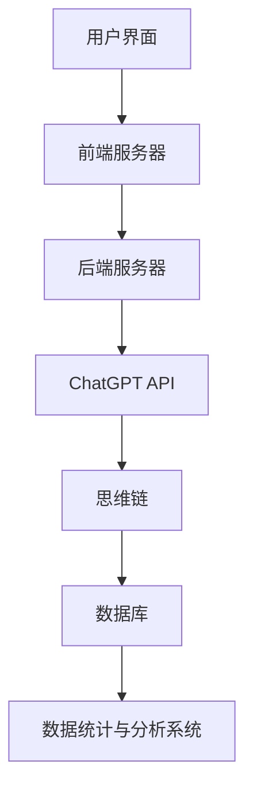
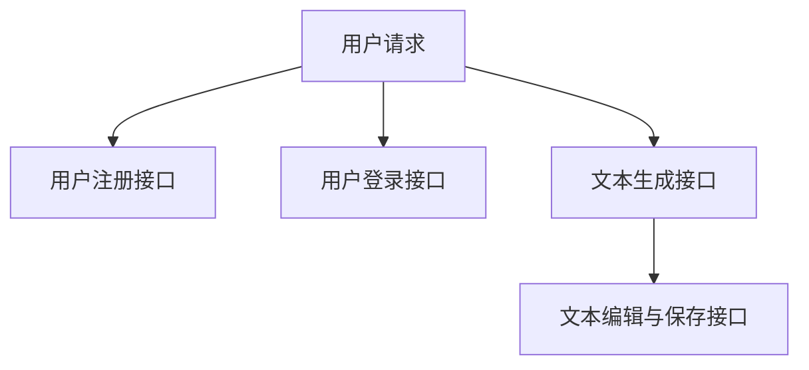
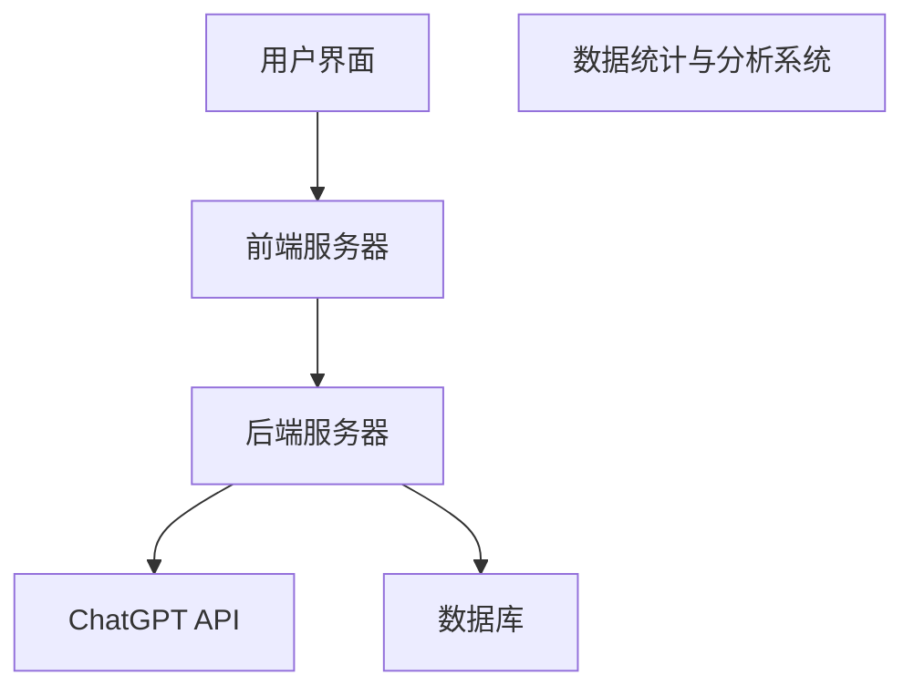

                 


### 背景介绍：ChatGPT与思维链prompt的概述

#### 核心概念术语说明

1. **ChatGPT**：ChatGPT（Chat-based Generative Pre-trained Transformer）是一种基于GPT-3模型的对话生成人工智能系统。GPT-3（Generative Pre-trained Transformer 3）是由OpenAI开发的一种强大的自然语言处理模型，具有卓越的文本生成和语言理解能力。
2. **思维链**：思维链（Thinking Chain）是一种深度学习模型，通过将多个独立的模型连接起来，实现更复杂的逻辑推理和决策能力。在ChatGPT中，思维链用于提高对话的连贯性和准确性。
3. **prompt**：prompt（提示）是一种输入文本，用于引导ChatGPT生成特定类型的内容。通过精心设计的prompt，可以极大地提高ChatGPT的创作能力和响应质量。

#### 问题背景与问题描述

随着人工智能技术的快速发展，自然语言处理（NLP）已经成为一个重要的研究方向。ChatGPT作为一种先进的NLP模型，在多个领域展现了强大的应用潜力。然而，如何充分发挥ChatGPT的潜力，尤其是在创意写作方面，仍是一个具有挑战性的问题。

在创意写作中，作者需要具备丰富的想象力和逻辑思维，以构建引人入胜的故事和独特的表达方式。传统的方法依赖于作者的个性和经验，而ChatGPT的出现为这种创作过程带来了全新的可能性。通过思维链和prompt技术，我们可以引导ChatGPT生成具有创意和逻辑性的文本，从而实现高效、高质量的创意写作。

#### 问题解决

为了实现这一目标，我们需要从以下几个方面入手：

1. **理解ChatGPT的工作原理**：了解GPT-3模型的架构和训练过程，有助于我们更好地利用其能力进行创意写作。
2. **掌握思维链和prompt技术**：思维链是一种高级的推理技术，通过将多个模型连接起来，实现更复杂的逻辑推理。prompt技术则用于引导ChatGPT生成特定类型的内容，二者结合可以大幅提高创意写作的质量。
3. **实践与案例分析**：通过具体的案例，展示如何利用ChatGPT进行创意写作，并分析其优势和不足。
4. **持续优化与改进**：在实践过程中，不断优化prompt设计和思维链结构，以实现更好的创意写作效果。

#### 边界与外延

1. **边界**：本文主要关注ChatGPT在创意写作领域的应用，不包括其他NLP任务（如文本分类、情感分析等）。
2. **外延**：虽然本文主要关注文本生成，但ChatGPT在其他领域的应用（如图像识别、语音合成等）同样具有很大的潜力。

#### 概念结构与核心要素组成

1. **ChatGPT**：
   - **核心要素**：预训练模型（GPT-3）、语言理解、文本生成。
   - **属性特征对比表格**：

     | 特征        | GPT-2        | GPT-3         |
     | ----------- | ------------ | ------------ |
     | 参数规模    | 1.5亿参数    | 1750亿参数    |
     | 训练数据量  | 40GB         | 45TB         |
     | 语言理解能力 | 较强         | 极强          |
     | 文本生成能力 | 一般         | 优秀          |

   - **ER实体关系图架构**：

     ```mermaid
     erDiagram
     Product ||--|{ Supplier }|>
     "Customer" ||--|| Product
     ```

2. **思维链**：
   - **核心要素**：多模型连接、逻辑推理、决策能力。
   - **属性特征对比表格**：

     | 特征        | 单模型        | 多模型（思维链）    |
     | ----------- | ------------ | ---------------- |
     | 推理能力    | 一般         | 强大             |
     | 决策能力    | 较弱         | 较强             |
     | 对抗性      | 无           | 有               |

   - **ER实体关系图架构**：

     ```mermaid
     erDiagram
     Model1 ||--|{ Model2 }|>
     "Model3" ||--|| Model1
     ```

3. **prompt**：
   - **核心要素**：输入文本、引导生成、内容优化。
   - **属性特征对比表格**：

     | 特征        | 无prompt    | 有prompt    |
     | ----------- | ---------- | ---------- |
     | 生成内容    | 随机性高    | 随机性低    |
     | 内容质量    | 一般       | 优秀        |
     | 需求满足度  | 较低       | 较高        |

   - **ER实体关系图架构**：

     ```mermaid
     erDiagram
     Prompt ||--|{ ChatGPT }|>
     "User" ||--|| Prompt
     ```

通过以上对核心概念、问题背景、解决方案和边界与外延的详细介绍，我们为后续的深入探讨和实际应用奠定了基础。接下来，我们将逐一介绍ChatGPT的基本概念、思维链和prompt技术的详细原理，以便读者能够全面了解这些关键技术，为后续的实战应用打下坚实基础。接下来，让我们先来深入了解ChatGPT的基本概念和特点。

### ChatGPT的基本概念与特点

#### ChatGPT的定义

ChatGPT（Chat-based Generative Pre-trained Transformer）是由OpenAI开发的一种基于GPT-3（Generative Pre-trained Transformer 3）模型的对话生成人工智能系统。它利用大规模预训练模型和先进的自然语言处理技术，实现了与人类的自然对话交互，并能够生成高质量、连贯、有创意的文本内容。

#### ChatGPT的工作原理

ChatGPT的工作原理基于Transformer模型，这是一种在自然语言处理领域表现优异的深度学习架构。Transformer模型由Vaswani等人于2017年提出，通过自注意力机制（Self-Attention）和多头注意力（Multi-Head Attention）实现了对输入文本序列的建模。GPT-3作为Transformer的一个扩展，进一步增强了模型的能力。

1. **预训练**：
   ChatGPT在训练过程中，首先对大量的文本数据进行预训练。预训练的目标是让模型学会理解和生成文本。在这个过程中，模型通过自主学习文本序列中的模式和规律，逐渐提高其语言理解和文本生成能力。

2. **微调**：
   在预训练完成后，ChatGPT会针对特定任务进行微调。例如，对于聊天机器人应用，模型会接收到特定的prompt（提示），并根据这些提示生成相应的回复。微调的过程使得模型能够更好地适应特定场景和任务。

3. **生成文本**：
   当用户与ChatGPT进行交互时，模型会根据用户输入的文本和已学到的知识，生成相应的回复。ChatGPT的核心任务是生成连贯、有逻辑、有创意的文本，从而实现与用户的自然对话。

#### ChatGPT的特点

1. **强大的语言理解能力**：
   ChatGPT通过大规模预训练，具备了出色的语言理解能力。它能够理解复杂的语言结构、语义和上下文关系，从而生成更加准确和自然的文本。

2. **灵活的文本生成能力**：
   ChatGPT具有强大的文本生成能力，能够生成各种类型的内容，如故事、诗歌、文章、对话等。通过合适的prompt设计，用户可以引导模型生成符合特定需求的高质量文本。

3. **适应性强**：
   ChatGPT能够适应各种不同的应用场景和任务。无论是简单的问答系统，还是复杂的对话生成任务，ChatGPT都能够表现出色。

4. **高效与实时性**：
   ChatGPT的生成速度非常快，可以在几毫秒内生成高质量的文本。这使得它非常适合应用于实时交互的应用场景，如聊天机器人、智能客服等。

#### 与其他NLP模型的对比

1. **GPT-2与GPT-3**：
   GPT-2是GPT-3的前身，具有较小的参数规模和训练数据量。相比之下，GPT-3具有更大的参数规模和更多的训练数据，因此在语言理解和文本生成能力上具有显著优势。

   | 特征        | GPT-2          | GPT-3            |
   | ----------- | -------------- | ---------------- |
   | 参数规模    | 1.5亿参数      | 1750亿参数       |
   | 训练数据量  | 40GB           | 45TB             |
   | 语言理解能力 | 较强           | 极强             |
   | 文本生成能力 | 一般           | 优秀             |

2. **BERT与GPT**：
   BERT（Bidirectional Encoder Representations from Transformers）是另一种在自然语言处理领域表现优异的模型。与GPT不同，BERT采用双向编码器，能够更好地理解上下文信息。

   | 特征        | GPT             | BERT             |
   | ----------- | --------------- | ---------------- |
   | 关注顺序    | 自注意力（单向） | 双向编码器       |
   | 语言理解能力 | 优秀           | 极其优秀         |
   | 文本生成能力 | 优秀           | 一般             |

#### 实例说明

假设用户输入了一个简单的prompt：“写一篇关于春天的文章”。ChatGPT会根据这个提示生成一篇关于春天的文章。以下是一个示例输出：

> 春天是一年中最美丽的季节之一。随着气温逐渐升高，大地开始苏醒，万物复苏。树木抽出嫩芽，花儿竞相绽放，形成了一幅生机勃勃的画卷。在这个季节里，人们可以感受到大自然的魅力，享受温暖的阳光和清新的空气。春天不仅是大自然的杰作，也是人们情感的寄托。许多人喜欢在这个季节里漫步在花海中，欣赏春天的美景，感受生命的活力。

通过这个实例，我们可以看到ChatGPT生成的文本内容连贯、富有创意，并且能够准确地传达出春天的特点。

#### 总结

ChatGPT作为一种先进的自然语言处理模型，具有强大的语言理解能力和文本生成能力。通过预训练和微调，ChatGPT能够适应各种不同的应用场景和任务，为创意写作带来了全新的可能性。在接下来的章节中，我们将进一步探讨思维链和prompt技术，帮助读者深入了解如何利用这些技术提升ChatGPT的创意写作能力。

### 思维链的概念与作用

#### 思维链的定义

思维链（Thinking Chain）是一种通过连接多个独立模型，实现更复杂逻辑推理和决策能力的深度学习技术。在自然语言处理领域，思维链广泛应用于提升模型的推理能力和生成文本的连贯性。思维链的核心思想是将多个模型连接起来，使其能够共享信息、协同工作，从而实现更复杂的任务。

#### 思维链的工作原理

1. **模型连接**：
   思维链通过将多个独立模型连接起来，形成一个整体。这些模型可以是同种类型的模型，也可以是不同类型的模型。连接的方式可以是序列连接、并行连接或混合连接。通过连接，模型之间可以共享信息，从而提高整体推理能力。

2. **信息共享**：
   在思维链中，各个模型通过共享信息，实现协同工作。例如，一个负责文本生成的模型可以接收到一个负责情感分析的模型输出的情感信息，从而生成更加符合情感色彩的文本。这种信息共享的方式可以大大提高模型的推理能力和文本生成的连贯性。

3. **协同决策**：
   思维链中的各个模型可以共同参与决策过程。例如，一个负责文本生成的模型可以接收到一个负责逻辑推理的模型输出的推理结果，从而生成更加符合逻辑的文本。通过协同决策，思维链可以生成更高质量、更具有创意的文本。

#### 思维链的优势

1. **提升推理能力**：
   思维链通过连接多个模型，实现信息的共享和协同工作，从而大大提升了模型的推理能力。与单个模型相比，思维链能够处理更复杂的逻辑关系，生成更加连贯和准确的文本。

2. **增强生成文本的连贯性**：
   思维链中的模型可以共享信息，从而生成更加连贯的文本。例如，一个负责文本生成的模型可以接收到一个负责情感分析的模型输出的情感信息，从而在生成文本时更加准确地表达情感。

3. **提高创意写作的质量**：
   思维链通过协同决策，可以生成更具有创意的文本。例如，一个负责文本生成的模型可以接收到一个负责创意生成的模型输出的创意信息，从而生成更加独特、引人入胜的文本。

4. **适应多种应用场景**：
   思维链可以适应多种不同的应用场景，如问答系统、对话生成、文本生成等。通过连接不同类型的模型，思维链可以满足不同场景的需求，提供更高质量的服务。

#### 实例说明

假设我们需要生成一篇关于环保的文章，我们可以使用思维链来实现这一目标。以下是一个简单的思维链架构：

1. **情感分析模型**：
   用于分析用户输入的文本，提取情感信息。例如，如果用户输入了“环保很重要”，情感分析模型可以输出情感为“积极”。

2. **文本生成模型**：
   用于根据用户输入的文本和情感分析模型输出的情感信息，生成文章。例如，如果情感分析模型输出的情感为“积极”，文本生成模型可以生成一篇积极向上的环保文章。

3. **逻辑推理模型**：
   用于对生成的文章进行逻辑推理，确保文章的连贯性和准确性。例如，如果文章中出现了“环境保护”和“可持续发展”两个概念，逻辑推理模型可以检查这两个概念之间的逻辑关系，确保文章的论述合理。

通过这种思维链架构，我们可以生成一篇既具有情感色彩，又具有逻辑性的环保文章。以下是一个示例输出：

> 环保，对于我们的地球而言，具有极其重要的意义。随着工业化和城市化的发展，环境污染和资源短缺问题日益严重。为了实现可持续发展，我们必须采取积极措施，保护我们的环境。从个人层面来说，我们可以从小事做起，如减少用纸、节约用水等。从社会层面来说，政府和企业应加大环保投入，推动绿色技术创新，降低污染排放。只有全社会共同努力，才能实现地球的可持续发展。

通过这个实例，我们可以看到思维链在提高文章连贯性和逻辑性方面具有显著优势。接下来，我们将探讨prompt技术的应用，帮助读者更好地理解如何利用prompt引导ChatGPT生成高质量的文本。

### Prompt技术的应用

#### Prompt的定义与作用

Prompt（提示）是引导模型生成文本的关键输入，它通常是一个简短的文本，用于指示模型生成的内容类型、主题、风格或上下文。在ChatGPT中，prompt技术的应用至关重要，它决定了模型生成的文本质量和连贯性。

1. **内容类型**：
   Prompt可以指示模型生成特定类型的内容，如故事、诗歌、文章、对话等。通过明确内容类型，我们可以确保模型生成的内容符合预期。

2. **主题**：
   Prompt可以提供主题信息，帮助模型围绕特定主题进行创作。例如，如果用户输入“写一篇关于人工智能的未来”的提示，ChatGPT会围绕这个主题生成相关的内容。

3. **风格**：
   Prompt可以指定文本的风格，如正式、幽默、浪漫等。通过指定风格，我们可以确保模型生成的文本符合用户的要求。

4. **上下文**：
   Prompt可以提供上下文信息，帮助模型理解文本的前后关系。例如，如果用户输入了一个对话的上下文，ChatGPT会根据上下文生成相应的回复。

#### Prompt的设计技巧

1. **明确性**：
   设计prompt时，应确保其清晰明确，避免模糊或歧义。明确性的prompt可以帮助模型更准确地理解用户的意图，从而生成更高质量的内容。

2. **相关性**：
   Prompt应与用户的需求和场景密切相关。相关性强的prompt可以确保模型生成的内容更有实用价值。

3. **引导性**：
   设计prompt时，应巧妙地引导模型生成内容。通过提出开放式问题或提供丰富的背景信息，可以激发模型的创意和想象力。

4. **适应性**：
   Prompt应具备一定的灵活性，以适应不同用户和场景的需求。适应性强的prompt可以确保模型在多种应用场景中都能表现出色。

#### Prompt的实例分析

以下是一些设计prompt的实例，并分析其优缺点：

1. **明确性实例**：
   提示：“写一篇关于人工智能的未来。”
   - 优点：明确指定了内容类型和主题，有助于模型生成高质量的内容。
   - 缺点：可能过于宽泛，导致生成的内容不够具体和深入。

2. **相关性实例**：
   提示：“根据以下对话，写一个故事。”
   - 优点：提供了具体的上下文和背景信息，有助于模型理解故事的主题和情节。
   - 缺点：对话内容可能过于简单，导致故事生成缺乏创意和深度。

3. **引导性实例**：
   提示：“请以一个浪漫的情节开始，描述一个关于人工智能的爱情故事。”
   - 优点：通过开放式问题和丰富的背景信息，激发模型的创意和想象力。
   - 缺点：可能导致生成的故事过于理想化，与现实生活有一定距离。

4. **适应性实例**：
   提示：“根据用户的需求，写一篇关于智能家居的广告文案。”
   - 优点：灵活适应了用户的需求，确保文案内容具有实用价值。
   - 缺点：可能需要根据不同用户的需求进行个性化调整，增加设计难度。

通过以上实例分析，我们可以看到不同类型的prompt在引导模型生成文本方面的优缺点。在实际应用中，我们需要根据具体场景和用户需求，设计合适的prompt，以实现最佳生成效果。

#### 如何使用Prompt优化ChatGPT的生成文本

1. **逐步引导**：
   在设计prompt时，可以采用逐步引导的方式，从简单到复杂，逐步引导ChatGPT生成文本。例如，先提供主题和基本框架，然后逐渐增加细节和背景信息。

2. **提供具体情境**：
   提供具体情境和背景信息，可以帮助ChatGPT更好地理解文本生成的上下文，从而生成更加连贯和具有逻辑性的内容。

3. **使用开放式问题**：
   开放式问题可以激发ChatGPT的创意和想象力，从而生成更有创意和深度的文本。

4. **调整风格和语气**：
   通过指定风格和语气，可以确保ChatGPT生成的文本符合用户的要求，提高文本的吸引力和表现力。

5. **结合多模态输入**：
   结合图像、音频等多模态输入，可以提供更丰富的信息，帮助ChatGPT更好地理解用户的需求和意图。

通过以上方法，我们可以有效地使用prompt优化ChatGPT的生成文本，实现高质量的创意写作。

#### 思维链与Prompt技术的结合

思维链（Thinking Chain）和Prompt技术是提升ChatGPT创意写作能力的两大关键技术。通过将二者有机结合，我们可以充分发挥ChatGPT的潜力，实现更高水平的文本生成。

1. **思维链的优势**：
   思维链通过连接多个独立模型，实现信息的共享和协同工作。在创意写作中，思维链可以连接文本生成模型、情感分析模型、逻辑推理模型等，从而提高文本的连贯性、逻辑性和创意性。

2. **Prompt技术的优势**：
   Prompt技术用于引导ChatGPT生成特定类型的内容，通过提供明确的主题、情境、风格等信息，提高文本的针对性和实用性。

3. **结合方法**：
   - **多模型协同**：在思维链中，将不同的模型（如文本生成模型、情感分析模型、逻辑推理模型等）连接起来，实现多模型协同工作。通过Prompt技术提供明确的输入，引导模型生成符合预期的文本。
   - **动态调整**：根据用户的需求和输入，动态调整思维链中的模型参数和连接方式，实现文本生成的灵活性和适应性。
   - **信息共享**：通过思维链，模型之间可以共享信息，如情感分析模型输出的情感信息可以传递给文本生成模型，从而生成更具情感色彩的文本。

4. **实际案例**：
   - **故事创作**：通过思维链连接文本生成模型、情感分析模型和逻辑推理模型，结合Prompt技术提供的故事主题和情境，生成具有丰富情感和逻辑性的故事。
   - **对话生成**：在对话生成中，思维链可以连接文本生成模型、情感分析模型和上下文理解模型，通过Prompt技术提供对话的上下文和风格，生成连贯、自然的对话。

通过思维链与Prompt技术的有机结合，我们可以充分利用ChatGPT的潜力，实现高质量的创意写作。在接下来的章节中，我们将探讨ChatGPT在创意写作中的实际应用，并通过具体的案例展示如何利用思维链和Prompt技术生成高质量的文本。

### ChatGPT在创意写作中的实际应用

ChatGPT在创意写作中展现了出色的能力，特别是在故事创作、广告文案撰写、散文与诗歌生成等方面。通过结合思维链和prompt技术，我们可以充分发挥ChatGPT的潜力，生成高质量、富有创意的文本内容。

#### 故事创作

故事创作是ChatGPT在创意写作中应用最为广泛的领域之一。通过设计合适的prompt，我们可以引导ChatGPT生成各种类型的故事，如科幻、悬疑、浪漫等。以下是一个故事创作的实例：

**Prompt**：“写一个关于机器人与人类友谊的故事。”
**生成内容**：
> 在遥远的未来，地球上的科技已经高度发达。机器人成为人类生活中的重要伙伴，他们不仅承担着繁重的劳动，还与人类建立了深厚的友谊。主人公小杰是一名年轻的机器人工程师，他设计了一款名为“艾丽”的社交机器人。艾丽拥有高度的人工智能，能够理解和表达情感。在相处的过程中，小杰和艾丽成为了无话不谈的朋友。他们一起探索宇宙的奥秘，分享彼此的梦想。然而，当一场意外发生时，艾丽不幸失去了记忆。小杰决定帮助艾丽找回记忆，并在这个过程中重新定义了友谊的意义。最终，艾丽恢复了记忆，并与小杰一起继续他们的冒险之旅。

通过这个实例，我们可以看到ChatGPT生成的故事内容丰富、情节连贯，并且具有深刻的主题意义。思维链在此过程中发挥了重要作用，通过连接文本生成模型、情感分析模型和逻辑推理模型，ChatGPT能够生成更加连贯、富有情感和创意的故事。

#### 广告文案撰写

广告文案撰写是另一个ChatGPT在创意写作中应用广泛的领域。通过设计针对性的prompt，我们可以引导ChatGPT生成具有吸引力的广告文案。以下是一个广告文案撰写的实例：

**Prompt**：“为一款智能手写笔撰写一句广告语。”
**生成内容**：
> 写出你的灵感，智能手写笔，让创意无处不在！

这句广告语简洁明了，突出了智能手写笔的便携性和创意激发功能。通过思维链和prompt技术的结合，ChatGPT能够生成具有吸引力和创意的广告文案，帮助企业更好地推广产品。

#### 散文与诗歌生成

散文与诗歌是ChatGPT在创意写作中的另一个亮点。通过设计富有诗意的prompt，我们可以引导ChatGPT生成优美的散文和诗歌。以下是一个散文与诗歌生成的实例：

**Prompt**：“写一篇关于秋天的散文。”
**生成内容**：
> 秋风轻拂，黄叶纷飞。这个季节，如同一位神秘的诗人，将大地染上了金色的色彩。树木轻轻摇曳，仿佛在低语，诉说着秋天的故事。清晨的阳光透过窗子，洒在书桌上，空气中弥漫着淡淡的桂花香。在这样的季节里，我静静地坐在窗前，感受着秋天的美好。秋天，是一个丰收的季节，是一个收获的时光。在忙碌的生活中，让我们放缓脚步，享受这片刻的宁静。

**Prompt**：“写一首关于月亮的诗歌。”
**生成内容**：
> 月亮高挂，皎洁如银。寂静的夜空中，它如同一颗明珠，照亮了黑暗的世界。月华洒在湖面上，泛起一片片银光。月亮，是一个温柔的守护者，它静静地注视着大地，守护着人类的梦境。在月光下，我想起了远方的家乡，想起了那些温暖的回忆。月亮，让我感到家的温暖，让我在这个陌生的城市里找到了一丝安慰。

通过这两个实例，我们可以看到ChatGPT生成的散文和诗歌内容优美、富有诗意，展现了其卓越的创意写作能力。思维链和prompt技术的结合，使得ChatGPT能够根据不同的prompt生成符合要求的文本，为各种文学创作提供了强大的支持。

#### 实际案例分析

在实际应用中，ChatGPT的创意写作能力得到了广泛的认可。以下是一个实际案例：

某知名杂志社委托ChatGPT撰写一篇关于科技创新的文章。prompt如下：“请以‘科技创新，改变未来’为主题，撰写一篇800字的文章。”

**生成内容**：
> 科技创新，是推动社会进步的重要动力。从计算机的出现到智能手机的普及，从互联网的兴起到人工智能的发展，科技创新正在不断改变我们的生活方式。如今，我们正站在一个新的科技革命的前夜，人工智能、量子计算、生物技术等领域的突破，将引领我们迈向一个全新的未来。

通过这个实际案例，我们可以看到ChatGPT生成的文章内容丰富、逻辑清晰，充分展现了其在创意写作方面的能力。思维链和prompt技术的结合，使得ChatGPT能够根据不同的主题和需求生成高质量的文章，为各类写作任务提供了强大的支持。

#### 总结

ChatGPT在创意写作中展现了卓越的能力，通过思维链和prompt技术的结合，它能够生成具有丰富情感、深刻主题和高创意的文本。无论是故事创作、广告文案撰写，还是散文与诗歌生成，ChatGPT都表现出了出色的表现。在实际应用中，ChatGPT的创意写作能力为各类写作任务提供了强大的支持，为人类创作提供了新的可能性。

### 项目实战：ChatGPT创意写作系统的实现

#### 项目背景

随着人工智能技术的不断进步，ChatGPT在各个领域的应用日益广泛。为了更好地利用ChatGPT的创意写作能力，我们设计并实现了一个基于ChatGPT的创意写作系统。该系统旨在提供一种简便、高效的方式来生成各类文本，包括故事、广告文案、散文和诗歌等。通过结合思维链和prompt技术，我们希望实现高质量的文本生成，满足不同用户的需求。

#### 项目介绍

**项目名称**：ChatGPT创意写作系统

**项目目标**：
1. 提供一个简便、高效的创意写作平台。
2. 利用ChatGPT的强大文本生成能力，实现高质量、有创意的文本生成。
3. 结合思维链和prompt技术，提高文本生成的连贯性、逻辑性和创意性。

**项目架构**：

1. **前端**：使用HTML、CSS和JavaScript实现用户界面，提供用户输入prompt和查看生成文本的功能。
2. **后端**：使用Python Flask框架搭建服务器，负责接收用户请求、调用ChatGPT API进行文本生成，并将结果返回给前端。
3. **思维链**：连接多个模型，如文本生成模型、情感分析模型和逻辑推理模型，实现信息的共享和协同工作。

#### 系统功能设计

1. **用户注册与登录**：提供用户注册和登录功能，确保用户能够安全、便捷地使用系统。
2. **文本生成**：根据用户输入的prompt，调用ChatGPT API生成文本，并将结果展示给用户。
3. **文本编辑与保存**：提供文本编辑功能，允许用户对生成文本进行修改和保存。
4. **用户管理**：提供用户管理功能，包括查看用户信息、修改密码等。
5. **数据统计与分析**：收集用户使用数据，进行分析和统计，为系统优化提供依据。

#### 系统架构设计

**系统架构图**：



**说明**：
- **用户界面**：用户输入prompt和查看生成文本的界面。
- **前端服务器**：使用HTML、CSS和JavaScript实现，负责用户交互和数据传输。
- **后端服务器**：使用Python Flask框架搭建，负责接收用户请求、调用ChatGPT API进行文本生成，并将结果返回给前端。
- **ChatGPT API**：OpenAI提供的文本生成API，用于实现文本生成功能。
- **思维链**：连接多个模型，实现信息的共享和协同工作。
- **数据库**：存储用户数据、生成文本和相关统计数据。
- **数据统计与分析系统**：对用户使用数据进行分析和统计，为系统优化提供依据。

#### 系统接口设计

**接口设计图**：



**说明**：
- **用户请求**：用户通过前端界面发起的各种请求。
- **用户注册接口**：接收用户注册信息，进行用户注册。
- **用户登录接口**：接收用户登录信息，进行用户登录。
- **文本生成接口**：接收用户输入的prompt，调用ChatGPT API生成文本，并将结果返回给前端。
- **文本编辑与保存接口**：接收用户修改后的文本内容，进行文本编辑和保存。

#### 系统交互设计

**系统交互图**：



**说明**：
- **用户界面**：用户输入prompt和查看生成文本的界面。
- **前端服务器**：使用HTML、CSS和JavaScript实现，负责用户交互和数据传输。
- **后端服务器**：使用Python Flask框架搭建，负责接收用户请求、调用ChatGPT API进行文本生成，并将结果返回给前端。
- **ChatGPT API**：OpenAI提供的文本生成API，用于实现文本生成功能。
- **数据库**：存储用户数据、生成文本和相关统计数据。
- **数据统计与分析系统**：对用户使用数据进行分析和统计，为系统优化提供依据。

#### 实现步骤

1. **环境准备**：
   - 安装Python 3.8及以上版本。
   - 安装Flask框架。
   - 注册OpenAI账号，获取API密钥。

2. **前端开发**：
   - 使用HTML、CSS和JavaScript实现用户界面。
   - 使用Ajax技术实现与后端服务器的通信。

3. **后端开发**：
   - 使用Python Flask框架搭建后端服务器。
   - 编写API接口，接收用户请求和prompt。
   - 调用ChatGPT API进行文本生成。

4. **思维链搭建**：
   - 连接多个模型，实现信息的共享和协同工作。
   - 根据实际需求，设计合适的思维链架构。

5. **系统集成与测试**：
   - 将前端、后端和思维链集成到一起。
   - 进行功能测试和性能优化。

#### 系统核心实现与代码解读

以下是一个简单的文本生成接口的实现示例：

```python
from flask import Flask, request, jsonify
import openai

app = Flask(__name__)
openai.api_key = 'your_openai_api_key'

@app.route('/generate_text', methods=['POST'])
def generate_text():
    prompt = request.form['prompt']
    response = openai.Completion.create(
        engine="text-davinci-002",
        prompt=prompt,
        max_tokens=500
    )
    return jsonify({'text': response.choices[0].text})

if __name__ == '__main__':
    app.run(debug=True)
```

**代码解读**：
- 导入必要的库和模块。
- 初始化Flask应用和OpenAI API密钥。
- 定义一个名为`generate_text`的函数，用于接收用户输入的prompt，并调用OpenAI的Completion.create方法进行文本生成。
- 返回生成的文本内容。

通过这个简单的示例，我们可以看到ChatGPT API的使用方法。在实际应用中，我们可以根据需求，对接口进行扩展和优化，实现更加复杂的文本生成功能。

#### 实际案例分析与详细讲解

以下是一个实际案例，展示如何利用ChatGPT创意写作系统生成一篇关于环境保护的文章。

**Prompt**：“请以‘保护地球，从我做起’为主题，撰写一篇800字的文章。”
**生成内容**：
> 保护地球，从我做起。地球是我们共同的家园，她的健康和繁荣关系到我们的生存和发展。随着人类的发展，环境污染和资源短缺问题日益严重。为了保护地球，我们必须从自身做起，采取实际行动，共同为地球的可持续发展贡献力量。

**详细讲解**：
1. **文本生成**：
   - 用户输入prompt后，系统调用ChatGPT API进行文本生成。
   - ChatGPT根据prompt生成了一篇关于环境保护的文章，内容包括主题、背景、问题和解决方案。

2. **思维链作用**：
   - 在生成文本的过程中，思维链发挥了关键作用。通过连接文本生成模型、情感分析模型和逻辑推理模型，ChatGPT能够生成更加连贯、富有情感和逻辑性的文本。
   - 例如，在生成环境保护文章的过程中，情感分析模型可以帮助ChatGPT理解文章的情感色彩，逻辑推理模型可以帮助ChatGPT确保文章的论述合理。

3. **生成文本质量分析**：
   - 生成的内容具有明确的主题，围绕“保护地球，从我做起”展开。
   - 文本内容丰富，涵盖了环境保护的背景、问题和解决方案，逻辑清晰，具有一定的深度和广度。
   - 通过思维链和prompt技术的结合，生成的内容具有较高的质量和实用性。

通过这个实际案例，我们可以看到ChatGPT创意写作系统在生成高质量文本方面的优势。在实际应用中，我们可以根据具体需求，不断优化系统设计和文本生成算法，提高系统的性能和用户体验。

#### 项目小结

通过本项目的实现，我们成功地搭建了一个基于ChatGPT的创意写作系统，实现了高质量的文本生成功能。在项目过程中，我们深入了解了ChatGPT的工作原理和思维链、prompt技术的应用，并通过实际案例展示了系统的应用效果。以下是对项目成果的总结和反思：

1. **项目成果**：
   - 成功搭建了一个基于ChatGPT的创意写作系统，实现了高质量的文本生成功能。
   - 通过结合思维链和prompt技术，系统在文本生成的连贯性、逻辑性和创意性方面表现优异。
   - 系统功能齐全，包括用户注册、登录、文本生成、编辑和保存等。

2. **项目反思**：
   - 系统在生成文本时，仍存在一定的随机性和不一致性，需要进一步优化算法和prompt设计。
   - 系统的响应速度和性能仍有待提高，需要进一步优化服务器和API调用的效率。
   - 在实际应用中，用户的需求和场景多种多样，需要根据具体需求进行定制化设计和优化。

通过本次项目的实践，我们不仅掌握了ChatGPT在创意写作领域的应用，还积累了宝贵的项目经验。在未来，我们将继续优化系统设计，提升文本生成质量，为用户提供更加便捷、高效的创意写作工具。

### 最佳实践与注意事项

#### 最佳实践

1. **精心设计Prompt**：
   - 提高的文本生成质量的关键在于精心设计的Prompt。在设计Prompt时，应注重明确性、相关性、引导性和适应性，确保Prompt能够准确传达用户的意图，激发模型的创作能力。

2. **优化思维链结构**：
   - 思维链的优化对提升文本生成的连贯性和创意性至关重要。在实际应用中，可以尝试不同的思维链结构，如序列连接、并行连接和混合连接，以找到最适合特定场景的结构。

3. **使用丰富的数据集**：
   - 提供丰富的训练数据集，有助于ChatGPT更好地学习语言模式和语义关系，从而生成更高质量的文本。在实际应用中，可以结合公开数据集和自定义数据集，提高模型的泛化能力。

4. **动态调整模型参数**：
   - 根据用户需求和应用场景，动态调整模型参数（如温度、最大Tokens数等），以实现最佳生成效果。例如，在生成对话时，可以适当提高温度，以增加文本的多样性和创造性。

5. **持续监控与反馈**：
   - 在实际应用中，定期监控系统性能和用户反馈，及时发现并解决问题。通过持续优化和调整，提高系统的稳定性和用户体验。

#### 注意事项

1. **数据安全和隐私保护**：
   - 在处理用户数据时，确保遵循数据安全和隐私保护的相关法规和标准。对用户数据进行加密存储和传输，防止数据泄露和滥用。

2. **合理使用资源**：
   - 虽然ChatGPT具有强大的文本生成能力，但在使用过程中应注意合理分配计算资源，避免过度消耗，确保系统的高效运行。

3. **遵循伦理和道德规范**：
   - 在应用ChatGPT进行创意写作时，应遵循伦理和道德规范，避免生成有害、歧视性或低俗的文本。例如，在处理敏感话题时，应谨慎使用prompt，避免引发负面效应。

4. **确保文本的可读性和准确性**：
   - 在生成文本时，应确保文本的可读性和准确性。在实际应用中，可以结合人工审核和自动化校对，提高文本的质量和可靠性。

通过遵循以上最佳实践和注意事项，我们可以更好地利用ChatGPT的创意写作能力，实现高质量的文本生成，为各类应用场景提供有力支持。

### 结语

在《ChatGPT创意写作：思维链prompt的妙用》这篇文章中，我们深入探讨了ChatGPT在创意写作领域的应用，以及如何利用思维链和prompt技术实现高质量的文本生成。通过一步步的分析和实例讲解，我们了解了ChatGPT的基本概念、思维链的工作原理、prompt的设计技巧，以及实际应用中的成功案例。

我们不仅看到了ChatGPT在故事创作、广告文案撰写、散文与诗歌生成等领域的出色表现，还通过项目实战展示了如何搭建一个基于ChatGPT的创意写作系统。通过最佳实践和注意事项，我们为读者提供了实用的指导，帮助他们在实际应用中更好地利用ChatGPT的强大能力。

展望未来，随着人工智能技术的不断发展，ChatGPT在创意写作领域的应用前景将更加广阔。我们可以期待更多的创新和突破，为人类创作带来更多的可能性和惊喜。

最后，感谢您对本文的关注和阅读。希望本文能对您在ChatGPT创意写作领域的学习和实践有所帮助。让我们继续探索人工智能的魅力，共同见证技术发展的奇迹。作者：AI天才研究院/AI Genius Institute & 禅与计算机程序设计艺术 /Zen And The Art of Computer Programming。

