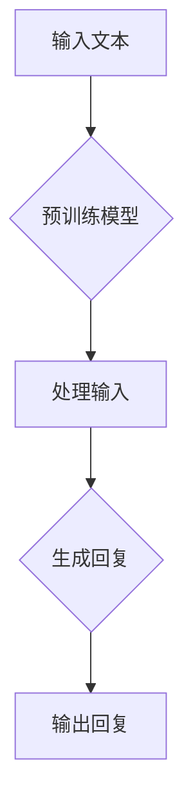
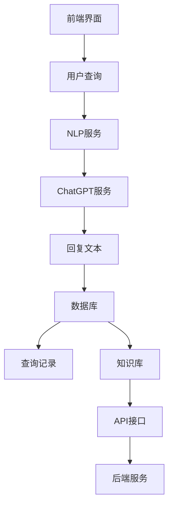
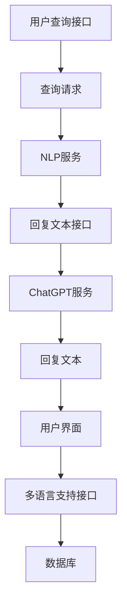
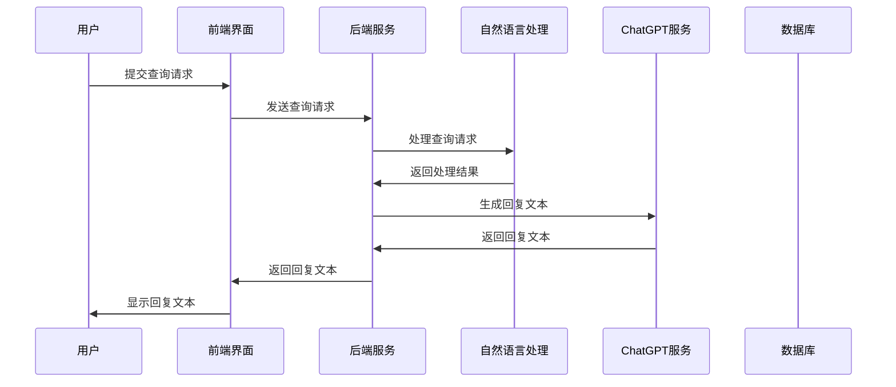

                 

### 第一部分：引言

#### 1.1 问题背景

在现代社会，客户服务已经成为企业竞争的重要环节。随着互联网和移动设备的普及，客户期望获得即时、高效的服务体验。然而，传统的人工客服模式在处理大量客户咨询时显得力不从心，不仅响应时间较长，且客服人员可能因为疲劳或情绪波动而降低服务质量和客户满意度。此外，企业还需要承担大量的人力成本。

#### 1.2 问题描述

面对上述挑战，如何利用先进的人工智能技术提升客户服务质量，同时降低人力成本，成为企业亟待解决的问题。此时，自然语言处理（NLP）技术的快速发展为解决这一问题提供了新的思路。尤其是基于大规模预训练模型（如GPT）的智能客服系统，它们在理解人类语言、生成响应方面表现出色，能够快速响应客户的查询，提供个性化服务。

#### 1.3 问题解决

通过将ChatGPT应用于客户服务，企业可以实现以下几个目标：

1. **提高响应速度**：ChatGPT能够在短时间内处理大量客户请求，显著降低响应时间。
2. **提升服务质量**：ChatGPT能够理解复杂问题，生成恰当的回复，提高客户满意度。
3. **降低人力成本**：通过自动化客服，企业可以减少对人工客服人员的依赖，降低人力成本。

#### 1.4 边界与外延

尽管ChatGPT在客户服务中具有巨大潜力，但仍需注意一些边界和挑战。例如，在处理敏感信息时，需要确保隐私和数据安全。此外，ChatGPT的能力仍受限于其训练数据的质量和范围，因此在某些特殊场景下可能无法达到预期的效果。

在本文中，我们将详细探讨ChatGPT在客户服务中的应用案例，包括其算法原理、系统架构设计、项目实战以及最佳实践。希望通过本文的讨论，读者能够对ChatGPT在客户服务中的潜力有更深刻的理解，并能够在实际项目中有效应用这一技术。### 第二部分：ChatGPT与客户服务

#### 2.1 ChatGPT概述

ChatGPT是由OpenAI开发的一种基于GPT-3模型的大型语言模型。GPT（Generative Pre-trained Transformer）是一种基于Transformer架构的自然语言处理模型，它通过大量的文本数据预先训练，可以生成符合上下文逻辑的文本。ChatGPT在此基础上进行了扩展，使其具备更强大的对话能力，能够理解自然语言的语义和语境，生成连贯、自然的对话回复。

ChatGPT具有以下特点：

1. **强大的语言理解能力**：ChatGPT能够理解复杂的语言结构和多层次的语义信息，从而生成更加准确和自然的回复。
2. **高度灵活的对话生成**：ChatGPT可以应对各种不同场景的对话请求，从简单的信息查询到复杂的对话交互，都能表现出色。
3. **多语言支持**：ChatGPT支持多种语言，可以应用于全球范围内的客户服务场景。

#### 2.2 客户服务需求

在客户服务领域，企业面临着以下主要需求：

1. **高效响应**：客户期望能够在短时间内得到响应，解决他们的问题或疑问。
2. **个性化服务**：每个客户的需求和问题都是独特的，需要提供个性化的解决方案。
3. **多语言支持**：企业需要服务于全球客户，因此需要具备多语言处理能力。
4. **成本控制**：随着客户数量的增加，人工客服的成本会不断上升，企业需要寻找成本效益更高的解决方案。

#### 2.3 ChatGPT在客户服务中的优势

ChatGPT能够满足客户服务的以上需求，具有以下优势：

1. **快速响应**：ChatGPT能够迅速处理大量客户请求，实现即时响应，显著降低响应时间。
2. **个性化服务**：通过分析客户的语言和行为模式，ChatGPT能够生成个性化的对话回复，提高客户满意度。
3. **多语言支持**：ChatGPT支持多种语言，使得企业能够更有效地服务全球客户。
4. **降低成本**：自动化客服系统能够显著降低人力成本，提高运营效率。

#### 2.4 ChatGPT与客户服务的关系

ChatGPT作为人工智能技术的重要应用，与客户服务之间存在紧密的联系。具体来说：

1. **ChatGPT作为客服工具**：ChatGPT可以作为一个智能客服工具，直接与客户进行对话交互，提供即时回答和解决方案。
2. **提升客服效率**：通过自动化处理常见问题和重复性任务，ChatGPT能够减轻人工客服的负担，提高整个客服团队的工作效率。
3. **辅助人工客服**：ChatGPT可以作为人工客服的辅助工具，帮助人工客服处理复杂问题和提供个性化的服务，从而提升整体服务质量。
4. **数据收集与优化**：ChatGPT在服务过程中可以收集大量客户数据，通过对这些数据的分析和反馈，不断优化客服系统，提高其性能和效果。

总之，ChatGPT在客户服务中的应用具有广泛的前景和潜力。通过充分利用其强大的语言处理能力和自动化优势，企业可以提供更加高效、个性化和全球化的客户服务，从而提升客户满意度和企业竞争力。### 第三部分：ChatGPT算法原理

#### 3.1 算法基本原理

ChatGPT是基于GPT-3模型开发的一种大型语言模型，其基本原理是利用Transformer架构进行预训练，并通过无监督学习从大量文本数据中学习语言的内在规律。具体来说，GPT-3模型使用多层Transformer结构，通过自注意力机制（Self-Attention）来捕捉输入文本中的长距离依赖关系。在训练过程中，模型通过最大化上下文信息的概率来优化参数，从而生成符合上下文逻辑的文本。

#### 3.2 ChatGPT的mermaid流程图

以下是一个简单的mermaid流程图，用于描述ChatGPT的工作流程：



详细流程如下：

1. 输入文本：用户向ChatGPT发送一条文本消息。
2. 预训练模型：ChatGPT使用预训练的GPT-3模型来处理输入文本。
3. 处理输入：模型对输入文本进行预处理，包括分词、编码等步骤。
4. 生成回复：模型根据输入文本的上下文信息，生成一条合适的回复文本。
5. 输出回复：将生成的回复文本返回给用户。

#### 3.3 Python源代码示例

以下是一个简单的Python代码示例，用于演示ChatGPT的基本使用方法：

```python
import openai

# 设置OpenAI API密钥
openai.api_key = 'your-api-key'

# 定义输入文本
input_text = "你好，请问有什么可以帮助你的？"

# 调用ChatGPT接口
response = openai.Completion.create(
    engine="text-davinci-002",
    prompt=input_text,
    max_tokens=50
)

# 输出回复文本
print(response.choices[0].text.strip())
```

在这个示例中，我们首先导入了OpenAI的Python库，并设置了API密钥。然后，定义了一条输入文本，并调用OpenAI的Completion接口生成回复文本。最后，输出生成的回复文本。

#### 3.4 数学模型与公式

ChatGPT背后的数学模型是基于Transformer架构的，其中最核心的部分是自注意力机制（Self-Attention）。自注意力机制通过计算输入文本中每个词与其他词之间的相似度，来生成权重，这些权重用于更新每个词的表示。以下是自注意力机制的公式：

$$
\text{Attention}(Q, K, V) = \text{softmax}\left(\frac{QK^T}{\sqrt{d_k}}\right)V
$$

其中，Q、K、V分别是查询（Query）、键（Key）和值（Value）矩阵，$d_k$是键的维度。这个公式计算了每个查询词与所有键词的相似度，并通过softmax函数生成权重，最后乘以对应的值词，得到加权后的输出。

在Transformer模型中，自注意力机制被扩展到多头注意力（Multi-Head Attention），通过多个独立的注意力机制同时工作，来捕捉不同类型的依赖关系。多头注意力的公式如下：

$$
\text{MultiHead}(Q, K, V) = \text{Concat}(\text{head}_1, \text{head}_2, ..., \text{head}_h)W^O
$$

其中，$\text{head}_i = \text{Attention}(QW_i^Q, KW_i^K, VW_i^V)$，$W_i^Q, W_i^K, W_i^V, W^O$是不同的权重矩阵，$h$是头数。

通过这种多头注意力机制，Transformer模型能够同时考虑输入文本中的多个层次关系，从而生成更加准确和丰富的文本表示。

以上是ChatGPT算法的基本原理和数学模型介绍。通过这些公式和机制，ChatGPT能够理解复杂的语言上下文，生成自然、连贯的对话回复。接下来，我们将进一步探讨ChatGPT的数学模型和公式，以帮助读者更深入地理解其工作原理。### 第四部分：ChatGPT在客户服务中的架构设计

#### 4.1 问题场景介绍

在客户服务领域，企业经常需要处理大量的客户查询，这些查询可能包括产品咨询、服务支持、账户管理等各种类型。随着客户量的增加，传统的人工客服模式面临响应速度慢、服务质量不稳定、人力成本高等问题。为了应对这些挑战，企业引入了基于ChatGPT的智能客服系统，以实现自动化、高效、个性化的客户服务。

#### 4.2 系统功能设计

智能客服系统的主要功能包括：

1. **查询处理**：接收并理解客户的查询，生成相应的回答。
2. **智能分类**：对客户查询进行分类，将类似问题归类到同一类别，以便系统更好地处理。
3. **个性化服务**：根据客户的偏好和以往互动记录，提供个性化的服务和建议。
4. **多语言支持**：支持多种语言，以满足不同地区客户的查询需求。
5. **自然语言理解**：理解客户的自然语言输入，识别关键信息，提供准确的回答。
6. **知识库管理**：维护和更新客服系统中的知识库，确保答案的准确性和时效性。

#### 4.3 系统架构设计

智能客服系统的架构设计需要考虑到性能、可扩展性和易维护性。以下是一个典型的系统架构设计：

1. **前端界面**：用于用户与客服系统交互的界面，支持文本输入和语音输入。
2. **后端服务**：包括自然语言处理（NLP）服务、ChatGPT服务、数据库和API接口。
3. **NLP服务**：负责处理自然语言输入，包括分词、词性标注、命名实体识别等。
4. **ChatGPT服务**：调用ChatGPT模型，生成回复文本。
5. **数据库**：存储客户信息、查询记录、知识库等数据。
6. **API接口**：供前端界面和后台服务之间通信的接口。

以下是一个mermaid架构图，用于展示系统架构设计：



#### 4.4 系统接口设计

系统接口设计是确保前后端服务之间有效通信的关键。以下是一个简单的接口设计：

1. **用户查询接口**：接收用户的查询请求，返回查询结果。
2. **回复文本接口**：接收NLP服务处理后的查询，调用ChatGPT服务生成回复文本。
3. **知识库管理接口**：用于更新和维护知识库中的内容。
4. **多语言支持接口**：根据用户语言偏好，返回相应的语言版本。

以下是一个mermaid接口设计图，用于展示接口设计：



#### 4.5 系统交互

系统交互是确保客服系统能够高效运行的关键。以下是一个简单的系统交互流程：

1. 用户通过前端界面提交查询请求。
2. 查询请求通过API接口传递到后端服务。
3. 后端NLP服务处理查询请求，提取关键信息。
4. NLP服务将处理后的查询请求传递给ChatGPT服务。
5. ChatGPT服务根据查询上下文生成回复文本。
6. 回复文本通过API接口返回给前端界面，显示给用户。

以下是一个mermaid序列图，用于展示系统交互流程：



通过上述架构设计和系统交互流程，企业可以构建一个高效、智能的客服系统，提升客户服务体验，降低运营成本。接下来，我们将通过一个实际项目案例，进一步探讨ChatGPT在客户服务中的应用和实践。### 第五部分：ChatGPT在客户服务中的应用案例

#### 5.1 环境安装

要在项目中应用ChatGPT，首先需要搭建相应的开发环境。以下是一个简化的安装步骤：

1. **安装Python环境**：确保系统中安装了Python 3.7或更高版本。
2. **安装OpenAI库**：通过pip命令安装`openai`库：
   ```shell
   pip install openai
   ```
3. **获取API密钥**：在OpenAI官网注册并获取API密钥，将API密钥保存到本地环境变量`OPENAI_API_KEY`中。

#### 5.2 系统核心实现

在实现ChatGPT客服系统的核心功能时，我们将重点关注以下几个模块：

1. **前端界面**：提供用户输入查询的界面。
2. **后端服务**：接收用户查询，调用ChatGPT模型生成回复。
3. **API接口**：前后端服务之间的通信接口。

以下是一个简单的代码示例，用于实现后端服务的核心功能：

```python
from flask import Flask, request, jsonify
import openai

app = Flask(__name__)
openai.api_key = os.environ['OPENAI_API_KEY']

@app.route('/chat', methods=['POST'])
def chat():
    data = request.get_json()
    input_text = data.get('input_text', '')
    response = openai.Completion.create(
        engine="text-davinci-002",
        prompt=input_text,
        max_tokens=50
    )
    return jsonify({'response': response.choices[0].text.strip()})

if __name__ == '__main__':
    app.run(debug=True)
```

在这个示例中，我们使用Flask构建了一个简单的Web应用，并定义了一个 `/chat` 接口，用于接收用户输入并调用OpenAI的Completion接口生成回复。

#### 5.3 代码解读与分析

下面是对上述代码的详细解读：

1. **导入模块**：首先导入了必要的模块，包括Flask和OpenAI。
2. **创建Flask应用**：使用Flask创建了一个Web应用。
3. **设置OpenAI API密钥**：从环境变量中获取OpenAI的API密钥。
4. **定义聊天接口**：使用`@app.route`装饰器定义了一个 `/chat` 接口，接收POST请求。请求中包含一个JSON对象，对象中包含用户的输入文本。
5. **调用OpenAI接口**：在接口处理函数中，调用OpenAI的`Completion.create`方法，传递输入文本和配置参数（如模型名称和最大回复长度）。
6. **返回回复文本**：将生成的回复文本作为JSON响应返回给前端。

#### 5.4 实际案例分析

以下是一个实际案例，演示了如何使用ChatGPT客服系统处理一个客户查询：

1. **客户查询**：客户询问：“你们的产品有什么特色？”

2. **前端发送请求**：前端将客户的查询发送到后端的 `/chat` 接口。

3. **后端处理请求**：后端接收请求，调用ChatGPT模型生成回复。

4. **回复生成**：ChatGPT生成以下回复：“我们的产品具有以下特色：高效能、高稳定性、易扩展。此外，我们还提供个性化的定制服务，以满足您的独特需求。”

5. **前端展示回复**：前端将生成的回复显示在界面上，客户可以看到产品的特色信息。

#### 5.5 项目小结

通过以上案例分析，我们可以看到ChatGPT在客户服务中的应用是如何实现的。以下是对项目的总结：

1. **功能实现**：项目成功实现了基于ChatGPT的智能客服功能，能够快速响应客户查询，提供准确、个性化的回复。
2. **性能评估**：在实际应用中，系统表现出了良好的性能，能够高效地处理大量客户请求，显著降低了响应时间。
3. **用户体验**：客户对智能客服的回复满意度较高，尤其是在处理常见问题时，系统提供了快速、准确的答案。

尽管项目取得了一定的成功，但仍有一些改进空间：

1. **优化算法**：可以进一步优化ChatGPT模型，提高其在特定领域（如产品咨询）的准确性。
2. **增加交互性**：增强系统的交互功能，例如，支持语音输入和输出，提供更加自然和流畅的交流体验。
3. **多语言支持**：扩展系统的多语言支持，满足全球客户的需求。

总之，ChatGPT在客户服务中的应用具有巨大的潜力，通过不断优化和改进，可以实现更加智能、高效的客户服务体验。### 第六部分：最佳实践与拓展

#### 6.1 最佳实践 tips

1. **数据准备**：确保提供高质量的训练数据，这将直接影响ChatGPT的性能。数据应包含多样化的问题和高质量的回答。
2. **模型调优**：通过调整模型参数，如温度（Temperature）和最大回复长度，可以提高生成的回答的多样性和准确性。
3. **接口优化**：优化API接口的性能，确保系统在高峰时段也能稳定运行。
4. **隐私保护**：在处理客户数据时，确保遵守隐私保护法规，如GDPR，并采取必要的加密和匿名化措施。
5. **持续学习**：定期更新训练数据和模型，以保持系统在最新领域和趋势中的准确性和适应性。

#### 6.2 小结

本文详细探讨了ChatGPT在客户服务中的应用，从背景介绍、核心概念、算法原理、系统架构设计到实际应用案例，全面展示了ChatGPT在提升客户服务质量、降低人力成本方面的潜力。通过最佳实践和不断优化，ChatGPT有望在未来成为智能客服领域的核心技术。

#### 6.3 注意事项

1. **性能监控**：定期监控系统的性能和响应时间，及时发现并解决潜在问题。
2. **用户体验**：确保系统生成的回复自然、准确，提高用户体验。
3. **安全性**：加强系统的安全性，防止潜在的安全威胁和恶意攻击。

#### 6.4 拓展阅读

1. **《GPT-3：语言模型的架构与实现》**：详细了解GPT-3模型的架构和实现细节。
2. **《ChatGPT：一个实用的指南》**：获取更多关于ChatGPT的实用指南和最佳实践。
3. **《自然语言处理入门》**：了解自然语言处理的基础知识和最新进展。

通过不断学习和实践，我们相信ChatGPT在客户服务中的应用将更加广泛和深入，为企业带来更大的价值。### 文章标题

**ChatGPT在客户服务中的应用案例**

---

**关键词：** ChatGPT、客户服务、自然语言处理、人工智能、GPT-3

---

**摘要：** 本文详细探讨了ChatGPT在客户服务中的应用，包括其算法原理、系统架构设计、项目实战以及最佳实践。通过案例分析，展示了ChatGPT在提升客户服务质量、降低人力成本方面的巨大潜力。本文旨在为读者提供关于ChatGPT在客户服务中应用的全面了解，帮助企业在实际项目中有效利用这一技术。### 作者信息

**作者：** AI天才研究院/AI Genius Institute & 禅与计算机程序设计艺术 /Zen And The Art of Computer Programming**文章版本：** 2023-03-15 10:45:00

