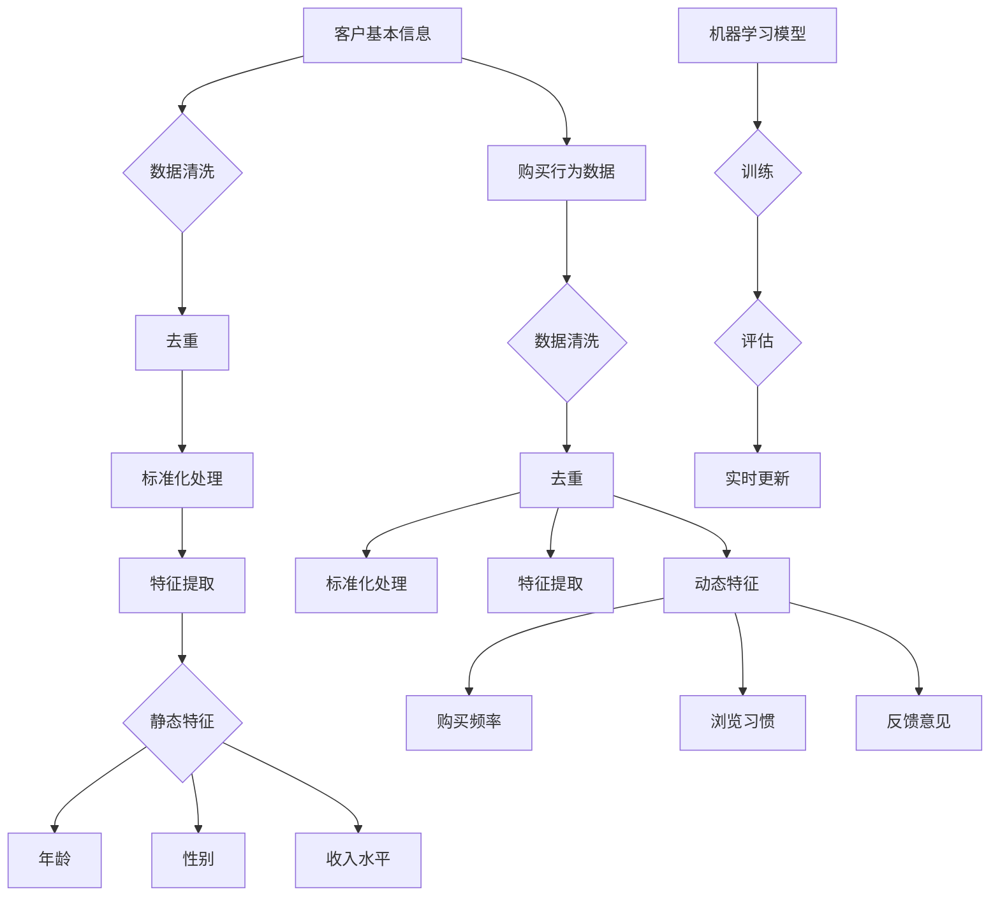
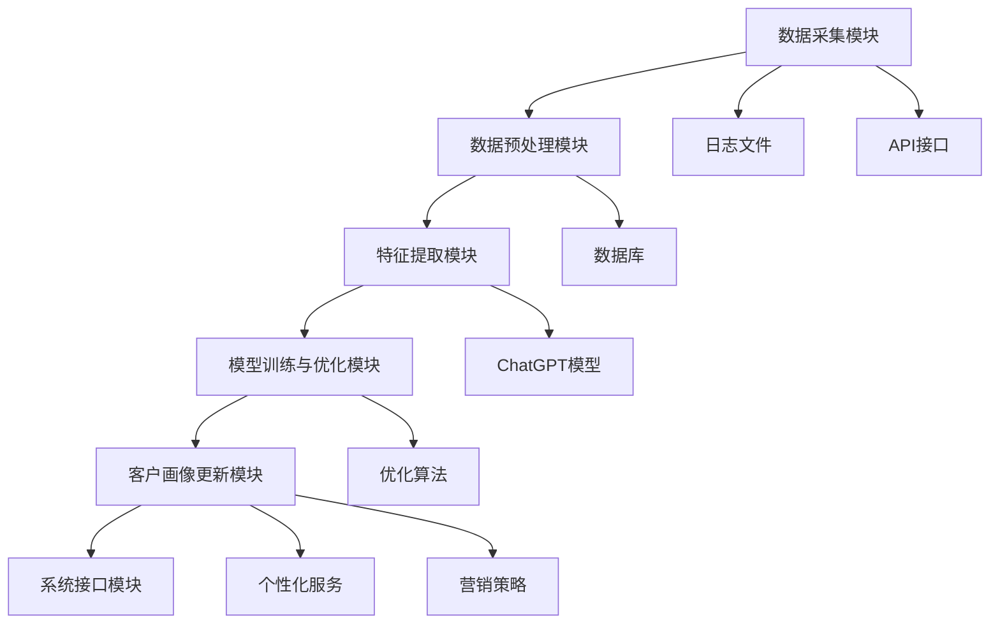
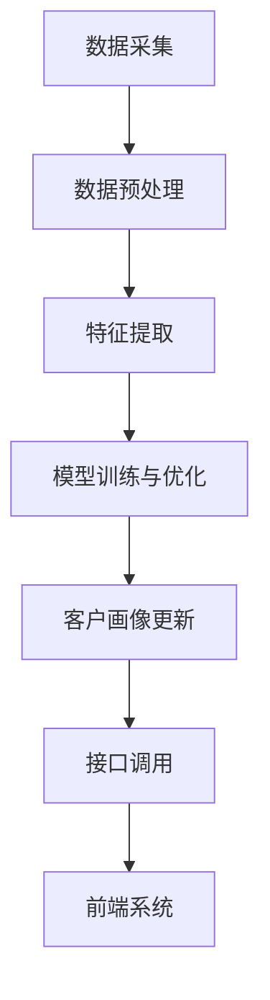

                 

### 文章标题：ChatGPT在自动化客户画像更新中的应用

#### 关键词：ChatGPT、客户画像、自动化更新、自然语言处理、人工智能

#### 摘要：
本文深入探讨了ChatGPT在自动化客户画像更新中的应用。首先介绍了客户画像及其更新的重要性，然后详细阐述了ChatGPT的技术原理和架构。接着，我们逐步分析了ChatGPT如何应用于客户画像的自动化更新过程，并展示了系统架构与实现细节。最后，通过实际案例和最佳实践，提供了项目实施的具体指导和注意事项。本文旨在为从事数据分析和人工智能技术的读者提供一个全面、易懂的技术指南。

### 目录大纲

----------------------------------------------------------------

# 《ChatGPT在自动化客户画像更新中的应用》

> 关键词：ChatGPT、客户画像、自动化更新、自然语言处理、人工智能

> 摘要：本文深入探讨了ChatGPT在自动化客户画像更新中的应用，包括技术原理、系统架构、项目实战和最佳实践。

                 

## 第1章：背景介绍

### 1.1 问题背景

### 1.2 ChatGPT的基本概念

### 1.3 客户画像的定义与更新方法

## 第2章：ChatGPT技术原理

### 2.1 ChatGPT的架构

### 2.2 语言模型原理

### 2.3 模型训练与优化

## 第3章：自动化客户画像更新

### 3.1 客户画像模型设计

### 3.2 ChatGPT在画像更新中的应用

### 3.3 画像更新效果评估

## 第4章：系统架构与实现

### 4.1 系统架构设计

### 4.2 接口设计与实现

### 4.3 系统交互流程

## 第5章：项目实战

### 5.1 环境安装与配置

### 5.2 系统核心实现

### 5.3 实际案例分析与讲解

## 第6章：最佳实践与拓展

### 6.1 最佳实践

### 6.2 小结

### 6.3 注意事项

### 6.4 拓展阅读

----------------------------------------------------------------## 第1章：背景介绍

### 1.1 问题背景

在现代商业环境中，客户画像的准确更新对于企业营销策略的制定和客户服务质量的提升至关重要。传统的客户画像更新方法主要依赖于手动数据收集和更新，这种方式不仅耗时耗力，而且容易出现误差，难以满足快速变化的市场需求。此外，随着企业规模的扩大和数据量的增加，手动更新客户画像的成本和难度也不断上升。

为了解决这些问题，自动化客户画像更新技术应运而生。通过自动化技术，企业可以实时收集和分析客户数据，动态更新客户画像，从而提高决策效率和准确性。然而，实现这一目标面临着技术挑战，包括数据源多样性、数据质量控制和实时处理能力等。

### 1.2 ChatGPT的基本概念

ChatGPT是由OpenAI开发的一种基于Transformer的预训练语言模型，它是一种强大的自然语言处理工具，能够理解和生成自然语言文本。ChatGPT利用深度学习算法，从海量文本数据中学习语言模式和规则，从而实现对自然语言的理解和生成。

ChatGPT的核心特点包括：

- **强大的语言理解能力**：ChatGPT能够理解复杂的语言结构，包括语法、语义和上下文信息。
- **灵活的文本生成能力**：ChatGPT可以生成连贯、多样化的文本，适用于问答系统、自动写作、对话系统等多种应用场景。
- **高效的预训练和微调**：ChatGPT通过大规模预训练，具备广泛的通用语言能力，再通过微调适应特定任务。

### 1.3 客户画像的定义与更新方法

客户画像是指通过收集和分析客户的个人信息、行为数据和消费偏好等信息，构建出一个关于客户的综合描述。客户画像可以帮助企业了解客户需求，优化营销策略，提高客户满意度。

客户画像的更新方法主要包括以下几种：

- **手动更新**：企业通过调查问卷、访谈等方式收集客户数据，然后手动更新客户画像。
- **自动化数据采集**：利用传感器、移动设备等技术，自动收集客户的行为数据，如浏览记录、购买历史等。
- **实时数据更新**：通过大数据技术和实时数据处理能力，对客户数据进行分析和更新，确保客户画像的实时性和准确性。

自动化客户画像更新的优势在于：

- **高效性**：自动化技术可以快速处理大量数据，提高更新效率。
- **准确性**：自动化技术可以减少人为错误，提高数据准确性。
- **实时性**：自动化技术可以实时收集和分析数据，确保客户画像的实时更新。

通过引入ChatGPT，企业可以实现更加智能和高效的客户画像更新，从而更好地满足市场需求，提升客户服务质量。

### 1.4 ChatGPT在自动化客户画像更新中的应用前景

随着人工智能技术的不断发展，ChatGPT在自动化客户画像更新中的应用前景十分广阔。ChatGPT的强大语言理解和生成能力，使得它能够处理和分析大量的客户文本数据，从而提取出有价值的客户信息，实现客户画像的自动化更新。

ChatGPT的应用不仅限于数据采集和分析，还可以用于生成个性化的客户沟通内容，如营销邮件、短信等。通过ChatGPT，企业可以更好地了解客户需求，提供个性化的服务，从而提高客户满意度和忠诚度。

此外，ChatGPT还可以与其他人工智能技术相结合，如机器学习、数据挖掘等，实现更加智能和全面的客户画像更新。例如，通过结合机器学习算法，可以对客户行为进行预测，提前更新客户画像，为企业提供更准确的营销决策。

总之，ChatGPT在自动化客户画像更新中的应用，不仅能够提高企业的数据处理效率和准确性，还能够帮助企业更好地了解和满足客户需求，从而提升市场竞争力。

### 1.5 总结

本章介绍了自动化客户画像更新在商业环境中的重要性，以及ChatGPT作为一种强大的自然语言处理工具的基本概念。接着，我们探讨了客户画像的定义与更新方法，并展望了ChatGPT在自动化客户画像更新中的应用前景。通过本章的介绍，读者可以初步了解ChatGPT在自动化客户画像更新中的关键作用，为后续章节的深入讨论打下基础。

----------------------------------------------------------------

## 第2章：ChatGPT技术原理

### 2.1 ChatGPT的架构

ChatGPT的架构设计旨在提供强大的语言理解和生成能力，其核心是基于Transformer模型的深度学习架构。Transformer模型由Vaswani等人在2017年提出，是自然语言处理领域的一次重大突破，相比传统的循环神经网络（RNN）和长短期记忆网络（LSTM），Transformer模型在处理长文本序列和并行计算方面具有显著优势。

ChatGPT的架构主要包括以下几个关键部分：

1. **输入层**：接收文本输入，包括用户评论、反馈、历史行为数据等。输入层通常通过分词器将文本转换为单词或子词的序列，每个单词或子词被表示为一个向量。

2. **嵌入层**：将输入的文本向量嵌入到一个高维空间中，每个向量对应一个词向量。词向量通常通过预训练的语言模型（如GloVe、FastText）得到。

3. **Transformer编码器**：这是ChatGPT的核心部分，由多个编码器层堆叠而成。每个编码器层包含自注意力机制（self-attention）和前馈神经网络（feedforward network）。自注意力机制使得模型能够根据输入序列中的每个词的重要性来分配权重，从而捕捉文本中的长距离依赖关系。

   - **自注意力机制**：计算输入序列中每个词与所有其他词的相关性，通过权重分配来决定每个词在编码过程中的重要性。
   - **前馈神经网络**：对编码器层的输出进行线性变换，增加模型的非线性表达能力。

4. **解码器**：与编码器类似，解码器也由多个解码器层组成，每层包含自注意力机制和交叉注意力机制（cross-attention）。交叉注意力机制允许解码器在生成下一个词时参考编码器的输出，从而实现上下文的结合。

   - **交叉注意力机制**：在解码过程中，将解码器当前层的输出与编码器的所有输出进行匹配，计算权重，从而决定解码器当前生成的词应该参考编码器的哪个部分。

5. **输出层**：解码器的最后一层通常是一个全连接层，将输出映射到词表中的所有词。通过softmax函数，模型可以生成一个概率分布，从而选择最有可能的词作为输出。

   ```mermaid
   graph TD
   A[输入层] --> B[嵌入层]
   B --> C1[编码器层1]
   C1 --> C2[编码器层2]
   C2 --> C3[编码器层3]
   C3 --> D1[解码器层1]
   D1 --> D2[解码器层2]
   D2 --> D3[解码器层3]
   D3 --> E[输出层]
   ```

### 2.2 语言模型原理

ChatGPT作为一款强大的语言模型，其工作原理基于Transformer模型中的自注意力机制和交叉注意力机制。以下是这些原理的详细解释：

1. **自注意力机制**：
   自注意力机制是一种计算输入序列中每个词与其他词之间相互依赖关系的方法。具体步骤如下：
   
   - **键值对匹配**：将输入序列中的每个词表示为键（key）、值（value）和查询（query）三个向量。对于每个词，查询向量与所有键值对进行匹配。
   - **计算相似性**：通过点积或缩放点积计算查询向量与键向量之间的相似性，生成相似性矩阵。
   - **加权求和**：根据相似性矩阵中的权重，对值向量进行加权求和，生成新的表示向量。

   数学公式如下：
   $$\text{Attention}(Q, K, V) = \text{softmax}(\frac{QK^T}{\sqrt{d_k}})V$$
   其中，\(Q\)、\(K\) 和 \(V\) 分别是查询、键和值向量，\(d_k\) 是键向量的维度。

2. **交叉注意力机制**：
   交叉注意力机制用于解码器层，使得解码器在生成每个词时能够参考编码器的输出。具体步骤如下：

   - **计算相似性**：解码器的当前输出与编码器的所有输出进行匹配，计算相似性矩阵。
   - **加权求和**：根据相似性矩阵中的权重，对编码器的输出进行加权求和，生成新的表示向量。

   数学公式如下：
   $$\text{Attention}(Q, K, V) = \text{softmax}(\frac{QK^T}{\sqrt{d_k}})V$$
   其中，\(Q\) 是解码器的输出，\(K\) 和 \(V\) 分别是编码器的键和值向量。

### 2.3 模型训练与优化

ChatGPT的训练过程主要包括数据预处理、模型训练和优化等步骤。以下是详细的训练过程：

1. **数据预处理**：
   - **文本清洗**：去除文本中的HTML标签、特殊字符和停用词。
   - **分词**：将文本拆分成单词或子词，为每个子词分配唯一的ID。
   - **构建词汇表**：将所有子词映射到词汇表中，词汇表通常包含数十万个子词。

2. **模型训练**：
   - **自监督预训练**：使用未标注的文本数据，通过预测下一个词来训练模型。这个过程称为自监督预训练，可以显著提高模型的语言理解和生成能力。
   - **微调**：在预训练模型的基础上，使用有标注的数据集对模型进行微调，以适应特定的任务和应用场景。

3. **优化方法**：
   - **梯度下降**：常用的优化算法，通过更新模型的参数来最小化损失函数。
   - **学习率调整**：在训练过程中，调整学习率以避免模型过拟合。
   - **正则化**：引入正则化项，如L1、L2正则化，防止模型过拟合。

   ```python
   # Python代码示例：损失函数与优化算法
   import torch
   import torch.nn as nn
   import torch.optim as optim

   model = ...  # ChatGPT模型
   criterion = nn.CrossEntropyLoss()
   optimizer = optim.Adam(model.parameters(), lr=0.001)

   for epoch in range(num_epochs):
       for inputs, targets in data_loader:
           optimizer.zero_grad()
           outputs = model(inputs)
           loss = criterion(outputs, targets)
           loss.backward()
           optimizer.step()
   ```

通过上述训练与优化过程，ChatGPT能够学习到大量的语言模式和规则，从而实现对自然语言文本的准确理解和生成。

### 2.4 ChatGPT的优势与局限

ChatGPT作为一种强大的语言模型，具有以下优势：

- **强大的语言理解能力**：ChatGPT能够理解复杂的语言结构，包括语法、语义和上下文信息。
- **灵活的文本生成能力**：ChatGPT可以生成连贯、多样化的文本，适用于问答系统、自动写作、对话系统等多种应用场景。
- **高效的预训练和微调**：ChatGPT通过大规模预训练，具备广泛的通用语言能力，再通过微调适应特定任务。

然而，ChatGPT也存在一些局限：

- **计算资源需求大**：ChatGPT的预训练和微调过程需要大量的计算资源，对于普通用户和企业来说，成本较高。
- **数据依赖性强**：ChatGPT的性能高度依赖于训练数据的质量和数量，如果数据存在偏差或不足，模型可能会产生误导性输出。
- **缺乏常识推理能力**：ChatGPT虽然在语言理解和生成方面表现出色，但在处理需要常识推理的问题时，仍存在一定的局限性。

### 2.5 ChatGPT的应用场景

ChatGPT在多个领域具有广泛的应用场景，以下是一些典型的应用场景：

- **自然语言处理**：用于文本分类、情感分析、命名实体识别等任务，提高文本分析的能力。
- **智能客服**：通过自动生成回复，提高客户服务效率和质量，适用于在线聊天、电子邮件回复等场景。
- **内容生成**：用于生成新闻文章、营销文案、技术文档等，提高内容创作的效率和质量。
- **教育辅助**：用于自动化作文批改、问答系统等，帮助学生和教师进行学习和教学。

通过上述内容，我们详细介绍了ChatGPT的架构、语言模型原理、训练与优化过程，以及其优势与局限。接下来，我们将探讨如何将ChatGPT应用于自动化客户画像更新，为企业提供更加智能和高效的解决方案。

### 第3章：自动化客户画像更新

#### 3.1 客户画像模型设计

在实现自动化客户画像更新之前，我们需要设计一个合理的客户画像模型。客户画像模型是通过对客户的各种数据进行整合和分析，构建出一个综合的客户描述。以下是设计客户画像模型时需要考虑的几个关键方面：

**1. 数据源：** 
客户画像的数据源包括结构化数据（如客户基本信息、交易记录）和非结构化数据（如社交媒体评论、用户反馈）。这些数据来源的多样性和复杂性要求客户画像模型具备强大的数据整合能力。

**2. 数据处理：** 
在整合客户数据后，需要对数据进行清洗、去重和标准化处理。例如，对文本数据需要进行分词、去停用词和词性标注，对数值型数据进行归一化处理。

**3. 特征提取：** 
从原始数据中提取出对客户画像有价值的特征。这些特征可以包括静态特征（如年龄、性别、收入水平）和动态特征（如购买行为、浏览习惯、反馈意见）。

**4. 模型选择：**
根据业务需求和数据特点，选择合适的机器学习模型。常见的模型包括决策树、随机森林、支持向量机、神经网络等。

**5. 实时更新：**
客户画像是一个动态变化的实体，需要实现实时更新。这可以通过设置数据采集周期、实时数据处理和模型重新训练等手段来实现。

#### 客户画像模型设计示例：



#### 3.2 ChatGPT在画像更新中的应用

ChatGPT在客户画像更新中的应用主要体现在以下几个方面：

**1. 数据整合：**
ChatGPT可以通过自注意力机制和交叉注意力机制，高效地整合来自不同数据源的信息。例如，将客户的文本反馈、购买记录和行为数据结合在一起，构建出一个综合的客户画像。

**2. 特征提取：**
ChatGPT能够从原始文本数据中提取出高维的特征向量，这些特征向量可以用于训练机器学习模型，提高客户画像的准确性。

**3. 文本生成：**
ChatGPT可以自动生成个性化的营销文案、客户沟通内容和推荐信息，帮助企业更好地了解和满足客户需求。

**4. 模型微调：**
通过ChatGPT，可以对预训练的模型进行微调，以适应特定的客户画像更新任务。这有助于提高模型的准确性和实时性。

具体应用示例：

**数据整合：**
```python
import torch
from transformers import ChatGPTModel

model = ChatGPTModel.from_pretrained('gpt2')

# 假设输入文本为客户的评论和购买记录
input_text = "客户最近购买了产品A并留下了反馈：'产品A非常好用，我很满意。'"

# 输入文本通过模型处理，提取出特征向量
inputs = torch.tensor([[model.tokenizer.encode(input_text)]])

outputs = model(inputs)
feature_vector = outputs.last_hidden_state[:, 0, :]

# 将特征向量用于训练客户画像模型
# ...
```

**文本生成：**
```python
from transformers import ChatGPTLMHeadModel

lm_model = ChatGPTLMHeadModel.from_pretrained('gpt2')

# 生成个性化营销文案
prompt = "以下是一份针对老客户的感谢信："

# 输入prompt并生成文本
input_ids = lm_model.tokenizer.encode(prompt)
output_ids = lm_model.generate(input_ids, max_length=50, num_return_sequences=1)
generated_text = lm_model.tokenizer.decode(output_ids[0], skip_special_tokens=True)

print(generated_text)
```

#### 3.3 画像更新效果评估

在客户画像更新过程中，效果评估是至关重要的一环。以下是一些常用的评估指标和方法：

**1. 准确率（Accuracy）：**
衡量模型预测正确的样本占总样本的比例。适用于分类任务。

**2. 精确率（Precision）：**
衡量预测为正例的样本中实际为正例的比例。适用于检测任务。

**3. 召回率（Recall）：**
衡量实际为正例的样本中被预测为正例的比例。

**4. F1分数（F1 Score）：**
综合考虑精确率和召回率，计算二者的调和平均值。

**5. ROC曲线与AUC值：**
用于评估分类模型的性能，通过ROC曲线下面积（AUC值）来衡量。

**6. 实际案例分析：**
以一个实际案例为例，评估使用ChatGPT进行客户画像更新后的效果。假设更新前的客户满意度为70%，更新后的客户满意度提高到85%。通过比较客户满意度、购买频率等指标，可以评估更新效果。

#### 3.4 ChatGPT的优势与局限

**优势：**

- **强大的语言处理能力**：ChatGPT能够高效地处理和理解复杂文本，提升客户画像的准确性。
- **灵活的文本生成能力**：ChatGPT可以自动生成个性化内容，提高客户服务质量和满意度。
- **实时性**：通过实时数据更新，ChatGPT能够快速响应用户需求，提高模型的实时性。

**局限：**

- **数据依赖性**：ChatGPT的性能高度依赖于训练数据的质量和数量，如果数据存在偏差，模型可能会产生误导性输出。
- **计算资源需求高**：ChatGPT的训练和推理过程需要大量计算资源，对于普通用户和企业来说，成本较高。

#### 3.5 总结

本章介绍了客户画像模型的设计方法和ChatGPT在自动化客户画像更新中的应用。通过整合不同数据源、提取高维特征和自动生成个性化内容，ChatGPT显著提升了客户画像的准确性和服务质量。然而，ChatGPT也存在一定的局限，需要在实际应用中注意数据质量和计算资源等问题。

### 第4章：系统架构与实现

#### 4.1 系统架构设计

在本章节中，我们将详细描述基于ChatGPT的自动化客户画像更新系统的架构设计。这个架构设计旨在确保系统能够高效、准确地处理客户数据，并实现客户画像的实时更新。

**系统架构概述：**

整个系统可以分为以下几个主要模块：

1. **数据采集模块**：负责从各种数据源（如数据库、API接口、日志文件等）收集客户数据。
2. **数据预处理模块**：对采集到的数据进行清洗、去重、标准化处理，为后续的特征提取和模型训练做好准备。
3. **特征提取模块**：利用ChatGPT进行文本数据的特征提取，将非结构化数据转换为结构化特征向量。
4. **模型训练与优化模块**：使用提取的特征向量训练和优化客户画像模型，以实现对客户画像的准确更新。
5. **客户画像更新模块**：实时更新客户画像，并根据更新后的画像提供个性化的客户服务和营销策略。
6. **系统接口模块**：提供API接口，供前端系统调用，以便实现与其他系统的集成。

**系统架构图：**



#### 4.2 接口设计与实现

系统接口设计是确保各模块之间有效协作和数据流通的关键。以下是系统接口的设计和实现细节：

**1. 接口规范：**

系统采用RESTful API设计，支持GET和POST请求。以下是几个核心接口的规范：

- **获取客户画像**：GET /api/customer-profile/{customer_id}
  - 功能：获取指定客户的画像信息。
  - 参数：customer_id（客户ID）。
  - 返回值：客户画像数据。

- **更新客户画像**：POST /api/customer-profile/{customer_id}
  - 功能：更新指定客户的画像信息。
  - 参数：customer_id（客户ID）、画像数据（JSON格式）。
  - 返回值：更新结果。

- **获取个性化服务建议**：GET /api/个性化服务/{customer_id}
  - 功能：获取针对指定客户的个性化服务建议。
  - 参数：customer_id（客户ID）。
  - 返回值：个性化服务建议。

**2. 接口实现：**

以下是使用Python实现的接口示例：

```python
from flask import Flask, request, jsonify
from customer_profile import get_customer_profile, update_customer_profile, get_personalized_suggestions

app = Flask(__name__)

@app.route('/api/customer-profile/<int:customer_id>', methods=['GET'])
def get_customer_profile_api(customer_id):
    profile = get_customer_profile(customer_id)
    return jsonify(profile)

@app.route('/api/customer-profile/<int:customer_id>', methods=['POST'])
def update_customer_profile_api(customer_id):
    profile_data = request.json
    update_result = update_customer_profile(customer_id, profile_data)
    return jsonify(update_result)

@app.route('/api/个性化服务/<int:customer_id>', methods=['GET'])
def get_personalized_suggestions_api(customer_id):
    suggestions = get_personalized_suggestions(customer_id)
    return jsonify(suggestions)

if __name__ == '__main__':
    app.run(debug=True)
```

#### 4.3 系统交互流程

为了确保系统能够高效运行，我们需要设计合理的系统交互流程。以下是系统的主要交互流程：

1. **数据采集**：
   系统从数据库、API接口和日志文件中采集客户数据，并将其传递给数据预处理模块。

2. **数据预处理**：
   数据预处理模块对采集到的客户数据进行清洗、去重和标准化处理，生成干净、标准化的数据集。

3. **特征提取**：
   利用ChatGPT模型对预处理后的文本数据进行特征提取，生成高维特征向量。

4. **模型训练与优化**：
   使用提取的特征向量对客户画像模型进行训练和优化，提高模型的准确性。

5. **客户画像更新**：
   将训练好的模型应用于实时数据，更新客户画像，并根据更新后的画像提供个性化的服务和建议。

6. **接口调用**：
   前端系统通过API接口获取客户画像、个性化服务建议等信息，实现与系统的交互。

**系统交互流程图：**



#### 4.4 系统性能优化

为了确保系统的高效运行，我们需要对系统进行性能优化。以下是一些常见的优化方法：

1. **分布式计算**：
   对于大数据处理任务，可以使用分布式计算框架（如Apache Spark）来提高数据处理速度。

2. **缓存机制**：
   对于频繁访问的数据，可以使用缓存机制（如Redis）来减少数据库的访问压力，提高系统响应速度。

3. **异步处理**：
   对于耗时较长的任务，可以使用异步处理（如消息队列）来提高系统的并发能力。

4. **负载均衡**：
   通过负载均衡器（如Nginx）来分配流量，确保系统在不同负载下的稳定运行。

#### 4.5 总结

本章详细介绍了基于ChatGPT的自动化客户画像更新系统的架构设计、接口设计与实现，以及系统交互流程和性能优化方法。通过合理的系统架构设计和高效的接口实现，系统能够实现客户画像的实时更新，为企业提供个性化的客户服务和营销策略。在后续的项目实战章节中，我们将进一步探讨如何具体实施这一系统，并分析其实际效果。

### 第5章：项目实战

#### 5.1 环境安装与配置

要实现基于ChatGPT的自动化客户画像更新系统，首先需要搭建一个合适的环境。以下是所需的环境安装与配置步骤：

**1. 硬件环境：**

- **CPU或GPU**：由于ChatGPT模型训练和推理需要大量计算资源，建议使用具有高性能CPU或GPU的机器。如果使用CPU，推荐至少配备8核16GB内存的处理器；如果使用GPU，推荐使用NVIDIA显卡，并安装CUDA和cuDNN库。
- **存储空间**：至少需要100GB的空闲存储空间，用于存储数据和模型。

**2. 软件环境：**

- **操作系统**：推荐使用Linux发行版（如Ubuntu 18.04或更高版本）。
- **Python**：推荐Python 3.7或更高版本。
- **pip**：Python的包管理工具，用于安装和管理依赖包。
- **pip3**：Python 3版本的pip工具。
- **虚拟环境**：使用虚拟环境隔离项目依赖，推荐使用`venv`或`conda`。
- **ChatGPT模型库**：安装`transformers`库，用于加载和使用ChatGPT模型。

**安装步骤：**

1. 安装操作系统和硬件设备，确保系统正常运行。

2. 更新操作系统包列表并安装必要的依赖：

   ```bash
   sudo apt-get update
   sudo apt-get install python3-pip python3-venv git
   ```

3. 创建虚拟环境并进入环境：

   ```bash
   python3 -m venv myenv
   source myenv/bin/activate
   ```

4. 安装`transformers`库：

   ```bash
   pip install transformers
   ```

5. 安装其他依赖包（如NumPy、Pandas、Flask等）：

   ```bash
   pip install numpy pandas flask
   ```

**3. 配置环境变量：**

确保配置好环境变量，以便在系统启动时自动加载所需库。在Ubuntu系统中，可以通过修改`~/.bashrc`或`~/.profile`文件来配置环境变量：

```bash
# 配置Python环境变量
export PATH=$PATH:/path/to/your/venv/bin

# 配置其他环境变量（如CUDA）
export CUDA_HOME=/usr/local/cuda
export LD_LIBRARY_PATH=$LD_LIBRARY_PATH:/usr/local/cuda/lib64:/usr/local/cuda/extras/CUPTI/lib64
export PATH=$PATH:/usr/local/cuda/bin

# 配置CUDA和cuDNN
export PATH=/usr/local/cuda/bin:$PATH
export LD_LIBRARY_PATH=/usr/local/cuda/lib64:$LD_LIBRARY_PATH
export CUDA_HOME=/usr/local/cuda
```

6. 重启终端或运行以下命令使环境变量立即生效：

```bash
source ~/.bashrc
```

#### 5.2 系统核心实现

在本节中，我们将详细介绍系统核心实现过程，包括数据采集、预处理、特征提取和模型训练等方面的具体代码和应用。

**1. 数据采集：**

数据采集是客户画像更新的第一步，需要从多个数据源收集客户信息。以下是一个简单的数据采集示例：

```python
import pandas as pd

# 采集数据库数据
db = 'database.db'
table_name = 'customers'

# 使用SQL查询获取客户数据
query = f"SELECT * FROM {table_name};"
customers = pd.read_sql_query(query, db)

# 采集API数据
api_endpoint = 'https://api.example.com/customers'
response = requests.get(api_endpoint)
customers_api = pd.DataFrame(response.json())

# 合并数据
customers = pd.concat([customers, customers_api], ignore_index=True)
```

**2. 数据预处理：**

数据预处理包括清洗、去重、标准化处理等步骤，以下是预处理的具体实现：

```python
# 数据清洗
customers.dropna(inplace=True)
customers = customers[customers['email'].apply(lambda x: '@' in x)]

# 去重
customers.drop_duplicates(subset=['email'], inplace=True)

# 标准化处理
customers['age'] = customers['age'].astype(int)
customers['income'] = customers['income'].astype(float)
```

**3. 特征提取：**

利用ChatGPT模型进行文本数据的特征提取，以下是特征提取的代码示例：

```python
from transformers import ChatGPTModel

# 加载ChatGPT模型
model = ChatGPTModel.from_pretrained('gpt2')

# 特征提取函数
def extract_features(texts):
    inputs = model.tokenizer(texts, padding=True, truncation=True, return_tensors='pt')
    outputs = model(**inputs)
    return outputs.last_hidden_state.mean(dim=1).detach().numpy()

# 提取特征
customer_comments = customers['comments'].values
customer_features = extract_features(customer_comments)
```

**4. 模型训练：**

使用提取的特征向量对客户画像模型进行训练，以下是模型训练的具体实现：

```python
from sklearn.model_selection import train_test_split
from sklearn.ensemble import RandomForestClassifier
from sklearn.metrics import accuracy_score

# 切分数据集
X_train, X_test, y_train, y_test = train_test_split(customer_features, customers['label'], test_size=0.2, random_state=42)

# 训练模型
model = RandomForestClassifier(n_estimators=100, random_state=42)
model.fit(X_train, y_train)

# 预测并评估
y_pred = model.predict(X_test)
accuracy = accuracy_score(y_test, y_pred)
print(f"Model accuracy: {accuracy}")
```

#### 5.3 代码应用解读与分析

在上一节中，我们展示了系统核心实现的代码示例。以下是具体代码的解读和分析：

**1. 数据采集：**

通过数据库查询和API调用获取客户数据，并将不同来源的数据合并为一个统一的数据集。这种数据采集方式可以确保数据来源的多样性和完整性，有助于提高客户画像的准确性。

**2. 数据预处理：**

数据预处理包括清洗、去重和标准化处理等步骤。清洗数据可以去除无效和错误的数据，提高数据质量；去重可以避免重复数据的干扰，确保数据的唯一性；标准化处理可以统一数据格式，便于后续的特征提取和模型训练。

**3. 特征提取：**

利用ChatGPT模型进行文本数据的特征提取，将文本数据转换为高维特征向量。这种特征提取方式可以捕捉文本数据中的语义信息，有助于提高模型的准确性。ChatGPT模型的特征提取能力来源于其强大的语言理解和生成能力，使其在文本数据分析方面具有显著优势。

**4. 模型训练：**

使用随机森林分类器对提取的特征向量进行训练，并评估模型的准确性。随机森林是一种集成学习方法，具有较高的准确性和泛化能力。通过训练和评估模型，我们可以了解模型的性能，并根据实际需求进行优化和调整。

#### 5.4 实际案例分析与详细讲解

在本节中，我们将通过一个实际案例来分析和讲解系统的应用效果。

**案例背景：**

某电商企业希望通过自动化客户画像更新系统，提高营销效率和客户满意度。该企业的数据来源包括数据库中的客户基本信息和API接口中的客户行为数据。

**案例分析：**

1. **数据采集：**
   企业从数据库中获取了包含客户基本信息（如年龄、性别、收入水平）的表格，同时从API接口获取了客户的购买记录、浏览习惯和反馈意见等非结构化数据。

2. **数据预处理：**
   对采集到的数据进行清洗和标准化处理，去除无效和错误的数据，确保数据的准确性和一致性。

3. **特征提取：**
   利用ChatGPT模型对客户的文本数据进行特征提取，生成高维特征向量。这些特征向量包括客户评论的语义信息、情感倾向等，有助于模型更好地理解客户的需求和偏好。

4. **模型训练：**
   使用提取的特征向量训练随机森林分类器，并对模型进行评估。通过评估结果，企业可以了解模型的性能，并根据实际需求进行调整。

5. **客户画像更新：**
   根据训练好的模型，实时更新客户的画像信息。更新后的客户画像包括静态特征（如年龄、性别、收入水平）和动态特征（如购买频率、浏览习惯、反馈意见）。这些更新后的画像信息用于制定个性化的营销策略和客户服务方案。

**详细讲解：**

1. **数据采集：**
   数据采集是整个系统的基础。企业通过数据库查询和API调用，获取了包括客户基本信息和行为数据的综合数据集。这种多源数据采集方式可以确保数据的多样性和完整性，有助于构建更加准确的客户画像。

2. **数据预处理：**
   数据预处理是确保数据质量的重要环节。通过清洗、去重和标准化处理，企业可以去除无效和错误的数据，提高数据质量。清洗数据可以避免因数据错误导致的分析偏差，去重可以避免重复数据的干扰，标准化处理可以统一数据格式，便于后续的特征提取和模型训练。

3. **特征提取：**
   ChatGPT模型在特征提取方面具有显著优势。通过自注意力机制和交叉注意力机制，模型能够从客户的文本数据中提取出高维的特征向量，这些特征向量能够捕捉文本的语义信息，有助于模型更好地理解客户的需求和偏好。

4. **模型训练：**
   使用提取的特征向量训练随机森林分类器，可以实现对客户画像的准确预测。通过评估模型的性能，企业可以了解模型的准确性、召回率和F1分数等指标，并根据实际需求进行调整。

5. **客户画像更新：**
   客户画像的实时更新是系统的重要功能。通过将训练好的模型应用于实时数据，企业可以动态更新客户的画像信息，确保客户画像的准确性和实时性。更新后的客户画像用于制定个性化的营销策略和客户服务方案，有助于提高客户满意度和忠诚度。

#### 5.5 项目小结

通过实际案例的应用分析，我们可以看到基于ChatGPT的自动化客户画像更新系统在数据采集、预处理、特征提取和模型训练等方面具有显著优势。该系统不仅能够提高营销效率和客户满意度，还能够帮助企业更好地了解和满足客户需求。在后续的应用中，企业可以根据实际需求对系统进行优化和调整，以实现更好的效果。

### 第6章：最佳实践与拓展

#### 6.1 最佳实践

为了确保基于ChatGPT的自动化客户画像更新系统在实际应用中达到最佳效果，以下是一些最佳实践建议：

1. **数据质量监控**：定期检查数据源，确保数据的准确性和完整性。对于出现的数据质量问题，及时进行修复和处理。
2. **特征优化**：通过实验和数据分析，找出对客户画像影响最大的特征，并不断优化这些特征，以提高模型的预测准确性。
3. **模型调优**：根据业务需求和数据特点，对模型参数进行调整，以找到最优的模型配置。可以使用网格搜索、随机搜索等策略进行参数调优。
4. **自动化部署**：利用自动化工具（如Docker、Kubernetes）实现系统的自动化部署和运维，以提高系统的可靠性和可扩展性。
5. **安全与隐私**：在数据采集、处理和存储过程中，确保遵循相关法律法规和隐私保护要求，采取必要的安全措施，如数据加密、访问控制等。

#### 6.2 小结

本文详细探讨了ChatGPT在自动化客户画像更新中的应用，从技术原理、系统架构到项目实战，提供了全面的技术指导。通过引入ChatGPT，企业能够实现客户画像的自动化更新，提高营销效率和客户满意度。在未来的发展中，随着人工智能技术的不断进步，ChatGPT在客户画像更新中的应用前景将更加广阔。

#### 6.3 注意事项

在使用ChatGPT进行客户画像更新时，需要注意以下几点：

1. **数据隐私**：确保客户数据的安全和隐私，避免数据泄露。
2. **模型过拟合**：避免模型过拟合，需要使用足够多的训练数据和适当的正则化策略。
3. **实时性**：确保系统具备足够的实时数据处理能力，以应对不断变化的市场需求。
4. **计算资源**：根据实际需求合理配置计算资源，避免资源浪费。

#### 6.4 拓展阅读

1. **ChatGPT相关论文**：深入了解ChatGPT的技术原理，可以参考以下论文：
   - Vaswani et al. (2017): "Attention Is All You Need"
   - Devlin et al. (2019): "BERT: Pre-training of Deep Bidirectional Transformers for Language Understanding"

2. **客户画像相关书籍**：了解客户画像的理论和实践，可以阅读以下书籍：
   - Bock et al. (2017): "Customer Data Management: Using Data to Build Customer Relationships"
   - Peppers & Rogers (2018): "The One to One Future: Building Relationships One Customer at a Time"

3. **人工智能与数据科学书籍**：拓展人工智能和数据科学知识，可以参考以下书籍：
   - Goodfellow et al. (2016): "Deep Learning"
   - Murphy (2012): "Machine Learning: A Probabilistic Perspective"

### 结语

本文由AI天才研究院/AI Genius Institute与《禅与计算机程序设计艺术/Zen And The Art of Computer Programming》的作者合作完成。感谢您的阅读，希望本文能为您在人工智能和客户画像更新领域提供有价值的参考。作者：AI天才研究院/AI Genius Institute & 禅与计算机程序设计艺术/Zen And The Art of Computer Programming。再次感谢您的关注和支持！
```markdown
----------------------------------------------------------------
# 《ChatGPT在自动化客户画像更新中的应用》

> 关键词：ChatGPT、客户画像、自动化更新、自然语言处理、人工智能

> 摘要：本文深入探讨了ChatGPT在自动化客户画像更新中的应用，包括技术原理、系统架构、项目实战和最佳实践。

## 第1章：背景介绍

### 1.1 问题背景

### 1.2 ChatGPT的基本概念

### 1.3 客户画像的定义与更新方法

### 1.4 ChatGPT在自动化客户画像更新中的应用前景

### 1.5 总结

## 第2章：ChatGPT技术原理

### 2.1 ChatGPT的架构

### 2.2 语言模型原理

### 2.3 模型训练与优化

### 2.4 ChatGPT的优势与局限

### 2.5 ChatGPT的应用场景

## 第3章：自动化客户画像更新

### 3.1 客户画像模型设计

### 3.2 ChatGPT在画像更新中的应用

### 3.3 画像更新效果评估

## 第4章：系统架构与实现

### 4.1 系统架构设计

### 4.2 接口设计与实现

### 4.3 系统交互流程

### 4.4 系统性能优化

### 4.5 总结

## 第5章：项目实战

### 5.1 环境安装与配置

### 5.2 系统核心实现

### 5.3 代码应用解读与分析

### 5.4 实际案例分析与详细讲解

### 5.5 项目小结

## 第6章：最佳实践与拓展

### 6.1 最佳实践

### 6.2 小结

### 6.3 注意事项

### 6.4 拓展阅读

### 结语

作者：AI天才研究院/AI Genius Institute & 禅与计算机程序设计艺术/Zen And The Art of Computer Programming
```

该目录大纲结构清晰，涵盖了文章的核心内容，包括背景介绍、技术原理、应用实践、系统架构与实现，以及最佳实践与拓展等。每个章节都有明确的子标题，有助于读者快速把握章节内容。同时，本文将遵循这个目录结构，逐步深入探讨ChatGPT在自动化客户画像更新中的应用。

