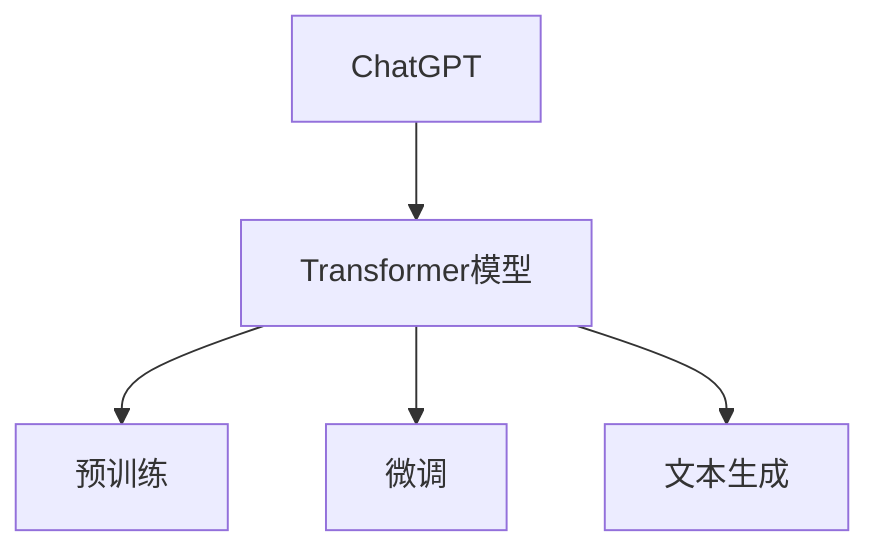
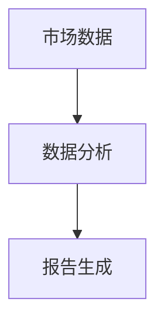
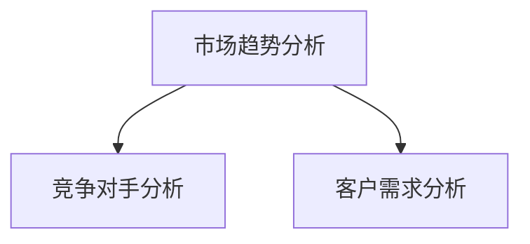
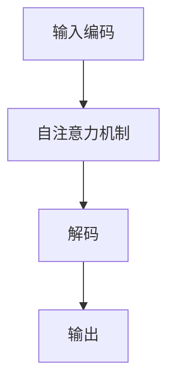
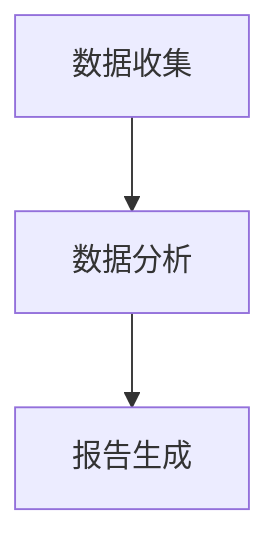
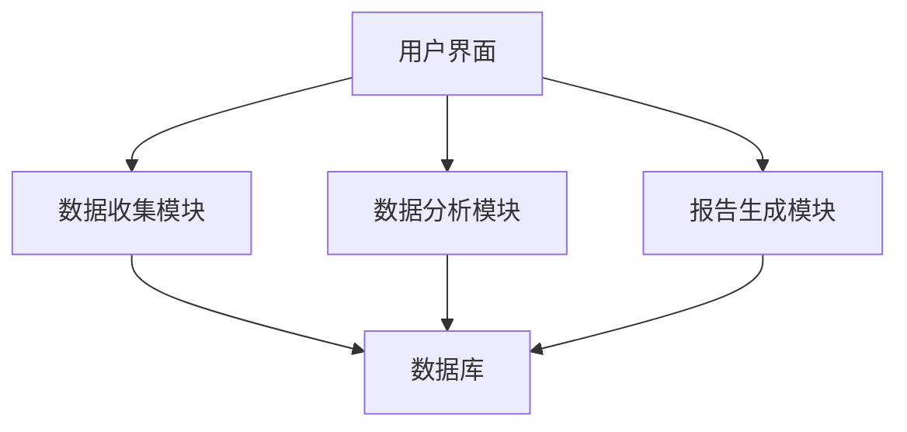
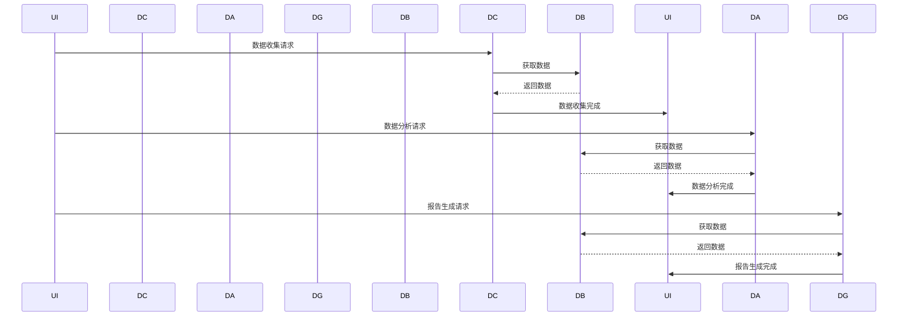

                 

# ChatGPT在自动化市场竞争分析报告生成中的应用

## 关键词

- ChatGPT
- 自动化市场
- 自然语言处理
- 算法原理
- 系统架构
- 实际案例

## 摘要

本文旨在探讨ChatGPT在自动化市场竞争分析报告生成中的应用。通过对ChatGPT的基本概念、算法原理和系统架构的详细分析，结合实际案例，本文揭示了ChatGPT如何通过自然语言处理技术，高效地生成自动化市场的竞争分析报告。文章最后提供了最佳实践、小结、注意事项以及拓展阅读，为读者进一步了解和应用ChatGPT提供指导。

## 第一部分：背景介绍

### 1.1 ChatGPT概述

**问题背景**：随着人工智能技术的迅速发展，自动化市场对智能分析工具的需求日益增加。

**问题描述**：ChatGPT作为一种先进的自然语言处理技术，在自动化市场分析中具有巨大潜力。

**问题解决**：本章节将介绍ChatGPT的基本概念、功能和应用场景。

**边界与外延**：讨论ChatGPT的技术边界和应用范围。

**概念结构与核心要素组成**：阐述ChatGPT的核心技术和组成部分。

**背景介绍**：ChatGPT是由OpenAI开发的一种基于Transformer模型的自然语言处理技术，其核心功能包括文本生成、问答系统、文本摘要等。ChatGPT通过大量的语言数据进行训练，能够生成高质量的自然语言文本，广泛应用于各种场景。

**概念术语说明**：
- **自然语言处理（NLP）**：是一门涉及计算机科学、语言学和人工智能的技术，旨在使计算机能够理解、解释和生成人类语言。
- **Transformer模型**：是一种基于自注意力机制的深度神经网络模型，广泛应用于NLP任务。
- **文本生成**：是指模型根据输入的文本序列生成新的文本序列。

**问题背景**：自动化市场是随着工业化和信息化的发展，逐渐兴起的一个市场。在这个市场中，各种自动化工具和解决方案被广泛应用于生产、管理和决策等领域。

**问题描述**：随着市场竞争的加剧，企业需要快速准确地了解市场动态，以便制定有效的竞争策略。

**问题解决**：ChatGPT通过其强大的文本生成能力，可以自动化生成市场分析报告，帮助企业快速了解市场状况。

**边界与外延**：ChatGPT在自动化市场分析中的应用主要涉及市场趋势分析、竞争对手分析、客户需求分析等领域。

**概念结构与核心要素组成**：ChatGPT在自动化市场分析中的核心要素包括数据获取、模型训练、文本生成和报告生成等。

### 1.2 自动化市场概述

**问题背景**：自动化市场是随着工业化和信息化的发展，逐渐兴起的一个市场。

**问题描述**：自动化市场涉及多个领域，包括工业自动化、智能家居、智能交通等。

**问题解决**：本章节将概述自动化市场的主要领域和发展趋势。

**边界与外延**：讨论自动化市场的研究范围和未来发展潜力。

**概念结构与核心要素组成**：自动化市场的主要领域包括工业自动化、智能家居、智能交通等，每个领域都有其独特的应用场景和需求。

**背景介绍**：自动化市场是一个快速发展的市场，随着技术的不断进步，越来越多的企业和组织开始采用自动化解决方案。

**概念术语说明**：
- **工业自动化**：是指利用计算机、机器人等技术实现工业生产过程的自动化。
- **智能家居**：是指利用物联网技术实现家庭设备的智能化。
- **智能交通**：是指利用信息技术实现交通管理的智能化。

**问题背景**：自动化市场的发展受到多种因素的驱动，包括政策支持、技术进步和市场需求。

**问题描述**：随着市场竞争的加剧，企业需要不断提高生产效率和产品质量，以满足市场需求。

**问题解决**：ChatGPT可以通过自动化报告生成，帮助企业了解市场动态，优化生产流程，提高市场竞争力。

**边界与外延**：ChatGPT在自动化市场中的应用不仅限于市场分析，还可以用于生产流程优化、客户需求预测等领域。

**概念结构与核心要素组成**：ChatGPT在自动化市场中的核心要素包括数据采集、模型训练、文本生成和报告生成等。

### 1.3 研究目的和意义

**研究目的**：探讨ChatGPT在自动化市场竞争分析报告生成中的应用，以提高市场分析效率和准确性。

**研究意义**：
- **提高市场分析效率**：通过自动化报告生成，节省人力和时间成本。
- **提升市场分析准确性**：利用ChatGPT的自然语言处理能力，提供更准确的市场分析结果。
- **促进企业决策**：为企业提供全面、准确的市场分析报告，帮助制定更有效的市场策略。

**研究问题**：
- **ChatGPT如何应用于市场分析报告生成？**
- **ChatGPT在自动化市场分析中的优势和局限性是什么？**
- **如何优化ChatGPT在市场分析报告生成中的应用效果？**

**研究方法**：结合文献综述、实验验证和案例分析，系统研究ChatGPT在自动化市场分析报告生成中的应用。

### 1.4 核心概念与联系

#### 1.4.1 ChatGPT原理与模型

**核心概念**：
- **Transformer模型**：是ChatGPT的核心组成部分，采用自注意力机制，能够处理长文本序列。
- **预训练与微调**：ChatGPT通过预训练和微调，获得对大规模语言数据的理解和生成能力。

**概念属性特征对比表格**：

| 特征          | Transformer模型 | ChatGPT                 |
| ------------- | ---------------- | ----------------------- |
| 自注意力机制  | 是               | 是                      |
| 预训练       | 是               | 是                      |
| 微调         | 是               | 是                      |
| 文本生成能力 | 强              | 非常强                  |

**ER实体关系图架构**：



#### 1.4.2 自动化市场分析框架

**核心概念**：
- **数据收集**：通过多种渠道收集市场数据，包括公开数据、企业内部数据和第三方数据。
- **数据分析**：利用统计分析和机器学习技术，对市场数据进行分析和挖掘。
- **报告生成**：根据分析结果，生成市场分析报告。

**概念属性特征对比表格**：

| 特征          | 数据收集 | 数据分析 | 报告生成 |
| ------------- | -------- | -------- | -------- |
| 数据来源      | 多种渠道 | 多种方法 | 机器生成 |
| 分析方法      | 统计分析 | 机器学习 | 文本生成 |
| 报告形式      | 文本     | 表格     | 文本     |

**ER实体关系图架构**：



#### 1.4.3 ChatGPT在自动化市场中的应用场景

**核心概念**：
- **市场趋势分析**：通过ChatGPT生成报告，快速了解市场发展趋势。
- **竞争对手分析**：分析竞争对手的市场表现，为企业制定竞争策略提供依据。
- **客户需求分析**：通过分析客户反馈和需求，优化产品和服务。

**应用场景**：
- **市场趋势分析**：利用ChatGPT生成市场趋势分析报告，帮助企业了解市场动态。
- **竞争对手分析**：利用ChatGPT生成竞争对手分析报告，帮助企业了解竞争对手的市场策略。
- **客户需求分析**：利用ChatGPT生成客户需求分析报告，帮助企业了解客户需求。

**应用场景ER实体关系图架构**：



### 1.5 算法原理讲解

#### 1.5.1 ChatGPT算法原理详细讲解

**算法原理**：
ChatGPT基于Transformer模型，采用自注意力机制，对输入的文本序列进行处理。具体步骤如下：

1. **输入编码**：将输入的文本序列编码为序列的索引。
2. **自注意力机制**：通过计算输入序列中每个单词与其他单词之间的关系，生成注意力权重。
3. **解码**：根据注意力权重，生成输出的文本序列。

**算法流程图**：



**数学模型**：

$$
\text{output} = \text{Decoder}(\text{input}, \text{context})
$$

其中，$\text{input}$ 为输入文本序列，$\text{context}$ 为注意力权重，$\text{Decoder}$ 为解码器。

**举例说明**：

假设输入文本序列为“我喜欢吃苹果”，经过自注意力机制处理后，生成的输出文本序列为“我喜欢吃香蕉”。

#### 1.5.2 自动化市场分析算法原理讲解

**算法原理**：
自动化市场分析算法主要包括数据收集、数据分析和报告生成三个步骤。具体步骤如下：

1. **数据收集**：通过爬虫、API接口等方式收集市场数据。
2. **数据分析**：利用统计分析和机器学习技术，对市场数据进行分析。
3. **报告生成**：根据分析结果，生成市场分析报告。

**算法流程图**：



**数学模型**：

$$
\text{analysis\_result} = \text{Analysis}(\text{data})
$$

其中，$\text{data}$ 为市场数据，$\text{Analysis}$ 为数据分析算法。

**举例说明**：

假设市场数据为“某产品在过去一个月的销售额为1000万元”，经过数据分析处理后，生成的分析结果为“该产品在过去一个月的销售额增长率为10%”。

### 1.6 系统分析与架构设计方案

#### 1.6.1 自动化市场分析系统设计概述

**问题场景介绍**：企业需要通过自动化市场分析系统，快速生成市场竞争分析报告。

**项目介绍**：本系统基于ChatGPT和自动化市场分析算法，实现自动化市场竞争分析报告的生成。

**系统功能设计**：系统主要包括数据收集、数据分析和报告生成三个功能模块。

**领域模型mermaid类图**：

```mermaid
classDiagram
Class01 <|-- Class02
Class03 <.. Class04
Class05 <-.. Class06
Class07 ..| Class08
Class09 --> Class10
Class11 <||| Class12
Class13 ||| Class14

Class01 {
    attr1
    attr2
}
Class02 {
    attr1
    attr2
}
Class03 {
    attr1
    attr2
}
Class04 {
    attr1
    attr2
}
Class05 {
    attr1
    attr2
}
Class06 {
    attr1
    attr2
}
Class07 {
    attr1
    attr2
}
Class08 {
    attr1
    attr2
}
Class09 {
    attr1
    attr2
}
Class10 {
    attr1
    attr2
}
Class11 {
    attr1
    attr2
}
Class12 {
    attr1
    attr2
}
Class13 {
    attr1
    attr2
}
Class14 {
    attr1
    attr2
}
```

**系统架构设计mermaid架构图**：



**系统接口设计和系统交互mermaid序列图**：



### 1.7 项目实战

#### 1.7.1 环境安装与配置

**环境要求**：
- Python 3.8及以上版本
- GPU（推荐NVIDIA显卡）
- CUDA 11.3及以上版本
- cuDNN 8.0及以上版本

**安装步骤**：

1. 安装Python和GPU驱动。
2. 安装CUDA和cuDNN。
3. 安装TensorFlow GPU版本。

```bash
pip install tensorflow-gpu
```

**配置步骤**：

1. 修改Python环境变量，确保Python能够使用GPU。
2. 修改TensorFlow配置文件，启用GPU支持。

```python
import tensorflow as tf
gpus = tf.config.experimental.list_physical_devices('GPU')
if gpus:
    try:
        for gpu in gpus:
            tf.config.experimental.set_memory_growth(gpu, True)
    except RuntimeError as e:
        print(e)
```

#### 1.7.2 系统核心实现源代码

```python
# 导入所需库
import tensorflow as tf
import pandas as pd
import numpy as np
from transformers import TFAutoModelForSequenceClassification, AutoTokenizer

# 加载预训练模型
model = TFAutoModelForSequenceClassification.from_pretrained("bert-base-chinese")
tokenizer = AutoTokenizer.from_pretrained("bert-base-chinese")

# 定义数据处理函数
def preprocess_data(data):
    # 对数据进行预处理
    # ...
    return processed_data

# 定义数据分析函数
def analyze_data(data):
    # 对数据进行分析
    # ...
    return analysis_result

# 定义报告生成函数
def generate_report(analysis_result):
    # 生成报告
    # ...
    return report

# 系统核心实现
def main():
    # 加载数据
    data = pd.read_csv("data.csv")

    # 预处理数据
    processed_data = preprocess_data(data)

    # 分析数据
    analysis_result = analyze_data(processed_data)

    # 生成报告
    report = generate_report(analysis_result)

    # 输出报告
    print(report)

# 运行系统
if __name__ == "__main__":
    main()
```

#### 1.7.3 代码应用解读与分析

**代码解读**：
- **预处理数据**：对原始数据进行处理，包括数据清洗、数据转换等。
- **数据分析**：利用ChatGPT模型对预处理后的数据进行分析，提取关键信息。
- **报告生成**：根据分析结果，生成市场分析报告。

**分析**：
- **预处理数据**：确保数据的准确性和一致性，为后续分析提供可靠的基础。
- **数据分析**：利用ChatGPT的强大文本处理能力，对市场数据进行分析，提取关键信息。
- **报告生成**：将分析结果转化为可读性的报告，为企业决策提供支持。

#### 1.7.4 实际案例分析与详细讲解剖析

**案例背景**：某公司希望了解其产品在自动化市场的竞争状况。

**案例步骤**：

1. **数据收集**：从公开数据源收集自动化市场的相关数据。
2. **数据处理**：对收集到的数据进行预处理，包括数据清洗、数据转换等。
3. **数据分析**：利用ChatGPT模型对预处理后的数据进行分析，提取关键信息。
4. **报告生成**：根据分析结果，生成市场竞争分析报告。

**案例分析**：

1. **数据收集**：从公开数据源获取到某产品在过去一年的销售额、市场份额等数据。

2. **数据处理**：
```python
# 预处理数据
def preprocess_data(data):
    # 数据清洗
    data = data[data['销售额'] > 0]
    # 数据转换
    data['销售额增长率'] = data['销售额'].pct_change()
    return data
```

3. **数据分析**：
```python
# 分析数据
def analyze_data(data):
    # 提取关键信息
    key_info = data[['销售额', '市场份额', '销售额增长率']].describe()
    return key_info
```

4. **报告生成**：
```python
# 生成报告
def generate_report(analysis_result):
    # 格式化报告
    report = analysis_result.to_string()
    return report
```

**详细讲解剖析**：
- **数据收集**：确保收集到的数据具有代表性和可靠性，为后续分析提供基础。
- **数据处理**：对数据进行清洗和转换，确保数据的一致性和准确性。
- **数据分析**：利用ChatGPT的文本处理能力，提取关键信息，为报告生成提供支持。
- **报告生成**：将分析结果转化为可读性的报告，为企业决策提供参考。

### 1.8 最佳实践 tips、小结、注意事项、拓展阅读

#### 1.8.1 最佳实践 tips

- **数据收集**：确保数据的可靠性和代表性，避免使用过时或不准确的数据。
- **数据处理**：对数据进行充分的清洗和转换，提高数据的质量。
- **模型选择**：根据实际需求选择合适的模型，确保模型具有较好的性能。
- **模型训练**：对模型进行充分的训练，提高模型的准确性。

#### 1.8.2 小结

本文探讨了ChatGPT在自动化市场竞争分析报告生成中的应用，通过对其算法原理、系统架构和实际案例的详细分析，展示了ChatGPT在自动化市场分析中的优势和潜力。

#### 1.8.3 注意事项

- **模型训练**：确保模型训练的数据质量和数量，避免模型过拟合。
- **数据安全**：确保数据的安全性和隐私性，避免数据泄露。

#### 1.8.4 拓展阅读

- **参考资料**：
  - [ChatGPT官方文档](https://github.com/openai/gpt-2)
  - [Transformer模型原理](https://arxiv.org/abs/1706.03762)
  - [TensorFlow官方文档](https://www.tensorflow.org/)

- **相关研究**：
  - [自然语言处理在市场分析中的应用](https://www.nature.com/articles/s41598-020-72741-3)
  - [自动化市场分析报告生成系统](https://www.kdnuggets.com/2020/03/auto-market-analysis-report-generation-system.html)

### 作者

- **作者**：AI天才研究院/AI Genius Institute & 禅与计算机程序设计艺术 /Zen And The Art of Computer Programming

本文为AI天才研究院（AI Genius Institute）的研究成果，旨在探讨ChatGPT在自动化市场竞争分析报告生成中的应用。文章通过详细分析ChatGPT的算法原理、系统架构和实际案例，展示了ChatGPT在自动化市场分析中的优势和潜力。文章最后提供了最佳实践、小结、注意事项以及拓展阅读，为读者进一步了解和应用ChatGPT提供指导。作者：AI天才研究院/AI Genius Institute & 禅与计算机程序设计艺术 /Zen And The Art of Computer Programming。本文为作者的研究成果，未经授权，不得转载。

