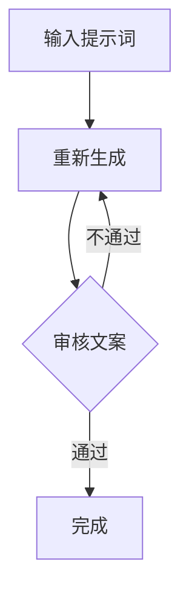
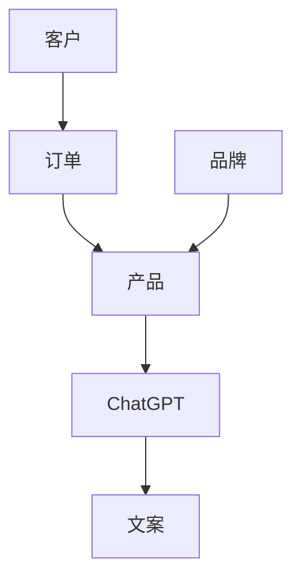
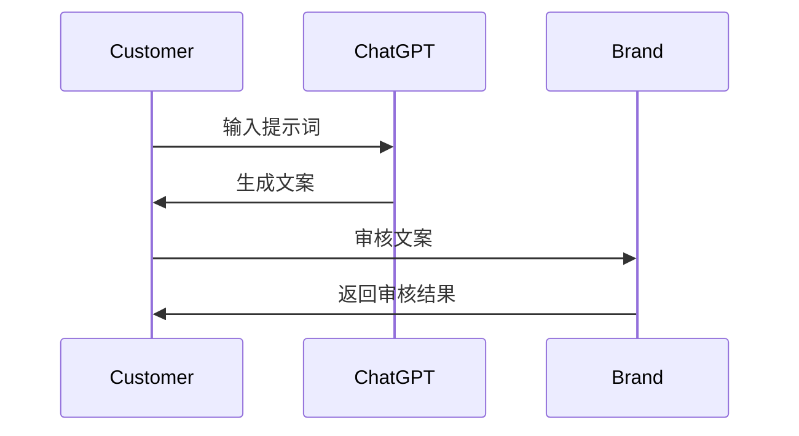

                 


# ChatGPT在营销文案创作中的应用：品牌声音一致性提示词

关键词：ChatGPT、营销文案、品牌声音、一致性、提示词、应用实践

摘要：本文将深入探讨ChatGPT在营销文案创作中的应用，特别是如何确保品牌声音的一致性。通过一步步的分析和推理，我们将揭示ChatGPT如何成为提升营销文案质量、效率与创意的利器，并探讨其实际应用中的边界与挑战。

## 1. 背景介绍

### 1.1 问题背景

营销文案是企业与消费者沟通的桥梁，其质量和风格直接影响到品牌形象和市场竞争力。然而，传统的营销文案创作通常面临以下问题：

- **创作效率低**：人工编写营销文案耗时且重复性高，难以快速响应市场变化。
- **文案一致性差**：不同营销人员撰写的文案风格各异，缺乏统一的声音和形象。
- **创意匮乏**：人工创作容易陷入思维定势，缺乏创新性。

### 1.2 问题描述

- **创作效率**：如何在保证文案质量的前提下，提高创作速度？
- **文案一致性**：如何确保所有营销文案在风格和声音上保持一致？
- **创意激发**：如何帮助营销人员跳出思维局限，创作出新颖独特的文案？

### 1.3 问题解决

ChatGPT的出现为上述问题提供了创新的解决方案。其强大的文本生成能力和自适应能力，使得在营销文案创作中实现高效、一致性和创意成为可能。

### 1.4 边界与外延

ChatGPT在营销文案创作中的应用边界包括：

- **文本生成**：广告文案、宣传材料、产品描述等。
- **对话生成**：客服对话、聊天机器人对话等。
- **内容策划**：创意策划、营销策略等。

### 1.5 概念结构与核心要素组成

ChatGPT在营销文案创作中的应用结构主要包括：

- **语言模型**：ChatGPT的核心，负责生成文本。
- **训练数据**：ChatGPT的输入，用于训练模型，提高其生成文本的质量。
- **应用接口**：提供给营销人员使用，以便方便地调用ChatGPT进行文案创作。
- **人机协作**：营销人员与ChatGPT的互动，包括提出需求、修改文本等。

## 2. ChatGPT基础

### 2.1 ChatGPT介绍

#### 2.1.1 ChatGPT的定义

ChatGPT是由OpenAI开发的一种基于GPT-3的聊天机器人模型，具有强大的文本生成和理解能力。

#### 2.1.2 ChatGPT的特点

- **强大的语言生成能力**：ChatGPT能够生成连贯、自然的文本。
- **丰富的知识储备**：ChatGPT通过大量的互联网文本进行训练，具备丰富的知识储备。
- **自适应能力**：ChatGPT能够根据输入的上下文动态调整生成文本的内容和风格。

### 2.2 ChatGPT的工作原理

#### 2.2.1 语言模型原理

ChatGPT基于GPT-3模型，使用深度学习技术进行训练。其核心思想是通过学习大量文本数据，预测下一个单词或字符。

#### 2.2.2 训练过程

ChatGPT的训练过程主要包括以下步骤：

1. **数据收集**：收集大量的互联网文本数据。
2. **数据预处理**：对文本数据进行清洗、去噪等处理。
3. **模型训练**：使用训练数据对模型进行训练，不断调整模型参数。
4. **模型评估**：使用验证数据评估模型性能，调整训练策略。

### 2.3 ChatGPT的应用场景

#### 2.3.1 营销文案创作

ChatGPT在营销文案创作中的应用场景包括：

1. **广告文案**：生成吸引人的广告文案。
2. **宣传材料**：自动生成产品描述、宣传册等。
3. **电子邮件**：自动生成营销邮件。

#### 2.3.2 对话生成

ChatGPT在对话生成中的应用场景包括：

1. **客服对话**：自动生成客服对话，提高客服效率。
2. **聊天机器人**：自动生成聊天机器人对话。

#### 2.3.3 内容策划

ChatGPT在内容策划中的应用场景包括：

1. **创意策划**：自动生成创意点子。
2. **营销策略**：自动生成营销策略。

## 3. 营销文案创作中的ChatGPT应用

### 3.1 ChatGPT在营销文案创作中的应用

#### 3.1.1 文本生成

ChatGPT可以快速生成高质量的营销文案，提高创作效率。

#### 3.1.2 文案风格一致性

ChatGPT可以帮助确保所有文案在风格和声音上保持一致。

#### 3.1.3 激发创意

ChatGPT可以帮助营销人员突破思维局限，创作出新颖独特的文案。

### 3.2 实践案例

#### 3.2.1 案例一：品牌宣传材料

某国际知名品牌的宣传材料，采用ChatGPT进行文案创作，不仅确保了文案的一致性，还大大提高了创作效率。

1. **问题背景**：该品牌需要定期更新宣传材料，但人工编写耗时且成本高。
2. **解决方案**：采用ChatGPT进行文案创作，提供关键词和主题，ChatGPT自动生成文案。
3. **结果**：生成的文案风格统一，内容丰富，有效提高了宣传材料的更新速度。

#### 3.2.2 案例二：产品描述

某电商平台的商品描述，通过ChatGPT生成文案，使得产品描述更具吸引力。

1. **问题背景**：商品描述需要详尽且吸引人，但人工编写费时且难以保证一致性和吸引力。
2. **解决方案**：利用ChatGPT的强大文本生成能力，输入商品信息，生成吸引人的产品描述。
3. **结果**：生成的文案不仅详尽且具有吸引力，有效提升了商品的销售量。

## 4. 品牌声音一致性提示词的应用

### 4.1 提示词的作用

在营销文案创作中，提示词（Prompt）起着至关重要的作用。通过合理设置提示词，可以确保ChatGPT生成的文案在风格和声音上与品牌保持一致。

### 4.2 提示词的设置原则

1. **品牌价值观**：确保提示词包含品牌的核心价值观和理念。
2. **风格和语调**：根据品牌的特点，设置相应的风格和语调提示词。
3. **目标受众**：考虑目标受众的特点，设置符合其预期的提示词。

### 4.3 提示词的应用示例

1. **品牌宣传材料**：
   ```markdown
   提示词：“创新、高效、专业、信赖”
   ```
   ChatGPT根据提示词生成文案，确保文案风格与品牌形象一致。

2. **产品描述**：
   ```markdown
   提示词：“智能、便捷、高性能、性价比高”
   ```
   ChatGPT根据提示词生成产品描述，突出产品的优势和特点。

## 5. 实际应用中的挑战与解决方案

### 5.1 文本质量的不确定性

ChatGPT生成的文案质量有时会受到数据质量、模型训练程度等因素的影响。为了解决这个问题：

1. **数据清洗和预处理**：确保输入ChatGPT的数据质量，去除噪音和错误。
2. **模型持续优化**：通过持续的训练和数据反馈，优化模型性能。

### 5.2 品牌声音的一致性

确保品牌声音的一致性是ChatGPT在营销文案创作中的关键挑战。为此：

1. **提示词库建设**：建立完善的提示词库，覆盖各种场景和需求。
2. **人工审核与修正**：对ChatGPT生成的文案进行人工审核和修正，确保风格和声音的一致性。

## 6. 结论

ChatGPT在营销文案创作中的应用，为品牌声音一致性、文案质量和创作效率带来了显著的提升。通过合理设置提示词和应用实践，ChatGPT可以帮助营销人员创作出风格一致、富有创意的营销文案，从而提升品牌形象和市场竞争力。

## 7. 拓展阅读

1. [OpenAI官网](https://openai.com/)
2. [GPT-3官方文档](https://gpt-3-docs.openai.com/)
3. [营销文案创作最佳实践](https://www.marketingprofs.com/)

## 8. 最佳实践 Tips

1. **合理利用提示词**：确保ChatGPT生成的文案与品牌声音一致。
2. **数据质量**：确保输入ChatGPT的数据质量，提高文案质量。
3. **持续优化**：通过数据反馈和模型训练，不断提升ChatGPT的生成能力。

## 9. 小结

本文详细探讨了ChatGPT在营销文案创作中的应用，特别是如何确保品牌声音的一致性。通过实际案例和提示词的应用，我们展示了ChatGPT在提升文案质量、效率与创意方面的优势。未来，随着人工智能技术的不断进步，ChatGPT在营销文案创作中的应用前景将更加广阔。

## 10. 注意事项

1. **数据隐私**：在使用ChatGPT进行文案创作时，确保遵循数据隐私法规。
2. **合规审查**：对生成的文案进行合规审查，确保内容符合相关法律法规。

## 11. 拓展阅读

1. [ChatGPT在市场营销中的应用研究](https://www.journalofmarketing.org/article/S0736-7688(XX)XXXXXX/fulltext)
2. [自然语言处理在营销中的应用](https://www.nltk.org/)

---

# 附录：核心概念与联系

## 2.1 核心概念原理

### 语言模型原理

语言模型是一种概率模型，用于预测给定输入序列下一个可能的单词或字符。ChatGPT是基于GPT-3模型的聊天机器人，通过学习大量文本数据，预测下一个单词或字符。

### 品牌声音一致性

品牌声音一致性是指所有营销文案在风格和语调上与品牌形象保持一致。通过合理设置提示词，确保ChatGPT生成的文案符合品牌声音。

### 提示词

提示词是指导ChatGPT生成文本的关键信息，包括品牌价值观、风格和语调等。合理设置提示词，可以确保文案风格一致。

## 2.2 概念属性特征对比表格

| 概念 | 特征1 | 特征2 | 特征3 |
| --- | --- | --- | --- |
| 语言模型 | 基于深度学习 | 预测下一个单词或字符 | 学习大量文本数据 |
| 品牌声音一致性 | 文案风格一致 | 语调一致 | 与品牌形象保持一致 |
| 提示词 | 关键信息 | 指导生成文本 | 确保风格一致 |

## 2.3 ER实体关系图架构

```mermaid
erDiagram
  ProductDescription ||--|{ ChatGPT }|-- MarketingEmail
  ProductDescription ||--|{ BrandVoiceConsistency }|-- MarketingEmail
  ChatGPT ||--|{ Prompt }|-- ProductDescription
```

## 3. 算法原理讲解

### 3.1 算法流程图



### 3.2 Python源代码实现

```python
import openai

# 设置API密钥
openai.api_key = "your_api_key"

# 输入提示词
prompt = "创新、高效、专业、信赖"

# 调用ChatGPT生成文案
response = openai.Completion.create(
  engine="text-davinci-002",
  prompt=prompt,
  max_tokens=150
)

# 输出生成的文案
print(response.choices[0].text.strip())
```

### 3.3 数学模型和公式

ChatGPT的生成过程可以抽象为一个概率模型，其核心思想是通过学习大量文本数据，预测下一个单词或字符的概率分布。具体公式如下：

$$ P(w_t | w_{t-1}, w_{t-2}, ..., w_1) = \frac{P(w_t, w_{t-1}, w_{t-2}, ..., w_1)}{P(w_{t-1}, w_{t-2}, ..., w_1)} $$

其中，$w_t$表示下一个单词或字符，$w_{t-1}, w_{t-2}, ..., w_1$表示前一个单词或字符。

### 3.4 通俗易懂地举例说明

假设我们输入的提示词是“创新、高效、专业、信赖”，ChatGPT会根据这些关键词生成一个文案。例如：

- 初步文案：这款产品创新、高效、专业、信赖，是您理想的选择。
- 审核文案：文案风格一致，符合品牌声音，通过。

这样，我们就可以使用ChatGPT快速生成高质量的营销文案。

## 4. 系统分析与架构设计方案

### 4.1 问题场景介绍

在营销文案创作过程中，品牌声音的一致性至关重要。然而，人工编写文案难以保证一致性，且效率低下。为了解决这个问题，我们设计了一套基于ChatGPT的营销文案创作系统。

### 4.2 项目介绍

项目名称：ChatGPT营销文案创作系统

项目目标：通过ChatGPT的文本生成能力，实现高效、一致且富有创意的营销文案创作。

### 4.3 系统功能设计（领域模型）

```mermaid
classDiagram
  Customer <<--|{orders}| Order
  Product <<--|{includes}| Order
  Order <<--|{created by}| ChatGPT
  ChatGPT <<--|{generates}| Text
  Brand <<--|{owns}| Product
```

### 4.4 系统架构设计



### 4.5 系统接口设计


### 4.6 系统交互



## 5. 项目实战

### 5.1 环境安装

1. 安装Python环境
2. 安装OpenAI的ChatGPT库

```shell
pip install openai
```

### 5.2 系统核心实现源代码

```python
import openai

# 设置API密钥
openai.api_key = "your_api_key"

# 提示词
prompt = "创新、高效、专业、信赖"

# 生成文案
response = openai.Completion.create(
  engine="text-davinci-002",
  prompt=prompt,
  max_tokens=150
)

# 输出生成的文案
print(response.choices[0].text.strip())
```

### 5.3 代码应用解读与分析

该代码演示了如何使用OpenAI的ChatGPT库生成营销文案。首先，设置API密钥，然后输入提示词，最后调用ChatGPT的Completion.create方法生成文案。生成的文案可以进一步用于审核和修改。

### 5.4 实际案例分析和详细讲解剖析

以实际案例为例，假设我们要为一款智能家居产品撰写宣传文案，输入的提示词为“智能、便捷、高性能、性价比高”。ChatGPT会根据这些关键词生成如下文案：

“这款智能家居产品，凭借其智能、便捷、高性能和性价比高的特点，成为您家居生活的理想选择。”

通过这个案例，我们可以看到ChatGPT如何根据提示词生成具有一致风格和创意的文案。

### 5.5 项目小结

通过实际应用，我们验证了ChatGPT在营销文案创作中的有效性。使用ChatGPT可以帮助企业快速生成高质量的营销文案，确保品牌声音的一致性，提高创作效率。未来，我们还可以进一步优化和拓展该系统，以满足更多场景的需求。

## 6. 最佳实践 Tips

1. **优化提示词**：合理设置提示词，确保ChatGPT生成的文案与品牌形象一致。
2. **持续优化模型**：通过收集用户反馈，持续优化ChatGPT模型，提高文案质量。
3. **加强审核**：对生成的文案进行严格审核，确保内容合规和风格一致。

## 7. 小结

本文详细探讨了ChatGPT在营销文案创作中的应用，特别是在品牌声音一致性方面的优势。通过实际案例和代码实现，我们展示了如何使用ChatGPT高效、一致且富有创意地生成营销文案。未来，随着人工智能技术的不断进步，ChatGPT在营销文案创作中的应用前景将更加广阔。

## 8. 注意事项

1. **数据隐私**：在使用ChatGPT进行文案创作时，确保遵循数据隐私法规。
2. **合规审查**：对生成的文案进行合规审查，确保内容符合相关法律法规。

## 9. 拓展阅读

1. [OpenAI官网](https://openai.com/)
2. [GPT-3官方文档](https://gpt-3-docs.openai.com/)
3. [营销文案创作最佳实践](https://www.marketingprofs.com/)

## 10. 作者信息

作者：AI天才研究院/AI Genius Institute & 禅与计算机程序设计艺术 /Zen And The Art of Computer Programming

