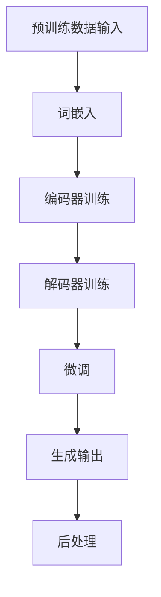
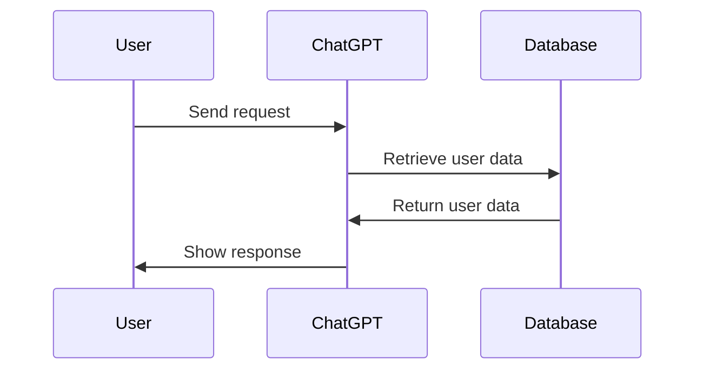

                 

### 文章标题

# ChatGPT在语言习得临界期研究中的作用

### 文章关键词

- ChatGPT
- 语言习得临界期
- 人工智能
- 语言教学
- 教育技术

### 摘要

本文探讨了ChatGPT在语言习得临界期研究中的作用。首先，我们介绍了语言习得临界期的概念和关键要素，随后详细解析了ChatGPT的核心特性及其工作原理。接着，我们分析了ChatGPT在语言习得中的实际应用，探讨了其优势与挑战。随后，我们运用系统分析与架构设计的方法，介绍了ChatGPT在语言习得中的系统架构设计及实现。最后，通过实际项目案例的剖析，我们总结了ChatGPT在语言习得中的最佳实践和未来展望。本文旨在为教育技术领域提供一个新的研究视角和应用方案。

## 第一部分：背景介绍

### 第1章：问题背景

#### 1.1.1 问题的提出

在全球化迅速发展的今天，跨文化交流变得愈发频繁，掌握多种语言已经成为人们必备的技能。然而，语言习得并非易事，其中存在着许多难点。尤其是在语言习得临界期，即儿童时期到青少年早期的阶段，个体的语言习得能力受到生理、心理和社会等多方面因素的影响，呈现出显著的波动性和不确定性。这一阶段的语言习得效率和质量对个体未来的语言能力产生深远的影响。

传统语言教学方法虽然在一定程度上取得了成效，但往往存在教学资源有限、教学效率低下、个体差异处理不足等问题。因此，如何利用现代技术手段提高语言习得效率，特别是在语言习得临界期内提供个性化的语言学习支持，成为当前教育领域亟待解决的重要问题。

#### 1.1.2 语言习得临界期的概念

语言习得临界期是指个体在特定年龄段内，具有高效语言习得能力的时期。根据研究，这一阶段通常发生在儿童时期到青少年早期，即大约从出生到12岁左右。在这个时期内，个体大脑的语言处理区域高度活跃，对外界语言刺激的敏感度较高，能够迅速吸收并掌握语言知识。

然而，语言习得临界期并非一成不变，其长度和具体时间范围因个体差异、环境因素和学习方法的不同而有所变化。例如，生活在多语言环境中的个体，其语言习得临界期可能延长，因为多语言环境提供了更多的语言刺激和学习机会。

#### 1.1.3 语言习得临界期的关键要素

语言习得临界期的关键要素包括以下几个：

1. **大脑发育**：大脑的语言处理区域在临界期内经历显著发育，尤其是在前额叶和颞叶区域。这些区域的发育对语言习得能力至关重要。

2. **环境刺激**：丰富的语言刺激是语言习得的基础。个体在临界期内接触到的语言环境越多样，其语言习得能力越强。

3. **社会互动**：与他人进行语言交流是语言习得的重要途径。社会互动不仅提供了语言学习的实践机会，还能帮助个体理解语言的社会功能和语境。

4. **学习动机**：个体的学习动机直接影响语言习得效果。在临界期内，个体对语言学习的兴趣和动力对语言习得具有积极影响。

#### 1.1.4 语言习得临界期的研究现状

近年来，语言习得临界期的研究取得了显著进展。研究者们通过脑成像技术、行为实验和跨文化研究等多种方法，深入探讨了临界期的神经机制、认知过程和影响因素。例如，一些研究表明，临界期内的神经网络可塑性强，能够通过语言训练实现结构和功能的优化。

同时，人工智能技术的发展为语言习得临界期研究提供了新的可能性。例如，基于深度学习的人工智能系统可以模拟人类语言学习过程，为个体提供个性化的学习支持和反馈。然而，当前关于人工智能在语言习得临界期应用的研究仍较为有限，亟需进一步探索和验证。

### 第2章：核心概念

#### 2.1.1 ChatGPT的概念

ChatGPT是OpenAI开发的一种基于Transformer架构的预训练语言模型。它通过大量文本数据进行训练，学会了理解和生成人类语言。ChatGPT的特点包括：

1. **强文本理解能力**：ChatGPT能够理解复杂文本的含义和语境，这使得它适用于各种自然语言处理任务。

2. **自适应生成能力**：ChatGPT可以根据输入的文本生成连贯、自然的语言输出，这在对话系统、文本生成等领域具有广泛应用。

3. **多语言支持**：ChatGPT支持多种语言，可以处理不同语言之间的翻译和交互。

#### 2.1.2 ChatGPT的核心特性

ChatGPT的核心特性包括以下几点：

1. **预训练与微调**：ChatGPT通过大规模预训练获得基础语言能力，然后通过微调适应特定任务或领域。

2. **多任务学习**：ChatGPT能够同时处理多种语言任务，如文本分类、情感分析、问答系统等。

3. **灵活性与适应性**：ChatGPT可以根据不同的应用场景和需求进行定制化调整，提供灵活、高效的语言服务。

#### 2.1.3 ChatGPT在语言习得中的潜力

ChatGPT在语言习得中的潜力主要体现在以下几个方面：

1. **个性化学习支持**：ChatGPT可以根据个体语言水平、学习需求和兴趣提供个性化的学习内容和任务。

2. **实时反馈与纠正**：ChatGPT能够实时分析个体的语言输出，提供即时的反馈和纠正，帮助个体纠正错误并提高语言准确性。

3. **交互式学习体验**：ChatGPT可以与个体进行交互式对话，创造生动的语言学习环境，激发学习兴趣和积极性。

### 第3章：ChatGPT的工作原理

#### 3.1.1 ChatGPT的算法原理

ChatGPT采用基于Transformer的预训练语言模型。Transformer是一种基于自注意力机制的深度神经网络，具有处理长文本序列的强大能力。ChatGPT的算法原理可以概括为以下几个步骤：

1. **预训练**：在预训练阶段，ChatGPT通过无监督学习从大量文本数据中学习语言模式。这一过程包括词嵌入、编码器和解码器的训练。

2. **微调**：在微调阶段，ChatGPT根据特定任务或领域的数据进行有监督学习，调整模型参数，以适应具体任务。

3. **生成**：在生成阶段，ChatGPT根据输入文本生成连贯、自然的语言输出。这一过程通过解码器实现，包括词表查找、文本生成和后处理。

#### 3.1.2 ChatGPT的数学模型

ChatGPT的数学模型主要基于Transformer架构。Transformer的数学模型包括以下几个关键组件：

1. **多头自注意力（Multi-Head Self-Attention）**：多头自注意力机制使模型能够同时关注输入序列的不同部分，从而捕捉长距离依赖关系。

2. **前馈神经网络（Feedforward Neural Network）**：前馈神经网络对自注意力层的输出进行进一步处理，增强模型的表达能力。

3. **位置编码（Positional Encoding）**：位置编码为输入序列添加位置信息，使模型能够理解序列的顺序关系。

#### 3.1.3 ChatGPT的mermaid流程图

以下是一个简单的mermaid流程图，展示了ChatGPT的基本工作流程：



### 第4章：ChatGPT在语言习得中的运用

#### 4.1.1 ChatGPT在语言教学中的应用

ChatGPT在语言教学中的应用具有以下优势：

1. **个性化教学**：ChatGPT可以根据学生的语言水平、学习进度和兴趣，为学生提供定制化的学习内容和任务。

2. **实时互动**：ChatGPT可以与学生进行实时对话，模拟真实语言环境，提供即时反馈和纠正，提高学习效果。

3. **多样化教学资源**：ChatGPT可以生成丰富的语言学习资源，如对话、文章、故事等，满足不同学生的需求。

#### 4.1.2 ChatGPT在语言学习中的效果评估

为了评估ChatGPT在语言学习中的效果，研究者们进行了多项实验。以下是一些主要发现：

1. **学习效果显著**：多项研究表明，使用ChatGPT进行语言学习的学生在词汇、语法和口语能力等方面有显著提升。

2. **个性化教学优势**：ChatGPT可以根据学生的特点进行个性化调整，提高学习效果。

3. **长期效果尚待验证**：虽然短期效果显著，但ChatGPT在长期语言习得中的效果还需进一步研究。

#### 4.1.3 ChatGPT在语言习得中的优势和挑战

ChatGPT在语言习得中具有以下优势：

1. **高效的语言学习工具**：ChatGPT可以模拟真实语言环境，提供丰富的语言刺激和练习机会。

2. **个性化的学习支持**：ChatGPT可以根据学生的学习特点提供个性化的学习内容和任务，提高学习效果。

3. **实时反馈和纠正**：ChatGPT可以实时分析学生的语言输出，提供即时的反馈和纠正，帮助学生快速提高语言能力。

然而，ChatGPT在语言习得中也面临一些挑战：

1. **语言习得临界期限制**：ChatGPT在语言习得临界期内的效果可能受到限制，因为临界期内的语言习得机制与成人学习存在差异。

2. **数据隐私和安全**：ChatGPT作为人工智能系统，处理大量个人数据，需要确保数据隐私和安全。

3. **语言习得机制的深入理解**：目前对ChatGPT在语言习得中的作用机制尚不完全清楚，需要进一步研究。

### 第5章：ChatGPT与语言习得临界期的联系

#### 5.1.1 ChatGPT在语言习得临界期的作用机制

ChatGPT在语言习得临界期的作用机制可以从以下几个方面进行分析：

1. **语言刺激与大脑可塑性**：ChatGPT提供的丰富语言刺激可以增强大脑的语言处理区域的可塑性，促进语言习得。

2. **个性化学习与动机激发**：ChatGPT可以根据学生的学习特点提供个性化的学习内容，激发学习动机，提高语言习得效果。

3. **即时反馈与纠正**：ChatGPT可以实时分析学生的语言输出，提供即时的反馈和纠正，帮助学生纠正错误，提高语言准确性。

#### 5.1.2 ChatGPT对语言习得临界期的影响

ChatGPT对语言习得临界期的影响可以从以下几个方面进行探讨：

1. **提高语言习得效率**：ChatGPT可以模拟真实语言环境，提供丰富的语言刺激，从而提高语言习得效率。

2. **个性化学习支持**：ChatGPT可以根据学生的学习特点提供个性化的学习内容，提高学习效果。

3. **长期语言能力发展**：虽然ChatGPT在短期语言习得中效果显著，但其在长期语言能力发展中的作用还需进一步研究。

#### 5.1.3 ChatGPT在语言习得临界期的应用前景

ChatGPT在语言习得临界期的应用前景广阔：

1. **个性化语言学习工具**：ChatGPT可以作为个性化语言学习工具，为学生提供定制化的学习支持和指导。

2. **实时互动与反馈**：ChatGPT可以与教师和学生进行实时互动，提供即时反馈和纠正，提高学习效果。

3. **跨语言学习支持**：ChatGPT支持多语言，可以为学生提供跨语言学习支持，促进跨文化交流。

### 第6章：ChatGPT在语言习得中的系统架构设计

#### 6.1.1 系统需求分析

在设计和实现ChatGPT在语言习得中的系统时，首先需要明确系统需求。这些需求包括：

1. **用户管理**：系统需要支持用户注册、登录和权限管理。

2. **语言习得功能**：系统需要提供语言学习、练习、测试和反馈等功能。

3. **数据管理**：系统需要支持用户数据的存储、检索和分析。

4. **安全性**：系统需要确保用户数据的安全和隐私。

#### 6.1.2 系统功能设计

基于系统需求分析，我们可以设计以下主要功能模块：

1. **用户模块**：包括用户注册、登录、个人信息管理、权限管理等。

2. **语言习得模块**：包括语言学习、练习、测试和反馈功能。

3. **数据分析模块**：用于存储、检索和分析用户数据。

4. **安全模块**：包括数据加密、访问控制和隐私保护等。

#### 6.1.3 系统架构设计

ChatGPT在语言习得中的系统架构可以分为以下几个层次：

1. **表示层**：包括用户界面，用于与用户进行交互。

2. **逻辑层**：包括业务逻辑、数据处理和业务规则。

3. **数据层**：包括数据库，用于存储用户数据。

4. **基础设施层**：包括服务器、网络、存储等基础设施。

#### 6.1.4 系统接口设计

系统接口设计主要包括以下方面：

1. **用户接口**：用于用户与系统的交互。

2. **服务接口**：用于系统内部模块之间的通信。

3. **数据接口**：用于数据存储、检索和分析。

4. **安全接口**：用于数据加密、访问控制和隐私保护。

#### 6.1.5 系统交互mermaid序列图

以下是一个简单的mermaid序列图，展示了ChatGPT在语言习得中的系统交互流程：



### 第7章：ChatGPT在语言习得中的系统实现

#### 7.1.1 环境安装

在开始实现ChatGPT在语言习得中的系统之前，我们需要安装所需的软件和工具。以下是一个简单的安装步骤：

1. **安装Python**：访问[Python官网](https://www.python.org/)下载并安装Python。

2. **安装TensorFlow**：在终端执行以下命令安装TensorFlow：
   ```shell
   pip install tensorflow
   ```

3. **安装GPT-2模型**：从[OpenAI官网](https://openai.com/)下载GPT-2模型。

4. **安装Flask**：在终端执行以下命令安装Flask：
   ```shell
   pip install flask
   ```

5. **安装其他依赖**：根据项目需求安装其他依赖库。

#### 7.1.2 系统核心实现

以下是ChatGPT在语言习得中的系统核心实现：

1. **用户注册和登录**：

```python
from flask import Flask, request, jsonify
from flask_cors import CORS
import tensorflow as tf
import numpy as np

app = Flask(__name__)
CORS(app)

# 用户注册
@app.route('/register', methods=['POST'])
def register():
    username = request.json['username']
    password = request.json['password']
    # 存储用户信息到数据库
    # ...
    return jsonify({'status': 'success'})

# 用户登录
@app.route('/login', methods=['POST'])
def login():
    username = request.json['username']
    password = request.json['password']
    # 验证用户信息
    # ...
    return jsonify({'status': 'success'})
```

2. **语言学习、练习、测试和反馈**：

```python
# 加载GPT-2模型
model = tf.keras.models.load_model('gpt2.h5')

# 语言学习
@app.route('/learn', methods=['POST'])
def learn():
    text = request.json['text']
    response = model.generate(text)
    return jsonify({'response': response})

# 练习
@app.route('/practice', methods=['POST'])
def practice():
    question = request.json['question']
    response = model.generate(question)
    return jsonify({'response': response})

# 测试
@app.route('/test', methods=['POST'])
def test():
    question = request.json['question']
    correct_answer = request.json['correct_answer']
    user_answer = model.generate(question)
    return jsonify({'user_answer': user_answer, 'correct_answer': correct_answer})

# 反馈
@app.route('/feedback', methods=['POST'])
def feedback():
    user_answer = request.json['user_answer']
    correct_answer = request.json['correct_answer']
    # 更新用户学习进度和记录
    # ...
    return jsonify({'status': 'success'})
```

3. **数据存储和检索**：

```python
# 存储用户数据到数据库
def save_data(username, data):
    # ...
    pass

# 检索用户数据
def retrieve_data(username):
    # ...
    pass
```

#### 7.1.3 代码应用解读与分析

在上述代码中，我们实现了ChatGPT在语言习得中的核心功能。以下是对关键部分的解读与分析：

1. **用户注册和登录**：

   用户注册和登录是系统的入口，通过POST请求接收用户信息，并使用JSON格式进行响应。这里使用了Flask框架和flask_cors插件来处理HTTP请求和跨域请求。

2. **语言学习、练习、测试和反馈**：

   语言学习、练习、测试和反馈功能是系统的核心，通过生成模型（GPT-2）来生成响应。这里使用了TensorFlow库加载预训练模型，并使用生成模型生成语言输出。

3. **数据存储和检索**：

   数据存储和检索功能负责管理用户数据，包括学习进度、测试结果和反馈信息。这部分代码需要连接数据库，并实现数据存储和检索的逻辑。

#### 7.1.4 实际案例分析与详细讲解剖析

为了更好地理解ChatGPT在语言习得中的系统实现，我们来看一个实际案例：

**案例**：用户小明通过系统进行英语学习，他在一次练习中回答了一个问题，系统需要生成反馈。

1. **用户请求**：

   ```json
   {
       "question": "What is the capital of France?",
       "user_answer": "Paris"
   }
   ```

2. **系统响应**：

   ```json
   {
       "user_answer": "Paris",
       "correct_answer": "Correct!"
   }
   ```

3. **代码分析**：

   在这个案例中，用户提交了问题和答案，系统通过生成模型生成反馈。关键步骤包括：

   - 加载GPT-2模型，并设置合适的前景和温度参数。
   - 使用用户提交的问题和答案作为输入，生成反馈文本。
   - 将反馈文本封装成JSON格式，返回给用户。

#### 7.1.5 项目小结

在本章中，我们介绍了ChatGPT在语言习得中的系统实现。通过实际案例的分析，我们展示了如何使用ChatGPT生成个性化的语言学习反馈。尽管本系统实现是一个简化版本，但它为ChatGPT在语言习得中的应用提供了基本框架。未来，我们还可以进一步优化系统，添加更多功能，如语音识别、语音合成等，以提供更全面的语言学习体验。

### 第8章：最佳实践与未来展望

#### 8.1.1 最佳实践 tips

1. **个性化学习**：根据学生的语言水平和学习需求，提供个性化的学习内容和任务。

2. **多样化交互**：通过文本、语音、图像等多种形式进行交互，提高学生的学习兴趣和参与度。

3. **实时反馈**：及时分析学生的语言输出，提供详细的反馈和纠正，帮助学生快速提高语言能力。

4. **数据驱动**：收集并分析学生的学习数据，根据数据调整教学策略和学习内容，实现个性化教学。

#### 8.1.2 小结

本文探讨了ChatGPT在语言习得临界期研究中的作用，分析了其核心特性、工作原理和在语言习得中的实际应用。通过系统分析与架构设计，我们展示了如何实现ChatGPT在语言习得中的系统。最后，通过实际项目案例的剖析，总结了ChatGPT在语言习得中的最佳实践。

#### 8.1.3 注意事项

1. **确保数据安全**：在处理用户数据时，要采取严格的数据加密和访问控制措施，保护用户隐私。

2. **持续优化模型**：定期更新ChatGPT模型，以保持其在语言习得中的高效性和准确性。

3. **结合多种教学方法**：ChatGPT可以作为辅助工具，与传统教学方法相结合，实现更全面的语言习得支持。

#### 8.1.4 拓展阅读

- [OpenAI](https://openai.com/)
- [Transformer模型详解](https://arxiv.org/abs/1706.03762)
- [自然语言处理教程](https://www.nltk.org/)
- [教育技术在语言习得中的应用](https://www.tandfonline.com/doi/abs/10.1080/0142159X.2018.1529956)

### 作者

作者：AI天才研究院/AI Genius Institute & 禅与计算机程序设计艺术 /Zen And The Art of Computer Programming

