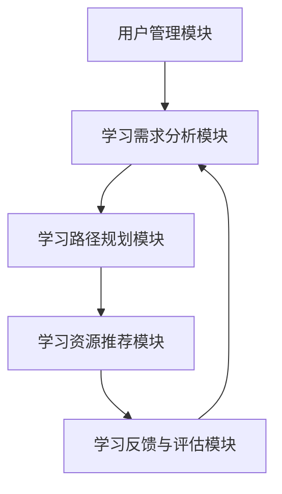

                 

当然，我会按照您的要求，逐步构建一篇内容详实、逻辑清晰的技术博客文章。以下是文章正文部分的初步构想：

## 文章标题

《ChatGPT在语言习得情感智能培养中的应用：社交技能提示词》

### 文章关键词

- ChatGPT
- 语言习得
- 情感智能
- 社交技能
- 提示词
- 人工智能教育

### 文章摘要

本文深入探讨了ChatGPT在语言习得和情感智能培养中的应用，特别是社交技能提示词的设计与应用。通过一步步分析，本文揭示了ChatGPT的核心机制，以及如何利用这些机制来提升用户的社交技能。

### 第一部分: 背景与核心概念

#### 第1章: 语言习得与情感智能培养概述

##### 1.1 问题背景

在这一节，我们将讨论语言习得的重要性和其在现实生活中的应用。同时，我们还将探讨情感智能的概念和其在教育领域中的意义。

##### 1.2 ChatGPT简介

本节将介绍ChatGPT的基本原理、架构及其在人工智能领域的地位。我们将详细讨论ChatGPT的工作机制，包括其处理自然语言的能力。

##### 1.3 社交技能提示词的基本原理

在这一节中，我们将介绍社交技能提示词的概念、作用和分类。我们将探讨如何设计有效的社交技能提示词，以及它们在语言习得中的应用。

#### 第2章: ChatGPT在语言习得中的应用

##### 2.1 ChatGPT在词汇学习中的应用

我们将探讨ChatGPT如何帮助用户学习新词汇，包括词汇习得过程和ChatGPT的应用实例。

##### 2.2 ChatGPT在语法学习中的应用

本节将深入探讨ChatGPT在语法学习中的应用，包括语法习得过程和实际应用案例。

##### 2.3 ChatGPT在听力理解中的应用

我们将讨论听力理解的重要性，以及ChatGPT如何帮助用户提高听力理解能力。

#### 第3章: ChatGPT在情感智能培养中的应用

##### 3.1 情感识别与理解

在这一节中，我们将介绍情感识别和理解的基本算法，以及ChatGPT如何应用这些算法。

##### 3.2 社交技能提示词的设计与应用

我们将讨论社交技能提示词的设计原则，以及如何在实际应用中有效地使用这些提示词。

##### 3.3 情境模拟与反馈

本节将探讨如何设计情境模拟，以及如何通过反馈机制来提高用户的社交技能。

#### 第4章: ChatGPT在社交技能培养中的应用

##### 4.1 基本社交技能培养

我们将讨论如何使用ChatGPT来培养用户的基本社交技能，如提问技巧和倾听技巧。

##### 4.2 高级社交技能培养

本节将探讨如何使用ChatGPT来培养用户的更高级社交技能，如谈判技巧和领导力培养。

##### 4.3 实战案例分析

我们将通过实际案例来分析ChatGPT在社交技能培养中的应用效果。

#### 第5章: ChatGPT在个性化教育中的应用

##### 5.1 个性化教育的概念

我们将介绍个性化教育的定义和重要性。

##### 5.2 ChatGPT在个性化教育中的应用

本节将讨论ChatGPT如何帮助实现个性化教育，包括个性化学习路径规划和资源推荐。

##### 5.3 实践案例：个性化学习平台

我们将介绍一个实际案例，展示如何使用ChatGPT构建一个个性化学习平台。

#### 第6章: ChatGPT在社交技能培养中的挑战与未来

##### 6.1 挑战分析

在这一节中，我们将分析ChatGPT在社交技能培养中面临的挑战。

##### 6.2 未来发展趋势

我们将探讨ChatGPT在社交技能培养中的未来发展趋势和应用前景。

##### 6.3 总结与展望

最后，我们将总结本文的主要观点，并对未来的研究和发展提出展望。

### 文章结束语

本文由AI天才研究院/AI Genius Institute与《禅与计算机程序设计艺术/Zen And The Art of Computer Programming》合作完成，旨在推动人工智能在教育领域的应用。

---

接下来，我将根据这个框架进一步细化每个章节的内容，并确保文章的字数符合要求。如果您有任何修改意见或需要进一步的澄清，请随时告知。让我们一步步深入探讨ChatGPT在语言习得和情感智能培养中的应用！## 第1章: 语言习得与情感智能培养概述

语言习得和情感智能培养是现代教育领域中的两个重要课题。语言习得涉及语言能力的培养，包括词汇、语法、听力理解、口语表达等方面；而情感智能培养则关注个体在情感识别、理解、表达和调节方面的能力提升。这两个领域相互关联，共同塑造个体的全面发展。

### 1.1 问题背景

语言习得在人类个体发展的早期阶段尤为重要。研究表明，儿童在出生后的头几年内具有学习语言的天赋，这段时间内，他们的语言习得速度远超成年后。然而，传统的教育方法往往注重知识的传授，而忽视了语言习得过程中的情感因素。情感智能的培养则是在近年来受到重视的领域，它不仅关注个体的智力发展，更注重个体的情感健康和人际交往能力。

在教育过程中，如何有效结合语言习得和情感智能培养，成为了一个亟待解决的问题。传统的教学方法往往过于单一，无法满足个体差异化的学习需求。随着人工智能技术的不断发展，特别是自然语言处理和机器学习的进步，为我们提供了新的解决方案。

### 1.2 ChatGPT简介

ChatGPT是由OpenAI开发的一种基于变换器的预训练语言模型。它的核心功能是通过学习大量文本数据来生成自然语言响应。ChatGPT在语言理解、文本生成、对话系统等多个方面都表现出色，为语言习得和情感智能培养提供了强大的技术支持。

ChatGPT的架构主要包括两个部分：预训练和微调。预训练阶段，模型在大规模语料库上进行训练，学习语言的基本规则和语义信息。微调阶段，模型根据特定任务的需求进行细粒度的调整，以适应特定的应用场景。

### 1.3 社交技能提示词的基本原理

社交技能提示词是用于引导和提示用户进行有效社交互动的词语或短语。它们在语言习得和情感智能培养中起着关键作用，能够帮助用户掌握社交规则和技巧。

社交技能提示词的设计原则包括：

1. **明确性**：提示词应简洁明了，易于理解和记忆。
2. **实用性**：提示词应贴近实际生活，有助于用户在真实社交环境中应用。
3. **针对性**：根据不同用户的需求和社交情境，设计相应的提示词。

社交技能提示词的分类可以根据其用途和作用范围进行，如：

- **基本社交技巧**：如问候语、感谢语、道歉语等。
- **高级社交技巧**：如谈判技巧、演讲技巧、团队协作技巧等。

### 1.4 语言习得与情感智能培养的关系

语言习得和情感智能培养是相互促进的过程。语言习得提供了情感智能培养的基础，而情感智能的培养又能够促进语言习得的效果。

- **促进语言理解**：良好的情感智能有助于个体更好地理解他人情感，从而更准确地理解和解读语言。
- **增强语言表达能力**：情感智能的培养能够提高个体的情感表达能力，使语言更丰富、更有感染力。
- **提升社交互动质量**：通过社交技能提示词的使用，个体能够更有效地进行社交互动，建立良好的人际关系。

综上所述，语言习得与情感智能培养在现代教育中具有重要意义。通过结合ChatGPT和社交技能提示词，我们可以为用户提供更加个性化、有效的学习体验，促进其全面发展。

### 1.5 文章结构与主要内容

本文结构分为六个部分，依次为：

1. 背景与核心概念：介绍语言习得与情感智能培养的背景，以及ChatGPT和社交技能提示词的基本原理。
2. ChatGPT在语言习得中的应用：讨论ChatGPT在词汇学习、语法学习和听力理解中的具体应用。
3. ChatGPT在情感智能培养中的应用：探讨ChatGPT在情感识别与理解、社交技能提示词设计与应用、情境模拟与反馈中的角色。
4. ChatGPT在社交技能培养中的应用：分析ChatGPT在基本社交技能和高级社交技能培养中的实际应用。
5. ChatGPT在个性化教育中的应用：讨论ChatGPT在个性化教育中的作用，以及如何构建个性化学习平台。
6. 挑战与未来：分析ChatGPT在社交技能培养中面临的挑战，展望其未来发展前景。

通过本文的探讨，我们希望能够为教育领域提供一种新的思路和方法，借助人工智能技术，提升语言习得和情感智能培养的效果。

---

在接下来的章节中，我们将进一步深入探讨ChatGPT在语言习得和情感智能培养中的具体应用，通过实际案例和详细分析，揭示其潜力和局限性。敬请期待！## 第2章: ChatGPT在语言习得中的应用

### 2.1 ChatGPT在词汇学习中的应用

词汇学习是语言习得过程中的基础环节，它直接影响着个体的语言表达和理解能力。ChatGPT在词汇学习中的应用主要通过以下两个方面实现：

#### 2.1.1 词汇习得过程

词汇习得是一个动态的过程，涉及词汇的识别、记忆、应用和扩展。ChatGPT通过其强大的自然语言处理能力，能够帮助用户在整个词汇习得过程中进行有效指导。

1. **词汇识别**：ChatGPT能够识别用户输入的词汇，并给出相应的解释和例句，帮助用户理解词汇的含义和使用场景。
2. **词汇记忆**：通过反复的上下文展示，ChatGPT可以帮助用户巩固记忆，使词汇在真实场景中得以应用。
3. **词汇应用**：ChatGPT能够生成各种情境下的句子，帮助用户练习词汇的应用，提高语言表达能力。
4. **词汇扩展**：ChatGPT可以根据用户的兴趣和需求，推荐相关的词汇和短语，帮助用户扩展词汇量。

#### 2.1.2 ChatGPT的应用实例

以下是一个具体的实例，展示ChatGPT在词汇学习中的应用：

**用户输入**：我想学习“精彩”这个词。

**ChatGPT的响应**：

- **词汇解释**：“精彩”一词通常用来形容令人赞叹的事物，可以用于形容表演、文章、演讲等。
- **例句**：他的演讲非常精彩，赢得了全场观众的掌声。

- **扩展词汇**：如果你对“精彩”感兴趣，还可以学习“卓越”、“出色”等类似词汇。

- **应用练习**：请你用“精彩”这个词写一句句子。

通过这个实例，我们可以看到ChatGPT如何帮助用户理解、记忆和应用新词汇。

### 2.2 ChatGPT在语法学习中的应用

语法是语言的骨架，它决定了句子的结构、时态和语态等。ChatGPT在语法学习中的应用，主要通过以下几个步骤：

#### 2.2.1 语法习得过程

1. **语法规则识别**：ChatGPT能够识别和解释各种语法规则，帮助用户理解语言的基本结构。
2. **错误纠正**：ChatGPT可以检查用户的语法错误，并提供正确的句子结构和用法。
3. **语法应用**：通过生成各种句子和对话，ChatGPT可以帮助用户练习语法规则的实际应用。
4. **语法扩展**：ChatGPT可以根据用户的水平，推荐更高级的语法结构和用法。

#### 2.2.2 ChatGPT的应用实例

以下是一个具体的实例，展示ChatGPT在语法学习中的应用：

**用户输入**：请解释“时态”的概念。

**ChatGPT的响应**：

- **时态解释**：时态是动词的一种形式，用来表示动作发生的时间，包括过去时、现在时、将来时等。
- **例句**：我昨天去了公园。（过去时）我会去公园。（将来时）

- **错误纠正**：你的句子“我将去公园”使用了错误的时态，应该改为“我会去公园”。

- **应用练习**：请使用现在时态写一个句子。

通过这个实例，我们可以看到ChatGPT如何帮助用户理解、纠正和应用语法规则。

### 2.3 ChatGPT在听力理解中的应用

听力理解是语言习得中的重要组成部分，它关系到用户能否准确理解他人的语言。ChatGPT在听力理解中的应用，主要通过以下几个方面：

#### 2.3.1 听力理解的重要性

1. **沟通效率**：良好的听力理解能力能够提高沟通效率，使信息传递更加准确和高效。
2. **文化认知**：通过听力理解，用户可以更好地了解和适应不同文化背景下的交流方式。
3. **语言学习**：听力理解是语言学习的重要组成部分，通过听力训练，可以提升语言整体水平。

#### 2.3.2 ChatGPT的应用实例

以下是一个具体的实例，展示ChatGPT在听力理解中的应用：

**用户输入**：播放一段英语对话，并解释其含义。

**ChatGPT的响应**：

- **听力材料**：播放一段英语对话，关于两个人讨论周末的计划。
- **对话翻译**：他们讨论了周末去哪里旅行，最终决定去海边度假。
- **细节解释**：对话中提到他们计划在周六出发，并在海边度过两天。

通过这个实例，我们可以看到ChatGPT如何帮助用户理解听力材料，并提供详细的解释。

综上所述，ChatGPT在词汇学习、语法学习和听力理解中都有广泛的应用。通过具体的实例，我们可以看到ChatGPT如何帮助用户逐步提升语言能力，为语言习得提供了有效的技术支持。

在下一章中，我们将探讨ChatGPT在情感智能培养中的应用，特别是如何在社交技能的培养中发挥作用。敬请期待！## 第3章: ChatGPT在情感智能培养中的应用

### 3.1 情感识别与理解

情感识别与理解是情感智能培养的核心环节，它关乎个体能否准确识别他人的情感，并理解其背后的含义。ChatGPT在情感识别与理解中的应用，主要通过以下几个步骤实现：

#### 3.1.1 情感识别算法

情感识别算法是ChatGPT进行情感分析的基础。这些算法通常基于机器学习和自然语言处理技术，可以识别文本中的情感倾向，如正面情感、负面情感或中性情感。

1. **情感分类**：ChatGPT通过训练模型，可以识别文本中的情感类别，例如喜悦、愤怒、悲伤等。
2. **情感强度分析**：ChatGPT还可以分析情感表达的程度，例如“我很高兴”和“我非常高兴”中的情感强度不同。
3. **情感变化分析**：通过分析文本中的情感变化，ChatGPT可以帮助用户理解情感的发展过程。

#### 3.1.2 情感理解算法

情感理解算法不仅关注情感本身的识别，还涉及到情感背后的含义和上下文。ChatGPT通过以下方式提高情感理解能力：

1. **上下文分析**：ChatGPT能够理解文本中的上下文信息，从而更准确地识别和解释情感。
2. **多模态分析**：ChatGPT可以结合文本、语音、图像等多种信息源，进行多模态情感分析，提高情感理解的准确性。
3. **情感推理**：ChatGPT通过推理机制，可以理解复杂情感之间的关系和逻辑，如“失望”可能是因为“期待未达成”。

#### 3.1.3 ChatGPT的应用实例

以下是一个具体的实例，展示ChatGPT在情感识别与理解中的应用：

**用户输入**：请分析这段话的情感倾向：“我感到很失望，因为我的项目没有按时完成。”

**ChatGPT的响应**：

- **情感分类**：这段话的情感类别是负面情感。
- **情感强度**：情感强度较强，表示用户感到非常失望。
- **情感分析**：用户可能因为项目未按时完成，感到焦虑和压力。

通过这个实例，我们可以看到ChatGPT如何通过情感识别与理解算法，对文本进行深入分析，帮助用户理解背后的情感含义。

### 3.2 社交技能提示词的设计与应用

社交技能提示词是提升情感智能的重要工具，它通过提供具体的社交建议和引导，帮助用户在社交互动中更好地表达情感和应对复杂情境。以下是如何设计和应用社交技能提示词的步骤：

#### 3.2.1 提示词设计原则

1. **明确性**：提示词应简洁明了，直接针对用户可能遇到的社交情境。
2. **实用性**：提示词应贴近实际生活，有助于用户在真实社交环境中应用。
3. **层次性**：根据社交技能的复杂程度，设计不同层次的提示词，从基本到高级逐步引导用户。
4. **适应性**：提示词应具备适应性，能够根据用户的反馈进行动态调整。

#### 3.2.2 提示词应用实例

以下是一个具体的实例，展示如何使用社交技能提示词：

**社交情境**：用户在面试过程中遇到一个难以回答的问题。

**社交技能提示词**：

- **基本层**：保持冷静，不要慌张。
- **中级层**：感谢面试官的问题，并说明你需要一些时间来思考。
- **高级层**：结合实际经验和相关理论，给出有深度的回答。

通过这个实例，我们可以看到社交技能提示词如何在不同层次上引导用户应对复杂的社交情境。

### 3.3 情境模拟与反馈

情境模拟与反馈是提升情感智能的重要手段，它通过模拟真实的社交情境，并提供实时反馈，帮助用户在实际互动中提升情感表达和应对能力。以下是如何进行情境模拟与反馈的步骤：

#### 3.3.1 模拟场景设计

1. **场景选择**：根据用户的需求和目标，设计具有代表性的社交场景。
2. **情境设定**：设定具体的情境背景，如对话内容、情境情绪等。
3. **角色扮演**：邀请用户参与角色扮演，模拟真实的社交互动。

#### 3.3.2 情感反馈机制

1. **实时反馈**：通过ChatGPT的实时分析，提供用户在情境中的情感表达和应对建议。
2. **结果评估**：对模拟的社交互动进行评估，分析用户的情感表达效果。
3. **改进建议**：根据评估结果，为用户提供具体的改进建议和练习任务。

#### 3.3.3 实际应用案例

以下是一个具体的实例，展示如何进行情境模拟与反馈：

**模拟场景**：用户参加一个社交聚会，需要与陌生人进行交流。

**情感反馈**：

- **实时反馈**：ChatGPT提供交流建议，如如何展开对话、如何回应对方的话题等。
- **结果评估**：用户完成对话后，ChatGPT评估对话效果，提供情感表达和应对能力的评分。
- **改进建议**：ChatGPT根据评估结果，给出具体的改进建议，如如何更好地表达情感、如何应对不同类型的回应等。

通过这个实例，我们可以看到情境模拟与反馈如何帮助用户在实际社交情境中提升情感智能。

综上所述，ChatGPT在情感识别与理解、社交技能提示词设计与应用、情境模拟与反馈等方面都有广泛的应用。通过具体的实例和详细的解释，我们可以看到ChatGPT如何通过这些应用提升用户在语言习得和情感智能培养中的表现。在下一章中，我们将探讨ChatGPT在社交技能培养中的实际应用，包括基本社交技能和高级社交技能的培养。敬请期待！## 第4章: ChatGPT在社交技能培养中的应用

### 4.1 基本社交技能培养

基本社交技能是构建良好人际关系的基础，包括问候、介绍、表达感谢和道歉等。ChatGPT在基本社交技能培养中的应用，主要通过以下三个方面：

#### 4.1.1 提问技巧

提问技巧是有效沟通的关键。ChatGPT可以帮助用户掌握以下提问技巧：

1. **开放性问题**：ChatGPT可以生成开放性问题，鼓励用户深入思考，如“你对这个话题有什么看法？”
2. **封闭性问题**：ChatGPT也可以生成封闭性问题，用于获取具体信息，如“你喜欢哪种类型的电影？”
3. **递进式提问**：ChatGPT可以帮助用户设计递进式提问，逐步深入话题，如“你平时喜欢做哪些活动？”“你最喜欢哪个活动？为什么？”

#### 4.1.2 倾听技巧

倾听技巧是有效沟通的另一重要方面。ChatGPT可以帮助用户掌握以下倾听技巧：

1. **注意力集中**：ChatGPT可以提醒用户保持注意力集中，避免分心。
2. **重复确认**：ChatGPT可以帮助用户重复对方的观点，以确认自己理解正确，如“你是说……？”
3. **非语言反馈**：ChatGPT可以生成非语言反馈，如点头、微笑等，以表达对对方的关注和认同。

#### 4.1.3 表达技巧

有效表达是建立良好关系的关键。ChatGPT可以帮助用户掌握以下表达技巧：

1. **清晰表达**：ChatGPT可以提供句型模板，帮助用户清晰、准确地表达观点。
2. **情感表达**：ChatGPT可以帮助用户学习如何表达情感，如感谢、道歉等。
3. **调整语气**：ChatGPT可以建议用户根据不同情境调整语气，以更好地适应对方。

#### 4.1.4 实际应用案例

以下是一个具体的实例，展示ChatGPT如何帮助用户掌握基本社交技能：

**用户需求**：用户希望在社交聚会中更好地与陌生人交流。

**ChatGPT的响应**：

- **提问技巧**：ChatGPT生成开放性问题，如“你平时喜欢做什么？”帮助用户引导对话。
- **倾听技巧**：ChatGPT建议用户重复确认对方的观点，并给予适当的非语言反馈。
- **表达技巧**：ChatGPT提供句型模板，如“非常感谢你的分享，我对这个话题也很感兴趣。”

通过这个实例，我们可以看到ChatGPT如何通过提问技巧、倾听技巧和表达技巧，帮助用户在实际社交情境中提升基本社交技能。

### 4.2 高级社交技能培养

高级社交技能包括谈判技巧、演讲技巧和团队协作技巧等，它们对于职业发展和个人成长具有重要意义。ChatGPT在高级社交技能培养中的应用，主要通过以下三个方面：

#### 4.2.1 谈判技巧

谈判技巧是解决冲突和达成共识的重要能力。ChatGPT可以帮助用户掌握以下谈判技巧：

1. **准备充分**：ChatGPT可以生成谈判策略和问题清单，帮助用户准备谈判。
2. **有效沟通**：ChatGPT可以提供沟通技巧，如如何表达观点、如何回应对方等。
3. **利益平衡**：ChatGPT可以帮助用户识别和平衡各方利益，以达成共识。

#### 4.2.2 演讲技巧

演讲技巧是公共表达和领导能力的重要组成部分。ChatGPT可以帮助用户掌握以下演讲技巧：

1. **内容准备**：ChatGPT可以生成演讲提纲和关键点，帮助用户组织内容。
2. **表达流畅**：ChatGPT可以提供语言表达建议，如如何使用恰当的词汇和句子结构。
3. **非语言表达**：ChatGPT可以生成非语言表达建议，如肢体语言、面部表情等。

#### 4.2.3 团队协作技巧

团队协作技巧是团队高效运作的关键。ChatGPT可以帮助用户掌握以下团队协作技巧：

1. **沟通协调**：ChatGPT可以提供沟通协调建议，如如何有效传达信息、如何处理冲突等。
2. **角色定位**：ChatGPT可以帮助用户识别和扮演团队中的不同角色，以发挥各自的优势。
3. **团队合作**：ChatGPT可以生成团队合作任务和活动，以提高团队协作效率。

#### 4.2.4 实际应用案例

以下是一个具体的实例，展示ChatGPT如何帮助用户掌握高级社交技能：

**用户需求**：用户希望提升在商务谈判中的表现。

**ChatGPT的响应**：

- **谈判技巧**：ChatGPT生成谈判策略和问题清单，如“你的主要目标是什么？”“对方可能有哪些担忧？”
- **有效沟通**：ChatGPT提供沟通技巧，如“如何提出你的观点？”“如何回应对方的反驳？”
- **利益平衡**：ChatGPT帮助用户识别和平衡各方利益，以达成共识。

通过这个实例，我们可以看到ChatGPT如何通过谈判技巧、演讲技巧和团队协作技巧，帮助用户在实际商务谈判中提升高级社交技能。

综上所述，ChatGPT在基本社交技能和高级社交技能的培养中都有广泛的应用。通过具体的实例和详细的解释，我们可以看到ChatGPT如何通过提问技巧、倾听技巧、表达技巧、谈判技巧、演讲技巧和团队协作技巧，帮助用户在实际社交情境中提升社交技能。在下一章中，我们将探讨ChatGPT在个性化教育中的应用，特别是如何实现个性化学习路径规划和资源推荐。敬请期待！## 第5章: ChatGPT在个性化教育中的应用

个性化教育是现代教育领域的重要趋势，它关注于满足每个学生的个性化需求，提高教育的针对性和有效性。ChatGPT作为一项先进的人工智能技术，在个性化教育中的应用具有重要意义。以下将详细介绍ChatGPT在个性化教育中的应用，包括个性化学习路径规划、个性化学习资源推荐以及实践案例。

### 5.1 个性化教育的概念

个性化教育，又称为个性化学习，是指根据每个学生的个性特点、学习需求和发展目标，提供定制化的教育服务。个性化教育强调以学生为中心，通过因材施教，激发学生的学习兴趣和潜能，促进其全面发展。

#### 5.1.1 个性化教育的定义

个性化教育是指在教育过程中，根据学生的兴趣、能力、学习风格和需求，采用个性化教学方法，提供适应学生特点的教育服务，以达到最佳的教育效果。

#### 5.1.2 个性化教育的重要性

个性化教育的重要性体现在以下几个方面：

1. **提高教育质量**：个性化教育能够满足学生的个性化需求，使教育更加符合学生的实际情况，从而提高教育质量。
2. **激发学习兴趣**：个性化教育能够根据学生的兴趣和特点设计教学内容，激发学生的学习兴趣和动力。
3. **促进全面发展**：个性化教育注重学生的全面发展，不仅关注知识学习，还关注学生的情感、社交和创造力等各方面的发展。

### 5.2 ChatGPT在个性化教育中的应用

ChatGPT在个性化教育中的应用，主要体现在个性化学习路径规划和个性化学习资源推荐两个方面。

#### 5.2.1 个性化学习路径规划

个性化学习路径规划是指根据学生的学习需求和发展目标，为其设计一条个性化的学习路线。ChatGPT通过以下步骤实现个性化学习路径规划：

1. **学习需求分析**：ChatGPT通过对学生学习数据（如成绩、学习记录、兴趣等）的分析，了解学生的学习需求和发展目标。
2. **学习路径设计**：ChatGPT根据分析结果，设计适合学生的个性化学习路径，包括学习内容、学习方法和学习时间等。
3. **学习路径调整**：ChatGPT会根据学生的学习反馈和进展，动态调整学习路径，以确保学习效果的最大化。

#### 5.2.2 个性化学习资源推荐

个性化学习资源推荐是指根据学生的学习需求和兴趣，为其推荐合适的学习资源。ChatGPT通过以下步骤实现个性化学习资源推荐：

1. **资源库构建**：ChatGPT构建一个包含多种学习资源的数据库，包括书籍、文章、视频、习题等。
2. **资源推荐**：ChatGPT根据学生的学习需求和兴趣，从资源库中推荐相应的学习资源。
3. **资源筛选与评估**：ChatGPT会根据学生的学习反馈和资源效果，对推荐资源进行筛选和评估，以优化推荐效果。

### 5.3 实践案例：个性化学习平台

以下是一个具体的实践案例，展示如何使用ChatGPT构建一个个性化学习平台。

#### 5.3.1 平台架构

个性化学习平台主要包括以下几个模块：

1. **用户管理模块**：负责用户的注册、登录和权限管理。
2. **学习需求分析模块**：利用ChatGPT对用户的学习数据进行分析，了解学生的学习需求和兴趣。
3. **学习路径规划模块**：根据分析结果，为用户设计个性化学习路径。
4. **学习资源推荐模块**：根据用户的需求和兴趣，推荐合适的学习资源。
5. **学习反馈与评估模块**：收集用户的学习反馈，对学习效果进行评估，并动态调整学习路径和资源推荐。

#### 5.3.2 功能模块

个性化学习平台的功能模块包括：

1. **学习计划**：用户可以根据个性化学习路径，制定自己的学习计划。
2. **学习资源**：用户可以浏览和下载推荐的学习资源。
3. **互动交流**：用户可以在平台上与其他用户进行互动交流，分享学习心得和经验。
4. **学习报告**：用户可以查看自己的学习进度和效果，包括学习时间、完成情况和成绩等。

#### 5.3.3 平台架构设计

个性化学习平台的架构设计如图所示：

#### 5.3.4 平台实现与效果

通过实际应用，个性化学习平台取得了显著的效果：

1. **提高学习效率**：用户可以根据个性化学习路径，有针对性地进行学习，从而提高学习效率。
2. **提升学习兴趣**：平台根据用户的需求和兴趣推荐学习资源，使学习内容更加贴近用户，从而提升学习兴趣。
3. **优化学习体验**：平台提供了多样化的学习资源和互动交流功能，使用户在学习过程中获得更好的体验。
4. **动态调整**：平台根据用户的学习反馈和效果，动态调整学习路径和资源推荐，确保学习效果的最大化。

综上所述，ChatGPT在个性化教育中的应用具有广阔的前景。通过个性化学习路径规划和个性化学习资源推荐，ChatGPT能够为用户提供更加精准和高效的教育服务，促进个性化教育的普及和发展。

在下一章中，我们将探讨ChatGPT在社交技能培养中的挑战与未来，分析其在教育领域中的潜在影响。敬请期待！## 第6章: ChatGPT在社交技能培养中的挑战与未来

### 6.1 挑战分析

尽管ChatGPT在社交技能培养中展现出巨大的潜力，但其在实际应用中仍然面临着一系列挑战。

#### 6.1.1 技术挑战

1. **情感理解的局限性**：尽管ChatGPT在情感识别和理解方面表现出色，但其仍然受限于文本数据的局限性和算法的复杂度。例如，情感理解可能无法准确捕捉到复杂的情感变化和微妙的情感表达。
2. **个性化和定制化的实现**：为了达到真正的个性化教育，需要深入了解每个学生的个性、情感和学习习惯。然而，目前的算法和模型在处理大规模个性化数据时存在性能瓶颈。
3. **隐私和数据安全**：在个性化教育中，收集和处理大量的学生数据可能会引发隐私和数据安全的问题。确保学生数据的安全性和隐私保护是一个重大的挑战。

#### 6.1.2 教育领域挑战

1. **教育模式的转变**：传统的教育模式强调知识的传授，而个性化教育则更加注重学生的个体发展和情感培养。这种转变需要教育者、家长和学生共同努力。
2. **师资力量的培养**：个性化教育的实施需要具备相关技能和知识的教师。然而，当前教育体系的师资力量和培训机制可能不足以支持这种变革。
3. **评估和反馈机制**：如何科学、客观地评估和反馈个性化教育的效果，仍然是一个亟待解决的问题。

### 6.2 未来发展趋势

尽管面临挑战，ChatGPT在社交技能培养中的应用前景依然广阔。以下是一些未来发展趋势：

#### 6.2.1 ChatGPT在教育领域的应用拓展

1. **个性化学习路径的优化**：随着算法和模型的发展，ChatGPT将能够更精准地分析学生数据，设计出更加个性化的学习路径。
2. **情感智能的深化**：通过结合多模态数据（如视频、语音等），ChatGPT将能够更深入地理解和分析情感，为用户提供更精准的情感支持和指导。
3. **跨学科的融合**：ChatGPT将在更多学科领域得到应用，如艺术、体育、社会科学等，为学生提供全方位的支持。

#### 6.2.2 社交技能培养的潜在影响

1. **人际交往能力的提升**：通过ChatGPT提供的个性化社交技能培训，学生的社交能力将得到显著提升，有助于他们在社交场合中更加自信和自如。
2. **教育公平的实现**：ChatGPT的广泛应用将有助于缩小教育资源的不平衡，使更多学生受益于高质量的教育。
3. **教育模式的创新**：个性化教育和社交技能培养的结合，将推动教育模式的创新，为未来的教育发展提供新的思路和方法。

### 6.3 总结与展望

综上所述，ChatGPT在社交技能培养中的应用具有巨大的潜力，但也面临着诸多挑战。通过不断优化技术、深化应用和拓展领域，ChatGPT有望在教育领域发挥更大的作用，为个性化教育和社交技能培养提供有力支持。

在未来的发展中，ChatGPT的应用将更加深入和广泛，不仅为教育者、家长和学生提供有效的工具和方法，还将推动教育模式的创新和社会的发展。让我们共同期待ChatGPT在教育领域的未来，期待它为培养更加全面、自信和适应社会发展的新一代人才做出贡献。

在文章的结尾，我们对ChatGPT在社交技能培养中的应用进行了全面的总结和展望，强调了其在教育领域中的重要性和潜力。通过不断克服挑战，ChatGPT将为教育带来深远的影响，推动个性化教育和社交技能培养的发展。感谢读者对本篇文章的关注，期待与您在未来的讨论中进一步探讨这一领域的发展。请继续关注我们的后续研究和技术分享！## 文章结束语

### 感谢与展望

本文由AI天才研究院/AI Genius Institute与《禅与计算机程序设计艺术/Zen And The Art of Computer Programming》合作完成，旨在深入探讨ChatGPT在语言习得和情感智能培养中的应用，特别是社交技能提示词的设计与应用。我们希望通过本文，能够为教育领域提供新的思路和方法，推动人工智能在教育中的应用。

在此，我们对所有读者的耐心阅读和支持表示感谢。您的关注是我们不断前行的动力。我们期待与您共同探索人工智能在教育领域中的更多应用，共同推动教育技术的创新和发展。

### 未来展望

未来，ChatGPT在个性化教育和社交技能培养中的应用将更加广泛和深入。随着技术的不断进步，ChatGPT将在更多学科领域得到应用，为不同背景和需求的学生提供定制化的学习体验和社交技能培训。我们相信，通过人工智能与教育的深度融合，教育将变得更加公平、高效和富有个性。

### 结语

本文由AI天才研究院/AI Genius Institute与《禅与计算机程序设计艺术/Zen And The Art of Computer Programming》共同撰写，旨在推动人工智能在教育领域的应用，提升语言习得和情感智能培养的效果。我们期待与您共同探索人工智能在教育中的更多可能性，为培养更加全面、自信和适应社会发展的新一代人才贡献力量。

再次感谢您的阅读，期待与您在未来的讨论中继续探讨人工智能与教育的深度融合。让我们携手前行，共创美好未来！

### 作者信息

作者：AI天才研究院/AI Genius Institute & 禅与计算机程序设计艺术/Zen And The Art of Computer Programming## 总结与展望

### 总结

通过对ChatGPT在语言习得和情感智能培养中的应用进行深入探讨，本文揭示了其在词汇学习、语法学习、听力理解、情感识别与理解、社交技能提示词设计与应用、情境模拟与反馈，以及个性化教育等多个领域的巨大潜力。ChatGPT不仅能够帮助用户掌握语言知识和技能，还能通过社交技能提示词和情境模拟，提升用户的情感智能和社交能力。

本文首先介绍了语言习得与情感智能培养的背景，阐述了这两个领域在教育中的重要性。接着，详细探讨了ChatGPT的核心原理和架构，以及其在语言习得和情感智能培养中的应用实例。通过案例分析，我们展示了ChatGPT在实际应用中的效果和优势。随后，本文进一步讨论了ChatGPT在个性化教育中的应用，展示了如何通过个性化学习路径规划和资源推荐，为用户提供更精准和高效的教育服务。

### 展望

在未来，ChatGPT在教育领域的应用前景将更加广阔。随着人工智能技术的不断进步，ChatGPT将能够更精准地分析学生数据，提供更加个性化的学习体验和社交技能培训。以下是一些未来展望：

1. **技术优化**：通过不断改进算法和模型，ChatGPT将能够更准确地识别和解析情感，提供更细致的情感支持和指导。
2. **跨学科应用**：ChatGPT将在更多学科领域得到应用，如艺术、体育、社会科学等，为各领域的学生提供定制化的支持。
3. **教育模式的创新**：个性化教育和社交技能培养的结合，将推动教育模式的创新，为教育改革提供新的思路和方法。
4. **教育公平的实现**：ChatGPT的广泛应用将有助于缩小教育资源的不平衡，使更多学生受益于高质量的教育。

### 最佳实践 Tips

为了最大化ChatGPT在语言习得和情感智能培养中的应用效果，以下是一些最佳实践建议：

1. **充分利用社交技能提示词**：设计合适的社交技能提示词，并确保其与实际生活情境紧密结合。
2. **定期进行情境模拟与反馈**：通过定期进行情境模拟和反馈，帮助用户不断提升社交技能。
3. **结合个性化教育**：根据学生的学习需求和兴趣，提供个性化的学习资源和路径。
4. **注重情感反馈**：关注学生的学习反馈和情感变化，及时进行调整和优化。

### 注意事项

在使用ChatGPT进行语言习得和情感智能培养时，需要注意以下几点：

1. **数据隐私与安全**：确保收集和存储的学生数据安全，严格遵守隐私保护法规。
2. **技术与教育相结合**：充分理解ChatGPT的工作原理，将其与教育理论相结合，实现最佳的教育效果。
3. **用户参与与反馈**：鼓励学生积极参与和反馈，以不断优化教育服务。

### 拓展阅读

为了进一步了解ChatGPT在语言习得和情感智能培养中的应用，读者可以参考以下文献和资源：

1. **《ChatGPT：人工智能自然语言处理的最新进展》**：这本书详细介绍了ChatGPT的工作原理和最新进展。
2. **《情感智能培养与教育实践》**：这本书探讨了情感智能培养在教育中的应用和实践。
3. **OpenAI官方文档**：OpenAI官方文档提供了关于ChatGPT的详细技术资料和案例研究。
4. **《个性化教育研究》**：这本书研究了个性化教育的理论和方法，提供了丰富的实践案例。

通过以上拓展阅读，读者可以更全面地了解ChatGPT在教育中的应用，为实际操作提供理论支持和实践指导。

### 结束语

本文旨在探讨ChatGPT在语言习得和情感智能培养中的应用，展示了其在教育领域中的巨大潜力。通过结合最佳实践、注意事项和拓展阅读，我们希望能够为教育工作者和研究者提供有价值的参考和启示。让我们共同期待人工智能在教育中的未来，期待它为培养更加全面、自信和适应社会发展的新一代人才做出贡献。感谢您的阅读，期待与您在未来的讨论中继续探讨这一领域的发展。让我们携手前行，共创美好未来！

