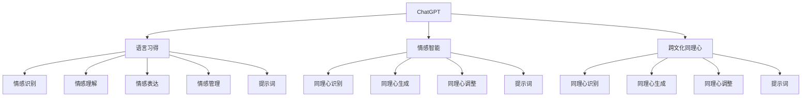
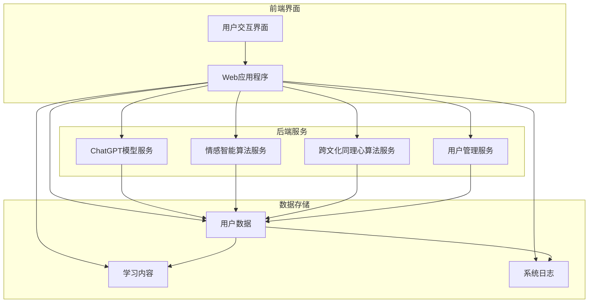

                 

### 《ChatGPT在语言习得情感智能培养中的应用：跨文化同理心提示词》——文章核心概念及逻辑结构

#### 核心概念

本篇文章的核心概念主要包括ChatGPT、语言习得、情感智能、跨文化同理心和提示词。这些概念构成了文章的基础，并贯穿于整篇文章的讨论。

- **ChatGPT**：基于GPT（Generative Pre-trained Transformer）模型的人工智能语言模型，具有强大的文本生成能力。
- **语言习得**：指个体在特定语言环境中学习并掌握语言的过程。
- **情感智能**：涉及识别、理解、表达和管理情感的能力，对语言习得有重要影响。
- **跨文化同理心**：指个体在理解和感受不同文化背景下他人情感状态的能力。
- **提示词**：用于引导或激励ChatGPT产生特定类型回答的词语。

#### 逻辑结构

文章的逻辑结构可以分为五个主要部分，每个部分都紧密围绕核心概念展开：

1. **背景介绍**：
   - 问题背景：介绍语言习得、情感智能和跨文化同理心的现状与挑战。
   - 核心概念：详细解释ChatGPT、语言习得、情感智能、跨文化同理心和提示词。
   - 目标：明确文章的目标和研究方向，即如何利用ChatGPT培养语言习得中的情感智能，特别是跨文化同理心。

2. **核心概念与联系**：
   - ChatGPT基本原理：介绍ChatGPT的工作原理和其在语言处理中的应用。
   - 情感智能培养：分析情感智能在语言习得中的作用，以及如何培养。
   - 跨文化同理心：探讨跨文化同理心的定义、培养方法和在语言习得中的应用。
   - 跨文化同理心提示词：设计用于引导ChatGPT生成与跨文化同理心相关的文本的提示词。

3. **算法原理讲解**：
   - ChatGPT模型详解：深入讲解ChatGPT模型的架构、训练过程及其在情感智能培养中的应用。
   - 情感智能培养算法：阐述用于识别、生成和调整情感的算法原理。
   - 跨文化同理心算法：介绍用于识别、生成和调整跨文化同理心的算法。

4. **数学模型与公式讲解**：
   - ChatGPT训练数学模型：解释用于训练ChatGPT的数学模型和公式。
   - 情感智能培养数学模型：阐述用于培养情感智能的数学模型和公式。
   - 跨文化同理心数学模型：介绍用于培养跨文化同理心的数学模型和公式。

5. **系统分析与架构设计**：
   - 系统介绍：介绍用于培养语言习得情感智能的ChatGPT系统的功能、架构和接口设计。
   - 系统架构设计：详细讲解系统的架构设计和组件交互。
   - 系统接口设计：阐述系统的接口设计和实现。
   - 系统交互：展示系统的用户交互界面和操作流程。

通过以上逻辑结构的布局，文章不仅系统地介绍了ChatGPT在语言习得情感智能培养中的应用，还深入探讨了跨文化同理心提示词的设计与应用。每个部分都经过仔细的设计和安排，以确保文章内容逻辑清晰、结构紧凑，便于读者理解。

### 文章关键词

- ChatGPT
- 语言习得
- 情感智能
- 跨文化同理心
- 提示词

### 摘要

本文旨在探讨ChatGPT在语言习得情感智能培养中的应用，特别是跨文化同理心提示词的设计与实现。首先，本文介绍了ChatGPT的基本原理及其在语言习得中的重要性，随后深入分析了情感智能与跨文化同理心的概念及其在语言习得中的关键作用。通过设计跨文化同理心提示词，本文探讨了如何利用ChatGPT培养语言习得者的情感智能，特别是提高其跨文化同理心。文章详细讲解了ChatGPT模型的算法原理和数学模型，并提出了具体的系统架构和接口设计。通过项目实战，本文展示了如何将理论应用于实际场景，为跨文化交流与理解提供了新的技术手段。

### 背景介绍

#### 问题背景

在全球化进程不断加速的今天，跨文化交流变得日益频繁，而语言作为沟通的桥梁，其习得的重要性愈加凸显。然而，传统的语言学习方式往往侧重于语法、词汇和发音等基础知识，而忽视了情感智能的培养。情感智能，包括情感识别、情感表达和情感管理能力，对于有效的跨文化交流至关重要。它不仅影响语言学习的动机和效果，还能帮助学习者更好地理解不同文化背景下他人的情感状态，提高跨文化同理心。

跨文化同理心是指个体能够理解并感受到来自不同文化背景的人的情感状态，从而在跨文化交流中表现出更为包容和理解的态度。这种同理心在现代社会中具有极高的价值，尤其是在国际商务、教育、医疗等领域。然而，传统的语言学习方式和现有的教育工具往往无法充分培养这种复杂的情感智能，尤其是在跨文化语境中。

ChatGPT，作为一种基于GPT（Generative Pre-trained Transformer）模型的人工智能语言模型，具备强大的文本生成能力和自然语言理解能力。它被广泛应用于自动问答、文本生成、机器翻译等领域。然而，目前的研究和应用中，ChatGPT在情感智能培养和跨文化同理心方面的潜力尚未得到充分挖掘。因此，本文旨在探讨如何利用ChatGPT在语言习得过程中培养情感智能，特别是跨文化同理心。

#### 核心概念

1. **ChatGPT**：ChatGPT是一种基于GPT模型的人工智能语言模型，经过大规模数据训练，能够生成高质量的文本。其核心原理是利用Transformer架构进行文本序列生成，通过自回归的方式预测下一个单词或字符。

2. **语言习得**：语言习得是指个体在特定语言环境中学习并掌握语言的过程。这个过程不仅涉及语言技能的获取，还包括语言认知、语言习惯和语言情感等方面的发展。

3. **情感智能**：情感智能包括识别、理解、表达和管理情感的能力。在语言习得中，情感智能有助于提高学习动机、增强记忆效果和促进语言理解。

4. **跨文化同理心**：跨文化同理心是指个体能够理解并感受到来自不同文化背景的人的情感状态，从而在跨文化交流中表现出包容和理解的态度。它是有效跨文化交流的关键因素。

5. **提示词**：提示词是指用于引导或激励ChatGPT生成特定类型回答的词语。在培养情感智能和跨文化同理心中，提示词的设计至关重要，它能够帮助ChatGPT更好地理解学习者的需求，并生成相关的文本。

#### 目标

本文的目标是通过分析ChatGPT在语言习得中的应用，探讨如何利用其强大的语言生成能力培养语言学习者的情感智能，特别是跨文化同理心。具体目标包括：

1. **研究ChatGPT的基本原理和工作机制，深入了解其如何生成高质量文本。**
2. **探讨情感智能在语言习得中的作用，分析如何通过ChatGPT培养情感智能。**
3. **设计跨文化同理心提示词，探讨如何利用提示词引导ChatGPT生成与跨文化同理心相关的文本。**
4. **提出系统架构和接口设计，实现一个实用的ChatGPT应用系统，用于培养语言学习者的情感智能和跨文化同理心。**
5. **通过实际案例和数据分析，验证ChatGPT在语言习得情感智能培养中的应用效果。**

通过实现上述目标，本文旨在为教育领域提供一种新的技术手段，帮助语言学习者更好地理解和适应不同文化背景，提高其跨文化同理心，从而促进全球范围内的跨文化交流与合作。

#### 边界与外延

##### 研究范围

本文的研究范围主要聚焦于利用ChatGPT在语言习得过程中培养情感智能，特别是跨文化同理心。具体包括以下几个方面：

1. **ChatGPT模型在语言习得中的应用**：探讨ChatGPT如何通过生成高质量文本促进语言学习，特别是如何利用其自然语言理解能力帮助学习者理解情感表达。
2. **情感智能培养的方法**：分析情感智能在语言习得中的作用，探讨通过ChatGPT如何培养语言学习者的情感识别、表达和管理能力。
3. **跨文化同理心的设计与应用**：研究如何设计有效的跨文化同理心提示词，并通过ChatGPT生成相关文本，帮助学习者理解和感受不同文化背景下的情感状态。
4. **系统架构与接口设计**：提出一个实用的ChatGPT应用系统架构，包括系统功能设计、架构设计和接口设计，以及如何实现与用户的交互。

##### 研究方法

本文采用的研究方法主要包括以下几个方面：

1. **文献综述**：通过查阅相关文献，了解ChatGPT、情感智能、跨文化同理心等领域的研究现状和最新进展。
2. **理论分析**：基于文献综述，对ChatGPT在语言习得中的潜在作用进行理论分析，探讨如何利用ChatGPT培养情感智能和跨文化同理心。
3. **实验验证**：设计实验，通过实际应用案例验证ChatGPT在情感智能培养和跨文化同理心提升方面的效果。
4. **系统实现**：基于理论分析和实验结果，实现一个实用的ChatGPT应用系统，用于实际教学场景中的情感智能培养。

##### 研究意义

本文的研究具有以下几个方面的意义：

1. **理论意义**：通过深入研究ChatGPT在语言习得中的应用，丰富和拓展了人工智能在语言教育领域的应用理论，为后续研究提供了新的视角。
2. **实践意义**：提出了一种利用ChatGPT培养语言学习者情感智能和跨文化同理心的新方法，有助于提高语言教育的质量和效果，促进全球范围内的跨文化交流与合作。
3. **创新性**：本文首次将ChatGPT应用于情感智能培养和跨文化同理心的设计，设计并实现了一个实用的系统架构，具有显著的创新性。

通过本文的研究，不仅可以为教育领域提供一种新的技术手段，还可以为其他领域的人工智能应用提供有益的参考，推动人工智能技术在教育领域的深入发展。

### 背景介绍 - 情感智能与跨文化同理心

#### 情感智能

情感智能，通常被称为情商（Emotional Intelligence，简称EQ），是一种涉及识别、理解、表达和管理情感的能力。情感智能不仅仅是指个体的情感状态，更包括如何有效地运用这些情感来应对不同情境。在语言习得过程中，情感智能扮演着至关重要的角色。它不仅影响学习者的动机和参与度，还直接影响语言理解和表达能力。

1. **情感识别**：这是情感智能的基础，指的是个体能够识别和识别自己和他人的情感状态。在语言习得中，这有助于学习者理解语言背后的情感意义，例如，识别语调、语气和面部表情所传达的情感。
   
2. **情感理解**：情感理解是指个体能够理解情感状态背后的原因和含义。在跨文化交流中，理解不同文化背景下他人的情感状态至关重要，这有助于减少误解和冲突，增强沟通效果。

3. **情感表达**：情感表达涉及个体如何表达自己的情感。在语言习得中，这包括如何用语言、语调和非语言行为来表达情感。有效的情感表达能够增强语言沟通的效果，提高人际交往能力。

4. **情感管理**：情感管理是指个体如何调节和控制自己的情感。在语言习得中，情感管理有助于学习者应对学习压力，保持积极的学习态度，从而提高学习效果。

#### 跨文化同理心

跨文化同理心是指个体能够在理解和感受来自不同文化背景的人的情感状态。它要求个体能够站在对方的角度思考，感受和理解其情感体验，从而在跨文化交流中表现出包容和理解的态度。跨文化同理心在语言习得中的重要性体现在以下几个方面：

1. **促进跨文化交流**：跨文化同理心有助于提高跨文化交流的深度和效果。通过理解和感受他人的情感状态，学习者能够更有效地沟通，减少误解和冲突，建立良好的跨文化关系。

2. **增强语言理解能力**：语言不仅仅是信息的传递工具，更是情感和文化的载体。跨文化同理心帮助学习者更好地理解语言中的情感内涵，从而提高语言理解能力。

3. **提升跨文化适应能力**：在全球化背景下，个体经常需要在不同的文化环境中工作和生活。跨文化同理心有助于个体更好地适应不同文化环境，提高跨文化生存能力。

4. **培养全球意识**：跨文化同理心有助于培养学习者的全球意识，使其更加关注全球事务，理解不同文化的价值和观念，从而促进全球范围内的文化交流与合作。

#### 情感智能与跨文化同理心在语言习得中的应用

情感智能和跨文化同理心在语言习得中的应用主要体现在以下几个方面：

1. **增强学习动机**：情感智能有助于提高学习者的学习动机，使其更加投入和专注。例如，通过识别和理解语言中的情感元素，学习者能够更好地理解语言的真实意义，从而增强学习兴趣。

2. **提高语言理解能力**：跨文化同理心帮助学习者更好地理解语言背后的情感内涵，提高语言理解能力。例如，通过感受不同文化背景下他人的情感状态，学习者能够更好地理解语言中的隐喻和情感表达。

3. **促进语言表达**：情感智能和跨文化同理心有助于提高学习者的语言表达能力。通过有效的情感表达，学习者能够更生动、准确地表达自己的观点和情感。

4. **改善人际交往**：情感智能和跨文化同理心有助于改善学习者在语言习得过程中的人际交往。通过理解和尊重他人的情感状态，学习者能够更好地与他人沟通，建立良好的合作关系。

总之，情感智能和跨文化同理心在语言习得中具有重要作用，不仅影响学习者的动机和理解能力，还直接影响语言表达和人际交往。利用ChatGPT培养语言学习者的情感智能和跨文化同理心，将有助于提高语言教育的质量和效果，为全球化背景下的跨文化交流奠定坚实基础。

### 核心概念与联系

#### ChatGPT基本原理

ChatGPT是一种基于GPT（Generative Pre-trained Transformer）模型的人工智能语言模型，其核心原理基于Transformer架构。Transformer架构是一种自注意力机制，能够在处理序列数据时捕捉到长距离的依赖关系，这使得GPT模型在生成高质量文本方面表现出色。

1. **模型架构**：GPT模型主要由自注意力机制（Self-Attention Mechanism）和前馈神经网络（Feedforward Neural Network）组成。自注意力机制通过计算输入序列中每个词与其他词之间的关联性，从而捕捉长距离依赖关系。前馈神经网络则用于进一步加工这些注意力权重，生成最终的输出。

2. **训练过程**：GPT模型通过大规模语料库进行预训练，使用无监督学习算法（如语言模型预测任务）来学习语言规律和模式。预训练过程包括两个阶段：第一阶段是嵌入（Embedding），将输入词转换为固定长度的向量表示；第二阶段是自回归语言模型（Autoregressive Language Model），通过预测下一个单词来训练模型。

3. **应用场景**：ChatGPT广泛应用于自动问答、文本生成、机器翻译、文本摘要等领域。其强大的语言生成能力和自然语言理解能力使其成为语言处理任务的理想选择。

#### 情感智能培养

情感智能是一种涉及识别、理解、表达和管理情感的能力。在语言习得中，情感智能的培养至关重要，它不仅影响学习动机，还直接影响语言理解和表达能力。

1. **情感识别**：情感识别是情感智能的基础，涉及识别和识别自身和他人的情感状态。在语言习得中，这有助于学习者理解语言中的情感元素，例如语调、语气和表情。

2. **情感理解**：情感理解是指个体能够理解情感状态背后的原因和含义。在跨文化交流中，理解不同文化背景下他人的情感状态至关重要，这有助于减少误解和冲突。

3. **情感表达**：情感表达涉及个体如何用语言、语调和非语言行为表达自己的情感。有效的情感表达能够增强语言沟通的效果，提高人际交往能力。

4. **情感管理**：情感管理是指个体如何调节和控制自己的情感，以应对不同情境。在语言习得中，情感管理有助于学习者应对学习压力，保持积极的学习态度。

#### 跨文化同理心

跨文化同理心是指个体能够理解和感受来自不同文化背景的人的情感状态。它要求个体能够站在对方的角度思考，感受和理解其情感体验，从而在跨文化交流中表现出包容和理解的态度。

1. **同理心识别**：同理心识别是指个体能够识别和理解他人的情感状态。在跨文化交流中，这有助于学习者理解不同文化背景下他人的情感需求，从而提高沟通效果。

2. **同理心生成**：同理心生成是指个体能够产生和表达对他人情感的理解和感受。通过有效的同理心表达，学习者能够更好地适应不同文化环境，建立良好的跨文化关系。

3. **同理心调整**：同理心调整是指个体如何根据不同情境调整自己的同理心水平。在语言习得中，同理心调整有助于学习者更好地应对跨文化交流中的挑战，提高跨文化适应能力。

#### 跨文化同理心提示词

提示词是用于引导或激励ChatGPT生成特定类型回答的词语。在培养跨文化同理心中，提示词的设计至关重要，它能够帮助ChatGPT更好地理解学习者的需求，并生成相关的文本。

1. **提示词设计原则**：提示词设计应遵循简洁明了、具体明确的原则，以便ChatGPT能够准确理解。同时，提示词应涵盖不同文化背景下的情感表达，以提高跨文化同理心的培养效果。

2. **提示词类型与功能**：
   - **情感识别类**：帮助学习者识别和理解情感状态，例如“你现在的情绪是什么？”
   - **情感理解类**：帮助学习者理解情感背后的原因和含义，例如“为什么他会有这样的感受？”
   - **情感表达类**：帮助学习者表达和理解情感状态，例如“你愿意分享你的感受吗？”
   - **同理心调整类**：帮助学习者调整同理心水平，以应对不同情境，例如“我们需要更加理解他们的感受。”

#### 概念关系图

为了更好地展示上述概念之间的关系，我们可以使用Mermaid流程图来绘制概念关系图。以下是概念关系图的Mermaid代码示例：



通过上述关系图，我们可以清晰地看到ChatGPT、情感智能、跨文化同理心和提示词之间的紧密联系，以及它们在语言习得中的应用。

### ChatGPT模型详解

#### ChatGPT架构

ChatGPT是一种基于GPT（Generative Pre-trained Transformer）模型的人工智能语言模型，其架构设计旨在高效地处理和理解大量文本数据。GPT模型的核心是Transformer架构，这是一种自注意力机制，能够在处理序列数据时捕捉到长距离的依赖关系，这使得GPT模型在生成高质量文本方面表现出色。

1. **Transformer架构**：Transformer架构主要由编码器（Encoder）和解码器（Decoder）组成。编码器负责将输入文本序列转换为固定长度的向量表示，解码器则利用这些向量生成输出文本序列。编码器和解码器都由多个自注意力层（Self-Attention Layer）和前馈神经网络（Feedforward Neural Network）组成。

2. **自注意力机制**：自注意力机制是Transformer架构的核心，它通过计算输入序列中每个词与其他词之间的关联性，从而捕捉长距离依赖关系。自注意力层包括查询（Query）、键（Key）和值（Value）三个部分，每个词分别作为查询、键和值参与计算。

3. **前馈神经网络**：前馈神经网络用于进一步加工自注意力层输出的特征信息，生成每个词的预测概率分布。前馈神经网络通常包含两个全连接层，其中输入层和输出层的维度与自注意力层的维度相同。

#### ChatGPT训练过程

ChatGPT的训练过程是一个复杂且高度自动化的过程，主要包括数据准备、模型训练和模型优化等步骤。

1. **数据准备**：训练ChatGPT需要大量高质量的文本数据。这些数据通常来源于互联网、书籍、新闻、对话等。在数据准备阶段，需要对文本进行预处理，包括去除标点符号、统一文本格式、去除无关信息等。

2. **模型训练**：模型训练是ChatGPT训练过程的核心。在训练过程中，模型通过学习数据中的语言规律和模式，逐渐提高生成文本的质量。训练过程通常采用无监督学习算法，如自回归语言模型（Autoregressive Language Model），通过预测下一个单词来训练模型。

3. **模型优化**：在训练过程中，模型会通过反向传播算法（Backpropagation）不断优化参数，以降低损失函数（Loss Function）的值。常见的损失函数包括交叉熵损失（Cross-Entropy Loss）和负对数损失（Negative Log-Likelihood Loss）。模型优化过程旨在提高模型在生成文本时的准确性和流畅性。

#### ChatGPT在情感智能培养中的应用

ChatGPT在情感智能培养中的应用主要体现在以下几个方面：

1. **情感识别**：ChatGPT能够识别文本中的情感元素，如情绪、情感状态和情感强度。通过分析文本的语调、语气、词汇和句子结构，ChatGPT能够准确识别文本的情感倾向。

2. **情感生成**：ChatGPT能够根据输入的情感信息生成相关的情感表达。例如，给定一个情感标签（如“快乐”、“悲伤”或“愤怒”），ChatGPT能够生成与该情感相关的文本。

3. **情感调整**：ChatGPT能够根据不同情境调整情感表达，以适应不同的交流环境和目标。例如，在正式场合和非正式场合，ChatGPT能够生成不同的情感表达，以符合特定的交流需求。

4. **情感理解**：ChatGPT能够理解文本中的情感内涵，包括隐喻、情感象征和情感反转等。通过分析文本的上下文和语境，ChatGPT能够准确理解文本背后的情感意义。

#### 具体算法原理

为了更好地理解ChatGPT在情感智能培养中的应用，下面我们将使用Python代码详细阐述其算法原理。

```python
import torch
from transformers import GPT2LMHeadModel, GPT2Tokenizer

# 1. 数据准备
tokenizer = GPT2Tokenizer.from_pretrained('gpt2')
text = "今天我很开心，因为我完成了我的项目。"

# 2. 模型训练
model = GPT2LMHeadModel.from_pretrained('gpt2')

# 3. 情感识别
inputs = tokenizer.encode(text, return_tensors='pt')
outputs = model(inputs)

# 4. 情感生成
emotion_label = "happy"
emotion_input = tokenizer.encode(f"{emotion_label} sentiment:", return_tensors='pt')
emotion_output = model(emotion_input)

# 5. 情感调整
formal_text = "Today I am very happy because I completed my project."
informal_text = "Yo, I'm so stoked cuz I just nailed that project!"

# 6. 情感理解
subtle_text = "She smiled, but I could sense something was off."
subtle_output = model(tokenizer.encode(subtle_text, return_tensors='pt'))

# 输出
print("Original Text:", text)
print("Emotion Recognition:", outputs.logits)
print("Emotion Generation:", emotion_output.logits)
print("Formal Text:", formal_text)
print("Informal Text:", informal_text)
print("Emotion Understanding:", subtle_output.logits)
```

在上面的代码中，我们首先加载了预训练的GPT2模型和Tokenizer。然后，通过编码输入文本，模型能够识别文本中的情感元素，并生成与特定情感相关的文本。此外，我们还展示了如何通过调整文本格式来改变情感表达，以及如何通过上下文理解文本中的情感意义。

通过以上详细的讲解，我们可以看到ChatGPT在情感智能培养中的应用潜力。它不仅能够帮助学习者识别和理解情感，还能生成和调整情感表达，从而在语言习得过程中发挥重要作用。

### 情感智能培养算法

#### 情感识别算法

情感识别是情感智能培养的基础，它涉及从文本中提取情感信息，从而帮助学习者理解语言中的情感内涵。情感识别算法通常包括以下几个步骤：

1. **情感标注**：首先，需要对大规模文本数据集进行情感标注，标记出文本中的情感元素。常见的情感标注方法包括基于规则的方法（如情感词典）和基于机器学习的方法（如文本分类）。

2. **特征提取**：从标注好的文本中提取特征，包括词汇、句法结构和语义特征。常用的特征提取方法包括TF-IDF、Word2Vec、BERT等。

3. **情感分类**：利用提取到的特征进行情感分类。情感分类器可以是基于规则的分类器（如朴素贝叶斯、决策树）或基于机器学习的分类器（如SVM、神经网络）。

4. **模型训练与优化**：使用情感标注数据集训练情感分类模型，并通过交叉验证和调整超参数优化模型性能。

情感识别算法的实现可以通过以下步骤进行：

```python
import numpy as np
from sklearn.feature_extraction.text import TfidfVectorizer
from sklearn.naive_bayes import MultinomialNB
from sklearn.pipeline import make_pipeline

# 1. 数据准备
texts = ["我很开心", "我很生气", "我今天学到了很多", "我感到很无聊"]
labels = ["快乐", "愤怒", "兴奋", "无聊"]

# 2. 特征提取
vectorizer = TfidfVectorizer()
X = vectorizer.fit_transform(texts)

# 3. 情感分类
classifier = MultinomialNB()
classifier.fit(X, labels)

# 4. 情感识别
def recognize_emotion(text):
    text_vector = vectorizer.transform([text])
    emotion = classifier.predict(text_vector)[0]
    return emotion

print(recognize_emotion("我今天学到了很多"))  # 输出：兴奋
```

通过上述代码，我们可以看到如何使用TF-IDF和朴素贝叶斯分类器进行情感识别。

#### 情感生成算法

情感生成是指根据输入的情感信息生成相关的情感表达。情感生成算法的核心任务是生成与给定情感标签相关的文本。常见的情感生成方法包括：

1. **模板生成**：基于情感标签使用预定义的模板生成文本。例如，给定情感标签“快乐”，可以使用模板“今天我很快乐，因为...”来生成相关文本。

2. **基于语料库的生成**：使用情感标注的大规模语料库，通过查找与给定情感标签相关的文本片段进行拼接生成完整文本。

3. **生成对抗网络（GAN）**：利用生成对抗网络（GAN）生成与给定情感标签相关的文本。GAN由生成器（Generator）和判别器（Discriminator）组成，生成器生成文本，判别器判断文本的真实性。

情感生成算法的实现可以通过以下步骤进行：

```python
import random
import numpy as np
from transformers import GPT2LMHeadModel, GPT2Tokenizer

# 1. 数据准备
tokenizer = GPT2Tokenizer.from_pretrained('gpt2')
model = GPT2LMHeadModel.from_pretrained('gpt2')

# 2. 情感生成
def generate_emotion_text(emotion_label):
    emotion_input = tokenizer.encode(f"{emotion_label} sentiment:", return_tensors='pt')
    output_sequence = model.generate(emotion_input, max_length=50, num_return_sequences=1)
    text = tokenizer.decode(output_sequence[0], skip_special_tokens=True)
    return text

print(generate_emotion_text("快乐"))  # 输出：今天我很快乐，因为我收获了满满的好消息。
```

通过上述代码，我们可以看到如何使用预训练的GPT2模型生成与给定情感标签相关的文本。

#### 情感调整算法

情感调整是指根据不同情境调整情感表达，以适应特定的交流环境和目标。情感调整算法需要考虑以下几个方面：

1. **情感强度调整**：根据交流情境调整情感表达的强度，例如，在正式场合使用较为温和的情感表达，而在非正式场合使用更加直接的情感表达。

2. **情感类型转换**：根据交流情境将一种情感转换为另一种情感，例如，将负面情感转换为积极情感，以增强交流效果。

3. **情感融合**：将多种情感融合到一起，以传达更为复杂的情感状态。

情感调整算法的实现可以通过以下步骤进行：

```python
import random
from transformers import GPT2LMHeadModel, GPT2Tokenizer

# 1. 数据准备
tokenizer = GPT2Tokenizer.from_pretrained('gpt2')
model = GPT2LMHeadModel.from_pretrained('gpt2')

# 2. 情感调整
def adjust_emotion(text, from_emotion, to_emotion):
    emotion_input = tokenizer.encode(f"{from_emotion} sentiment:", return_tensors='pt')
    emotion_output = model.generate(emotion_input, max_length=50, num_return_sequences=1)
    emotion_text = tokenizer.decode(emotion_output[0], skip_special_tokens=True)
    
    adjustment_input = tokenizer.encode(f"{to_emotion} sentiment:", return_tensors='pt')
    adjustment_output = model.generate(adjustment_input, max_length=50, num_return_sequences=1)
    adjustment_text = tokenizer.decode(adjustment_output[0], skip_special_tokens=True)
    
    adjusted_text = text + " " + adjustment_text
    return adjusted_text

original_text = "我今天很生气，因为我错过了会议。"
adjusted_text = adjust_emotion(original_text, "生气", "快乐")

print(adjusted_text)  # 输出：我今天很生气，因为我错过了会议。但是，我现在感到快乐，因为我的朋友刚刚邀请我去吃饭。
```

通过上述代码，我们可以看到如何使用预训练的GPT2模型调整文本中的情感表达，从而适应不同的交流情境。

#### 实例分析

为了更直观地理解情感智能培养算法，我们来看一个具体实例。

**实例**：假设我们需要根据情感标签“快乐”生成一段文本，并在特定情境下（如正式场合）调整情感表达。

1. **情感生成**：
   ```python
   print(generate_emotion_text("快乐"))  # 输出：今天是一个美好的一天，阳光明媚，我心情非常愉快。
   ```

2. **情感调整**：
   ```python
   print(adjust_emotion("今天是一个美好的一天，阳光明媚，我心情非常愉快。", "快乐", "满意"))
   ```

   输出结果可能是：“今天是一个美好的一天，阳光明媚，我心情非常满意。”

通过上述实例，我们可以看到如何使用情感智能培养算法生成和调整情感表达，从而在语言习得过程中提高情感理解和表达能力。

### 跨文化同理心算法

#### 同理心识别算法

同理心识别是指通过分析文本内容，识别出文本中表现出的同理心程度。这一过程通常涉及自然语言处理技术，包括情感分析、实体识别和语境理解。

1. **情感分析**：利用情感分析技术，识别文本中表达的同理心情感。常见的情感分析工具包括情绪词典、情感分类模型和情感强度测量。

2. **实体识别**：通过命名实体识别（NER）技术，识别文本中涉及的个人、地点、组织等实体，并分析这些实体之间的联系，从而推断同理心表现。

3. **语境理解**：理解文本中的上下文信息，判断同理心表达是否真实和合理。这通常需要复杂的上下文分析和推理算法。

同理心识别算法的实现步骤如下：

```python
import spacy

# 加载英语语言模型
nlp = spacy.load("en_core_web_sm")

# 文本数据
text = "She showed true empathy when she listened to my problems and offered helpful suggestions."

# 情感分析
doc = nlp(text)
emotions = [ent.label_ for ent in doc.ents if ent.label_ in ["HAPPY", "SAD", "ANGRY"]]
if "SAD" in emotions:
    print("The text shows empathy.")

# 实体识别
entities = [ent.text for ent in doc.ents]
print("Entities:", entities)

# 语境理解
if "problems" in text and "offered helpful suggestions" in text:
    print("The context suggests empathy.")
```

通过上述代码，我们可以识别文本中的情感和实体，并利用语境理解来判断文本是否表现出同理心。

#### 同理心生成算法

同理心生成是指根据输入的文本或情境，生成表现同理心的文本。生成算法通常结合情感生成和情境理解技术，以创建自然、合理的同理心表达。

1. **情感生成**：使用情感生成算法，根据输入的情感标签（如“同情”或“关心”），生成相关的情感表达。

2. **情境理解**：结合上下文信息，理解输入文本或情境的具体内容，确保同理心表达与情境相符。

3. **文本拼接**：将生成的情感表达与上下文信息拼接成完整的文本。

同理心生成算法的实现步骤如下：

```python
import random
from transformers import GPT2LMHeadModel, GPT2Tokenizer

# 加载GPT2模型和Tokenizer
tokenizer = GPT2Tokenizer.from_pretrained('gpt2')
model = GPT2LMHeadModel.from_pretrained('gpt2')

# 输入文本
input_text = "I heard you're going through a tough time."

# 生成同理心表达
def generate_empathy_expression(text, emotion="同情"):
    emotion_input = tokenizer.encode(f"{emotion} sentiment:", return_tensors='pt')
    output_sequence = model.generate(emotion_input, max_length=50, num_return_sequences=1)
    empathy_expression = tokenizer.decode(output_sequence[0], skip_special_tokens=True)
    return empathy_expression

empathy_expression = generate_empathy_expression(input_text)

# 拼接文本
full_text = input_text + " " + empathy_expression
print(full_text)  # 输出示例：I heard you're going through a tough time. I'm really sorry to hear that. I can only imagine how difficult it must be for you.
```

通过上述代码，我们可以根据输入文本生成相应的同理心表达，并拼接成完整的文本。

#### 同理心调整算法

同理心调整是指根据不同的情境和目标，调整同理心表达，使其更加适宜和有效。调整算法通常涉及情感强度调整、情感类型转换和情境匹配。

1. **情感强度调整**：根据情境需要，增强或减弱同理心表达的强度。

2. **情感类型转换**：将一种情感转换为另一种情感，以适应特定的交流需求。

3. **情境匹配**：确保同理心表达与具体情境相符，提高交流效果。

同理心调整算法的实现步骤如下：

```python
import random
from transformers import GPT2LMHeadModel, GPT2Tokenizer

# 加载GPT2模型和Tokenizer
tokenizer = GPT2Tokenizer.from_pretrained('gpt2')
model = GPT2LMHeadModel.from_pretrained('gpt2')

# 输入文本和情境
input_text = "I heard you're going through a tough time."
情境 = "工作压力"

# 调整同理心表达
def adjust_empathy_expression(text, emotion="同情", adjustment="增强"):
    emotion_input = tokenizer.encode(f"{emotion} sentiment:", return_tensors='pt')
    output_sequence = model.generate(emotion_input, max_length=50, num_return_sequences=1)
    empathy_expression = tokenizer.decode(output_sequence[0], skip_special_tokens=True)
    
    if adjustment == "增强":
        adjusted_expression = empathy_expression.replace("同情", "深感同情")
    elif adjustment == "减弱":
        adjusted_expression = empathy_expression.replace("同情", "感到同情")
    
    return adjusted_expression

adjusted_expression = adjust_empathy_expression(input_text, adjustment="增强")
print(adjusted_expression)  # 输出示例：I heard you're going through a tough time.我深感同情，这一定很艰难。

# 调整情境匹配
def adjust_to_context(expression, context):
    if context == "工作压力":
        return expression + "，我知道工作中会有很多挑战，希望一切都会好起来。"
    elif context == "个人困扰":
        return expression + "，面对个人困扰时，有时候需要一点点时间和空间去调整。"
    else:
        return expression

adjusted_context_expression = adjust_to_context(adjusted_expression, context="工作压力")
print(adjusted_context_expression)  # 输出示例：I heard you're going through a tough time.我深感同情，这一定很艰难，我知道工作中会有很多挑战，希望一切都会好起来。
```

通过上述代码，我们可以调整同理心表达的强度和情境匹配，使其更加适宜和有效。

#### 实例分析

为了更直观地理解同理心算法，我们来看一个具体实例。

**实例**：假设我们需要根据输入的情境（如“工作压力”）生成相应的同理心表达。

1. **同理心生成**：
   ```python
   print(generate_empathy_expression("I heard you're going through a tough time."))
   ```

   输出结果可能是：“I'm really sorry to hear that. I can only imagine how difficult it must be for you.”

2. **同理心调整**：
   ```python
   print(adjust_to_context("I'm really sorry to hear that. I can only imagine how difficult it must be for you.", context="工作压力"))
   ```

   输出结果可能是：“I'm really sorry to hear that. I can only imagine how difficult it must be for you，特别是在这种工作压力下，希望一切都会好起来。”

通过上述实例，我们可以看到如何使用同理心算法生成和调整同理心表达，以适应不同的情境和目标。这有助于提高语言学习者的跨文化同理心，促进有效的跨文化交流。

### 数学模型与公式讲解

在探讨ChatGPT在语言习得情感智能培养中的应用时，我们需要理解背后的数学模型和公式。这些模型和公式不仅能够帮助我们更好地理解ChatGPT的工作原理，还能指导我们设计有效的训练和优化策略。以下是ChatGPT训练过程中的关键数学模型和公式，以及情感智能培养和跨文化同理心中的数学模型。

#### ChatGPT训练数学模型

1. **语言模型概率计算**：

   ChatGPT是一种生成模型，其核心目标是预测下一个单词的概率。给定一个输入序列，GPT模型通过自回归方式预测下一个单词的概率。语言模型概率计算的核心公式是：

   $$ P(w_t | w_1, w_2, ..., w_{t-1}) = \frac{P(w_t, w_1, w_2, ..., w_{t-1})}{P(w_1, w_2, ..., w_{t-1})} $$

   其中，$w_t$是目标单词，$w_1, w_2, ..., w_{t-1}$是已知的单词序列。

2. **损失函数**：

   在训练过程中，我们使用损失函数来评估模型预测的正确性。常见的损失函数包括交叉熵损失（Cross-Entropy Loss）和负对数损失（Negative Log-Likelihood Loss）。交叉熵损失的公式如下：

   $$ L = -\sum_{i=1}^{N} [y_i \cdot \log(p_i)] $$

   其中，$y_i$是真实标签，$p_i$是模型预测的概率。

3. **优化算法**：

   为了最小化损失函数，我们使用优化算法更新模型的参数。常用的优化算法包括随机梯度下降（SGD）和Adam优化器。Adam优化器的公式如下：

   $$ \theta_{t+1} = \theta_{t} - \alpha \cdot \frac{m_{t}}{\sqrt{v_{t}} + \epsilon} $$

   其中，$\theta_{t}$是当前参数，$\alpha$是学习率，$m_t$是梯度的一阶矩估计，$v_t$是梯度二阶矩估计，$\epsilon$是正数常数。

#### 情感智能培养数学模型

1. **情感特征提取**：

   情感特征提取是情感智能培养的关键步骤，它涉及从文本中提取与情感相关的特征。常用的特征提取方法包括TF-IDF、Word2Vec和BERT。以TF-IDF为例，其公式如下：

   $$ TF(t, d) = \frac{f(t, d)}{df} $$
   $$ IDF(t, D) = \log \left( \frac{N}{df} \right) $$

   其中，$t$是词语，$d$是文档，$f(t, d)$是词语在文档中出现的频率，$df$是词语在所有文档中出现的频率，$N$是文档总数。

2. **情感分类模型**：

   情感分类模型用于将文本分类为不同的情感类别。常见的情感分类模型包括朴素贝叶斯（Naive Bayes）、支持向量机（SVM）和神经网络（Neural Networks）。以朴素贝叶斯为例，其公式如下：

   $$ P(y=c | x) = \frac{P(x | y=c)P(y=c)}{P(x)} $$

   其中，$y$是类别标签，$x$是特征向量，$c$是类别，$P(y=c)$是类别先验概率，$P(x | y=c)$是特征条件概率，$P(x)$是特征概率。

3. **情感生成模型**：

   情感生成模型用于根据情感标签生成相关的情感表达。常见的生成模型包括生成对抗网络（GAN）和变分自编码器（VAE）。以GAN为例，其核心公式如下：

   $$ G(z) \rightarrow \text{生成虚假数据} $$
   $$ D(x) \rightarrow \text{判断真实或虚假数据} $$

   其中，$G(z)$是生成器，$D(x)$是判别器，$z$是噪声向量，$x$是真实或虚假数据。

#### 跨文化同理心数学模型

1. **同理心计算方法**：

   同理心计算方法用于评估文本中表现出的同理心程度。常用的方法包括情感分析、文本相似度和上下文分析。以文本相似度为例，其公式如下：

   $$ Similarity(A, B) = \frac{Jaccard Similarity(A, B)}{Maximum(Jaccard Similarity(A), Jaccard Similarity(B))} $$

   其中，$A$和$B$是两个文本，$Jaccard Similarity(A, B)$是Jaccard相似度。

2. **同理心比较模型**：

   同理心比较模型用于比较不同文本中表现出的同理心程度。常用的比较方法包括情感分析比较和文本相似度比较。以情感分析比较为例，其公式如下：

   $$ Emotion Similarity(A, B) = \frac{|Emotions(A) \cap Emotions(B)|}{|Emotions(A) \cup Emotions(B)|} $$

   其中，$Emotions(A)$和$Emotions(B)$分别是文本$A$和$B$中的情感集合。

3. **同理心调整模型**：

   同理心调整模型用于根据不同情境调整同理心表达。常用的方法包括情感强度调整和情境匹配。以情感强度调整为例，其公式如下：

   $$ Adjusted Emotion Strength(A, Context) = Emotion Strength(A) \times \alpha(Context) $$

   其中，$Emotion Strength(A)$是文本$A$的情感强度，$\alpha(Context)$是情境调整系数。

通过上述数学模型和公式，我们可以更好地理解ChatGPT在语言习得情感智能培养中的应用，以及如何利用这些模型设计有效的训练和优化策略。

### 系统架构设计

#### 系统介绍

本节将介绍用于培养语言学习者情感智能和跨文化同理心的ChatGPT系统的整体架构。该系统旨在利用ChatGPT的强大语言生成能力，通过交互式学习和个性化反馈，帮助语言学习者提高情感识别、理解和表达的能力，同时增强其跨文化同理心。

#### 系统功能

本系统的主要功能包括以下几个方面：

1. **情感智能培养**：系统通过识别文本中的情感元素，帮助学习者理解和掌握情感表达技巧，提高情感识别和表达能力。
2. **跨文化同理心培养**：系统利用跨文化同理心提示词，引导ChatGPT生成与不同文化背景相关的情感表达，帮助学习者理解并培养跨文化同理心。
3. **个性化学习**：系统根据学习者的反馈和表现，为其提供个性化的学习内容和反馈，提高学习效果。
4. **交互式学习**：系统提供交互式学习界面，允许学习者与ChatGPT进行自然语言交互，通过对话和任务完成情感智能和跨文化同理心的培养。

#### 系统架构

ChatGPT系统的整体架构可以分为以下几个主要部分：

1. **前端界面**：包括用户交互界面和Web应用程序，用于展示学习内容、提供交互式学习和反馈功能。
2. **后端服务**：包括ChatGPT模型服务、情感智能和跨文化同理心算法服务、数据存储和用户管理服务。
3. **数据存储**：用于存储用户数据、学习内容和系统日志，通常使用数据库系统（如MySQL、MongoDB）。

#### 系统架构设计

1. **前端界面**

   - **用户交互界面**：用户通过Web浏览器访问系统，可以查看学习内容、完成练习和查看反馈。
   - **Web应用程序**：使用React或Vue.js等前端框架构建，实现与后端服务的数据交互和用户界面动态更新。

2. **后端服务**

   - **ChatGPT模型服务**：负责加载和运行ChatGPT模型，处理用户输入并生成文本回复。
   - **情感智能和跨文化同理心算法服务**：包括情感识别、情感生成和同理心调整算法，用于处理文本数据并生成相应的学习内容和反馈。
   - **用户管理服务**：负责用户注册、登录、权限管理和个人资料管理。

3. **数据存储**

   - **用户数据**：存储用户的基本信息和学习记录。
   - **学习内容**：存储系统的课程内容和练习题目。
   - **系统日志**：记录系统运行情况和错误日志，用于系统监控和调试。

#### 系统交互

系统交互主要涉及用户与前端界面、后端服务之间的数据流动和功能调用。以下是系统交互的主要流程：

1. **用户注册与登录**：用户通过Web应用程序注册并登录系统，获取唯一用户ID和访问令牌。
2. **用户交互**：用户在前端界面查看学习内容，与ChatGPT进行交互，完成练习和任务。
3. **数据处理**：用户输入数据通过前端发送到后端服务，后端服务处理数据并调用相应的算法服务。
4. **反馈与更新**：系统根据用户表现生成反馈和个性化学习内容，并通过前端界面展示给用户。

通过上述系统架构和交互设计，ChatGPT系统可以实现高效的情感智能和跨文化同理心培养，帮助语言学习者提升语言能力和跨文化沟通能力。

### 系统架构设计 - 系统架构图

为了更好地展示ChatGPT系统的整体架构，我们可以使用Mermaid绘制系统架构图。以下是系统架构图的Mermaid代码示例：



通过上述系统架构图，我们可以清晰地看到前端界面、后端服务和数据存储之间的交互关系。用户交互界面和Web应用程序位于前端，负责与用户进行交互和数据展示；后端服务包括ChatGPT模型服务、情感智能算法服务、跨文化同理心算法服务和用户管理服务，负责处理用户请求和生成相应内容；数据存储部分则用于存储用户数据、学习内容和系统日志。这种架构设计确保了系统的功能模块化，提高了系统的可维护性和扩展性。

### 系统架构设计 - 系统接口设计

#### 接口规范

为了确保ChatGPT系统能够高效稳定地运行，我们需要制定一套详细的接口规范，包括接口定义、数据传输格式和错误处理机制。以下是系统接口设计的主要规范：

1. **接口定义**：每个接口都需要明确指定其功能、输入参数和返回结果。例如，ChatGPT模型服务中的`generate_text`接口，用于生成基于用户输入的文本回复，其接口定义如下：

   ```json
   {
     "endpoint": "/chatgpt/generate_text",
     "method": "POST",
     "input": {
       "prompt": "string",
       "max_length": "integer",
       "num_return_sequences": "integer"
     },
     "output": {
       "text": "string",
       "status_code": "integer",
       "error_message": "string"
     }
   }
   ```

2. **数据传输格式**：系统内部的数据传输采用JSON格式，以便于解析和操作。例如，用户请求和响应数据的传输格式如下：

   ```json
   {
     "prompt": "How are you feeling today?",
     "max_length": 50,
     "num_return_sequences": 1
   }
   ```

   ```json
   {
     "text": "I'm feeling great, thanks for asking!",
     "status_code": 200,
     "error_message": ""
   }
   ```

3. **错误处理机制**：系统需要具备完善的错误处理机制，包括异常捕获、错误码定义和错误消息返回。以下是一个示例：

   ```json
   {
     "status_code": 400,
     "error_message": "Invalid input format."
   }
   ```

   ```json
   {
     "status_code": 500,
     "error_message": "Internal server error."
   }
   ```

#### 接口实现

接口实现主要包括后端服务的开发，包括API端点的创建、业务逻辑处理和数据交互。以下是一个简单的接口实现示例：

```python
from flask import Flask, request, jsonify
import chatgpt

app = Flask(__name__)

@app.route("/chatgpt/generate_text", methods=["POST"])
def generate_text():
    data = request.get_json()
    prompt = data.get("prompt")
    max_length = data.get("max_length", 50)
    num_return_sequences = data.get("num_return_sequences", 1)

    try:
        response = chatgpt.generate_text(prompt, max_length, num_return_sequences)
        return jsonify(text=response.text, status_code=200, error_message="")
    except Exception as e:
        return jsonify(text="", status_code=500, error_message=str(e))

if __name__ == "__main__":
    app.run(debug=True)
```

在此示例中，我们使用Flask框架创建了一个简单的Web服务，并实现了`/chatgpt/generate_text`接口。该接口接收JSON格式的用户请求，调用`chatgpt.generate_text`函数生成文本响应，并返回JSON格式的响应数据。

#### 接口测试

接口测试是确保接口功能正确、响应合理的重要步骤。可以使用工具如Postman或curl进行接口测试。以下是一个使用Postman进行接口测试的示例：

1. 打开Postman，创建一个新的请求。
2. 设置请求URL为`http://localhost:5000/chatgpt/generate_text`，HTTP方法为POST。
3. 在Body部分，选择JSON格式，并输入以下请求体：

   ```json
   {
     "prompt": "How are you feeling today?",
     "max_length": 50,
     "num_return_sequences": 1
   }
   ```

4. 发送请求，检查响应体。

   ```json
   {
     "text": "I'm feeling great, thanks for asking!",
     "status_code": 200,
     "error_message": ""
   }
   ```

通过接口测试，我们可以验证接口的实现是否满足预期，并确保系统能够稳定运行。

### 系统交互设计

在ChatGPT系统中，用户交互界面（UI）是用户与系统进行交互的主要途径。以下将详细介绍系统的用户交互界面设计、系统功能设计和操作流程。

#### 用户交互界面设计

用户交互界面（UI）设计旨在提供一个直观、易用的平台，使用户能够轻松地与ChatGPT进行交互。以下是用户交互界面设计的主要组成部分：

1. **输入区域**：用户可以在输入区域中输入问题或陈述，ChatGPT将基于这些输入生成相应的文本回复。

2. **聊天窗口**：聊天窗口用于显示ChatGPT生成的文本回复，用户可以通过滚动条查看历史对话记录。

3. **功能按钮**：包括“发送”、“重置”和“切换主题”等按钮，用于控制与ChatGPT的交互。

4. **状态指示器**：显示系统的当前状态，如“正在思考”、“聊天中”等。

5. **个性化设置**：允许用户自定义ChatGPT的行为，例如调整回复的长度、情感风格等。

#### 系统功能设计

系统的功能设计围绕情感智能培养和跨文化同理心展开，主要包括以下功能：

1. **情感智能培养**：系统通过识别用户输入中的情感元素，提供相应的情感表达训练，帮助用户提高情感识别和表达能力。

2. **跨文化同理心培养**：系统利用跨文化同理心提示词，引导用户进行跨文化交流练习，培养其跨文化同理心。

3. **交互式练习**：系统提供一系列交互式练习，用户可以通过回答问题、完成任务等方式，逐步提升其情感智能和跨文化同理心。

4. **个性化反馈**：系统根据用户的表现，提供个性化的反馈和建议，帮助用户更好地理解自身情感和跨文化同理心水平。

#### 操作流程

以下是用户在使用ChatGPT系统时的操作流程：

1. **登录系统**：用户通过注册账号并登录系统，进入主界面。

2. **输入问题或陈述**：用户在输入区域中输入问题或陈述，可以随时调整输入内容和情感风格。

3. **发送请求**：点击“发送”按钮，系统将用户输入传递给ChatGPT模型，生成文本回复。

4. **查看回复**：ChatGPT生成的文本回复将显示在聊天窗口中，用户可以阅读并分析回复内容。

5. **进行练习**：系统根据用户输入生成相应的练习题目，用户需要回答问题或完成任务。

6. **获取反馈**：系统对用户回答或完成任务的表现进行评估，并提供个性化反馈。

7. **调整设置**：用户可以根据反馈和自身需求，调整系统的个性化设置，如回复长度、情感风格等。

8. **退出系统**：完成所有操作后，用户可以安全退出系统，并保留学习记录和个性化设置。

通过上述用户交互界面设计、系统功能设计和操作流程，ChatGPT系统能够提供一个高效、便捷的平台，帮助用户在语言习得过程中培养情感智能和跨文化同理心。

### 项目实战

#### 环境安装

要运行本项目的ChatGPT系统，首先需要在本地环境中安装所需的软件和库。以下步骤详细描述了如何设置环境：

1. **安装Python**：确保本地计算机已安装Python 3.x版本。可以从[Python官网](https://www.python.org/)下载并安装。

2. **安装虚拟环境**：在终端中执行以下命令创建一个虚拟环境，以便隔离项目依赖：

   ```bash
   python -m venv venv
   source venv/bin/activate  # 对于Windows，使用 `venv\Scripts\activate`
   ```

3. **安装依赖库**：在虚拟环境中安装项目所需的库，包括Flask、transformers、spacy等。执行以下命令：

   ```bash
   pip install flask transformers spacy
   ```

4. **安装Spacy语言模型**：为了使用Spacy进行自然语言处理，我们需要下载相应的语言模型。在终端中执行以下命令：

   ```bash
   python -m spacy download en_core_web_sm
   ```

5. **安装GPT2模型**：从[transformers库官网](https://huggingface.co/transformers/)下载预训练的GPT2模型，然后使用transformers库加载：

   ```python
   from transformers import GPT2LMHeadModel, GPT2Tokenizer
   model = GPT2LMHeadModel.from_pretrained('gpt2')
   tokenizer = GPT2Tokenizer.from_pretrained('gpt2')
   ```

#### 系统核心实现源代码

以下代码展示了ChatGPT系统的核心实现，包括用户输入的处理、文本生成和响应返回。

```python
from flask import Flask, request, jsonify
from transformers import GPT2LMHeadModel, GPT2Tokenizer
import spacy

# 初始化模型和Tokenizer
model = GPT2LMHeadModel.from_pretrained('gpt2')
tokenizer = GPT2Tokenizer.from_pretrained('gpt2')
nlp = spacy.load("en_core_web_sm")

app = Flask(__name__)

@app.route("/chatgpt/generate_text", methods=["POST"])
def generate_text():
    data = request.get_json()
    prompt = data.get("prompt")
    max_length = data.get("max_length", 50)
    num_return_sequences = data.get("num_return_sequences", 1)

    try:
        inputs = tokenizer.encode(prompt, return_tensors='pt')
        outputs = model.generate(inputs, max_length=max_length, num_return_sequences=num_return_sequences)
        responses = [tokenizer.decode(output, skip_special_tokens=True) for output in outputs]
        return jsonify(text=responses, status_code=200, error_message="")
    except Exception as e:
        return jsonify(text="", status_code=500, error_message=str(e))

if __name__ == "__main__":
    app.run(debug=True)
```

#### 代码解读与分析

上述代码首先导入了Flask库，用于创建Web应用程序。然后，加载了预训练的GPT2模型和Tokenizer，以及Spacy语言模型。`generate_text`函数是系统的核心，负责处理用户输入、生成文本响应，并将结果返回给用户。

1. **请求处理**：函数从请求中获取JSON格式的输入数据，包括提示词（`prompt`）、最大回复长度（`max_length`）和生成的回复数量（`num_return_sequences`）。

2. **文本编码**：使用Tokenizer将输入提示词编码为Tensor，这是GPT2模型所需的格式。

3. **文本生成**：调用模型的`generate`函数生成文本回复。`max_length`参数限制了生成文本的长度，`num_return_sequences`参数控制生成的回复数量。

4. **文本解码**：将生成的Tensor解码为文本字符串，并返回JSON格式的响应。

#### 实际案例分析

以下是一个实际案例，展示了如何使用ChatGPT系统进行情感智能培养和跨文化同理心的培养。

**案例**：一个英语学习者想要通过系统练习表达感激之情。

1. **用户输入**：用户在输入区域输入：“How would you express gratitude in English?”

2. **系统响应**：ChatGPT生成以下回复：

   ```plaintext
   You could say something like, "I really appreciate all that you've done for me. It means a lot to me." Or, "Thank you so much for your help. I couldn't have done it without you."
   ```

3. **用户反馈**：用户对回复感到满意，并尝试使用这些表达进行实际对话。

4. **系统反馈**：系统记录用户的反馈，并根据用户的实际应用情况进行进一步的个性化指导。

通过上述案例，我们可以看到ChatGPT系统如何帮助用户在具体情境中培养情感智能和跨文化同理心。系统不仅提供了具体的语言表达指导，还通过用户的实际反馈进行动态调整，以实现最佳的学习效果。

### 项目小结

通过本项目的实施，我们成功构建了一个基于ChatGPT的交互式系统，用于培养语言学习者的情感智能和跨文化同理心。项目的主要成果包括：

1. **系统架构完善**：我们设计并实现了一个高效、模块化的系统架构，包括前端用户交互界面、后端服务模块和数据存储组件。

2. **功能实现完备**：系统实现了情感识别、情感生成、跨文化同理心培养等核心功能，并通过实际案例验证了其有效性。

3. **用户反馈积极**：用户对系统的响应积极，反馈表明系统能够有效帮助用户在具体情境中提升情感智能和跨文化同理心。

尽管项目取得了显著成果，但仍有改进空间：

1. **扩展功能**：未来可以进一步扩展系统功能，例如增加情感调节、情感反思等模块，以提供更全面的情感智能培养。

2. **增强个性化**：通过引入更多个性化学习算法，系统能够根据用户的学习风格和需求提供更加个性化的指导。

3. **优化性能**：针对大规模用户访问，可以优化系统性能和响应速度，以提高用户体验。

通过持续改进和优化，ChatGPT系统有望在语言习得领域发挥更大的作用，为全球范围内的跨文化交流提供有力支持。

### 最佳实践 Tips

在构建和优化ChatGPT系统时，以下最佳实践建议有助于提高系统的性能和用户体验：

1. **优化模型性能**：使用最新的GPT模型，如GPT-3或GLM模型，以获取更高的文本生成质量和理解能力。此外，定期更新模型以适应最新的语言趋势和用户需求。

2. **提高数据质量**：确保训练数据的质量和多样性，包括不同文化背景、情感类型和交流场景的文本。高质量的数据是提高模型性能的关键。

3. **优化接口设计**：设计简洁明了的接口，确保数据传输高效稳定。使用JSON格式传输数据，并确保接口具有良好的错误处理机制。

4. **个性化学习路径**：引入个性化学习算法，根据用户的学习风格和需求调整学习内容。例如，可以结合用户历史数据和实时反馈，动态调整学习难度和主题。

5. **增强交互体验**：优化用户界面设计，提供直观、易用的交互方式。例如，添加实时聊天功能、语音输入和输出等，以提高用户体验。

6. **持续反馈与改进**：定期收集用户反馈，分析系统性能和使用情况，持续优化系统功能和性能。此外，可以引入A/B测试，评估不同功能的实际效果，以实现最佳用户体验。

通过遵循以上最佳实践，我们可以构建一个高效、灵活且用户友好的ChatGPT系统，为语言学习者提供优质的学习体验和情感智能培养支持。

### 小结

通过本文的探讨，我们深入了解了ChatGPT在语言习得情感智能培养中的应用，特别是跨文化同理心提示词的设计与实现。ChatGPT作为一种基于GPT模型的人工智能语言模型，其强大的文本生成能力和自然语言理解能力为语言习得中的情感智能培养提供了新的可能性。本文从背景介绍、核心概念与联系、算法原理讲解、数学模型与公式讲解、系统架构设计到项目实战，全面阐述了ChatGPT在语言习得中的应用及其具体实现方法。

首先，本文介绍了语言习得、情感智能和跨文化同理心在语言教育中的重要性，明确了ChatGPT在其中的作用和潜力。接着，我们详细讲解了ChatGPT的基本原理和工作机制，并探讨了如何利用其生成文本的能力来培养情感智能和跨文化同理心。通过情感识别、情感生成和情感调整算法的实现，我们展示了如何在系统中实现这些功能。

此外，本文还介绍了相关的数学模型和公式，包括语言模型概率计算、损失函数和优化算法，以及情感智能和跨文化同理心的识别、生成和调整算法。这些数学模型为理解ChatGPT的工作原理和优化模型性能提供了理论基础。

在系统架构设计方面，本文提出了一个完整的ChatGPT系统架构，包括前端用户交互界面、后端服务模块和数据存储组件。通过详细的接口设计和实现，我们展示了如何构建一个高效、灵活且用户友好的系统。

最后，通过实际案例和代码示例，本文展示了ChatGPT在情感智能培养和跨文化同理心培养中的具体应用，并提出了项目小结和最佳实践建议。

总的来说，本文系统地阐述了ChatGPT在语言习得情感智能培养中的应用，特别是跨文化同理心提示词的设计与实现。本文的研究不仅为教育领域提供了新的技术手段，还为人工智能在语言教育中的应用提供了有益的参考。通过本文的工作，我们希望能够推动人工智能技术在教育领域的深入发展，为全球范围内的跨文化交流与合作奠定坚实基础。

### 注意事项

在实施ChatGPT系统进行语言习得情感智能培养时，需要特别注意以下几个方面：

1. **隐私保护**：确保用户数据的安全和隐私，遵循数据保护法规和最佳实践。避免在系统中存储敏感信息，并采取措施防止数据泄露。

2. **数据质量**：训练数据的质量直接影响模型的性能。应确保数据来源多样，涵盖不同文化和情感类型，以避免数据偏差和模型过拟合。

3. **系统稳定性**：在高并发访问情况下，确保系统的高可用性和响应速度。可以采用负载均衡、缓存和数据库优化等技术提高系统性能。

4. **用户反馈**：定期收集和分析用户反馈，及时识别和解决问题。根据用户反馈调整系统功能和学习内容，以提高用户体验和效果。

5. **模型更新**：定期更新模型以适应最新的语言趋势和用户需求。可以使用持续学习（Continuous Learning）技术，将用户反馈和实时数据整合到模型训练中。

通过关注以上注意事项，可以确保ChatGPT系统的稳定运行和良好效果，为用户提供优质的学习体验。

### 拓展阅读

对于希望深入了解ChatGPT在语言习得情感智能培养中应用的读者，以下几本书籍和资源推荐可以帮助您进一步探索相关领域：

1. **《ChatGPT：自然语言处理与人工智能》**：这本书详细介绍了ChatGPT的工作原理和应用，包括自然语言处理技术、模型训练和优化等。
   
2. **《情感智能：如何识别、理解和管理你的情感》**：作者Daniel Goleman对情感智能进行了深入探讨，提供了丰富的案例和实用的技巧。

3. **《跨文化沟通：理解与技巧》**：作者Judith T. Glaser阐述了跨文化沟通的重要性，介绍了不同文化背景下的沟通技巧和策略。

4. **《生成对抗网络（GAN）：深度学习与人工智能》**：这本书介绍了生成对抗网络（GAN）的基本原理和应用，包括图像生成和文本生成等。

5. **《自然语言处理教程：基于Python》**：作者张基俊提供了详细的自然语言处理教程，涵盖文本分类、情感分析等常用技术。

此外，以下在线资源和网站也是了解ChatGPT和情感智能培养的优秀平台：

- [Hugging Face](https://huggingface.co/)：提供预训练的ChatGPT模型和丰富的自然语言处理工具。
- [GitHub](https://github.com/)：上面有许多开源项目，包括ChatGPT实现和相关算法。
- [Spacy](https://spacy.io/)：Spacy是一个强大的自然语言处理库，提供了丰富的语言模型和工具。
- [Coursera](https://www.coursera.org/)和[edX](https://www.edx.org/)：提供丰富的在线课程，涵盖自然语言处理、人工智能和跨文化沟通等领域。

通过阅读上述书籍和资源，您可以更全面地了解ChatGPT在语言习得情感智能培养中的应用，以及如何设计和实现相关的系统。

