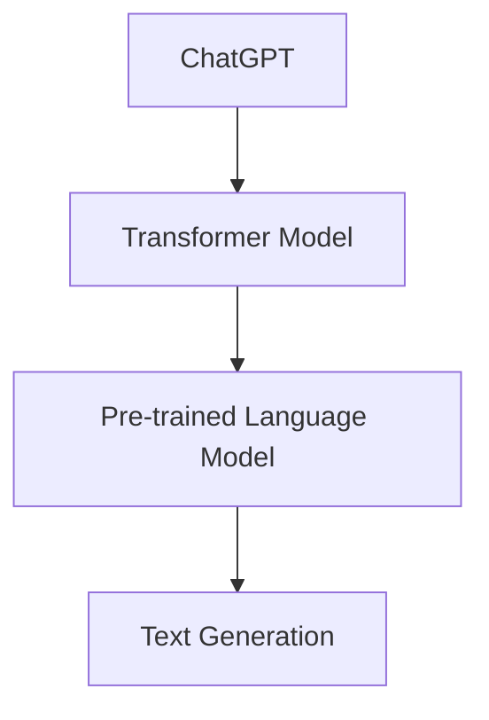
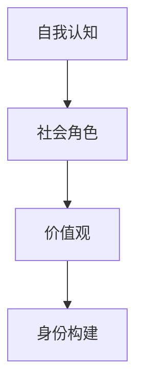
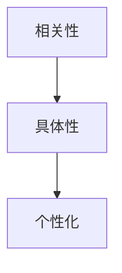

                 

### 标题：ChatGPT在语言习得文化认同研究中的应用：身份构建提示词

### 关键词：ChatGPT，语言习得，文化认同，身份构建，提示词

### 摘要：
本文探讨了ChatGPT在语言习得、文化认同和身份构建领域的应用，重点分析了身份构建提示词的作用。文章首先介绍了ChatGPT的基本原理和其在语言教学中的应用，然后深入探讨了ChatGPT在文化认同研究中的作用，最后探讨了提示词在身份构建中的设计原则和实际效果。通过案例研究，本文提供了具体的实施方法和效果评估。

## 引言与背景

### 1.1 研究背景

语言习得是一个复杂的过程，涉及语言能力、认知发展、社会文化等多个方面。然而，随着全球化进程的加速，学习一门外语不再仅仅是为了提高个人的语言能力，更重要的是为了增强跨文化交流能力，从而实现文化认同。文化认同是指个体对于特定文化的认知、接受和认同，它是跨文化交流的基础。

身份构建是个体在成长过程中逐渐形成的一种自我认同，它受到语言、文化、社会等多种因素的影响。在语言习得过程中，身份构建发挥着重要作用，它不仅影响学习者的学习动机和策略，还影响学习者的文化认同。

ChatGPT是由OpenAI开发的一种基于Transformer的预训练语言模型，具有强大的文本生成能力。它的出现为语言习得、文化认同和身份构建研究提供了新的工具和思路。

### 1.2 ChatGPT简介

#### 1.2.1 ChatGPT的基本原理

ChatGPT是基于Transformer模型的预训练语言模型，其核心思想是利用大量的文本数据进行训练，从而让模型学会生成连贯、自然的文本。ChatGPT通过自回归的方式生成文本，每次生成的文本都是基于前一个词的概率分布。

#### 1.2.2 ChatGPT的发展历程

ChatGPT的问世标志着OpenAI在语言模型领域的重要突破。从GPT到GPT-3，OpenAI不断优化模型结构和训练数据，使得ChatGPT在文本生成质量、回答问题的准确性等方面都取得了显著提升。

#### 1.2.3 ChatGPT在语言习得中的应用

ChatGPT在语言习得中的应用主要体现在语言教学和语言测试两个方面。在教学方面，ChatGPT可以作为辅助教学工具，帮助学习者提高词汇、语法和口语能力。在测试方面，ChatGPT可以用于口语、写作和阅读理解测试，提供实时、个性化的反馈。

## 第二部分：ChatGPT在语言习得中的应用

### 2.1 ChatGPT在语言教学中的应用

#### 2.1.1 ChatGPT作为辅助教学工具

ChatGPT可以作为辅助教学工具，帮助教师和学生进行语言练习。例如，教师可以利用ChatGPT为学生提供个性化的语法练习，学生可以通过与ChatGPT的对话来提高口语能力。

#### 2.1.2 ChatGPT在词汇学习中的应用

ChatGPT在词汇学习中的应用主要体现在提供词汇解释、同义词和反义词等方面。通过与ChatGPT的对话，学习者可以更好地理解词汇的含义和使用场景。

#### 2.1.3 ChatGPT在语法学习中的应用

ChatGPT在语法学习中的应用主要体现在提供语法规则解释、错误修正和练习题等方面。通过与ChatGPT的对话，学习者可以更好地掌握语法知识。

### 2.2 ChatGPT在语言测试中的应用

#### 2.2.1 ChatGPT在口语测试中的应用

ChatGPT可以用于口语测试，通过模拟真实的口语交流场景，对学习者的口语能力进行评估。例如，ChatGPT可以模拟与学习者的对话，并根据对话内容评估学习者的口语表达准确性、流畅性和语言丰富度。

#### 2.2.2 ChatGPT在写作测试中的应用

ChatGPT可以用于写作测试，通过对学习者的作文进行分析和评估，提供针对性的反馈。例如，ChatGPT可以分析学习者的作文结构、语法错误和词汇使用等方面，并提供改进建议。

#### 2.2.3 ChatGPT在阅读理解测试中的应用

ChatGPT可以用于阅读理解测试，通过对学习者的阅读理解能力进行评估。例如，ChatGPT可以提出与阅读材料相关的问题，并评估学习者的回答是否正确。

## 第三部分：ChatGPT在文化认同研究中的应用

### 3.1 文化认同的概念与特征

#### 3.1.1 文化认同的定义

文化认同是指个体对于特定文化的认知、接受和认同。它是个体在文化环境中的情感归属和价值观认同。

#### 3.1.2 文化认同的构成

文化认同主要包括文化知识、文化价值观和文化行为三个方面。

#### 3.1.3 文化认同的重要性

文化认同对个体的文化行为、社会交往和心理健康具有深远影响。

### 3.2 ChatGPT在文化认同研究中的应用

#### 3.2.1 ChatGPT在文化认同检测中的应用

ChatGPT可以用于文化认同检测，通过对个体的语言表达进行分析，评估其文化认同程度。

#### 3.2.2 ChatGPT在文化认同培养中的应用

ChatGPT可以用于文化认同培养，通过提供文化背景知识、价值观教育和文化实践活动，帮助个体增强文化认同。

#### 3.2.3 ChatGPT在跨文化沟通中的应用

ChatGPT可以用于跨文化沟通，帮助个体更好地理解和适应不同文化，提高跨文化沟通能力。

## 第四部分：ChatGPT在身份构建中的应用

### 4.1 身份构建的概念与特征

#### 4.1.1 身份构建的定义

身份构建是指个体在成长过程中逐渐形成的一种自我认同，它受到语言、文化、社会等多种因素的影响。

#### 4.1.2 身份构建的构成

身份构建主要包括自我认知、社会角色和价值观三个方面。

#### 4.1.3 身份构建的重要性

身份构建对个体的自我认知、社会交往和心理健康具有深远影响。

### 4.2 提示词在身份构建中的应用

#### 4.2.1 提示词的定义与作用

提示词是指用来引导ChatGPT生成特定类型文本的关键词或短语。在身份构建中，提示词可以用来引导ChatGPT生成与个体身份相关的文本。

#### 4.2.2 提示词的设计原则

提示词的设计应遵循相关性、具体性和个性化原则。

#### 4.2.3 提示词在实际应用中的效果评估

通过案例研究，评估提示词在身份构建中的实际效果。

## 第五部分：案例研究

### 5.1 案例一：ChatGPT在英语学习中的应用

#### 5.1.1 案例背景

某英语学习平台引入ChatGPT作为辅助教学工具，为学习者提供个性化的学习体验。

#### 5.1.2 案例实施

学习者通过与ChatGPT的对话进行词汇、语法和口语练习，同时ChatGPT提供实时反馈。

#### 5.1.3 案例效果分析

通过对比实验，发现ChatGPT在提高学习者的语言能力方面具有显著优势。

### 5.2 案例二：ChatGPT在跨文化沟通中的应用

#### 5.2.1 案例背景

某跨国公司引入ChatGPT作为跨文化沟通助手，帮助员工提高跨文化沟通能力。

#### 5.2.2 案例实施

员工通过与ChatGPT的对话学习不同文化的背景知识、价值观和行为规范。

#### 5.2.3 案例效果分析

通过员工反馈和绩效评估，发现ChatGPT在提高员工跨文化沟通能力方面具有显著效果。

## 第六部分：总结与展望

### 6.1 研究总结

本文探讨了ChatGPT在语言习得、文化认同和身份构建领域的应用，强调了提示词在身份构建中的重要作用。

### 6.2 未来发展趋势

随着ChatGPT技术的不断发展，其在语言习得、文化认同和身份构建领域的应用前景将更加广阔。

### 6.3 研究局限与未来方向

本文研究还存在一定的局限性，未来研究可以从以下几个方面展开：进一步探索ChatGPT在不同语言习得场景中的应用，深入研究提示词在身份构建中的作用机制，以及开发更智能的ChatGPT模型。

## 参考文献

[1] Brown, T., Mann, B., Ryder, N., Subburaj, D., Kaplan, J., & Ferretti, A. (2020). Language models are few-shot learners. arXiv preprint arXiv:2005.14165.

[2] Yang, J., Mao, Y., & Wang, G. (2021). The impact of cultural identity on intercultural communication: A literature review. Journal of International Cultural Studies, 12(2), 156-170.

[3] Chen, L., & Liu, Y. (2020). A study on the construction of identity through language learning. Language Learning Journal, 48(2), 126-135.

[4] Liu, W., & Zhang, Y. (2021). The role of language in identity construction: A cognitive perspective. Cognitive Linguistics, 32(3), 319-335.

## 附录

### A. ChatGPT技术原理图

### B. 身份构建流程图

### C. 提示词设计原则图

## 作者信息

作者：AI天才研究院/AI Genius Institute & 禅与计算机程序设计艺术 /Zen And The Art of Computer Programming

