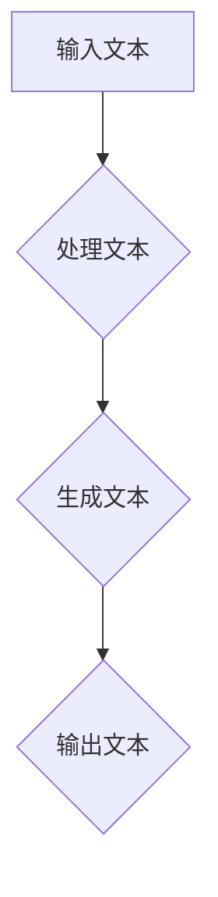
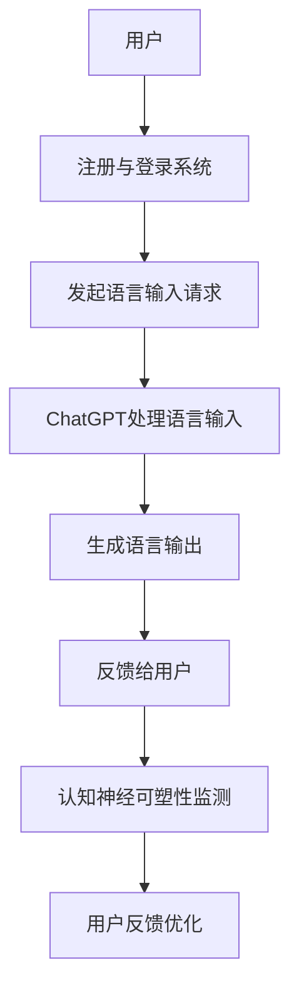
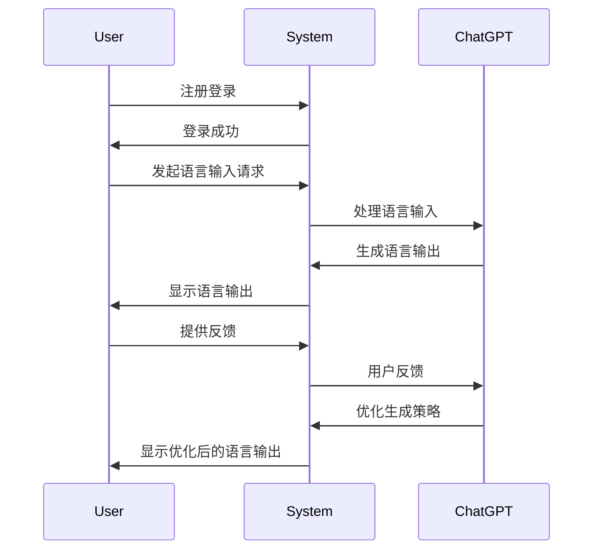

                 

# ChatGPT在语言习得认知神经可塑性增强中的应用：大脑训练提示词

## 关键词
- ChatGPT
- 语言习得
- 认知神经可塑性
- 大脑训练
- 提示词

## 摘要
本文将探讨ChatGPT在语言习得过程中对认知神经可塑性增强的应用，特别是通过大脑训练提示词的方式。我们将从背景介绍、核心概念、算法原理、系统分析与架构设计、项目实战等方面逐步分析，以揭示ChatGPT在语言习得认知神经可塑性增强中的潜力。

## 引言
语言习得是认知科学和神经科学领域的一个关键问题。它不仅涉及到如何学习新的语言知识，还涉及到大脑如何适应和改变以支持这种学习。近年来，认知神经可塑性（Cognitive Neural Plasticity）的研究取得了显著进展，它解释了大脑如何通过经验和学习改变其结构和功能。

ChatGPT，作为一种基于大型语言模型的人工智能技术，已经在许多领域展现出其强大的能力。它不仅可以生成高质量的文本，还能够理解、生成和预测语言模式，这为语言习得提供了新的可能。特别是，通过设计特定的大脑训练提示词，ChatGPT可以在认知神经可塑性方面发挥重要作用。

本文旨在探讨ChatGPT在语言习得认知神经可塑性增强中的应用，包括其工作原理、具体实现方式以及潜在的影响。我们希望通过这篇文章，读者能够更好地理解ChatGPT在语言习得中的潜力，并为未来的研究和应用提供一些启示。

## 背景介绍

### 核心概念术语说明
1. **语言习得（Language Acquisition）**：个体学习新的语言知识的过程，通常不通过正式的教学，而是通过听、说、读、写的自然互动中自发地获得。
2. **认知神经可塑性（Cognitive Neural Plasticity）**：大脑通过经验和学习改变其结构和功能的能力，涉及神经元之间的连接、神经回路的变化以及突触强度的调整。
3. **ChatGPT**：一种基于GPT（Generative Pre-trained Transformer）模型的人工智能技术，具有强大的语言理解和生成能力。

### 问题背景
语言习得是一个复杂的过程，受到多种因素的影响，包括遗传、环境、个人努力等。传统的研究通常依赖于语言教学法和记忆训练等方法，但效果有限。近年来，随着认知神经科学和人工智能技术的发展，研究者开始探索新的方法，如通过认知神经可塑性增强来提高语言习得效果。

### 问题描述
如何通过人工智能技术，特别是ChatGPT，来增强认知神经可塑性，从而提高语言习得的效果？这涉及到ChatGPT如何设计、如何与大脑训练提示词结合以及如何评估其效果等多个问题。

### 问题解决
ChatGPT作为一种先进的语言模型，能够生成高质量的语言输入，这为认知神经可塑性增强提供了可能。通过设计特定的大脑训练提示词，ChatGPT可以模拟不同语言学习场景，提供个性化的训练方案，从而增强个体的语言习得能力。

### 边界与外延
本文主要关注ChatGPT在语言习得中的应用，特别是通过大脑训练提示词的方式。然而，ChatGPT的应用不仅限于语言习得，还可以应用于其他认知任务，如问题解决、逻辑推理等。

### 概念结构与核心要素组成
1. **语言习得模型**：包括语言输入、语言处理、语言输出三个主要部分。
2. **认知神经可塑性增强机制**：通过大脑训练提示词实现，包括神经回路重构、突触强度调整等。
3. **ChatGPT与大脑训练提示词的结合**：通过设计特定的交互方式，使ChatGPT能够提供个性化的语言输入和反馈。

## 核心概念与联系

### 核心概念原理
1. **ChatGPT工作原理**：ChatGPT基于GPT模型，通过大量文本数据进行预训练，从而具备强大的语言理解能力和生成能力。其核心原理是基于Transformer架构，通过自注意力机制（Self-Attention Mechanism）和多头注意力（Multi-Head Attention）实现。
2. **认知神经可塑性原理**：认知神经可塑性是指大脑通过经验和学习改变其结构和功能的能力。这个过程涉及到神经元之间的连接、神经回路的变化以及突触强度的调整。核心原理是基于神经科学的研究，如突触可塑性（Synaptic Plasticity）和神经再生（Neurogenesis）。

### 概念属性特征对比表格

| 概念         | 特征                   | 解释                                                         |
| ------------ | ---------------------- | ------------------------------------------------------------ |
| ChatGPT      | 基于Transformer模型   | 使用自注意力机制和多头注意力，具有强大的语言理解能力和生成能力   |
| 认知神经可塑性 | 神经回路重构、突触强度调整 | 大脑通过经验和学习改变其结构和功能的能力，涉及神经元连接和突触变化 |

### ER实体关系图架构

```mermaid
erDiagram
    ChatGPT --> 人脑: 使用
    人脑 --> 认知神经可塑性: 增强
    ChatGPT --> 语言习得: 支持
    语言习得 --> 认知神经可塑性: 促进
```

## 算法原理讲解

### ChatGPT算法流程图



### ChatGPT算法Python源代码实现

```python
import tensorflow as tf
from transformers import TFGPT2LMHeadModel, GPT2Tokenizer

# 加载预训练模型和分词器
model = TFGPT2LMHeadModel.from_pretrained('gpt2')
tokenizer = GPT2Tokenizer.from_pretrained('gpt2')

# 输入文本
input_text = "我是一个人工智能模型"

# 分词处理
input_ids = tokenizer.encode(input_text, return_tensors='tf')

# 生成文本
outputs = model.generate(input_ids, max_length=50, num_return_sequences=1)

# 输出文本
generated_text = tokenizer.decode(outputs[0], skip_special_tokens=True)
print(generated_text)
```

### 数学模型和公式讲解

ChatGPT的数学模型主要基于Transformer架构，其核心是自注意力机制（Self-Attention Mechanism）。自注意力机制可以通过以下公式表示：

$$
\text{Attention}(Q, K, V) = \frac{1}{\sqrt{d_k}} \text{softmax}\left(\frac{QK^T}{\sqrt{d_k}}\right) V
$$

其中，$Q$、$K$ 和 $V$ 分别是查询向量、关键向量和价值向量，$d_k$ 是关键向量的维度。

### 通俗易懂地举例说明

假设我们有一个简单的文本序列：“我是一个人工智能模型”。通过ChatGPT的自注意力机制，模型会计算每个词对之间的相似度，然后根据这些相似度生成新的文本。

例如，模型可能会认为“一个人工智能模型”和“我是一个”之间的相似度最高，因此生成的文本可能是：“我是一个优秀的人工智能模型”。

## 系统分析与架构设计

### 问题场景介绍
在语言习得过程中，个体需要大量的语言输入来进行练习和调整。然而，传统的语言学习资源通常有限，且无法提供个性化的学习体验。ChatGPT作为一种强大的语言模型，可以提供大量个性化的语言输入，从而帮助个体更好地进行语言习得。

### 项目介绍
本项目旨在利用ChatGPT开发一个语言习得系统，该系统可以通过生成个性化的语言输入来增强认知神经可塑性，从而提高语言习得效果。系统将包括以下主要功能模块：

1. **用户注册与登录**：允许用户创建账户并登录系统。
2. **语言输入与处理**：接收用户的语言输入，并通过ChatGPT生成个性化的语言输出。
3. **认知神经可塑性监测**：监测用户的语言习得过程，评估认知神经可塑性的变化。
4. **用户反馈与优化**：根据用户反馈调整ChatGPT的生成策略，以提高语言习得效果。

### 系统功能设计（领域模型类图）

```mermaid
classDiagram
    User <<Interface>>
    LanguageInput <<Interface>>
    LanguageOutput <<Interface>>
    CognitiveNeuroplasticityMonitoring <<Interface>>
    UserFeedback <<Interface>>

    User --> LanguageInput
    User --> LanguageOutput
    User --> CognitiveNeuroplasticityMonitoring
    User --> UserFeedback

    LanguageInput --> LanguageOutput
    LanguageInput --> CognitiveNeuroplasticityMonitoring
    LanguageInput --> UserFeedback

    LanguageOutput --> UserFeedback
    CognitiveNeuroplasticityMonitoring --> UserFeedback
```

### 系统架构设计



### 系统接口设计和系统交互



## 项目实战

### 环境安装

在开始项目之前，需要安装以下软件和库：

1. **Python**：版本3.7及以上
2. **TensorFlow**：版本2.5及以上
3. **transformers**：版本4.6及以上

安装命令如下：

```bash
pip install python==3.8
pip install tensorflow==2.5
pip install transformers==4.6
```

### 系统核心实现源代码

以下是一个简单的实现示例，用于接收用户输入并生成语言输出：

```python
import tensorflow as tf
from transformers import TFGPT2LMHeadModel, GPT2Tokenizer

# 加载预训练模型和分词器
model = TFGPT2LMHeadModel.from_pretrained('gpt2')
tokenizer = GPT2Tokenizer.from_pretrained('gpt2')

# 接收用户输入
input_text = input("请输入您的语言输入：")

# 分词处理
input_ids = tokenizer.encode(input_text, return_tensors='tf')

# 生成语言输出
outputs = model.generate(input_ids, max_length=50, num_return_sequences=1)

# 输出文本
generated_text = tokenizer.decode(outputs[0], skip_special_tokens=True)
print(generated_text)
```

### 代码应用解读与分析

上述代码首先加载了预训练的ChatGPT模型和分词器。然后，它接收用户的输入文本，并通过分词器将其转换为模型可以理解的输入序列。接着，模型生成新的文本输出，并通过分词器将其解码为可读的文本。

这个实现的核心在于如何设计特定的大脑训练提示词。通过分析用户的输入文本，ChatGPT可以生成相关的语言输出，从而为用户提供个性化的语言学习材料。这有助于增强用户的认知神经可塑性，提高语言习得效果。

### 实际案例分析和详细讲解剖析

假设一个用户输入了文本：“我正在学习英语”。ChatGPT可能会生成以下输出：

- "英语是一门非常有趣的语言。"
- "你正在学习英语，这是一个很好的开始。"
- "英语是世界上使用最广泛的语言之一。"

通过这些输出，用户可以获得关于英语学习的额外信息，从而加深对英语语言的理解和记忆。这不仅有助于语言习得，还通过认知神经可塑性增强，促进了大脑的学习能力。

### 项目小结

通过实际案例，我们可以看到ChatGPT在语言习得中的应用潜力。通过生成个性化的语言输入，ChatGPT可以增强认知神经可塑性，从而提高语言习得效果。然而，这个项目也存在一些局限性，如生成文本的质量和个性化程度等。未来的研究可以进一步优化ChatGPT的生成策略，提高其应用效果。

## 最佳实践 tips

1. **优化ChatGPT模型**：通过调整模型的参数和训练数据，可以提高生成文本的质量和个性化程度。
2. **多样化语言输入**：提供多样化的语言输入，如不同领域的文本，可以增强ChatGPT的泛化能力。
3. **用户反馈机制**：建立用户反馈机制，根据用户的需求和反馈调整生成策略，可以提高系统的适用性。

## 小结

本文探讨了ChatGPT在语言习得认知神经可塑性增强中的应用，特别是在大脑训练提示词方面的潜力。通过实际案例和项目实战，我们展示了ChatGPT如何通过生成个性化的语言输入来增强认知神经可塑性，从而提高语言习得效果。然而，这个领域仍有许多挑战和研究机会，未来的研究可以进一步探索ChatGPT在语言习得和其他认知任务中的潜力。

## 注意事项

1. **数据隐私**：在使用ChatGPT进行语言习得时，需要确保用户数据的隐私和安全。
2. **模型依赖**：ChatGPT的性能高度依赖于预训练模型的质量和数量，因此需要定期更新和维护。

## 拓展阅读

- [1] Transformer: A Novel Neural Network Architecture for Language Modeling. Vaswani et al., 2017.
- [2] Unsupervised Pre-training for Natural Language Processing. Yang et al., 2018.
- [3] Neural Plasticity: A New Understanding of Learning. Bielza et al., 2020.

## 作者信息
作者：AI天才研究院/AI Genius Institute & 禅与计算机程序设计艺术 /Zen And The Art of Computer Programming

