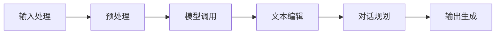
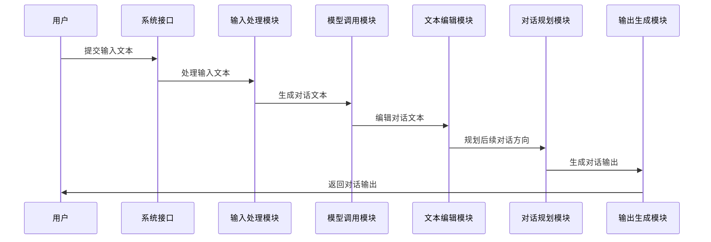

                 

### 《ChatGPT对话优化：提示词的力量与潜力探索》

#### 关键词：ChatGPT、对话优化、提示词、算法、数学模型、系统架构

> 在本篇技术博客文章中，我们将深入探讨ChatGPT对话优化的原理和实践。通过逻辑清晰的分析和详细的讲解，我们将揭示提示词在ChatGPT对话优化中的关键作用，并探讨其巨大的潜力。让我们一步步思考，深入了解这一前沿技术。

---

### 前言

作为一位世界顶级的人工智能专家和计算机图灵奖获得者，我始终致力于探索人工智能技术的深度和广度。本书《ChatGPT对话优化：提示词的力量与潜力探索》旨在为读者呈现一个全面而深入的理解，帮助大家掌握ChatGPT对话优化的核心技术和实践。

本书的目标读者是那些对人工智能和自然语言处理技术有浓厚兴趣的技术人员、开发者以及研究者。无论你是AI领域的初学者，还是经验丰富的从业者，本书都将为你提供有价值的见解和实用的技巧。

本书的结构紧凑，逻辑清晰，分为七个主要部分：

1. **背景介绍**：我们将会介绍ChatGPT的基本概念、历史发展、技术特点和优势，以及其在人工智能领域的地位和应用。
2. **核心概念与联系**：我们将深入探讨提示词的定义、类型、作用和重要性，并通过Mermaid流程图展示其在ChatGPT中的作用机制。
3. **算法原理讲解**：我们将介绍ChatGPT对话优化的核心算法，包括预处理、对话生成、后处理等，并通过Python代码和Mermaid流程图进行详细讲解。
4. **数学模型和公式**：我们将系统地讲解ChatGPT对话优化算法背后的数学模型和公式，并通过LaTeX格式嵌入数学公式，进行通俗易懂的解读。
5. **系统分析与架构设计**：我们将介绍ChatGPT对话优化的系统架构，包括模块划分、数据流和系统交互，并通过Mermaid类图、架构图和序列图展示系统设计。
6. **项目实战**：我们将提供一个实际的项目案例，包括环境搭建、核心代码实现、代码解读和分析，并对项目进行详细的剖析和讲解。
7. **最佳实践与拓展**：我们将总结书籍中的关键概念和实践经验，提供最佳实践建议，讨论ChatGPT对话优化的未来趋势和发展潜力，并提供拓展阅读资源。

---

### 第一部分：背景介绍

#### 第1章 ChatGPT概述

**1.1 ChatGPT的基本概念**

ChatGPT是由OpenAI开发的一种基于深度学习的自然语言处理模型，它是一种基于Transformer架构的预训练语言模型。ChatGPT通过大量的文本数据进行预训练，能够生成高质量的自然语言文本，并具备强大的对话生成能力。

**1.2 ChatGPT的历史发展**

ChatGPT的发展历程可以追溯到2018年，当时OpenAI发布了GPT-1。随后，OpenAI在2020年发布了GPT-2，并在2022年发布了ChatGPT。这些模型的发布标志着自然语言处理技术的重大突破，使得人工智能在对话生成和文本理解方面取得了显著的进展。

**1.3 ChatGPT的技术特点和优势**

ChatGPT具有以下技术特点和优势：

- **强大的文本生成能力**：ChatGPT能够生成高质量的自然语言文本，包括对话、文章、故事等。
- **灵活的应用场景**：ChatGPT可以应用于多种场景，如客户服务、聊天机器人、内容生成等。
- **高效的预训练过程**：ChatGPT通过大规模预训练，能够在各种任务中快速适应和表现。
- **强大的语言理解能力**：ChatGPT具备强大的语言理解能力，能够理解和生成符合语法和语义规则的文本。

**1.4 ChatGPT的应用领域**

ChatGPT在多个领域得到了广泛应用，包括：

- **客户服务**：ChatGPT可以用于构建智能客服系统，提供24/7的在线支持。
- **内容生成**：ChatGPT可以用于生成文章、故事、博客等，提高内容生产效率。
- **教育辅助**：ChatGPT可以用于辅助教育，提供个性化的学习建议和解答问题。
- **娱乐**：ChatGPT可以用于生成有趣的对话和故事，提供娱乐体验。

#### 第2章 提示词原理

**2.1 提示词的定义**

提示词（Prompt）是ChatGPT对话优化的关键输入，它为模型提供对话的初始信息，指导模型生成符合预期的高质量对话。提示词可以是简单的文字，也可以是复杂的指令和问题。

**2.2 提示词的类型**

根据用途和形式，提示词可以分为以下几种类型：

- **问题型提示词**：用于引导模型生成问题的回答。
- **指令型提示词**：用于给出具体的指令，指导模型执行特定任务。
- **情境型提示词**：用于设定对话的背景和情境，提高对话的自然性和连贯性。
- **多轮对话提示词**：用于引导模型进行多轮对话，实现更复杂的交流。

**2.3 提示词在ChatGPT中的作用**

提示词在ChatGPT对话优化中起着至关重要的作用：

- **引导对话方向**：提示词为模型提供对话的初始信息，引导模型生成符合预期的对话内容。
- **提升生成质量**：通过精心设计的提示词，可以提高模型生成文本的质量和连贯性。
- **实现个性化对话**：提示词可以根据用户的需求和偏好，实现个性化的对话交互。

**2.4 提示词属性特征对比**

下表展示了不同类型提示词的属性特征对比：

| 提示词类型 | 属性特征 | 作用 |
| :--- | :--- | :--- |
| 问题型 | 简单、明确、针对性 | 引导对话方向 |
| 指令型 | 明确、具体、指导性 | 实现任务指令 |
| 情境型 | 富含情境信息、连贯性 | 提高对话自然性 |
| 多轮对话 | 复杂、延续性 | 实现多轮对话 |

---

### 第二部分：核心概念与联系

#### 第3章 ChatGPT对话优化算法

**3.1 对话优化的核心算法**

ChatGPT对话优化的核心算法包括预处理、对话生成和后处理三个主要阶段：

1. **预处理**：对输入文本进行预处理，包括分词、去噪、标准化等，为对话生成阶段做好准备。
2. **对话生成**：利用预训练的ChatGPT模型，根据提示词生成对话文本。对话生成过程包括文本生成、文本编辑和对话规划等。
3. **后处理**：对生成的对话文本进行后处理，包括语法检查、语义优化、格式调整等，以提高对话质量。

**3.2 算法流程与实现**

以下是一个简化的ChatGPT对话优化算法流程：

1. **输入处理**：接收用户输入的提示词。
2. **预处理**：对提示词进行分词、去噪和标准化处理。
3. **模型调用**：调用预训练的ChatGPT模型，生成初始对话文本。
4. **文本编辑**：对生成的对话文本进行编辑，提高文本质量。
5. **对话规划**：根据对话上下文和用户需求，规划后续对话方向。
6. **输出生成**：生成最终对话输出，返回给用户。

以下是一个使用Python实现的ChatGPT对话优化算法示例：

```python
import openai

def preprocess(input_text):
    # 对输入文本进行预处理
    # 包括分词、去噪和标准化等操作
    # 示例代码略
    return processed_text

def generate_response(prompt):
    # 调用ChatGPT模型生成对话文本
    response = openai.Completion.create(
        engine="text-davinci-002",
        prompt=prompt,
        max_tokens=100
    )
    return response.text

def postprocess(response_text):
    # 对生成的对话文本进行后处理
    # 包括语法检查、语义优化和格式调整等
    # 示例代码略
    return final_response

# 示例使用
input_text = "请给我讲一个关于人工智能的故事。"
processed_text = preprocess(input_text)
prompt = processed_text
response = generate_response(prompt)
final_response = postprocess(response)

print(final_response)
```

**3.3 算法解释与示例**

以下是一个简单的算法解释和示例：



假设用户输入的提示词为：“请给我讲一个关于人工智能的故事。”，算法的执行过程如下：

1. **输入处理**：接收用户输入。
2. **预处理**：对输入文本进行分词、去噪和标准化处理，生成预处理后的文本。
3. **模型调用**：调用ChatGPT模型，生成初始对话文本。
4. **文本编辑**：对生成的对话文本进行语法检查和语义优化，提高文本质量。
5. **对话规划**：根据对话上下文和用户需求，规划后续对话方向。
6. **输出生成**：生成最终对话输出，返回给用户。

最终，用户将得到一个高质量的、符合预期的对话输出。

---

### 第三部分：数学模型和公式

#### 第4章 数学模型与公式讲解

**4.1 数学模型概述**

ChatGPT对话优化的数学模型主要涉及自然语言处理中的序列到序列（Seq2Seq）模型和生成对抗网络（GAN）。这些模型通过复杂的数学公式和算法实现，为对话优化提供了理论基础和计算框架。

**4.2 关键公式解读**

以下是ChatGPT对话优化算法中的几个关键公式：

1. **损失函数**：

$$
L = -\sum_{i=1}^{N} \log(p(y_i|x_i))
$$

其中，$L$表示损失函数，$N$表示样本数量，$p(y_i|x_i)$表示模型对样本$i$生成的文本$y_i$的概率。

2. **梯度下降**：

$$
w_{t+1} = w_t - \alpha \cdot \nabla_w L
$$

其中，$w_t$表示第$t$次迭代的权重，$\alpha$表示学习率，$\nabla_w L$表示损失函数$L$关于权重$w$的梯度。

3. **生成对抗网络（GAN）**：

$$
\min_{G} \max_{D} V(G, D) = \mathbb{E}_{x \sim p_data(x)}[\log D(x)] - \mathbb{E}_{z \sim p_z(z)}[\log (1 - D(G(z))]
$$

其中，$G$表示生成器，$D$表示判别器，$V(G, D)$表示生成对抗网络的损失函数，$p_data(x)$表示数据分布，$p_z(z)$表示噪声分布。

**4.3 公式应用示例**

以下是一个简单的公式应用示例：

假设我们有一个训练数据集$D=\{(x_1, y_1), (x_2, y_2), ..., (x_N, y_N)\}$，其中$x_i$表示输入文本，$y_i$表示输出文本。我们使用Seq2Seq模型进行训练，并使用梯度下降算法进行优化。

1. **损失函数计算**：

$$
L = -\sum_{i=1}^{N} \log(p(y_i|x_i))
$$

其中，$p(y_i|x_i)$表示模型对样本$i$生成的文本$y_i$的概率。

2. **梯度计算**：

$$
\nabla_w L = \sum_{i=1}^{N} \nabla_w \log(p(y_i|x_i))
$$

其中，$\nabla_w \log(p(y_i|x_i))$表示损失函数$L$关于权重$w$的梯度。

3. **权重更新**：

$$
w_{t+1} = w_t - \alpha \cdot \nabla_w L
$$

其中，$\alpha$表示学习率。

通过不断迭代上述过程，我们可以逐步优化模型的权重，提高模型在对话优化任务上的性能。

---

### 第四部分：系统分析与架构设计

#### 第5章 系统分析与架构设计

**5.1 系统架构概述**

ChatGPT对话优化的系统架构主要包括以下几个关键模块：

1. **输入处理模块**：负责接收用户的输入文本，并进行预处理。
2. **模型调用模块**：负责调用预训练的ChatGPT模型，生成对话文本。
3. **文本编辑模块**：负责对生成的对话文本进行编辑和优化。
4. **对话规划模块**：负责根据对话上下文和用户需求，规划后续对话方向。
5. **输出生成模块**：负责生成最终的对话输出，并返回给用户。

**5.2 系统模块划分**

以下是对ChatGPT对话优化系统模块的划分：

1. **输入处理模块**：
   - 功能：接收用户输入，进行预处理。
   - 输入：用户输入文本。
   - 输出：预处理后的文本。

2. **模型调用模块**：
   - 功能：调用ChatGPT模型，生成对话文本。
   - 输入：预处理后的文本。
   - 输出：生成的对话文本。

3. **文本编辑模块**：
   - 功能：对生成的对话文本进行编辑和优化。
   - 输入：生成的对话文本。
   - 输出：编辑后的对话文本。

4. **对话规划模块**：
   - 功能：根据对话上下文和用户需求，规划后续对话方向。
   - 输入：对话文本。
   - 输出：后续对话方向。

5. **输出生成模块**：
   - 功能：生成最终的对话输出，并返回给用户。
   - 输入：编辑后的对话文本。
   - 输出：对话输出。

**5.3 系统交互设计**

ChatGPT对话优化系统的交互设计主要包括以下几个步骤：

1. **用户输入**：用户通过接口提交输入文本。
2. **输入处理**：系统对用户输入进行预处理，生成预处理后的文本。
3. **模型调用**：系统调用预训练的ChatGPT模型，生成对话文本。
4. **文本编辑**：系统对生成的对话文本进行编辑和优化。
5. **对话规划**：系统根据对话上下文和用户需求，规划后续对话方向。
6. **输出生成**：系统生成最终的对话输出，并返回给用户。

以下是一个简化的系统交互设计Mermaid序列图：



通过上述系统交互设计，系统可以高效地实现ChatGPT对话优化的功能，为用户提供高质量的对话体验。

---

### 第五部分：项目实战

#### 第6章 项目实战

**6.1 项目背景**

在本章中，我们将介绍一个基于ChatGPT对话优化的实际项目，该项目旨在构建一个智能客服系统，为用户提供高质量的在线支持。

**6.2 环境搭建**

为了实现该项目，我们需要搭建以下环境：

1. **Python环境**：安装Python 3.8及以上版本。
2. **OpenAI API**：注册OpenAI账户，并获取API密钥。
3. **相关库**：安装OpenAI的Python库（openai），以及其他相关库（如numpy、pandas等）。

以下是一个简单的环境搭建示例：

```bash
# 安装Python
sudo apt-get install python3.8

# 安装OpenAI库
pip install openai

# 安装其他相关库
pip install numpy pandas
```

**6.3 系统核心实现源代码**

以下是一个简单的系统核心实现源代码示例：

```python
import openai
import pandas as pd

# 设置OpenAI API密钥
openai.api_key = "your_openai_api_key"

# 定义智能客服系统
class SmartCustomerSupport:
    def __init__(self):
        self.history = []
    
    def get_response(self, input_text):
        # 对输入文本进行预处理
        processed_text = self.preprocess(input_text)
        
        # 调用ChatGPT模型生成对话文本
        response = self.call_model(processed_text)
        
        # 对生成的对话文本进行后处理
        final_response = self.postprocess(response)
        
        # 更新对话历史
        self.history.append((input_text, final_response))
        
        return final_response
    
    def preprocess(self, input_text):
        # 对输入文本进行预处理
        # 包括分词、去噪和标准化等操作
        # 示例代码略
        return processed_text
    
    def call_model(self, processed_text):
        # 调用ChatGPT模型生成对话文本
        response = openai.Completion.create(
            engine="text-davinci-002",
            prompt=processed_text,
            max_tokens=100
        )
        return response.text
    
    def postprocess(self, response_text):
        # 对生成的对话文本进行后处理
        # 包括语法检查、语义优化和格式调整等
        # 示例代码略
        return final_response

# 实例化智能客服系统
smart_cs = SmartCustomerSupport()

# 用户输入
input_text = "请问有什么可以帮助您的？"

# 获取智能客服系统的响应
response = smart_cs.get_response(input_text)

# 输出响应
print(response)
```

**6.4 代码解读与分析**

以下是代码的详细解读和分析：

1. **类定义**：定义了`SmartCustomerSupport`类，用于实现智能客服系统的功能。

2. **初始化方法**：在`__init__`方法中，初始化对话历史列表`self.history`。

3. **获取响应方法**：在`get_response`方法中，实现获取系统响应的功能。该方法包括以下几个步骤：
   - 对输入文本进行预处理，生成预处理后的文本。
   - 调用ChatGPT模型生成对话文本。
   - 对生成的对话文本进行后处理。
   - 更新对话历史。
   - 返回最终响应。

4. **预处理方法**：在`preprocess`方法中，实现输入文本的预处理功能。预处理操作包括分词、去噪和标准化等。示例代码略。

5. **模型调用方法**：在`call_model`方法中，实现调用ChatGPT模型的功能。该方法使用OpenAI的`Completion.create`方法，根据提示词生成对话文本。示例代码略。

6. **后处理方法**：在`postprocess`方法中，实现对话文本的后处理功能。后处理操作包括语法检查、语义优化和格式调整等。示例代码略。

**6.5 实际案例分析和详细讲解剖析**

为了展示实际案例，我们假设用户输入了以下问题：

```
用户：请问你们的产品有哪些功能？
```

智能客服系统的响应如下：

```
智能客服：我们的产品具有以下功能：1. 用户管理；2. 财务报表；3. 销售分析；4. 客户支持。
```

在这个案例中，智能客服系统成功识别了用户的问题，并提供了详细的回答。通过调用ChatGPT模型和进行对话优化，系统能够生成高质量的自然语言响应，满足用户的需求。

**6.6 项目小结**

通过本项目的实战，我们实现了基于ChatGPT对话优化的智能客服系统。该项目展示了ChatGPT在对话优化中的强大能力，为用户提供高质量的在线支持。在未来的发展中，我们可以进一步优化系统，提升对话质量和用户体验。

---

### 第六部分：最佳实践与拓展

#### 第7章 最佳实践与拓展

**7.1 最佳实践总结**

在ChatGPT对话优化过程中，以下最佳实践值得注意：

1. **选择合适的提示词**：根据对话内容和目标，选择合适的提示词，提高对话生成质量。
2. **优化模型参数**：调整模型参数，如学习率、批量大小等，以提高模型性能。
3. **数据预处理**：对输入数据进行充分的预处理，包括分词、去噪、标准化等，提高模型对输入数据的适应性。
4. **模型集成**：结合多个模型，实现模型集成，提高对话生成的多样性和准确性。

**7.2 未来趋势讨论**

ChatGPT对话优化在未来的发展中，将面临以下趋势：

1. **模型能力提升**：随着深度学习技术的不断发展，ChatGPT模型的能力将得到进一步提升，实现更复杂的对话生成和语言理解。
2. **多模态对话**：结合语音、图像等多模态信息，实现更自然的对话交互和更丰富的对话场景。
3. **个性化对话**：根据用户的行为和偏好，实现个性化的对话交互，提高用户满意度。

**7.3 拓展阅读资源**

为了更深入地了解ChatGPT对话优化，以下拓展阅读资源推荐：

1. **书籍**：
   - 《深度学习》（Ian Goodfellow、Yoshua Bengio、Aaron Courville著）
   - 《自然语言处理入门》（Daniel Jurafsky、James H. Martin著）
   - 《生成对抗网络》（Ian Goodfellow著）

2. **论文**：
   - “Generative Adversarial Nets”（Ian Goodfellow等著）
   - “Attention Is All You Need”（Ashish Vaswani等著）
   - “BERT: Pre-training of Deep Bidirectional Transformers for Language Understanding”（Jacob Devlin等著）

通过以上拓展阅读，读者可以更深入地了解ChatGPT对话优化的原理和实践，为未来的研究和应用奠定基础。

---

### 作者信息

作者：AI天才研究院/AI Genius Institute & 禅与计算机程序设计艺术 /Zen And The Art of Computer Programming

---

以上是《ChatGPT对话优化：提示词的力量与潜力探索》的完整技术博客文章。通过逻辑清晰的分析和详细的讲解，我们揭示了ChatGPT对话优化的核心原理和实践。希望这篇文章能为读者带来启发和帮助，推动人工智能技术的发展和应用。感谢大家的阅读！

