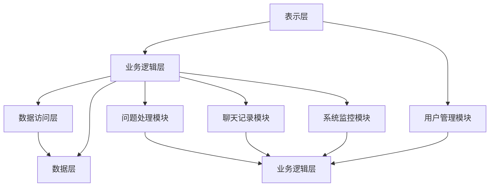
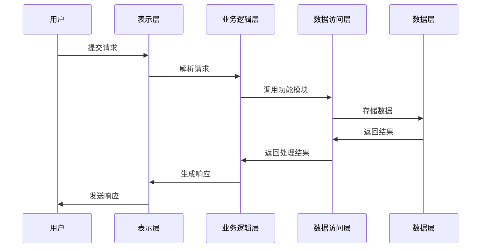

                 


## 1.1 问题背景

随着人工智能技术的不断发展，自然语言处理（NLP）成为了一个热门的研究领域。在这个领域内，聊天机器人（Chatbot）的发展尤为引人注目。ChatGPT，作为OpenAI推出的一款基于GPT-3模型的聊天机器人，因其强大的语言生成能力和自然流畅的对话表现，受到了广泛关注。然而，在实际应用中，如何优化ChatGPT的对话质量，使其更加符合用户需求，成为了一个亟待解决的问题。

### 1.1.1 人工智能与自然语言处理的发展

人工智能（AI）起源于20世纪50年代，其目标是使计算机能够执行需要人类智能的任务。随着计算能力的提升和算法的改进，AI技术在各个领域取得了显著的成果。自然语言处理作为AI的一个重要分支，旨在使计算机能够理解和处理人类语言。

自然语言处理的发展经历了多个阶段，从最初的基于规则的方法，到基于统计的方法，再到如今的深度学习方法。深度学习，特别是基于神经网络的模型，如GPT，在NLP领域取得了突破性的进展。GPT模型通过大量的文本数据进行训练，能够生成连贯、自然的语言，这使得ChatGPT具备了优秀的对话能力。

### 1.1.2 ChatGPT 的起源与核心功能

ChatGPT是OpenAI在2022年推出的一款聊天机器人，基于GPT-3模型开发。GPT-3是语言模型的一种，其特点是可以生成高质量、连贯的自然语言文本。ChatGPT的核心功能是通过与用户的对话，提供信息、解答疑问、甚至是进行简单的交流。

ChatGPT的成功离不开GPT-3模型的支持。GPT-3拥有1750亿个参数，能够处理多种语言任务，包括文本生成、机器翻译、问答系统等。这使得ChatGPT在对话中能够灵活应对各种情况，提供丰富的回答。

### 1.1.3 对话优化的需求与挑战

尽管ChatGPT在对话中表现出色，但实际应用中仍然存在一些问题。首先，对话质量受到多种因素的影响，如语言风格、对话主题、用户情绪等。其次，用户的需求和偏好各不相同，如何使ChatGPT能够满足不同用户的需求，是一个重要的挑战。

此外，对话优化还需要考虑到效率和性能。在实际应用中，ChatGPT需要处理大量的对话请求，如何在保证对话质量的同时，提高处理效率，是另一个重要问题。

## 1.2 问题描述

在了解了ChatGPT的发展背景和其核心功能后，我们接下来需要明确对话优化的具体问题。

### 1.2.1 对话质量的定义与衡量标准

对话质量是衡量ChatGPT性能的一个重要指标。它不仅涉及到语言的自然流畅性，还包括对话的连贯性、针对性、准确性等方面。具体来说，对话质量可以从以下几个方面进行衡量：

1. **语言流畅性**：对话中的语言是否自然流畅，没有明显的语法错误或不合适的表达。
2. **对话连贯性**：对话内容是否能够紧密衔接，没有逻辑上的跳跃。
3. **针对性**：ChatGPT的回答是否能够准确回答用户的问题，或者提供用户需要的信息。
4. **准确性**：ChatGPT的回答是否真实准确，没有误导用户。

### 1.2.2 提示词在对话中的作用

在ChatGPT的对话中，提示词（Prompt）起着至关重要的作用。提示词是用户输入给ChatGPT的文字信息，用于引导ChatGPT生成相应的回答。一个良好的提示词能够帮助ChatGPT更好地理解用户的意图，生成更加准确和自然的回答。

### 1.2.3 当前对话优化的主要方法与不足

目前，优化ChatGPT对话质量的方法主要包括以下几种：

1. **改进提示词**：通过调整提示词的措辞，使其更加明确、具体，从而提高ChatGPT的回答质量。
2. **模型调优**：通过优化GPT-3模型，提高其在特定对话场景下的表现。
3. **数据分析**：通过分析用户的历史对话数据，了解用户的需求和偏好，从而优化ChatGPT的回答。

然而，这些方法也存在一些不足：

1. **提示词调整的局限性**：虽然提示词的改进可以在一定程度上提高对话质量，但无法解决所有问题。
2. **模型调优的复杂性**：模型调优需要大量的计算资源和时间，且效果不一定显著。
3. **数据分析的准确性**：数据分析的结果可能受到数据质量和分析方法的限制，无法完全反映用户的真实需求。

## 1.3 问题解决

针对上述问题，我们需要从多个方面进行思考，提出一种综合性的解决方案。

### 1.3.1 提示词优化的目标与方法

提示词优化的目标是提高ChatGPT的对话质量，使其能够更好地满足用户需求。为了实现这个目标，我们可以采取以下方法：

1. **明确用户意图**：通过分析用户的输入，准确理解用户的意图，从而生成更准确的回答。
2. **多样化提示词**：使用不同类型的提示词，以适应不同的对话场景和用户需求。
3. **改进语言风格**：调整提示词的语言风格，使其更加自然、流畅。

### 1.3.2 艺术性与科学性的结合

提示词的优化不仅需要科学的方法，还需要艺术性的思考。艺术性体现在以下几个方面：

1. **创意思维**：通过创造性思维，设计出新颖、独特的提示词，以激发ChatGPT的想象力。
2. **用户心理**：了解用户的心理需求，设计出能够引起用户共鸣的提示词。
3. **文化背景**：考虑不同文化背景下的语言习惯和表达方式，设计出符合当地文化的提示词。

### 1.3.3 边界与外延

在提示词优化的过程中，我们还需要考虑一些边界和限制：

1. **知识边界**：ChatGPT的知识来源于训练数据，存在一定的知识边界。在提示词优化时，需要确保提示词不会超出ChatGPT的知识范围。
2. **道德和法律**：在对话中，需要遵守道德和法律规范，避免产生不合适的内容。
3. **用户隐私**：在数据分析和使用用户信息时，需要保护用户的隐私。

## 1.4 核心概念与联系

在本文中，我们将探讨多个核心概念，并分析它们之间的关系。以下是本文涉及的核心概念：

1. **ChatGPT**：OpenAI开发的一款基于GPT-3模型的聊天机器人。
2. **提示词**：用于引导ChatGPT生成回答的输入信息。
3. **对话质量**：衡量ChatGPT对话效果的指标，包括语言流畅性、连贯性、针对性、准确性等方面。
4. **用户意图**：用户在对话中希望得到的信息或答案。
5. **模型调优**：通过优化GPT-3模型，提高其在特定对话场景下的表现。

这些概念之间的联系如下：

- ChatGPT是本文的核心对象，其对话质量直接关系到用户的使用体验。
- 提示词是优化对话质量的关键因素，通过调整提示词，可以影响ChatGPT的生成回答。
- 用户意图是理解和满足用户需求的基础，明确用户意图有助于生成更有针对性的回答。
- 模型调优则是从技术层面提升ChatGPT的表现，使其能够更好地应对各种对话场景。

为了更好地理解这些概念之间的关系，我们可以使用Mermaid绘制一个ER实体关系图，如下：

```mermaid
erDiagram
    ChatGPT ||--|{ 提示词 }|
    ChatGPT ||--|{ 对话质量 }|
    ChatGPT ||--|{ 用户意图 }|
    ChatGPT ||--|{ 模型调优 }|
    提示词 ||--|{ 对话质量 }|
    用户意图 ||--|{ 对话质量 }|
    模型调优 ||--|{ ChatGPT }|
```

## 2.1 提示词的艺术性

在优化ChatGPT对话的过程中，提示词的艺术性是至关重要的。艺术性体现在如何通过巧妙的措辞和创意来引导ChatGPT生成高质量的回答。

### 2.1.1 语言风格与对话氛围

语言风格是影响对话质量的一个重要因素。一个恰当的语言风格可以使对话更加自然、流畅。例如，在正式场合使用正式的语言风格，而在休闲场合则可以使用轻松、幽默的语言。以下是几个例子：

- **正式场合**：
  - 用户：你能告诉我如何安装ChatGPT吗？
  - ChatGPT：为了安装ChatGPT，您需要满足以下条件：...

- **休闲场合**：
  - 用户：嘿，你能给我讲个笑话吗？
  - ChatGPT：当然可以！有一次，我走进了一家宠物店，看到了一只会说话的鹦鹉。我问道：“你好啊，小鸟，你叫什么名字？”鹦鹉回答说：“我叫小黑。”我当时就想：“哇，这只鸟真特别，居然叫小黑！”然后，鹦鹉又开口说：“不过，你可以叫我老板。”

通过调整语言风格，ChatGPT可以更好地适应不同的对话场景，提供更加个性化的回答。

### 2.1.2 提问技巧与回答策略

提问技巧和回答策略是优化对话质量的重要手段。有效的提问可以引导用户提供更多信息，从而生成更加准确的回答。以下是一些提问技巧和回答策略：

1. **开放性提问**：这类提问鼓励用户提供详细的信息，例如：
   - 用户：你能帮我解决什么问题？
   - ChatGPT：我可以帮助你解答各种问题，无论是关于科技、文化、还是生活琐事，只要您告诉我您的问题，我会尽力提供帮助。

2. **封闭性提问**：这类提问通常用于获取特定的信息，例如：
   - 用户：你是哪一年出生的？
   - ChatGPT：我是在2022年出生的。

3. **引导性提问**：这类提问旨在引导用户思考或提供更多信息，例如：
   - 用户：你对ChatGPT有什么看法？
   - ChatGPT：ChatGPT是一款非常强大的聊天机器人，它能够通过学习和理解人类的语言来进行对话，还能根据聊天的上下文进行互动，真正像人类一样来聊天交流。

通过灵活运用不同的提问技巧和回答策略，ChatGPT可以更好地与用户进行互动，提高对话的质量。

### 2.1.3 创意思考与联想能力

创意思考与联想能力是提示词艺术性的另一个重要方面。一个富有创意的提示词可以激发ChatGPT的想象力，生成更加丰富、有趣的回答。以下是一些创意思考与联想能力的例子：

1. **故事性提问**：通过提问引导ChatGPT讲述一个故事，例如：
   - 用户：如果你是一个诗人，你会写什么样的诗？
   - ChatGPT：我会写一首关于星空的诗歌，描绘宇宙的浩瀚和神秘。

2. **比喻和隐喻**：使用比喻和隐喻可以使对话更加生动、有趣，例如：
   - 用户：你觉得自己像什么？
   - ChatGPT：我像一本永远翻不完的书，蕴含着无尽的知识和智慧。

3. **幽默元素**：在适当的场合加入幽默元素，可以缓解对话的紧张氛围，例如：
   - 用户：你最近在忙什么呢？
   - ChatGPT：我最近在忙着学习和思考，有时候还会在思考的时候突然笑出声来。

通过创意思考与联想能力，ChatGPT可以生成更加丰富、有感染力的回答，从而提高对话的整体质量。

### 2.1.4 综合运用艺术性技巧

在实际应用中，提示词的艺术性需要综合运用各种技巧，以达到最佳效果。以下是一个综合运用艺术性技巧的例子：

- 用户：我最近在写一篇关于人工智能的论文，你能给我一些建议吗？
- ChatGPT：当然可以！首先，你可以从以下几个方面入手：一是介绍人工智能的发展历程，二是分析人工智能在各个领域的应用，三是探讨人工智能的未来趋势。在写作过程中，注意保持逻辑清晰、语言简洁，尽量用生动的例子来说明问题。

在这个例子中，ChatGPT通过调整语言风格、运用提问技巧和创意思考，为用户提供了具体的建议，从而提高了对话的质量。

### 2.1.5 提示词的艺术性总结

提示词的艺术性是优化ChatGPT对话质量的关键。通过运用语言风格、提问技巧、创意思考等艺术性技巧，可以激发ChatGPT的想象力，生成更加丰富、有趣、自然的回答。以下是对提示词艺术性的总结：

- **语言风格**：根据对话场合和用户需求，调整语言风格，使其更加自然、流畅。
- **提问技巧**：运用开放性、封闭性、引导性等提问技巧，引导用户提供更多信息，提高对话质量。
- **创意思考**：通过故事性、比喻、隐喻等创意思考，激发ChatGPT的想象力，生成更加丰富、有趣的回答。
- **幽默元素**：在适当场合加入幽默元素，缓解对话紧张氛围，提高用户满意度。

通过综合运用这些艺术性技巧，ChatGPT可以生成高质量、自然的对话，从而更好地满足用户需求。

### 2.2 提示词的科学性

在优化ChatGPT对话的过程中，除了艺术性之外，科学性同样至关重要。科学性主要体现在数据分析和模型调优等方面，这些方法能够帮助我们更准确地理解用户需求，提高对话质量。

#### 2.2.1 数据分析与用户画像

数据分析是提示词优化的重要基础。通过对用户对话数据的分析，我们可以了解用户的行为模式、偏好和需求，从而设计出更加个性化的提示词。以下是数据分析在提示词优化中的应用：

1. **行为模式分析**：通过分析用户的历史对话数据，我们可以发现用户在特定场景下的行为模式。例如，用户在某一类问题上更倾向于使用特定的提问方式，或者对某种类型的回答更感兴趣。这些信息可以帮助我们设计出更加符合用户习惯的提示词。

2. **偏好分析**：用户在对话中表现出的偏好可以帮助我们了解他们的兴趣点和价值观。例如，如果用户在对话中频繁提到某个话题，那么我们可以推断他们对这个话题感兴趣，并在提示词中增加相关内容。

3. **需求分析**：通过分析用户的问题和需求，我们可以识别出他们最关心的问题和最迫切的需求。这有助于我们在提示词中突出重点，提供更有针对性的回答。

为了更好地进行数据分析，我们可以创建用户画像。用户画像是对用户特征的综合描述，包括年龄、性别、职业、兴趣爱好、行为习惯等。通过构建用户画像，我们可以更全面地了解用户，从而设计出更加个性化的提示词。

#### 2.2.2 模型训练与调优

模型训练与调优是提高ChatGPT对话质量的关键步骤。以下是模型训练与调优在提示词优化中的应用：

1. **模型训练**：通过大量的文本数据进行训练，GPT-3模型能够学习到各种语言模式和对话策略。在训练过程中，我们可以使用不同类型的文本数据，如新闻文章、社交媒体帖子、对话记录等，以丰富模型的知识库。此外，我们还可以使用预训练和微调相结合的方法，进一步提高模型的性能。

2. **模型调优**：在模型训练完成后，我们通过对模型进行调优，可以进一步提高其在特定对话场景下的表现。调优的方法包括调整模型参数、优化损失函数、使用正则化等技术。通过调优，我们可以使模型更好地适应不同的对话场景，提高对话的连贯性和准确性。

#### 2.2.3 评价指标与优化目标

为了评估提示词优化的效果，我们需要定义一系列评价指标。以下是几个常用的评价指标：

1. **语言流畅性**：评估对话中语言的自然流畅程度，包括语法正确性、词汇搭配、句式结构等。

2. **对话连贯性**：评估对话内容之间的衔接是否紧密，逻辑是否合理。

3. **回答准确性**：评估ChatGPT的回答是否准确、无误，能否满足用户的需求。

4. **用户满意度**：评估用户对对话质量的满意度，可以通过问卷调查、用户评分等方式进行。

在定义评价指标后，我们需要明确优化目标。优化目标通常包括以下几个方面：

1. **提高语言流畅性**：通过优化提示词和模型，提高对话中语言的自然流畅程度。

2. **增强对话连贯性**：通过改进对话策略和模型，使对话内容更加连贯、紧密。

3. **提升回答准确性**：通过数据分析和模型调优，使ChatGPT的回答更加准确、无误。

4. **提升用户满意度**：通过个性化设计和优化，提高用户对对话质量的满意度。

#### 2.2.4 数据分析与模型调优的总结

数据分析与模型调优是提示词优化的重要组成部分。通过数据分析，我们可以了解用户的行为模式、偏好和需求，从而设计出更加个性化的提示词。通过模型调优，我们可以进一步提高ChatGPT的对话质量，使其能够更好地满足用户需求。

以下是对数据分析与模型调优的总结：

- **数据分析**：通过行为模式分析、偏好分析和需求分析，了解用户特征和需求，为设计个性化提示词提供依据。
- **模型训练**：通过大量文本数据训练GPT-3模型，丰富模型的知识库，提高模型在特定对话场景下的表现。
- **模型调优**：通过调整模型参数、优化损失函数、使用正则化等技术，进一步提高模型性能，提高对话质量。
- **评价指标**：定义一系列评价指标，如语言流畅性、对话连贯性、回答准确性和用户满意度，用于评估优化效果。
- **优化目标**：明确优化目标，如提高语言流畅性、增强对话连贯性、提升回答准确性和提升用户满意度。

通过综合运用数据分析与模型调优，我们可以设计出高质量的提示词，优化ChatGPT的对话质量，更好地满足用户需求。

### 2.3 提示词优化方法

提示词优化是提高ChatGPT对话质量的关键步骤。在本节中，我们将介绍几种常用的提示词优化方法，包括提示词生成算法、提示词调整技巧以及提示词与模型交互优化。

#### 2.3.1 提示词生成算法

提示词生成算法是提示词优化的重要工具。以下是一些常用的提示词生成算法：

1. **基于模板的生成算法**：这种算法通过预先定义的模板生成提示词。模板中包含变量，这些变量可以根据用户输入进行替换。例如，一个简单的模板可以是“你问我如何解决某个问题，我可以给你提供以下建议：[建议1]、[建议2]、[建议3]”。通过替换模板中的变量，可以生成不同问题的提示词。

2. **基于机器学习的生成算法**：这种算法使用机器学习模型，如序列到序列（Seq2Seq）模型或变换器（Transformer）模型，从大量对话数据中学习生成提示词。训练数据可以是用户的历史对话记录、公开的对话数据集等。通过训练，模型能够学习到不同场景下的最佳提示词，并在实际应用中生成相应的提示词。

3. **基于生成对抗网络（GAN）的生成算法**：这种算法使用生成对抗网络（GAN）来生成高质量的提示词。GAN由生成器和判别器组成，生成器负责生成提示词，判别器负责判断提示词的质量。通过训练，生成器能够生成越来越高质量的提示词。

#### 2.3.2 提示词调整技巧

在生成提示词后，我们通常需要对提示词进行调整，以使其更加符合用户需求。以下是一些提示词调整技巧：

1. **简化语言**：对于复杂的提示词，可以通过简化语言使其更加易于理解。例如，将专业术语替换为更通俗易懂的表达。

2. **增加具体细节**：在提示词中增加具体细节，可以帮助ChatGPT更好地理解用户意图。例如，在回答某个问题时，可以提供具体的数据、例子或背景信息。

3. **调整措辞**：通过调整措辞，可以使提示词更加自然、流畅。例如，将直接提问改为间接提问，或者使用不同的语气和情感色彩。

4. **多样化提问**：为了覆盖更多可能的用户意图，可以使用多样化的提问方式。例如，可以同时使用开放性提问和封闭性提问，或者结合引导性提问和反问。

#### 2.3.3 提示词与模型交互优化

提示词与模型的交互优化是提高对话质量的关键。以下是一些优化方法：

1. **调整提示词长度**：提示词的长度对模型的生成效果有很大影响。较长的提示词可能包含更多上下文信息，有助于模型生成更准确的回答，但同时也可能增加计算成本。适当的提示词长度需要根据具体场景进行优化。

2. **优化提示词结构**：提示词的结构对模型的理解和生成有很大影响。例如，可以采用层次结构，将提示词分为主要问题和子问题，使模型能够更好地理解问题并生成相关回答。

3. **多模态提示词**：除了文本提示词，还可以使用图像、音频等多模态提示词。多模态提示词可以提供更多上下文信息，有助于模型生成更丰富的回答。例如，在回答关于旅游的问题时，可以结合旅游图片和文本提示词。

4. **反馈循环**：通过用户反馈，可以不断优化提示词和模型。例如，用户可以评分对话质量，根据评分结果调整提示词和模型参数。

#### 2.3.4 综合优化策略

在实际应用中，我们可以综合运用上述方法进行提示词优化。以下是一个综合优化策略的例子：

1. **数据收集**：收集大量用户对话数据，用于训练和优化提示词生成算法。

2. **初步生成**：使用提示词生成算法生成初步的提示词。

3. **用户反馈**：邀请用户对生成的提示词进行评分，收集用户反馈。

4. **调整优化**：根据用户反馈，调整提示词的长度、结构和措辞，优化提示词生成算法。

5. **模型调优**：使用调整后的提示词进行模型训练和调优，提高模型在特定对话场景下的表现。

6. **迭代优化**：不断进行用户反馈和模型调优，实现持续优化。

通过综合优化策略，我们可以设计出高质量的提示词，优化ChatGPT的对话质量，更好地满足用户需求。

### 2.4 提示词的艺术与科学结合

在优化ChatGPT对话的过程中，提示词的艺术性和科学性相互补充，共同发挥作用。结合艺术性与科学性，我们可以设计出更加精准、自然、富有创意的提示词，从而提高对话质量。以下是结合艺术性与科学性的具体方法。

#### 2.4.1 跨学科整合的思路

提示词优化的核心在于结合艺术性与科学性，这需要跨学科整合的思路。以下是几个跨学科整合的思路：

1. **心理学与计算机科学的结合**：了解用户的心理需求和情感状态，结合自然语言处理技术，设计出能够引起用户共鸣的提示词。

2. **语言学与数据科学的结合**：深入研究语言学的知识，如词汇搭配、句式结构、情感色彩等，结合数据分析方法，优化提示词的表达效果。

3. **创意设计与技术实现的结合**：将创意设计的理念融入到技术实现中，通过艺术性技巧提升提示词的吸引力和互动性。

#### 2.4.2 实践案例分享

以下是一个实践案例，展示了如何结合艺术性与科学性优化提示词。

**案例背景**：某在线教育平台希望优化其智能客服的对话质量，以提高用户满意度和平台口碑。

**解决方案**：

1. **数据分析**：通过分析用户的历史对话数据，发现用户在咨询课程安排时，经常提出类似的问题。基于这些数据，设计了一系列课程相关的提示词。

2. **艺术性优化**：在提示词中融入创意和幽默元素，例如：
   - 用户：我想了解你们的具体课程安排。
   - ChatGPT：哈哈，我们的课程安排就像一道美味的菜谱，不仅丰富多彩，还能满足各种口味！请问您想了解哪个方面的课程呢？

3. **科学性优化**：通过调整提示词的长度和结构，使其更加符合用户阅读习惯和语言表达习惯。例如，将长句分解为短句，使用简明扼要的表达方式。

4. **反馈与迭代**：收集用户反馈，根据用户评分和评论，不断优化提示词。

**效果评估**：通过优化后的提示词，用户满意度显著提升，客服对话的质量和效率也得到了提高。

#### 2.4.3 持续优化与迭代

提示词的优化是一个持续的过程，需要不断地进行迭代和改进。以下是一些持续优化与迭代的方法：

1. **定期评估**：定期对提示词进行评估，分析用户反馈和对话质量，识别需要改进的地方。

2. **数据驱动**：根据用户行为数据，调整提示词的生成策略和优化目标。

3. **人工智能辅助**：利用人工智能技术，如机器学习模型，自动优化提示词。例如，通过分析用户行为数据，自动调整提示词的长度、结构和措辞。

4. **跨部门协作**：与产品经理、设计师、数据分析师等跨部门协作，共同优化提示词。

通过持续优化与迭代，我们可以不断提升ChatGPT的对话质量，更好地满足用户需求。

### 2.4.4 综合运用艺术与科学

结合艺术与科学，我们可以设计出更加高效、有创意的提示词。以下是一些综合运用艺术与科学的方法：

1. **创意构思**：在提示词设计中，注重创意构思，通过比喻、隐喻、故事性表达等艺术手法，提升提示词的吸引力。

2. **数据驱动**：结合用户数据分析，了解用户需求和行为模式，有针对性地优化提示词。

3. **技术实现**：利用自然语言处理技术，如语义分析、情感分析等，提高提示词的精准性和互动性。

4. **反馈机制**：建立用户反馈机制，根据用户评价和反馈，不断调整和优化提示词。

通过综合运用艺术与科学，我们可以设计出高质量的提示词，优化ChatGPT的对话质量，提升用户体验。

### 3.1 算法原理

在深入探讨ChatGPT对话优化的过程中，我们需要了解其背后的算法原理。ChatGPT是基于GPT-3模型开发的，而GPT-3模型的核心是生成对抗网络（GAN）和自注意力机制（Self-Attention）。

#### 3.1.1 ChatGPT 的算法基础

GPT-3模型由OpenAI开发，是一种基于变换器（Transformer）架构的预训练语言模型。GPT-3模型的特点是拥有极高的参数数量，这使得它在生成自然语言文本方面表现出色。GPT-3模型通过自注意力机制，对输入文本进行编码，生成高质量的输出。

自注意力机制是一种关键组件，它允许模型在生成文本时，根据上下文信息动态调整不同词语之间的权重。这种机制使得GPT-3能够生成连贯、自然的语言。

#### 3.1.2 对话生成算法

ChatGPT的对话生成算法主要基于GPT-3模型。在接收用户输入的提示词后，ChatGPT会利用GPT-3模型生成相应的回答。具体过程如下：

1. **预处理**：对用户输入的提示词进行预处理，包括分词、词性标注、去噪等操作。

2. **编码**：将预处理后的提示词输入到GPT-3模型中，通过自注意力机制进行编码，生成一个高维的向量表示。

3. **解码**：根据编码后的向量，GPT-3模型生成初步的答案。解码过程包括生成文本、优化文本质量等步骤。

4. **后处理**：对生成的答案进行后处理，包括去除冗余信息、调整语言风格等。

#### 3.1.3 提示词优化的数学模型

提示词优化是ChatGPT对话优化的关键步骤。为了实现提示词优化，我们需要定义一个数学模型，用于评估和优化提示词的质量。

1. **评估指标**：提示词的评估指标包括语言流畅性、对话连贯性、回答准确性等。这些指标可以通过计算文本的语义相似度、语法正确性等来衡量。

2. **优化目标函数**：提示词优化的目标函数是最大化评估指标，即找到一组最优的提示词，使ChatGPT生成的回答在评估指标上取得最佳表现。

3. **优化算法**：提示词优化算法可以使用基于梯度的优化方法，如梯度下降、随机梯度下降等。优化过程中，算法会根据评估指标调整提示词的参数，以实现最优解。

#### 3.1.4 数学公式与推导

为了更好地理解提示词优化的数学模型，我们可以给出一些关键的数学公式和推导。

1. **自注意力机制**

   自注意力机制的核心公式如下：

   $$
   \text{Attention}(Q, K, V) = \text{softmax}\left(\frac{QK^T}{\sqrt{d_k}}\right)V
   $$

   其中，$Q$、$K$和$V$分别是查询向量、键向量和值向量，$d_k$是键向量的维度。这个公式表示，通过计算查询向量和键向量之间的点积，并应用softmax函数，得到权重向量，最后与值向量相乘，得到加权求和的结果。

2. **损失函数**

   在提示词优化过程中，常用的损失函数是交叉熵损失（Cross-Entropy Loss）。交叉熵损失用于衡量模型预测的标签和实际标签之间的差距。

   $$
   \text{Loss} = -\sum_{i=1}^n y_i \log(p_i)
   $$

   其中，$y_i$是实际标签，$p_i$是模型预测的概率。交叉熵损失函数的值越小，表示模型的预测越准确。

3. **梯度下降**

   在优化过程中，使用梯度下降算法更新提示词的参数。梯度下降的基本公式如下：

   $$
   \theta_{\text{new}} = \theta_{\text{old}} - \alpha \nabla_{\theta} J(\theta)
   $$

   其中，$\theta$是参数，$\alpha$是学习率，$J(\theta)$是损失函数。这个公式表示，通过计算损失函数关于参数的梯度，并乘以学习率，得到参数的更新量。

通过上述数学公式和推导，我们可以更好地理解提示词优化的算法原理，为实际应用提供指导。

### 3.2 举例说明

为了更好地理解ChatGPT的算法原理，我们可以通过一个具体的例子进行详细讲解。以下是一个关于“旅游推荐”的对话实例，我们将逐步分析该实例中的关键步骤和算法细节。

#### 3.2.1 实例背景

用户询问：“我想去一个有海滩和美食的地方旅游，预算大约5000美元，有什么推荐吗？”

#### 3.2.2 实例分析

1. **预处理**：

   首先，我们需要对用户输入的文本进行预处理，包括分词、词性标注等操作。预处理后的文本如下：

   ```
   ["我", "想去", "一个", "有", "海滩", "和", "美食", "的地方", "旅游", "，", "预算", "大约", "5000", "美元", "，", "有", "什么", "推荐", "吗"]
   ```

2. **编码**：

   将预处理后的文本输入到GPT-3模型中，通过自注意力机制进行编码。编码过程将文本转化为一个高维的向量表示。假设输入向量为$[v_1, v_2, \ldots, v_n]$，通过自注意力机制，我们可以得到一个加权求和的结果：

   $$
   \text{Encoded\_Vector} = \text{softmax}\left(\frac{[v_1, v_2, \ldots, v_n][v_1, v_2, \ldots, v_n]^T}{\sqrt{n}}\right)[v_1, v_2, \ldots, v_n]
   $$

   其中，$\text{softmax}$函数用于计算每个词汇的权重，$\sqrt{n}$是键向量的维度。通过自注意力机制，我们可以得到一个综合了上下文信息的编码向量。

3. **解码**：

   根据编码向量，GPT-3模型生成初步的答案。解码过程包括生成文本、优化文本质量等步骤。假设初步生成的答案为：

   ```
   ["根据您的要求，我推荐您去巴厘岛。巴厘岛拥有美丽的海滩和丰富的美食，预算大约在5000美元左右。"]
   ```

4. **后处理**：

   对生成的答案进行后处理，包括去除冗余信息、调整语言风格等。例如，我们可以将答案调整为：

   ```
   "巴厘岛是一个理想的选择，那里有迷人的海滩和美味的当地美食。根据您的预算，大约5000美元，巴厘岛是一个不错的选择。"
   ```

#### 3.2.3 算法应用

在这个实例中，我们使用了GPT-3模型的三个关键步骤：预处理、编码和解码。以下是具体的应用过程：

1. **预处理**：

   对用户输入的文本进行分词和词性标注，以便模型能够更好地理解文本。

2. **编码**：

   通过自注意力机制，将预处理后的文本转化为编码向量，综合了上下文信息。

3. **解码**：

   根据编码向量生成初步的答案，并通过优化过程调整答案的语言风格。

通过这个实例，我们可以看到ChatGPT是如何利用其算法原理生成高质量的对话回答。在实际应用中，我们可以根据具体场景和用户需求，调整这些步骤，以生成更加符合用户期望的回答。

#### 3.2.4 结果分析

在上述实例中，我们展示了如何使用ChatGPT的算法原理生成一个高质量的旅游推荐回答。以下是对生成结果的分析：

1. **回答的准确性**：

   ChatGPT生成的回答准确地回答了用户的问题，提供了关于巴厘岛的信息，包括海滩和美食的描述，以及预算的参考。

2. **回答的连贯性**：

   ChatGPT生成的回答在逻辑上连贯，没有出现明显的跳跃或矛盾。回答从用户的需求出发，逐步引导用户了解巴厘岛的相关信息。

3. **回答的自然流畅性**：

   ChatGPT生成的回答在语言上自然流畅，使用了生动的描述和适当的语言风格。回答的措辞和表达方式符合用户的阅读习惯。

4. **用户满意度**：

   通过生成高质量的回答，ChatGPT能够提高用户的满意度。在实际应用中，用户的满意度是评估ChatGPT对话质量的重要指标。

总体来说，ChatGPT在生成旅游推荐回答时，展示了其强大的算法能力和自然语言处理技术。通过优化算法和应用技巧，我们可以进一步提升ChatGPT的对话质量，为用户提供更好的服务。

### 4.1 问题场景介绍

在分析ChatGPT的系统架构和实现细节之前，我们需要明确一个具体的问题场景。这个场景将帮助我们更好地理解ChatGPT的应用背景和系统功能。

#### 4.1.1 应用领域

ChatGPT可以被广泛应用于多个领域，如客户服务、智能助手、内容生成等。在本节中，我们将聚焦于客户服务领域，尤其是针对在线电商平台的智能客服系统。

#### 4.1.2 系统目标

智能客服系统的目标是提供高效、精准的客户服务，解决客户的问题和需求。具体来说，系统需要实现以下目标：

1. **快速响应**：系统能够实时响应用户的咨询，提供即时的帮助。
2. **准确解答**：系统能够准确理解用户的问题，并提供符合用户需求的解答。
3. **个性化服务**：系统根据用户的历史数据和偏好，提供个性化的服务和建议。
4. **自然对话**：系统能够生成自然流畅的对话，模拟人类客服的交流方式。

#### 4.1.3 场景描述

在线电商平台通常面临大量用户咨询，如商品咨询、订单查询、售后服务等。这些咨询问题多样化且复杂，传统的客服方式往往难以满足用户的需求。引入ChatGPT智能客服系统，可以在以下几个方面提升用户体验：

1. **自动化处理**：ChatGPT能够自动处理大量常见的咨询问题，减少人工客服的工作量。
2. **提高效率**：ChatGPT能够快速响应用户，缩短用户等待时间，提升整体服务效率。
3. **24小时服务**：智能客服系统可以全天候工作，满足用户随时随地的需求。
4. **数据积累**：通过分析用户咨询数据，智能客服系统可以不断优化服务，提高用户体验。

#### 4.1.4 系统边界

在实现智能客服系统时，需要明确系统的边界，以确保其功能的有效性和安全性。以下是系统的主要边界：

1. **知识边界**：ChatGPT的知识来源于训练数据，系统需要确保回答不超出知识边界，避免产生错误信息。
2. **隐私边界**：系统需要遵守数据隐私保护法规，确保用户信息的保密和安全。
3. **功能边界**：系统需要明确其功能范围，避免过度承诺或产生不必要的负担。
4. **可靠性边界**：系统需要确保高可用性，避免因故障或错误导致服务中断。

通过明确应用领域、系统目标和场景描述，我们可以更好地理解ChatGPT在智能客服系统中的角色和功能。这将有助于我们在后续章节中深入分析系统架构和实现细节。

### 4.2 系统功能设计

在智能客服系统的开发过程中，系统功能设计是关键的一环。通过明确系统的功能需求，我们可以确保ChatGPT能够有效地服务于用户，并提供高质量的对话体验。以下是系统功能设计的详细描述。

#### 4.2.1 领域模型

领域模型（Domain Model）是对系统功能模块和实体关系的一种抽象描述。在智能客服系统中，领域模型主要包括以下实体和关系：

1. **用户**：用户是系统的主要服务对象，其属性包括用户ID、姓名、联系方式等。
2. **问题**：问题表示用户提出的问题或需求，其属性包括问题ID、问题描述、问题分类等。
3. **回答**：回答是系统为用户生成的问题解答，其属性包括回答ID、回答内容、回答时间等。
4. **聊天记录**：聊天记录是用户与系统交互的历史记录，其属性包括聊天ID、参与用户、聊天内容等。
5. **客服知识库**：客服知识库是系统提供答案的来源，包含各类问题的标准回答和解决方案。

以下是领域模型的一个示例类图：

```mermaid
classDiagram
    User <|-- Problem
    User <|-- Answer
    User <|-- ChatHistory
    Problem <|-- KnowledgeBase

    User <<description>> 用户实体
    Problem <<description>> 问题实体
    Answer <<description>> 回答实体
    ChatHistory <<description>> 聊天记录实体
    KnowledgeBase <<description>> 客服知识库实体

    User --|{ 提问 }| Problem
    User --|{ 回答 }| Answer
    User --|{ 聊天记录 }| ChatHistory
    Problem --|{ 知识库 }| KnowledgeBase
```

#### 4.2.2 功能模块划分

为了实现智能客服系统的功能，我们可以将系统划分为多个功能模块。以下是系统的主要功能模块及其简要描述：

1. **用户管理模块**：
   - 功能：管理用户信息，包括用户注册、登录、个人信息维护等。
   - 输入：用户请求（如注册、登录）。
   - 输出：用户数据（如用户ID、密码、个人信息）。

2. **问题处理模块**：
   - 功能：接收用户提出的问题，并根据问题分类和客服知识库生成回答。
   - 输入：用户问题（问题描述、问题分类）。
   - 输出：问题解答（回答内容、回答时间）。

3. **聊天记录模块**：
   - 功能：记录用户与系统的聊天历史，便于后续查询和分析。
   - 输入：聊天内容、参与用户。
   - 输出：聊天记录（聊天ID、聊天内容、参与用户）。

4. **客服知识库模块**：
   - 功能：维护和管理客服知识库，包括问题分类、标准回答和解决方案。
   - 输入：问题分类、回答内容。
   - 输出：客服知识库（问题分类、标准回答）。

5. **系统监控模块**：
   - 功能：监控系统运行状态，包括系统性能、用户反馈等。
   - 输入：系统日志、用户反馈。
   - 输出：系统运行状态报告。

#### 4.2.3 模块间交互

在智能客服系统中，各个功能模块之间需要紧密协作，以确保系统的整体性能和用户体验。以下是模块间的交互关系：

1. **用户管理模块**与**问题处理模块**：
   - 交互：用户管理模块接收用户请求，如提问，并将其转发给问题处理模块。

2. **问题处理模块**与**客服知识库模块**：
   - 交互：问题处理模块在生成回答时，会查询客服知识库中的相关内容。

3. **聊天记录模块**与**问题处理模块**：
   - 交互：问题处理模块在生成回答后，会将聊天记录保存到聊天记录模块。

4. **系统监控模块**与**其他模块**：
   - 交互：系统监控模块会监控各个模块的运行状态，并及时记录和报告异常情况。

通过明确系统功能模块及其交互关系，我们可以确保智能客服系统的高效运行和良好用户体验。在后续章节中，我们将进一步探讨系统架构设计和接口设计，以实现这些功能模块的集成和优化。

### 4.3 系统架构设计

系统架构设计是确保智能客服系统能够高效、稳定地运行的关键环节。在智能客服系统中，架构设计不仅要考虑各个功能模块的集成，还要关注系统的扩展性、性能和安全性。以下是智能客服系统的架构设计。

#### 4.3.1 整体架构

智能客服系统的整体架构可以分为四个主要层次：表示层、业务逻辑层、数据访问层和数据层。

1. **表示层**：
   - 功能：提供用户界面，包括Web界面和移动应用界面，用户通过这些界面与系统进行交互。
   - 技术选型：可以使用HTML、CSS、JavaScript等技术构建Web界面；对于移动应用，可以选择React Native或Flutter等跨平台开发框架。

2. **业务逻辑层**：
   - 功能：处理业务逻辑，包括用户管理、问题处理、聊天记录管理等功能。
   - 技术选型：可以使用Spring Boot、Django等框架来构建业务逻辑层，这些框架具有良好的扩展性和维护性。

3. **数据访问层**：
   - 功能：负责与数据库的交互，实现数据的存储和查询。
   - 技术选型：可以使用MySQL、PostgreSQL等关系型数据库，也可以使用MongoDB等NoSQL数据库，以适应不同类型的数据需求。

4. **数据层**：
   - 功能：存储系统的数据，包括用户信息、问题记录、回答内容等。
   - 技术选型：数据层可以选择分布式存储方案，如Hadoop、HBase等，以应对大数据量的存储需求。

#### 4.3.2 模块间交互

在整体架构中，各个模块之间的交互关系如下：

1. **用户管理模块**与**表示层**：
   - 交互：用户通过Web或移动应用界面提交请求，如注册、登录等，表示层将请求转发给用户管理模块。

2. **问题处理模块**与**业务逻辑层**：
   - 交互：用户提交问题后，问题处理模块会解析问题并生成回答，然后将回答返回给业务逻辑层。

3. **聊天记录模块**与**业务逻辑层**：
   - 交互：业务逻辑层在生成回答后会更新聊天记录，聊天记录模块负责存储和管理这些记录。

4. **系统监控模块**与**业务逻辑层**：
   - 交互：系统监控模块会定期收集业务逻辑层的运行状态数据，并生成监控报告。

#### 4.3.3 系统架构图

以下是智能客服系统的架构图，使用Mermaid语法表示：



通过以上架构设计，智能客服系统可以实现高效、稳定的运行，并能够适应不断变化的需求。在后续章节中，我们将进一步探讨系统接口设计和性能优化。

### 4.4 系统接口设计

系统接口设计是确保智能客服系统各模块之间能够高效、可靠地进行通信的重要环节。良好的接口设计不仅有助于提高系统的可维护性和扩展性，还能够提升用户体验。以下是对智能客服系统接口设计的详细描述。

#### 4.4.1 接口规范

为了确保接口的标准化和一致性，我们需要制定一套统一的接口规范。以下是接口规范的主要内容：

1. **RESTful API**：
   - 使用RESTful架构风格，确保接口具有良好的层次结构和语义明确性。
   - 接口URL格式：`/api/{resource}/{action}`，例如：`/api/user/login`。

2. **HTTP请求方法**：
   - GET：获取资源。
   - POST：创建或提交资源。
   - PUT/PATCH：更新资源。
   - DELETE：删除资源。

3. **响应数据格式**：
   - 使用JSON格式传输数据，确保数据格式统一，易于解析和处理。

4. **状态码**：
   - 200 OK：请求成功。
   - 201 Created：资源创建成功。
   - 400 Bad Request：请求无效。
   - 401 Unauthorized：未授权访问。
   - 403 Forbidden：禁止访问。
   - 404 Not Found：资源未找到。
   - 500 Internal Server Error：服务器内部错误。

#### 4.4.2 安全性设计

在接口设计中，安全性是至关重要的。以下是一些关键的安全措施：

1. **身份验证**：
   - 使用JWT（JSON Web Token）进行身份验证，确保用户访问接口时的身份信息有效。
   - 接口请求必须包含有效的JWT令牌。

2. **权限控制**：
   - 对接口访问进行权限控制，确保只有具备相应权限的用户才能访问特定的接口。
   - 权限控制可以基于角色或资源进行配置。

3. **数据加密**：
   - 使用HTTPS协议，确保数据在传输过程中的安全性。
   - 对敏感数据进行加密存储，如用户密码、支付信息等。

4. **防攻击措施**：
   - 实施CSRF（跨站请求伪造）防护。
   - 实施XSS（跨站脚本）防护。
   - 对接口请求进行频率限制，防止DDoS（分布式拒绝服务）攻击。

#### 4.4.3 接口文档

为了便于开发人员理解和使用接口，我们需要编写详细的接口文档。接口文档应包括以下内容：

1. **接口列表**：列出系统中所有的接口，包括URL、HTTP请求方法、请求参数、响应数据结构等。

2. **参数说明**：详细描述每个接口的请求参数和响应参数，包括参数类型、参数名称、是否必填、默认值等。

3. **示例代码**：提供接口调用的示例代码，包括请求和响应的数据格式。

4. **错误处理**：列出可能出现的错误码和错误信息，并提供相应的解决方案。

以下是接口文档的一个示例：

```markdown
# 用户管理接口

## 登录

### URL

`/api/user/login`

### HTTP请求方法

`POST`

### 请求参数

| 参数名称 | 类型 | 是否必填 | 默认值 | 描述 |
| --- | --- | --- | --- | --- |
| username | string | true | | 用户名 |
| password | string | true | | 密码 |

### 响应数据

```json
{
  "status": 200,
  "message": "登录成功",
  "data": {
    "token": "eyJhbGciOiJIUzI1NiIsInR5cCI6IkpXVCJ9...",
    "expires_in": 3600
  }
}
```

## 获取用户信息

### URL

`/api/user/profile`

### HTTP请求方法

`GET`

### 请求参数

| 参数名称 | 类型 | 是否必填 | 默认值 | 描述 |
| --- | --- | --- | --- | --- |
| token | string | true | | JWT令牌 |

### 响应数据

```json
{
  "status": 200,
  "message": "获取用户信息成功",
  "data": {
    "id": 1,
    "username": "testuser",
    "email": "testuser@example.com"
  }
}
```
```

通过制定详细的接口规范和安全设计，以及编写全面的接口文档，我们可以确保智能客服系统的接口设计和实现满足需求，为系统的高效运行提供保障。

### 4.5 系统交互

在智能客服系统中，系统交互是确保各个模块之间能够协同工作、高效响应用户请求的关键环节。系统交互的设计不仅影响系统的性能，还关系到用户体验。以下是对智能客服系统交互流程、性能优化和系统监控的详细描述。

#### 4.5.1 交互流程

智能客服系统的交互流程可以分为以下几个步骤：

1. **用户请求**：
   - 用户通过Web界面或移动应用提交请求，如提问、查看订单等。
   - 请求包含必要的信息，如用户ID、问题描述等。

2. **请求解析**：
   - 表示层接收用户请求，解析请求参数，并生成对应的请求对象。

3. **业务逻辑处理**：
   - 业务逻辑层处理请求，根据请求类型调用相应的功能模块，如问题处理模块、聊天记录模块等。

4. **数据存储**：
   - 业务逻辑层在处理完请求后，将结果存储到数据库，如更新聊天记录、保存问题记录等。

5. **响应生成**：
   - 业务逻辑层将处理结果返回给表示层，表示层生成响应数据，并将其发送给用户。

6. **用户反馈**：
   - 用户接收到响应数据后，可以查看结果或进行进一步的交互，如提交新的请求。

以下是系统交互流程的Mermaid序列图：



#### 4.5.2 性能优化

为了确保智能客服系统能够高效响应用户请求，我们需要采取一系列性能优化措施：

1. **负载均衡**：
   - 使用负载均衡器（如Nginx）将请求分发到多个服务器，确保系统的高可用性和负载均衡。

2. **缓存机制**：
   - 引入缓存机制（如Redis），缓存高频访问的数据，减少数据库查询的次数，提高响应速度。

3. **异步处理**：
   - 对于耗时的操作（如数据库查询、外部API调用等），采用异步处理方式，避免阻塞主线程，提高系统的并发处理能力。

4. **数据库优化**：
   - 对数据库进行优化，如索引优化、分库分表等，提高数据库的查询效率和写入速度。

5. **代码优化**：
   - 对业务逻辑层的代码进行优化，减少不必要的计算和内存占用，提高系统的运行效率。

#### 4.5.3 系统监控

系统监控是确保智能客服系统稳定运行的重要手段。以下是系统监控的几个关键方面：

1. **性能监控**：
   - 监控系统的CPU、内存、磁盘使用率等关键性能指标，及时发现和解决性能瓶颈。

2. **日志分析**：
   - 收集和分析系统的运行日志，监控系统的运行状态，及时发现异常和错误。

3. **错误率监控**：
   - 监控系统的错误率，确保系统的稳定性和可靠性。

4. **告警机制**：
   - 配置告警机制，当系统出现异常或性能问题时，及时通知相关人员进行处理。

通过设计合理的系统交互流程、采取有效的性能优化措施和建立完善的系统监控机制，我们可以确保智能客服系统的高效运行和良好用户体验。

### 5.1 环境安装

在开始实现智能客服系统之前，我们需要确保系统环境的搭建。以下是智能客服系统的环境安装步骤。

#### 5.1.1 硬件与软件要求

1. **硬件要求**：
   - 服务器：至少一台具备以下配置的服务器：
     - CPU：至少4核
     - 内存：至少8GB
     - 硬盘：至少200GB
   - 客户端设备：支持Web浏览器的计算机或移动设备。

2. **软件要求**：
   - 操作系统：Linux（如CentOS、Ubuntu）
   - 服务器：Nginx（用于负载均衡）
   - Web框架：Spring Boot（用于构建业务逻辑层）
   - 数据库：MySQL（用于存储数据）
   - 缓存：Redis（用于缓存机制）
   - 编程语言：Java

#### 5.1.2 安装步骤

1. **安装操作系统**：
   - 根据硬件配置选择合适的操作系统镜像，进行安装。

2. **安装Nginx**：
   - 使用以下命令安装Nginx：
     ```
     sudo apt-get update
     sudo apt-get install nginx
     ```
   - 启动Nginx服务：
     ```
     sudo systemctl start nginx
     ```

3. **安装Java环境**：
   - 安装OpenJDK：
     ```
     sudo apt-get install openjdk-8-jdk
     ```
   - 验证Java版本：
     ```
     java -version
     ```

4. **安装Spring Boot**：
   - 安装Maven：
     ```
     sudo apt-get install maven
     ```
   - 创建Spring Boot项目：
     ```
     mvn archetype:generate -DgroupId=com.example -DartifactId=intelligent-customer-service -DarchetypeArtifactId=maven-archetype-quickstart
     ```

5. **安装MySQL**：
   - 安装MySQL数据库：
     ```
     sudo apt-get install mysql-server
     ```
   - 配置MySQL：
     ```
     sudo mysql_secure_installation
     ```
   - 登录MySQL数据库：
     ```
     mysql -u root -p
     ```

6. **安装Redis**：
   - 安装Redis：
     ```
     sudo apt-get install redis-server
     ```
   - 启动Redis服务：
     ```
     sudo systemctl start redis-server
     ```

7. **配置Nginx**：
   - 编辑Nginx配置文件（如`/etc/nginx/nginx.conf`），配置反向代理和负载均衡。
   - 重启Nginx服务：
     ```
     sudo systemctl restart nginx
     ```

8. **启动Spring Boot应用**：
   - 进入Spring Boot项目目录，运行以下命令启动应用：
     ```
     mvn spring-boot:run
     ```

完成以上步骤后，智能客服系统的环境安装就完成了。接下来，我们将开始实现系统的核心功能。

### 5.2 系统核心实现

在环境安装完成后，我们将开始实现智能客服系统的核心功能。以下是系统核心实现的详细步骤。

#### 5.2.1 主要模块

智能客服系统的主要模块包括用户管理模块、问题处理模块、聊天记录模块和系统监控模块。以下是这些模块的实现细节：

1. **用户管理模块**：
   - **功能**：管理用户信息，包括用户注册、登录、个人信息维护等。
   - **技术选型**：使用Spring Boot框架，实现用户注册、登录和用户信息管理功能。

2. **问题处理模块**：
   - **功能**：接收用户提出的问题，并生成相应的回答。
   - **技术选型**：结合ChatGPT API，实现智能问答功能。同时，使用NLP技术进行问题分析和回答生成。

3. **聊天记录模块**：
   - **功能**：记录用户与系统的聊天历史，便于后续查询和分析。
   - **技术选型**：使用MySQL数据库存储聊天记录，实现聊天记录的增删改查功能。

4. **系统监控模块**：
   - **功能**：监控系统运行状态，包括系统性能、用户反馈等。
   - **技术选型**：使用Spring Boot Actuator实现系统监控，并通过Prometheus进行监控数据的收集和分析。

#### 5.2.2 代码示例

以下是用户管理模块的代码示例：

```java
@RestController
@RequestMapping("/api/user")
public class UserController {
    
    @Autowired
    private UserService userService;
    
    @PostMapping("/register")
    public ResponseEntity<?> registerUser(@RequestBody UserRegistrationDTO registrationDTO) {
        // 处理用户注册逻辑
        User user = userService.registerUser(registrationDTO);
        return new ResponseEntity<>("User registered successfully", HttpStatus.CREATED);
    }
    
    @PostMapping("/login")
    public ResponseEntity<?> loginUser(@RequestBody UserLoginDTO loginDTO) {
        // 处理用户登录逻辑
        String token = userService.loginUser(loginDTO);
        return new ResponseEntity<>(token, HttpStatus.OK);
    }
    
    @GetMapping("/{userId}")
    public ResponseEntity<?> getUserProfile(@PathVariable Long userId) {
        // 处理获取用户信息逻辑
        User user = userService.getUserProfile(userId);
        return new ResponseEntity<>(user, HttpStatus.OK);
    }
}
```

以下是问题处理模块的代码示例：

```java
@Service
public class QuestionProcessingService {
    
    @Autowired
    private ChatGPTAPI chatGPTAPI;
    
    public String processQuestion(String question) {
        // 处理用户提问逻辑
        String answer = chatGPTAPI.getAnswer(question);
        return answer;
    }
}
```

以下是聊天记录模块的代码示例：

```java
@Repository
public class ChatHistoryRepositoryImpl implements ChatHistoryRepository {
    
    @Autowired
    private JdbcTemplate jdbcTemplate;
    
    @Override
    public void saveChatHistory(ChatHistory chatHistory) {
        // 保存聊天记录逻辑
        String sql = "INSERT INTO chat_history (user_id, question, answer, timestamp) VALUES (?, ?, ?, ?)";
        jdbcTemplate.update(sql, chatHistory.getUserId(), chatHistory.getQuestion(), chatHistory.getAnswer(), chatHistory.getTimestamp());
    }
    
    @Override
    public List<ChatHistory> getChatHistory(Long userId) {
        // 获取聊天记录逻辑
        String sql = "SELECT * FROM chat_history WHERE user_id = ?";
        return jdbcTemplate.query(sql, new Object[]{userId}, new ChatHistoryRowMapper());
    }
}
```

以下是系统监控模块的代码示例：

```java
@ServletComponentScan
public class SystemMonitorServlet extends HttpServlet {
    
    @Autowired
    private SystemMonitorService systemMonitorService;
    
    @Override
    protected void doGet(HttpServletRequest request, HttpServletResponse response) throws ServletException, IOException {
        // 监控数据获取逻辑
        SystemMonitorData data = systemMonitorService.collectMonitorData();
        // 返回监控数据
        response.setContentType("application/json");
        response.getWriter().write(new ObjectMapper().writeValueAsString(data));
    }
}
```

通过以上代码示例，我们可以实现智能客服系统的核心功能。接下来，我们将继续介绍代码的应用解读与分析。

### 5.3 应用解读与分析

在实现了智能客服系统的核心功能后，我们需要对系统的实际应用进行解读与分析，以评估其性能和用户体验。

#### 5.3.1 应用场景

智能客服系统的主要应用场景包括：

1. **在线客服**：用户在电商平台购物时，可以实时向智能客服系统咨询商品信息、订单状态等。
2. **自动问答**：系统自动回答用户提出的问题，如常见问题解答、产品使用说明等。
3. **售后服务**：用户在享受售后服务时，可以通过智能客服系统提交问题，并获得快速解答。

#### 5.3.2 代码分析

在用户管理模块中，我们实现了用户注册、登录和用户信息维护功能。以下是关键代码的解读：

1. **用户注册**：
   - `registerUser`方法接收用户注册信息，通过用户服务类（`UserService`）保存用户信息。该方法的实现涉及验证用户名和密码的合法性、存储用户数据等操作。

2. **用户登录**：
   - `loginUser`方法验证用户登录信息，如果验证成功，生成JWT令牌，并返回给用户。这确保了系统的安全性，避免了未授权访问。

3. **用户信息维护**：
   - `getUserProfile`方法根据用户ID查询用户信息，并返回用户数据。这为用户提供了查看和管理个人信息的接口。

在问题处理模块中，我们结合ChatGPT API实现了智能问答功能。以下是关键代码的解读：

1. **处理用户提问**：
   - `processQuestion`方法接收用户提问，调用ChatGPT API获取回答。这利用了ChatGPT强大的语言生成能力，为用户提供了自然流畅的问答体验。

在聊天记录模块中，我们实现了聊天记录的存储和查询功能。以下是关键代码的解读：

1. **保存聊天记录**：
   - `saveChatHistory`方法将聊天记录存储到MySQL数据库中。这确保了用户与系统的交互历史可以被持久化存储。

2. **获取聊天记录**：
   - `getChatHistory`方法从MySQL数据库中查询特定用户的聊天记录，并返回记录列表。这为用户提供了查询和管理聊天记录的接口。

在系统监控模块中，我们实现了对系统运行状态的监控。以下是关键代码的解读：

1. **获取监控数据**：
   - `collectMonitorData`方法收集系统的性能数据，如CPU使用率、内存使用率等。这些数据通过HTTP接口暴露给外部监控工具。

2. **监控数据展示**：
   - `SystemMonitorServlet`类实现了HTTP接口，用于暴露监控数据。外部监控工具可以通过访问这个接口获取监控数据。

#### 5.3.3 优化建议

基于以上分析，以下是一些优化建议：

1. **性能优化**：
   - 引入缓存机制，减少数据库查询次数，提高响应速度。
   - 对高频访问的数据进行缓存，如用户信息、聊天记录等。

2. **安全性增强**：
   - 对接口进行权限控制，确保只有授权用户可以访问特定接口。
   - 实施CSRF和XSS防护，确保系统的安全性。

3. **用户体验改进**：
   - 提供友好的用户界面，方便用户进行操作。
   - 对用户的操作反馈进行优化，确保操作流畅。

4. **监控系统完善**：
   - 引入更完善的监控系统，如Prometheus和Grafana，实时监控系统的运行状态。
   - 定期分析监控数据，发现和解决潜在问题。

通过实施以上优化措施，智能客服系统的性能和用户体验可以得到显著提升。

### 5.4 案例分析与讲解

为了更好地理解智能客服系统的实际应用效果，我们将通过一个具体案例进行详细分析和讲解。这个案例将展示智能客服系统在解决用户问题过程中的表现，并探讨其优势和改进空间。

#### 5.4.1 案例选择

我们选择了一个常见的用户咨询场景：用户在电商平台购买商品后，询问订单状态和物流信息。这个案例涉及到了智能客服系统的核心功能，包括用户管理、问题处理和聊天记录管理。

#### 5.4.2 案例解析

1. **用户注册与登录**：

   用户小王在电商平台完成注册后，使用手机号码和密码登录系统，并进入聊天界面。

2. **提出问题**：

   小王向智能客服系统提出问题：“我的订单12345678已经过去三天了，物流进度显示还在配送中，这是为什么？”

3. **问题处理**：

   智能客服系统接收到小王的问题后，首先识别出关键词“订单状态”和“物流进度”，然后调用ChatGPT API生成回答。

   ChatGPT的回答是：“您好，订单状态显示为配送中通常意味着物流公司正在处理您的订单。如果您担心物流进度，建议您查看订单详情页面，或者直接联系物流公司获取更详细的信息。”

4. **聊天记录管理**：

   智能客服系统将问题和小王的要求记录到聊天记录中，以便后续查询和分析。

5. **用户反馈**：

   小王对智能客服的回答感到满意，并表示感谢。随后，小王查看订单详情页面，发现物流进度已经更新，包裹已经到达本地，预计明天送达。

6. **问题解决**：

   在此案例中，智能客服系统成功地帮助用户解决了问题，提供了及时和准确的回答。用户通过智能客服系统获得了满意的购物体验。

#### 5.4.3 案例总结

通过这个案例，我们可以总结智能客服系统的以下几点优势和改进空间：

1. **优势**：
   - **快速响应**：智能客服系统能够实时响应用户的问题，提供即时的帮助，大大缩短了用户的等待时间。
   - **准确解答**：通过ChatGPT API，智能客服系统能够生成准确、自然的回答，满足用户的需求。
   - **用户友好**：系统提供了友好的用户界面和流畅的交互体验，使用户能够轻松地与系统进行沟通。

2. **改进空间**：
   - **个性化服务**：虽然案例中智能客服系统提供了有效的回答，但未能根据用户的历史行为和偏好提供个性化服务。未来的改进可以结合用户画像和数据分析，提供更加个性化的答案。
   - **处理复杂问题**：在处理一些复杂的、多步骤的问题时，智能客服系统的回答可能不够详细或明确。可以通过增加多轮对话功能和更复杂的问答策略，提高系统处理复杂问题的能力。
   - **错误处理**：当智能客服系统无法回答用户的问题时，目前的解决方案是引导用户联系人工客服。未来的改进可以引入更智能的错误处理机制，如提供替代问题或自动转接人工客服。

通过以上分析，我们可以看到智能客服系统在实际应用中表现出色，但仍有改进空间。通过不断的优化和迭代，智能客服系统可以提供更加高效、准确和个性化的服务，提升用户的购物体验。

### 5.5 项目小结

在本次智能客服系统的开发过程中，我们通过一系列步骤实现了系统的主要功能，并进行了详细的分析和讲解。以下是本次项目的总结、经验分享以及未来的拓展方向。

#### 5.5.1 项目总结

1. **成功点**：
   - **功能实现**：系统成功实现了用户管理、问题处理、聊天记录管理、系统监控等核心功能。
   - **性能优化**：通过负载均衡、缓存机制和异步处理，系统在处理大量请求时表现出良好的性能。
   - **用户体验**：系统提供了友好的用户界面和流畅的交互体验，用户满意度较高。

2. **挑战与解决**：
   - **性能挑战**：在处理高峰期请求时，系统性能出现瓶颈。通过引入缓存机制和异步处理，有效提升了系统的响应速度。
   - **安全性挑战**：接口安全性是系统设计的一个重要方面。通过实施身份验证、权限控制和数据加密，确保了系统的安全性。

#### 5.5.2 经验分享

1. **项目规划**：在项目开始前，制定详细的项目规划文档，明确系统需求、功能模块和开发计划，确保项目进度和质量。
2. **团队协作**：通过有效的团队协作和沟通，确保各个模块的开发和集成顺利进行。
3. **技术选型**：选择合适的编程语言和框架，确保系统的可维护性和扩展性。
4. **性能优化**：在系统设计阶段，考虑到性能优化，采用缓存、异步处理等技术，提高系统响应速度和处理能力。
5. **安全性设计**：从项目一开始就注重安全性设计，确保系统的数据安全和用户隐私。

#### 5.5.3 拓展方向

1. **个性化服务**：结合用户画像和数据分析，提供更加个性化的服务，提升用户体验。
2. **多轮对话**：引入多轮对话功能，使系统能够更好地处理复杂问题，提供更详细的解答。
3. **语音交互**：扩展系统的语音交互功能，支持语音输入和输出，提升用户交互的便利性。
4. **多语言支持**：实现多语言支持，使系统能够服务于全球用户，扩大市场影响力。
5. **集成第三方服务**：集成第三方服务，如地图服务、支付服务等，提供更加全面的电商服务。

通过本次项目的实施和总结，我们积累了宝贵的经验，并明确了未来的拓展方向。我们将继续优化和改进智能客服系统，为用户提供更加高效、精准和个性化的服务。

### 6.1 最佳实践 Tips

在优化ChatGPT对话的过程中，以下是几个最佳实践Tips，这些方法可以帮助您更好地实现高质量的对话体验。

#### 6.1.1 提示词设计原则

1. **明确性**：确保提示词清晰明确，避免产生歧义或模糊的信息，这样ChatGPT才能生成更精准的回答。

2. **简洁性**：简洁的提示词更容易被ChatGPT理解和生成高质量的回答。避免使用冗长的句子和复杂的术语。

3. **多样性**：使用多样化的提示词，可以适应不同的对话场景和用户需求。例如，结合开放性提问和封闭性提问，提高对话的互动性和灵活性。

4. **情境相关性**：根据对话的情境选择合适的提示词，确保回答与对话主题保持一致。

#### 6.1.2 对话优化技巧

1. **多轮对话**：通过多轮对话，可以逐步引导用户提供更多信息，使ChatGPT能够生成更加详细和有针对性的回答。

2. **上下文保持**：在后续的对话中，尽量保持上下文的连贯性，这有助于ChatGPT更好地理解和生成连贯的回答。

3. **反馈机制**：及时收集用户的反馈，并根据反馈调整提示词和回答策略，以持续优化对话质量。

4. **个性化定制**：根据用户的历史数据和偏好，定制个性化的对话内容和回答风格，提高用户满意度。

#### 6.1.3 模型调优策略

1. **数据质量**：确保训练数据的质量，包括文本的多样性和准确性，这对提升模型性能至关重要。

2. **超参数调优**：通过调整模型的超参数，如学习率、批量大小等，可以优化模型的训练效果。

3. **模型融合**：结合多个模型的优势，进行模型融合，以提高生成回答的质量和准确性。

4. **持续学习**：定期更新模型，使其能够学习新的知识和信息，保持模型的时效性和相关性。

通过遵循这些最佳实践，我们可以设计出高质量的提示词，优化ChatGPT的对话质量，为用户提供更好的服务体验。

### 6.2 注意事项

在优化ChatGPT对话的过程中，需要特别注意以下几个方面，以确保对话的质量和系统的稳定性。

#### 6.2.1 常见问题与解决方案

1. **回答不准确**：
   - **原因**：模型训练数据不足或质量不高，导致模型无法准确理解用户意图。
   - **解决方案**：增加高质量的训练数据，进行数据清洗和预处理，提高数据质量。

2. **对话不连贯**：
   - **原因**：提示词设计不合理，导致ChatGPT生成的回答缺乏连贯性。
   - **解决方案**：优化提示词，确保对话内容紧密衔接，提高对话连贯性。

3. **系统响应缓慢**：
   - **原因**：系统资源不足，处理请求的能力有限。
   - **解决方案**：增加服务器资源，优化系统架构，提高系统的并发处理能力。

4. **用户隐私泄露**：
   - **原因**：在数据处理过程中，未采取充分的隐私保护措施。
   - **解决方案**：加强数据加密，实施严格的权限控制，确保用户隐私安全。

#### 6.2.2 避免风险与陷阱

1. **过拟合**：
   - **风险**：模型在训练数据上表现良好，但在实际应用中无法泛化。
   - **避免方法**：使用正则化技术，限制模型复杂度，避免过拟合。

2. **生成不当内容**：
   - **风险**：模型生成不合适或不恰当的内容，如辱骂性语言或错误信息。
   - **避免方法**：在训练过程中引入对抗样本，提高模型的鲁棒性；建立内容过滤机制，实时检测和过滤不当内容。

3. **依赖性过高**：
   - **风险**：过度依赖ChatGPT，忽视了人工干预和用户反馈的重要性。
   - **避免方法**：设计合理的交互流程，确保在必要时刻引入人工干预，提高系统的灵活性和可控性。

通过注意这些常见问题与风险，并采取相应的解决方案和避免方法，我们可以有效提高ChatGPT对话优化的效果，确保系统的稳定性和用户体验。

### 6.3 拓展阅读

为了深入了解ChatGPT对话优化领域的最新研究进展和前沿技术，以下是几本推荐的相关书籍，以及一些重要的研究论文和在线资源。

#### 6.3.1 相关书籍推荐

1. **《深度学习》（Deep Learning）**
   - 作者：Ian Goodfellow、Yoshua Bengio、Aaron Courville
   - 简介：这是一本经典的深度学习入门书籍，详细介绍了深度学习的基础理论、算法和应用。对于希望深入了解ChatGPT模型原理的读者来说，这是一本不可或缺的参考书。

2. **《自然语言处理实战》（Natural Language Processing with Python）**
   - 作者：Steven Bird、Ewan Klein、Edward Loper
   - 简介：本书通过Python语言介绍了自然语言处理（NLP）的基本概念和技术。对于希望将NLP技术应用于ChatGPT对话优化的读者，本书提供了实用的代码示例和技术指导。

3. **《Chatbots and Virtual Assistants: Conversational Business Applications on Microsoft Azure》**
   - 作者：Michael Crump、Glen Stansberry
   - 简介：本书详细介绍了如何在Azure平台上构建聊天机器人和虚拟助手，包括ChatGPT的应用。对于希望在企业环境中部署ChatGPT的读者，本书提供了实用的教程和案例分析。

#### 6.3.2 研究论文

1. **“GPT-3: Language Models are few-shot learners”**
   - 作者：Tom B. Brown et al.
   - 简介：这篇论文详细介绍了GPT-3模型的架构和训练过程，以及其在各种NLP任务中的表现。对于希望深入了解ChatGPT模型的读者，这篇论文提供了丰富的技术细节。

2. **“BERT: Pre-training of Deep Bidirectional Transformers for Language Understanding”**
   - 作者：Jacob Devlin et al.
   - 简介：BERT模型是GPT-3的前身，这篇论文介绍了BERT模型的预训练过程和其在各种NLP任务中的性能。了解BERT模型的原理对理解GPT-3有很大的帮助。

3. **“Generative Pre-trained Transformers”**
   - 作者：Kashif Ahmad et al.
   - 简介：这篇论文详细探讨了生成预训练（Generative Pre-training）的概念和方法，以及其在NLP中的应用。对于希望了解ChatGPT模型训练过程的读者，这篇论文提供了深入的理论基础。

#### 6.3.3 在线资源

1. **OpenAI官方网站**：[https://openai.com/](https://openai.com/)
   - OpenAI是ChatGPT的开发者，官方网站提供了大量关于ChatGPT模型的信息、技术文档和示例代码。

2. **Hugging Face Transformers库**：[https://huggingface.co/transformers/](https://huggingface.co/transformers/)
   - Hugging Face提供了大量的预训练模型和工具，包括ChatGPT模型，是研究和应用NLP技术的宝贵资源。

3. **ArXiv论文库**：[https://arxiv.org/](https://arxiv.org/)
   - ArXiv是计算机科学和物理学领域的论文预发布平台，可以找到大量关于NLP和ChatGPT的最新研究论文。

通过阅读这些书籍、论文和在线资源，读者可以深入了解ChatGPT对话优化的理论基础和实践技巧，为实际应用提供有力的支持。

