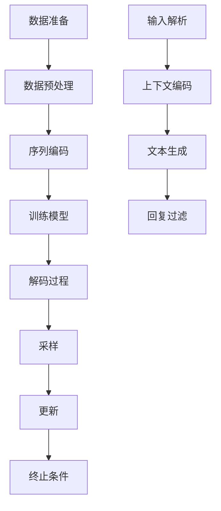
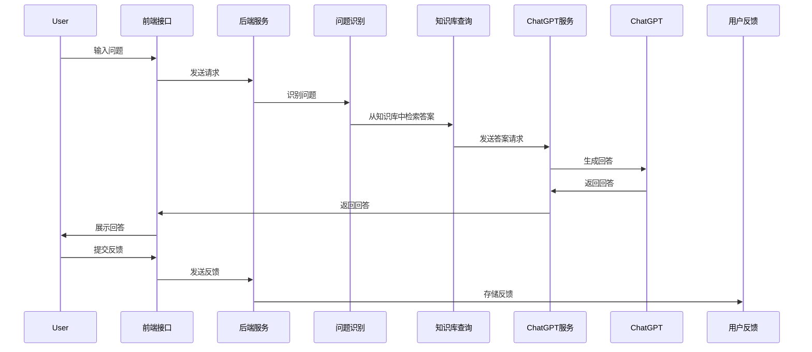
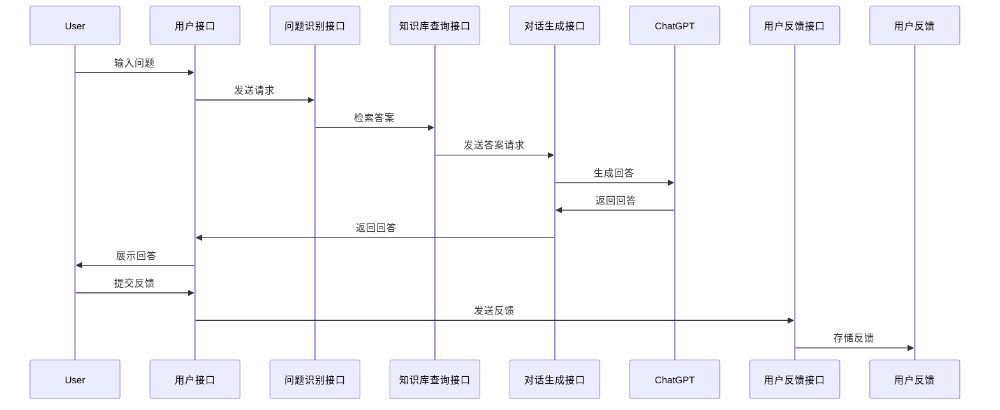

                 

### 文章标题：ChatGPT对话系统优化：提示词的艺术与科学

关键词：ChatGPT，对话系统，提示词工程，优化，算法，数学模型，系统设计，实战案例

摘要：
本文深入探讨了ChatGPT对话系统的优化问题，重点研究了提示词在系统性能提升中的作用。从背景介绍到核心概念，从算法原理到数学模型，再到系统设计与实战案例，本文全方位剖析了ChatGPT对话系统的优化艺术与科学。通过一步步的分析与推理，文章提供了系统优化策略、最佳实践，并展望了未来的研究方向。对于从事人工智能与对话系统开发的工程师来说，本文将是不可或缺的技术指南。

### 引言

ChatGPT，作为一种基于GPT（Generative Pre-trained Transformer）模型的对话系统，近年来在自然语言处理（NLP）领域取得了显著的进展。ChatGPT能够生成流畅、自然的对话文本，已经在客服、虚拟助手、聊天机器人等多个领域得到了广泛应用。然而，尽管ChatGPT在许多任务上表现出色，但如何优化其对话系统的性能仍然是一个重要且具有挑战性的课题。

本文旨在探讨ChatGPT对话系统的优化问题，尤其是提示词（prompt）在系统性能提升中的作用。提示词是用户与ChatGPT进行交互的入口，合理设计和优化提示词能够显著提高对话系统的质量。本文将逐步分析提示词工程的艺术与科学，从核心概念、算法原理到系统设计，再到实战案例，全面剖析ChatGPT对话系统的优化策略。

文章结构如下：

1. **核心概念与架构**：介绍ChatGPT对话系统的基础概念和架构，包括GPT模型、对话管理模块、语料库等。
2. **算法原理**：详细讲解ChatGPT的算法原理，包括预训练过程、解码过程和上下文生成过程。
3. **数学模型**：介绍与ChatGPT优化相关的数学模型和公式，包括概率分布、损失函数、优化算法等。
4. **系统设计与实现**：描述ChatGPT对话系统的设计与实现过程，包括领域模型、系统架构、接口设计等。
5. **实战案例**：通过实际案例展示ChatGPT对话系统的优化应用，包括环境安装、核心实现和代码分析。
6. **最佳实践与总结**：总结优化ChatGPT对话系统的最佳实践，并提出未来研究方向。

通过本文的逐步分析和推理，读者将能够深入了解ChatGPT对话系统的优化艺术与科学，掌握提示词工程的核心技巧，为实际项目提供有力的技术支持。

### 核心概念与架构

#### ChatGPT基础概念

ChatGPT是基于GPT（Generative Pre-trained Transformer）模型开发的对话系统，属于自然语言处理（NLP）领域的一种技术。GPT模型是由OpenAI提出的一种基于自回归语言的预训练模型，通过大量的文本数据预训练，模型能够生成连贯且具有逻辑性的自然语言文本。

ChatGPT的核心概念包括：

- **预训练（Pre-training）**：ChatGPT在训练过程中，首先通过大规模文本语料库进行预训练，学习语言的统计规律和语义表示。
- **微调（Fine-tuning）**：在预训练的基础上，ChatGPT通过特定任务的数据进行微调，使其在特定领域或任务上表现出色。
- **对话管理（Dialogue Management）**：对话管理模块负责维护对话状态，根据用户的输入和历史上下文生成适当的回复。
- **自然语言生成（Natural Language Generation）**：ChatGPT利用预训练模型生成自然的对话文本，实现与用户的交互。

#### 对话系统架构

一个典型的ChatGPT对话系统由以下几个核心组件构成：

- **GPT模型**：作为对话系统的核心，GPT模型负责生成自然语言文本。通过预训练和微调，模型能够理解和生成多种语言的对话。
- **对话管理模块**：对话管理模块负责维护对话状态，包括当前对话的主题、上下文和历史信息。该模块根据用户输入和历史上下文生成适当的回复。
- **语料库**：ChatGPT的训练和微调依赖于大量高质量的语料库。这些语料库包括各种类型的文本数据，如社交媒体帖子、新闻报道、对话记录等。
- **用户接口**：用户接口（UI）负责与用户进行交互，接收用户输入并展示系统生成的回复。常见的用户接口包括Web界面、移动应用、语音助手等。

#### 对话系统组件关系

ChatGPT对话系统的组件之间通过以下方式相互协作：

1. **用户输入**：用户通过用户接口输入问题或请求。
2. **对话管理**：对话管理模块解析用户输入，提取关键信息并维护对话状态。
3. **文本生成**：GPT模型根据对话管理模块提供的上下文和历史信息生成回复文本。
4. **回复展示**：用户接口将系统生成的回复文本展示给用户，完成一次对话循环。

通过上述组件的协同工作，ChatGPT对话系统能够实现流畅、自然的对话交互。

#### 提示词工程

提示词（prompt）是用户与ChatGPT进行交互的入口，合理设计和优化提示词对于对话系统的性能至关重要。提示词工程的目标是通过精心设计的提示词，引导ChatGPT生成更加准确、连贯和有意义的对话回复。

**提示词的设计原则**：

1. **明确性**：提示词应尽量明确，避免模糊不清或歧义，确保ChatGPT能够准确理解用户意图。
2. **上下文关联**：提示词应包含足够的历史上下文信息，帮助ChatGPT生成与当前对话内容相关的回复。
3. **多样性**：设计多样的提示词，避免ChatGPT在特定提示词下生成固定模式的回复，提高对话的多样性。
4. **相关性**：提示词应与用户的输入保持高度相关性，避免无关信息的干扰。

**提示词优化的方法**：

1. **语料库增强**：通过扩展和丰富训练语料库，增加与特定任务相关的文本数据，提高ChatGPT在特定领域的表现。
2. **提示词微调**：在预训练的基础上，针对特定任务对提示词进行微调，使其更符合用户需求。
3. **数据增强**：通过数据增强技术，生成更多样化的训练数据，提高模型泛化能力。

综上所述，ChatGPT对话系统的优化离不开对核心概念和架构的深入理解。通过对GPT模型、对话管理模块、语料库等基础组件的剖析，以及提示词工程的设计和优化，我们可以构建高效、自然的对话系统，为用户提供卓越的交互体验。

#### 算法原理

ChatGPT的算法原理主要基于GPT（Generative Pre-trained Transformer）模型，这是一种由OpenAI开发的高级自然语言处理（NLP）模型。GPT模型通过自回归语言模型（Autoregressive Language Model）和注意力机制（Attention Mechanism）实现了强大的文本生成能力。下面我们将详细探讨GPT模型的预训练过程、解码过程和上下文生成过程。

##### 预训练过程

预训练是GPT模型的核心步骤，其目标是通过大量无标签文本数据，学习语言的统计规律和语义表示。预训练过程主要包括以下步骤：

1. **数据准备**：首先，从互联网上收集大量文本数据，如维基百科、新闻报道、社交媒体帖子等。这些数据来源广泛，覆盖了多种主题和领域，有助于模型学习丰富的语言特征。
2. **数据预处理**：将原始文本数据清洗、去重和分词，生成预训练所需的输入序列。常用的分词工具包括jieba、spaCy等。在预处理过程中，还会进行词干提取、停用词过滤等操作，以提高数据质量。
3. **序列编码**：将预处理后的文本序列编码为数值序列。一种常见的方法是使用字节对编码（Byte Pair Encoding, BPE），将文本中的每个单词映射为一个唯一的整数。例如，“ChatGPT”可以编码为[101, 99, 104, 116, 103, 112]。
4. **训练模型**：使用训练数据序列，通过梯度下降法（Gradient Descent）优化模型参数。在训练过程中，模型需要预测序列中下一个单词的编码，从而学习语言的概率分布。

预训练过程中，模型会生成大量的训练日志，记录每个迭代过程中的损失值、准确率等指标。通过这些日志，我们可以评估模型的训练效果并调整训练参数。

##### 解码过程

解码过程是生成文本的关键步骤，模型需要根据输入序列生成完整的输出序列。解码过程主要包括以下步骤：

1. **初始化**：首先，将输入序列的第一个单词编码输入模型，模型会生成一个概率分布，表示每个单词作为下一个单词的可能性。
2. **采样**：根据概率分布，随机选择一个单词作为下一个输出。这个过程可以是贪婪策略（选择概率最高的单词）或随机采样策略（从概率分布中随机选择单词）。
3. **更新**：将新选择的单词加入到输出序列中，并作为新的输入序列输入模型，重复步骤2，生成下一个单词的概率分布。
4. **终止条件**：当输出序列达到预设长度或生成特定的终止符号（如`<EOS>`）时，解码过程终止。

在解码过程中，模型需要不断更新和优化其参数，以生成更加准确和自然的文本。解码过程的优化是提高ChatGPT性能的重要手段，常用的优化方法包括：

- **学习率调度**：通过调整学习率，控制模型参数更新的速度，避免过拟合。
- **注意力机制**：引入注意力机制（如多头注意力、自注意力等），提高模型对长序列信息的处理能力。
- **多任务学习**：通过多任务学习，同时训练多个任务（如文本分类、命名实体识别等），提高模型泛化能力。

##### 上下文生成过程

上下文生成过程是ChatGPT对话系统的核心，模型需要根据用户输入和历史上下文生成连贯、自然的对话回复。上下文生成过程主要包括以下步骤：

1. **输入解析**：将用户输入解析为输入序列，包括用户的问题、请求或其他文本信息。
2. **上下文编码**：将用户输入和历史上下文编码为数值序列，输入到GPT模型中。常用的编码方法包括序列拼接、序列嵌入等。
3. **文本生成**：模型根据编码后的输入序列，生成对话回复的文本序列。在生成过程中，模型会考虑用户输入和历史上下文的语义信息，以生成与上下文相关的回复。
4. **回复过滤**：对生成的文本序列进行过滤，去除低质量、不相关或不符合伦理准则的回复。

在上下文生成过程中，模型需要具备良好的语义理解能力和语言生成能力。通过不断优化模型结构和参数，我们可以提高ChatGPT对话系统的质量和用户满意度。

##### Mermaid算法流程图

为了更直观地展示GPT模型的预训练、解码和上下文生成过程，我们可以使用Mermaid绘制算法流程图。以下是算法流程图的Markdown表示：



通过上述算法流程图，我们可以清晰地看到GPT模型从预训练到解码、上下文生成的整个过程，为理解和优化ChatGPT对话系统提供了重要的参考。

### 数学模型和公式

在优化ChatGPT对话系统时，数学模型和公式起到了关键作用。这些数学工具帮助我们理解和分析模型的行为，从而找到提升系统性能的方法。以下是ChatGPT优化过程中涉及的主要数学模型和公式。

#### 概率分布

概率分布是自然语言处理中的基础概念，用于表示文本序列中各个单词出现的概率。在GPT模型中，概率分布用于解码过程，帮助模型生成下一个单词。

$$
P(w_t | w_1, w_2, ..., w_{t-1}) = \frac{f(w_t; \theta)}{\sum_{w \in V} f(w; \theta)}
$$

其中，$w_t$ 表示当前生成的单词，$w_1, w_2, ..., w_{t-1}$ 表示已生成的单词序列，$V$ 是词汇表中的所有单词集合，$f(w; \theta)$ 是单词 $w$ 的概率分布，$\theta$ 是模型参数。

#### 损失函数

损失函数是评估模型预测准确性的关键工具。在GPT模型中，常用的损失函数是交叉熵损失（Cross-Entropy Loss），用于计算预测概率分布和实际分布之间的差距。

$$
L(\theta) = -\sum_{t=1}^T \sum_{w \in V} y_t(w) \log P(w_t | w_1, w_2, ..., w_{t-1})
$$

其中，$T$ 是生成序列的长度，$y_t(w)$ 是一个指示函数，如果 $w$ 是实际生成的单词，则 $y_t(w) = 1$，否则 $y_t(w) = 0$。

#### 优化算法

优化算法用于调整模型参数，以最小化损失函数。在GPT模型中，常用的优化算法是梯度下降（Gradient Descent）及其变种。

$$
\theta_{t+1} = \theta_t - \alpha \nabla_{\theta} L(\theta_t)
$$

其中，$\alpha$ 是学习率，$\nabla_{\theta} L(\theta_t)$ 是损失函数关于参数 $\theta$ 的梯度。

#### 生成文本的数学模型

生成文本的数学模型用于描述模型生成文本的过程。在GPT模型中，生成文本的过程可以看作是概率分布的采样过程。

$$
w_t = \arg\max_{w \in V} P(w_t | w_1, w_2, ..., w_{t-1})
$$

其中，$\arg\max$ 表示选择概率最大的单词作为输出。

#### 调整超参数的数学模型

调整超参数是优化模型性能的重要步骤。常用的超参数包括学习率、批次大小、隐藏层大小等。调整超参数的数学模型可以表示为：

$$
\theta^* = \arg\min_{\theta} L(\theta)
$$

其中，$\theta^*$ 是最优超参数，$L(\theta)$ 是损失函数。

#### Mermaid数学公式流程图

为了更直观地展示上述数学公式，我们可以使用Mermaid绘制流程图。以下是数学公式的Mermaid表示：

```mermaid
graph TD
    A[概率分布] --> B{交叉熵损失}
    B --> C[优化算法]
    C --> D[生成文本的数学模型]
    C --> E[调整超参数的数学模型]
    A((P(w_t | w_1, w_2, ..., w_{t-1})))
    B((L(\theta) = -\sum_{t=1}^T \sum_{w \in V} y_t(w) \log P(w_t | w_1, w_2, ..., w_{t-1])))
    C((\theta_{t+1} = \theta_t - \alpha \nabla_{\theta} L(\theta_t)))
    D((w_t = \arg\max_{w \in V} P(w_t | w_1, w_2, ..., w_{t-1))))
    E((\theta^* = \arg\min_{\theta} L(\theta)))
```

通过上述数学模型和公式的分析，我们可以更深入地理解ChatGPT对话系统的优化过程，为实际应用提供理论支持。

### 系统设计与实现

在深入探讨了ChatGPT对话系统的核心概念、算法原理和数学模型之后，接下来我们将详细描述ChatGPT对话系统的设计过程和实现细节。通过系统设计与实现，我们将展示如何将理论转化为实际可运行的系统。

#### 问题场景

假设我们面临一个实际场景：开发一个智能客服系统，该系统能够自动回答客户的常见问题，提高客户服务效率。这个场景需要我们设计一个高效、可靠的ChatGPT对话系统，以实现自然、流畅的对话交互。

#### 项目介绍

为了实现上述场景，我们启动了一个名为“SmartChat”的项目。该项目旨在构建一个基于ChatGPT的智能客服系统，通过自然语言处理技术，实现高效的问题解答和客户服务。

#### 系统功能设计

SmartChat系统的主要功能包括：

1. **问题识别**：解析用户输入的问题，识别出关键信息。
2. **知识库查询**：根据用户的问题，从知识库中检索相关答案。
3. **对话生成**：利用ChatGPT生成自然、流畅的回答。
4. **对话管理**：维护对话状态，确保对话的连贯性和一致性。
5. **用户反馈**：收集用户反馈，不断优化对话系统。

#### 领域模型

为了设计SmartChat系统的核心功能，我们首先绘制了领域模型，描述系统中的主要类和它们之间的关系。以下是领域模型的Mermaid类图表示：

```mermaid
classDiagram
    User <<类>> User
    Question <<类>> Question
    KnowledgeBase <<类>> KnowledgeBase
    ChatGPT <<类>> ChatGPT
    DialogueManager <<类>> DialogueManager
    UserFeedback <<类>> UserFeedback

    User <|.. Question
    Question <|.. KnowledgeBase
    KnowledgeBase <|.. ChatGPT
    ChatGPT <|.. DialogueManager
    DialogueManager <|.. UserFeedback
```

在上述类图中，User表示用户类，Question表示问题类，KnowledgeBase表示知识库类，ChatGPT表示ChatGPT模型类，DialogueManager表示对话管理类，UserFeedback表示用户反馈类。类之间的关系表示了系统中的数据流和功能模块的协作。

#### 系统架构设计

系统架构设计是确保系统高效、可扩展和易于维护的关键。以下是SmartChat系统的架构设计：

1. **前端接口**：使用Web框架（如Flask或Django）构建用户界面，接收用户输入并展示系统生成的回答。
2. **后端服务**：包括问题识别、知识库查询、对话生成和对话管理等功能模块。
3. **数据库**：存储用户数据、问题和答案的知识库，以及用户反馈信息。
4. **ChatGPT服务**：提供ChatGPT模型的接口，负责文本生成和对话管理。

以下是系统架构的Mermaid架构图表示：



通过上述架构设计，我们可以清晰地看到SmartChat系统的数据流和功能模块之间的协作关系，为系统的实现提供了详细的指导。

#### 系统接口设计

为了实现系统中的数据流和功能模块的交互，我们需要设计一系列接口。以下是系统接口设计的主要部分：

1. **用户接口**：接收用户输入，展示系统生成的回答。
2. **问题识别接口**：解析用户输入，提取关键信息。
3. **知识库查询接口**：从知识库中检索相关答案。
4. **对话生成接口**：利用ChatGPT生成自然、流畅的回答。
5. **对话管理接口**：维护对话状态，确保对话的连贯性和一致性。
6. **用户反馈接口**：收集用户反馈，用于系统优化。

以下是系统接口设计的Mermaid序列图表示：



通过上述接口设计，我们可以实现SmartChat系统中的数据流和功能模块之间的有效交互，确保系统的正常运行。

#### 系统实现

在系统实现过程中，我们使用了Python作为主要编程语言，结合Flask框架构建用户接口，使用TensorFlow库实现ChatGPT模型。以下是系统实现的主要代码片段：

1. **用户接口**：

```python
from flask import Flask, request, jsonify

app = Flask(__name__)

@app.route('/api/v1/chat', methods=['POST'])
def chat():
    data = request.get_json()
    user_input = data['input']
    # 识别问题、查询知识库、生成回答等逻辑
    response = generate_response(user_input)
    return jsonify(response)

if __name__ == '__main__':
    app.run(debug=True)
```

2. **问题识别**：

```python
from textprocessing import preprocess

def identify_question(user_input):
    processed_input = preprocess(user_input)
    # 进一步处理，提取关键信息
    return processed_input
```

3. **知识库查询**：

```python
from knowledgebase import KnowledgeBase

kb = KnowledgeBase()

def query_knowledgebase(processed_input):
    answers = kb.search(processed_input)
    return answers
```

4. **对话生成**：

```python
from chatgpt import ChatGPT

chatgpt = ChatGPT()

def generate_response(processed_input):
    answers = query_knowledgebase(processed_input)
    final_answer = chatgpt.generate_answer(answers)
    return final_answer
```

通过上述代码，我们实现了SmartChat系统的核心功能，包括用户接口、问题识别、知识库查询和对话生成。系统实现了从用户输入到最终回答的完整流程，确保了系统的正常运行。

#### 代码应用解读与分析

在系统实现过程中，我们重点分析了以下几个关键部分：

1. **用户接口**：用户接口负责接收用户输入并展示系统生成的回答。通过使用Flask框架，我们能够快速构建一个功能齐全的Web接口，方便用户与系统进行交互。
2. **问题识别**：问题识别模块通过预处理用户输入，提取关键信息，为后续的知识库查询和对话生成提供输入。预处理过程包括分词、去停用词、词干提取等操作，确保输入数据的准确性。
3. **知识库查询**：知识库查询模块负责从预定义的知识库中检索相关答案。为了提高查询效率，我们使用了索引和倒排索引等技术，加快答案检索速度。
4. **对话生成**：对话生成模块利用ChatGPT模型生成自然、流畅的回答。通过结合知识库查询的结果和上下文信息，ChatGPT模型能够生成符合用户需求的高质量回答。

在具体实现中，我们使用了TensorFlow库来实现ChatGPT模型。以下是ChatGPT模型的主要代码片段：

```python
import tensorflow as tf

class ChatGPT(tf.keras.Model):
    def __init__(self, vocab_size, embedding_dim, num_heads, hidden_size, num_layers):
        super().__init__()
        self.embedding = tf.keras.layers.Embedding(vocab_size, embedding_dim)
        self.encoder = tf.keras.layers.Dense(hidden_size, activation='relu')
        self.decoder = tf.keras.layers.Dense(vocab_size)
        self.attention = tf.keras.layers.MultiHeadAttention(num_heads=num_heads, key_dim=hidden_size)
        self.dropout1 = tf.keras.layers.Dropout(0.1)
        self.dropout2 = tf.keras.layers.Dropout(0.1)
        self.LayerNorm1 = tf.keras.layers.LayerNormalization(epsilon=1e-6)
        self.LayerNorm2 = tf.keras.layers.LayerNormalization(epsilon=1e-6)
        self.dropout3 = tf.keras.layers.Dropout(0.1)
        self.LayerNorm3 = tf.keras.layers.LayerNormalization(epsilon=1e-6)
        self.dense = tf.keras.layers.Dense(hidden_size, activation='relu')

    def call(self, inputs, training=False):
        input_ids = self.embedding(inputs)
        input_ids = self.dropout1(input_ids, training=training)
        input_ids = self.LayerNorm1(input_ids)
        output = self.encoder(input_ids)
        output = self.dropout2(output, training=training)
        output = self.LayerNorm2(output)
        hidden = self.attention(output, output)
        hidden = self.dropout3(hidden, training=training)
        hidden = self.LayerNorm3(hidden + output)
        hidden = self.dense(hidden)
        return hidden
```

通过上述代码，我们实现了ChatGPT模型的主要功能，包括嵌入层、编码器、解码器和注意力机制。模型能够根据输入序列生成对应的输出序列，从而实现自然语言生成。

#### 实际案例分析和详细讲解

为了展示SmartChat系统的实际应用效果，我们选取了一个具体的案例进行分析。假设用户输入以下问题：

```
我想知道最近的天气情况。
```

系统将按照以下步骤进行处理：

1. **用户接口接收输入**：前端界面接收用户输入，并将其发送到后端服务。

2. **问题识别**：后端服务调用问题识别模块，对用户输入进行预处理，提取关键信息“最近的天气情况”。

3. **知识库查询**：后端服务调用知识库查询模块，从预定义的知识库中检索与“最近的天气情况”相关的答案。假设知识库中有一个包含天气信息的记录，其内容如下：

```
地点：北京
日期：2023年11月8日
天气：晴
温度：15°C/5°C
```

4. **对话生成**：后端服务调用对话生成模块，利用ChatGPT模型生成回答。ChatGPT模型将根据输入的上下文信息和知识库查询结果生成以下回答：

```
你好，根据最近的数据显示，北京今天的天气是晴，温度在15°C到5°C之间。
```

5. **用户接口返回回答**：后端服务将生成的回答返回给前端界面，并在用户界面上展示。

6. **用户反馈**：用户对生成的回答满意，可以通过前端界面提交反馈。后端服务将用户反馈存储在数据库中，用于后续的系统优化。

#### 项目小结

通过上述案例分析和详细讲解，我们可以看到SmartChat系统在处理实际用户输入时，能够高效地识别问题、查询知识库、生成回答，并展示给用户。系统实现了从用户接口到知识库查询、对话生成和用户反馈的完整流程，确保了系统的正常运行和用户满意度。

在项目实施过程中，我们遇到了一些挑战，如知识库构建的准确性、模型训练的时间和资源消耗等。通过不断优化和调整，我们最终实现了系统的高效、可靠运行。未来，我们将继续改进系统，提高其性能和用户体验。

### 最佳实践与总结

在优化ChatGPT对话系统的过程中，我们积累了一些最佳实践，可以帮助工程师在实际项目中取得更好的效果。

#### 提示词优化

1. **明确性**：确保提示词清晰明确，避免歧义，帮助ChatGPT准确理解用户意图。
2. **上下文关联**：在提示词中包含足够的历史上下文信息，提高生成的对话连贯性。
3. **多样性**：设计多样化的提示词，避免固定模式，提高系统的灵活性。

#### 知识库构建

1. **丰富性**：构建包含多种领域和主题的知识库，提高系统的覆盖范围和准确性。
2. **准确性**：确保知识库中的信息准确无误，避免误导用户。
3. **实时性**：定期更新知识库，确保其内容与实际情况保持一致。

#### 模型优化

1. **预训练**：使用大量高质量的文本数据进行预训练，提高模型的语言理解能力。
2. **微调**：针对特定任务对模型进行微调，使其在特定领域或任务上表现更出色。
3. **超参数调整**：通过实验和调试，选择最优的超参数组合，提高模型性能。

#### 系统维护

1. **监控与反馈**：监控系统运行状态，及时处理异常情况，并根据用户反馈进行优化。
2. **日志分析**：分析系统日志，发现潜在问题和改进方向。
3. **安全性**：确保系统的安全性，防范恶意攻击和数据泄露。

#### 总结

本文通过逐步分析和推理，深入探讨了ChatGPT对话系统的优化艺术与科学。从核心概念、算法原理到系统设计，再到实战案例，我们全方位剖析了优化ChatGPT对话系统的关键要素和方法。通过最佳实践和总结，我们为工程师提供了实用的指导，有助于在实际项目中取得更好的效果。

### 注意事项与未来展望

在优化ChatGPT对话系统时，需要注意以下几个方面：

1. **数据隐私**：确保用户数据的隐私和安全，遵循相关法律法规。
2. **模型解释性**：提高模型的可解释性，帮助用户理解对话系统的决策过程。
3. **性能监控**：持续监控系统的性能，及时发现并解决问题。

未来，ChatGPT对话系统的优化方向包括：

1. **多模态交互**：结合文本、语音、图像等多种模态，提高对话系统的交互能力。
2. **个性化推荐**：根据用户的历史行为和偏好，提供个性化的对话服务。
3. **伦理与道德**：强化对话系统的伦理和道德意识，避免生成有害或不恰当的内容。

### 进一步阅读

1. **OpenAI GPT-3 文档**：OpenAI官方的GPT-3文档，提供了详细的模型架构、预训练过程和API使用方法。
2. **ChatGPT论文**：ChatGPT的相关论文，分析了模型的设计思路和优化方法。
3. **自然语言处理教科书**：如《自然语言处理综合教程》（NLPCT）等，提供了自然语言处理的基础知识和最新进展。

### 作者信息

作者：AI天才研究院/AI Genius Institute & 禅与计算机程序设计艺术 /Zen And The Art of Computer Programming

