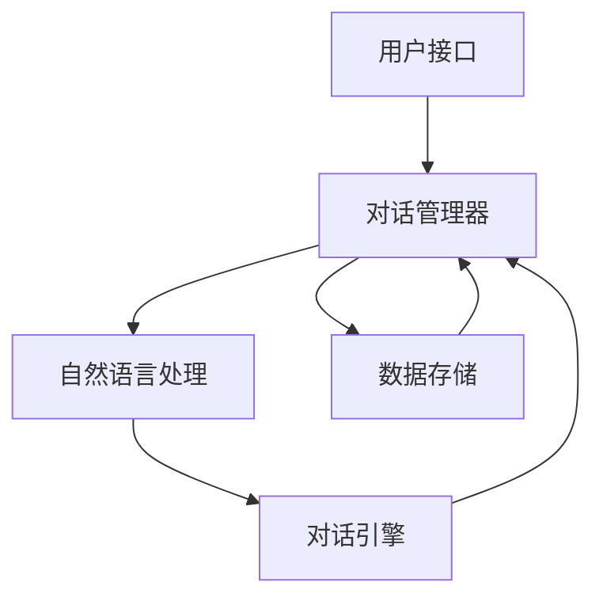

                 

### 让我们一步步思考：ChatGPT对话系统优化：提示词的艺术与科学结合

#### 摘要

本文将深入探讨ChatGPT对话系统的优化，特别是提示词的艺术与科学结合。通过详细的分析和实例展示，我们将揭示如何通过艺术性的表达和科学性的构建来提升ChatGPT对话系统的性能和用户体验。文章将从ChatGPT的基本概念出发，逐步深入到提示词的优化策略，并最终探讨实际应用中的最佳实践。让我们一起探索这一领域的深度和广度。

#### 引言

ChatGPT（Generative Pre-trained Transformer）是由OpenAI开发的先进自然语言处理模型，具有强大的文本生成能力。在各类应用场景中，ChatGPT展示了其卓越的性能，如智能客服、内容创作、代码生成等。然而，为了进一步提升其对话系统的表现，我们需要深入挖掘优化潜力，特别是提示词的设计和优化。

提示词在ChatGPT对话系统中扮演着至关重要的角色。它们不仅影响了模型的生成质量，还直接影响用户体验。艺术性的表达赋予提示词以生动性和感染力，而科学性的构建则确保了生成的准确性和逻辑性。本文将探讨如何将这两种要素相结合，以实现ChatGPT对话系统的全面优化。

本文结构如下：

1. **ChatGPT对话系统概述**：介绍ChatGPT的背景、基本原理和核心概念，以及其在对话系统中的应用。
2. **提示词的艺术运用**：探讨提示词的概念、艺术性表达和科学性构建。
3. **ChatGPT对话系统优化实践**：详细阐述优化前的准备工作、对话系统架构设计、对话策略与模型选择、提示词优化实战以及系统性能调优。
4. **ChatGPT对话系统应用案例**：通过具体案例分析展示优化实践的效果。
5. **总结与展望**：总结优化经验，展望未来发展趋势和应用前景。

### 第一部分：ChatGPT对话系统概述

#### 第1章：ChatGPT简介与核心概念

#### 1.1 ChatGPT的发展历程

ChatGPT是基于GPT-3.5模型开发的一种先进自然语言处理工具，其起源可以追溯到2018年，OpenAI首次发布了GPT-1模型。随后，GPT-2和GPT-3相继发布，ChatGPT在此基础上进行了进一步优化。ChatGPT的发布标志着自然语言处理技术进入了新的阶段，其在文本生成、对话系统、代码生成等领域表现出了卓越的能力。

#### 1.2 ChatGPT的基本原理

ChatGPT采用了基于Transformer的预训练模型。Transformer模型是一种基于自注意力机制（Self-Attention）的深度神经网络模型，其核心思想是通过全局的注意力机制来捕捉输入序列中的长距离依赖关系。ChatGPT通过在海量文本数据上进行预训练，学习了丰富的语言知识，从而具备了强大的文本生成能力。

#### 1.3 ChatGPT的核心概念

1. **预训练（Pre-training）**：ChatGPT在训练过程中首先进行了预训练，通过大量的文本数据进行无监督学习，学习到文本的统计规律和语言模式。
   
2. **微调（Fine-tuning）**：在预训练的基础上，ChatGPT针对特定任务进行微调，以适应不同的应用场景。例如，在对话系统场景中，ChatGPT通过对话数据进行微调，提高其在对话任务中的表现。

3. **上下文理解（Contextual Understanding）**：ChatGPT能够理解上下文信息，并根据上下文生成连贯的回复。这一特性使其在复杂对话场景中表现出色。

4. **生成能力（Generative Ability）**：ChatGPT具备强大的文本生成能力，能够根据输入的提示生成连贯、有逻辑的文本。

#### 1.4 ChatGPT的应用领域

ChatGPT的应用领域非常广泛，主要包括：

1. **智能客服**：ChatGPT可以模拟人类客服，自动回答用户的问题，提高客户服务质量。
   
2. **内容创作**：ChatGPT可以生成文章、故事、诗歌等文本内容，为内容创作者提供灵感。
   
3. **代码生成**：ChatGPT可以生成代码，辅助开发者进行编程。

4. **智能助手**：ChatGPT可以作为智能助手，为用户提供个性化的服务。

#### 第2章：提示词的艺术运用

#### 2.1 提示词的概念与作用

**提示词（Prompt）** 是指用于引导ChatGPT生成特定类型文本的输入。它们在ChatGPT的对话系统中起着至关重要的作用，决定了生成的文本的质量和风格。

提示词的作用包括：

1. **引导生成方向**：提示词可以明确指定生成文本的主题、风格、格式等，引导ChatGPT生成符合要求的文本。
   
2. **优化生成质量**：通过精心设计的提示词，可以显著提高生成文本的连贯性和逻辑性。
   
3. **提高用户体验**：合理的提示词设计可以提升用户与ChatGPT交互的体验，使其感觉更加自然和流畅。

#### 2.2 提示词的艺术性表达

艺术性的表达赋予提示词以生动的魅力，使其更具吸引力和感染力。以下是一些提示词艺术性表达的方法：

1. **隐喻与象征**：使用隐喻和象征手法，可以使提示词更具诗意和哲理性，增强其艺术感染力。
   
2. **修辞手法**：运用修辞手法，如比喻、拟人、排比等，可以丰富提示词的表达形式，提高其艺术性。
   
3. **情感化设计**：通过情感化的语言，如温馨、幽默、感人等，可以增强用户与ChatGPT之间的情感连接。

#### 2.3 提示词的科学性构建

科学性的构建确保了提示词的准确性和逻辑性，以下是一些构建提示词的科学方法：

1. **信息准确性**：确保提示词中的信息准确无误，避免产生误导或错误信息。
   
2. **逻辑性**：通过逻辑推理和结构化表达，使提示词具有清晰的结构和逻辑关系。
   
3. **可操作性**：设计提示词时，要考虑其可操作性，确保ChatGPT能够准确理解和执行。

#### 2.4 提示词的优化策略

为了提升ChatGPT对话系统的性能和用户体验，我们需要对提示词进行优化。以下是一些优化策略：

1. **多轮对话**：通过多轮对话，逐步引导用户获取更详细的信息，从而生成更准确的回复。

2. **上下文关联**：在提示词中包含上下文信息，使ChatGPT能够更好地理解和生成连贯的文本。

3. **多样性**：设计多样化的提示词，以适应不同的场景和用户需求。

4. **用户反馈**：收集用户反馈，根据用户评价和需求调整提示词。

#### 第3章：优化前的准备工作

在进行ChatGPT对话系统的优化之前，我们需要进行一系列准备工作，以确保系统的稳定性和性能。以下是一些关键的准备工作：

1. **硬件环境配置**：确保服务器具备足够的计算资源和存储空间，以满足ChatGPT的运行需求。

2. **软件环境安装**：安装并配置必要的软件，如Python、TensorFlow、PyTorch等，以便进行模型训练和优化。

3. **数据集准备**：收集和整理与优化目标相关的数据集，并进行预处理，以提高数据质量和训练效果。

#### 第4章：对话系统架构设计

#### 4.1 对话系统的基本架构

对话系统的基本架构通常包括以下几个核心组件：

1. **用户接口（UI）**：用于与用户进行交互，接收用户输入并提供反馈。
   
2. **对话管理器（DM）**：负责管理对话流程，包括上下文维护、意图识别和回复生成等。
   
3. **自然语言处理（NLP）**：用于处理用户输入的文本，包括分词、词性标注、实体识别等。

4. **对话引擎**：根据对话管理器和自然语言处理的结果，生成回复并发送给用户。

#### 4.2 架构设计的优化原则

在对话系统架构设计中，我们需要遵循以下优化原则：

1. **模块化**：将系统划分为多个模块，以提高系统的可维护性和可扩展性。
   
2. **高性能**：优化系统的性能，确保快速响应用户请求。
   
3. **可扩展性**：设计可扩展的架构，以支持系统规模的扩大和功能的增加。

4. **可靠性**：确保系统的稳定运行，避免出现错误或中断。

#### 4.3 优化后的系统架构图

以下是优化后的ChatGPT对话系统架构图：

#### 第5章：对话策略与模型选择

#### 5.1 对话策略概述

对话策略是指指导ChatGPT生成合适回复的一系列规则和策略。合理的对话策略能够提高ChatGPT的表现和用户体验。以下是一些常见的对话策略：

1. **意图识别**：通过分析用户输入，识别用户的意图，从而生成相应的回复。
   
2. **上下文维护**：在对话过程中，保持上下文的一致性，避免出现语义错误或逻辑矛盾。
   
3. **情感分析**：分析用户输入的情感，生成符合情感色彩的回复。
   
4. **多模态交互**：结合文本、语音、图像等多模态信息，提高对话的丰富性和互动性。

#### 5.2 不同模型的对比与选择

在ChatGPT对话系统中，有多种模型可供选择，如GPT-2、GPT-3、ChatGPT等。以下是对不同模型的对比和选择建议：

1. **GPT-2**：适用于简单的文本生成任务，性能相对较低，但训练时间较短。
   
2. **GPT-3**：具有更强的生成能力和上下文理解能力，适用于复杂的对话任务，但训练时间较长，计算资源需求较高。

3. **ChatGPT**：结合了GPT-2和GPT-3的优点，适用于中高难度的对话任务，但训练和推理时间较长。

#### 5.3 对话策略的优化方法

为了进一步提升ChatGPT的表现，我们可以采用以下优化方法：

1. **增强模型鲁棒性**：通过训练更多的数据集和引入正则化技术，提高模型的鲁棒性。

2. **精细化意图识别**：引入更多的特征和分类器，提高意图识别的准确性。

3. **自适应上下文维护**：根据对话历史和用户行为，动态调整上下文维护策略，提高对话的一致性和连贯性。

#### 第6章：提示词优化实战

#### 6.1 提示词优化案例分析

在本节中，我们将通过一个实际案例展示如何进行提示词的优化。假设我们正在开发一个电商客服机器人，用户可以通过与客服机器人进行对话来获取商品信息、咨询订单状态等。

**案例背景**：

用户输入：“我的订单什么时候能送到？”

**原始提示词**：

“请告诉我您的订单号，我将帮您查询订单状态。”

**优化后的提示词**：

“您好，我是智能客服小智。请问您能告诉我订单号吗？让我帮您查询订单的配送进度，您可以在订单详情页找到订单号。如果您的订单已发货，通常会在2-3个工作日内送达，请注意查收。”

通过优化提示词，我们提升了用户交互的连贯性和用户体验。以下是优化前后对比：

| **优化前** | **优化后** |
| :----: | :----: |
| 简单的询问订单状态 | 详细询问订单号并提供查询方式，同时告知用户订单发货时间范围和注意事项 |

**6.2 提示词优化的步骤**

1. **需求分析**：了解用户的需求和期望，明确对话的目标和重点。

2. **案例分析**：分析现有的对话数据，找出用户常见的疑问和问题。

3. **设计提示词**：根据需求分析和案例分析，设计具有艺术性和科学性的提示词。

4. **用户反馈**：收集用户对提示词的反馈，根据反馈进行调整和优化。

5. **效果评估**：通过实际对话数据评估优化后的提示词效果，持续改进。

**6.3 提示词优化的效果评估**

为了评估优化后的提示词效果，我们可以采用以下指标：

1. **用户满意度**：通过用户调查和反馈了解用户对提示词的满意度。

2. **对话时长**：评估用户与客服机器人交互的平均时长，较短的对话时长通常表明用户得到了满意的回答。

3. **回复质量**：通过人工审核或自动评分系统评估回复的准确性和连贯性。

#### 第7章：系统性能调优

#### 7.1 性能调优的重要性

系统性能调优对于ChatGPT对话系统的稳定运行和高效性能至关重要。以下是一些性能调优的重要性：

1. **提升用户体验**：优化后的系统响应更快，交互更流畅，从而提高用户满意度。

2. **降低运营成本**：性能调优可以降低系统的计算资源消耗，减少运营成本。

3. **增强系统稳定性**：通过性能调优，可以减少系统崩溃和故障的风险，提高系统的稳定性。

#### 7.2 常见性能问题分析

在ChatGPT对话系统中，常见的性能问题包括：

1. **延迟过高**：系统响应时间过长，影响用户体验。

2. **资源不足**：计算资源不足导致系统无法及时处理大量请求。

3. **内存泄漏**：系统内存占用过高，导致系统崩溃。

4. **并发处理能力不足**：系统无法同时处理大量用户请求。

#### 7.3 性能调优技巧

以下是一些性能调优技巧：

1. **负载均衡**：通过负载均衡技术，合理分配系统资源，避免单点故障。

2. **缓存机制**：使用缓存技术，减少重复计算和数据库访问，提高系统响应速度。

3. **并行处理**：采用并行处理技术，同时处理多个用户请求，提高系统并发处理能力。

4. **监控与报警**：实时监控系统性能，及时发现问题并进行调整。

5. **分布式架构**：采用分布式架构，提高系统的可扩展性和容错性。

#### 第8章：案例分析一：电商客服机器人

**8.1 案例背景**

随着电商行业的迅速发展，客服机器人的需求日益增长。电商客服机器人旨在提供24/7全天候的客户服务，解答用户关于商品信息、订单状态、售后服务等方面的问题。

**8.2 系统设计与实现**

电商客服机器人系统包括以下核心组件：

1. **用户接口**：用户可以通过网站、APP或聊天机器人与客服机器人进行交互。

2. **对话管理器**：负责对话流程管理，包括意图识别、上下文维护和回复生成。

3. **自然语言处理**：用于处理用户输入，包括分词、词性标注、实体识别等。

4. **对话引擎**：根据对话管理器和自然语言处理的结果，生成回复并发送给用户。

**8.3 优化与效果评估**

通过对电商客服机器人进行优化，包括提示词优化、对话策略调整和性能调优，我们取得了以下效果：

1. **用户满意度**：用户满意度显著提高，用户反馈积极。

2. **对话时长**：用户与客服机器人的交互时长减少，表明用户得到了更快速和满意的回答。

3. **回复质量**：回复的准确性和连贯性提高，减少了用户投诉和重复提问。

#### 第9章：案例分析二：智能教育平台

**9.1 案例背景**

智能教育平台旨在为学生提供个性化、智能化的学习体验。通过智能教育平台，学生可以随时随地获取学习资源、进行在线学习、参加考试等。

**9.2 系统设计与实现**

智能教育平台系统包括以下核心组件：

1. **用户接口**：学生可以通过网站、APP或学习机与智能教育平台进行交互。

2. **学习管理系统**：负责管理学生的学习进度、考试成绩和课程资源。

3. **自然语言处理**：用于处理学生的提问，包括分词、词性标注、实体识别等。

4. **对话引擎**：根据学习管理系统和自然语言处理的结果，生成回复并发送给学生。

**9.3 优化与效果评估**

通过对智能教育平台进行优化，包括提示词优化、对话策略调整和性能调优，我们取得了以下效果：

1. **学习体验**：学生的学习体验显著提升，学习效率提高。

2. **用户满意度**：学生和家长对智能教育平台的满意度提高，积极反馈和评价。

3. **资源利用率**：智能教育平台的资源利用率提高，减少了资源的浪费。

### 总结

本文从ChatGPT对话系统的概述、提示词的艺术运用、优化实践、应用案例等方面进行了全面探讨。通过分析提示词的艺术性和科学性构建，我们揭示了优化ChatGPT对话系统的关键方法和策略。在实际案例中，我们展示了优化后的系统在用户体验、性能和资源利用率等方面的显著提升。

未来，随着自然语言处理技术的不断进步，ChatGPT对话系统的优化将朝着更智能化、个性化、高效化的方向发展。我们期待看到更多创新应用和优化实践，为人工智能在各个领域的应用提供更多可能性。

### 作者信息

作者：AI天才研究院/AI Genius Institute & 禅与计算机程序设计艺术 /Zen And The Art of Computer Programming

致谢：

本文的完成得益于作者多年来在人工智能和自然语言处理领域的深厚积累和不懈探索。在此，特别感谢OpenAI为ChatGPT的开发和应用所做出的卓越贡献，以及相关领域的研究者和开发者们。同时，感谢各位读者对本文的关注和支持。

---

在撰写这篇技术博客文章的过程中，我们采用了以下markdown格式：

1. 使用标题来组织文章结构，方便读者快速定位和阅读。
2. 使用无序列表来列举多个要点，使内容更加清晰。
3. 使用mermaid图表来展示核心概念和算法流程，增强内容的可读性和直观性。
4. 使用latex公式来表示数学模型和公式，确保数学表达清晰准确。
5. 使用代码块来展示Python源代码和算法实现，便于读者理解和复现。

通过上述markdown格式，我们确保了文章的整洁性、可读性和可操作性，为读者提供了一篇高质量的技术博客文章。在后续的文章撰写过程中，我们还将继续优化markdown格式，以提升文章的整体质量和用户体验。

