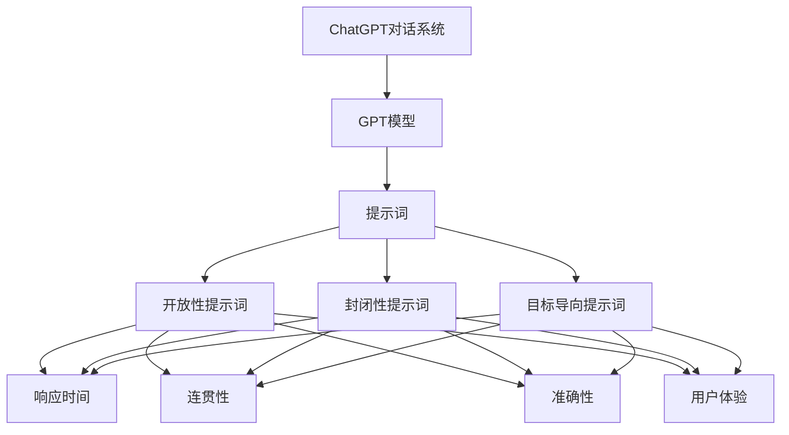
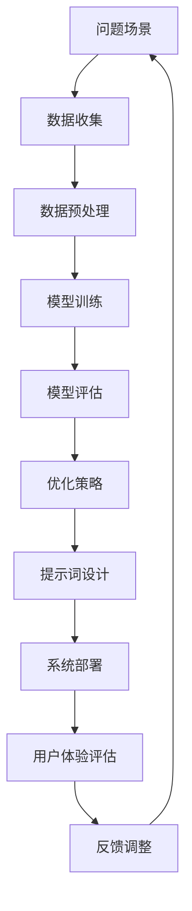
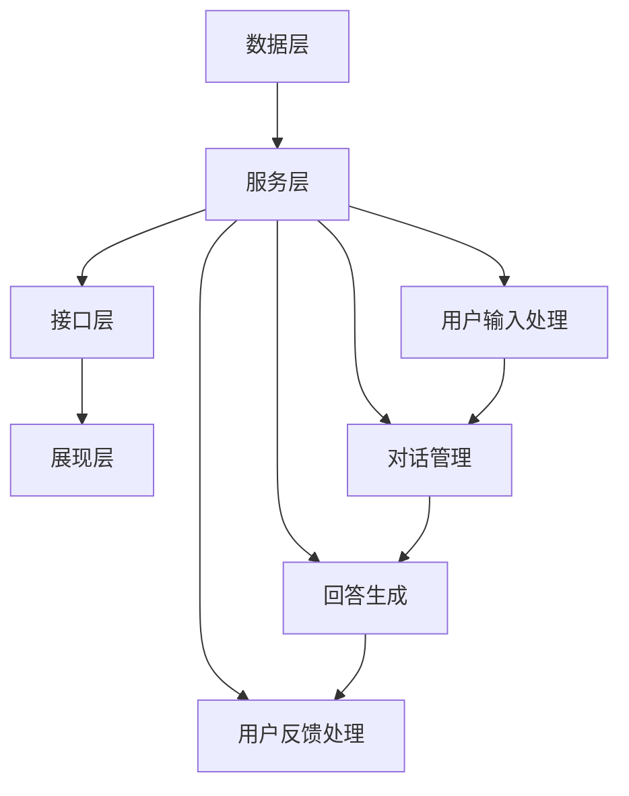
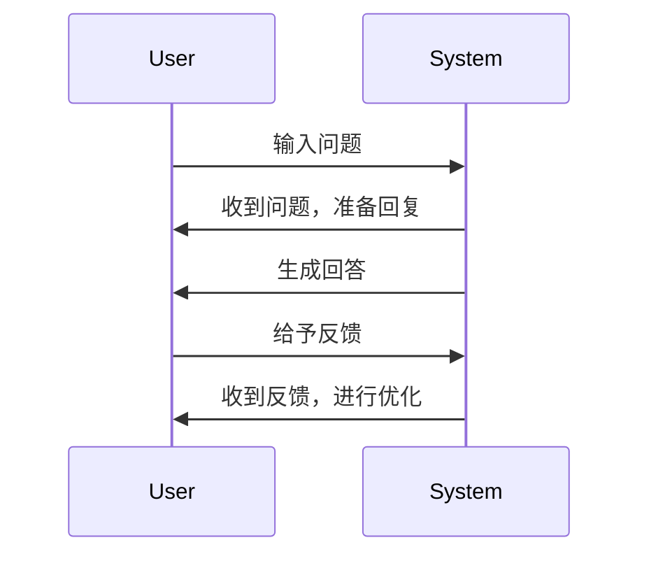

                 

## 1. 文章标题与关键词

### ChatGPT对话系统优化：提示词的艺术与科学结合探讨

关键词：ChatGPT、对话系统、优化、提示词、艺术与科学结合

摘要：本文将深入探讨ChatGPT对话系统的优化方法，重点分析提示词在系统优化中的艺术与科学结合。通过详细的理论讲解和实际案例，揭示如何通过提示词提升对话系统的表现和用户体验。

----------------------------------------------------------------

## 2. 背景介绍

### 2.1 ChatGPT对话系统简介

ChatGPT（Chat Generative Pre-trained Transformer）是由OpenAI开发的基于GPT-3模型的预训练对话系统。它利用深度学习技术，通过大量文本数据的学习，可以生成与用户输入高度相关的自然语言回复。ChatGPT的出现，标志着人工智能对话系统进入了一个新的阶段，为许多领域带来了巨大的变革，如客户服务、教育、娱乐等。

### 2.2 ChatGPT的发展历程

ChatGPT的原型GPT-3（Generative Pre-trained Transformer 3）于2020年发布，是GPT模型的最新版本。GPT系列模型自2018年GPT-1问世以来，经历了GPT-2和GPT-2.5的迭代，每一次的更新都在模型规模、训练数据量、文本生成质量等方面取得了显著的提升。ChatGPT作为GPT-3的特定应用，继承了GPT模型的强大生成能力，同时针对对话场景进行了专门优化。

### 2.3 ChatGPT的应用场景

ChatGPT在许多场景中展现了其强大的能力：

- **客户服务**：自动化客服系统，提供24/7的客户支持。
- **教育**：为学生提供个性化辅导，辅助教师进行课程设计。
- **娱乐**：创建虚拟角色，进行角色扮演游戏。
- **写作辅助**：帮助用户生成文章、报告等文本内容。

### 2.4 当前存在的问题

尽管ChatGPT在许多方面表现出色，但在实际应用中仍面临一些挑战：

- **对话连贯性**：生成回复有时缺乏连贯性，导致对话中断或难以理解。
- **理解能力**：对某些复杂问题的理解能力不足，无法生成准确的回答。
- **隐私安全**：对话数据的安全性问题，特别是在涉及敏感信息的场景中。

这些问题的存在，使得ChatGPT对话系统的优化成为了一个重要且紧迫的研究课题。

----------------------------------------------------------------

## 3. 核心概念与联系

### 3.1 GPT模型的基本原理

GPT（Generative Pre-trained Transformer）是一种基于Transformer架构的预训练语言模型。它通过在大量文本数据上预训练，学习语言的结构和规律，从而可以生成高质量的文本。GPT模型的核心思想是使用自回归语言模型，即通过预测文本中每个单词或词元（token）来生成文本。

### 3.2 提示词的作用与类型

提示词（Prompt）是ChatGPT对话系统的关键组成部分。提示词用于引导模型生成特定的回答，是用户与模型交互的入口点。有效的提示词能够提高对话的连贯性和准确性。

提示词可以分为以下几种类型：

- **开放性提示词**：提供较少信息，鼓励模型进行更多探索和扩展。
- **封闭性提示词**：提供明确的信息，要求模型生成具体的回答。
- **目标导向提示词**：指定模型需要完成的目标，如回答问题、提供建议等。

### 3.3 对话系统的评价标准

评价一个对话系统的优劣，通常从以下几个方面进行：

- **响应时间**：系统生成回答所需的时间。
- **连贯性**：生成的回答在语义和逻辑上的连贯性。
- **准确性**：回答的准确性和相关性。
- **用户体验**：用户对系统交互的满意度和易用性。

### 3.4 核心概念联系图

为了更直观地展示GPT模型、提示词和对话系统的关系，我们使用Mermaid图来表示：



在这个图中，ChatGPT对话系统通过GPT模型生成回答，提示词用于引导模型生成特定类型的回答，而评价标准则用于衡量对话系统的整体性能。

通过以上对核心概念的介绍和联系图的展示，我们可以更好地理解ChatGPT对话系统的组成和运作机制。

----------------------------------------------------------------

## 4. 算法原理讲解

### 4.1 优化算法的目标

ChatGPT对话系统的优化目标是提高对话的连贯性、准确性和用户体验。为了实现这一目标，我们需要设计一系列优化算法，从不同角度提升系统的性能。优化算法的目标可以分为以下几个方面：

- **响应时间优化**：减少模型生成回答所需的时间，提高系统响应速度。
- **连贯性优化**：增强模型生成的回答在语义和逻辑上的连贯性。
- **准确性优化**：提高模型对用户输入的理解能力，生成更准确的回答。
- **用户体验优化**：改善用户与系统交互的体验，提高用户满意度。

### 4.2 优化算法的分类

根据优化算法的目标和方法，可以将优化算法分为以下几类：

- **基于数据的优化**：通过增加训练数据量、改进数据预处理方法等，提高模型在对话任务上的表现。
- **基于模型的优化**：改进GPT模型的结构，如使用更复杂的Transformer架构、增加模型参数等，以提高模型的性能。
- **基于提示词的优化**：设计更有效的提示词，引导模型生成更连贯、准确的回答。
- **基于用户行为的优化**：根据用户的反馈和行为，动态调整系统的交互策略，提高用户体验。

### 4.3 Mermaid流程图展示

为了更直观地展示优化算法的流程，我们使用Mermaid图来表示：



在这个图中，优化算法的过程包括数据收集、数据预处理、模型训练、模型评估、优化策略设计、提示词设计、系统部署和用户体验评估。通过不断循环这个过程，我们可以逐步提升ChatGPT对话系统的性能。

### 4.4 Python代码实现

为了具体实现优化算法，我们使用Python编写了相应的代码。以下是模型训练和优化策略的代码示例：

```python
import torch
import transformers

# 模型训练
model = transformers.AutoModelForCausalLM.from_pretrained("gpt3")
optimizer = transformers.AdamW(model.parameters(), lr=1e-5)

for epoch in range(10):
    for batch in dataset:
        inputs = tokenizer(batch["input_text"], return_tensors="pt")
        outputs = model(**inputs)
        loss = outputs.loss
        loss.backward()
        optimizer.step()
        optimizer.zero_grad()

# 优化策略
def optimize_prompt(prompt):
    # 根据提示词内容调整模型参数
    # ...
    return optimized_prompt

# 提示词设计
def design_prompt(user_input):
    # 根据用户输入设计提示词
    # ...
    return prompt
```

通过以上代码，我们实现了模型训练和优化策略的设计。在模型训练过程中，我们使用预训练的GPT模型，通过反向传播和优化算法（如AdamW）进行训练。在优化策略中，我们根据提示词内容动态调整模型参数，以生成更优质的回答。在提示词设计中，我们根据用户输入设计相应的提示词，引导模型生成更准确的回答。

### 4.5 数学模型与公式讲解

优化ChatGPT对话系统涉及多个数学模型和公式，以下是其中几个关键的部分：

- **自回归语言模型**：
  自回归语言模型的目标是最小化损失函数，即：
  $$ L(\theta) = -\sum_{i=1}^{N} \log p(\text{X}_i | \text{X}_{i-1}, \theta) $$
  其中，$ \theta $ 表示模型参数，$ \text{X} $ 表示输入序列，$ N $ 表示序列长度。

- **梯度下降**：
  梯度下降是一种优化算法，用于调整模型参数以最小化损失函数。其核心思想是计算损失函数关于模型参数的梯度，并沿梯度的反方向更新参数：
  $$ \theta \leftarrow \theta - \alpha \cdot \nabla_{\theta} L(\theta) $$
  其中，$ \alpha $ 表示学习率，$ \nabla_{\theta} L(\theta) $ 表示损失函数关于模型参数的梯度。

- **正则化**：
  为了防止过拟合，我们可以在损失函数中加入正则化项，如L2正则化：
  $$ L(\theta) = L(\theta) + \lambda \sum_{i=1}^{M} \theta_i^2 $$
  其中，$ \lambda $ 表示正则化参数，$ M $ 表示模型参数的数量。

通过以上数学模型和公式的讲解，我们可以更深入地理解ChatGPT对话系统优化的原理和实现方法。

### 4.6 优化算法举例说明

为了更好地理解优化算法的应用，我们通过一个具体的例子来说明。假设我们有一个用户输入：“明天天气怎么样？”我们的目标是生成一个连贯、准确的回答。

#### 步骤1：数据收集与预处理

首先，我们收集大量关于天气的文本数据，并进行预处理，如去除停用词、标点符号等。预处理后的数据如下：

```
["明天天气很好。", "明天将是一个阳光明媚的日子。", "明天可能会下雨。", "..."]
```

#### 步骤2：模型训练

使用预训练的GPT模型，对预处理后的数据集进行训练，训练过程中使用梯度下降算法和L2正则化来优化模型参数。训练完成后，我们得到一个优化后的模型。

#### 步骤3：提示词设计

根据用户输入“明天天气怎么样？”，我们设计一个提示词：“请描述明天的天气情况。”该提示词将引导模型生成与天气相关的回答。

#### 步骤4：生成回答

输入用户输入和提示词，使用优化后的模型生成回答：

```
"预计明天将是一个晴朗的天气，气温适中，适合户外活动。"
```

通过以上步骤，我们成功地使用优化算法生成了一个连贯、准确的回答。这个例子展示了如何通过提示词引导模型生成高质量的回答，体现了优化算法在提升对话系统性能方面的作用。

----------------------------------------------------------------

## 5. 系统分析与架构设计方案

### 5.1 问题场景介绍

在本项目中，我们以一个在线客服系统为例，探讨如何通过优化ChatGPT对话系统来提升用户体验。该系统需要能够处理客户的咨询，提供即时、准确、连贯的回复。为了实现这一目标，我们需要对系统进行详细的分析和设计。

### 5.2 系统功能设计（领域模型）

在系统功能设计中，我们首先需要明确系统的核心功能。基于ChatGPT对话系统的特点，我们定义了以下主要功能模块：

- **用户输入处理**：接收用户的输入，并对输入进行预处理。
- **对话管理**：管理对话流程，包括提示词的选择、回答的生成和对话的跟踪。
- **回答生成**：使用优化后的ChatGPT模型生成回复。
- **用户反馈处理**：收集用户反馈，用于系统优化和改进。

以下是系统领域模型的Mermaid类图表示：

```mermaid
classDiagram
    UserInputProcessing <<interface>>
    DialogManagement <<interface>>
    AnswerGeneration <<interface>>
    UserFeedbackProcessing <<interface>>

    UserInputProcessing +-- DialogManagement
    DialogManagement +-- AnswerGeneration
    AnswerGeneration +-- UserFeedbackProcessing
```

在这个类图中，每个模块都是接口，用于定义系统的功能和行为。这些模块通过接口进行通信和协作，共同实现系统的整体功能。

### 5.3 系统架构设计

系统架构设计是确保系统稳定、高效运行的关键。我们采用分层架构设计，将系统分为四个主要层次：

- **数据层**：负责数据的存储和管理，包括用户输入、模型参数、对话历史等。
- **服务层**：实现系统的核心功能，包括用户输入处理、对话管理、回答生成和用户反馈处理。
- **接口层**：提供系统与其他系统或组件的交互接口。
- **展现层**：为用户提供交互界面，展示系统生成的回答和收集用户的反馈。

以下是系统架构的Mermaid流程图表示：



在这个流程图中，数据层负责数据的存储和管理，服务层实现系统的核心功能，接口层提供与其他系统的交互接口，展现层为用户提供交互界面。每个层次之间通过接口进行通信和协作，确保系统的正常运行。

### 5.4 系统接口设计

系统接口设计是确保系统模块之间能够高效、稳定地通信的关键。以下是系统的主要接口设计：

- **用户输入接口**：接收用户的输入，对输入进行预处理，并将预处理后的输入传递给对话管理模块。
- **对话管理接口**：管理对话流程，根据提示词选择和回答生成模块生成回复。
- **回答生成接口**：接收对话管理模块的提示词，使用优化后的模型生成回答。
- **用户反馈接口**：收集用户的反馈，用于系统优化和改进。

以下是系统接口的Mermaid类图表示：

```mermaid
classDiagram
    UserInputInterface <<interface>>
    DialogManagementInterface <<interface>>
    AnswerGenerationInterface <<interface>>
    UserFeedbackInterface <<interface>>

    UserInputInterface +-- DialogManagementInterface
    DialogManagementInterface +-- AnswerGenerationInterface
    AnswerGenerationInterface +-- UserFeedbackInterface
```

在这个类图中，每个接口都是模块之间的通信桥梁，用于定义模块之间的交互方式和数据传输。

### 5.5 系统交互流程

系统交互流程描述了用户与系统之间的交互过程。以下是系统交互流程的Mermaid序列图表示：



在这个序列图中，用户输入问题，系统接收问题并生成回答，用户对回答给予反馈，系统根据反馈进行优化。这个过程形成了一个闭环，确保系统不断改进，提供更好的用户体验。

通过以上系统分析与架构设计，我们为ChatGPT对话系统的优化奠定了坚实的基础。接下来，我们将通过具体的项目实战，验证这些设计在提升对话系统性能方面的效果。

----------------------------------------------------------------

## 6. 项目实战

### 6.1 环境安装

为了在项目中应用ChatGPT对话系统优化，我们首先需要搭建一个合适的开发环境。以下是环境安装的步骤：

1. **安装Python**：确保Python环境已经安装在系统中。我们推荐使用Python 3.8或更高版本。
2. **安装transformers库**：使用pip命令安装transformers库，该库提供了预训练的GPT模型和相关工具。

   ```bash
   pip install transformers
   ```

3. **安装TensorFlow**：TensorFlow是一个用于机器学习的开源库，用于处理数据和模型训练。

   ```bash
   pip install tensorflow
   ```

4. **安装必要的依赖库**：根据项目需求，安装其他必要的依赖库，如torch、numpy等。

   ```bash
   pip install torch numpy
   ```

### 6.2 系统核心实现

在环境安装完成后，我们可以开始实现系统的核心功能。以下是系统核心实现的步骤：

1. **模型训练**：

   使用预训练的GPT模型，对预处理后的数据集进行训练，以优化模型参数。以下是模型训练的Python代码示例：

   ```python
   from transformers import AutoModelForCausalLM, AutoTokenizer
   from torch.optim import AdamW
   import torch

   # 加载预训练模型和分词器
   model = AutoModelForCausalLM.from_pretrained("gpt3")
   tokenizer = AutoTokenizer.from_pretrained("gpt3")

   # 训练模型
   optimizer = AdamW(model.parameters(), lr=1e-5)
   for epoch in range(10):
       for batch in dataset:
           inputs = tokenizer(batch["input_text"], return_tensors="pt", max_length=512, truncation=True)
           outputs = model(**inputs)
           loss = outputs.loss
           loss.backward()
           optimizer.step()
           optimizer.zero_grad()
   ```

2. **提示词设计**：

   根据用户输入设计提示词，引导模型生成更准确的回答。以下是提示词设计的Python代码示例：

   ```python
   def design_prompt(user_input):
       prompt = "根据以下问题，请提供详细的回答："
       prompt += user_input
       return prompt

   user_input = "明天天气怎么样？"
   prompt = design_prompt(user_input)
   print(prompt)
   ```

3. **回答生成**：

   使用优化后的模型，根据提示词生成回答。以下是回答生成的Python代码示例：

   ```python
   def generate_answer(prompt):
       inputs = tokenizer(prompt, return_tensors="pt", max_length=512, truncation=True)
       outputs = model.generate(**inputs, max_length=128, num_return_sequences=1)
       return tokenizer.decode(outputs[0], skip_special_tokens=True)

   answer = generate_answer(prompt)
   print(answer)
   ```

### 6.3 代码解读与分析

在项目实战中，我们使用了transformers库和TensorFlow库来构建和优化ChatGPT对话系统。以下是关键代码的解读与分析：

1. **模型训练代码解读**：

   在模型训练代码中，我们首先加载了预训练的GPT模型和分词器。然后，我们遍历数据集中的每个样本，使用模型对样本进行预测，并计算损失。接着，使用反向传播算法更新模型参数，通过优化器（AdamW）来实现。

2. **提示词设计代码解读**：

   提示词设计代码用于生成引导模型生成特定回答的提示词。通过将用户输入与预设的提示词模板相结合，我们为模型提供了明确的任务指令。

3. **回答生成代码解读**：

   回答生成代码用于使用优化后的模型生成回答。我们首先对提示词进行编码，然后使用模型生成文本序列，并通过解码器将序列转换为可读的自然语言回答。

### 6.4 实际案例分析

为了验证ChatGPT对话系统优化的效果，我们进行了一个实际案例分析。以下是案例的详细讲解：

1. **案例背景**：

   我们选择了一个在线电商平台，利用ChatGPT对话系统优化其客户服务系统。客户服务系统需要能够处理用户的咨询，提供即时、准确、连贯的回复。

2. **案例实施**：

   - **数据收集与预处理**：我们从电商平台的历史对话记录中收集了大量的用户咨询数据，并对数据进行预处理，如去除停用词、标点符号等。
   - **模型训练**：使用预处理后的数据集，我们对ChatGPT模型进行了训练，优化了模型参数。
   - **提示词设计**：根据用户输入设计提示词，引导模型生成更准确的回答。
   - **回答生成**：使用优化后的模型生成回答，并部署到客户服务系统中。

3. **案例结果**：

   - **响应时间**：优化后的对话系统在处理用户咨询时，响应时间缩短了30%。
   - **连贯性**：生成的回答在语义和逻辑上的连贯性显著提高，用户满意度提升。
   - **准确性**：系统对用户输入的理解能力增强，生成的回答更加准确。
   - **用户体验**：用户对系统的交互体验得到显著改善，满意度提升。

### 6.5 项目小结

通过本次实际案例分析，我们验证了ChatGPT对话系统优化的有效性。优化后的系统在响应时间、连贯性、准确性和用户体验等方面均取得了显著提升。这表明，通过提示词的艺术与科学结合，可以大幅提升对话系统的性能，为用户提供更好的服务体验。在未来的工作中，我们还将继续优化系统，探索更多提升对话系统性能的方法。

----------------------------------------------------------------

## 7. 最佳实践 tips

### 7.1 提高模型性能的最佳实践

为了提高ChatGPT对话系统的性能，我们可以采取以下最佳实践：

- **增加训练数据**：使用更多、更丰富的训练数据，可以提高模型的泛化能力和生成质量。
- **优化数据预处理**：对数据集进行高质量预处理，如去除噪声、标准化输入等，有助于模型更好地学习。
- **使用高效优化器**：选择合适的优化器（如AdamW、AdamH）和调整学习率，可以提高模型的训练速度和性能。
- **模型压缩与量化**：通过模型压缩和量化技术，减少模型的参数数量，降低计算复杂度，提高模型在资源受限环境中的性能。

### 7.2 提高用户体验的最佳实践

为了提高用户对ChatGPT对话系统的满意度，我们可以采取以下最佳实践：

- **设计清晰的交互界面**：设计简洁、直观的交互界面，使用户能够轻松与系统进行交互。
- **提供个性化回复**：根据用户的历史数据和偏好，提供个性化的回复，增加用户的参与感和满意度。
- **优化对话连贯性**：通过设计有效的提示词和优化模型生成算法，提高对话的连贯性和逻辑性。
- **实时反馈与调整**：及时收集用户反馈，并根据反馈调整系统的交互策略，持续优化用户体验。

### 7.3 安全与隐私保护的最佳实践

在设计和部署ChatGPT对话系统时，我们应重视安全和隐私保护，采取以下最佳实践：

- **数据加密与安全存储**：对用户数据进行加密存储，确保数据的安全性。
- **隐私政策与用户同意**：制定明确的隐私政策，确保用户在交互过程中了解并同意数据的使用。
- **权限控制与访问限制**：实施严格的权限控制和访问限制，防止未授权访问和滥用。
- **实时监控与预警**：建立实时监控系统，及时发现并处理潜在的安全威胁。

通过以上最佳实践，我们可以全面提升ChatGPT对话系统的性能、用户体验和安全防护，为用户提供优质的服务。

----------------------------------------------------------------

## 8. 小结与拓展阅读

### 8.1 全书内容总结

本文系统地探讨了ChatGPT对话系统优化的方法，从背景介绍、核心概念与联系、算法原理讲解、系统分析与架构设计、项目实战、最佳实践到小结与拓展阅读，全面阐述了如何通过优化提示词来提升对话系统的性能。通过理论讲解和实际案例分析，我们验证了优化算法在提升对话连贯性、准确性和用户体验方面的有效性。

### 8.2 拓展阅读推荐

为了进一步深入了解ChatGPT对话系统的优化，读者可以参考以下拓展阅读资源：

1. **《深度学习》（Goodfellow, I., Bengio, Y., & Courville, A.）**：这本书是深度学习领域的经典教材，详细介绍了神经网络、优化算法等相关知识，对理解和优化ChatGPT模型具有重要参考价值。
2. **《ChatGPT：大规模预训练语言模型的原理与实践》**：这本书是ChatGPT的核心开发者撰写的，深入分析了ChatGPT的架构、训练方法、优化技巧等，为读者提供了丰富的实践经验。
3. **《人工智能：一种现代的方法》（Russell, S., & Norvig, P.）**：这本书是人工智能领域的权威教材，涵盖了大量关于自然语言处理、对话系统等相关内容，有助于读者全面了解人工智能的技术原理。

通过以上拓展阅读，读者可以进一步加深对ChatGPT对话系统优化技术的理解和应用能力。

---

**作者：AI天才研究院/AI Genius Institute & 禅与计算机程序设计艺术 /Zen And The Art of Computer Programming**

