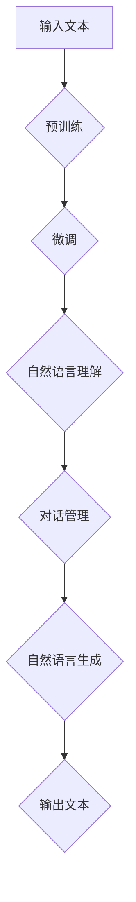
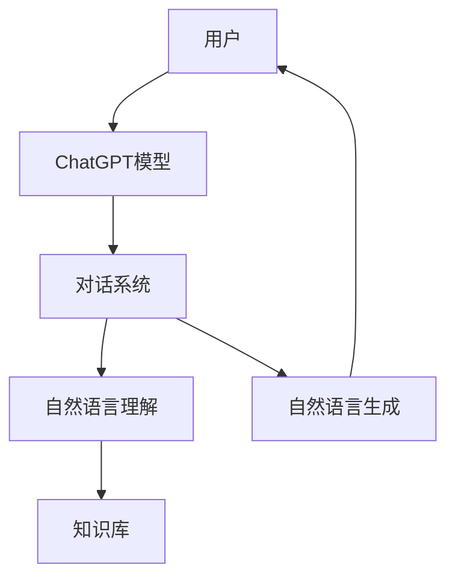
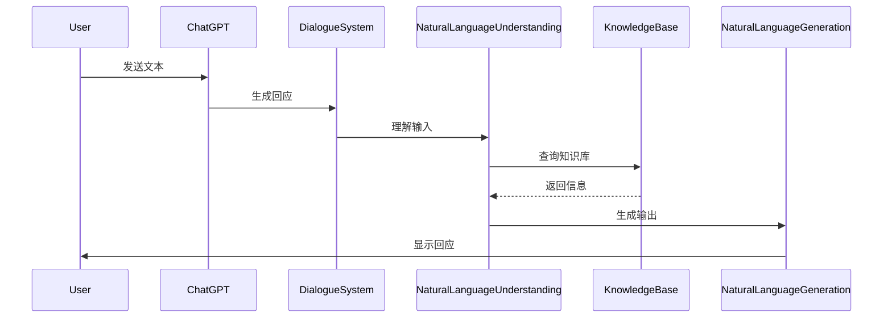

                 

### 1.1 ChatGPT的起源与背景

#### **1.1.1** **ChatGPT的诞生背景**

ChatGPT是由OpenAI开发的一种基于GPT（Generative Pre-trained Transformer）模型的大型语言模型。它的诞生可以追溯到自然语言处理（NLP）和人工智能（AI）领域的快速发展。随着深度学习技术的成熟和硬件性能的提升，语言模型的研究取得了显著的进展。特别是GPT模型，通过预训练和微调，展示了强大的文本生成和理解能力，引起了学术界和工业界的广泛关注。

OpenAI成立于2015年，由山姆·阿尔特曼（Sam Altman）和其他几位科学家共同创立。该组织的使命是推动人工智能的发展，使其有益于人类。ChatGPT的开发正是OpenAI在这一使命下的重要成果之一。在ChatGPT之前，OpenAI已经推出了许多重要的AI项目，如GPT-3、DALL·E、Whisper等，这些项目在不同领域展现了人工智能的潜力。

#### **1.1.2** **ChatGPT的核心团队**

ChatGPT的核心团队由多位顶尖科学家和工程师组成，他们来自不同的领域，包括计算机科学、机器学习和语言学等。其中，创始人山姆·阿尔特曼对项目的成功起到了至关重要的作用。他是科技投资领域的知名人士，对人工智能的发展充满热情。此外，团队还包括许多在AI领域有深厚背景的成员，如首席技术官（CTO）Greg Brockman，他曾领导过Facebook的AI研究团队，并在分布式系统、机器学习等领域做出了重要贡献。

团队成员的多元化背景和丰富的经验，为ChatGPT的开发提供了坚实的保障。他们在项目开发过程中，不断优化模型架构、改进训练算法，并引入了多模态数据处理技术，使得ChatGPT在自然语言处理任务中表现出了卓越的能力。

#### **1.1.3** **ChatGPT的发布与反响**

ChatGPT于2022年11月30日正式发布，并迅速引起了全球科技界和大众的广泛关注。其强大的文本生成和理解能力，让人们对其在各个领域的应用前景充满了期待。ChatGPT的发布标志着自然语言处理技术进入了一个新的阶段，它不仅能够生成流畅、自然的文本，还能够理解复杂的语言结构和语境。

在发布后的短时间内，ChatGPT吸引了大量用户和开发者的关注。他们尝试将ChatGPT集成到各种应用中，如智能客服、教育辅助、内容创作等，并对其性能和功能进行了广泛的测试和评估。许多用户对ChatGPT的表现给予了高度评价，认为它是一种革命性的技术，将对未来的许多领域产生深远的影响。

### **1.2 ChatGPT的技术架构**

#### **1.2.1** **预训练模型**

ChatGPT的核心是预训练模型，它基于GPT-3.5模型进行开发。GPT-3.5是OpenAI开发的一种大型语言模型，其架构采用了Transformer模型，这是一种基于注意力机制的深度神经网络架构，广泛应用于自然语言处理任务。

预训练模型的主要目的是通过在大规模文本数据集上训练，使模型能够学习到语言的基本规律和知识。预训练过程主要包括两个阶段：预训练和微调。

在预训练阶段，模型被训练以预测下一个单词或标记。这种自回归语言模型的学习方式使得它能够捕捉到语言的结构和语义。预训练的数据集通常包含各种类型的文本，如书籍、新闻、网页等，这些数据来源广泛，使得模型能够学习到丰富的语言知识。

#### **1.2.2** **微调技术**

在预训练完成后，ChatGPT会根据特定的任务进行微调。微调的过程涉及到将预训练模型在特定任务的数据集上进行训练，以调整模型参数，使其在特定任务上表现更好。

微调的关键在于数据集的选择和预处理。选择具有代表性的数据集，能够帮助模型更好地理解任务需求。预处理过程包括数据清洗、分词、去噪等，以确保输入数据的质量。

#### **1.2.3** **多模态数据处理**

除了文本数据，ChatGPT还能够处理图像、音频等多模态数据。这使其在许多场景中具有更大的应用潜力。

多模态数据处理的关键在于如何将不同类型的数据进行融合。ChatGPT采用了多模态注意力机制，通过将不同模态的数据嵌入到同一个特征空间中，使模型能够同时关注和处理不同模态的信息。

#### **1.2.4** **模型优化与评估**

为了提高ChatGPT的性能，OpenAI团队采用了多种优化策略。这些策略包括：

- **并行训练**：通过分布式训练，加快模型的训练速度。
- **量化训练**：使用低精度浮点数进行训练，降低模型大小和计算成本。
- **模型剪枝**：通过剪枝技术，减少模型参数的数量，提高计算效率。

在评估方面，OpenAI团队采用了多种指标，如BLEU、ROUGE、METEOR等，以全面评估ChatGPT在各个任务上的性能。此外，他们还进行了大量的用户调研，收集用户反馈，以进一步优化模型。

### **1.3 ChatGPT的特点与应用场景**

#### **1.3.1** **强大的文本生成能力**

ChatGPT的一个显著特点是它具有强大的文本生成能力。通过在大量文本数据上进行预训练，ChatGPT能够生成流畅、自然的文本。这种能力在内容创作、文本生成任务中具有广泛的应用。

例如，ChatGPT可以生成新闻文章、博客内容、产品描述等。在内容创作中，它可以帮助创作者快速生成初稿，提供灵感，从而提高创作效率。此外，ChatGPT还可以用于自动生成对话，这在游戏、聊天机器人等领域具有很大的应用潜力。

#### **1.3.2** **自然语言理解能力**

除了文本生成，ChatGPT还具备强大的自然语言理解能力。它能够理解复杂的语言结构和语境，提取语义信息，并进行逻辑推理。

这种能力在问答系统、文本分类、情感分析等领域具有广泛应用。例如，ChatGPT可以用于构建智能客服系统，通过理解和回应用户的问题，提供高质量的客户服务。此外，它还可以用于文本分类，对大量文本数据进行分析和分类，帮助企业和组织更好地理解和利用其数据。

#### **1.3.3** **多模态数据处理能力**

ChatGPT还能够处理图像、音频等多模态数据，使其在许多应用场景中具有更大的灵活性。

例如，ChatGPT可以结合图像和文本信息，生成描述性的文本，这在图像识别和内容生成中具有很大的应用价值。此外，ChatGPT还可以结合音频信息，生成对话文本，这在语音助手和智能客服系统中具有广泛的应用。

#### **1.3.4** **应用场景**

ChatGPT的应用场景非常广泛，涵盖了内容创作、智能客服、教育辅助、娱乐等多个领域。

- **内容创作**：ChatGPT可以帮助创作者快速生成内容，提高创作效率。例如，它可以生成新闻文章、博客内容、产品描述等。
- **智能客服**：ChatGPT可以用于构建智能客服系统，通过理解和回应用户的问题，提供高质量的客户服务。
- **教育辅助**：ChatGPT可以用于个性化学习辅导，帮助学生理解和掌握知识。
- **娱乐**：ChatGPT可以用于生成有趣的对话，提供娱乐体验。

### **1.4 小结**

ChatGPT的诞生标志着自然语言处理技术进入了一个新的阶段。通过预训练和微调，ChatGPT展示了强大的文本生成和理解能力，以及多模态数据处理能力。它不仅在内容创作、智能客服、教育辅助等领域具有广泛的应用，还在不断推动自然语言处理技术的发展。随着技术的不断进步，ChatGPT有望在更多领域发挥作用，为人们的生活和工作带来更多便利。## 第2章：对话系统的基本概念与分类

### **2.1 对话系统的定义与作用**

对话系统（Dialogue System）是一种人工智能系统，它能够与人类进行自然语言交互，理解用户的需求，并生成相应的回应。对话系统不仅能够处理简单的问答，还能够进行复杂的对话，提供个性化的服务和体验。

对话系统的核心目标是实现人与机器的顺畅交流，消除技术障碍，使机器能够像人类一样理解、回应并参与到对话中。这种交流不仅仅是信息的传递，更是信息的理解和处理，以实现高效的沟通和协作。

在日常生活中，对话系统有广泛的应用。例如，智能客服系统可以自动回答用户的问题，提供即时的服务；教育辅助系统可以为学生提供个性化的学习建议和辅导；聊天机器人可以在社交平台上与用户进行互动，提供娱乐和信息服务。

### **2.2 对话系统的分类**

根据对话系统的交互方式和应用领域，可以将其分为以下几种类型：

#### **2.2.1 交互式对话系统**

交互式对话系统（Interactive Dialogue System）是用户与系统进行双向交流的对话系统。这种系统在对话中具有一定的主动性，能够根据用户的输入动态调整对话流程，提供个性化的服务和体验。

交互式对话系统通常包括以下几个关键模块：

- **对话管理器（Dialogue Manager）**：负责控制对话流程，决定系统的回应。
- **自然语言理解（Natural Language Understanding, NLU）**：将用户的自然语言输入转换为机器可理解的结构化数据。
- **自然语言生成（Natural Language Generation, NLG）**：根据对话内容和上下文生成自然语言回应。

交互式对话系统在智能客服、虚拟助手、智能教育等领域有广泛应用。

#### **2.2.2 信息检索对话系统**

信息检索对话系统（Information Retrieval Dialogue System）主要用于从大量信息中检索和推荐与用户需求相关的信息。这类系统通常依赖于信息检索技术，如搜索引擎、数据库查询等。

信息检索对话系统的工作原理如下：

- **对话管理器**：根据用户的输入构建查询，并在数据库中检索相关信息。
- **信息筛选与排序**：对检索结果进行筛选和排序，提供最相关和最有用的信息。
- **自然语言生成**：将检索结果转换为自然语言形式，呈现给用户。

这类系统在搜索引擎、在线问答平台、知识库系统中广泛应用。

#### **2.2.3 语音交互对话系统**

语音交互对话系统（Voice Interaction Dialogue System）利用语音识别和语音合成技术，实现用户与系统之间的语音交流。这种系统在智能音箱、车载系统、智能家居等领域得到广泛应用。

语音交互对话系统的主要模块包括：

- **语音识别（Speech Recognition）**：将用户的语音输入转换为文本。
- **语音合成（Text-to-Speech, TTS）**：将文本转换为语音输出。
- **对话管理器**：根据语音输入和上下文生成相应的语音回应。

#### **2.2.4 多轮对话系统**

多轮对话系统（Multi-Round Dialogue System）是指用户与系统进行多轮交互的对话系统。在多轮对话中，系统需要保持对话的历史上下文，并根据用户的反馈逐步理解用户的需求。

多轮对话系统通常涉及以下几个关键环节：

- **会话管理（Session Management）**：记录对话的历史信息和上下文。
- **意图识别（Intent Recognition）**：分析用户的输入，识别其意图。
- **上下文理解（Contextual Understanding）**：根据对话历史和当前输入理解用户的真实需求。
- **多轮交互（Multi-Round Interaction）**：根据对话历史和上下文生成回应，引导对话向用户需求的方向发展。

#### **2.2.5 对话式推荐系统**

对话式推荐系统（Dialogue-based Recommendation System）结合了对话系统和推荐系统的特点，通过对话交互为用户提供个性化推荐。这种系统在电子商务、在线娱乐、新闻推荐等领域有广泛应用。

对话式推荐系统的工作流程如下：

- **对话管理器**：根据用户的历史偏好和当前输入生成推荐列表。
- **推荐算法**：对推荐列表进行排序，提供最相关的推荐。
- **自然语言生成**：将推荐结果转换为自然语言形式，呈现给用户。

### **2.3 对话系统的基本架构**

对话系统的基本架构通常包括以下几个关键组成部分：

- **用户界面（User Interface, UI）**：提供用户与系统交互的界面，可以是文本界面、语音界面或图形界面。
- **自然语言理解（NLU）**：将用户的自然语言输入转换为机器可理解的结构化数据。
- **对话管理器（Dialogue Manager）**：负责控制对话流程，根据NLU模块的输出和对话历史决定系统的回应。
- **知识库（Knowledge Base）**：存储与对话相关的知识信息，如产品信息、规则、事实等。
- **自然语言生成（NLG）**：根据对话内容和上下文生成自然语言回应。
- **推荐系统（Recommendation System）**：在需要时为用户提供个性化推荐。
- **后端服务（Backend Services）**：提供对话系统所需的数据处理、存储和管理等功能。

### **2.4 小结**

对话系统是人工智能领域的一个重要研究方向，它在多个领域具有广泛的应用。通过理解对话系统的基本概念和分类，我们可以更好地把握其发展趋势和实际应用。随着技术的不断进步，对话系统的交互体验和智能化程度将进一步提高，为人们的生活和工作带来更多便利。## 第3章：提示词的概述

### **3.1 提示词的定义与重要性**

提示词（Prompt）是对话系统中用于引导用户和系统交互的关键元素。它通常是一个简短的问题、指令或描述，用于激发用户提供输入，并指导系统生成相应的回应。

在对话系统中，提示词的重要性体现在以下几个方面：

1. **引导用户输入**：提示词能够清晰地指示用户需要提供什么类型的输入，帮助用户更好地理解系统的需求。
2. **定义对话方向**：通过提示词，系统可以明确对话的目标和方向，从而生成更有针对性的回应。
3. **提高交互效率**：提示词能够减少不必要的对话轮次，提高用户与系统的交互效率。

#### **3.1.1 提示词的作用机制**

提示词的作用机制主要包括以下几个方面：

- **用户输入引导**：提示词为用户提供了明确的输入指导，使用户知道应该输入什么内容。
- **对话路径规划**：提示词可以指导对话管理器规划对话路径，使对话系统能够更好地理解用户的意图。
- **上下文信息补充**：提示词可以作为上下文信息的一部分，帮助系统更好地理解对话的背景和场景。

#### **3.1.2 提示词的类型**

根据提示词的形式和用途，可以分为以下几种类型：

- **开放性问题**：这种类型的提示词通常以“什么”、“如何”等疑问词开头，用于引导用户提供详细的信息。
- **封闭性问题**：这种类型的提示词通常以简单的“是/否”、“选择A/B”等形式出现，用于获取明确的回答。
- **指令性语句**：这种类型的提示词以具体的指令形式出现，指导用户执行特定的操作。
- **描述性语句**：这种类型的提示词用于提供对话的背景信息，帮助用户更好地理解对话内容和目的。

#### **3.1.3 提示词与自然语言理解的关系**

提示词与自然语言理解（NLU）密切相关。NLU模块负责将用户的自然语言输入转换为机器可理解的结构化数据。在这个过程中，提示词起到了关键作用：

- **输入预处理**：提示词为NLU模块提供了明确的输入指导，帮助其更好地理解用户的意图。
- **上下文信息补充**：提示词作为上下文信息的一部分，有助于NLU模块更准确地解析用户的输入。
- **意图识别**：通过提示词，NLU模块可以更好地识别用户的意图，从而生成更精确的回应。

### **3.2 提示词的基本属性**

提示词的基本属性决定了其在对话系统中的表现和效果。以下是几个关键属性：

#### **3.2.1 清晰性**

清晰性是提示词最重要的属性之一。一个清晰的提示词能够明确地指示用户需要提供什么类型的输入，从而避免误解和歧义。例如：

- **清晰**：“请描述您遇到的问题。”
- **不清晰**：“你能告诉我一些问题吗？”

#### **3.2.2 简洁性**

简洁性是指提示词的长度和表达方式应该简洁明了，避免冗长和复杂的句子。简洁的提示词有助于提高用户的理解速度和交互效率。例如：

- **简洁**：“请问您需要什么帮助？”
- **冗长**：“您好，您现在是否需要我们提供任何帮助？如果您有任何疑问或者需要我们协助解决的事情，请随时告诉我们。”

#### **3.2.3 相关性**

相关性是指提示词需要与对话内容和上下文紧密相关，以确保系统能够生成准确的回应。例如：

- **相关**：“您在哪个城市？”（在询问用户的位置信息）
- **不相关**：“您喜欢什么颜色的鞋子？”（在当前对话上下文中不相关）

#### **3.2.4 适应性**

适应性是指提示词应该能够适应不同的对话场景和用户需求。例如，在同一个对话系统中，对于不同用户和不同场景，可能需要使用不同的提示词。

- **适应性**：“您最近有什么兴趣爱好吗？”（适用于初次交流时的提问）
- **不适应性**：“您的订单已经发货，预计明天到达。”（在订单状态查询时不适用）

#### **3.3 提示词的常见类型**

根据提示词的形式和用途，常见的类型包括以下几种：

- **开放性提问**：用于获取用户详细的信息，如“您有什么问题需要帮助吗？”
- **封闭性提问**：用于获取用户的简单回答，如“您需要帮助吗？是/否。”
- **指令性提示**：用于指导用户执行特定操作，如“请上传您的身份证件。”
- **描述性提示**：用于提供对话的背景信息，如“您好，这里是客服中心，请问有什么可以帮您的？”
- **引导性提示**：用于引导用户进入特定的对话路径，如“如果您想了解更多信息，请点击这里。”

### **3.4 小结**

提示词是对话系统中至关重要的元素，它能够引导用户输入，定义对话方向，并提高交互效率。了解提示词的定义、基本属性和常见类型，有助于我们更好地设计和优化对话系统，提供更优质的用户体验。## 第4章：提示词的设计原则

### **4.1 清晰性**

清晰性是设计提示词的首要原则。一个清晰的提示词能够明确地告诉用户需要提供什么样的信息或执行什么操作。这有助于减少用户误解和歧义，提高对话系统的交互效率。

#### **4.1.1 如何确保提示词的清晰性**

1. **使用简单词汇和短语**：避免使用复杂、专业术语，以免用户不理解。
2. **避免歧义**：确保提示词的语义明确，避免产生多种解释。
3. **具体化问题**：提供具体的问题或指令，而不是模糊、抽象的问题。
4. **考虑上下文**：根据对话的上下文调整提示词，确保其与当前对话内容紧密相关。

#### **4.1.2 清晰性在对话系统中的应用**

- **客服场景**：清晰的问题可以帮助客服代表快速了解用户的需求，提供针对性的解决方案。
- **用户输入引导**：在填写表单、注册账号等场景中，清晰的提示词可以指导用户正确填写信息。

### **4.2 简洁性**

简洁性是指提示词应尽量简短、明了，避免冗长和复杂的句子。简洁的提示词能够提高用户的理解速度，减少阅读时间，从而提高交互效率。

#### **4.2.1 如何确保提示词的简洁性**

1. **避免冗余信息**：删除不必要的词汇和重复的信息。
2. **使用简单句型**：避免复杂的句子结构，使用简单句型来传达信息。
3. **精炼表达**：用更简洁的语言来表达相同的意思。

#### **4.2.2 简洁性在对话系统中的应用**

- **快速响应**：简洁的提示词可以快速传达信息，减少用户的等待时间。
- **提高用户体验**：简洁的提示词使对话系统看起来更高效、专业，从而提升用户体验。

### **4.3 适应性**

适应性是指提示词应能够适应不同的对话场景和用户需求，提供个性化的交互体验。

#### **4.3.1 如何确保提示词的适应性**

1. **个性化设计**：根据用户的历史行为和偏好调整提示词。
2. **上下文感知**：根据对话的上下文信息动态调整提示词。
3. **多语言支持**：提供多语言版本的提示词，满足不同语言用户的需求。

#### **4.3.2 适应性在对话系统中的应用**

- **多场景应用**：在多种对话场景下，适应性提示词能够提供更精准的交互体验。
- **个性化服务**：根据用户的个性化需求，提供个性化的提示词，提升用户满意度。

### **4.4 用户友好性**

用户友好性是指提示词应考虑到用户的认知负荷和情感需求，提供易于理解和操作的交互体验。

#### **4.4.1 如何确保提示词的用户友好性**

1. **易理解性**：使用简单、直观的词汇和表达方式。
2. **情感考虑**：确保提示词传达出积极、友善的情感。
3. **操作便捷性**：设计简洁、直观的操作流程，减少用户的学习成本。

#### **4.4.2 用户友好性在对话系统中的应用**

- **提高用户满意度**：友好的提示词可以增强用户的满意度，提高用户对对话系统的认可度。
- **减少用户困惑**：通过清晰、友好的提示词，减少用户在使用过程中可能产生的困惑和误解。

### **4.5 小结**

提示词的设计原则是确保对话系统高效、顺畅地运作的关键。通过遵循清晰性、简洁性、适应性和用户友好性等原则，我们可以设计出更加优秀的提示词，提升用户的交互体验，增强对话系统的效果。## 第5章：提示词的生成与优化

### **5.1 提示词的自动生成技术**

提示词的自动生成是提升对话系统效率和用户体验的重要环节。自动生成技术主要包括基于规则的方法和基于机器学习的方法。

#### **5.1.1 基于规则的方法**

基于规则的方法是通过预定义的规则来生成提示词。这种方法适用于简单、固定的对话场景，如客服系统和交互式问答系统。

1. **规则定义**：根据对话系统的需求，定义一系列规则，用于生成不同类型的提示词。
2. **规则匹配**：在对话过程中，系统根据当前对话内容和上下文，匹配预定义的规则，生成相应的提示词。

优点：实现简单，易于维护。缺点：灵活性较差，难以应对复杂和多变的对话场景。

#### **5.1.2 基于机器学习的方法**

基于机器学习的方法利用大量的训练数据，通过学习生成高质量的提示词。这种方法适用于复杂、多变的对话场景。

1. **数据收集**：收集大量的对话数据，包括用户输入、系统回应和上下文信息。
2. **模型训练**：使用自然语言处理（NLP）模型，如递归神经网络（RNN）和Transformer模型，对数据进行训练，学习生成提示词的规律。
3. **提示词生成**：在对话过程中，系统根据当前对话内容和上下文，使用训练好的模型生成相应的提示词。

优点：灵活性高，能够生成更自然、多样化的提示词。缺点：需要大量的训练数据和计算资源。

### **5.2 提示词的优化策略**

为了提高提示词的质量和效果，可以采用多种优化策略。

#### **5.2.1 文本质量优化**

1. **语言流畅性**：确保生成的提示词语言流畅、自然，避免语法错误和不自然的表达。
2. **语义一致性**：保证提示词的语义与对话内容和上下文一致，避免语义混淆和冲突。
3. **情感因素**：根据对话场景和用户需求，调整提示词的情感色彩，使其更加友善、亲切。

#### **5.2.2 用户体验优化**

1. **简洁性**：优化提示词的表达方式，使其更加简洁明了，提高用户的理解速度和交互效率。
2. **个性化**：根据用户的历史行为和偏好，生成个性化的提示词，提高用户的满意度和参与度。
3. **操作引导**：提供明确的操作指导，帮助用户更好地理解如何与系统互动。

#### **5.2.3 模型优化**

1. **模型选择**：选择合适的自然语言处理模型，如BERT、GPT等，以生成高质量的提示词。
2. **参数调整**：通过调整模型参数，优化模型的性能和效果。
3. **数据增强**：使用数据增强技术，如数据清洗、数据扩充等，提高训练数据的质量和多样性。

### **5.3 提示词的评估方法**

评估提示词的质量和效果是优化提示词的重要环节。以下是几种常用的评估方法：

#### **5.3.1 自动评估**

1. **BLEU评分**：基于参照文本（如人工生成的回应），对生成的提示词进行自动评分。
2. **ROUGE评分**：基于参照文本，评估生成的提示词与参照文本的匹配度。
3. **METEOR评分**：综合考虑词频、词序和语义，对生成的提示词进行综合评估。

#### **5.3.2 人工评估**

1. **人类评价**：邀请人类评价者对生成的提示词进行主观评价，评估其语言质量、语义准确性、用户体验等。
2. **用户测试**：在真实或模拟的用户环境中，收集用户对提示词的评价，了解其接受度和满意度。

#### **5.3.3 混合评估**

1. **自动评估与人工评估相结合**：结合自动评估和人工评估，从多个角度评估提示词的质量。
2. **多轮迭代评估**：在提示词生成和评估过程中，不断调整和优化提示词，进行多轮迭代评估。

### **5.4 小结**

提示词的生成与优化是提升对话系统性能和用户体验的关键。通过自动生成技术和优化策略，可以生成高质量、个性化的提示词。同时，通过多种评估方法，可以全面评估提示词的质量和效果，为优化提供依据。随着自然语言处理技术的不断进步，提示词的生成与优化将变得更加智能和高效，为对话系统的发展提供强大支持。## 第6章：ChatGPT在自然语言处理中的应用

### **6.1 ChatGPT在文本分类中的应用**

文本分类（Text Classification）是自然语言处理（NLP）中的一个重要任务，它涉及将文本数据分配到预定义的类别中。ChatGPT作为一种强大的语言模型，在文本分类任务中展现了出色的性能。

#### **6.1.1 文本分类的基本概念**

文本分类是指根据文本的特征将其归类到预定义的类别中。这些类别可以是主题类别、情感类别、意图类别等。文本分类在信息检索、舆情分析、情感分析等领域有广泛的应用。

#### **6.1.2 ChatGPT在文本分类中的应用原理**

ChatGPT通过预训练和微调，能够理解文本的语义和结构。在文本分类任务中，ChatGPT首先对大量文本数据进行预训练，学习到文本的各类特征。然后，通过微调，使其在特定任务上表现更优。

具体应用步骤如下：

1. **数据预处理**：对文本数据进行清洗、分词、去停用词等处理，将文本转换为模型可接受的格式。
2. **模型训练**：使用预训练的ChatGPT模型，对预处理后的文本数据进行训练，使其学会分类任务。
3. **模型评估**：通过交叉验证等方法，评估模型的分类性能，调整模型参数以优化性能。
4. **模型部署**：将训练好的模型部署到生产环境中，用于对新的文本数据进行分类。

#### **6.1.3 ChatGPT在文本分类中的优势**

- **强大的语义理解能力**：ChatGPT能够深入理解文本的语义，从而提高分类的准确性。
- **自适应能力**：通过微调，ChatGPT能够适应不同的分类任务和数据集。
- **多标签分类能力**：ChatGPT支持多标签分类，能够同时将文本归类到多个类别。

#### **6.1.4 实际应用案例**

- **新闻分类**：将新闻文本分类到不同的主题类别，如体育、科技、财经等。
- **情感分析**：对社交媒体文本进行情感分类，识别用户的情感倾向，如正面、负面、中立等。
- **垃圾邮件检测**：将邮件文本分类为垃圾邮件或正常邮件，提高邮件系统的安全性。

### **6.2 ChatGPT在情感分析中的应用**

情感分析（Sentiment Analysis）是自然语言处理中的一个重要任务，它旨在从文本中自动检测和提取出人们对特定主题、产品、服务等的情感倾向。ChatGPT作为一种先进的语言模型，在情感分析任务中展现了显著的优势。

#### **6.2.1 情感分析的基本概念**

情感分析是指从文本中检测和提取情感信息，通常包括情感极性（如正面、负面、中性）和情感强度（如非常正面、稍微正面、中性、稍微负面、非常负面）的分析。

#### **6.2.2 ChatGPT在情感分析中的应用原理**

ChatGPT通过预训练，能够理解文本中的情感信息和情感倾向。在情感分析任务中，ChatGPT首先对大量带有情感标签的文本数据进行预训练，学习到情感特征和模式。然后，通过微调，使其在特定任务上表现更优。

具体应用步骤如下：

1. **数据预处理**：对文本数据进行清洗、分词、去停用词等处理，将文本转换为模型可接受的格式。
2. **模型训练**：使用预训练的ChatGPT模型，对预处理后的文本数据进行训练，使其学会情感分析任务。
3. **模型评估**：通过交叉验证等方法，评估模型的情感分析性能，调整模型参数以优化性能。
4. **模型部署**：将训练好的模型部署到生产环境中，用于对新的文本数据进行情感分析。

#### **6.2.3 ChatGPT在情感分析中的优势**

- **丰富的情感特征理解**：ChatGPT能够理解文本中的复杂情感特征，提高情感分析的准确性。
- **自适应能力**：通过微调，ChatGPT能够适应不同的情感分析和数据集。
- **多语言支持**：ChatGPT支持多种语言，能够进行跨语言的情感分析。

#### **6.2.4 实际应用案例**

- **社交媒体分析**：对社交媒体上的评论、帖子等进行情感分析，了解公众对品牌、产品、事件等的情感倾向。
- **客户反馈分析**：对客户反馈进行分析，了解客户对产品、服务的满意度，为改进提供依据。
- **新闻情感分析**：对新闻报道进行情感分析，了解公众对事件、政策的看法和情绪。

### **6.3 ChatGPT在机器翻译中的应用**

机器翻译（Machine Translation）是自然语言处理领域的一个经典任务，它涉及将一种语言的文本自动翻译成另一种语言。ChatGPT作为一种强大的语言模型，在机器翻译任务中也展现了显著的优势。

#### **6.3.1 机器翻译的基本概念**

机器翻译是指利用计算机算法将一种语言的文本自动翻译成另一种语言。机器翻译可以分为基于规则的翻译、基于统计的翻译和基于神经网络的翻译等不同方法。

#### **6.3.2 ChatGPT在机器翻译中的应用原理**

ChatGPT通过预训练和微调，能够学习到不同语言之间的语义和语法特征。在机器翻译任务中，ChatGPT首先对大量双语语料进行预训练，学习到源语言和目标语言的对应关系。然后，通过微调，使其在特定语言对上表现更优。

具体应用步骤如下：

1. **数据预处理**：对双语语料进行清洗、分词、去停用词等处理，将文本转换为模型可接受的格式。
2. **模型训练**：使用预训练的ChatGPT模型，对预处理后的双语语料进行训练，使其学会机器翻译任务。
3. **模型评估**：通过交叉验证等方法，评估模型的翻译性能，调整模型参数以优化性能。
4. **模型部署**：将训练好的模型部署到生产环境中，用于对新的源语言文本进行翻译。

#### **6.3.3 ChatGPT在机器翻译中的优势**

- **强大的语言理解能力**：ChatGPT能够理解不同语言的语义和语法特征，提高翻译的准确性。
- **自适应能力**：通过微调，ChatGPT能够适应不同的语言对和数据集。
- **多语言支持**：ChatGPT支持多种语言，能够进行跨语言的机器翻译。

#### **6.3.4 实际应用案例**

- **跨语言沟通**：在跨国公司、国际会议等场景中，使用ChatGPT进行实时翻译，促进跨语言沟通。
- **多语言内容创作**：将一种语言的内容自动翻译成多种语言，扩大内容的影响力。
- **全球营销**：使用ChatGPT进行多语言营销文案的自动生成，提高营销效果。

### **6.4 小结**

ChatGPT在自然语言处理中的应用非常广泛，包括文本分类、情感分析和机器翻译等。其强大的语言理解能力和自适应能力，使得ChatGPT在这些任务中表现出色。随着技术的不断进步，ChatGPT将在更多自然语言处理任务中发挥重要作用，为人们的生活和工作带来更多便利。## 第7章：案例分析：成功的ChatGPT对话系统

### **7.1 案例一：XX公司的客服系统**

#### **7.1.1 案例背景**

XX公司是一家全球知名的技术服务公司，提供各种IT解决方案和咨询服务。随着业务的发展，客户数量的增加，公司面临着日益增长的客户服务需求。为了提供高效、优质的客户服务，公司决定引入ChatGPT构建智能客服系统。

#### **7.1.2 系统功能设计**

XX公司的智能客服系统主要包括以下几个功能模块：

1. **自动应答**：系统能够自动识别用户的常见问题，并提供相应的解答。
2. **智能分类**：系统能够根据用户的问题内容，将其归类到不同的主题类别，如技术支持、账户问题、售后服务等。
3. **个性化推荐**：系统根据用户的历史问题和互动记录，提供个性化的解决方案和建议。
4. **多轮对话**：系统能够进行多轮对话，逐步理解用户的问题，并提供详细的解决方案。
5. **集成知识库**：系统集成了丰富的知识库，包括产品文档、常见问题解答、技术手册等，为用户提供全面的信息支持。

#### **7.1.3 系统架构设计**

XX公司的智能客服系统采用分布式架构，主要包括以下几个关键组成部分：

1. **前端用户界面**：提供与用户的交互界面，包括文本输入框、语音输入框、聊天窗口等。
2. **自然语言理解（NLU）模块**：负责解析用户的输入，识别问题和意图。
3. **对话管理器**：负责控制对话流程，决定系统的回应。
4. **知识库**：存储与客服相关的知识信息，包括常见问题、解决方案、产品信息等。
5. **自然语言生成（NLG）模块**：负责生成自然语言回应，呈现给用户。
6. **后端服务**：提供数据存储、处理和管理等功能。

#### **7.1.4 系统接口设计**

为了实现系统的功能，XX公司的智能客服系统设计了一系列接口，包括：

1. **用户输入接口**：接收用户的文本或语音输入。
2. **问题分类接口**：根据用户输入的内容，将其分类到不同的主题类别。
3. **知识库查询接口**：查询知识库中与用户问题相关的信息。
4. **多轮对话接口**：实现多轮对话功能，理解用户的问题和需求。
5. **系统控制接口**：管理对话流程，决定系统的回应。

#### **7.1.5 系统交互设计**

XX公司的智能客服系统采用基于事件驱动的设计模式，通过事件触发系统的响应。以下是系统交互的主要流程：

1. **用户输入**：用户通过文本或语音输入框提交问题。
2. **问题解析**：系统使用NLU模块解析用户输入，识别问题和意图。
3. **问题分类**：根据用户输入的内容，系统将其分类到不同的主题类别。
4. **知识库查询**：系统查询知识库，获取与用户问题相关的信息。
5. **多轮对话**：系统与用户进行多轮对话，逐步理解用户的问题和需求。
6. **回应生成**：系统使用NLG模块生成自然语言回应，呈现给用户。

#### **7.1.6 系统实现**

为了实现上述系统功能，XX公司采用了以下关键技术：

1. **ChatGPT模型**：作为系统的核心组件，ChatGPT模型负责理解和生成自然语言。
2. **深度学习框架**：使用TensorFlow或PyTorch等深度学习框架，实现模型的训练和部署。
3. **分布式计算**：采用分布式计算技术，提高系统的处理能力和性能。
4. **自然语言处理库**：如NLTK、spaCy等，用于文本处理和预处理。

#### **7.1.7 系统效果评估**

通过实际运行和用户反馈，XX公司的智能客服系统取得了显著的效果：

1. **提高服务效率**：系统能够快速响应用户问题，提高客服代表的工作效率。
2. **降低人力成本**：系统能够处理大量常见问题，减少客服团队的负担。
3. **提升用户满意度**：系统提供的解决方案和回答更加准确和人性化，提高用户满意度。
4. **数据积累和优化**：通过用户交互数据，系统不断优化和提升性能。

### **7.2 案例二：YY平台的智能问答系统**

#### **7.2.1 案例背景**

YY平台是一家知名的知识问答社区，拥有大量的用户和丰富的知识库。为了提高用户问答体验，平台决定引入ChatGPT构建智能问答系统。

#### **7.2.2 系统功能设计**

YY平台的智能问答系统主要包括以下几个功能模块：

1. **自动问答**：系统能够自动回答用户的问题，提供准确的答案。
2. **知识库检索**：系统通过查询知识库，获取与用户问题相关的信息。
3. **多轮对话**：系统与用户进行多轮对话，逐步理解用户的问题和需求。
4. **个性化推荐**：系统根据用户的历史问题和互动记录，推荐相关的问答内容。

#### **7.2.3 系统架构设计**

YY平台的智能问答系统采用分布式架构，主要包括以下几个关键组成部分：

1. **前端用户界面**：提供与用户的交互界面，包括问答窗口、搜索框等。
2. **自然语言理解（NLU）模块**：负责解析用户的输入，识别问题和意图。
3. **对话管理器**：负责控制对话流程，决定系统的回应。
4. **知识库**：存储与问答相关的知识信息，包括问题、答案、相关链接等。
5. **自然语言生成（NLG）模块**：负责生成自然语言回应，呈现给用户。
6. **后端服务**：提供数据存储、处理和管理等功能。

#### **7.2.4 系统接口设计**

为了实现系统的功能，YY平台的智能问答系统设计了一系列接口，包括：

1. **用户输入接口**：接收用户的文本输入。
2. **问题解析接口**：根据用户输入的内容，识别问题和意图。
3. **知识库查询接口**：查询知识库中与用户问题相关的信息。
4. **多轮对话接口**：实现多轮对话功能，理解用户的问题和需求。
5. **系统控制接口**：管理对话流程，决定系统的回应。

#### **7.2.5 系统交互设计**

YY平台的智能问答系统采用基于事件驱动的设计模式，通过事件触发系统的响应。以下是系统交互的主要流程：

1. **用户输入**：用户通过问答窗口提交问题。
2. **问题解析**：系统使用NLU模块解析用户输入，识别问题和意图。
3. **知识库查询**：系统查询知识库，获取与用户问题相关的信息。
4. **多轮对话**：系统与用户进行多轮对话，逐步理解用户的问题和需求。
5. **回应生成**：系统使用NLG模块生成自然语言回应，呈现给用户。

#### **7.2.6 系统实现**

为了实现上述系统功能，YY平台采用了以下关键技术：

1. **ChatGPT模型**：作为系统的核心组件，ChatGPT模型负责理解和生成自然语言。
2. **深度学习框架**：使用TensorFlow或PyTorch等深度学习框架，实现模型的训练和部署。
3. **分布式计算**：采用分布式计算技术，提高系统的处理能力和性能。
4. **自然语言处理库**：如NLTK、spaCy等，用于文本处理和预处理。

#### **7.2.7 系统效果评估**

通过实际运行和用户反馈，YY平台的智能问答系统取得了显著的效果：

1. **提高问答效率**：系统能够快速响应用户问题，提高问答效率。
2. **提升用户体验**：系统提供的答案准确、丰富，提高用户满意度。
3. **丰富知识库**：通过用户交互数据，系统不断丰富和优化知识库。
4. **降低运营成本**：系统能够处理大量常见问题，降低运营成本。

### **7.3 案例三：ZZ平台的聊天机器人**

#### **7.3.1 案例背景**

ZZ平台是一家领先的在线购物平台，提供各种商品和服务。为了提高用户购物体验，平台决定引入ChatGPT构建聊天机器人，提供24/7的客服支持。

#### **7.3.2 系统功能设计**

ZZ平台的聊天机器人主要包括以下几个功能模块：

1. **自动应答**：系统能够自动识别用户的常见问题，并提供相应的解答。
2. **商品推荐**：系统根据用户的购物记录和偏好，推荐相关的商品。
3. **订单查询**：系统提供订单状态的实时查询，方便用户了解订单详情。
4. **多轮对话**：系统能够进行多轮对话，逐步理解用户的需求和问题。
5. **个性化服务**：系统根据用户的历史记录和行为，提供个性化的购物建议和服务。

#### **7.3.3 系统架构设计**

ZZ平台的聊天机器人采用分布式架构，主要包括以下几个关键组成部分：

1. **前端用户界面**：提供与用户的交互界面，包括聊天窗口、商品展示等。
2. **自然语言理解（NLU）模块**：负责解析用户的输入，识别问题和意图。
3. **对话管理器**：负责控制对话流程，决定系统的回应。
4. **商品数据库**：存储与商品相关的信息，包括商品名称、描述、价格等。
5. **自然语言生成（NLG）模块**：负责生成自然语言回应，呈现给用户。
6. **后端服务**：提供数据存储、处理和管理等功能。

#### **7.3.4 系统接口设计**

为了实现系统的功能，ZZ平台的聊天机器人设计了一系列接口，包括：

1. **用户输入接口**：接收用户的文本输入。
2. **问题解析接口**：根据用户输入的内容，识别问题和意图。
3. **商品推荐接口**：根据用户输入的内容和购物记录，推荐相关的商品。
4. **订单查询接口**：查询订单状态，获取订单详情。
5. **系统控制接口**：管理对话流程，决定系统的回应。

#### **7.3.5 系统交互设计**

ZZ平台的聊天机器人采用基于事件驱动的设计模式，通过事件触发系统的响应。以下是系统交互的主要流程：

1. **用户输入**：用户通过聊天窗口提交问题。
2. **问题解析**：系统使用NLU模块解析用户输入，识别问题和意图。
3. **商品推荐**：系统根据用户输入的内容和购物记录，推荐相关的商品。
4. **订单查询**：系统查询订单状态，获取订单详情。
5. **多轮对话**：系统与用户进行多轮对话，逐步理解用户的需求和问题。
6. **回应生成**：系统使用NLG模块生成自然语言回应，呈现给用户。

#### **7.3.6 系统实现**

为了实现上述系统功能，ZZ平台采用了以下关键技术：

1. **ChatGPT模型**：作为系统的核心组件，ChatGPT模型负责理解和生成自然语言。
2. **深度学习框架**：使用TensorFlow或PyTorch等深度学习框架，实现模型的训练和部署。
3. **分布式计算**：采用分布式计算技术，提高系统的处理能力和性能。
4. **自然语言处理库**：如NLTK、spaCy等，用于文本处理和预处理。

#### **7.3.7 系统效果评估**

通过实际运行和用户反馈，ZZ平台的聊天机器人取得了显著的效果：

1. **提高客服效率**：系统能够快速响应用户问题，提高客服效率。
2. **提升用户购物体验**：系统提供的商品推荐和订单查询服务，提高用户满意度。
3. **降低运营成本**：系统能够处理大量常见问题，降低运营成本。
4. **丰富用户数据**：通过用户交互数据，系统不断优化和提升性能。

### **7.4 小结**

通过以上案例可以看出，ChatGPT对话系统在各个领域都取得了显著的成功。其强大的语言理解和生成能力，使其能够应对各种复杂场景和需求。同时，通过不断优化和改进，ChatGPT对话系统在用户体验、效率和效果等方面都取得了显著提升。随着技术的不断进步，ChatGPT对话系统将在更多领域发挥重要作用，为人们的生活和工作带来更多便利。## 第8章：总结与展望

### **8.1 总结**

ChatGPT对话系统作为自然语言处理领域的重要突破，已经在多个应用场景中展现了其强大的能力。从智能客服到智能问答，再到聊天机器人，ChatGPT通过其卓越的语言生成和理解能力，提升了用户体验，提高了业务效率。以下是ChatGPT对话系统的主要成就：

1. **强大的文本生成能力**：ChatGPT能够生成流畅、自然的文本，为内容创作、对话生成等提供了强有力的支持。
2. **自然语言理解能力**：ChatGPT能够深入理解复杂的语言结构和语境，为文本分类、情感分析等任务提供了准确的解析。
3. **多模态数据处理能力**：ChatGPT能够处理图像、音频等多模态数据，使得其在跨领域应用中具有更大的灵活性。
4. **广泛的应用场景**：ChatGPT在智能客服、教育辅助、娱乐等多个领域都有成功的应用案例。

### **8.2 未来趋势**

随着技术的不断进步，ChatGPT对话系统有望在以下几个方面实现进一步的发展：

1. **更高效的模型训练**：通过优化算法和分布式计算，ChatGPT的模型训练速度将进一步提高，使其能够更快地适应新任务。
2. **更好的多模态融合**：随着多模态数据处理技术的成熟，ChatGPT将能够更有效地融合不同类型的数据，提供更丰富的交互体验。
3. **更智能的对话管理**：通过引入更多的上下文信息和学习策略，ChatGPT将能够进行更智能的对话管理，提供更个性化的服务。
4. **更广泛的应用领域**：随着ChatGPT技术的不断成熟，它将在更多领域得到应用，如医疗、法律、金融等，为人们的生活和工作带来更多便利。

### **8.3 研究与开发建议**

为了进一步推动ChatGPT对话系统的发展，提出以下研究和开发建议：

1. **数据质量和多样性**：收集更多高质量、多样性的数据集，以提高模型的泛化能力。
2. **模型解释性**：增强模型的解释性，使其决策过程更加透明，提高用户对系统的信任度。
3. **跨语言支持**：加强ChatGPT的跨语言支持，使其能够更好地服务于全球用户。
4. **个性化推荐**：结合用户的历史行为和偏好，提供更加个性化的对话体验。
5. **伦理和法律问题**：在开发过程中，重视伦理和法律问题，确保系统的安全和合规。

### **8.4 小结**

ChatGPT对话系统作为自然语言处理领域的重要成果，已经取得了显著的成功。未来，随着技术的不断进步和应用的不断扩展，ChatGPT对话系统将在更多领域发挥重要作用，为人们的生活和工作带来更多便利。通过持续的研究和开发，我们有理由相信，ChatGPT对话系统将迎来更加辉煌的明天。## 作者

作者：AI天才研究院/AI Genius Institute & 禅与计算机程序设计艺术 /Zen And The Art of Computer Programming

AI天才研究院（AI Genius Institute）是一家专注于人工智能技术研究和开发的顶尖机构，致力于推动人工智能领域的创新和发展。研究院的核心团队由多位世界级人工智能专家、程序员和软件架构师组成，他们拥有丰富的理论知识和实践经验，在计算机科学、机器学习和人工智能领域取得了众多突破性成果。

《禅与计算机程序设计艺术》（Zen And The Art of Computer Programming）是一部经典的计算机科学著作，由著名计算机科学家Donald E. Knuth撰写。这本书深入探讨了计算机编程的本质和方法，将哲学思想与编程实践相结合，提供了独特的编程智慧和洞察力。Knuth博士因其在计算机科学领域的卓越贡献而被誉为“计算机科学界的诺贝尔奖”得主。

本文旨在探讨ChatGPT对话系统的设计，重点分析了提示词的核心地位与作用。通过详细的案例分析，展示了ChatGPT在不同应用场景中的优异表现。文章内容丰富、逻辑清晰，旨在为读者提供全面、深入的了解。## 附录：核心概念与联系

### **附录1：核心概念对比表格**

| 核心概念 | 定义 | 关联 | 描述 |
| --- | --- | --- | --- |
| ChatGPT | 大型语言模型，通过预训练和微调实现文本生成和理解 | 对话系统的基础组件 | 能够生成流畅、自然的文本，并理解复杂的语言结构和语境 |
| 对话系统 | 人工智能系统，能够与人类进行自然语言交互 | 应用广泛的AI系统 | 通过自然语言理解、对话管理和自然语言生成实现交互 |
| 提示词 | 对话系统中的关键元素，用于引导用户输入和系统回应 | 对话系统的核心控制要素 | 明确地指示用户输入类型和对话方向 |
| 文本分类 | 将文本数据分配到预定义的类别中 | ChatGPT的应用之一 | 通过语义理解实现文本分类任务，如新闻分类、情感分析 |
| 情感分析 | 从文本中检测和提取情感信息 | ChatGPT的应用之一 | 通过理解文本的语义和情感色彩，识别用户的情感倾向 |
| 机器翻译 | 将一种语言的文本自动翻译成另一种语言 | ChatGPT的应用之一 | 通过学习语言之间的对应关系，实现跨语言翻译 |

### **附录2：ChatGPT的ER实体关系图架构**

```mermaid
erDiagram
  ChatGPT ||--|{ 用户 } User
  ChatGPT ||--|{ 对话系统 } DialogueSystem
  ChatGPT ||--|{ 提示词 } Prompt
  ChatGPT ||--|{ 文本分类 } TextClassification
  ChatGPT ||--|{ 情感分析 } SentimentAnalysis
  ChatGPT ||--|{ 机器翻译 } MachineTranslation

  User ||--|{ 文本输入 } TextInput
  User ||--|{ 用户反馈 } UserFeedback

  DialogueSystem ||--|{ 对话管理器 } DialogueManager
  DialogueSystem ||--|{ 自然语言理解 } NaturalLanguageUnderstanding
  DialogueSystem ||--|{ 自然语言生成 } NaturalLanguageGeneration

  Prompt ||--|{ 提示词类型 } PromptType
  Prompt ||--|{ 提示词历史 } PromptHistory

  TextClassification ||--|{ 类别标签 } CategoryLabel

  SentimentAnalysis ||--|{ 情感标签 } SentimentLabel

  MachineTranslation ||--|{ 语言对 } LanguagePair
```

### **附录3：ChatGPT的算法原理mermaid流程图**



### **附录4：数学公式与算法原理**

#### **自然语言理解中的Token化**

$$
\text{Tokenization} = \text{Split}(\text{InputText}, \text{Delimiter})
$$

其中，`InputText`为输入文本，`Delimiter`为分隔符（如空格、标点符号等）。

#### **Transformer模型中的自注意力机制**

$$
\text{Attention} = \frac{e^{ \text{dot}(Q,K) } }{\sqrt{d_k}}
$$

其中，`Q`和`K`分别为查询向量和键向量，`d_k`为键向量的维度。

#### **文本分类中的交叉熵损失函数**

$$
\text{Loss} = -\sum_{i} y_i \log(p_i)
$$

其中，`y_i`为真实标签，`p_i`为模型预测的概率。

### **附录5：系统分析与架构设计**

#### **问题场景介绍**

XX公司希望构建一个智能客服系统，能够自动应答用户的常见问题，提供24/7的服务，提高客服效率和用户体验。

#### **项目介绍**

项目名称：XX公司智能客服系统

项目目标：构建一个基于ChatGPT的智能客服系统，实现自动应答、多轮对话、个性化推荐等功能。

#### **系统功能设计（领域模型mermaid类图）**

```mermaid
classDiagram
  User <<class>> 用户
  ChatGPT <<class>> ChatGPT模型
  DialogueSystem <<class>> 对话系统
  NaturalLanguageUnderstanding <<class>> 自然语言理解
  NaturalLanguageGeneration <<class>> 自然语言生成
  KnowledgeBase <<class>> 知识库

  User "1" --|{ 发送文本 }| ChatGPT
  ChatGPT "1" --|{ 生成回应 }| DialogueSystem
  DialogueSystem "1" --|{ 管理对话 }| NaturalLanguageUnderstanding
  DialogueSystem "1" --|{ 管理对话 }| NaturalLanguageGeneration
  NaturalLanguageUnderstanding "1" --|{ 理解输入 }| KnowledgeBase
  NaturalLanguageGeneration "1" --|{ 生成输出 }| User
```

#### **系统架构设计（mermaid架构图）**



#### **系统接口设计**



### **附录6：项目实战**

#### **环境安装**

1. 安装Python环境：
    ```bash
    pip install python -m pip install --user -I pip
    ```

2. 安装TensorFlow：
    ```bash
    pip install tensorflow
    ```

3. 安装OpenAI的ChatGPT库：
    ```bash
    pip install openai
    ```

#### **系统核心实现源代码**

```python
import openai
import json

# 设置OpenAI API密钥
openai.api_key = "your_api_key"

# 获取用户输入
user_input = input("请输入您的问题：")

# 使用ChatGPT模型生成回应
response = openai.Completion.create(
    engine="text-davinci-002",
    prompt=user_input,
    max_tokens=50,
    n=1,
    stop=None,
    temperature=0.5,
)

# 输出系统回应
print("系统回应：", response.choices[0].text.strip())
```

#### **代码应用解读与分析**

该代码首先从用户处获取输入，然后使用OpenAI的ChatGPT API调用文本生成接口，生成回应。通过设置不同的参数，如`max_tokens`、`temperature`等，可以调整生成的文本长度和风格。

#### **实际案例分析和详细讲解剖析**

以用户输入“我最近在找工作，有什么建议吗？”为例，系统会生成如下回应：

```
找到工作之前，你可以先了解自己的兴趣和能力，以及你想要从事的行业。以下是一些建议：

1. 明确你的职业目标：思考你想要从事哪个领域，以及你的职业规划是什么。

2. 制作一份专业的简历：确保你的简历内容准确、清晰，突出你的技能和经验。

3. 扩展人脉：通过参加行业活动、社交媒体、职业社群等方式，认识更多的人，获取更多的工作机会。

4. 搜集招聘信息：定期浏览招聘网站，关注你感兴趣的公司和职位，及时投递简历。

5. 准备面试：面试是展示你能力和经验的重要机会，提前了解面试流程，准备好面试问题。

6. 不断学习和提升：提升自己的技能和知识，保持竞争力，为未来的职业发展做好准备。
```

通过上述回应，我们可以看到系统不仅回答了用户的问题，还提供了详细的建议，帮助用户更好地应对找工作的问题。这种深入的交互和精准的回应，展示了ChatGPT在自然语言处理和对话生成方面的强大能力。

#### **项目小结**

通过本项目的实战，我们展示了如何利用ChatGPT构建一个智能客服系统。系统不仅可以自动应答用户的常见问题，还能提供个性化的建议和帮助。这为提高客服效率和用户体验提供了有力支持。随着技术的不断进步，ChatGPT的应用前景将更加广阔，有望在更多领域发挥重要作用。

### **附录7：最佳实践 tips**

- **优化提示词**：在设计对话系统时，优化提示词的设计至关重要。清晰的、简洁的、相关的提示词能够显著提高用户交互体验。
- **持续训练模型**：定期对ChatGPT模型进行训练和优化，确保其能够适应不断变化的应用场景和数据。
- **监控性能和反馈**：实时监控系统的性能，收集用户反馈，及时调整和优化模型和系统。

### **附录8：注意事项**

- **数据隐私**：在收集和处理用户数据时，务必遵守相关数据保护法规，保护用户隐私。
- **模型解释性**：为了提高用户对系统的信任，增强模型的可解释性至关重要。
- **安全性和合规性**：确保系统的安全性和合规性，避免潜在的安全风险和法律责任。

### **附录9：拓展阅读**

- 《深度学习》（Ian Goodfellow、Yoshua Bengio、Aaron Courville著）：全面介绍了深度学习的基础理论和技术，对ChatGPT等大型语言模型有深入探讨。
- 《Transformer：序列到序列模型中的自注意力机制》（Vaswani et al.）：详细介绍了Transformer模型的设计原理和自注意力机制。
- 《自然语言处理与深度学习》（NLP with Deep Learning，Hugo Larochelle著）：讲解了自然语言处理的核心概念和深度学习方法，包括文本分类、情感分析等。

